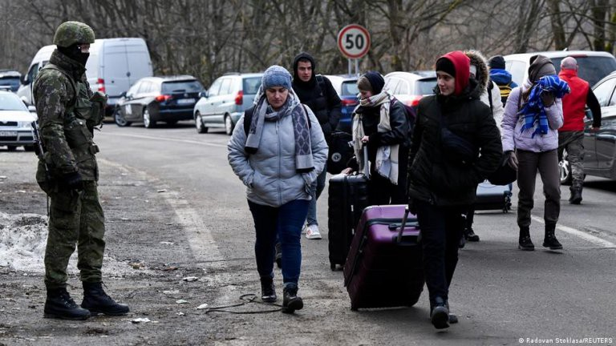

### AYS Digest 21/10/22: Privilege Style Finally Comes to its Senses

Mixed Migration Quarterly update published//EU Migration Forum discussed integration of young refugees//Increase in interceptions of individuals crossing into Slovakia//A small village in Southern Italy, Camini, has flourished due to migrant communities//and much more…

Source: The Morning Star, Campaigners celebrate victory after ‘last resort’ airline pulls out of government’s Rwanda deportation scheme
#### FEATURE
### Privilege Style airlines has finally pulled out of flying asylum seekers from the UK to Rwanda\! \!

■■■■■■■■■■■■■■ 
> **[Freedom from Torture🧡](https://twitter.com/FreefromTorture) @ Twitter Says:** 

> > 🚨BREAKING: WE WON!!!

Privilege Style - the airline whose plane was ready to fly to Rwanda in June - has confirmed they WILL NOT fly any refugees to Rwanda!

People power WORKS! 
Now let’s defeat this cruel scheme altogether. 

> **Tweeted at [2022-10-21 10:44:28](https://twitter.com/freefromtorture/status/1583408873377239040).** 

■■■■■■■■■■■■■■ 

After mounting pressure from activist groups and organisations, led by Freedom from Torture, the airline officials have made a statement saying that they do not plan to follow through with their initial agreements in the Rwanda deal\.

Source: The Guardian, ‘A Spanish\-registered Privilege Style Boeing 767 at Boscombe Down, Wiltshire, in June when it was due to take seven asylum seekers to Rwanda’

This is a significant step in dismantling the horrific government initiative, and many hope it will lead on to the downfall and breakdown of the Rwanda deal\.

■■■■■■■■■■■■■■ 
> **[Kolbassia Haoussou MBE](https://twitter.com/haoussou) @ Twitter Says:** 

> > WE DID IT!!

The airline hired for the Rwanda scheme has pulled out. 

INCREDIBLE 🥳🥳🥳

https://t.co/jyker9Wa3h 

> **Tweeted at [2022-10-21 11:53:54](https://twitter.com/haoussou/status/1583426348663480320).** 

■■■■■■■■■■■■■■ 

However, due to the political uncertainty in the UK at this time, including the resignation of the Prime Minister and the Home Secretary, it is unclear as to who will take up these positions and whether they will continue to have such a tough and inhumane approach to migration policy\. The future of the Rwanda deal is uncertain but still a very concerning issue, as well as the policies and mechanisms preventing asylum seekers entering the UK through irregular routes, such as by crossing the Channel\.

[Airline pulls out of operating UK’s Rwanda deportation flights \(msn\.com\)](https://www.msn.com/en-gb/travel/news/airline-pulls-out-of-operating-uk-e2-80-99s-rwanda-deportation-flights/ar-AA13egs5)
#### GENERAL
### Mixed Migration Quarterly Update

This Quarterly Update covers migration trends and policies in the North African region\.

It delves into the relationship between Morocco and the EU, the aftermath of the events in Melilla, boat interceptions at sea from Libya, and the expulsions from Algeria\.

#### EU
### EU Migration Forum

Exclusion of young refugees was at the heart of the discussions last week\. Topics covered included: access to education and training, promoting participation and engagement, and the general challenges to integration\.

■■■■■■■■■■■■■■ 
> **[Karolis_Zibas](https://twitter.com/Karolis_Zibas) @ Twitter Says:** 

> > Great discussions on how to support the integration of refugee and immigrant youth. Great to see @[JenniTnainen](https://twitter.com/JenniTnainen) from @[VantaanKaupunki](https://twitter.com/VantaanKaupunki) sharing their experience in integrating refugees. Thanks to @[EurMigrForum](https://twitter.com/EurMigrForum) for this excellent platform! https://t.co/1dfPO2lse8 

> **Tweeted at [2022-10-21 13:10:07](https://twitter.com/karolis_zibas/status/1583445527554768899).** 

■■■■■■■■■■■■■■ 

#### GREECE
### Six people accused of people smuggling had their trials in Samos

Two were acquitted and three were released on suspended sentences\.

Nonetheless, they have spent several years in prison already\.

■■■■■■■■■■■■■■ 
> **[borderline-europe](https://twitter.com/BorderlineEurop) @ Twitter Says:** 

> > Six people criminalised as #smugglers for driving the boat had their trials in #Samos alone this week, luckily with our knowledge so we could support them together with the Human Rights Legal Project! 
Two were acquitted, three were released on suspended sentences! 🥳 1/4 https://t.co/K1HHDaoBKR 

> **Tweeted at [2022-10-20 15:30:04](https://twitter.com/borderlineeurop/status/1583118358756528128).** 

■■■■■■■■■■■■■■ 

### A boat in distress, carrying 75 individuals, contacted Aegean Boat Report

■■■■■■■■■■■■■■ 
> **[Aegean Boat Report](https://twitter.com/ABoatReport) @ Twitter Says:** 

> > Yesterday a sailboat carrying 75 people was in distress off the southern tip of Greek mainland and contracted Aegean Boat Report for assistance. [facebook.com/10006485172463…](https://www.facebook.com/100064851724634/posts/pfbid02cX6uxX5YCMd4WFTZ4WziyAdzbbeF1u2331HphYWZPguEq1ZfrKG2Udvir38rWcml/?d=n) https://t.co/MXhI8t5ayG 

> **Tweeted at [2022-10-21 12:18:41](https://twitter.com/aboatreport/status/1583432582754054145).** 

■■■■■■■■■■■■■■ 

Aegean Boat Report have also published an article on children who are included in the groups being pushed back at Greek borders\. They provide detailed examples of previous pushbacks that have involved young children and babies\. The Greek government are in direct violation of international and European law, disregarding the right to life, and putting the lives of young children in severe danger\.

[Children Phused Back at Gunpoint by Greek Authorities — Aegean Boat Report](https://aegeanboatreport.com/2022/10/21/children-phused-back-at-gunpoint-by-greek-authorities/)
#### SLOVAKIA
### Increase in interceptions of individuals crossing into Slovakia

Between 10th and 18th October, [435 undocumented persons were intercepted, and two smugglers were detained](https://www.infomigrants.net/en/post/44180/border-controls-in-slovakia-lead-to-increased-interception-of-migrant-entries) during border police patrols\.

At the end of September, Czechia imposed temporary border checks that were supposed to be temporary but are still in place\.

Under the policy, people will be banned from crossing the border at any other place along the 251\-kilometer \(155\-mile\) border, with exceptions for farmers, foresters and fishermen working at the border areas\. With an increase in border controls on both sides of the border, the interception of undocumented migration has become more prevalent\.

Other countries, such as, Austria, Hungary, and Slovenia have also imposed temporary border checks with the goal of intercepting more undocumented persons\.

Obviously, these recent increases in border control aim to prevent non\-European asylum seekers, rather than Ukrainian individuals\. Since the war broke out, Slovakia, along with Czechia and Poland, have been major destinations for Ukrainians fleeing the war\.

Source: InfoMigrants, _Refugees from Ukraine have been crossing at land borders of neighboring countries, like Slovakia_
#### ITALY
### A small village in Southern Italy, Camini, has flourished due to migrant communities

In the 1990s, many inhabitants left Camini, leaving the once lively, bubbly village desolate and quiet\. In the last few years, an influx of migrants from a range of backgrounds has created a dynamic, vibrant place to live\.

> Today about 150 migrants, from Afghanistan, Morocco, Tunisia, Libya, South Sudan, Pakistan, Bangladesh, Nigeria and Syria, live in Camini, making it one of the municipalities on the peninsula with the highest rate of immigrants among its population\. Their presence alone has sparked an outpouring of solidarity from organizations that have injected money into the village coffers\. 

Rosario Zurzolo, a Camini local, co\-founded the EuroCoop Camini Cooperative to encourage individuals to stay in Camini through financial support and economic opportunities\. The cooperative employs 18 refugees who run workshops in ceramics, woodwork, clothing, and art\.

> We wouldn’t be here without the migrants\. Everyone would have left Camini — Rosaro Zurzolo 

[‘Without them, we wouldn’t be here anymore’: a small village in Calabria survives with the help of migrants — InfoMigrants](https://www.infomigrants.net/en/post/44121/without-them-we-wouldnt-be-here-anymore-a-small-village-in-calabria-survives-with-the-help-of-migrants)
#### SEA/SAR
### Explosion on a boat in Malta’s SAR zone; two people have died

■■■■■■■■■■■■■■ 
> **[Alarm Phone](https://twitter.com/alarm_phone) @ Twitter Says:** 

> > ⚫ Deaths off #Lampedusa

There was an explosion on a boat travelling through #Malta SAR, close to Italy's SAR zone. 2 persons died, several persons are feared missing. While we can't say for sure yet, we believe it was be a boat we alerted authorities to yesterday. 
#BordersKill 

> **Tweeted at [2022-10-21 16:04:53](https://twitter.com/alarm_phone/status/1583489509232373760).** 

■■■■■■■■■■■■■■ 

### A boat, carrying 32 people, left adrift in the Mediterranean

■■■■■■■■■■■■■■ 
> **[Alarm Phone](https://twitter.com/alarm_phone) @ Twitter Says:** 

> > 🆘! ~32 people adrift off #Benghazi! 

AlarmPhone is in contact with a boat in distress. The group fled from #Libya but ran out of fuel and is drifting in international waters. Wind and waves are increasing and we fear for their lives! Rescue is needed now! https://t.co/FLdPyRwST8 

> **Tweeted at [2022-10-21 08:32:37](https://twitter.com/alarm_phone/status/1583375692125069317).** 

■■■■■■■■■■■■■■ 

**Find daily updates and special reports on our [Medium page](https://medium.com/are-you-syrious) \.**

**If you wish to contribute, either by writing a report or a story, or by joining the Info Gathering team, please let us know\!**

**We strive to echo correct news from the ground through collaboration and fairness\. Every effort has been made to credit organisations and individuals with regard to the supply of information, video, and photo material \(in cases where the source wanted to be accredited\) \. Please notify us regarding corrections\.**

**If there’s anything you want to share or comment, contact us through Facebook, Twitter or write to: areyousyrious@gmail\.com**

_Converted [Medium Post](https://medium.com/are-you-syrious/ays-digest-21-10-22-privilege-style-finally-comes-to-its-senses-6abda95fa69) by [ZMediumToMarkdown](https://github.com/ZhgChgLi/ZMediumToMarkdown)._
