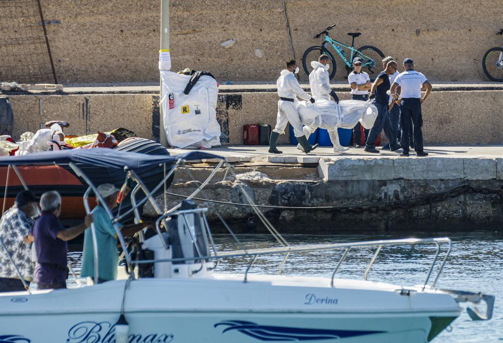
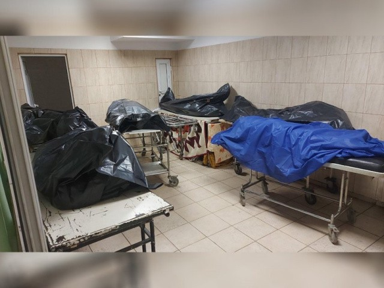
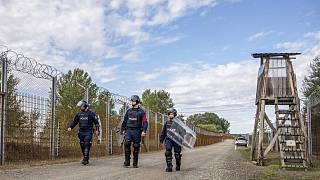
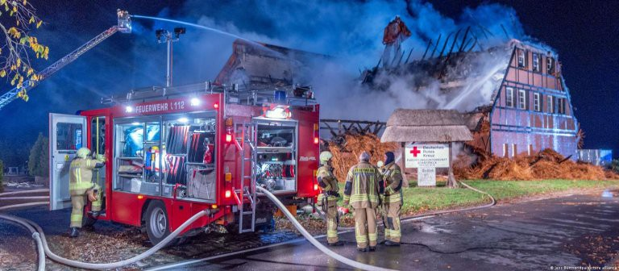

### AYS News Digest 25/10/22: Two infants found dead in the Mediterranean
#### 400 people’s lives are currently at risk off Sicily // Bulgarian hospitals are ‘full’ of unidentified bodies // Violence on the Romanian border — “They sent dogs to bite us” // The EU puts pressure on Serbia’s no\-visa relationships // Poverty rate amongst Palestinian refugees in Lebanon reaches 93% // 345 MEPs refuse to approve Frontex’s budget over OLAF report // Rising poverty rates in Greece // Arson suspected as fire destroys a shelter for Ukrainian refugees near Wismar, Germany & much more
#### FEATURE — ITALY
#### Two infants found dead on a boat in the Mediterranean

AP Photo/David Lohmueller

The Italian coast guard recovered the bodies of two infants, aged one and two years old, last Friday\. Disabled by an explosion in waters off Malta, 36 survivors from a boat carrying 40 individuals have now been rescued and taken to Lampedusa\. One woman remains missing\. The cause of death is thought to be severe burns\.

A survivor disembarks in Lampedusa\. AP Photo/David Lohmueller\.
#### SEARCH AND RESCUE \(SAR\)
#### 400 people’s lives are currently at risk off Sicily

The SAR zone around the Mediterranean is scarily going to become even more active in the coming months\. Aegean Boat Report has recently reported on a worrying trend: an increase in larger boats travelling from Turkey and Lebanon directly towards Italy\. Longer journeys in overcrowded sailboats are lethally dangerous, and several large\-scale shipwrecks have already occurred\.
#### 34 people rescued during the night by Ocean Viking

■■■■■■■■■■■■■■ 
> **[Alarm Phone](https://twitter.com/alarm_phone) @ Twitter Says:** 

> > Rescued!

34 people in distress who called Alarm Phone when escaping from #Libya were found and rescued by the #OceanViking during the night. Thank you #civilfleet! #SafePassage now! 

> **Tweeted at [2022-10-22 09:15:32](https://twitter.com/alarm_phone/status/1583748879115161600).** 

■■■■■■■■■■■■■■ 

■■■■■■■■■■■■■■ 
> **[SOS MEDITERRANEE](https://twitter.com/SOSMedIntl) @ Twitter Says:** 

> > #OceanViking just evacuated 39 people, incl.1 woman &amp; children from an unseaworthy fiberglass boat adrift in Maltese Search &amp; Rescue Region following a distress call from @[PVolontaires](https://twitter.com/PVolontaires) #Colibri2 aircraft.

73 survivors are being taken care of by @[SOSMedIntl](https://twitter.com/SOSMedIntl) &amp; @[ifrc](https://twitter.com/ifrc) teams onboard. https://t.co/KtEWsQjXBY 

> **Tweeted at [2022-10-23 13:13:01](https://twitter.com/sosmedintl/status/1584171033753681922).** 

■■■■■■■■■■■■■■ 

#### Solidarity at Sea — Merchant Vessels offering assistance to those in distress

32 people adrift off Benghazi, Libya with no fuel have been rescued after adverse weather became life\-threatening\. Following all\-too\-familiar delaying SAR tactics from Malta, and thanks to assistance from merchant vessels, the people aboard are now safe\.

■■■■■■■■■■■■■■ 
> **[Alarm Phone](https://twitter.com/alarm_phone) @ Twitter Says:** 

> > Good news! After days of following their dangerous journey, the 32 people have safely reached #Pozzallo in #Italy. We want to thank the merchant vessel crews that offered their support to the people in distress. Great acts of solidarity at sea! 

> **Tweeted at [2022-10-23 13:01:24](https://twitter.com/alarm_phone/status/1584168110575476736).** 

■■■■■■■■■■■■■■ 

#### 11 days after the first rescue, 293 people disembark at Taranto

■■■■■■■■■■■■■■ 
> **[MSF Sea](https://twitter.com/MSF_Sea) @ Twitter Says:** 

> > 🟢 The wait is finally over. 293 children, women and men  disembarked today in the port of #Taranto 11 days after the first rescue. We hope they will receive the assistance and medical care they deserve and need. https://t.co/2CUkd8fI3O 

> **Tweeted at [2022-10-22 16:34:42](https://twitter.com/msf_sea/status/1583859402741669888).** 

■■■■■■■■■■■■■■ 

_AP_ report:

> Italian authorities assigned Geo Barents the port in Taranto in the southeast “heel” of the country nine days after the initial rescue\. 

> “The time needed before obtaining a port for disembarking is still too long\. It should be assigned immediately after the rescue operation,” Riccardo Gatti of Doctors Without Borders, who was aboard the ship\. 

#### BULGARIA
#### Hospitals in Burgas are ‘full’ of unidentified bodies

Credit: @lupa\.bg

Chief prosecutor Ivan Geshev says of the state of migration in Bulgaria that:

> “Hospitals in Burgas are full of unidentified dead persons that hunters find in the forest\. They cannot be released because their identities cannot be established _\.”_ 

The district’s only forensic doctor, Dr\. Galina Mileva, has commented upon this horrifying reality:

“ _There is a huge refugee flow, not only as migrants across the Turkish border, but also Ukrainians\. We have many Ukrainians who died here\. The relatives of some of them are ready to carry out their funerals here\. However, others remain in the morgue, unclaimed\. \[…\] A new storage cabinet for storing corpses should be purchased_ \.”
#### ROMANIA
#### Violence on the Romanian border — “They sent dogs to bite us”

No Name Kitchen have published a recent testimony from the Romanian/Serbian border:

> “J\. and his cousins have been in Serbia for 22 days and this morning was the fifteenth time they have tried to cross the Serbian border into the European Union\. 

> Since the third time they have changed places several times, so impossible it seemed that they would be able to cross again at the same place\. “ 

> Every time we went to a new spot I hoped they wouldn’t beat me even more, but I wasn’t right\. 

> Even worse, every time they tried “game over my friend” once law enforcement caught them before they beat them and tortured them in various ways\. 

> “After the dogs bit us, they hit us with bamboo and sticks and destroyed our phones\. They also took my power bank and all my money\.” J\. is desperate and does not know what to do\. “I thought Romanian police was nicer than Hungarians, but in the end all of them are horrible and not human\.” 

> J\. left Syria 6 years ago and lived until the beginning of the year in Turkey to earn money to be able to continue his dangerous trip towards Europe\.” 

> “You know, I went through so many horrible situations, I stopped comparing if it’s more horrible than elsewhere\.” 

#### SERBIA
#### **The EU puts pressure on Serbia’s no\-visa relationships**

Police officers on the Serbia\-Hungary border Credit: Tibor Rosta/MTI

Until a few days ago, Serbia had ‘no\-visa’ relationships with Tunisia, Burundi, India and Cuba — travel between these nations was visa free\. However, threatened with sanctions by the EU, who cynically accused Serbia of ‘producing’ refugees and conjuring up a crisis, Serbia has now ended its no\-visa relations with Tunisia and Burundi\.

Serbian Centre for Development of Social Policies and NGO, KlikAktiv, offers [a counter narrative from on\-the\-ground experience over the past year\.](https://www.facebook.com/klikaktiv/posts/pfbid0DU1RhqjLBHTX4SbDfAih1849b4JSWYUHhXpj8eXqwN1RSnB3jkafk7DCeamRt6wYl) According to KlikAktiv, 70% of the individuals with whom they have worked in Serbia are from Syria and Afghanistan\. People from no\-visa states make up only 19% of the refugee population in Serbia \(14\.5% Tunisian, 2\.6% Indian, 1\.7% Burundi\) \. The no\-visa relationships Serbia had have become a scapegoat, an example of the EU finding external culprits to blame, and so exonerate itself from responsibility\.

The Western Balkans route has seen an increase in footfall this year, a 170% increase on 2021 according to [Frontex](https://frontex.europa.eu/media-centre/news/news-release/eu-external-borders-in-september-vlgp1C) , who have recorded 106,396 so\-called ‘irregular crossings’ by September this year\. EU Commissioner Ylva Johansson has publicly scapegoated Serbia, suggesting “big, big numbers” of people came from Burundi, Cuba and India\. KlikAktiv reality check this claim\. Calling for Serbia to align its visa agreements with Europe, the EU again cite ‘security’ concerns as paramount: [“We want to see practical results and progress in this field because it’s necessary for the security of EU citizens”\.](https://www.euronews.com/my-europe/2022/10/14/eu-sounds-the-alarm-over-rise-in-illegal-border-crossings-via-serbia-and-abuse-of-visa-fre?fbclid=IwAR2XxSXliA6UkRBNHDsMMZllWblevqKgxjNX6Fq5h6opCjrPdMyPIs1MJqk)
#### LEBANON
#### Poverty rate amongst Palestinian refugees in Lebanon reaches 93%

UNRWA urgently appeals for US $13 million to provide urgent assistance to Palestinians in Lebanon\. 162,000 Palestinians \(of an estimated refugee population of 180,000\) have already received cash assistance from UNRWA this year\.

As Lebanon’s economic meltdown — slashing access to clean water and putting extra strain on hospitals — continues, the situation has become increasingly desperate\.

> “Almost every Palestine refugee in Lebanon lives in poverty\. The average cost of the food basket has increased six\-fold in the last year one of the highest increases the world has recorded this year\. The cost of water, fuel, electricity, gas, transport and health care is now three to five times higher\. Medicines are increasingly unavailable on the market and families are unable to afford them since government subsidies have been lifted\. Too many Palestinian refugee families are no longer able to afford secondary health care\. Some are skipping lifesaving treatment to avoid accumulating debts\.” 

[Iman, a mother of three living in Mar Elias camp, told UNRWA](https://reliefweb.int/report/lebanon/hitting-rock-bottom-palestine-refugees-lebanon-risk-their-lives-search-dignity-enar?fbclid=IwAR36F2-iWFSyh03Ui-9243u-x25EG3pdtW0xckqwSFY9PAq4UTFP2eMgjUY) : _“Dying from poverty will not be much different from dying at sea\. Life in Lebanon has become unbearable with one crisis after another\. Youth are those seeking to emigrate to escape this reality though entire families are now selling everything and risking their lives just to have a decent life_ \.”

Listen to the voice memos sent to the UNRWA from Palestinians here:

[Hear their voices: Palestine refugees in Lebanon send to UNRWA voice memos.](https://www.youtube.com/watch?v=XuRGRwvn2AY)
#### Cholera outbreak in Qub Elias, Lebanon

With no cases of cholera for the last 30 years, an outbreak in October now numbers 220 cases and five deaths\. Typically spread through contaminated water, food and sewage, the outbreak that began in Afghanistan in June has spread through Pakistan, Iran, Iraq, Syria and now Lebanon\.

Most [reported cases](https://www.reuters.com/world/middle-east/cholera-outbreak-hits-syrian-refugees-sheltering-camps-lebanon-2022-10-21/?fbclid=IwAR2P7EcqHwxhZJguo92M1sZiXUTpm_0ZpN3KVa-gJemexAmnZK_8YBR_YFU) in Lebanon have been in refugee camps, where health conditions are the most dire\.
#### FRONTEX
#### 345 MEPs refuse to approve Frontex’s budget over OLAF report\!

This is a massive victory for transparency against an agency complicit in illegal pushbacks, silencing whistleblowers, violating human rights and manipulating internal reports\.

■■■■■■■■■■■■■■ 
> **[WeMove Europe](https://twitter.com/wemoveEU) @ Twitter Says:** 

> > [🔴BREAKING] ⚠️ Big WIN for Human Rights and transparency⚠️ 

👉 MEPs just voted against the use of taxpayers money to fund a corrupt agency Frontex after many scandals &amp; cover-ups of human rights violations. 

𝘍𝘳𝘰𝘯𝘵𝘦𝘹 𝘓𝘖𝘚𝘛 𝘪𝘯 𝘵𝘩𝘦 @[Europarl_EN](https://twitter.com/Europarl_EN) https://t.co/pwATPivZJ5 

> **Tweeted at [2022-10-18 10:50:23](https://twitter.com/wemoveeu/status/1582323197923725312).** 

■■■■■■■■■■■■■■ 

See below for more on OLAF’s report:

#### TURKEY
#### Hundreds of refugees deported to Syria

Smoke billows from Russian airstrikes near Syria’s Bab al\-Hawa \(Cilvegözü\) border crossing with Turkey on September 27, 2022, according to AFP correspondents and the Britain\-based Syrian Observatory for Human Rights\. © 2022 Omar Haj Kadour/AFP via Getty Images

Human Rights Watch have [reported](https://www.hrw.org/news/2022/10/24/turkey-hundreds-refugees-deported-syria?fbclid=IwAR2E9JXbtEwy3jjPZ7kV_BfZHEcMzt-7B8-7pSOsAOlUNCeLXc12mYBxbs4) that hundreds of Syrian men and boys are being arrested, deported, beaten and forced to sign voluntary return forms\. People are being driven to border crossing points in northern Syria and forced across at gun point\.

Nadia Hardman writes that _“it now looks like Turkey is trying to make northern Syria a refugee dumping ground_ \.”

Human Rights Watch is calling for the **EU to recognise that Turkey is unsafe for Asylum Seekers** , especially as it seems likely to normalise relations with the Bashar al\-Assad government\.

It is REALLY WORTH READING the full piece below:

#### Investigations into new smuggling networks

 on [Unsplash](https://unsplash.com?utm_source=medium&utm_medium=referral)](assets/b7db883274ed/0*amoWjfw352Wqa8Ne)

Photo by [JOHN TOWNER](https://unsplash.com/@heytowner?utm_source=medium&utm_medium=referral) on [Unsplash](https://unsplash.com?utm_source=medium&utm_medium=referral)

Afghan refugees in Turkey, already exploited by employers and lacking access to public services, are coming under increased threat of detention and/or deportation to Iran\. Tensions with locals are increasing, and Istanbul’s major districts are no longer able to issue residence permits to foreign nationals\.

Sara Creta reports that, in the wake off pushbacks, people are turning to smuggling networks\. Using luxury sailboats, smugglers are crossing to Italy and are making as much as €500,000 per trip\. She reports that an adult would expect to pay €8,500 and a child €4000\.

> “These sailboats are typically operated by Ukrainian and Russian smugglers working together with the Turkish mobsters and Italian clans _\.”_ 

■■■■■■■■■■■■■■ 
> **[Sara Creta](https://twitter.com/saracreta) @ Twitter Says:** 

> > I just returned from #Turkey. I have spent days with Afghan &amp; Syrian communities in Istanbul &amp; at the border with #Bulgaria. I spoke with lawyers &amp; local activists &amp; archived evidences of pushbacks filmed by refugees who managed to survive violence &amp; repression.

A few thoughts. https://t.co/IMv9hFYAVw 

> **Tweeted at [2022-10-22 12:15:08](https://twitter.com/saracreta/status/1583794080248606720).** 

■■■■■■■■■■■■■■ 

#### GREECE
#### Rising poverty in Greece is a threat to refugees and migrants too

30% of the Greek population are currently at risk of descending below the poverty line, and concurrently more and more people on the move find themselves on the streets without shelter\. Dependence on soup kitchens and solidarity networks is increasing, piling pressure on local activists and organisers too\.

■■■■■■■■■■■■■■ 
> **[RSA](https://twitter.com/rspaegean) @ Twitter Says:** 

> > 🧵
1/3 A total of 29.5% of the total population (around 3,092,300 people) in 🇬🇷 are simultaneously at risk of poverty or social exclusion, the Hellenic Antipoverty Network said on Monday in its annual report
[keeptalkinggreece.com/2022/10/17/pov…](https://www.keeptalkinggreece.com/2022/10/17/poverty-watch-greece-2022) 

> **Tweeted at [2022-10-21 13:24:03](https://twitter.com/rspaegean/status/1583449034609799168).** 

■■■■■■■■■■■■■■ 

With the right to asylum being denied in some instances, we are extremely concerned for the welfare of people struggling to survive on Greece’s streets\.

RSA has produced a mini\-documentary, following four Afghan families who collect cartons from rubbish bins to survive\.

> The camera follows them during a day of their work while they narrate the difficulties they face\. It is the lack of welfare support and the threat to remain homeless that drives those people on the streets: elderly and sick, women and men alike\. In the midst of the traffic noise they pull and push with their bare hands their little trolleys day by day through Athens, just to earn about 10 Cents per kilo of carton\. The work is hard, stressful and undignified\. Ιt makes them sick, they say\. “We have no other choice\. We have nothing but papers in Greece and the cartons to survive\! 

Read more about the ‘Cartoneros’ of Athens [here](https://rsaegean.org/en/the-new-cartoneros-of-athens/?fbclid=IwAR1Mo4yp2zAq3x788X_0YHqF9pZrPLd6IhASm8t6pJg_jw6khU9ZDhjarC0) \.

**The excuse of ‘national security’ — justifying the baseless revocation of asylum**

Two Syrian activists in Greece, Wael and Karim, have had their asylum revoked\. Founders of the Syrian and Greek Youth Forum, a creative activism movement seeking to break stereotypes of refugees in Athens, neither have criminal records\. As they challenge the legal process, despite being denied access to the classified documents that ‘justify’ their revoked asylum statuses, both are seeking a calm and co\-operative solution\.

> “We are not interested in protesting,” Karim Kabani says today\. “We’re interested in understanding\.” They repeat in all tones that they do not wish to sound accusatory\. “We know that mistakes and misunderstandings are made\. From the beginning this has been our attitude, the understanding of the other side as well\. It is not easy to have so many people coming to your country, not knowing who they are\. We understood that\. What we experienced in Greece was a great experience and we want to share it with others\. Let’s say that we are happy that we are all together\. We’re not asking for a defense, I don’t want anyone to come and say how good kids we are\. I want us to exhaust the legal avenue\.” 

#### GERMANY
#### Arson suspected as fire destroys a shelter for Ukrainian refugees near Wismar

_A fire destroyed accommodation in Wismar, NE Germany, where Ukrainian refugees were staying in Germany \| Photo: Jens Büttner / dpa / picture alliance_

Thankfully no one was injured by the fire, and fourteen refugees were safely evacuated\. [Swastika drawings had previously been found on the shelter’s entry sign](http://www.infomigrants.net/en/post/44164/germany-fire-destroys-ukrainian-refugee-home?fbclid=IwAR1cbGFLa3BIotdgJGMpvRrqAjMKR6BfthcEWRdqq3_S4C4fi_-HGrplEhc) , and a local politician suggested that arson was clearly behind the fire: ‘It didn’t burn on its own\.’ Such a conscious act of persecution is appalling\. More [here](https://www.rferl.org/a/ukraine-refugees-germany-shelter-arson/32093571.html?fbclid=IwAR2iUMGHFTQaRj5mddTOnXowScsX5Xtgr3Cy34_wN5rYS6ZVSzHBO6et2Rw) \.
#### THE NETHERLANDS
#### Inhumane treatment of minors in Stadskanaal

[According to the NOS](https://nltimes.nl/2022/10/22/underaged-asylum-seekers-fed-moldy-bread-emergency-shelter?fbclid=IwAR2yDSVjEg36v3T5aZm_vA8JFqrVfc-5EFDM-q7lkvcxi65RR7bWwjjENkU) , over 80 young asylum seekers were fed mouldy bread for breakfast on Friday\.

“This is typical of the degrading way these children are currently treated,” said Vluchtelingenwerk Nederland\. “Many of them had already spent nights on hard plastic chairs or on the floor before they arrived at the emergency shelter\.” — [More here from NL Times\.](https://nltimes.nl/2022/10/22/underaged-asylum-seekers-fed-moldy-bread-emergency-shelter?fbclid=IwAR2yDSVjEg36v3T5aZm_vA8JFqrVfc-5EFDM-q7lkvcxi65RR7bWwjjENkU)
#### WORTH READING
- ‘Why are more Egyptians taking to the Mediterranean?’ — Opinion pieces from fellow activists\.

- A piece about living as a refugee in Rwanda, from a man who was housed in Gashora Transit Centre, where people are housed on arrival to the country\. — “From my experience, there is no clear democracy in Rwanda \[…\] the people live in fear because the government keeps them under surveillance\.”

[](https://l.facebook.com/l.php?u=https%3A%2F%2Fwww.opendemocracy.net%2Fen%2Frwanda-refugee-libya-camp%2F%3Ffbclid%3DIwAR2OdLd1but2RDThlhFeZ860SmegKAsjPoTKwWc76lTzeB_w9wBT2W0bQj0&h=AT243jh6jIp6NsS5CIXe_088gS4P-1wWLl0l5-Ft-6WB2il_1DeVd50CnuH8uQfblxfE_H12CC-sLsMC-aX-MNv47tsGZ7SS83S0XK4KBin9d08tYbVqR8WIAABYG6h7Xt-fGsAK2x2Nw5QY6qI&__tn__=R]-R&c[0]=AT1QloNQpLovltsZZalBz8mFoxfWefPLTBSaQCwLRMYjhkfOamw6SLF-YHvUhSBPbT93Mq4CCC3YDp-KDXp25Nsfg_6RHRUZFa28u_yVc_mSQJli1iFX6weOgP848bPJl6X33Ux950KTxv4pPP59sto4XjiKiYyX4ZoO1U_nV_kx3J5I5fU4oJaDenHgbk4uHB6XqA2rr-XBvyCD)

- “These days we don’t get enough food to eat” — Cuts to monthly stipends in the Nakivale refugee settlement in Isingiro, Uganda have led to hunger and conflict with local farmers in Africa’s oldest refugee settlement:

- ECRE’s report about Greek\-Turkish stand\-off over the abuse of the 92 naked men found in the Evros region\. Researcher Lena K writes that “Irrespective of the real events \[…\] the performance of indignation by the Greek government is nothing less than an insult\.” Read in full here:

- Political scientist Victoria Finn researches the voting behaviour of people whose lives straddle multiples nations:

**Find daily updates and special reports on our [Medium page](https://medium.com/are-you-syrious) \.**

**If you wish to contribute, either by writing a report or a story, or by joining the Info Gathering team, please let us know\!**

**We strive to echo correct news from the ground through collaboration and fairness\. Every effort has been made to credit organisations and individuals with regard to the supply of information, video, and photo material \(in cases where the source wanted to be accredited\) \. Please notify us regarding corrections\.**

**If there’s anything you want to share or comment, contact us through Facebook, Twitter or write to: areyousyrious@gmail\.com**

_Converted [Medium Post](https://medium.com/are-you-syrious/ays-news-digest-25-10-22-two-infants-found-dead-in-the-mediterranean-b7db883274ed) by [ZMediumToMarkdown](https://github.com/ZhgChgLi/ZMediumToMarkdown)._
