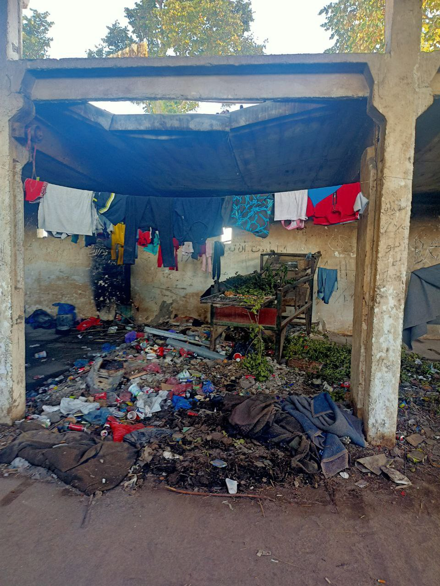
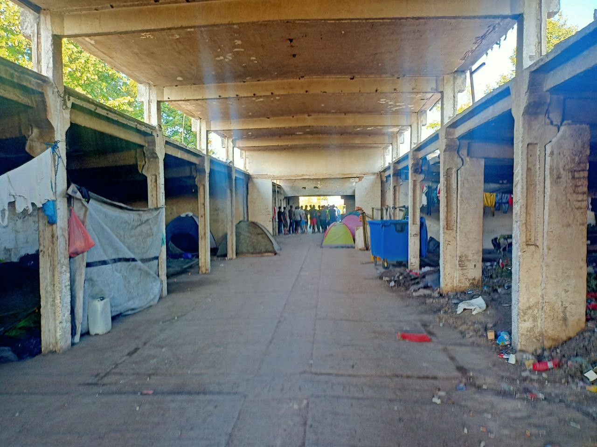
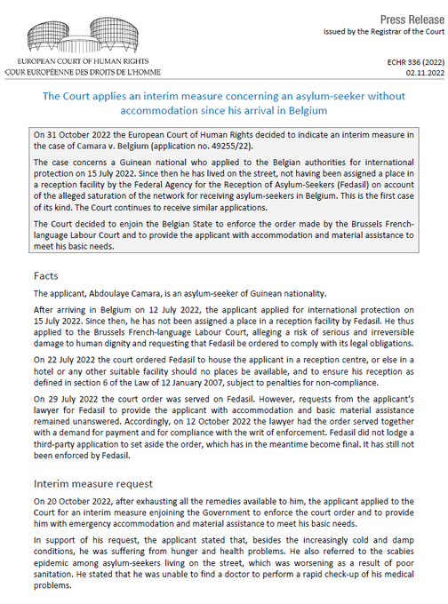

### AYS 7/11/22: ‘Selective disembarkation’ in Italy forces some rescued people back on board
#### Deportations and housing apartheid in Turkey // Three more bodies found in Greece // Update from ClickActive from Northern Serbia // People on the streets in Belgium as temperatures drop // Protests in the UK and much more…

](assets/5c38c740f6ff/0*zDIAywHtOL-RqRee)

35 people were not allowed to disembark from the ship Humanity 1, because they were not considered “vulnerable”, following Piantedosi Italian Interior Minister decree\. Via [Sos Humanity](https://twitter.com/soshumanity_en/status/1589244328873861121)
#### FEATURE
### NGOs take legal action against Italian interior minister’s decree to only disembark ‘vulnerable’ people

When we think of borders, we usually think of walls, either geographical, like the sea, or actual walls, such as those that are frequently built to prevent people from entering a specific state\. But in the port of Catania, these days, borders are showing themselves for what they really are\. A filter, a filter that imprints pain and trauma on the bodies of those who attempt to cross them\.

■■■■■■■■■■■■■■ 
> **[SOS Humanity (international)](https://twitter.com/soshumanity_en) @ Twitter Says:** 

> > 1/4 🔴Breaking: On Monday, SOS Humanity takes legal action against the decree of the Italian government &amp; the prevention of the disembarkation of 35 rescued people from the #Humanity1! Italy's actions violate European law &amp; the Geneva Refugee Convention. https://t.co/mAaPlG8mTc 

> **Tweeted at [2022-11-06 19:44:43](https://twitter.com/soshumanity_en/status/1589343038517940224).** 

■■■■■■■■■■■■■■ 

In the decree of 4th November, signed by the new Minister of the Interior Piantedosi, NGO boats are forbidden to stay in Italian territorial waters longer than

> “necessary for rescue and assistance operations to persons in emergency and precarious health conditions” 

■■■■■■■■■■■■■■ 
> **[Sara Creta](https://twitter.com/saracreta) @ Twitter Says:** 

> > #Italy Tense standoff at #Catania port + looming court battles (again) as #Italy's gov awful attempt to stop @[MSF_Sea](https://twitter.com/MSF_Sea) @[SOSMedIntl](https://twitter.com/SOSMedIntl) @[soshumanity_en](https://twitter.com/soshumanity_en) from bringing ppl rescued at sea to safety. So far only minors &amp; ppl in need of medical care were allowed to disembark. 

New decree👇🏾 https://t.co/mlO66mPO5M 

> **Tweeted at [2022-11-07 13:22:34](https://twitter.com/saracreta/status/1589609253329047553).** 

■■■■■■■■■■■■■■ 

Only people who are considered ‘vulnerable’ are allowed to disembark\. Having crossed the sea to find a safe place is not enough\. ‘Selective disembarkation’: where the word ‘selective’ is scary, but it is what the borders are\. Without this selectivity the concept of borders can’t survive: some people can enter and others can’t, but what’s the criteria? Where someone is from? Their gender? The colour of their skin? A person’s level of vulnerability cannot be decided remotely\. This is supposed to be one of the functions of asylum interviews, and does not necessarily impact an asylum decision\.

So, after 144 people were allowed off the Sos Humanity 1 boat, another 35 remained on board\.

■■■■■■■■■■■■■■ 
> **[Sea-Watch Italy](https://twitter.com/SeaWatchItaly) @ Twitter Says:** 

> > Il 5 novembre il Ministro dell'Interno ha definito "carico residuale" le persone ancora a bordo delle navi umanitarie. 

Non persone portatrici di diritti ma oggetti di cui disporre a proprio piacimento spostandoli come si desidera.

Un linguaggio inaccettabile e indecente. https://t.co/3B8taHIxKK 

> **Tweeted at [2022-11-07 14:49:53](https://twitter.com/seawatchitaly/status/1589631227577118723).** 

■■■■■■■■■■■■■■ 

‘Residual cargo’ was the term used by Minister Piantedosi, as if these people were objects\. There are still two ships in the port of Catania: the Ocean Viking with 234 people on board, and Rise Above with 90 people on board\.

In a state of despair, some of the people who were not considered ‘vulnerable’, attempted to dive into the water rather than climb back on board\.

■■■■■■■■■■■■■■ 
> **[Giansandro Merli](https://twitter.com/GiansandroMerli) @ Twitter Says:** 

> > “Help us” gridano i naufraghi ostaggio del governo. Dalla #GeoBarents si sono tuffati in 3. 2 sono sul molo e non vogliono risalire. L’altro ha detto di essersi lanciato in acqua per aiutare uno dei suoi compagni di viaggio. Dopo averlo accompagnato in banchina è tornato a bordo https://t.co/TN5UUzoU6w 

> **Tweeted at [2022-11-07 15:02:00](https://twitter.com/giansandromerli/status/1589634276659965952).** 

■■■■■■■■■■■■■■ 

> “According to international law, a search and rescue operation ends with the landing of the survivors in a safe place\. It is illegal to allow only a select few survivors to disembark\. Moreover, rejecting all others outside national territorial waters constitutes a form of collective refoulement and thus violates both the European Convention on Human Rights and the non\-refoulement principle of the Geneva Refugee Convention” 

Said Mirka Schäfer, advocacy officer of the NGO Sos Humanity, as it is reported in the following article:
<<<<<<< HEAD

For these reasons, rescue NGOs have appealed to the Regional Administrative Court \(TAR\) \. The captain of Sos Humanity stated:

> “It is my duty to complete the rescue of people in distress by disembarking all survivors in the port of Catania as a safe haven\. I cannot leave the port until all the people rescued from the emergency at sea have been disembarked” 

While waiting for a response and a decision from the TAR about the issue, many activists and associations are denouncing the situation at the port, with assemblies and demonstrations\.

](assets/5c38c740f6ff/0*uY6j-uupy24j3vQF)

Gathering of people in Port of Catania against Piantedosi’s decree\. Via [Giansandro Merli](https://twitter.com/GiansandroMerli)

Read more here about the legal action against Piantedosi in the decree of 4th November:

And also in other cities:

■■■■■■■■■■■■■■ 
> **[Alarm Phone](https://twitter.com/alarm_phone) @ Twitter Says:** 

> > In Italy, activists are currently at the Ministry for Infrastructure and Transport in Milan, protesting the inhumane blocking of NGO rescuers at Italian harbours and the cruel selection of who gets to disembark and who does not. 

Open the ports!!!

📸 @[Cantiere](https://twitter.com/Cantiere) and @[RescueMed](https://twitter.com/RescueMed) https://t.co/IrKrY1gFrp 

> **Tweeted at [2022-11-07 16:25:24](https://twitter.com/alarm_phone/status/1589655265171103746).** 

■■■■■■■■■■■■■■ 

Read more about the topic here:

And here it is explained why Italy is not welcoming people and not allowing them to disembark, with some questions and answers\.

[.jpg)](https://www.avvenire.it/attualita/pagine/perche-italia-non-vuole-aprire-porti-migranti?fbclid=IwAR2r5SNWwm1v1ww-KEmt0wH1cOl9Cl6Tjb_9Wr3_dKLenqD9EfTVB_YTWmY)

](assets/5c38c740f6ff/0*H7DO6LmVeW1-6805)

Via [MSF](https://twitter.com/MSF_Sea/status/1589564792502898689)
#### TURKEY
#### Deportations and housing apartheid

Since the beginning of the year, [over 4,000 people have been deported from the removal centre in Edirne, making up 97,448 deportations in total](https://www.hurriyetdailynews.com/over-400-irregular-migrants-deported-from-edirne-178303?fbclid=IwAR24s6LGGg0pjQ0vYp9nG6YPJkXGPam7LAy9Yfl314-1b3I12-u9od_NQXQ) \. This represents an increase by 149 percent compared to the same period in 2021, according to the Directorate General of Migration Management\. Turkey does not grant asylum to non\-Europeans, and it is unclear if any attempt has been made to discover the level of risk these people face once returned to countries such as Syria\.

At the same time, [nearly 1,400 neighborhoods in 64 provinces have been declared “closed”](https://newsrnd.com/news/2022-11-06-forbidden-neighborhoods--raids-and-deportations--turkey-s-plan-for-syrian-refugees.SyO-vGBro.html?fbclid=IwAR3mXpl65U0FjG4yDzCn0Mx0Z8Fana8B8YuxQzmvFOPaJ9S0frPWOWbvZ_Q) \. That is, foreigners of any nationality are prohibited from residing in them unless they were registered before the new measure was brought in or had purchased a home there\.

Turkey is not a safe third country\.
#### GREECE
#### Three more bodies found

[Three more people who lost their lives](https://www.infomigrants.net/en/post/44528/three-more-bodies-found-in-western-aegean-sea?fbclid=IwAR0iOG7YM2MR5hXws_AEDDDkLciBmXxoAUsOvfWKGtzlhokMUF70bLvJpus) during the most recent shipwreck in the Aegean have been found off the coast of Karystos\. Their identities are still unknown\.

Alarm Phone advise relatives wanting information about the identities of the deceased or rescued persons to try contacting the Police Department of Karystos **\+30 22240 22262** \.
#### **SERBIA**
#### Update from ClickActive from Northern Serbia

 \)](assets/5c38c740f6ff/1*lB6s4YoPxkmd76-PhYqItA.jpeg)

\(Photo Credit: [Klikaktiv — Centar za razvoj socijalnih politika](https://www.facebook.com/klikaktiv?__cft__[0]=AZV3OuWxo5FhiJ55LBl_NCYMaiVuaipiVIbcltrr01OAoOvADPfgKRclcv9onbfjt96v424emG0mhtABQ8p_wyH1ScZCS4bvSzlimT1zxwiWSiVaEGrSC9eNmOfQIPujx1H0_pe7_vdOWEpGaSaaASDf&__tn__=-UC%2CP-R) \)

> In the north of Serbia, near the borders with Croatia, Hungary and Romania, our team has located and is present in 28 squats\. They vary in size and currently there are smaller squats that count between 10 and 30 people, medium squats with between 80 and 130 people all the way to large squats that sometimes include 400–500 people\. 

> Numerous police actions that have been intensified over the past few weeks due to EU pressure on Serbia due to the visa\-free regime we had or still have with certain countries from which refugees come have led to many squats being higher Often “broken” and refugees transported to the Serbian border with Northern Macedonia\. Regardless of that, old squats are filling up incredibly fast with new tenants who will try their luck in jumping over the fence at the Hungarian border on the same evenings, and new squats are nothing in places where refugees think they are being police and they won’t touch at least for a while until, they hope, they fail to cross the border with Hungary and enter Austria from where at least they will not be forcibly returned to Serbia — which is the case with every capture of refugees on Hungarian territory — they are robbed, beaten, ashamed and then pushed into Serbia as if the bottom of the country on whose territory they stepped into their own feet are not at all responsible for them, their safety and care\. 

> In addition, the refugees are now, more than ever, precisely because of the indifference and indifference of the EU and Serbia states for their welfare, which is a special problem about which we will write more about in one of the next posts\. 

> Our estimate is that currently in squats and private accommodation in the north of Serbia there are between 4,500 and 5,000 people, which could freely be called a humanitarian disaster and to what the competent institutions should respond as soon as possible with one humanitarian one and all with a great response that will take care of everyone’s welfare an individual who is currently somewhere outdoors in some cold squat in Serbia\. — [_Click Active_](https://www.facebook.com/klikaktiv/posts/pfbid02Qo8i9F9KDSAY562Q3tfyuFTQQ4LNySucf9FuPwrCrJ74ukBo71L5hnigsUh7eGa7l) 

#### GERMANY
#### Tents Cleared by Authorities

[The Federal Care Agency \(BBU\),](https://www.diepresse.com/6212047/asyl-zelte-in-st-georgen-werden-aus-sicherheitsgruenden-geraeumt?fbclid=IwAR3ZF3AT-bHRu7UjTHvvbPswVhEFaF51DIjaovbkaxUtek60QNoMk4SxowU) has decided that tents in the St\. Georgen centre in the district of Vöcklabruck are to be vacated within three days and dismantled within seven days\. Four mobile overnight containers will also be removed from the asylum registration office in Wels\. This reduces the number of people on the move in the city to 30\. It is not stated where those who were evicted were moved to\.
#### BELGIUM
#### People on the streets as temperatures drop

[A lack of reception places means that an increasing number of people, including children, are sleeping on the streets](https://www.tijd.be/politiek-economie/belgie-federaal/Groeiende-zorgen-om-gezondheid-asielzoekers-door-tekort-aan-opvang/10425489?utm_medium=twitter&utm_source=dlvr.it&fbclid=IwAR27aOelVLsRQtZUqQjSrniHB3BYgMzGsjfOkNv7J13GZ9bR-UOlC711Pxk) \. Humanitarian groups are raising concerns about the health risks that this poses including diphtheria and scabies\. The Federal government has stated that it will supply 1,500 additional spaces but with no time frame\.

[The European Court of Human Rights has](https://twitter.com/ThomasWilleken1/status/1587754068201689089?fbclid=IwAR0a0Ek-Ua6NTld3Z4UhX1EmyHnns5S5u8Tq-4x3e9xQQfS4YaFoDcUcKAs) , for the first time, called for interim measures in relation to this crisis\.

[Some groups state](https://www.vrt.be/vrtnws/nl/2022/11/04/ongeziene-opvangcrisis-dit-jaar-komen-we-aan-100-000-mensen-die/?fbclid=IwAR2SSDZCemT4a6L3MmEIYV6BUma_jPL6JS9ROUWyVlR4R4PoiU0uIROmjos) that this year the total spaces needed will be up to 100,000 people, far lower than the federal government plan\.

More info [HERE](https://vluchtelingenwerk.be/nieuws/gezinnen-en-kinderen-op-straat?fbclid=IwAR1gRWjmlpho_457onV7vDWKbmdC73w0Mssw2_ihOLaHPw0cwuglBVw7KLM) \.
#### UK
#### Protests in UK calling for closure of Manston detention camp

Many groups came together at the weekend to protest against the conditions in Manston detention camp\.

> Migration is a fact of life and always has been\. We want anyone who comes to the UK seeking sanctuary to feel welcomed and to be supported to rebuild their lives here — **_All African Woman Group_** 

■■■■■■■■■■■■■■ 
> **[Niyousha Bastani](https://twitter.com/bniyoush) @ Twitter Says:** 

> > Protestors chanted “we see you” in Farsi to those waving back from inside the camp, as many of those detained in this hell have travelled from Iran, Afghanistan and Kurdistan. 

ما شما را میبینیم 
#ShutManstonDown 
#FreeThemAll https://t.co/sEIh2qYz4j 

> **Tweeted at [2022-11-06 20:50:29](https://twitter.com/bniyoush/status/1589359590369824768).** 

■■■■■■■■■■■■■■ 

In an article published by Novara media, Joseph Maggs, a coordinator with SOAS Detainee Support, and Nadia Hasan, communications officer at the Joint Council for the Welfare of Immigrants, stated that:

> We know the solutions to this government\-created crisis, but our politicians refuse to listen\. The reason why is clear\. As its policies push more and more families into poverty, this government is increasingly keen to point the finger at refugees for a mess they themselves created\. 

Meanwhile, [half of the people seeking asylum are unable to access legal aid](https://rli.blogs.sas.ac.uk/2022/11/04/new-freedom-of-information-data-indicates-half-of-asylum-applicants-are-unable-to-access-legal-aid-representation/?fbclid=IwAR0v5VXKzynonTqrgJOeriDfsDHnEaWhYu3bv1YG4QRc4JAK0SlnmgJtn54) \. Despite the increase in numbers of asylum seekers 25,000 fewer legal aid cases opened in the last year\.
#### WORTH READING

[European Parliament Scrutinises Frontex Surveillance Programme after BIRN Investigation \| Balkan Insight](https://balkaninsight.com/2022/11/07/european-parliament-scrutinises-frontex-surveillance-programme-after-birn-investigation/?fbclid=IwAR1gRWjmlpho_457onV7vDWKbmdC73w0Mssw2_ihOLaHPw0cwuglBVw7KLM) _Frontex’s plans to conduct mass surveillance at Europe’s borders have been frozen since June, following a cross\-border investigation published by BIRN and a critical review of the programme by EDPS, the EU’s data protection watchdog\._

[Voices of Struggle — Alarm Phone](https://alarmphone.org/en/campaigns/voices-of-struggle/) _“Voices of Struggle” is the title of this anniversary publication and we hope that the voices of the people on the move become amplified and widely listened to\._

[Immigration roundup podcast, October 2022 — Free Movement](https://freemovement.org.uk/immigration-roundup-podcast-october-2022/?fbclid=IwAR28w6WkRXOWPD3xGn_soUu1p8o3wren87Amcy0kwmZAQH3AQorH9hsZKFY) _This month, Colin and Sonia talk politics, asylum, the statement of changes to the immigration rules and case law\._

[No access to justice — how legal advice deserts fail refugees, migrants and our communities\.pdf](https://assets.website-files.com/5eb86d8dfb1f1e1609be988b/62bc316851f45566f5861378_No%20access%20to%20justice%20-%20how%20legal%20advice%20deserts%20fail%20refugees%2C%20migrants%20and%20our%20communities.pdf?fbclid=IwAR0yFkZUI3RIkGgMz1LBHWRLYG7dzzthAXJaym_25hwGYmEPqkdWWE_lnnA) _There has never been a comprehensive examination of provision, across legal aid and free or low\-cost non\-legal services; much less an attempt to measure demand\._

[A generation lost: danger and desperation in Syria’s Al\-Hol camp \| MSF](https://www.msf.org/generation-lost-danger-and-desperation-syria%E2%80%99s-al-hol-camp?utm_source=twitter&utm_medium=organic&utm_campaign=November) _A new report by Médecins Sans Frontières \(MSF\) lays bare the cruelty of the long\-term detainment of more than 50,000 people, the majority of whom are children, in Al\-Hol, northeast [Syria](https://www.msf.org/syria) \._

**Find daily updates and special reports on our [Medium page](https://medium.com/are-you-syrious) \.**

**If you wish to contribute, either by writing a report or a story, or by joining the Info Gathering team, please let us know\!**

**We strive to echo correct news from the ground through collaboration and fairness\. Every effort has been made to credit organisations and individuals with regard to the supply of information, video, and photo material \(in cases where the source wanted to be accredited\) \. Please notify us regarding corrections\.**

**If there’s anything you want to share or comment, contact us through Facebook, Twitter or write to: areyousyrious@gmail\.com**

_Converted [Medium Post](https://medium.com/are-you-syrious/ays-7-11-22-selective-disembarkation-in-italy-forces-some-rescued-people-back-on-board-5c38c740f6ff) by [ZMediumToMarkdown](https://github.com/ZhgChgLi/ZMediumToMarkdown)._
=======
>>>>>>> b8646ca (updates)
