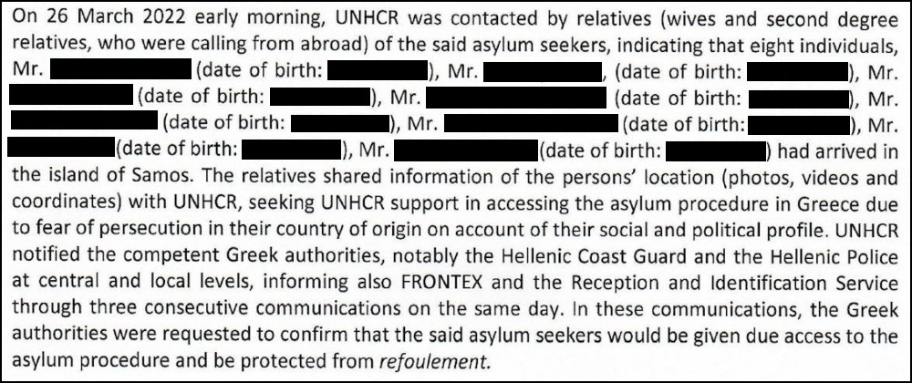
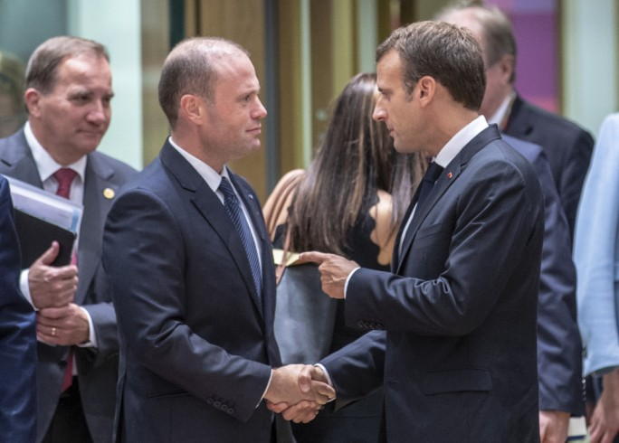
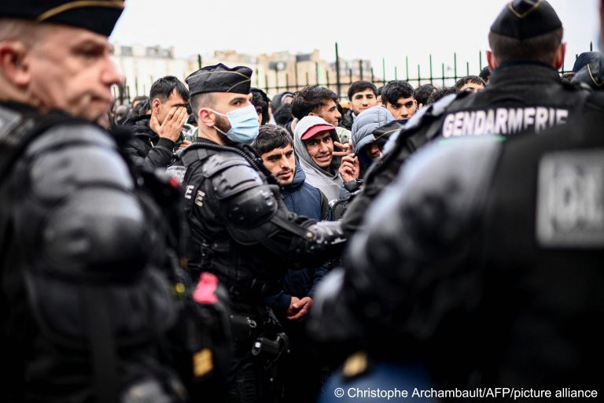

### AYS News Digest 18/11/22: Turkey restricts Afghan males from registering for residency permits

A total of 51 refugees have arrived in Rome, on the ‘UNICORE — University Corridors for Refugees project’//Austrian Chancellor wants to stop ‘Asylum a la carte’ and ‘asylum tourism’//Police in Paris have cleared another camp, forcing almost 1000 people into emergency shelters// EU Commission’s Response & Proposal tackling the ‘instrumentalisation’ of asylum seekers//\#FreetheSamos2// and much more…

](assets/bac135838a39/0*Q9C_HSBDowUFAwmm)

[Over 240,000 Afghan refugees deported from Iran and Turkey \| Middle East Eye](https://www.middleeasteye.net/news/iran-turkey-afghan-refugees-deported)
#### FEATURE
### Turkey restricts asylum seekers from registering for residency permits, particularly Afghan males

Turkey hosts the largest number of refugees of any country in the world — roughly 3\.9 million people — 3\.6 million Syrians with temporary protection and 320,000 others, mostly Afghans\. [However, Human Rights Watch have stated that Turkey is routinely sending Afghan refugees back to Afghanistan, after barely looking at their asylum claims\.](https://www.hrw.org/news/2022/11/18/turkey-pushes-afghans-back-iran-border?fbclid=IwAR3aGk9xJ38QX_IKjFkJT1j1CY-BoDfaYXcXeHl4sb2U623zM7B_h6s6Uf8)

HRW claims that Afghans in Turkey are being stopped from registering for international protection, in addition, many who are facing deportation have no opportunity to make refugee claims or to dispute their claims\. In the first eight months of 2022, Turkey deported **44,768 Afghans** to Kabul, a **150% increase** compared to the first eight months of 2021\.

Those prevented from registering for a residency permit are predominantly men, with no families with them\. HRW stated that no Afghan male interviewed who was in Turkey without his wife and children had been able to register for a residency permit\.

In addition, in early 2022, residency permit registrations were no longer being accepted from asylum seekers in any neighbourhood in which 25% or more of the population were foreigners\. The Deputy Interior Minister further established that Ankara, Istanbul, and 14 other provinces would also no longer be accepting residency permit registrations\. A few months later, in June, the areas in which individuals could register became even more scarce\. Individuals were no longer able to register in areas where the population was composed of 20% of foreigners or more\. Furthermore, 1,200 neighbourhoods were closed to registrations\. All these policy changes aim to restrict the opportunities for asylum seekers to register for residency, forcing them into isolation and extreme poverty, in the hope that they would decide to leave Turkey and return to their home countries\.

Turkey most definitely does not fit the criteria for a safe third country under EU law, and therefore should not be considered as one by any EU country\. The government regularly deports individuals, restricts the freedoms of asylum seekers, and has committed human rights violations on multiple occasions\.
#### GENERAL

A report by the EU Commission introduces a mechanism which allows all Member States to derogate from their responsibilities under EU asylum law in situations of “instrumentalisation” of migration\. Many organisations have previously reported on this, including AYS\. This proposal builds on the 2020 one but focuses on the ‘new phenomenon’ where a State, in this case Belarus, creates a political situation where asylum seekers are used as pawns and are sent to the country’s neighbouring border zones and forcibly pushed across the borders\.

The report begins with this statement:

> ‘A highly worrying phenomenon observed is the increasing role of State actors in artificially creating and facilitating irregular migration, using migratory flows as a tool for political purposes, to destabilise the European Union and its Member States\.’ 

> …When faced with a situation of instrumentalisation of migrants, Member States should have the flexibility to act within a legal framework designed to address that particular situation and ensure that the rights of those falling victim to instrumentalisation are respected\. Therefore, the Commission is proposing a new instrument alongside those already in the New Pact on Migration and Asylum aimed at addressing the exceptional circumstance of instrumentalisation of migrants\. 

The overall concerns with respect to the proposals being made is the fact they are built on policies that are already ineffective and damaging for stateless individuals seeking safety\. They are vague, they continue to promote an emergency rhetoric, whereby policies are built on an emergency response rather than a sustainable and humane approach\. The changes suggested are also disproportionate to the issues and will essentially have a negative effect on the rights of asylum seekers\.

You can read the full report here: [https://eur\-lex\.europa\.eu/legal\-content/EN/TXT/PDF/?uri=COM:2021:890:FIN](https://eur-lex.europa.eu/legal-content/EN/TXT/PDF/?uri=COM:2021:890:FIN)

[The EU’s recent deregulation of asylum rights is vague and critically dangerous \[EN/AR\] — World \| ReliefWeb](https://reliefweb.int/report/world/eus-recent-deregulation-asylum-rights-vague-critically-dangerous-enar?fbclid=IwAR2GshI2CExWXeuXyStejaSi2wu3uOx5eErFlhocchTIYptUEl1dbo7O8mw)
#### GREECE

A collaboration between Solomon and the Balkan Investigative Reporting Network, BIRN, found that seven former Turkish soldiers and a teacher who arrived by boat on the Greek island of Samos in March were denied their right to request asylum and pushed back to sea\.

They were allegedly linked to the man who arranged a failed coup in 2016\. The Erdogan government has since targeted journalists, teachers, soldiers and others who could be linked to the movement that led to the failed coup\. Turkish courts have handed down thousands of life sentences and over 500,000 people have been investigated or tried\. The group are currently behind bars in Turkey\.

The UNHCR were contacted by relatives of the group in March 2022, sharing the coordinates of the group when they arrived in Greece, with photographic and video evidence, and emphasising the fact that they fear persecution by the Turkish state if returned\.

An excerpt of the UNHCR letter:

_Photo: The relatives of the eight Turks contacted the UNHCR fearing that their relatives would be deported_

The UNHCR tried to confirm with the Greek authorities that the group would be allowed to claim asylum in Greece and would be protected from refoulement\. However, the families lost contact by the evening of March 26th\. A lawyer representing the families reached out to UNHCR informing them that the group had been apprehended by the Greek authorities, were sent back to sea, and have been arrested by the Turkish authorities\.

You can read more about the case and the wider context of pushbacks, and the complicity of FRONTEX in this illegal activity:

[Exclusive: UN Letter Documents Greek Pushback of Turkish Asylum Seekers — Solomon \(wearesolomon\.com\)](https://wearesolomon.com/mag/on-the-move/exclusive-un-letter-documents-greek-pushback-of-turkish-asylum-seekers/?fbclid=IwAR0ibPEsXv1cL_UM2kGYSBocT4XfDGZ7Gs_B_MS9luEJCJac6te58OjhArI)
### \#FreetheSamos2 \#DroptheCharges

■■■■■■■■■■■■■■ 
> **[borderline-europe](https://twitter.com/BorderlineEurop) @ Twitter Says:** 

> > All over Europe, people on the move and those who support them are being criminalised. 

Hamza, Seán &amp; Sascha, who are being criminalised as well, stand with the #Samos2 &amp; send a message of solidarity! 

We are united and we fight together! ✊🏽

Free the #Samos2! #DropTheCharges https://t.co/9kE4XbC13w 

> **Tweeted at [2022-05-17 14:38:42](https://twitter.com/borderlineeurop/status/1526572927235268610).** 

■■■■■■■■■■■■■■ 

#### SEA/SAR
### Two more commercial vessels have supported NGO ships in rescuing asylum seekers at sea this week

Dutch offshore construction and contracting firm Van Oord is reporting that it is the latest to provide assistance at the request of the authorities\. The Malta Rescue Coordination Center contacted them to help rescue a boat carrying 49 individuals, who had been out at sea for an unknown amount of time\.

[Two Offshore Construction Vessels Assist Refugees in the Mediterranean \(maritime\-executive\.com\)](https://maritime-executive.com/article/two-offshore-construction-vessels-assist-refugees-in-the-mediterranean?fbclid=IwAR2AbnbczpJ-G2vOMrYIEv-ygzLAFqdqI9cHWx9hgOlTELzrvkSR2GIHk7s)

[Van Oord cable layer saves 49 refugees offshore Malta — Offshore Energy \(offshore\-energy\.biz\)](https://www.offshore-energy.biz/van-oord-cable-layer-saves-49-refugees-offshore-malta/?fbclid=IwAR38xKd958hosZZToWdhh8wNG-SJqpEuP1NAUV57tACPda3uk_t_2_HLIlE)
#### MALTA

Following on from the current dispute between Italy and France regarding the boat carrying 234 individuals, Malta is in a potentially crucial political position, with a more anti\-immigration rhetoric similar to that in Italy, but also a strong political relationship with France\.

Malta had previously aligned itself with France at a time when the Italian government claimed Malta should be responsible for supporting NGO ships carrying asylum seekers, as it was the first port of entry of asylum seekers attempting to reach Europe\. The Maltese government then established a relationship with France, whereby they agreed to take migrants rescued by NGOs on condition that these are split between EU member states in ad hoc coalition of willing nations which included Spain, France, Ireland and the Scandinavian countries\.

Malta Today: Emmanuel Macron and Joseph Muscat

Still at this time, Malta shared Italy’s views on NGOs rescuing asylum seekers at sea\.

In this current time, where Italy, Greece, Malta, and Cyprus are coming together, claiming once again that it is unjust for the border countries to be taking in and accommodating many more asylum seekers than Central and Western European countries\. Malta has potentially much more to gain by developing a stronger relationship with these more far\-right border countries\.

[Malta’s migration diplomacy: from hobnobbing with Macron to flirting with Meloni? \(maltatoday\.com\.mt\)](https://www.maltatoday.com.mt/news/national/119833/maltas_migration_diplomacy_from_hobnobbing_with_macron_to_flirting_with_meloni?fbclid=IwAR3TNDqnBxIelixmJHXAzX5nNUw3dq6mEOz5ufKq0aRIyHIoip6RtS-bpMc#.Y3j35MfP3rf)
#### ITALY
### **A group of 51 refugees arrived in Rome, after receiving visas and scholarships through the ‘UNICORE — University Corridors for Refugees project’**

Prior to arrival, they all attended Italian classes to help them resettle\. The students will also be studying at 33 Italian universities\.

> “The UNICORE program has changed my life: As you can imagine, a refugee doesn’t have many opportunities to study or make plans for the future,” — Bereket, a student on the program 

[Italy: 51 refugee students arrive via special humanitarian corridor — InfoMigrants](https://www.infomigrants.net/en/post/44838/italy-51-refugee-students-arrive-via-special-humanitarian-corridor?fbclid=IwAR0lpSh3k9Xxw3SL2RbSDzRiKv41_hvF14_ZWsepdrq-kusREEX79mJe4LQ)
#### AUSTRIA
### Austrian Chancellor wants to stop ‘Asylum a la carte’ and ‘asylum tourism’

Austria, Serbia, and Hungary have formed an alliance to stop asylum seekers from choosing their destinations and to allow for pushbacks to take place at the external EU borders\.

They have framed the narrative to suggest they are tackling human trafficking rather than establishing a racist and discriminatory policy and alliance\.

Hungary and Serbia are not the ideal partners when it comes to managing migration\. Hungarian officials have previously stated that migration should be prevented rather than managed\. In addition, Hungary has taken in the lowest number of Ukrainian refugees, despite claiming that the country’s economic struggles are due to the number of refugees and asylum seekers entering and establishing a life in the country\. Critics have also stated that the majority of asylum seekers choose to travel through Hungary rather than settling there, having little to no effect on the financial pressures on the country\.

[Austria teams up with Hungary, Serbia to end ‘asylum a la carte’ — EURACTIV\.com](https://www.euractiv.com/section/politics/news/austria-teams-up-with-hungary-serbia-to-end-asylum-a-la-carte/?fbclid=IwAR0ibPEsXv1cL_UM2kGYSBocT4XfDGZ7Gs_B_MS9luEJCJac6te58OjhArI)
#### FRANCE
### Police in Paris have cleared another camp, forcing almost 1000 people into emergency shelters

_InfoMigrants: Migrants stand in front of a French police mobile standby unit on November 17, 2022 to board buses that will take them to temporary housing_

On 17th November, a group of 956 men were evacuated from a makeshift camp in the north of Paris\. This is another one of many evacuations that have taken place in the capital this year\.

The Parisian police tweeted that the group of men were provided with health checks, social/welfare support, and assisted with any documentation issues\. According to the police, every person who is evacuated from a camp receives this level of support — which is very surprising and highly unlikely\.

Utopia 56, on the other hand, claim that 100 men within this group were forced back onto the street after evacuation, not put into temporary emergency accommodation\.

[Paris police again clear makeshift migrant camp — InfoMigrants](https://www.infomigrants.net/en/post/44830/paris-police-again-clear-makeshift-migrant-camp?fbclid=IwAR1RpZJGBFOaFFyZj-N6bBhFH1hiEXqWAAFciWlkseXGDtRML5-VYzDxa4Q)
#### WORTH READING:
- The BBC reports that at least 21 people, including 10 children, have been killed in a fire in a building in a densely populated refugee camp in the Gaza Strip: [Gaza: At least 21 killed in Jabalia refugee camp fire — BBC News](https://www.bbc.co.uk/news/world-middle-east-63668821?fbclid=IwAR3kAqUngYt3TpL2-KOdPOYB99F8uGiZWLXHcJWZgv4WXkLy5_wOWtMP2Gk)
- Human Rights Watch reports on the increase in militarisation at the US border and the response from activists and NGOs: [US: Reject Texas Border Militarization \| Human Rights Watch \(hrw\.org\)](https://www.hrw.org/news/2022/11/17/us-reject-texas-border-militarization?fbclid=IwAR2J9--TgCbu1Sg7EAwt_vsOtwlx8L2n3ZRTN89ij3a-swcXeqxSoBF6Psc)
- Boston Review: [There Is No “Migrant Crisis” — Boston Review](https://www.bostonreview.net/articles/there-is-no-migrant-crisis/)

**Find daily updates and special reports on our [Medium page](https://medium.com/are-you-syrious) \.**

**If you wish to contribute, either by writing a report or a story, or by joining the Info Gathering team, please let us know\!**

**We strive to echo correct news from the ground through collaboration and fairness\. Every effort has been made to credit organisations and individuals with regard to the supply of information, video, and photo material \(in cases where the source wanted to be accredited\) \. Please notify us regarding corrections\.**

**If there’s anything you want to share or comment, contact us through Facebook, Twitter or write to: areyousyrious@gmail\.com**

_Converted [Medium Post](https://medium.com/are-you-syrious/ays-news-digest-18-11-22-turkey-restricts-afghan-males-from-registering-for-residency-permits-bac135838a39) by [ZMediumToMarkdown](https://github.com/ZhgChgLi/ZMediumToMarkdown)._
