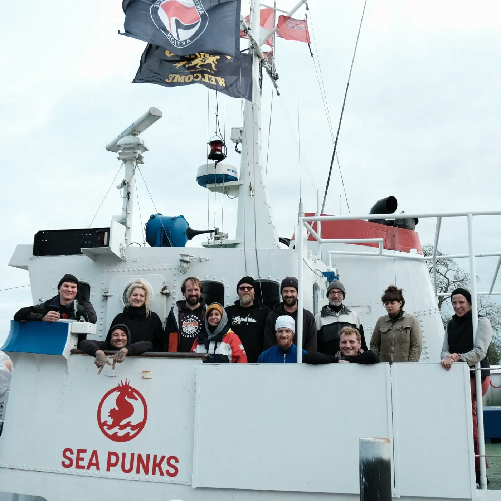
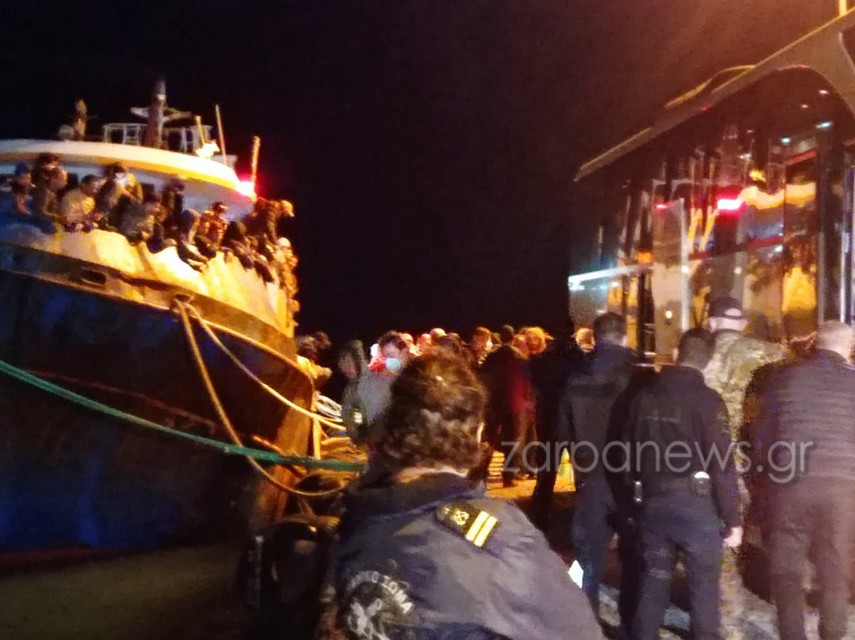
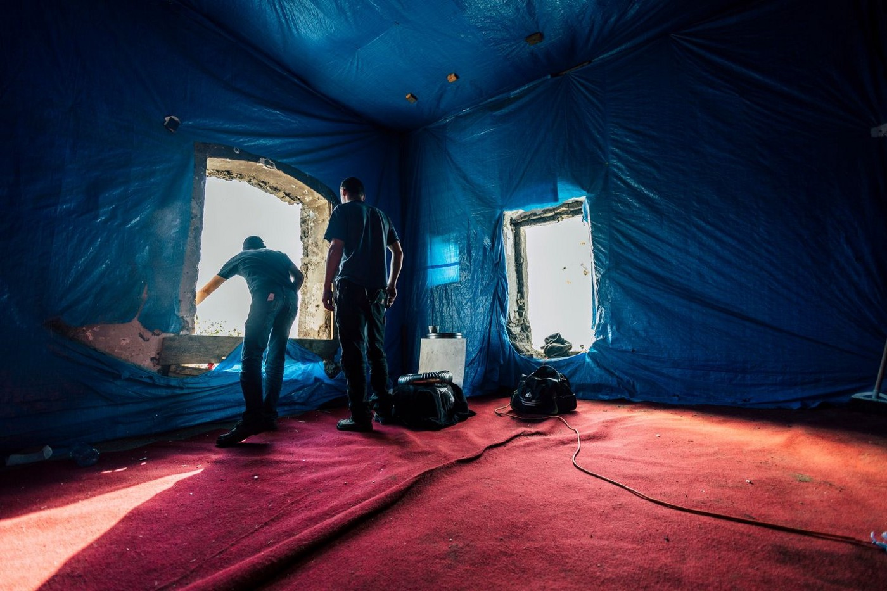
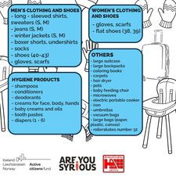
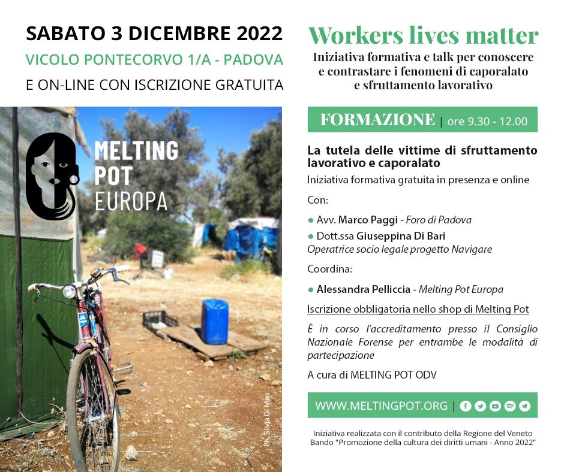

### AYS News Digest 23/11/22: People on the Move in Austria, Serbia, and Croatia left freezing due to cold and wet weather conditions

IOM reports that 50,000 People on the Move have died in transit since 2014// Still no formal investigation on LFJL’s claims regarding crimes against refugees in Libya// 490 asylum seekers arrived at the port of Paleochora, Crete// Suella Braverman unintentionally highlights the fact the UK asylum system is clearly broken…

](assets/84d6fd8b8e42/0*XG3CxsbqJq0OZGFV)

Source: Border Crossing Spielfeld, [Facebook](https://www.facebook.com/RefugeesSpielfeld/photos/a.1631564003770749/3209810302612770)
#### GENERAL
### Over 50,000 individuals have lost their lives on their migratory journeys as they sought a safer and better future for themselves

Whilst the data included in this IOM report is not completely accurate, nor can it be, these figures expose how much risk People on the Move are faced with when fleeing violence and persecution\.

IOM have reported that more than half of 50,000 deaths took place on the routes to and within Europe\. Around **25,104 lives** have been lost in the Mediterranean\.

> Over 30,000 people in the Missing Migrants Project records are of an unknown nationality, indicating that more than 60 per cent of those who die on migratory routes remain unidentified — leaving thousands of families searching for answers\. 

> …Of the missing migrants whose nationality could be identified, more than 9,000 were from African nations, over 6,500 were from Asia and another 3,000 were from the Americas\. 

Africa is the second deadliest region, as the IOM reports since 2014, there have been 9000 deaths among people on the move\.

In addition, along the US\-Mexico border there have been 4000 deaths since 2014, and almost 7000 deaths in the Americas in general, most enroute to the US\.

You can read the full report here: [2022 50k deaths\.pdf \(iom\.int\)](https://missingmigrants.iom.int/sites/g/files/tmzbdl601/files/publication/file/2022%2050k%20deaths.pdf)
#### LIBYA
### Still no formal investigation on crimes against refugees in Libya

A year ago today, LFJL, ECCHR Berlin, and the International Federation for Human Rights sent information to the ICC on crimes being committed against refugees and asylum seekers in Libya\. They call on Prosecutor Kamrin Khan to investigate properly, as well as on the EU and its member states to stop their involvement with the pullbacks by the Libyan Coastguard and to create more safe routes to the EU\.

■■■■■■■■■■■■■■ 
> **[Lawyers for Justice in Libya](https://twitter.com/LibyanJustice) @ Twitter Says:** 

> > [1/4] One year on since LFJL, @[ECCHRBerlin](https://twitter.com/ECCHRBerlin) + @[fidh_en](https://twitter.com/fidh_en) submitted information to the #ICC on crimes against humanity committed against migrants + refugees in #Libya, a formal investigation is yet to be launched, despite the Office of the Prosecutor declaring this a priority matter. https://t.co/DJSQdm6pwm 

> **Tweeted at [2022-11-23 09:48:16](https://twitter.com/libyanjustice/status/1595353529744588801).** 

■■■■■■■■■■■■■■ 

#### SEA/SAR
### New Humanity1 crew are getting ready for their next assignment

■■■■■■■■■■■■■■ 
> **[SOS Humanity](https://twitter.com/soshumanity_de) @ Twitter Says:** 

> > Die neue Crew der #Humanity1 bereitet sich mit Trainings auf unseren Schnellbooten (RHIBs) auf den nächsten Einsatz vor. Bald fährt das Schiff zurück ins zentrale #Mittelmeer. Unterstütze unsere lebensrettende Arbeit jetzt mit einer Spende! 👉 [sos-humanity.org/spenden/](https://sos-humanity.org/spenden/) 
#BackAtSea https://t.co/FUe73doN3G 

> **Tweeted at [2022-11-23 14:46:39](https://twitter.com/soshumanity_de/status/1595428621228937219).** 

■■■■■■■■■■■■■■ 

■■■■■■■■■■■■■■ 
> **[Erik Marquardt](https://twitter.com/ErikMarquardt) @ Twitter Says:** 

> > Heute haben wir im Europaparlament über die Seenotrettung diskutiert. Ich war leicht wütend, nach dem was Manfred Weber als Fraktionsvorsitzender der Konservativen gesagt hat, wie man vielleicht merkt. #LeaveNoOneBehind https://t.co/TW2w31AAC7 

> **Tweeted at [2022-11-23 19:38:34](https://twitter.com/erikmarquardt/status/1595502082357923863).** 

■■■■■■■■■■■■■■ 

### Sea Punks have announced they have managed to fundraise enough for a new ship, Sea Punk 1

#### GREECE
### 490 asylum seekers arrived at the port of Paleochora, Crete

They will be spending a second night on the boat as there have been complications with the disembarkation\. UNHCR will be putting out tents in the port tomorrow\.

■■■■■■■■■■■■■■ 
> **[RSA](https://twitter.com/rspaegean) @ Twitter Says:** 

> > UPDATE:
1/3 According to local media, the number of #refugeesgr and migrants who arrived yesterday in #Paleochora is 490. They will stay for a second night on a ferry boat which is open sideways and is tied up at the tourist port of Paleochora. #Crete [haniotika-nea.gr/stoys-490-oi-m](https://haniotika-nea.gr/stoys-490-oi-m) https://t.co/S5eQEG1TIr 

> **Tweeted at [2022-11-23 20:31:31](https://twitter.com/rspaegean/status/1595515410639716352).** 

■■■■■■■■■■■■■■ 

[Images of misery… Second night on the ferry boat the 490 refugees and migrants of Paleochora \| Photos \(zarpanews\.gr\)](https://www.zarpanews.gr/eikones-exathliosis-deyteri-vradia-sto-ferry-boat-oi-490-prosfyges-kai-metanastes-tis-palaiochoras-photos/)

[Hundreds of migrants survive dramatic high\-seas rescue — InfoMigrants](https://www.infomigrants.net/en/post/44910/hundreds-of-migrants-survive-dramatic-highseas-rescue)

[VIDEO : Five hundred people crammed in fishing boat rescued in Mediterranean \| Euronews](https://www.euronews.com/video/2022/11/23/five-hundred-people-crammed-in-fishing-boat-rescued-in-mediterranean)
### SERBIA
### Klikaktiv has posted regarding the upcoming cold winter months and the work they have done to protect people on the move in northern Serbia

The full post here: [\(3\) Facebook](https://www.facebook.com/klikaktiv/posts/pfbid0hS85uUPtqRsAGJgzR7JMRj3FtrdEspbRNVQx6dD3q82yfNDBqRJadbVz8VXsyU1Ml)
### Blindspots have also installed 50 stoves in squats in northern Serbia

■■■■■■■■■■■■■■ 
> **[Blindspots](https://twitter.com/blindspots_ev) @ Twitter Says:** 

> > ❗️JOINT ACTION AGAINST THE COLD: UPDATE❗️
Our construction team installed over 50 stoves in several squats in northern Serbia. Lacking electricity, stoves are often the only way of heating inside drafty squats. #burnwoodburnborders 1/4 https://t.co/sAjFHMoVaX 

> **Tweeted at [2022-11-22 09:43:59](https://twitter.com/blindspots_ev/status/1594990065964679172).** 

■■■■■■■■■■■■■■ 

#### CROATIA
### The work of AYS and the emergency response to people on the move who were left freezing and alone in Zagreb

AYS Free Shop remains the only place consistently and constantly providing people in need with things they need and support they might use\. Our volunteers are also actively supporting the people on the move who are not asylum seekers or asylees in Croatia, and we were among the initiators of an organised answer to the needs of those freezing around the main train station, and other secluded places in the city area\. This answer has so far come through the support of the City of Zagreb, but with very limited means and support, given that the official stance of Croatia is that the people who had been sent off with the infamous seven\-days' notice are supposed to be leaving the territory and “don’t fall under any support system”\. Given the shockingly poor reporting about this topic in Croatia, we intend to publish a long read in our AYS Specials series, in Croatian and in English, with more details about it\.

Donations are of course always welcome:

#### ITALY
### 3rd December — Free training \- Protection of victims of labor and corporal exploitation

When: Saturday 3/12/22, 9:30am–12:30pm

Where: Alley Pontecorvo 1, Padova

With:
\- Avv\. Marco Paggi, Forum of Padova
\- Dr\. ssa Giuseppina Di Bari — Legal Associate Operator N\.A\.V\.I\.G\.A\.Re Project \(Anti\-Tracting Network for Veneto, Intersections, Governance and Regional Actions\)
Coordination: Alessandra Pelliccia — Melting Pot Europe

#### AUSTRIA
### Emergency conditions in Austria

Cold and wet weather has left 300 individuals sleeping in wet tents for roughly two weeks\. Border Crossing Spielfeld are calling for emergency heated shelters, as well as proper rooms provided by the Ministry of Interior and State governments\.

> Catering as before consists of only 3 x 0\.5 litres of cold water, four slices of toast with sides for breakfast and dinner, a kebab for lunch\. Hot drinks will not be served\. Who no get money stay hungry\. 

The group is mainly from Syria and they have spent months travelling through Turkey, Greece and the Balkan route in order to reach Austria\. They are now being made to remain in these tents before being sent to more permanent forms of accommodation\.

](assets/84d6fd8b8e42/0*2msSiZj_WLm9sYae)

Border Crossing Spielfeld: [Facebook](https://www.facebook.com/RefugeesSpielfeld/photos/a.1631294960464320/3205142079746259)

Border Crossing Spielfeld are calling for donations:
- Winter\-proof men’s shoes Gr 39–44
- Backpacks
- Sleeping bags
- Handy thermos bottles with drinking vessels \(filled with sweetened tea upon direct delivery\)
- clothing \(pants, underwear, jumpers, jackets, bonnets, scarves, gloves shoes, underwear, socks\. Men Size S, M, L\)
- Hot drinks, especially in the morning and at night
- Warm balanced food to warm you up
- Snacks like dried fruits \(dates, raisins etc\. \), nuts, cookies, fruit juice, cereal bars
- fresh fruit
- toothbrushes, toothpaste, shampoo
- Quick Dry Towels
- Vitamin C — Shower Pills
- Clarification of the personal needs of very vulnerable individuals
- Medical clarification of escape injuries, wound care
- Internet access for communication with families

You can view the full post and who to contact for donations here: [Border Crossing Spielfeld — Posts \| Facebook](https://www.facebook.com/RefugeesSpielfeld/posts/pfbid025aS7gr5WTfEk469E2CQJhgArXnvcztZTszcYaoZWqw8RSZvkKRupGq3WbzqCfYmXl)
### Shocking image of the response to the presence of people on the move in Spielfeld:

[Graz: Spendenkonvoi \| So reagiert man in Österreich: anstatt endlich dafür zu sorgen, dass die Menschen in Spielfeld bei Minusgraden nicht mehr in Zelten ohne ordentliche… \| Facebook](https://www.facebook.com/groups/1706328169613315/posts/3579805722265541/)
#### GERMANY

At 9:30am on the 24th November, the Federal Constitutional Court will publish its decisions on whether 2\.1 sentence 4 no\. 1 of the Asylum Seekers Benefits Act is compatible with the right to guarantee a minimum level of subsistence that would respect human dignity\. This relates to whether single parents in crowded accommodations should be protected under this provision\.

You can read more here: [Bundesverfassungsgericht — Senatsbeschlüsse](https://www.bundesverfassungsgericht.de/DE/Presse/Senatsbeschl%C3%BCsse/Senatsbeschl%C3%BCsse_node.html?fbclid=IwAR1hiPHBXRvo617nrO142e0OIPZEBspcs0G5XpLEGJ5X9h3vytHG8sKLPp0)
#### UK
### Suella Braverman unintentionally highlights the fact the UK asylum system is clearly broken

In a questioning by Conservative MP, Tim Loughton, Suella Braverman is unable to clearly state what the legal routes are for entering the UK and how an individual can seek asylum in the UK without having to cross the Channel/enter irregularly\.

■■■■■■■■■■■■■■ 
> **[Andrew Connelly](https://twitter.com/connellyandrew) @ Twitter Says:** 

> > Incredible moment where Suella Braverman inadvertently admits the absurdity of the UK asylum system. https://t.co/8nVmIzNYBD 

> **Tweeted at [2022-11-23 11:20:08](https://twitter.com/connellyandrew/status/1595376648261623810).** 

■■■■■■■■■■■■■■ 

■■■■■■■■■■■■■■ 
> **[Safe Passage 🧡](https://twitter.com/safepassageuk) @ Twitter Says:** 

> > Utterly brilliant questioning of the Home Secretary this morning on the lack of safe routes & how refugees without a specific country scheme literally cannot seek asylum in the UK without entering the country in any way they can, she's left scrambling.

We need safe routes NOW 

> **Tweeted at [2022-11-23 13:19:21](https://twitter.com/safepassageuk/status/1595406652966051841).** 

■■■■■■■■■■■■■■ 

### Fleeing a Burning House — Freedom from Torture Report

The NGO, Freedom Torture has released a report on the reasons why torture survivors take such dangerous routes to reach the UK, and how policies should change in order to take a more humane, welcoming, and understanding approach\.

[FFT\_BurningHouseReport\_A4\_v5\.pdf \(freedomfromtorture\.org\)](https://www.freedomfromtorture.org/sites/default/files/2022-11/FFT_BurningHouseReport_A4_v5.pdf)
### Manston processing centre is now empty

The facility, which has a capacity for 1600 people and was supposed to be used as a temporary holding facility for asylum seekers, was reported to be holding 4000 individuals earlier this month\.

Everyone has now been moved to other centres and forms of accommodation\. Manston will continue to be used as a centre to conduct checks on individuals arriving across the Channel\.

[UK: Troubled Manston migrant center now empty, government says — InfoMigrants](http://www.infomigrants.net/en/post/44912/uk-troubled-manston-migrant-center-now-empty-government-says)
### WORTH READING:
- [How Refugees Transformed Polish Society During the Past Year \(September 2021 — September 2022\) \| Contemporary Southeastern Europe \(contemporarysee\.org\)](http://www.contemporarysee.org/en/stepaniuk?fbclid=IwAR1-LSONmoX0TIRZyDQhdCs7H1b1xkbSD4S7QaRATKZKpvmNpiRNDokS0ww)
- [How to Maintain Mental Hygiene as an Open Source Researcher — bellingcat](https://www.bellingcat.com/resources/2022/11/23/how-to-maintain-mental-hygiene-as-an-open-source-researcher/?fbclid=IwAR32RMOKibFia8MyQGwQpqO1bzwlB6-sVQO9zw7LHr4EvAAA53hiOp-geDA)
- [Terzo giorno di bombe turche sul Rojava\. Usa e Russia si defilano \| il manifesto](https://ilmanifesto.it/terzo-giorno-di-bombe-turche-sul-rojava-usa-e-russia-si-defilano?utm_medium=Social&utm_source=Twitter&fbclid=IwAR1AO_DcKj1ns7nn0JvkjuzLHCMsb_qcEM9BGcvjusqahoWX8YbP57mSMII#Echobox=1669204111-1)
- [First Public Video Footage of U\.S\. Government Force\-Feeding \(theintercept\.com\)](https://theintercept.com/2022/11/15/force-feeding-video-ice/)

**Find daily updates and special reports on our [Medium page](https://medium.com/are-you-syrious) \.**

**If you wish to contribute, either by writing a report or a story, or by joining the Info Gathering team, please let us know\!**

**We strive to echo correct news from the ground through collaboration and fairness\. Every effort has been made to credit organisations and individuals with regard to the supply of information, video, and photo material \(in cases where the source wanted to be accredited\) \. Please notify us regarding corrections\.**

**If there’s anything you want to share or comment, contact us through Facebook, Twitter or write to: areyousyrious@gmail\.com**

_Converted [Medium Post](https://medium.com/are-you-syrious/ays-news-digest-23-11-22-people-on-the-move-in-austria-serbia-and-croatia-left-freezing-due-to-84d6fd8b8e42) by [ZMediumToMarkdown](https://github.com/ZhgChgLi/ZMediumToMarkdown)._
