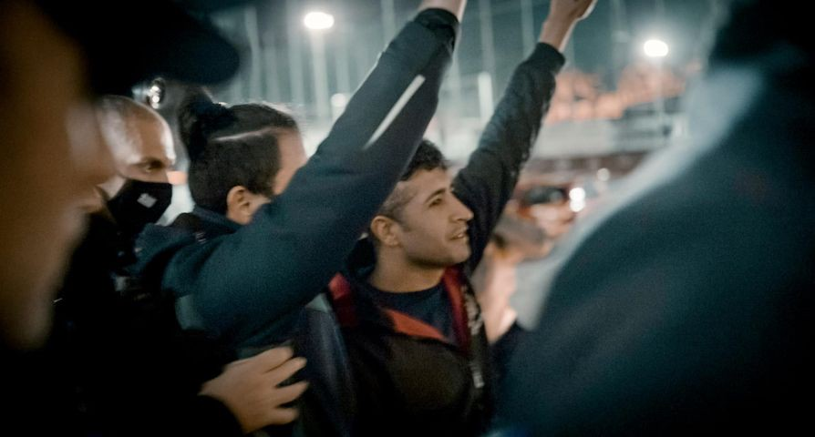
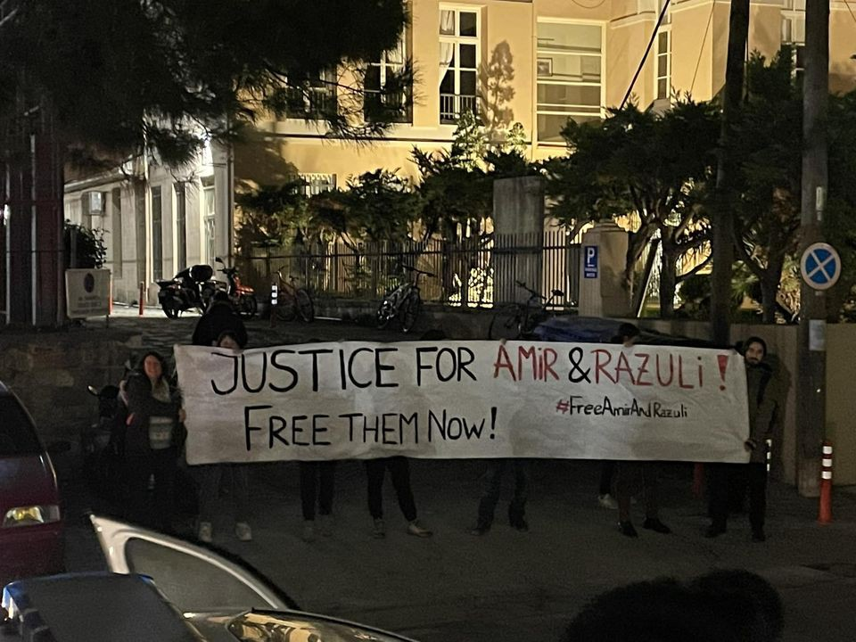
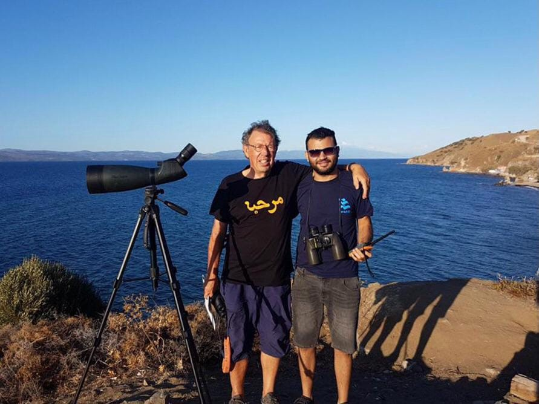
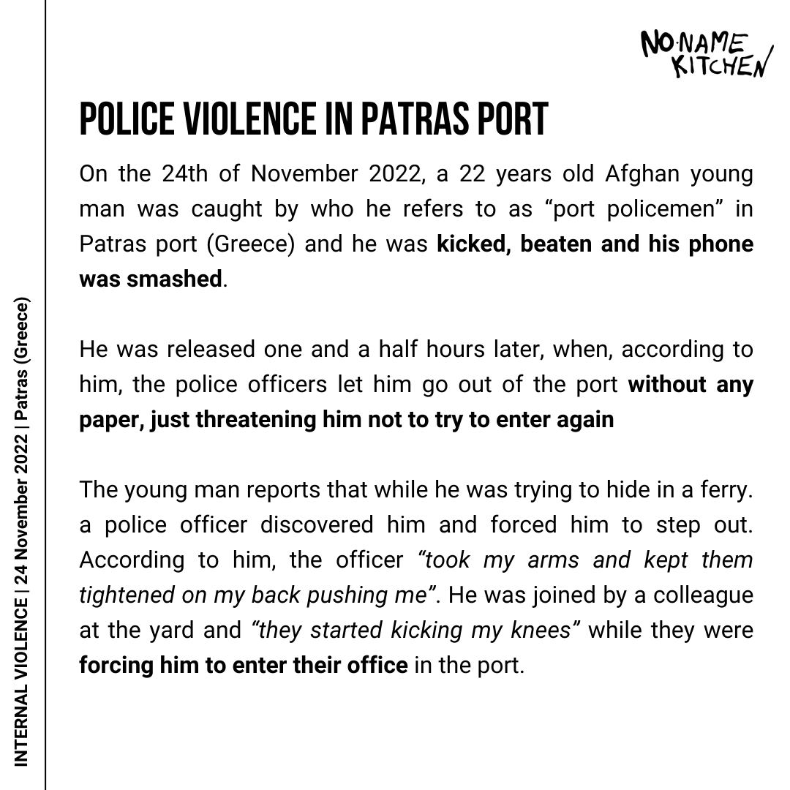

### AYS News Digest 8–9/12/2022: Akif Rasouli and Amir Zahiri Released\!
#### 53 People at risk in Atlantic // Evacuations from Geo Barents // Iuventa to be Restored // Police Violence in Greece // People trapped on Evros Islet // Video evidence of Bulgarian border shooting // EU Black sites, cages and torture // Protest in Geneva and more…
#### FEATURE: Akif Rasouli and Amir Zahiri Released\!

 \)](assets/c8e54c864014/1*sl-OTKb-AL2ivSFfcvqupg.jpeg)

\(Photo Credit: [Iasonas Apostolopoulos](https://www.facebook.com/iasonas.apos?__cft__[0]=AZU6qvPU1ofR4aDRDKyCIRCoXaz1P_UgmcZ8-0iEHQ-DLlYNkm9otBPtAnFx3kPSomyzQbDjwueIU0M09qzvc831lnl4QE5-42ci-gRRODMsoeBMJVeldFj70VUPTZ2KkHaGUICH5TykMbMbw2GZZbDi-x1pu5dcEV0pb5RRX3EjaJUg4_73R0HU6uwdjdftoLI&__tn__=-]C%2CP-R) \)

[After three years in prison on Lesvos Akif Rasouli and Amir Zahiri have been acquitted](https://www.facebook.com/permalink.php?story_fbid=pfbid02iGHwpoQZHMyDinBVR8WaNBMu1dUJyjLKRfp1KjjB8GotUpvodZCNiX1xki8MzSCxl&id=537806056) by the appeals court and released\. The two young men from Afghanistan had been sentenced to a total of 100 years in prison\.

> Upon hearing the verdict, his 9\-year\-old daughter broke into tears when she would see her father again\. They spent 3 years in prison without a single witness, not a single piece of evidence linking them to trafficking\. — [_Iasonas Apostolopoulos_](https://www.facebook.com/iasonas.apos?__cft__[0]=AZU6qvPU1ofR4aDRDKyCIRCoXaz1P_UgmcZ8-0iEHQ-DLlYNkm9otBPtAnFx3kPSomyzQbDjwueIU0M09qzvc831lnl4QE5-42ci-gRRODMsoeBMJVeldFj70VUPTZ2KkHaGUICH5TykMbMbw2GZZbDi-x1pu5dcEV0pb5RRX3EjaJUg4_73R0HU6uwdjdftoLI&__tn__=-]C%2CP-R) 

Their trail was postponed for a second time in April 2022, adding a further 8 months to their unjust and unjustifiable sentence\.

> They gave me 30 seconds to speak and put me in prison for 50 years\. I am an Afghan citizen and a refugee\. Why are they doing this to me? It’s unfair\. — [_Amir Zahiri_](https://thepressproject-gr.translate.goog/o-amir-zachiri-kai-o-akif-rasouli-tha-perimenoun-allous-8-mines-adika-sti-fylaki-tous-katadikasan-se-50-chronia-gia-diakinisi-choris-kanenan-martyra-katigorias/?_x_tr_sl=el&_x_tr_tl=en&_x_tr_hl=en&_x_tr_pto=sc) 

This sentence was handed down after they were accused of trafficking by port guard\. Amir has always been clear that he only drove the boat briefly to save his family’s lives when their trafficker abandoned them in the middle of the sea after the Greek coast guard tried to push them back to Turkey\. In this case, it is only the pushback and the false imprisonment of these men which count as criminal actions\. In both instances it is the Greek state which is in breach of the law\.

> Amir and Akif symbolize thousands of prisoners\. It is a tactic of Greece and Italy to mass imprison random refugees, naming “trafficker” anyone found near the steering wheel of the boat\. 

> Their prosecution is punishable and constitutes criminalization of the very asylum and the right to asylum\. — [_Iasonas Apostolopoulos_](https://www.facebook.com/iasonas.apos?__cft__[0]=AZU6qvPU1ofR4aDRDKyCIRCoXaz1P_UgmcZ8-0iEHQ-DLlYNkm9otBPtAnFx3kPSomyzQbDjwueIU0M09qzvc831lnl4QE5-42ci-gRRODMsoeBMJVeldFj70VUPTZ2KkHaGUICH5TykMbMbw2GZZbDi-x1pu5dcEV0pb5RRX3EjaJUg4_73R0HU6uwdjdftoLI&__tn__=-]C%2CP-R) 

Other cases of criminalization are still ongoing\. [On Monday the 5th of December Pieter Wittenberg trial was held in relation to the ERCI case](https://www.facebook.com/HIASGreece/posts/pfbid02wFjVo1Ki72K6HVcxqXWx251KfGbmNVJPJx7W3rCJktajBQYc1GEwMXr6Abd7Ey87l) which has numerous defendants including [Sara Mardini](https://www.aljazeera.com/news/2021/11/17/activists-in-greece-face-charges-for-assisting-incoming-refugees) \. The charges include human smuggling and financial crimes\. The investigation began in 2018 and is still ongoing with the usual absence of evidence, dubious claims and a lack of witnesses\. These cases seem designed to break the spirits of people on the move and those who work alongside them in solidarity and yet people continue to struggle and fight for a fairer world of equality of movement across borders\.

**SAR**
#### Rescue needed in the Atlantic

53 people have now been at sea for 3 nights and can no longer be contacted\. MRCC Rabat has not responded to requests for rescue despite the boats location in their search and rescue zone\. [Delaying rescues in this manner](https://www.msf.org/least-30-people-feared-dead-after-tragic-rescue-central-mediterranean) and [non\-assistance has shown time and time again to cost lives and is illegal under international maritime law](https://www.biicl.org/blog/31/migrant-crossings-in-the-channel-non-assistance-securitisation-and-accountability-under-international-law) \.

#### Evacuations from Geo Barents

[Two women and five children have been evactuated from the Geo Barents](https://www.infomigrants.net/en/post/45269/two-evacuations-from-geo-barents-after-baby-born-at-sea?fbclid=IwAR3tJ68_s76Gn4BUn--XssRNSb5Ca0kt3jp0WUJj3VwwgRXEKbZmiegKHuM) though 248 people remain onboard awaiting a safe port\. The first mother gave birth on the boat and endured seven hours of labour at sea brought on by the stress of the journey she had undertaken from Libya\. At first Italian authorities suggested that they would evacuate only her and her newborn, leaving her three other sons on board\. They have now all been accepted on Lampedusa along with [33 people from the Louise Michel](https://twitter.com/MVLouiseMichel/status/1601203775238070277/photo/1) \. The other pregnant woman who is also at full term has been taken to Malta\.

[A young boy of fourteen](https://twitter.com/MSF_Prensa/status/1601198989269151744/photo/1) who was travelling alone and suffering from abdominal pain has also been taken from the ship to Sicily\.

[261 people have been given safe harbor in Bari](https://www.ilpost.it/2022/12/09/humanity-1-migranti-sbarco-bari/) , Italy from the Humanity1 Vessel\.

Being held at sea and prevented from landing after long and arduous journeys is in itself a traumatizing experience and this practice must end\.
#### Iuventa to be Restored

The Court on Trapani has ruled that extensive maintenance work must be carried out on the Iuventa in order to restore it to the condition it was in before the seizure in August 2017\.

**GREECE**
#### Police Violence

In a week which [commemorated the murder of 15 year\-old Alexandros Grigoropoulos](https://thepressproject.gr/the-murder-of-alexandros-grigoropoulos/) by the police and [during which the police shot another unarmed 16 year\-old, Kostas Fragoulis, in the head](https://racistcrimeswatch.wordpress.com/2022/12/06/1-1397/) , No Name Kitchen have been collecting testimony about police violence against people on the move in Patras\.

 \)](assets/c8e54c864014/1*5GXyWCHnAFpmbwPt1l9O6g.jpeg)

\(Photo Credit: [NoNameKitchen](https://twitter.com/NoNameKitchen1) \)
#### People trapped on Evros Islet

On the 8th of December Alarm Phone were informed of a group of people trapped on an islet in Evros\. The officer they contacted at the Soufli border guard station then informed them that they had searched the area and found no one\. However, this islet is divided between Greek and Turkish territory and [it is likely to be the same area were people were trapped during the summer](https://twitter.com/lk2015r/status/1601279830204370944?t=gV_jBBshj4X7W9RwqA1YSg&s=19&fbclid=IwAR1b1z4aKS8QR8-PwTaIpyk0-oZSQMc-79NxQguFrpgnFj_2IHvQr_gSt-0) when both countries refused to initiate rescue [leading to disagreement between political parties in Greece](https://twitter.com/g_christides/status/1559834010452467713) \. [The Greek Ministry of Citizen Protection has stated that the coordinates which were shared are not in Greek territory](https://www.tanea.gr/2022/12/09/greece/evros-synagermos-gia-omada-metanaston-se-nisida-anikei-stin-tourkiki-epikrateia/) \. [Either side’s ability to accurately state the division of the territory of this tiny islet has also been called into question](https://endiaferon.github.io/evros-islet-border-facts/) as it is based on a map from 1926 of poor scale\. Meanwhile the use of people in distress to further arguments between two governments puts people’s lives at risk\. [In August this led to the death of a five\-year\-old girl\.](ays-news-digest-10-8-22-a-5-year-old-girl-died-on-evros-her-family-still-remains-there-helpless-869b6d619c2d)

The individuals who were on the islet have not been heard from since their families raised the alarm and their fate is unknown at the time of writing\.

**BULGARIA**
#### First Video of EU border shooting

This week Lighthouse reports published the video of a young man, 19\-year\-old Abdullah Mohammed, being shot at the Bulgarian border with Turkey along with his testimony of his experience\. [The vehicles seen at the scene and the uniforms worn by the men present in witness videos match those of the Bulgarian border force](https://twitter.com/LHreports/status/1599796147140194304) \.

Please be aware that this tweet shows the non\-fatal shooting of a teenager\.

■■■■■■■■■■■■■■ 
> **[Lighthouse Reports](https://twitter.com/LHreports) @ Twitter Says:** 

> > On 3 Oct this year, Abdullah Mohammed, 19, tried to enter Bulgaria in the hope of claiming asylum

His group was pushed back. Footage shows some of them throwing stones at the Bulgarian border in protest. 

A shot rings out; Abdullah falls to the ground https://t.co/0XBZUSy5WD 

> **Tweeted at [2022-12-05 16:01:16](https://twitter.com/i/status/1599796054337413121).** 

■■■■■■■■■■■■■■ 

**SWITZERLAND**
#### Protest in Geneva

 \)](assets/c8e54c864014/1*FBHTaEi5A_L39cypuGIpYQ.jpeg)

\(Photo Credit: [Chiara Lauvergnac](https://twitter.com/Lauvergnac) \)

A press conference was held on the 9th of December outside the UNHCR headquarters in Geneva highlighting the treatment of people on the move in Libya\. Today \(10th of December\) they call for a march through Geneva\.

There have been [many reports written about the situations faced by people on the move in Libya](https://www.amnesty.org/en/location/middle-east-and-north-africa/libya/report-libya/) and [those who are returned there](https://www.rescue.org/uk/press-release/irc-extremely-concerned-about-safety-migrants-and-refugees-being-returned-libya) by the [EU funded Libyan Coast Guard](https://reliefweb.int/report/libya/eu-funded-boats-abusive-libyan-coastguard-underline-european-complicity-grave) \. The situation in detention facilities have been described as so bad that [they may amount to crimes against humanity](https://news.un.org/en/story/2022/03/1114842) \. In October of this year the bodies of 15 people on the move were found in Sabratah\.

> Eleven charred bodies were found inside the docked boat with a further four wounded bodies found outside\. — [_UNSMIL_](https://twitter.com/UNSMILibya/status/1579104323648491520) 

These murders are thought to have been carried out by rival traffickers\. While Libya remains in an unstable and dangerous state with no single government it cannot be considered a safe country for people on the move and people must not be returned there\.

■■■■■■■■■■■■■■ 
> **[UNFAIR Agency](https://twitter.com/UNFAIR_agency) @ Twitter Says:** 

> > Strong interventions from comrades affected by the racist border regimes are continuing in our livestream:

[youtu.be/6yr0vcAGTD0](https://youtu.be/6yr0vcAGTD0)

Listen here to spokesperson @[Yambiodavid](https://twitter.com/Yambiodavid) of @[RefugeesinLibya](https://twitter.com/RefugeesinLibya) https://t.co/BmVVLm4cAW 

> **Tweeted at [2022-12-09 12:46:19](https://twitter.com/i/status/1601196543410831360).** 

■■■■■■■■■■■■■■ 

**EU**
#### Black sites, cages and torture

A further report from Lighthouse highlighted the continued use of cages at EU borders which [we reported about in 2019 in Bosnia](https://ba.voanews.com/a/bih-migranti-u-kavezima/4886022.html) \. They also discovered shipping containers in Hungary & prison vans in Croatia which are being routinely used by authorities to imprison people & prevent them claiming asylum\.

■■■■■■■■■■■■■■ 
> **[Lighthouse Reports](https://twitter.com/LHreports) @ Twitter Says:** 

> > This week we released footage of Bulgarian border forces shooting a Syrian refugee. They denied it. The EU’s called for an investigation

This wasn’t an isolated incident. Today we place it in a wider system at EU borders reliant on black sites, cages &amp; torture

THREAD https://t.co/d9fht29hG3 

> **Tweeted at [2022-12-08 06:08:41](https://twitter.com/i/status/1600734089354829824).** 

■■■■■■■■■■■■■■ 

**WORTH READING**

[The New Humanitarian \| Five migration solutions for Europe for 2023](https://www.thenewhumanitarian.org/opinion/2022/12/06/migration-solutions-Europe-2023-policy-ideas?fbclid=IwAR3vkDiZN8yjHtngO63CkAr8RVW5BVrHyZFMFV2ZQvD-PXBByy01lW6EHLo) _European debates about migration are intractable, polarising, and broken, fuelling a downward spiral of ever more extreme policies aimed at keeping people out\. To break this cycle, there’s a desperate need to reframe the conversation to focus on achievable policy goals that will benefit both people on the move and the countries they aim to reach\._

[The West’s Broken Approach to Refugees \| The Nation](https://www.thenation.com/article/world/refugees-ukraine-greece-frontex/?fbclid=IwAR1PrrTguJ6r6iy4EyE9R6AliM7YQWa5AGQJpxwPzx0JOdoWJ9LN65wz4bA) _The persecution of non\-white refugees seems to be on the rise not just in countries with far\-right governments, but also in those known for their liberality\._

[Unequal mercy: The increasing persecution of refugees \| Salon\.com](https://www.salon.com/2022/12/06/unequal-mercy-the-increasing-persecution-of-refugees_partner/?fbclid=IwAR3B1ok1-wBT9eNQ5stPKmvPlMokGzYdx3dQNV81-HLuFzSc19C94XI7hvM) _Almost anyone would agree that war is horrifying and peaceful countries should do their best to help its victims\. The widespread eagerness to welcome fleeing Ukrainians after Russian President Vladimir Putin invaded their country last February is a heartening example of such aid\. But behind that altruism lies an ugly truth: most of the countries embracing Ukrainians are simultaneously persecuting equally desperate refugees from elsewhere\._

[Could Sweden’s tough migration stance spill over into the EU? — InfoMigrants](https://www.infomigrants.net/en/post/45224/could-swedens-tough-migration-stance-spill-over-into-the-eu?fbclid=IwAR36Gf4ee2wFt2IJzK8rgyHUqyy258K4_opLvp4Cdfwxftjswu12qUJeRo0) _Sweden takes over the rotating EU Presidency at the beginning of the new year\. After a new government took power in October promising to get tougher on immigration, could those attitudes spill over into European policy next year? On December 3, Sweden sent a Kurdish man named Mahmut Tat back to Turkey, according to French broadcaster Radio France International \(RFI\) \. He was expelled after living there since 2015\._

[Chronology of Search and Rescue operations Humanity 1, 3rd Rotation — SOS HUMANITY \(sos\-humanity\.org\)](https://sos-humanity.org/en/saving-lives/chronology-of-search-and-rescue-operations-humanity-1-3rd-rotation/?fbclid=IwAR3Tnzo6puzJ5gxG9egyMdt7wGRdoRz_EmDGxvKdf8dNVi9rV7pDneuFwK4) _The rescue ship Humanity 1 has been in the search and rescue zone in the central Mediterranean since 30 November\. After three rescues, a total of 261 people are now on board\. On 6 December, the non\-governmental rescue ships Humanity 1 and Louise Michel witnessed a violent pull\-back of those seeking protection by the so\-called Libyan Coast Guard to Libya\. Six survivors were left behind in the water and brought on board the Humanity 1\. With the weather conditions worsening, the rescue ship Humanity 1 is waiting for the allocation of a place of safety for the 261 survivors on board\._

[Immigration authorities: The bureaucratic chaos \(fragdenstaat\.de\)](https://fragdenstaat.de/blog/2022/12/09/auslaenderbehoerden-das-systematische-chaos/?fbclid=IwAR0mRc45IOG0aqlXscaADlstUuRsZiiuwHR-RayXVcn9VlvGejFymme2eMA) _Together with the ZDF Magazin Royale, we have taken a close look at the “system of immigration authorities” in recent months\. With the help of [numerous requests under the Freedom of Information Act \(IFG\),](https://fragdenstaat.de/projekt/weisungen-zu-aufenthaltstgesetz-asylgesetz-und-familiennachzug/) we have received and evaluated over 1,000 internal documents\. The result makes it clear that there is bureaucratic chaos behind the immigration authorities — with far\-reaching consequences for those who are dependent on the immigration authorities\._

[Europe doesn’t just have an external border: how the EU is upgrading borders in Africa \| United4Rescue](https://united4rescue.org/de/logbuch/europa-hat-nicht-nur-eine-aussengrenze/?fbclid=IwAR1ZIqL0BplD6ZEoJFiUV2LohTp_meRmcEyNH5xFiFdQIIgp_cBB5rphzo8) _In order to ward off people fleeing their own \(external\) border, the EU has entered into cooperation agreements with a number of African states, so\-called migration agreements\. Among other things, border protection is outsourced — externalized\. We talk to Andreas Grünewald, consultant for migration at Brot, for Die Welt about the consequences\._

**Find daily updates and special reports on our [Medium page](https://medium.com/are-you-syrious) \.**

**If you wish to contribute, either by writing a report or a story, or by joining the Info Gathering team, please let us know\!**

**We strive to echo correct news from the ground through collaboration and fairness\. Every effort has been made to credit organisations and individuals with regard to the supply of information, video, and photo material \(in cases where the source wanted to be accredited\) \. Please notify us regarding corrections\.**

**If there’s anything you want to share or comment, contact us through Facebook, Twitter or write to: areyousyrious@gmail\.com**

_Converted [Medium Post](https://medium.com/are-you-syrious/ays-news-digest-8-9-12-2022-akif-rasouli-and-amir-zahiri-released-c8e54c864014) by [ZMediumToMarkdown](https://github.com/ZhgChgLi/ZMediumToMarkdown)._
