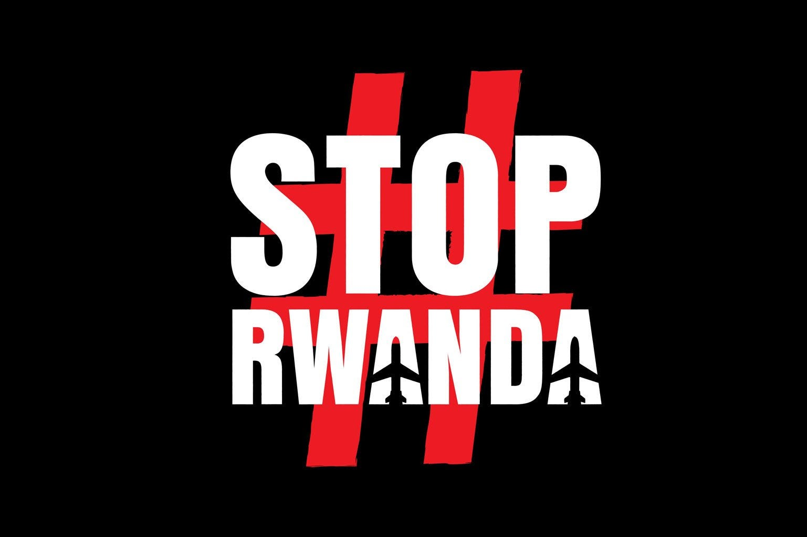

### AYS News Digest 20.12.2022: UK Rwanda plan “not unlawful” judges rule
#### Protests in Belgium // Amnesty International suspect Melilla cover-up // Choose Love: former employees speak out // Frontex interim-boss under investigation
### FEATURE
### UK Rwanda plan “not unlawful” judges rule

UK judges have ruled that removing asylum seekers to Rwanda does not break international law.

The decision came on Monday after groups brought a case against the government, stating:

> “The relocation of asylum-seekers to Rwanda is consistent with the (UN) Refugee Convention and with the statutory and other legal obligations on the government including the obligations imposed by the Human Rights Act 1998.” [Euractiv](https://www.euractiv.com/section/justice-home-affairs/news/uk-judges-rule-rwanda-deportation-plan-lawful/?fbclid=IwAR11J7CGbTQ32usFJdMiymfXbIL-80skZOcW9DcTdIiTWg7f0wO5tbiQoxQ) 

The cases of eight individuals however, were ruled to have not been properly considered and must be re-assessed by the Home Secretary.

Care4Calais, one of the organisations who brought the case to the High Court reacted:

> “We remain steadfast in our opposition to the brutal Rwanda policy and in our determination to ensure that no human is forcibly deported to the country. We are considering all our legal options, including appealing to a higher court.” [Care4Calais](https://www.instagram.com/p/CmW2hf9tnL3/) 

The decision was met positively by [Rwandan authorities](https://www.maravipost.com/rwanda-welcomes-uk-judges-ruling-validating-deportation-plan/) whilst UNHCR maintains that the deal “contravenes the UK’s international obligations”.

The agreement with Rwanda was supposed to be a deterrent to people seeking safety, and to discourage people from making the dangerous journey to the UK. However, journeys by boat from France have continued with 43,000 people arriving to the UK this year.

Last week, four people sadly lost their lives on the journey and a young man has been arrested on a charge of smuggling in relation to this boat crossing last week. The 19-year-old faces “ [charges of aiding illegal entry attempts into the UK](https://www.infomigrants.net/en/post/45497/uk-charges-young-suspect-on-smuggling-charges?fbclid=IwAR1BngPZpz12KnBvCMRx-JssMWP5bYvvDCWLnJtDCzlmaqCf86mXPhjo2QI) ” and is due to appear in court in Kent.
#### POLAND-BELARUS

Detention of Afghan citizens in Poland has been ruled illegal. [The Helsinki Foundation for Human Rights](https://hfhr.pl/upload/2022/12/hfhr-legal-brief-on-push-back-judgements-eng.pdf?fbclid=IwAR04DRXNuafoRCHW2cnCNwA0EWeZDYnbI4xP_16ICF_yCcvwklhDNAah1SY) has published a report stating that, in ten cases, people who crossed the border from Belarus were unlawfully detained, and despite evidence of request for asylum, were taken by Polish border guards and returned to Belarus. Numerous cases are still pending. Polish organisation [Grupa Granica recently published an update](https://hfhr.pl/upload/2022/12/report-of-grupa-granica-october-and-november.pdf?fbclid=IwAR13Oqav4c7Nb88J52tHQVJeG3roijW0iDbYl-3spjdlAw807hEMR24oiQs) on the situation there.
#### GREECE
#### Loss of life off Lesvos

[A two month old baby has died](https://www.barrons.com/news/two-month-old-baby-dies-in-migrant-shipwreck-off-lesbos-01671276008?tesla=y&fbclid=IwAR0dWKxJhgJ09WMxpqmDtVjaIc464iQgb3tbftX7eNdilcmJBfM4z4BhPo0) before arriving on the island of Lesvos. The child was part of a group whose boat wrecked on the rocks in the Fara area of the island on 16th December. Medical organisation MSF were en route to assist at the incident when they were stopped by the Greek police for two hours, and another team was delayed by the Hellenic coastguard.

> “We will never know if these two hours would have allowed us to save the life of the baby.” 

■■■■■■■■■■■■■■ 
> **[MSF Sea](https://twitter.com/MSF_Sea) @ Twitter Says:** 

> > ‼️ Yesterday MSF and the Greek authorities received an alert of people in need after a shipwreck off the coast of #Lesbos. MSF provided medical and psychological support to 34 survivors. Tragically, a 2-months old baby was found dead. Two people were referred for urgent care. 

> **Tweeted at [2022-12-17 16:34:47](https://twitter.com/msf_sea/status/1604153141141700609).** 

■■■■■■■■■■■■■■ 

[Turkish media has reported the violent pushback of a group](https://www.dha.com.tr/gundem/yunan-guvenlik-guclerinin-darbettigi-iranli-yumrukla-tekmeyle-agacla-vurdular-2178920) of 45 people from Greece in the Evros region. There are photos of injuries sustained by the people from Iran, Afghanistan and Morocco. The detailed report of events that we know happen on a frequent basis, were reported in Demirören Haber Ajansi — a news outlet owned by Erdogan Demirören who is reported to be close to the government.

Pushbacks from Greek islands are also frequent and well documented. [This detailed report](https://aegeanboatreport.com/2022/12/17/15-children-left-drifting-in-life-rafts-by-greek-authorities/?fbclid=IwAR1VolPSZuXnehkZmbLiThTkml9rtzWwshevwgNt4n_hEtfw1XlWlfNSNRI) outlines the events of 6th December, when 41 people were put in inflatable life rafts and left drifting at sea after arriving on the island of Lesvos. The alleged tactics of the authorities, who attempt to delay the intervention of NGOs are particularly shocking.
#### AUSTRIA
#### Austria teams up with Hungary against smuggling

Operation Fox, which officially started last week, is a co-operation between Austrian and Hungary officials to combat ‘ [smuggling activities](https://www.schengenvisainfo.com/news/austria-hungary-join-forces-to-combat-smuggling-activities/?fbclid=IwAR2Novk-U02vz33Soa2-WAc290Yba6eTxguPMoyDoFBf-CvvTlg2Hf6TbiU) ’. No real details are published but technology is likely to be shared.
#### GERMANY
#### Berlin is working hard to prevent homelessness

The city-state of Berlin is expecting many more new arrivals over Christmas and the New Year and is [working to put emergency accommodation solutions in place](https://www.tagesspiegel.de/berlin/wir-wollen-obdachlosigkeit-abwenden-landesamt-und-initiativen-bereiten-unterbringung-weiterer-gefluchteter-in-berlin-vor-9061477.html?fbclid=IwAR3XHLWyvjlenIb1KpY4gCN8X4K6QD1Ns4hB7pZoNU-Y1i3GV5l6O7ubyQI) . The number of people arriving in Berlin this year has been higher than previously, including those fleeing Ukraine.

Meanwhile, integration minister and FDP politician Joachim Stamp wants to create deals with other countries that allow easier return of those who were not granted protection, as well as legal opportunities to travel to Germany. [This long read gives some background to this.](https://www.sueddeutsche.de/politik/abschiebung-migrationsbeauftragter-stamp-1.5718583?fbclid=IwAR0fFl8O3Ev2n_hUtHngi0d-TXrQ-WibJgK01rBJQspd_NVKo97bN7V2Bok)
#### SWITZERLAND
#### Emergency refugee resettlement intake paused

Switzerland has [paused the arrival](https://www.swissinfo.ch/eng/switzerland-suspends-intake-of-vulnerable-refugees/48143692?fbclid=IwAR1nGOSgVsmbHm8OQIoH98YE_l8kLl8Hx-nzUv6PAEXLP-IaCCbs4Gv16uw) of vulnerable people who were due to be resettled by UNHCR. This comes as [the army has provided further accommodation](https://www.schengenvisainfo.com/news/swiss-army-provides-migration-agency-with-additional-accommodation-due-to-high-number-of-asylum-seekers-ukrainian-refugees/?fbclid=IwAR1wOOJ2-zALhQ_QSf1cZD9TX32SUOryriIc5tL6ctCSmJINaNQ5OTu-RVg) and personnel as the number of people seeking help remains high. The continued arrival of people from Ukraine, as well as asylum seekers from elsewhere, are the reasons given for the decision, which has been criticised by the opposition party.
#### BELGIUM
#### NGOs protest in Brussels

[Six NGOs protested outside the offices of the Belgian Prime Minister](https://www.bruzz.be/actua/ngos-hebben-wetstraat-16-enkele-uren-bezet-eisen-oplossing-voor-asielzoekers-2022-12-19?fbclid=IwAR2FtwOKoHkIH1cl0vyy3uGWQdXwEqD55Ibw7LIMduJ0yywoUAIuN0gvZuU) Alexander De Croo on Monday. The groups are calling for better treatment for people seeking asylum. This was preceded on Sunday evening by [members of the centrist party pitching tents](https://www.brusselstimes.com/politics/339382/centrist-party-les-engages-pitch-tents-outside-pms-offices-in-protest-at-asylum-reception-crisis?fbclid=IwAR3xyV-4JPVfesOol-CdHEcc4mZZ7lV4tQfNVTFAFBPmx4ZPf8KqivW4tfU) outside the offices of the ruling party.

Currently, there are not enough places in reception centres, with 2,700 people in the queue to have their asylum claim assessed. The winter conditions force people to seek shelter in unhygienic conditions and the system makes accessing the help that does exist difficult.
#### SPAIN
#### Amnesty International suspect Melilla cover-up

Six months after the tragedy in Melilla in which 37 people died and 77 remain missing, [Amnesty International suspects foul-play](https://www.amnesty.org/en/latest/news/2022/12/morocco-spain-stalled-and-inadequate-inquiries-smack-of-cover-up-six-months-after-37-deaths-at-melilla-border/?fbclid=IwAR3xyV-4JPVfesOol-CdHEcc4mZZ7lV4tQfNVTFAFBPmx4ZPf8KqivW4tfU) by the Spanish and Moroccan authorities. A vigil is held every month in Valencia for those who died and are missing, with one friend who attends sharing with us:

> “Everybody knows what happened, they were killed by Morocco Police, some of them fell down from \[the border\], and some were able to cross the border, but they were threatened also by the Spanish police that let Morocco police to cross the border and picked them back to Morocco. A big number were agonising on the floor without any kind of medical assistance. Still now we don’t know how many people died.” 

Those who survived the incident and could remain in Spain have shared their stories.

■■■■■■■■■■■■■■ 
> **[CEAR](https://twitter.com/CEARefugio) @ Twitter Says:** 

> > 📺 Ahmed A., Ahmed F., Anour, Ammar y Yahya sobrevivieron a la #TragediaDeMelilla y entraron en España.

Su vida nunca será igual, pero han decidido hablar para lograr justicia y reparación, y que los hechos jamás se repitan. 

Este es su estremecedor relato.🧵👇🏾 https://t.co/9dHoB2WqpW 

> **Tweeted at [2022-12-16 11:25:22](https://twitter.com/cearefugio/status/1603712888329248769).** 

■■■■■■■■■■■■■■ 

#### SWEDEN
#### Three year wait for asylum claim decision

A report by Sweden’s Parliamentary Ombudsman has found that, despite the wait time of three years or longer, cases were “ [not actively processed for the majority of the processing time](https://www.thelocal.se/20221213/revealed-the-truth-about-long-waiting-times-at-swedens-migration-agency/?fbclid=IwAR2FtwOKoHkIH1cl0vyy3uGWQdXwEqD55Ibw7LIMduJ0yywoUAIuN0gvZuUhttps://www.thelocal.se/20221213/revealed-the-truth-about-long-waiting-times-at-swedens-migration-agency/?fbclid=IwAR2FtwOKoHkIH1cl0vyy3uGWQdXwEqD55Ibw7LIMduJ0yywoUAIuN0gvZuU) ”. The report criticises the long waiting times and calls for more resources to be allocated in order to speed up decisions. Waiting is a part of every asylum process, and the report points out that:

> “The Swedish Migration Agency’s decision in matters of citizenship and residence permit has great significance for those affected. To wait for such a long time for decisions can cause insecurity and suffering.” [JO Report](https://www.jo.se/PageFiles/34855/578-2022%20.pdf?fbclid=IwAR1VolPSZuXnehkZmbLiThTkml9rtzWwshevwgNt4n_hEtfw1XlWlfNSNRI) 

#### SEA and SEARCH and RESCUE (SAR)
#### Maltese authorities continue neglect those in danger

Three different vessels called for help over the weekend, all of whom were in or very near to Maltese waters. Civil rescue ships were able to provide assistance in each case — [Sea Eye 4](https://twitter.com/alarm_phone/status/1604890709802520576?fbclid=IwAR1OxLdLzmZE2XADJYopHnmYxBwqVO6XlEuO8e3kgZ10Rsef7OYwcInK9mM) , [Life Support](https://twitter.com/emergency_ngo/status/1604784378479001602?fbclid=IwAR1oLSX0siFZ6IRSjBXNF7y6PsbJ9MPeqEbF0bxfNRYkqYqy2Trl77cl6ig) and [Open Arms](https://twitter.com/alarm_phone/status/1604586718035935236) .
#### GENERAL
#### Choose Love: former employees speak out

December 2021 saw Choose Love — a major funder for many projects in France, Greece, the UK and Syria — cut funding with little notice. Today former employees shared an open letter.

As shared in an AYS Special published shortly after the events ( [which you can read here](ays-special-choose-love-but-not-in-france-499d304df742) ), Choose Love withdrew funding, required silence from the organisations they funded and provided no good explanation for the withdrawal. The alleged corruption of the charity and the parent company Prism Gift Fund are publicly known yet the charity continues to function.

The letter shared anonymously by former employees of the charity speaks of serious misconduct in numerous ways.

> “From openly badmouthing volunteers; disbanding your staff’s well-being team in the middle of the pandemic, to grievances being reviewed by friends of people in power rather than an objective board. This is on top of cutting funding from projects without sufficient explanation or support for them to find alternatives — for an organisation that talks about humanity, many of us feel this trait is often sadly lacking in the organisation’s leadership.” [Freedomnews](https://freedomnews.org.uk/2022/12/17/choose-truth-former-choose-love-employees-speak-out/?fbclid=IwAR1SUAb0qLDdRC4HWud27NM63KKEEo0FWNZcYBS3aN2Ur2k93rchCOAzNmo) 

The letter includes mention of rape allegations which were reported on by the Times newspaper, which led to trauma of the survivor when everything was done to silence the scandal. [Read the full letter here.](https://freedomnews.org.uk/2022/12/17/choose-truth-former-choose-love-employees-speak-out/?fbclid=IwAR1SUAb0qLDdRC4HWud27NM63KKEEo0FWNZcYBS3aN2Ur2k93rchCOAzNmo)
#### Frontex interim-boss under investigation

Aija Kalnaja, the interim head of Frontex, is [under investigation by the anti-corruption watchdog.](https://www.euractiv.com/section/justice-home-affairs/news/frontex-interim-director-under-investigation/?utm_source=piano&utm_medium=email&utm_campaign=27662&pnespid=rKlpAiJaKqkFgOXZoz6zFJ2VsQmjSJFpN.ahy_phpANmQfz5avY.4JLed6DTfE_U9hDRKD950Q&fbclid=IwAR0yDruq9rW8HkESThx-JOO2dbR2vFHgWlMXzY9xpx2xkNUzU2w0ysx80yQ) The investigation by EU watchdog OLAF was shared with the European Commission in November but details were only made public on Friday. The reasons for the investigation are unknown and Kalnaja stated that it wasn’t possible to comment on an ongoing investigation.

Former head of Frontex Fabrice Leggeri resigned in April this year, [as published by AYS here.](ays-news-digest-18-03-2022-a-final-blow-for-frontex-boss-leggeri-7c9e4717dce2)
#### Asylum statics report

The European Council of Refugees and Exiles (ECRE) has [published statistics](https://ecre.org/wp-content/uploads/2022/12/Asylum-statistics-and-the-need-for-protection-in-Europe-final.pdf?fbclid=IwAR1EhPSto8kyEDCW-02QJFpoJ3woitYFg01lMHonCgbZfL9E3sLniFrOq58) for the asylum claims in the EU.

](assets/a727a23de9de/0*Ww0Za_Q-rafJaNyo)

Photo Credit: [ECRE report](https://ecre.org/wp-content/uploads/2022/12/Asylum-statistics-and-the-need-for-protection-in-Europe-final.pdf?fbclid=IwAR1EhPSto8kyEDCW-02QJFpoJ3woitYFg01lMHonCgbZfL9E3sLniFrOq58)

The purpose of the report is to ‘fact check’ official figures used by governments and policy makers, which are “misrepresented or misused”. The detailed report includes how information is collected by the European Commission’s portal Eurostat, and recommendations for how the European Commission could improve reliability of information.

ECRE have also published [three lessons learnt by Europe in an end-of-year reflection, as well as four New Year’s Resolutions:](https://ecre.org/editorial-three-lessons-and-some-new-years-resolutions-asylum-at-the-end-of-an-unpredictable-year/?fbclid=IwAR2U-Vj6Kp-OfBqNiQeuXAaLUC_B93n9rOdJc5jzxVYah0A6XxWcuQ_gwIo)

**_1/ Apply the Ukraine coping strategy to the asylum system as a whole._**

**_2/ Recognise the limits of harmonisation, which have been reached_**

**_3/ Stop wasting resources on absurd externalisation fantasies and get the focus on making asylum systems function_**

**_4/ Normalise, normalise, normalise_**
#### WORTH READING

[Deadly policies in the Mediterranean: shipwrecks knowingly caused off the coast of Tunisia must stop (article in Italian)](https://alarmphone.org/it/2022/12/19/politiche-mortali-nel-mediterraneo/?fbclid=IwAR0VF2gX1ro8Bfd33un1V5kD89LgI8pAZ6HGZilwvkH1HyQDAg7JrxS_el0)

[Five things we learnt about displacement in 2022](https://odi.org/en/insights/five-things-we-learnt-about-displacement-in-2022/?fbclid=IwAR2EIDlmXHE1sMlnTNKinVtMjk2aH42GheCJFb1NKMoojW4-q97B-JwVF7M)

[The brutal cost of ‘normal life’ — Invisible from the public eye, people on the move face more human rights violations than ever](https://www.duvarenglish.com/the-brutal-cost-of-normal-life-news-61626)

[Why we need more labour migration — Caritas Europe](https://www.caritas.eu/why-we-need-more-labour-migration/?fbclid=IwAR18tX357N8Ddar7Tx-Md6MnNDeXDU98OiVQWORl4COWw6pLhxuv6-Ou-Wo)

**Find daily updates and special reports on our [Medium page](https://medium.com/are-you-syrious) .**

**If you wish to contribute, either by writing a report or a story, or by joining the Info Gathering team, please let us know!**

**We strive to echo correct news from the ground through collaboration and fairness. Every effort has been made to credit organisations and individuals with regard to the supply of information, video, and photo material (in cases where the source wanted to be accredited). Please notify us regarding corrections.**

**If there’s anything you want to share or comment, contact us through Facebook, Twitter or write to: areyousyrious@gmail.com**

_[Post](https://medium.com/are-you-syrious/ays-news-digest-20-12-2022-uk-rwanda-plan-not-unlawful-judges-rule-a727a23de9de) converted from Medium by [ZMediumToMarkdown](https://github.com/ZhgChgLi/ZMediumToMarkdown)._
