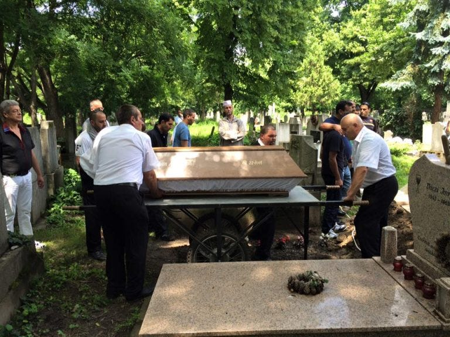

### AYS News Digest 3/2/23: Civil Fleet ships diverted from SAR zones by Italian authorities
#### European Court of Human rights (EHCR) finds Hungary guilty for the death of young Syrian man // Rishi Sunak’s rhetoric unpicked by Refugee Council // New immigration policy on the horizon in France // Long read about the unreported plight of undocumented Afghans in the Sindh region of Pakistan & much more.
#### FEATURE
### Blockading the Civil Fleet of SAR ships in Italy?

](assets/5b15b69c0ec6/0*XSPv-FpxHEtpxzqI)

Credit: [https://thecivilfleet.wordpress.com/2023/01/29/rescuers-disembark-people-the-italian-government-would-have-left-to-drown/](https://thecivilfleet.wordpress.com/2023/01/29/rescuers-disembark-people-the-italian-government-would-have-left-to-drown/)
#### Italian authorities (s Maritime Rescue Co-Ordination Centres) have began to divert civil fleet ships from SAR zones, mandating lengthy journeys to an assigned port of disembarkation that force people to travel for hours more at sea, with the risk of worsening weather.

On January 26th 2023, the Italian government designated the disembarkation of the 237 survivors aboard the Geo Barents at Spezia. This required **three further days of travel at sea** , diverting the rescue ship away from the SAR zone and delaying its return to carry out life-saving work at sea.

■■■■■■■■■■■■■■ 
> **[Sea-Watch Italy](https://twitter.com/SeaWatchItaly) @ Twitter Says:** 

> > Il Governo italiano continua a violare il diritto internazionale e i diritti umani delle persone soccorse in mare: i 237 naufraghi a bordo di #GeoBarents di @[MSF_ITALIA](https://twitter.com/MSF_ITALIA) toccheranno terra al porto di La Spezia, tra i più lontani mai concessi [segue] https://t.co/SZ96UEzkO5 

> **Tweeted at [2023-01-26 11:32:53](https://twitter.com/SeaWatchItaly/status/1618572681363980291).** 

■■■■■■■■■■■■■■ 

They argue that there is a lack of capacity for new arrivals in the South. [This is untrue: unaccompanied minors arriving in La Spezia on the Geo Barents were then sent by coach to the southern town of Foggia, an eight-hour drive away.](https://twitter.com/EleonoraCamilli/status/1620693783146024960) This new policy of diversion and delay reduces the aid available in the Mediterranean. The result? More pushbacks. More violence. More deaths. More inhumanity.

**How does it work** ?

When the Italian MRCC assigns a port of disembarkation to a civil fleet ship, it is now (as of a decree from December) required to go there without delay to complete the rescue operation.

So, when the assigned port of safety (POS) is at a significant distance from the SAR zone, the ship is now required to leave the SAR zone for many days (to get to the POS and back to the SAR zone). The combination of this decree with the practice of assigning a distant POC results in significant disruption to the Civilian fleet.

This practice has been repeated in the past few months:

■■■■■■■■■■■■■■ 
> **[MSF Sea](https://twitter.com/MSF_Sea) @ Twitter Says:** 

> > Following the rescue operation conducted earlier today, #Italy assigned us #Ancona as a place of safety while other suitable ports are much closer to our current location.

🔴 Does this comply with international law? https://t.co/d8iaqIEkaa 

> **Tweeted at [2023-01-07 20:44:57](https://twitter.com/MSF_Sea/status/1611826244546347008).** 

■■■■■■■■■■■■■■ 

#### HUNGARY
#### ECHR: Hungarian authorities are responsible for the death of 22 year old Syrian man who died following a pushback in 2016.

Attempting to cross the river Tisza at the Serbian-Hungarian border, the violence exacted by Hungarian law enforcement agents resulted in his death:

The funeral of the Syrian man in Szeged.

> “The man was trying to cross the river from Serbia into Hungary with his brother, cousin (and an Iraqi family with three children). When they reached the riverbank, police officers set dogs, shot tear gas, and threw stones at them. Then they forced them back into the river, shouting “Go back to Serbia!”. The man was injured and drowned in the Tisza. His brother and cousin made it back to the Serbian side.” _More [here](https://helsinki.hu/en/european-court-of-human-rights-hungary-is-responsible-for-the-death-of-a-22-year-old-syrian-refugee/?fbclid=IwAR3KKajczisXTuryrX-96lONAW8nS3LzPJUZQUah90Cr1UT9ZMWZ7AyD1KA) ._ 

The number of pushbacks by the Hungarian police has been increasing every year. In 2016, 8466 case were recorded after 5 July, rising to more than 150,000 in 2022. The so-called embassy system introduced by the Hungarian government in 2020 has made entry to the country almost impossible for asylum seekers; the officially illegal life-threatening border crossing is the only option. The lack of a legal alternative is both incomprehensible, and needlessly continues to endanger lives.
#### GREECE
#### High-speed craft, rather than inflatable dinghies, intercepted by the Hellenic Coast Guard

Unusually, the HCG intercepted two speed boats craft carrying 37 asylum seekers from Palestine and Somalia on Tuesday.

■■■■■■■■■■■■■■ 
> **[Daphne Tolis](https://twitter.com/daphnetoli) @ Twitter Says:** 

> > Greece’s coastguard on Thursday intercepted two speed boats carrying 37 asylum seekers in total, most of them from Palestine and Somalia. Three people smugglers have been arrested, 2 Turkish nationals &amp; 1 Syrian. The asylum seekers were transferred to the camp on Kos island. https://t.co/nHpfAVjkPO 

> **Tweeted at [2023-02-03 12:35:45](https://twitter.com/daphnetoli/status/1621487605824077825?fbclid=IwAR1tMaSh-rw-ocIPEg1pSsQJP3IRHhB5tI1iOCDwjcnhI5Nm9w8Bqe-sLW4).** 

■■■■■■■■■■■■■■ 

#### FRANCE
#### Unions, NGOs and Collectives unite in opposition to the French government, demanding a migratiory policy of welcome

This February, the French government will present its new legal stance towards immigration. Fearing further privations of human rights to foreign people on French soil, UCIF unites to oppose policies focused on deportations and the criminalisation of undocumented people.

Signatories include CGT, Amnesty International, Droit au logement and hundreds of others.

#### UNITED KINGDOM
#### Rishi Sunak has written an article in British tabloid _The Sun_ , about his pledge to “stop the boats” from Europe. Refugee Council have unpicked his rhetoric.

Sunak states that Britain will _always_ welcome those fleeing war, famine or regime persecution. Refugee Council write that

> “He’s broadly right. We have welcomed people from Ukraine. In the past we have done the same for Ugandan Asians, Syrians, Jewish children fleeing Hitler and more **but we also recently stopped a scheme for Syrians. The one for Afghans isn’t working. And we turn our backs on others** .” 

Sunak’s vague use of the term “safe countries” demonstrates a gross simplification of the real threats faced by people on the move. He writes that “many illegal migrants start their journey in perfectly safe countries. And they travel through safe countries to get here.”

_RC_ write that

> “It’s not a crime to seek safety. According Home Office statistics, most people on the boats come from Sudan, Syria, Eritrea, Iran, Iraq, Afghanistan and Albania. None of which are “perfectly safe”. Tell an Albanian woman fleeing sexual exploitation that she is “perfectly safe”. 

■■■■■■■■■■■■■■ 
> **[Refugee Council 🧡](https://twitter.com/refugeecouncil) @ Twitter Says:** 

> > The Prime Minister then says that coming on the boats is “unfair on those who come here legally. Unfair on those with a genuine asylum claim”. But the governments *own figures* show that most people on the boats have a strong claim for asylum. We estimate six in 10, at least. 

> **Tweeted at [2023-02-02 12:08:15](https://twitter.com/refugeecouncil/status/1621118297113767936).** 

■■■■■■■■■■■■■■ 

Read their full thread [here](https://twitter.com/refugeecouncil/status/1621116021464780801) .

**Some good news from the UK — Glasgow-based football team Celtic FC have been donating tickets to their matches to locally accommodated refugees.**

](assets/5b15b69c0ec6/1*YsUIHU57FQOjpzVK2sVGKg.png)

Credit: Care 4 Calais — [https://www.instagram.com/p/CoFsn7OsjJ3/?fbclid=IwAR1tMaSh-rw-ocIPEg1pSsQJP3IRHhB5tI1iOCDwjcnhI5Nm9w8Bqe-sLW4](https://www.instagram.com/p/CoFsn7OsjJ3/?fbclid=IwAR1tMaSh-rw-ocIPEg1pSsQJP3IRHhB5tI1iOCDwjcnhI5Nm9w8Bqe-sLW4)

With the help of local Glasgow NGO — “Refuweegee” — 32 fans were welcomed to the stadium, an initiative very much aligned with the club’s principles.Celtic FC was originally founded by Brother Walfrid, an Irish Marist who famously said:

> “A football club will be formed for the maintenance of dinner tables for children and the unemployed.” 

**WORTH READING**
- Pakistani journalist Sahar Habib Ghazi reports on the plight of undocumented Afghans in the Sindh region of Pakistan:

More than 1,500 Afghans, including women and children, have been arrested by Pakistani police and now face deportation.

■■■■■■■■■■■■■■ 
> **[Moniza Kakar](https://twitter.com/Moni_Kakar) @ Twitter Says:** 

> > Around 1400 of afghan refugees including women &amp; children hv been arrested by Karachi Police since last 2 months alleged of non availability of legal documents.But I've met up to 400 imprisoned Afghans who had visas,PoR &amp;ACC cards,but police confiscated their passports&amp; cards.@[UN](https://twitter.com/UN) https://t.co/6bMyNyEt4o 

> **Tweeted at [2022-12-17 18:14:53](https://twitter.com/moni_kakar/status/1604178333880963073?s=46).** 

■■■■■■■■■■■■■■ 

- Aegean Boat Report have published their monthly statistics on arrivals to Greece. 1372 people have arrived in January 2023.

> _JOIN OUR TEAM — Reach out via Facebook, Instagram or by email at: areyousyrious@gmail.com_ 

**Find daily updates and special reports on our [Medium page](https://medium.com/are-you-syrious) .**

**If you wish to contribute, either by writing a report or a story, or by joining the Info team, please let us know!**

**We strive to echo correct news from the ground through collaboration and fairness. Every effort has been made to credit organisations and individuals with regard to the supply of information, video, and photo material (in cases where the source wanted to be accredited). Please notify us regarding corrections.**

**If there’s anything you want to share or comment, contact us through Facebook, Twitter or write to: areyousyrious@gmail.com**

_[Post](https://areyousyrious.medium.com/ays-news-digest-3-2-23-civil-fleet-ships-diverted-from-sar-zones-by-italian-authorities-5b15b69c0ec6) converted from Medium by [ZMediumToMarkdown](https://github.com/ZhgChgLi/ZMediumToMarkdown)._
