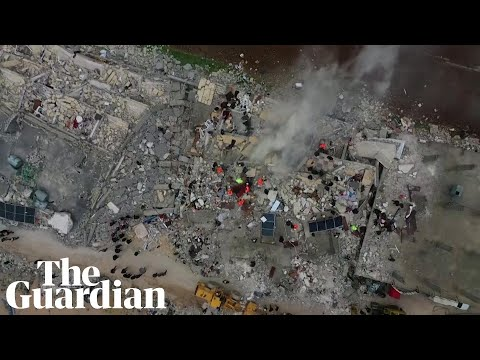
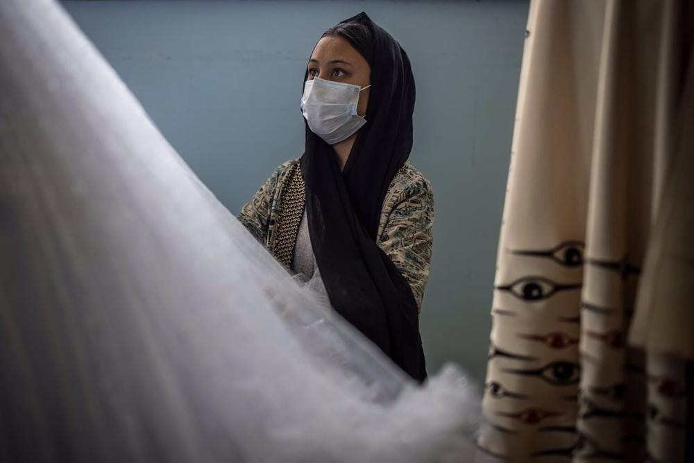

### AYS News Digest 6/2/23: Death toll in Syria and Turkey continues to rise following devastating earthquakes
#### Demonstrations in Tunisia // Annual demonstration on the beach of el Tarajal // Italy provides Libyan authorities with a new patrol boat // Denmark welcomes first Afghan women who have been granted status solely based on gender // Moldova introduces a temporary measure for Ukrainian refugees similar to that of the ‘Mass Influx Directive’…

](assets/e36972b155e8/0*h76dzO9RWT_N2Nti)

Source: [**The White Helmets**](https://twitter.com/SyriaCivilDef)
### FEATURE: Two earthquakes have killed over 5000 people in Turkey and Syria

The first earthquake with a magnitude of 7.8 had its epicentre in southern Turkey. There were more than 100 aftershocks, including another quake of 7.7 magnitude. More than 3400 people have been killed in Turkey, and over 1600 people in Syria — the figures continue to increase as rescue teams work to find people in the rubble.

[Multiple shocks were felt across the region, going as far as Lebanon and Egypt.](https://www.wsj.com/articles/powerful-earthquake-strikes-turkey-with-fears-of-high-casualties-11675655393?mod=mhp&fbclid=IwAR3uXLovNnWfW9xXiKQZtKbK6xnfO9qkOswP2OKUfx50wJQmbJDNhC0I_L0) In Syria, the earthquake hit a region which houses millions of displaced individuals.

**Mercy Corps,** who are working in North West Syria, state that [shelter will be the most urgent need, and displacement will be on the rise](https://www.instagram.com/p/CoVlnccJAIk/?fbclid=IwAR3RCjOcONu8Y4mnmOsDZUu2KRD-LBvAvVOiOY9ZGuuUYs-hkSb3iDYx1hg) . They have been working in the region since 2008, in camps, supporting forcibly displaced people who were already residing in precarious makeshift structures and will once again be displaced. [Some people in remote areas of Syria have been displaced up to 20 times.](https://www.bbc.co.uk/news/world-middle-east-64544478)

As Syria has been in conflict for 12 years, and the northwest region heavily divided and damaged, the conditions prior to the earthquake were already critical. There are currently freezing temperatures, effects of a recent cholera outbreak, and crumbling infrastructure.

Whilst there has been a strong and collaborative response from several countries, the current rescue operations are not enough to respond to this disaster.

■■■■■■■■■■■■■■ 
> **[frontline in focus](https://twitter.com/FrontlineInFocu) @ Twitter Says:** 

> > Heartbreaking situation for refugees after the earthquake, Northwestern #Syria have suffered 12yrs of  conflict
More than 65% of the basic infrastructure of the area is destroyed or heavily damaged
Our team is  providing exclusive photos and videos
#earthquake #deprem #Turkey https://t.co/IQ2EhfWMcC 

> **Tweeted at [2023-02-06 07:45:10](https://twitter.com/FrontlineInFocu/status/1622501642691035137?s=20).** 

■■■■■■■■■■■■■■ 

Turkey’s Interior Minister, Suleyman Soylu, declared a national state of emergency and called for international assistance. In response to the earthquake, President Biden ordered USAID and other government agencies to assess a possible relief response.

Azerbaijan has sent a rescue team of 375 people. Several European countries have also sent search-and-rescue teams.

[**IBC (International Blue Crescent) reports on the urgent needs in Gaziantep, Turkey, and Northern Syria**](https://reliefweb.int/report/turkiye/ibc-appeals-emergency-assistance-respond-urgent-needs-hundreds-thousands-earthquake-victims-south-turkey-and-north-syria?fbclid=IwAR2lEovY6dc-b_N9PJ7QHaJDWdA3Wp1kl4oBUhe_36wtV674Ne513Wom4ao) **:**
- **Tens of thousands tents**
- **Heaters for the tents**
- **Tens of thousands of blankets**
- **Thermal clothing**
- **Ready to eat food for at least 5000 people**
- **Basic first aid kits**

**An emergency response coordination centre has been set up in Gaziantep to coordinate operations in the region.**

**Contact details:**

Mr Muzaffer Baca, Vice President (+90 532 2344229) mbaca@ibc.org.tr

Alper Mavi, IBC Regional Programmes Coordinator in Gaziantep (+90 538 5159806) Alper.mavi@ibc.org.tr

](assets/e36972b155e8/0*HWe6IElvJ7yfck6Q)

Source: [Turkey and Syria earthquake: death toll passes 5,000, with 5,775 buildings confirmed collapsed — latest (msn.com)](https://www.msn.com/en-gb/news/world/turkey-and-syria-earthquake-death-toll-passes-5000-with-5775-buildings-confirmed-collapsed-latest/ar-AA17bdhM)

■■■■■■■■■■■■■■ 
> **[The White Helmets](https://twitter.com/SyriaCivilDef) @ Twitter Says:** 

> > The #earthquake in NW #Syria has claimed 147 lives &amp; injured over 340. The toll may increase as many families are still trapped. Our teams are on the ground searching for survivors &amp; removing the dead from the rubble. https://t.co/vQhYZAiGRM 

> **Tweeted at [2023-02-06 08:38:18](https://twitter.com/SyriaCivilDef/status/1622515012307648512?s=20).** 

■■■■■■■■■■■■■■ 

#### SEARCH AND RESCUE AT SEA
### A video by Aegean Boat Report (ABR) of 36 life rafts they found adrift at sea in January this year, carrying almost 600 people

Over the last three years, roughly 54,000 individuals have been pushed back, and the Greek authorities were involved in over 2000 cases (despite continuing to claim otherwise).

[36 Life Rafts In January — Aegean Boat Report](https://aegeanboatreport.com/2023/02/04/36-life-rafts-in-january/?fbclid=IwAR1WbzbIfGyWpA0s8SZSK082HP1uo8SKqkDDkrOUWMnGo9SFPs5VL4UGJbc)

■■■■■■■■■■■■■■ 
> **[Aegean Boat Report](https://twitter.com/ABoatReport) @ Twitter Says:** 

> > In January @[ABoatReport](https://twitter.com/ABoatReport) have registered 66 illegal pushbacks in the Aegean Sea, performed by @[HCoastGuard](https://twitter.com/HCoastGuard), 1.881 people, children, women and men, have been denied their right to seek asylum, their human rights have been violated by the 🇬🇷 government @[YlvaJohansson](https://twitter.com/YlvaJohansson) @[EU_Commission](https://twitter.com/EU_Commission) https://t.co/MNU4JcrBGG 

> **Tweeted at [2023-02-01 21:39:27](https://twitter.com/ABoatReport/status/1620899656636190722?s=20).** 

■■■■■■■■■■■■■■ 

#### Demonstrations against the lack of work being done by the Tunisian authorities to stop deaths in the Mediterranean

■■■■■■■■■■■■■■ 
> **[@alarmphone](https://twitter.com/alarm_phone) @ Twitter Says:** 

> > This morning, dozens of people gathered in Tunis to commemorate those who died or disappeared in the Med. And to denounce the silence of the Tunisian authorities and the murderous EU border regime. They migrated to to live, not to die! Our solidarity with the families! https://t.co/SdD5EsuExI 

> **Tweeted at [2023-02-04 16:46:01](https://twitter.com/alarm_phone/status/1621912974188322822?s=20).** 

■■■■■■■■■■■■■■ 

[Deadly days along the Tunisian route to Europe — Alarm Phone | Alarm Phone](https://alarmphone.org/en/2023/02/06/deadly-days-along-the-tunisian-route-to-europe/?fbclid=IwAR3ZVaVNjTQFifpK0tbrbXSWgHaw9mpFIN7QZgwuBu5E4_ViFajn41o5Muk)
#### ITALY
### As AYS has previously reported, the Italian government are attempting to establish an anti-NGO decree that could cost thousands of lives in the Mediterranean

The government provided [a new ‘300 class’ patrol boat to the Libyan authorities](https://www.agenzianova.com/en/news/migrants-today-the-delivery-of-a-new-patrol-boat-to-libya/?fbclid=IwAR0FRSH2mm4ZcvXth_ol8smmkul6YUXOwyarVKRXB3czNUlcIfUTA6VIBXw) — this is one of five patrol boats that will be provided to strengthen border control.

■■■■■■■■■■■■■■ 
> **[Sea-Watch International](https://twitter.com/seawatch_intl) @ Twitter Says:** 

> > Today in Adria, the 🇮🇹 government hands over a new patrol boat to #Libya to expand violent and illegal pullbacks in the Mediterranean. For the first time, in a public ceremony with representatives of the #EU.

Meanwhile, people continue to die at sea. https://t.co/uXoMhdtsyS 

> **Tweeted at [2023-02-06 15:24:21](https://twitter.com/seawatch_intl/status/1622617197494341632?s=20).** 

■■■■■■■■■■■■■■ 

#### SPAIN
### Annual demonstration on the beach of el Tarajal — remembering the 14 people who died trying to cross into Spain in 2014

The individuals who died in 2014 are: Yves, Samba, Daouda, Armand, Luc, Roger Chimie, Larios, Youssouf, Ousmane, Keita, Jeannot, Oumarou, Blaise, and one person who has still not been identified.

The demonstrations aim to fight against the European immigration policy that has cost the lives of so many people, and will continue to do so if significant changes are not made.

](assets/e36972b155e8/0*ruT6PcqQPnANsmTs.jpg)

Source: [Statewatch | Tarajal Manifesto 2023: justice for the dead](https://www.statewatch.org/news/2023/february/tarajal-manifesto-2023-justice-for-the-dead/?fbclid=IwAR061pPrconUwbyLPjpToJt68ayX6mzi06bwlnUbROM2gI89MjBhTs-Jmcc)

■■■■■■■■■■■■■■ 
> **[@alarmphone](https://twitter.com/alarm_phone) @ Twitter Says:** 

> > En hommage de toutes les victimes du massacre de #Tarajal, #Ceuta le 06.02.14 et de tou.te.s celleux qui ont perdu la vie aux frontières dans le monde! Chaque année, des militant.e.s se réunissent dans de nombreuses villes pour commémorer &amp; lutter pour la liberté de circulation! https://t.co/jQWWZymSnX 

> **Tweeted at [2023-02-06 15:24:24](https://twitter.com/alarm_phone/status/1622617212438687746?s=20).** 

■■■■■■■■■■■■■■ 

#### LATVIA
### Letter addressing concern of pushbacks at Latvia-Belarus border

In a letter addressed to the Minister for the Interior of Latvia, Māris Kučinskis, published today, the Commissioner raises concerns about the reported continuation of pushbacks at the Latvian-Belarusian border which has led to severe injuries suffered by men, women and children and the death of one man.

[Latvian authorities should put an end to pushbacks and safeguard the human rights of people seeking protection at the border with Belarus — Commissioner for Human Rights (coe.int)](https://www.coe.int/en/web/commissioner/-/latvian-authorities-should-put-an-end-to-pushbacks-and-safeguard-the-human-rights-of-people-seeking-protection-at-the-border-with-belarus?fbclid=IwAR39DRbDSPBVHz5DM8jI9iooOsYA7mA1NyX80_UJEjAjDECKUXBtMopI0ZE)
#### MOLDOVA
### Moldova introduces a temporary measure for Ukrainian refugees similar to that of the ‘Mass Influx Directive’

So far, the approximately 100,000 Ukrainian war refugees who are in the Republic of Moldova have only been “tolerated” there. Whilst Ukraine remains in a state of national security, Ukrainian refugees are allowed to remain in Moldova and access the labour force and welfare services. However, Ukrainian children were only allowed to go to school as guest students. Ukrainian refugees essentially lived in limbo, not completely allowed to settle. Now the government has decided to introduce [temporary protection analogous to the “mass influx directive” which would reduce this state of limbo.](https://ukraine.bordermonitoring.eu/2023/02/06/einfuehrung-des-temporaeren-schutzes-in-moldau/?fbclid=IwAR3uDPs2pBYV_q1K9a5jG8ITyaUumM4tyvo_OcPOr-ltUP3j4F3fpWpVvLM)

■■■■■■■■■■■■■■ 
> **[bordermonitoring.eu](https://twitter.com/bm0eu) @ Twitter Says:** 

> > Bisher werden die etwa 100.000 ukrainischen Kriegsflüchtlinge, die sich in der Republik Moldau aufhalten, dort lediglich „geduldet“. Nun hat die Regierung die Einführung eines temporären Schutzes analog zur "Massenzustromrichtlinie" beschlossen. [ukraine.bordermonitoring.eu/2023/02/06/ein…](https://ukraine.bordermonitoring.eu/2023/02/06/einfuehrung-des-temporaeren-schutzes-in-moldau) 

> **Tweeted at [2023-02-06 14:29:44](https://twitter.com/bm0eu/status/1622603455280840704?s=20).** 

■■■■■■■■■■■■■■ 

#### DENMARK
### Denmark welcomes first Afghan women who have been granted status solely based on gender

[The Danish Refugee Council (DRC) has made a ground-breaking decision, granting a mother and her daughter refugee status based solely on gender](https://www.news360.es/canada/2023/02/03/denmark-welcomes-first-two-afghan-women-refugees-on-gender-grounds/?fbclid=IwAR0r12sc9h-2K-eb4Q3ZiR6hIG_Ba8kg8NAu6L903fK2KLMo2ewSNhzmx2M) . The country has recognised the fact that being an Afghan woman in itself poses great risk of persecution upon return to Afghanistan.

This woman fled Afghanistan and fears her spouse or his family would kill her if she returned. She has had a child out of wedlock in Denmark and as adultery is punishable in Afghanistan, she fears she will be punished if she returns.

This decision comes at a time when the [EU has recognised that Afghan women are at serious risk of persecution were they to return to Afghanistan](https://www.infomigrants.net/en/post/46446/being-an-afghan-women-is-enough-to-get-refugee-status-says-eu-agency?fbclid=IwAR20M8MzrEgMSjfKzkHUUJRjyr-PM5FVeAXobKuoyEz0fKFFSEnjGgy31mg) : the restricted access to education, the workplace, and limited freedom of speech and expression.

#### WORTH READING:
- [EU Member States’ Use of New Technologies in Enforced Disappearances — Border Violence Monitoring Network](https://www.borderviolence.eu/eu-member-states-use-of-new-technologies-in-enforced-disappearances/)
- [What the hell is No Name Kitchen? Happy 6th anniversary to all of us — No Name Kitchen](https://www.nonamekitchen.org/what-the-hell-is-no-name-kitchen-happy-6th-anniversary-to-all-of-us/?fbclid=IwAR0cCrbmcPVdmiLM-ZCQCL0xI8xEz3aQwGxFmeun10FXxL9oV0Pb1JRoaK8)
- [Houthis Violating Women and Girls’ Rights in Yemen | Human Rights Watch (hrw.org)](https://www.hrw.org/news/2023/02/06/houthis-violating-womens-and-girls-rights-yemen?fbclid=IwAR3sCz36Bn_rfDXY7zDQHQY-ouGpaRxDDLWxy7b06v9om1QYRoBMz7ds4fA)
- [The evolution of EUropean border governance through crisis: Frontex and the interplay of protracted and acute crisis narratives — Nina Perkowski, Maurice Stierl, Andrew Burridge, 2023 (sagepub.com)](https://journals.sagepub.com/doi/10.1177/02637758231152478)
- [Facebook](https://www.facebook.com/sienosgrupe/posts/pfbid089mTXQ2Z6C59Ahh2uVQcPPfNTpRvTze3ELKWnZ7nTyehRpTHxL9mcPFznZvYPZJHl) — Deportations from Lithuania to Nigeria taking place on the 7th and 8th of February
- [Refugees granted legal resettlement in the UK plunge by 77% as Rishi Sunak prepares harsh new asylum laws (inews.co.uk)](https://inews.co.uk/news/sunak-prepares-harsh-new-asylum-laws-refugees-resettlement-plunge-sunak-new-asylum-laws-2129915?fbclid=IwAR0EIujzAy_tJx9IsR_TDS2XGEpti6iL9LfuMyh1SZLoyaYheWARXAqRYRc)

> _JOIN OUR TEAM — Reach out via Facebook, Instagram or by email at: areyousyrious@gmail.com_ 

**Find daily updates and special reports on our [Medium page](https://medium.com/are-you-syrious) .**

**If you wish to contribute, either by writing a report or a story, or by joining the Info team, please let us know!**

**We strive to echo correct news from the ground through collaboration and fairness. Every effort has been made to credit organisations and individuals with regard to the supply of information, video, and photo material (in cases where the source wanted to be accredited). Please notify us regarding corrections.**

**If there’s anything you want to share or comment, contact us through Facebook, Twitter or write to: areyousyrious@gmail.com**

_[Post](https://medium.com/are-you-syrious/ays-news-digest-7-2-23-death-toll-in-syria-and-turkey-continue-to-rise-following-devastating-e36972b155e8) converted from Medium by [ZMediumToMarkdown](https://github.com/ZhgChgLi/ZMediumToMarkdown)._
