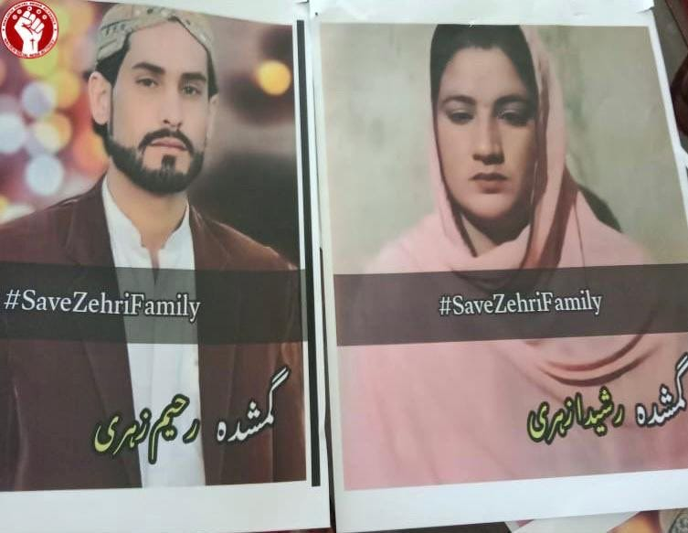
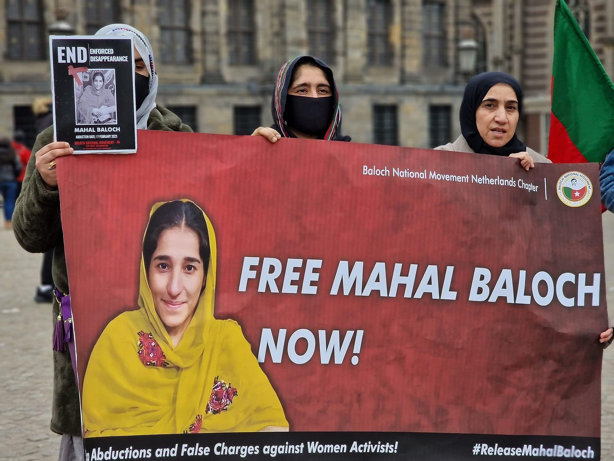

### AYS Special: Rising Abductions of Baloch Women and Human Rights Abuses in Pakistan

 )](assets/e1607e36744d/0*iFkswlCwzNOqqUyI)

(Mahal Baloch, currently detained in Pakistan. Photo Credit: [Human Rights Council of Balochistan](https://twitter.com/HRCBalochistan/status/1629487035244224514/photo/1) )

_Last year [Amnesty International published a report](https://www.amnesty.org/en/documents/asa33/5872/2022/en/) calling for an end to enforced disappearances and the violent prevention of protests in Balochistan. Yet, since then, [an increasing number of women have gone missing](https://www.aninews.in/news/world/asia/abductions-of-baloch-women-new-wave-of-state-repression-in-balochistan20230225181626/) and the repression of demonstrations has continued. [There are currently over 5000 people missing in Balochistan](https://www.theguardian.com/global-development/2022/jul/06/pakistan-5000-people-disappeared-missing-balochistan) , having been mase to disappear by Pakistan’s Security Services. As a result, many Baloch people have been forced to leave Pakistan and seek political asylum abroad. This report comes from writer and political and human rights activist, Islam Murad Baloch, who recently became an asylum seeker in the Netherlands._

On the night of May 16th, 2022, the Pakistani military raided the house of Noor Jahan Baloch and forcibly abducted her from the Hoshab village of Balochistan, a terrifying situation for both her and her family. They took her to an unknown location under false charges which she vehemently denied. [Her lawyer stated that she was tortured while detained](https://thebalochistanpost.net/2022/05/missing-baloch-woman-produced-in-court-lawyer-says-she-was-tortured/) . People of Balochistan came out onto the street in great numbers and due to the widespread protests, the Pakistani military released her without charge. But on May 18th, 2022, Habiba Pir Jan, a Baloch artist and poet, resident of Nazarabad town, Tump, district Kech was also abducted by Pakistani security forces from Karachi. These enforced disappearances, along with other similar events at the time, marked the beginning of a new offensive against Baloch women by the Pakistani military which is ongoing at the time of writing.

■■■■■■■■■■■■■■ 
> **[The Balochistan Post - English](https://twitter.com/TBPEnglish) @ Twitter Says:** 

> > Baloch Women Forum protested in Quetta against arrest of Baloch woman Noor Jahan, a mother of three children. Noor Jahan was arrested by CTD from Hoshaap. https://t.co/bw9bV6GBYM 

> **Tweeted at [2022-05-18 16:29:25](https://twitter.com/TBPEnglish/status/1526963177166094336/photo/1).** 

■■■■■■■■■■■■■■ 

On February 3rd, 2023, the Pakistani military detained Rasheeda Baloch with her family, including her children and husband, from Quetta, the capital city of Balochistan. People once again protested throughout Balochistan for the safe release of Rasheeda Zehri’s family. After few days, Rasheeda zehri was released from the custody of the Pakistani military, but her husband Raheem Zehri is still in the dark torture cells of the Pakistani military. His family do not know his current location.

On February 17th, 2023, the Pakistani military forcibly abducted another woman, Mahal Baloch, along with another female relative and Mahal’s three children, the youngest only five years old. [They were taken from the home of Bibi Gul, chairperson of the HR Council of Balochistan (HRCB) — a human rights group based in Europe and Balochistan.](https://hrcbalochistan.com/ms-mahal-baloch-illegally-detained-and-framed-in-a-false-case/) The security forces gained entry without a warrant. According to the [Human Rights Council of Balochistan](https://hrcbalochistan.com/) — “All /the/ family members including children were blindfolded and taken to a police station. The children were interrogated in the absence of a guardian and were placed in a room where they could hear Mahal’s screams coming from an adjacent room.” [Once again, people protested for the safe release of Mahal Baloch](https://www.firstpost.com/world/pakistan-protests-against-arrest-of-mahal-baloch-rock-balochistan-karachi-12186892.html) . Her family was released, but Mahal Baloch is still in custody and last appeared in court on the 4th of March, 2023. She has been given another ten days in prison and may be visited by her family every three days. However, this is not the first time she had appeared in court to be given a further sentence and her family are concerned for her wellbeing, as she collapsed during the proceedings.

(Photo Credit: **_@IslamMuradBloch)_**

On February 21st, 2023, it was reported that the remains of three people had been discovered in Barkhan, Balochistan. The individuals had been shot, burnt and placed in a well. Their bodies bore signs of torture. [They were later identified as Giran Naz, 40, and her two sons Mohammad Nawaz, 22, and Abdul Qadir, 15, of the Baloch Maari Tribe](https://www.independent.co.uk/asia/south-asia/pakistan-khetran-minister-balochistan-private-jail-b2287112.html) . Khan Muhammad Marri came forward and stated that along with his wife and two eldest sons who had died, five other members of his family had also been taken into the private prison of Sardar Abdul Rehman Khetran, the Balochistan minister for Communication and Works. The minister denies the allegations.

Balochistan gained independence from the British in August 1947, but was occupied by the Pakistani military on march 27th, 1948. The Baloch people are still struggling for the independence of Balochistan. Occupied Balochistan is a south western province of Pakistan bordering with Iran and Afghanistan. Balochistan comprises of 45% of Pakistan’s land mass and is the least developed province of Pakistan. Its land area is 347190 square kilometres.

Contemporary ‘development’ projects are only making the situation for Baloch people worse. The 67 billion dollar project titled China Pakistan Economic Corridor runs through Balochistan to the port city of Gwadar, yet the [people of the area do not have access to clean drinking water](https://thediplomat.com/2023/01/pakistans-port-city-gwadar-in-chaos/) and struggle to get enough food to eat. The Sandiq Reko Diq project is located in the Chaghai district in Balochistan and will exploit the area’s natural resources: 22,000 tonnes of copper and 209 million ounces of gold. Fifty per cent of the project is owned by the Canadian company, Barrick, 25% by three federal state-owned enterprises, 15% by the Province of Balochistan on a fully funded basis and 10% by the Province of Balochistan on a free carried basis, but the people of Balochistan know they will see nothing of the profits.

Every day in Balochistan, people are protesting against the atrocities of the Pakistani military and the encroachment of development projects which do not consider their rights or sovereignty. Whosoever speaks up for their rights and freedom is forcibly abducted, tortured and even killed, their mutilated bodies thrown onto the streets. In the past, state sponsored death squads have killed many Baloch people, including women and men from different cities of Balochistan. They killed [Malik Naz](https://www.theguardian.com/world/2021/nov/12/women-lead-fight-against-extrajudicial-killing-pakistan-balochistan-protest-abductions) , [Kulsoom and Tajbibi Baloch](https://twitter.com/Balochzaag/status/1440725790451122177) from the Turbat city of Balochistan and even Baloch people who have sought asylum abroad such as [Karima Baloch, a human rights activist who was living in Canada when she died](https://www.theguardian.com/world/2021/jan/25/body-of-karima-baloch-returned-to-pakistan) , [Sajid Hussain Baloch, a journalist living in Sweden](https://www.dw.com/en/sajid-hussain-baloch-missing-pakistani-journalist-found-dead-in-sweden/a-53308039) , and [Saqib Kareem, who was living in Azerbaijan as a political refugee](https://www.newsintervention.com/pakistan-murders-saqib-baloch-in-azerbaijan/) after two of his brothers died in military detention in Balochistan. His family strongly believe he was murdered by Pakistani authorities.

[International Voice for Baloch Missing Persons](https://www.facebook.com/IVBMP/) is a non-profit organisation where family members and friends can report enforced disappearances and get help in filing the case with the Pakistani police station and court. Some Baloch men have been missing for over ten years and their fiancé or wife is still waiting for their safe return, unsure if they are dead or alive. These innocent women cannot move on with their lives or remarry. The families of missing people demand only that if their loved ones have committed any crime, then they are tried in an open court. If they are guilty, punish them according to your laws and rules, but if they are not guilty of any crime, then release them back to their families, and if they are dead give their families proof and let them grieve. Human rights defender organisations such as Amnesty International, Human Rights Watch and others must continue to pressure the Pakistani government to end the forcible abduction of Baloch people.

**_You can follow Islam Murad Baloch on Twitter @IslamMuradBloch._**

> _JOIN OUR TEAM — Reach out via Facebook, Instagram or by email at: areyousyrious@gmail.com_ 

**Find daily updates and special reports on our [Medium page](https://medium.com/are-you-syrious) .**

**If you wish to contribute, either by writing a report or a story, or by joining the Info team, please let us know!**

**We strive to echo correct news from the ground through collaboration and fairness. Every effort has been made to credit organisations and individuals with regard to the supply of information, video, and photo material (in cases where the source wanted to be accredited). Please notify us regarding corrections.**

**If there’s anything you want to share or comment, contact us through Facebook, Twitter or write to: areyousyrious@gmail.com**

_[Post](https://medium.com/are-you-syrious/ays-special-rising-abductions-of-baloch-women-and-human-rights-abuses-in-pakistan-e1607e36744d) converted from Medium by [ZMediumToMarkdown](https://github.com/ZhgChgLi/ZMediumToMarkdown)._
