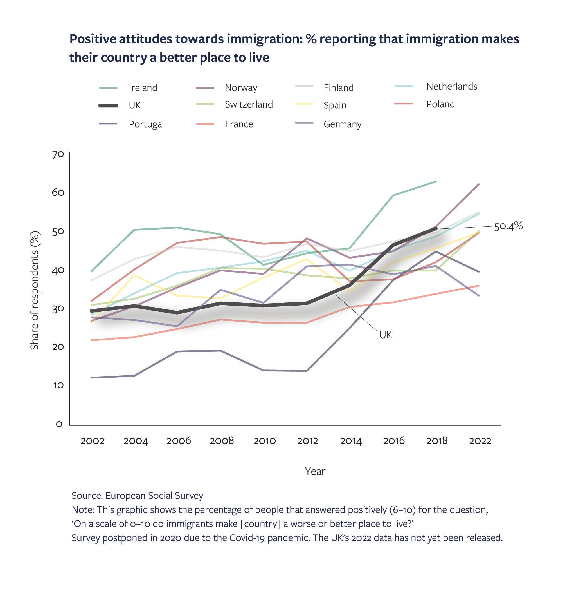

### AYS News Digest 21/04/23: Eid al-Fitr — Celebration among violence and displacement for many Muslim communities
#### NGOs take legal action against Italy following their policy on assigning ports//Rayyan Alshebl, a Syrian refugee, has become the mayor-elect of Ostelsheim, Germany//130 Human Rights Groups call on the German Government to get rid of the ‘Asylum Seekers’ Benefits Act’//Public opinion on immigration more positive compared to rhetoric offered by right-wing media and politics//Woman shot dead by police searching for smugglers in Macedonia//and much more…

](assets/c7791c931229/0*9-qca6bafARbU9W-)

Source: [https://twitter.com/MahQaddoha/status/1649376385935319042?s=20](https://twitter.com/MahQaddoha/status/1649376385935319042?s=20)
#### FEATURE:
### Continued violence against Muslim communities throughout Eid al-Fitr Celebrations

Muslim communities around the world are celebrating Eid al-Fitr, ending the period of Ramadan.

Palestinians, whilst being under occupation, gathered to celebrate and to once again show their strength and solidarity. Many took the opportunity to post on social media, hoping that this will be the last year celebrating under occupation. Nonetheless, Israeli forces have continued to extend prison sentences for Palestinian activists, conducted house searches, and have closed off roads, preventing the movement of Palestinians during Eid al-Fitr.

■■■■■■■■■■■■■■ 
> **[Anadolu English](https://twitter.com/anadoluagency) @ Twitter Says:** 

> > Nearly 120,000 Muslims did special prayers at the Al-Aqsa Mosque in East Jerusalem, which remains under Israeli occupation [v.aa.com.tr/2878166](http://v.aa.com.tr/2878166) https://t.co/oupQ1DqLfy 

> **Tweeted at [2023-04-21 10:16:33](https://twitter.com/anadoluagency/status/1649356438328811520?s=20).** 

■■■■■■■■■■■■■■ 

#### In Sudan, the Rapid Support Forces (RSF) [declared a 72-hour ceasefire, allowing citizens to use humanitarian corridors to greet their families, which coincided with Eid al-Fitr](https://www.wionews.com/world/rsf-fighters-agree-to-a-72-hour-ceasefire-for-eid-thousands-flee-from-sudan-to-chad-584648) .

However, on Friday morning, people living in the capital, Khartoum, still woke up to bombings and gunfire.

The conflict is going into its second week, with already [over 400 individuals being killed](https://www.aljazeera.com/news/2023/4/22/fighting-in-sudan-rages-as-conflict-enters-second-week) . UNHCR have stated that between 10,000 and 20,000 individuals have fled to Chad as a result of the violence.
#### Further reading:
- Palestinians talk about celebrating Eid al-Fitr in Kyiv: [‘I am not scared’: Palestinians observe Ramadan in wartime Kyiv | Russia-Ukraine war | Al Jazeera](https://www.aljazeera.com/features/longform/2023/4/19/i-am-not-scared-palestinians-ramadan-wartime-kyiv)
- Celebration and sadness for many people in Turkey this Eid following the recent earthquakes and economic turmoil: [‘Each house is mourning’: Ramadan for a widowed farmer in Turkey | Inflation | Al Jazeera](https://www.aljazeera.com/features/longform/2023/4/19/each-house-is-mourning-ramadan-for-a-turkish-farmer-and-widow)

#### GENERAL

EU lawmakers have approved several new policies, including a pact that would require EU members to share the duty of welcoming and supporting asylum seekers at times where there was an increase in arrivals.

Member states have been given a year to adjust their asylum systems ahead of the May 2024 Europe-wide elections.

](assets/c7791c931229/0*N6Q4l55bE49oNsSY.jpg)

Source: [EU Parliament approves migration emergency plan — InfoMigrants](https://www.infomigrants.net/en/post/48373/eu-parliament-approves-migration-emergency-plan?fbclid=IwAR29ZsuV2M7-Ff9KqC7nx26HPi1_90aEjqiikheXHINjMXmf_CxOd4w71rQ)

> EU lawmakers are proposing that if an EU country is hit by a shock mass arrival of migrants, a bloc-wide crisis mechanism would be activated to share out the responsibility for the arriving migrants. 

> Migrants could then be relocated based on any “meaningful links” they might have to certain member-states. Those include family ties, cultural similarities or somewhere they have previously studied. 

You can read more here: [EU Parliament approves migration emergency plan — InfoMigrants](https://www.infomigrants.net/en/post/48373/eu-parliament-approves-migration-emergency-plan?fbclid=IwAR29ZsuV2M7-Ff9KqC7nx26HPi1_90aEjqiikheXHINjMXmf_CxOd4w71rQ)
#### NORTH MACEDONIA
### Woman shot dead by police searching for smugglers

The police were attempting to arrest someone they considered a people smuggler. They were conducting a roadside inspection when the accused individual tried to take an officer’s gun. During this altercation, the police shot the woman who later died in hospital.

[Migrant accidentally shot dead by North Macedonian police — InfoMigrants](https://www.infomigrants.net/en/post/48348/migrant-accidentally-shot-dead-by-north-macedonian-police)
#### ITALY
### Tent city in Bologna to provide shelter to forcibly displaced migrants

Bologna has provided accommodation to 3,500 migrants, and has built a tent city on the outskirts to prepare for an increase in the numbers of individuals needing shelter. This increase is due to a rise in individuals arriving and seeking safety in Italy, whilst the Government plans to remove the ‘special protection status’ of many forcibly displaced individuals, leaving them even more vulnerable and in precarious situations.

Centre left-wing cities, such as Bologna, are [drawing attention to the potential fallout and dangerous repercussions of such plans.](https://www.infomigrants.net/en/post/48358/bolognas-tent-city-for-migrants-at-forefront-of-italys-migration-debate) The Mayor states that as shelters are now at capacity, hundreds of individuals will be left on the street.

](assets/c7791c931229/0*AyrV8CrAwN58HqcZ.jpg)

Source: [Bologna’s tent city for migrants at forefront of Italy’s migration debate — InfoMigrants](https://www.infomigrants.net/en/post/48358/bolognas-tent-city-for-migrants-at-forefront-of-italys-migration-debate)
#### FRANCE
### Nine Afghans arrested for their involvement in a group of smugglers sending individuals across the Channel

The sentences range from eight months to six years in prison, as well as fines between 1000 and 30,000 euros.

[Traversées de la Manche : neuf Afghans condamnés à de la prison en France — InfoMigrants](https://www.infomigrants.net/fr/post/48333/traversees-de-la-manche--neuf-afghans-condamnes-a-de-la-prison-en-france?fbclid=IwAR31Iym_TIiWvhZxCLWwCivw3f4fZWmniRSppIvNVgIwiymqT4WrQEJXDj8)
#### GERMANY
### Rayyan Alshebl, a Syrian refugee, has become the mayor-elect of Ostelsheim, Germany

[Syrian refugee elected mayor of German village | Reuters](https://www.reuters.com/world/europe/syrian-refugee-elected-mayor-german-village-2023-04-05/?utm_source=hootsuite&utm_medium=&utm_term=&utm_content=&utm_campaign=)
#### 130 Human Rights Groups call on the Government to get rid of the ‘Asylum Seekers’ Benefits Act’

This 30-year-old policy has restricted the amount of welfare support available to asylum seekers compared to German citizens. For instance, the limited access to healthcare has resulted in delays in treatment and generally an inadequate standard of treatment.

[Germany: Call to abolish ‘double standard’ on migrant welfare payments — InfoMigrants](https://www.infomigrants.net/en/post/48318/germany-call-to-abolish-double-standard-on-migrant-welfare-payments?fbclid=IwAR0Y6cQk747aqm75IKXtUXeqXdjBS8I-DkhPvmSv_V12kFq_OwimtAJjjwQ)
#### Rise in number of Russian asylum seekers in Germany

In the first three months of this year alone, 2400 Russian nationals have sought asylum in Germany. This is almost as many as the total number in the entirety of last year.

[Germany: Sharp increase in number of Russian asylum seekers — InfoMigrants](https://www.infomigrants.net/en/post/48293/germany-sharp-increase-in-number-of-russian-asylum-seekers)
#### UK
### Public opinion on immigration more positive compared to rhetoric offered by right-wing media and politics

Whilst the UK government is implementing harsher policies on migrants in the UK, and media outlets reflect this negative rhetoric, the ODI reports on an increase in positive attitudes from the UK public towards immigration.

There is, however, still a public concern around refugees and asylum seekers, with a particular focus on asylum seekers arriving across the Channel. Nonetheless, ODI has stated that 75% of the UK public supports the concept of refugee protection. In addition, around 80% of the general public believe asylum seekers should be able to start working after six months of being in the UK, rather than the current 12-month policy.

The ODI calls for a more balanced discussion and perspective on immigration. Politicians and the media offer this highly negative perspective, that has resulted in discrimination and violence against migrant communities. It is very positive to see that this may not be the view held by a large proportion of the population.

You can read more here: [As UK public attitudes toward migration are increasingly positive, it’s time for more balanced and evidence-based narratives | ODI: Think change](https://odi.org/en/insights/as-uk-public-attitudes-toward-migration-are-increasingly-positive-its-time-for-more-balanced-and-evidence-based-narratives/?fbclid=IwAR3-ig0IqBqHfB52ztVdI0dQ1iSsZewAzG6brAYlfhmYsZUlyfFiO0OV3-E)
#### SEA/SAR
### SOS Humanity rescued 69 individuals in very challenging weather conditions -

■■■■■■■■■■■■■■ 
> **[SOS Humanity (international)](https://twitter.com/soshumanity_en) @ Twitter Says:** 

> > 🔴Breaking: With wind, &gt;2m high waves &amp; poor visibility, the crew of the #Humanity1 rescued 69 people from an overcrowded rubberboat tonight. Many people were seasick &amp; dehydrated, 1 person passed out. They receive first aid by our crew. https://t.co/O3ucYeNcjH 

> **Tweeted at [2023-04-20 07:00:22](https://twitter.com/soshumanity_en/status/1648944682745966592?s=20).** 

■■■■■■■■■■■■■■ 

#### **Furthermore, SOS Humanity, along with Mission Lifeline and Sea-Eye are taking legal action against the Italian authorities’ systematic policy of assigning distant ports.**

This follows the decision made by the Italian authorities that Ravenna port would be the point of disembarkation for Humanity 1, which had 69 survivors on board at the time. Ravenna would be an extra five days at sea from where they rescued these individuals, which adds significant stress, both mentally and physically. By the time Humanity 1 reached Ravenna, one person was unconscious and many were suffering from hypothermia. The alternative was to reach a southern port, which would have taken between one and two days.

You can read more here: [SOS Humanity takes legal action against Italy’s distant port policy — SOS HUMANITY (sos-humanity.org)](https://sos-humanity.org/en/press/sos-humanity-takes-legal-action-against-italys-distant-port-policy/?fbclid=IwAR1DMtPIfew5KTsQzSb3-4h8DdMwLbBKI3CUTZBw7y02bQQ8y4hmxGLn_9M)
#### Forty-seven individuals have been rescued from a sailing vessel that crashed just off Greece. One person has been confirmed dead and the Coast Guard is currently searching for the others —

■■■■■■■■■■■■■■ 
> **[Daphne Tolis](https://twitter.com/daphnetoli) @ Twitter Says:** 

> > A sailing vessel carrying between 50 and 60 migrants crashed and sank off southeastern #Greece on Wednesday. Greek authorities confirmed the death of one person. The Greek coast guard rescued 47 people and is searching for more people believed to be missing. https://t.co/gOMDB2uvwc 

> **Tweeted at [2023-04-20 13:28:34](https://twitter.com/daphnetoli/status/1649042373224157186?s=20).** 

■■■■■■■■■■■■■■ 

#### WORTH READING:
- [How The Lack Of A Law For Refugees In India Affects Hindu Tamil Asylum Seekers From Sri Lanka — Article 14 (article-14.com)](https://article-14.com/post/how-the-lack-of-a-law-for-refugees-in-india-affects-hindu-tamil-asylum-seekers-from-sri-lanka-643f3e619ac91)
- [S.Africa evicts asylum seekers camped outside UN refugee office — Lebanon News (lbcgroup.tv)](https://www.lbcgroup.tv/news/world/698805/safrica-evicts-asylum-seekers-camped-outside-un-re/en?fbclid=IwAR2FhZIufEltvQPK8O4vLXKKE2ZsIm5-YzlIjUKtSUN_wPEPYFWMvbFUygo)
- [Lebanon: Church head says Syrian refugees ‘draining state resources’ — BBC News](https://www.bbc.co.uk/news/world-middle-east-65258811?fbclid=IwAR23lONATz2Dkldtfkn2pWUHh-34BkVwP5NB2-GoZQQRlo5hWGvHp9m1EnY)
- [Croatia accused over failure to investigate violent pushbacks — InfoMigrants](https://www.infomigrants.net/en/post/48362/croatia-accused-over-failure-to-investigate-violent-pushbacks?fbclid=IwAR2CWsQgks9rJA9R1hqxnbRIqCyv6IWv-LkGzHHSMxpFhUCf68Rk7hkUP4A)

■■■■■■■■■■■■■■ 
> **[JRS Europe](https://twitter.com/JRSEurope) @ Twitter Says:** 

> > Join Patricia Cabral and @ClaudiaBonamini next Thursday (27/04) at @[ENStatelessness](https://twitter.com/ENStatelessness) #StatelessJourneys webinar to discuss "Protection: determining statelessness in the #refugee context".

You can find more information and register for free👇
[us06web.zoom.us/webinar/regist…](https://us06web.zoom.us/webinar/register/3616799281984/WN_98BPnfyQTSy5CqirV4myZQ#/registrationgister) https://t.co/4BG2rOMnwE 

> **Tweeted at [2023-04-21 12:40:57](https://twitter.com/JRSEurope/status/1649392780915900418?s=20).** 

■■■■■■■■■■■■■■ 

> _JOIN OUR TEAM — Reach out via Facebook, Instagram or by email at: areyousyrious@gmail.com_ 

**_Find daily updates and special reports on our [Medium page](https://medium.com/are-you-syrious) ._**

**If you wish to contribute, either by writing a report or a story, or by joining the Info team, please let us know!**

**We strive to echo correct news from the ground through collaboration and fairness. Every effort has been made to credit organisations and individuals with regard to the supply of information, video, and photo material (in cases where the source wanted to be accredited). Please notify us regarding corrections.**

**If there’s anything you want to share or comment, contact us through Facebook, Twitter or write to: areyousyrious@gmail.com**

_[Post](https://medium.com/are-you-syrious/ays-news-digest-22-04-23-eid-al-fitr-celebration-and-joy-among-violence-and-displacement-for-c7791c931229) converted from Medium by [ZMediumToMarkdown](https://github.com/ZhgChgLi/ZMediumToMarkdown)._
