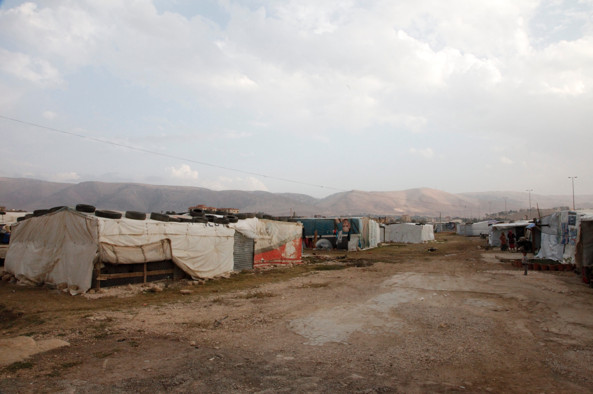

### AYS News Digest 3/5/23: Even more deportations from Lebanon to Syria
#### Greek court rules the state guilty for the deaths in Moria in 2017 // Personal accounts from detainees in the UK and people pushed back from Greece // Minors protest in Lampedusa // The illegitimate practice of distant ports continues in Italy // Alarm Phone reports in detail on the British pushback from January & more info, reports and testimonies

One of the many informal settlements in the Bekaa valley, Lebanon
#### FEATURE

Lebanon is set to return the displaced Syrians to their country as the recent meeting of the officials ended with giving the security forces the green light for “a broader effort to deport undocumented Syrian nationals”, as [reported](https://english.aawsat.com/home/article/4302421/lebanon-general-security-prepares-mechanism-return-syrian-refugees?fbclid=IwAR1xC0zRUSXmlVE-AG1MQvoHIY3Efd8FYYB-FsRAm5VghjfLFTei_6aHLRY) by the media.

Also, the Lebanese Parliament’s Administration and Justice Committee Chair reportedly discussed the topic with UN Special Coordinator in Lebanon, expressing “the need to immediately implement practical steps for their return to their country, and for the international community to cooperate with the Lebanese authorities and provide assistance to the refugees in their country to encourage them to return.”

We will be reporting more on this topic in one of the coming pieces in the AYS Specials series.

In the meantime, a reminder of the AI’s action from the end of 2022:

[Lebanon: Stop the so-called voluntary returns of Syrian refugees](https://www.amnesty.org/en/latest/news/2022/10/lebanon-stop-the-so-called-voluntary-returns-of-syrian-refugees/)
#### SEARCH AND RESCUE AT SEA

■■■■■■■■■■■■■■ 
> **[Open Arms ENG](https://twitter.com/openarms_found) @ Twitter Says:** 

> > This is what remains of the lifeless man we recovered from the sea.

“Unknown name, he drowned.”

The #Mediterranean prevents dignifying those who die and their families so they can mourn and remember them.
RIP https://t.co/Hm8MYqVqSz 

> **Tweeted at [2023-05-02 15:37:07](https://twitter.com/openarms_found/status/1653423381117534209?s=20).** 

■■■■■■■■■■■■■■ 

■■■■■■■■■■■■■■ 
> **[Aegean Boat Report](https://twitter.com/ABoatReport) @ Twitter Says:** 

> > In April @[ABoatReport](https://twitter.com/ABoatReport) have registered 57 illegal pushbacks in the Aegean Sea, performed by @[HCoastGuard](https://twitter.com/HCoastGuard), 1.711 people, children, women and men, have been denied their right to seek asylum, their human rights have been violated by the 🇬🇷 government @[YlvaJohansson](https://twitter.com/YlvaJohansson) @[EU_Commission](https://twitter.com/EU_Commission) https://t.co/dmvdfhvs4o 

> **Tweeted at [2023-05-03 21:25:17](https://twitter.com/ABoatReport/status/1653873385800179713?s=20).** 

■■■■■■■■■■■■■■ 

#### GREECE
### “I came back to get justice”

Samos — Solomon team locates and documents the spot on the island where ten asylum seekers were detained, abused, and robbed by masked men before being cast adrift in the Aegean Sea.

“Following months of research, Solomon has documented—based on interviews, testimonies, legal documents, confidential sources, and audiovisual evidence—the ordeal of this group of ten asylum seekers, who reached Samos in January 2023, believing Greece would provide them shelter, only to be subjected to the violent and unlawful treatment Athens vehemently denies engaging with.”

One of the survivors, 32-year-old Samah from Palestine, has since returned to Samos. She is determined to seek justice and see her tormentors punished, Katy Fallon and Giorgos Christides write in their story on the Solomon findings.

[Surviving hell in Samos: Beaten, robbed, and pushed back from Greek ‘paradise’](https://wearesolomon.com/mag/format/investigation/surviving-hell-in-samos-beaten-robbed-and-pushed-back-from-greek-paradise/?fbclid=IwAR1xC0zRUSXmlVE-AG1MQvoHIY3Efd8FYYB-FsRAm5VghjfLFTei_6aHLRY)

■■■■■■■■■■■■■■ 
> **[Solomon](https://twitter.com/we_are_solomon) @ Twitter Says:** 

> > 💥1/ At a location in #Samos, where asylum seekers were detained before being pushed back to 🇹🇷, cable ties were found.

Security sources told @g_christides @[katymfallon](https://twitter.com/katymfallon) cable ties are used by 🇬🇷 law enforcement as cheaper alternatives to handcuffs to immobilise groups of people. https://t.co/FjFVRSjXMt 

> **Tweeted at [2023-05-02 08:18:47](https://twitter.com/we_are_solomon/status/1653313071522238465?s=20).** 

■■■■■■■■■■■■■■ 

### The long-awaited court decision

The Athens Administrative Court of Appeal [acknowledged](https://www.kathimerini.gr/society/562392475/moria-to-psychos-oi-thanatoi-kai-oi-eythynes/?utm_medium=Social&utm_source=Facebook&fbclid=IwAR3TvxXr6i8JWJnGJzBSjFLjy1RvHHG3lPW_dFgDlJlFNqUgg2-SPWr-EBY#Echobox=1682789955) the responsibilities and omissions for the undignified living conditions that prevailed and obliges the Greek state to pay compensation to the families of the victims.

**According to the decision, officials failed to transfer residents to a safer place during the cold, did not provide adequate heating equipment and failed to systematically prevent the practice of lighting improvised fire.**

Relatives of the 20-year-old Egyptian Ahmed Elgamal and 46-year-old Syrian Mustafa Mustafa now receive some glimpse of justice, six years later, in at least a symbolic way, through a court confirmation that what was taking place was wrong.

Had another court made that decision in time, perhaps these people would now be alive.

Amnesty International is raising awareness of yet another case of criminal charges against people working to support people on the move.

■■■■■■■■■■■■■■ 
> **[Amnesty EU](https://twitter.com/AmnestyEU) @ Twitter Says:** 

> > .@[Amnesty](https://twitter.com/Amnesty) is deeply concerned about the Greek  authorities’ decision to bring criminal proceedings against Tommy Olsen, a Norwegian national and founder of the NGO Aegean Boat Report. https://t.co/sJVserN66Z 

> **Tweeted at [2023-04-28 13:38:40](https://twitter.com/AmnestyEU/status/1651944019981746177?s=20).** 

■■■■■■■■■■■■■■ 

#### CROATIA
### Human Rights Watch: Pushbacks are a **standard operating procedure in Croatia**

After a number of cases we’ve either witnessed, taken testimonies on, documented and reported on, we now bring another organisation’s report on this, in full:

“Laila fled Afghanistan with her parents and two brothers in 2016, when she was 11 or 12 years old. They travelled westward, eventually reaching Bosnia and Herzegovina in early 2021. They then tried to enter Croatia, requesting asylum.

Croatian police ignored their request and forced them back over the border.

The police ordered them to wade across a frontier river at night, far from any town or populated area. Police smashed their phones, so they had no easy way of navigating to safety.

The family stumbled along till they found a road and walked 30 kilometers (18.6 miles) to the nearest town in Bosnia.

Others have faced even worse treatment. Croatian pushbacks often include serious [violence](https://www.hrw.org/news/2020/10/29/violent-pushbacks-croatia-border-require-eu-action) and [humiliation](https://www.theguardian.com/global-development/2020/may/12/croatian-police-accused-of-shaving-and-spray-painting-heads-of-asylum-seekers) . Their methods are so awful, they [violate international prohibitions on torture](https://www.hrw.org/news/2023/05/03/croatia-ongoing-violent-border-pushbacks) .

Let’s get one thing straight: Laila and her family are doing nothing wrong.

Everyone seeking international protection has **the right to apply for asylum abroad** **and have their case heard** before the appropriate authorities. So says the international Refugee Convention, the EU Charter of Fundamental Rights, and a pile of other laws and agreements.

True, Croatia’s abuses are not the beginning of this story. Laila’s family first sought international protection in Iran, then Turkey, and then Croatia’s fellow EU member, Greece. They left each country after authorities there also failed to respond to their requests for international protection.

Croatia’s treatment of asylum seekers is **another link in a chain of state lawlessness and inhumanity** that stretches thousands of kilometers, from areas of extreme instability to the gates of the EU and beyond.

The EU and its member state governments are deeply embedded in this illegality, as we’ve highlighted many times in this newsletter. Recall the [EU’s “let them die policy”](https://www.hrw.org/the-day-in-human-rights/2022/09/14-0) in the Mediterranean, several member states [criminalizing saving lives](https://www.hrw.org/the-day-in-human-rights/2023/01/10?story=paragraph-4856) at sea, and the [EU’s complicity in torture](https://www.hrw.org/the-day-in-human-rights/2022/12/12?story=paragraph-4733) in Libya.

It continues in Croatia, where substantial EU funds for border management are doled out despite Croatia’s repeated abuses and failures to comply with EU law.

[Founded on respect for democracy and human rights](https://www.hrw.org/news/2017/03/10/radical-idea-europe) , the European Union is supposed to be better than this. Sadly, it is not.”

News report on this in Croatian is available [here](https://www.portalnovosti.com/pendrecima-po-djeci?fbclid=IwAR2dBvedrxZoZ8IFA9NOF9PX-PCdUvgTNANKzcMg0aYPHNJIYo-0CXrfuY8) .
### EP office narrowing the space for open discussion

In the meantime, the EP’s office in Croatia has organised a public panel _Europe and migration: on the way of safety and solidarity_ , “on the topic of migration policies in Europe and the current situation on the field”, as the description and [press release](https://www.europarl.europa.eu/croatia/hr/programi_i_aktivnosti/javna-doga-anja/objava-za-medije-europa-i-migracije-na-putu-sigurnosti-i-solidarnosti.html) say.

However, sadly, they seem to have put little or no effort into finding any guests from the other end of the political spectrum to contribute to the topic, not to mention the organisations who are actually reporting on the “situation on the field” non-stop, and who have taken it upon themselves to deal with a whole lot of issues stemming from the current migration policies most of the guests of this panel thrive from, one way or another.

The one-sided views of the official (migration and governing) politics of Croatia, in spite of all the reports coming from and backed by precisely European mechanisms and bodies, were therefore once again lubricated and pushed into the already poorly informed and even less interested public sphere.
#### ITALY
### The illegitimate practice of distant ports continues

Pictoresque La Spezia in the very north of the Mediterranean side of Italy was officially designated a place of safety to disembark the 336 survivors currently aboard Geo Barents, a vessel located 1245km south of there, as MSF Sea points out.
Pozzalo, Palermo, Augusta and other ports would be a more logical, safe and legal choice.

> After their traumatic experience, this unnecessary waiting causes them even more suffering 

### Protest of minors

In the meantime, in the southern hotspot of Lampedusa, 500 out of 700 unaccompanied minors staying there are in a protest. These young people have been stuck there for far too long. Across Italy, centers for minors are overburdened and the new commissioner for migrant emergency, Valerio Valenti, is apparently looking for solutions across the country, reported the national media.
### Alleged due-process violations and other worrying developments related to the trial of HRDs in Trapani and the regulation of civilian SAR

_The following is based on a communication written by the UN Special Rapporteur on Human Rights Defenders and other UN experts to the Government of Italy on 7 February 2023. The communication remained confidential for 60 days before being made public, giving the Government time to reply. The Government replied on 28 April 2023._

_Since the communication was sent, the trial against the Iuventa crew members and other human rights defenders in Trapani has continued. The practice of assigning NGO search and rescue vessels distant ports of disembarkation has also remained common, while in March 2023, the first NGO ship was detained on the basis of the new Italian Decree-Law._

This is a shorter version of the original communication — find both the official communication and the Government’s response [**here**](https://srdefenders.org/italy-alleged-due-process-violations-and-other-worrying-developments-related-to-the-trial-of-hrds-in-trapani-and-the-regulation-of-civilian-search-and-rescue-joint-communication/?fbclid=IwAR0jakpQfQnLIW0Em50aaGl7tFF540zChZYWTf7yF6DB07nLbBauyrUKUp8) .
#### FRANCE
### New detention centre

A so-called administrative detention centre (CRA) will be [built](https://actu.fr/occitanie/beziers_34032/beziers-un-centre-de-retention-administrative-de-120-places-ouvrira-a-l-horizon-2017_59168122.html?fbclid=IwAR26kRIb54OoFX9s2It-vqYq4b4xFRYnIS6femnFNcdnhJPHXEzV1XgGGlY) in Béziers by 2027, for all those people waiting for expulsion of some sort.

At the same time, the government is ignoring the pleas for help by the group that squatted the school a month ago.

■■■■■■■■■■■■■■ 
> **[Utopia 56](https://twitter.com/Utopia_56) @ Twitter Says:** 

> > Demain, ça fera un mois que le gouvernement (@[Elisabeth_Borne](https://twitter.com/Elisabeth_Borne), @[OlivierKlein93](https://twitter.com/OlivierKlein93), @[CharlotteCaubel](https://twitter.com/CharlotteCaubel)) ignore toutes nos alertes concernant les centaines de jeunes isolés qui survivent dans une école abandonnée du 16e arr. de Paris.

Une certaine conception du "dialogue". https://t.co/Glgi1NEeBU 

> **Tweeted at [2023-05-03 12:54:34](https://twitter.com/Utopia_56/status/1653744859524521984?s=20).** 

■■■■■■■■■■■■■■ 

In Paris, the police has destroyed most of the tents temporarily installed by the people who have nowhere to go.

■■■■■■■■■■■■■■ 
> **[CAD - Collectif Accès au Droit](https://twitter.com/CAD_Asso) @ Twitter Says:** 

> > 📢@Exilés_Police_IDF_Ep3🚨
📆20.04 
🗣️Évacuation du campement quai d’Austerlitz ➡la plupart des 34 tentes installées ont été jetées à la benne en toute illégalité. @[PoliceNationale](https://twitter.com/PoliceNationale) : vous n’êtes pas autorisés à détruire les domiciles des exilés à la rue #Paris #Police https://t.co/VlZZNCISdt 

> **Tweeted at [2023-04-28 13:08:03](https://twitter.com/CAD_Asso/status/1651936313128493057?s=20).** 

■■■■■■■■■■■■■■ 

### One death per day since the beginning of the year

Some of these people sadly end up losing their lives to the rough living conditions, no support or health protection.

©Eve Pinel/Collectif Les morts de la rue

Les morts de la rue is a 20-year-old initiative taking part, initiating and leading the movement to make visible the deaths of the people made invisibile during their lifetime, “to pay tribute to these men and women, as well as to alert public opinion to the fate of the most precarious.”
[Read more](https://basta.media/Depuis-le-debut-de-l-annee-au-moins-117-personnes-sont-mortes-du-mal-logement-en-France-morts-de-la-rue?fbclid=IwAR1OLXtrUOioExvjyBGK1ojfH8Cy1OX5WWFkcmVg2AVpMs6CFB2S5cGNc70) about them.
#### GERMANY
### We _will_ respect the rights, but…

Germany seems to be following the path of externalisation of asylum procedures and is now [reportedly](https://www.infomigrants.net/en/post/48622/germany-examines-offshore-asylum-procedures?fbclid=IwAR0SCEJYzEB9POfMmfaNflYwwi2g9bJ6v91KrMmbvmHFbFsx0rTXdVoufm0) examining whether asylum procedures can be carried out in countries outside the European Union. They seek their solution in “migration agreements with third countries”, very likely the same countries to which they send out their many PhD students and other ambitious scholars and field researchers to document the human rights abuses and such, if we may add.

The Greens seem to be willing to back this idea, but insist they are talking about “border procedures and not about transit centers”. Though they do agree that Europe-wide solutions are needed, but they also insist that registering people is not the same as an asylum procedure. Will the German version of the deal with a third country be any different from the rest of the examples we’ve seen so far is yet to be revealed in detail…

In the meantime, on that note: [Germany and Uzbekistan sign migration deal](https://www.infomigrants.net/en/post/48645/germany-and-uzbekistan-sign-migration-deal?fbclid=IwAR00_bTljazzPK13ki23AS333jt3lzDuOvM2uQabItQYNcxDgjHrdMc8e2k) .
#### SWEDEN
### The prolonged hand of the European externalisation and deportation missions

Frontex, who, since 2021, has been running the operations regarding the deployment of EURLO officers abroad, is now coordinating the deployment and work of the so called Rapid Deployment Officers, particularly promoted by Sweden.

Who are they? The tasks of these officers include supporting with “the establishment/verification of identity and/or nationality of returnees and acquisition of travel documents”, the “organisation of return flights, transit, and handover procedures at the border”, and the “post-return phase”. Frontex also finances officers and reimburses the costs incurred by the deploying member states.

Apart from the deployment in Iraq, the document also clarifies the other countries to which EURLOs have been deployed to date and the countries which deployed them: the Democratic Republic of the Congo covering also the Republic of the Congo — Belgium; Egypt — Netherlands; Ghana — Norway; The Gambia — Estonia; Nigeria — Finland; Ethiopia, Kenya and Somalia — Sweden; Uzbekistan also covering Tajikistan and Kyrgyzstan, and Vietnam — Poland. And, according to the document, “calls for deployment to Bangladesh and Cote d’Ivoire/Guinea remain open”, [reports](https://www.statewatch.org/news/2023/may/sweden-promotes-innovative-approaches-for-deploying-deportation-officials-abroad/?fbclid=IwAR2PcjmfxhZD_lZTGga26Fizx1xCXyqDcA75LmyxLmhCyoSiWUV4PyzTppA) Statewatch.
#### FRONTEX
### Rules regarding human rights are “not fit for purpose”, DG Home representative says

Even though reports pile up, documenting and pointing to an ever stronger pressure on human rights defenders, organisations and individuals working to, ultimately, support the values the EU was built on, and even if the continuous pushbacks from Greece are documented and include humiliation, illegal detention and physical and sexual abuse, Frontex has not yet given up on taking the lead role in the actions when it comes to Greece.

Unlike Greece, Croatia, and some other countries with similar prevalent issues, Hungary seems to be the “usual suspect” for the EU, so it has not been a problem to trigger the now infamous Article 46 of their rules, back in 2021, following a European Court of Justice ruling on the pushbacks to Serbia.

This particular rule says the agency’s executive director can terminate any activity if there are serious and persistent violations of fundamental rights.

Carrying out an evaluation of the rules underpinning Frontex, the European Commission DG Home’s officer [said](https://euobserver.com/migration/156977?fbclid=IwAR0SCEJYzEB9POfMmfaNflYwwi2g9bJ6v91KrMmbvmHFbFsx0rTXdVoufm0) it’s a bit naive to think that this is a decision that can be taken by the executive director on his own, as the decision is political, calling the rule that specifically prioritises human rights “not fit for purpose”. Hopefully these comments do alarm someone.
#### **UK**
### UK’s passive pushback from January documented in detail

As we reported in January, in spite of the 2021 announcement that the Border Force would not forcibly ‘push-back’ anyone crossing the Channel, at the start of this year HM Coastguard officers organised for people to be returned to France from UK waters by allowing a dinghy to drift back when they thought they could get away with it.

“Records obtained from the Maritime and Coastguard Agency by Alarm Phone’s Channel Group show Dover Coastguard and Border Force deliberately refused to assist an unseaworthy, overcrowded and broken-down dinghy in UK waters. Instead, they watched while the people were pushed by the wind and tide back into the French Search and Rescue Region (SRR), where there was no French vessel to assist them,” Alarm Phone confirms in a detailed report available [**here**](https://alarmphone.org/en/2023/04/29/the-drifting-politics-of-hm-coastguard-from-life-saving-agency-to-border-police/?post_type_release_type=post&fbclid=IwAR2PcjmfxhZD_lZTGga26Fizx1xCXyqDcA75LmyxLmhCyoSiWUV4PyzTppA) .
### Psychological games at Yarl’s Wood

> I have experienced unlawful things — I’ve not been removed and not been released. My solicitor is challenging them now for unlawful detention. It’s been going for six months. The officers here have been provoking my temper, I’ve been threatened by members of staff to see how I’m going to react — so they can punish me. For example, when I was not saying anything, an officer suddenly said ‘stop threatening me’ and he turned on the panic alarm and other officers came and took me to the block — solitary confinement. And then after a four hours they take me out and say it’s a mistake. They playing psychological games with us. Another time I tried to inform them about a protest that was happening — and then they spread the rumour amongst the residence that I was a snitch — I tried to help them but they used it against me. 

This is one of the personal accounts from people confined at Yarl’s Wood, a detention centre we [previously](https://medium.com/are-you-syrious/ays-daily-digest-12-1-21-uk-stop-yarl-woods-prison-camp-9fdcaf7a1e7f) wrote about. Now, Yarl’s Wood Detainee, Korcari, gives an account of detention conditions, protests, and the escape attempt. The full text is available in [Detained Voices](https://detainedvoices.com/2023/04/29/they-playing-psychological-games-with-us/?fbclid=IwAR2dBvedrxZoZ8IFA9NOF9PX-PCdUvgTNANKzcMg0aYPHNJIYo-0CXrfuY8) .

And the last bit of illustration of the govenrment’s work:

■■■■■■■■■■■■■■ 
> **[Freedom from Torture🧡](https://twitter.com/FreefromTorture) @ Twitter Says:** 

> > 🚨 Government Misinformation Warning 🚨 https://t.co/0jT3ScIpBh 

> **Tweeted at [2023-05-03 09:54:51](https://twitter.com/FreefromTorture/status/1653699634957541378?s=20).** 

■■■■■■■■■■■■■■ 

#### WORTH READING
- [UK Help for the Sudanese Unlikely in ‘Current Environment of Anti-Asylum Rhetoric](https://bylinetimes.com/2023/04/26/uk-help-for-the-sudanese-unlikely-in-current-environment-of-anti-asylum-rhetoric/?fbclid=IwAR2HZL_DRN1sX4yFCgdMNBWZ8XCszcD7Ubt57RXLk_PWWJI9yl5HgmM527Y) ’
- [Statewatch | Migration policy overspill: access to information in peril](https://www.statewatch.org/analyses/2023/migration-policy-overspill-access-to-information-in-peril/?fbclid=IwAR1UrZIit8rNnpw3PwycuS7EFkbWWB9bEtUN3W22MgquU4xzqDzrvPVivQ8)
- [Turkish Border Guards Torture, Kill Syrians | Human Rights Watch](https://www.hrw.org/news/2023/04/27/turkish-border-guards-torture-kill-syrians?fbclid=IwAR2sEuFaTBLwawvyJHWc9dixVRyWHVgyXapQ2kuez62r6Vw1HtHrbKasT2s)

**Find daily updates and special reports on our [Medium page](https://medium.com/are-you-syrious) .**

**If you wish to contribute, either by writing a report or a story, or by joining the Info team, please let us know!**

**We strive to echo correct news from the ground through collaboration and fairness. Every effort has been made to credit organisations and individuals with regard to the supply of information, video, and photo material (in cases where the source wanted to be accredited). Please notify us regarding corrections.**

**If there’s anything you want to share or comment, contact us through Facebook, Twitter or write to: areyousyrious@gmail.com**

_[Post](https://medium.com/are-you-syrious/ays-news-digest-3-5-23-even-more-deportations-from-lebanon-to-syria-d91c810f445d) converted from Medium by [ZMediumToMarkdown](https://github.com/ZhgChgLi/ZMediumToMarkdown)._
