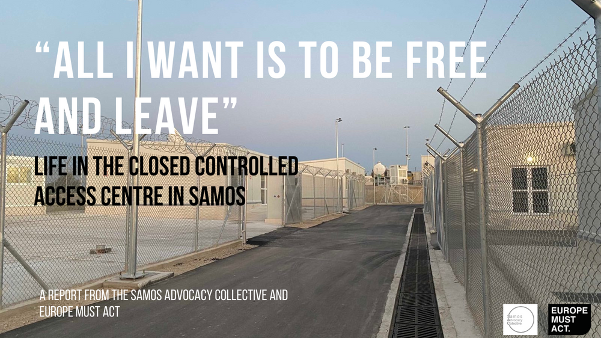

### AYS News Digest 5/5/23: Greek police shoot an unarmed man in the head, no one reports anything
#### Protests on Samos // The violence of externalisation, as carried out by Tunisian authorities // Protests in Rabat about the non-investigation of disappeared people on the move // Aggressive legal reforms in Italy: harsher punishments for scape-goated ‘boat drivers’, harder to gain protections // Germany to vote on externalisation policies — on the brink of funding border fences for Fortress Europe? // Call for volunteers at Calais Food Collective & much more

](assets/1b3b90839376/0*9qLmrJ3eyb0c_Ah5.jpg)

Via [Koraki](https://www.koraki.org/post/a-police-officer-shoots-a-man-in-head-the-response-cannot-be-nothing?fbclid=IwAR1bEuCyFq3l_GX3UCjEjBryoA4TIjn8_h9jjlQOntCdmEfvUeCwxezLi1g)
#### FEATURE
#### A policeman shot an asylum seeker in the head in Greece, and no one has mentioned it

In Greece, a pattern has been emerging. Serious criminal offences carried out against people on the move go unreported, unmentioned and unseen by the general public. The latest incident — leaving a man in critical condition — has been ignored, the police scape-goating him as a ‘smuggler’ with no justification for the label.

The course of events goes as follows:
- A man, driving a car containing seven people, arrives in Greece. The passengers — ‘illegal immigrants’ according to the Greek police — intend to LEGALLY seek asylum.
- The Greek police claim the man ‘disobeyed a stop sign’ and ‘sped off, making dangerous manoeuvres’
- The man stopped the car, and attempted to escape on foot along with the other passengers.
- He was then shot in the head.

This is an unacceptable, inexplicable act of violence. Where does it come from? A polarising, fear-mongering and xenophobic discourse against ‘smugglers’ and ‘illegal immigrants’ that warrants self-defence, even when there is no threat present.

**Not one national Greek newspaper mentioned this:** the shooting of an unarmed man in the head, who posed no threat, by a Greek policeman with live ammunition.

How can such a state of affairs become possible, let alone frequent?

■■■■■■■■■■■■■■ 
> **[Lena K.](https://twitter.com/lk2015r) @ Twitter Says:** 

> > This incident showed yet again how victims of police violence are hierarchised through racism &amp; citizenship status. No interest in the 🇬🇷 media (predictably), not much talk in this platform either, even among users who would be a lot more vocal if the victim was a Greek citizen. 

> **Tweeted at [2023-05-05 11:57:03](https://twitter.com/lk2015r/status/1654455162746855424?t=2K4a49-CrSC2lI-RKlEbRA).** 

■■■■■■■■■■■■■■ 

For further detail, see below:

#### The asylum seekers of Samos camp — a peaceful protest, a petition for rights

Samos CCAC via Europe Must Act

People held in Samos Closed Controlled Access Centre (CCAC) are protesting. Their protest is non-violent, banning vandalism and abusive language. They want to be heard, and to express their dissatisfactions. Their main complaints are
1. Speed: they petition against the length of time it takes to receive asylum rulings. PoMs detained in Samos CCAC ask that asylum decisions be made within one month of their interviews.
2. The **restriction of movement.** Contrary to UNHCR regulations, movement is severely restricted from Samos CCAC. In other camps, detention is limited to 25 days before people must be released. On Samos, only poor health gives people access to cards that will permit freedom of movement. The people in detention are **not criminals, but seek protection** . Their freedom of movement is a right they ought not have to protest for.
3. Racism. They note that positive applications are more often received by white asylum seekers, suggesting that West Africans — from Sierra Leone, Ghana, Guinea, Nigeria, Cameroon, Congo and Uganda to name a few — are disproportionately unsuccessful in their asylum claims.
4. Food. They note that it is insufficient to sustain them, leaving them hungry.

#### SEARCH AND RESCUE
#### **The lived experience of border externalisation**

The externalisation of borders (a strategy whereby states instigate measures beyond their own borders in order to prevent or deter the entry of foreign nationals), as mentioned [in our last digest](ays-news-digest-3-5-23-even-more-deportations-from-lebanon-to-syria-d91c810f445d) , is Europe’s primary political tendency at the moment.

Externalisation and securitisation is most visible in the public communication of EU states with third countries, with whom they make deals. Acts of ‘deterrence’ — as EU terminology puts it — with European support, are visible below.

The video footage shows a Tunisian ‘coast guard’ vessel slamming into a boat carrying numerous PoMs in open water, with one man hitting people indiscriminately with a stick. This is the reality of ‘externalisation and securitisation’ — a blind eye that exonerates European nations from direct participation in human rights abuses. Their consent and encouragement, however, is clear from the proliferation of such deals with third countries.

■■■■■■■■■■■■■■ 
> **[jihed](https://twitter.com/brirmijihed) @ Twitter Says:** 

> > #Tunisia #border_violence 
This how #Tunisian_authorities trained and sponsored by #Europe intercepted a boat of35 people and call it "Rescue operations"
They encircle them, conduct super dangerous maneuvers with a risk of overturning the boat and beat innocent people with sticks https://t.co/XeHTV1u4gj 

> **Tweeted at [2023-05-06 00:33:47](https://twitter.com/brirmijihed/status/1654645598727946240?t=f_naf4XRjWPwTaw99kz1WQ).** 

■■■■■■■■■■■■■■ 

■■■■■■■■■■■■■■ 
> **[jihed](https://twitter.com/brirmijihed) @ Twitter Says:** 

> > It is clearly that the strategy that   #Europe use in there #externalisation of #European_border_regime in #Tunisia is encouraging violent #pushbacks, stole engines ,fuel and conducting dangerous maneuvers to provoque shipwrecks in order to make #migrants afraid .
#Europe kills https://t.co/AN6GgRMvdo 

> **Tweeted at [2023-05-06 00:33:53](https://twitter.com/brirmijihed/status/1654645624011210752).** 

■■■■■■■■■■■■■■ 

The Mediterranean route is currently incredibly active:

■■■■■■■■■■■■■■ 
> **[jihed](https://twitter.com/brirmijihed) @ Twitter Says:** 

> > #TUNISIA
Yesterday maritime units of guard national in the center region: #Sfax, #Mahdia and #Kerkennah conducted  34 operations; intercepted and pushed back 1,237 #migrants among them  1,195 from #sub_Saharan_African nationalities and 42 #Tunisians,and seized  25 engines, boats. https://t.co/WUexJoIjFi 

> **Tweeted at [2023-05-06 08:57:05](https://twitter.com/brirmijihed/status/1654772260480114689?t=VeRTFYP6CHC6xCxahu5Onw).** 

■■■■■■■■■■■■■■ 

#### RESQSHIP in continuous operation

In the course of one evening, RESQSHIP the Nadir assisted 234 people from six boats in distress in the Mediterranean. Three people remain missing.

■■■■■■■■■■■■■■ 
> **[RESQSHIP](https://twitter.com/resqship_int) @ Twitter Says:** 

> > 🔴 (1/3) UPDATE: Last night, the Nadir assisted a total of 234 people from six boats in distress, within 5 hours. 3 people are missing. Around 6 pm, the Nadir reached a distress case where the boat had already capsized. 38 people were pulled out of the water by 3 fishing boats. https://t.co/DcSzz80Z0a 

> **Tweeted at [2023-05-06 08:18:07](https://twitter.com/resqship_int/status/1654762454398713858?t=HyIas0elUMFC5CI9YFd2mA).** 

■■■■■■■■■■■■■■ 

#### MOROCCO
#### Protests in Rabat: Why have you not investgated the fates of our lost loved ones?

](assets/1b3b90839376/1*84f_92iWwb9gif5CkNwdiQ.png)

Activists say more than 11,000 migrants have died or gone missing on the route to the Canary Islands since 2018 | Photo: AP /Javier Bauluz via I [nfo Migrants](https://www.infomigrants.net/en/post/48723/morocco-find-our-children-say-families-of-missing-migrants?fbclid=IwAR1VCnLAXtydZ3R8W3HY9FdvOwjaqjE2OI-MiGQSbAQPnT3VxdSUJBuonXk)

On 4th May, a group of protestors gathered at the foreign ministry building in Rabat, urging authorities to investigate the disappearances of family members during their attempts to cross to Europe.

Fatima Ouahbi, told _AFP_ that 800 PoM (Moroccans, sub-Saharan Africans, Syrians and Sudanese people) had gone missing since 2014.

There have also been significant protests over similar failures to investigate disappearances by families in Zarzis, Tunisia.

These protests took place as Alarm Phone report that bodies are washing up on many coastal areas of Morocco, including Mohammedia, Kénitre and Benslimane.

■■■■■■■■■■■■■■ 
> **[@alarmphone](https://twitter.com/alarm_phone) @ Twitter Says:** 

> > Bodies are being washed up in many coastal areas of Morocco, including #Mohammedia, #Kénitra and #Benslimane. The body of the twins' mother was also washed away yesterday morning.

These killings need an end, #SafePassage now. 

> **Tweeted at [2023-05-06 10:07:43](https://twitter.com/alarm_phone/status/1654790034514407425?t=aLCCRldN7KSLAVqLxU7wWA).** 

■■■■■■■■■■■■■■ 

#### ITALY
#### The so-called ‘Cutro Decree’: aggressive anti-migration law in Italy

 on Unsplash](assets/1b3b90839376/0*lyKSnic1uTEA-L3t)

Photo by [Jason Blackeye](https://unsplash.com/@jeisblack?utm_source=medium&utm_medium=referral) on Unsplash

Italy’s right-wing government have enshrined new laws, under which ‘boat drivers’ — scapegoats for the EU’s border regime — are now held responsible for any “death or injury as a consequence of illegal immigration”, and can receive 20–30 years in prison.

Moreover, it will become far harder to obtain the “special protection” permits necessary for PoMs to reside in Italy. These protections **can no longer become work permits,** depriving people of the chance to make an honest living. It obliges people to work irregularly.

On top of this, laws that were often cited to prevent deportations have been amended or removed; the chance of deportation is far higher.

These laws are in line with the illegal practice of the Italian authorities to assign distant ports to civil fleet rescue ships, in direct contravention to international law:
- MSF Sea remind us that “The government responsible must make every possible effort to reduce the duration for which the survivors remain on the assisting vessel in line with the Guidelines of the Treatment of Persons Rescued at Sea”.

■■■■■■■■■■■■■■ 
> **[MSF Sea](https://twitter.com/MSF_Sea) @ Twitter Says:** 

> > 🚢 UPDATE 
Today, all the 336 children, women and men rescued earlier this week have all disembarked in #LaSpezia. After this difficult experience, all they need now is to receive the appropriate care and protection. We wish them all the best for the rest of their journey! https://t.co/JPHiegLnMw 

> **Tweeted at [2023-05-06 12:10:07](https://twitter.com/MSF_Sea/status/1654820838703603717?t=e_o1I52H1PSJpKqeoFtXlQ).** 

■■■■■■■■■■■■■■ 

#### Meanwhile, in Lampedusa

Another body — likely the victim of the double shipwreck in late April — has washed ashore.

Today alone, 247 people have landed on Lampedusa.

#### GERMANY
#### Willkommen to Fortress Europe? Let’s hope not.

As we wrote about on [Thursday](ays-news-digest-3-5-23-even-more-deportations-from-lebanon-to-syria-d91c810f445d) , Germany’s coalition government is hoping to push through a European asylum reform, which would see the severe externalisation of Europe’s borders. _ProAsyl_ describe this possible new reality, which the EU Council will vote on next month, on 8th June:

> “Refugees reach a country on the EU’s external border. They ask for asylum. They are immediately arrested. From this moment on, all you see of Europe are walls, barbed wire and security guards.” 

This dystopian reality is looming. On 10th May, the German chancellery will meet to discuss the financial costs of migration policies, and Nancy Faesner (SPD) and Lindher (FDP) have made their positions clear. They want to limit the number of refugees entering Germany, and [**are willing to fund the EU’s external border fences to achieve this if necessary.**](https://www.tagesspiegel.de/politik/fdp-chef-will-notfalls-grenzschutz-mit-zaunen-lindner-und-faeser-fur-verscharften-kurs-in-eu-asylpolitik-9768191.html?fbclid=IwAR02yS8JhoD7VT7zmNraMoTQU2uU5ma2PYzB1OucnAkXB86_iHqbRV3EQcE)

If you are a German resident, please use [ProAsyl’s tool](https://aktion.proasyl.de/menschenrechte-verschwinden/) to email your SPD, Green and FDP party executives, petitioning against these proposed reforms.
#### FRANCE
#### Call for volunteers — particularly French speakers and people with driving licences — in Calais

■■■■■■■■■■■■■■ 
> **[Twitter User](https://twitter.com/CalaisFoodCol/status/1654481519958794240?t=6w4e_pq6o-MwYMErrb3Jdw) @ Twitter Says:** 

> >  

> **Tweeted at .** 

■■■■■■■■■■■■■■ 

#### WORTH READING

A reminder to read this article by Joyeux Mugisho on the vicious circle that aid work can enforce, denying agency and indpendence to displaced populations who are forced to rely on aid.

[**We need to talk about international aid and refugee self-reliance**](https://www.thenewhumanitarian.org/opinion/first-person/2023/04/27/flipping-narrative-international-aid-and-refugee-self-reliance?utm_content=buffer8d240&utm_medium=social&utm_source=twitter.com&utm_campaign=buffer&fbclid=IwAR1Cnx_jpkPQa4bMZsuVOC5A3Kfjo6AAOD984E8M0P5pj39zc1IwVNT_L40) 
[_I've seen advertisements from UN agencies on social media asking, "What would you take with you if you had to flee your…_ www.thenewhumanitarian.org](https://www.thenewhumanitarian.org/opinion/first-person/2023/04/27/flipping-narrative-international-aid-and-refugee-self-reliance?utm_content=buffer8d240&utm_medium=social&utm_source=twitter.com&utm_campaign=buffer&fbclid=IwAR1Cnx_jpkPQa4bMZsuVOC5A3Kfjo6AAOD984E8M0P5pj39zc1IwVNT_L40)

**Find daily updates and special reports on our [Medium page](https://medium.com/are-you-syrious) .**

**If you wish to contribute, either by writing a report or a story, or by joining the Info team, please let us know!**

**We strive to echo correct news from the ground through collaboration and fairness. Every effort has been made to credit organisations and individuals with regard to the supply of information, video, and photo material (in cases where the source wanted to be accredited). Please notify us regarding corrections.**

**If there’s anything you want to share or comment, contact us through Facebook, Twitter or write to: areyousyrious@gmail.com**

_[Post](https://medium.com/are-you-syrious/ays-news-digest-06-05-2023-greek-police-shoot-an-unarmed-man-in-the-head-no-one-reports-anything-1b3b90839376) converted from Medium by [ZMediumToMarkdown](https://github.com/ZhgChgLi/ZMediumToMarkdown)._
