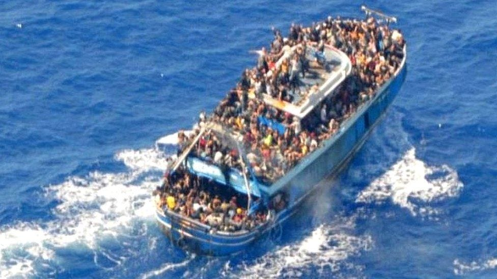
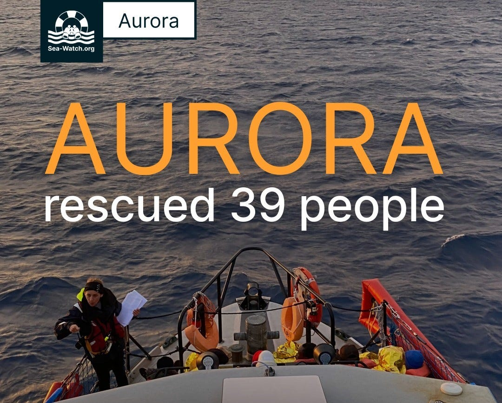
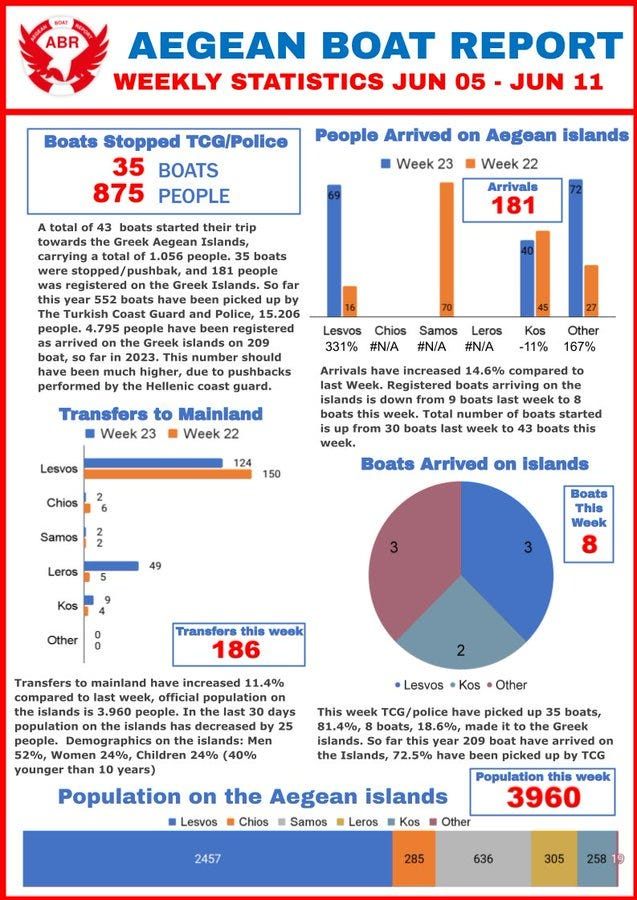

### AYS News Digest 14/6/23: Foul play as hundreds dead after Greek shipwreck tragedy
#### Sea Watch’s Aurora saves 39 people at sea / Nadir deployed in Central Mediterranean again / Refugee Week event list for UK, Greece and Croatia / Events, insights and reports on rescue mission, statistics and calls for action
### FEATURE
### Foul play as hundreds dead after Greek shipwreck tragedy

Photo circulated by the Hellenic Coastguard.

Up to [500 people may have died](https://twitter.com/seawatch_intl/status/1669313217896521728) and more than 100 people rescued after a large vessel capsized in Greek waters.

The incident occurred [47 nautical miles off the coast of the island of Pylos](https://www.instagram.com/p/CtdvbAHsrc5/?igshid=MzRlODBiNWFlZA%3D%3D&fbclid=IwAR29uKwVl-l-sC9QLpZCsrVNkCitDZBXKZAaZXiikMwqXXDiEl8vbscvhqw) and both Greek and Italian authorities were informed of the presence of the boat, as was Frontex. It is thought that approximately 750 people were onboard the vessel, including around 100 children, and that their journey started in Libya.
#### What Really Happened?

An early report of the tragedy stated that there were a large number of other vessels in the area which is [“unusual”](https://www.instagram.com/p/CtdvbAHsrc5/?igshid=MzRlODBiNWFlZA%3D%3D&fbclid=IwAR29uKwVl-l-sC9QLpZCsrVNkCitDZBXKZAaZXiikMwqXXDiEl8vbscvhqw) in this situation, as was the fact that such an overloaded boat wasn’t stopped sooner. Official reports failed to mention that the Greek Coast Guard may have been towing the ship at the time of capsize. This has neither been confirmed or denied by Greek authorities — with Greek politician Alexis Tsipras stating:

> “There was indeed a report” that the boat overturned while being towed by the Coast Guard — “I’m not an expert to know if it’s true”. [The Press Project.](https://thepressproject-gr.translate.goog/tsipras-ypirxe-pragmati-i-anafora-pos-i-varka-anapodogyrise-eno-tin-travouse-to-limeniko-den-eimai-ebeirognomonas-gia-na-gnorizo-an-einai-alitheia/?_x_tr_sl=el&_x_tr_tl=en&_x_tr_hl=en-US&_x_tr_pto=wapp) 

■■■■■■■■■■■■■■ 
> **[Aegean Boat Report](https://twitter.com/ABoatReport) @ Twitter Says:** 

> > Was the Greek coast guard towing the boat before it capsized?

An interview by former MEP @[karsenis](https://twitter.com/karsenis) published today by the @[ThePressProject](https://twitter.com/ThePressProject) , reveals the the Greek coast guard might have been towing the overcrowded fishing vessel before it capsized.

This shocking news came after https://t.co/GcDjp5LIdI 

> **Tweeted at [2023-06-15 11:11:46](https://twitter.com/ABoatReport/status/1669301668259741696).** 

■■■■■■■■■■■■■■ 

The scale of the incident has garnered headlines in many mainstream news outlets, yet it is the family and friends of those who have needlessly lost their lives at the hands of the EU who AYS wishes to acknowledge today.
#### SEARCH AND RESCUE AT SEA

Photo: Sea Watch

“A 12-hour mission comes to an end. After the crew of Mission Lifeline’s Rise Above discovered 39 people in distress at sea and stabilized the situation, our Aurora brought them on board and safely ashore on Lampedusa, against the instructions of the Italian sea rescue control center. They instructed us to head for a port in Trapani, 32 hours away due to bad weather conditions.

“It would have been impossible for the Aurora crew to reach the assigned port in Trapani without unnecessarily endangering the 39 rescued people. The journey would have taken at least 32 hours due to the weather conditions. Nevertheless, the Rome MRCC insisted,” the team reported on Tuesday.

> While more than 1,160 people have drowned in the Mediterranean this year alone, according to the IOM, civil sea rescue remains the scene of political power games — the stakes: human lives. 

](assets/ed5fdf891640/1*Yxz_YwVEXgiFQXw7SRB56Q.jpeg)

Photo: [Sea-Watch](https://www.facebook.com/seawatchprojekt?__cft__[0]=AZU1LGtsJmKrbm6KR1e-3tTKKUdsmm4fYm733r1CYsThsZ_CJYg70WHoY6xLbmKMPKzXtC17YgaCslBf4P396ML_b048vZo74Cjzi_K1spfTkV6bYoMQNj-a-pEk-GmiYl1dJCuirjK6EsNC_haRNovt&__tn__=-UC*F)

Refugee Rescue are looking for a volunteer maintenance co-ordinator to keep ‘MO CHARA’, the RIB they operate in partnership with SEA EYE off the SEA EYE 4, operational, see more info [here](https://www.facebook.com/RefugeeRescueCrew/posts/pfbid0Xrgjd5zDGEPgQYhojrMohHD8KvCjsThBmht8S4rCVGFUn56Sg6XjhNbRCVJBjGGQl?__cft__[0]=AZUGGP5C7j6C6kc7j_2Ecs6lTIFzplPVh7Arc58Ya5Vc7ASu91e2OYBnaL5eT_fFKd3O_BSXUq0ZtJLhRpwoUnZyTlYod9uwBZGF3uaVih2S1VWCcwfzibkaIxGj87X4xVgu6sMUHJ7Amb0ZjKcfuPpgklmtobHZuFsTkykYmLDiHAQulZLvoqQZtZP1of9zebg&__tn__=R]-R) .

Salvimento Maritimo Humanitario showing pre mission trainings on how they approach and manage an overloaded dinghy to prevent panic, capsize or other ways that this delicate situation could get out of hand:

[**El primer contacto con las personas en riesgo de naufragio en un bote precario y sobrecargado es el…**](https://www.facebook.com/reel/214914904700478) 
[_144 views, 9 likes, 0 comments, 1 shares, Facebook Reels from Salvamento Marítimo Humanitario: El primer contacto con…_ www.facebook.com](https://www.facebook.com/reel/214914904700478)

ResQship’s SV NADIR is preparing to deploy to the Central Med SAR zone for her 4th mission of 2023. You can support the mission [here](https://l.facebook.com/l.php?u=https%3A%2F%2Fresqship.org%2Fspende%2F%3Ffbclid%3DIwAR23Att5BxhSGA21yNPKszemF2Thk_dtoAJH2rw0mufTOqnzNyOXaMPmZos&h=AT3hv6Y_pzuWaE4CVunQ2FxZ3-LKyFaPNeBF0uhx_M7i4w_n54Y_0bKndjF2_URpZ9Ja1XGVUkAY7D62CzQ4yDqS68gMqP3hAciGiMmmSsvr5PmbKiEKv-asENJdrA2TnWDkHiUPxJxqkddjPg&__tn__=-UK-R&c[0]=AT12F5Nn2rxY9WeDQAHM0T33lROwYwO-Qg19pusajTfc33b59n4JR5MCcP6XuQwTWhbZqHIw7JcsjHZeVzn8Avd96nRQY1COKlTn9HYHB30y-Hm755Nhi3skLBA-w9MM3oE236gbaiMnA_yW-UePrR94D1EQJQl-wiAVl6qDETeauGQTfA) .

ABR’s weekly report:

“We have registered 15 pushback cases in the Aegean Sea this week, involving 344 men, women and children. In five of these pushback cases the Greek coast guard used life rafts, 72 people were forcibly removed from Greek islands and left helplessly drifting on six life rafts on the Aegean Sea. For more detailed statistics go to [http://aegeanboatreport.com](https://t.co/ZyvIhfvRuv) . / ABR Statistics.”

#### UK

As the performative cruelty of the UK Home Office towards people on the move ramps up further, yesterday saw the highest single number of PoM land on UK shores in one day so far.

InfoMigrants reported: On Sunday, the Home Office stated that [616 people traveling in 12 boats had been detected crossing the Channel from France to the UK](https://www.bbc.com/news/uk-england-kent-65878554) . These numbers exceed the previous daily high of 497 people on 22 April this year.

The total number of migrants entering the UK by boat this year has reached around 8,000, compared to more than 10,000 at the same point in the previous year. In 2022, the total number of Channel crossings stood at 45,755.

However, the restrictive and unsustainable policy decisions from the Home Office are widely criticised and, despite the intention, it is believed these will only exacerbate the already poor situation when it comes to handling the issues realted to migration.

Read more [here](https://www.infomigrants.net/en/post/49628/over-600-migrants-cross-english-channel-in-single-day?fbclid=IwAR1xqBzN6GHOb7ZiYNQQetM-dXP2IiG673qPa1kq59Mg75uiaUC4rNyxOQM) .
#### EVENTS

Refugee Week is the world’s largest arts & culture festival celebrating the contributions, creativity and resilience of refugees and people seeking sanctuary.
- Refugee Week UK: [About — Refugee Week](https://refugeeweek.org.uk/about/?fbclid=IwAR0s-eh7MfP1bfUuAPEsuN6-RvzPyb7iaLr9HDNALHTiRiqXvcPQrV8CcxY)
- As part of Refugee Week, Refugee Action are holding an installation in Bermondsey, London: [Refugee Week Exhibition — Refugee Action](https://www.refugee-action.org.uk/exhibition2023/?fbclid=IwAR169vN9En56dUVdve2nB1Tlx3O_WOMEAcxErlgb6d0PmPJiC-1qKHcGlj4)
- Refugee Rescue are hosting a book launch in Belfast, said book entitled _We Are Here_ with other art events happening in tandem — event [link here](https://www.facebook.com/events/3551352431752786/) .
- Refugee Week Greece schedule of events: [Community Celebration | Refugee Week Greece](https://refugeeweek.gr/2023/05/12/community-celebration-2/?fbclid=IwAR0VH_TTkPDHOUe-j-9wgFkSGiVPcniy6H4JUEFqxzTN3ZfFWdTaFWj8w6M)

 .](assets/ed5fdf891640/0*YhShFTeKuxXvQ5Hw.jpg)

Croatian Refugee Week programme is available [**here**](https://www.cms.hr/hr/najave-dogadaja/10-tjedni-izbjeglicama) .
- Dutch NGO MiGreat is looking for people for a demo in Amsterdam on 18 June. Those who can are invited to contribute to return rail fares for those who can’t: [MOVE demo: 18 June in Amsterdam — MiGreat](https://migreat.org/en/news/7/title?fbclid=IwAR0s-eh7MfP1bfUuAPEsuN6-RvzPyb7iaLr9HDNALHTiRiqXvcPQrV8CcxY)

#### WORTH READING & LISTENING
- The Civil Maritime Rescue Co-ordination Centre (CMRCC) published their bi-monthly report in May: [ECHOES Issue 6, May 2023 — CivilMRCC](https://civilmrcc.eu/echoes-from-the-central-mediterranean/echoes-issue-6-may-2023/?fbclid=IwAR0VH_TTkPDHOUe-j-9wgFkSGiVPcniy6H4JUEFqxzTN3ZfFWdTaFWj8w6M)
- The Civil Fleet’s latest podcast episode dropped a couple of weeks ago, featuring the film maker Sonita Gale discussing her documentary _Hostile_ about the hostile environment imposed on people on the move within the UK: [The Civil Fleet Podcast (libsyn.com)](https://civilfleet.libsyn.com/?fbclid=IwAR0s1Q3LRNuMomyM582VBcKScsH982mtJPkIkZVun__EelJtP0fF5nTyNJY)
- Referring to the earlier mentioned UK Royal National Lifeboat Institution releasing the rescue statistics for people on the move, this Guardian article provides context, and highlights a new and innovative piece of kit designed for Mass Rescue Operations that the RNLI have brought into service: [RNLI reveals Channel rescue statistics and new kit to save more people in seconds | Immigration and asylum | The Guardian](https://www.theguardian.com/uk-news/2023/jun/14/rnli-reveals-channel-rescue-stats-and-new-kit-to-save-more-people-in-seconds?fbclid=IwAR0GF33BoKpHWy4ORsfhC3LfD9v9jg6ac1iKDrqgomg8PiEIb1a_QK1axLA)

**Find daily updates and special reports on our [Medium page](https://medium.com/are-you-syrious) .**

**If you wish to contribute, either by writing a report or a story, or by joining the Info team, please let us know!**

**We strive to echo correct news from the ground through collaboration and fairness. Every effort has been made to credit organisations and individuals with regard to the supply of information, video, and photo material (in cases where the source wanted to be accredited). Please notify us regarding corrections.**

**If there’s anything you want to share or comment, contact us through Facebook, Twitter or write to: areyousyrious@gmail.com**

_[Post](https://medium.com/are-you-syrious/ays-news-digest-14-6-23-foul-play-as-hundreds-dead-after-greek-shipwreck-tragedy-ed5fdf891640) converted from Medium by [ZMediumToMarkdown](https://github.com/ZhgChgLi/ZMediumToMarkdown)._
