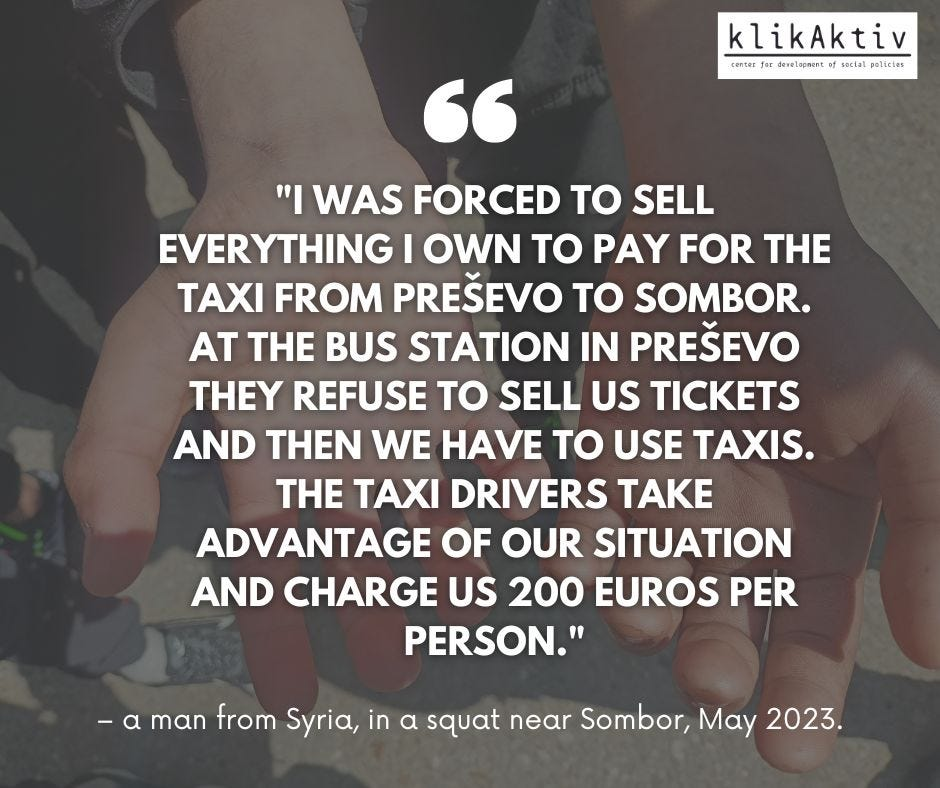
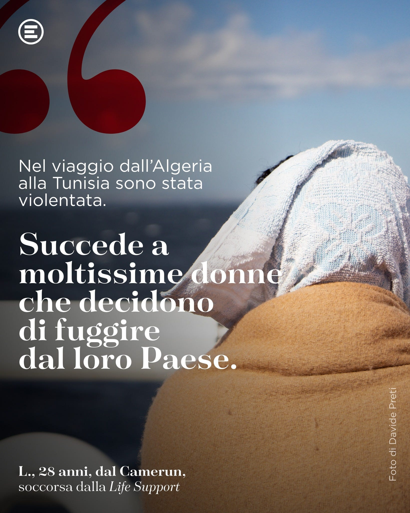

### AYS News Digest 7/8/23: Life stories of people on board the SAR vessels
#### Updates from search and rescue teams in the Med / News from the Balkans / UK’s poor choices likely to cause fatal consequences / Scientific reports: predictive modelling to answer causal queries in migration research / & more news

![“It is devastating to learn the fact we have acquired through our field work with people on the move: a single attempt to cross a Hungarian border is charged 4 to 6 thousand euros per person by smugglers. The same attempt to Bosnia is charged 500 euros, but once in Bosnia the people have not reached the EU yet and there are still more borders and police to fear at the EU external borders. All of this continues to happen while the economies continue flourishing and people’s wellbeing is being degraded due to stress and poverty, and the end to this unfortunately is nowhere to be seen. Translation of the text at the photo is: “You create your own destiny how you want it.”- Klikaktiv](assets/c54e955c94a5/1*Bl340OJvx2Ybyz_EQTyN7g.jpeg)

“It is devastating to learn the fact we have acquired through our field work with people on the move: a single attempt to cross a Hungarian border is charged 4 to 6 thousand euros per person by smugglers. The same attempt to Bosnia is charged 500 euros, but once in Bosnia the people have not reached the EU yet and there are still more borders and police to fear at the EU external borders. All of this continues to happen while the economies continue flourishing and people’s wellbeing is being degraded due to stress and poverty, and the end to this unfortunately is nowhere to be seen. Translation of the text at the photo is: “You create your own destiny how you want it.”- Klikaktiv
#### FEATURE
### Klikaktiv’s statement on recent armed conflict between smugglers in northern Serbia

> SERBIA — “Klikaktiv strongly condemns conflicts between smugglers groups in the north of Serbia that happened in the previous days. We understand the fear and anxiety that the local population has expressed since. Such incidents must be prevented throughout the territory of Serbia, and we call on the Ministry of Interior and the Public Prosecutor’s Office to systematically target the perpetrators and process them. 

> We want to shed light on harmful practices that had been implemented in response to the event by the mandated state institutions, and in the way how the media narrative has been shaped in reporting about the events, which might mislead the public in understanding the complexity of the situation of refugees and migrants in the area. 

> Firstly, we would like to ask reporters, journalists and other media workers who create the media narrative on refugees to take into account the complexity of the context of the recent armed conflicts between smuggling groups and to adhere to the journalists’ code of conduct. Sensationalist reporting on such grave incidents further harms refugees who are not involved as perpetrators but as victims too. 

> To provide an example of such reporting, majority of the media in the country in its reporting about the incident highlighted that more than 800 police officers detained 300 migrants, with these numbers “800” and “300” inducive to panic and shock in the general public, while a few readers might find and register the information that only 13 of the detained were arrested as suspected perpetrators of violence and smuggling. 

> These armed conflicts are almost always incidents between different smuggling groups both involved in the criminal activity. Smugglers are far less in numbers than refugees. The refugees also fall prey to smuggling groups, who exert power over them due to their precarious position and dependability on the smugglers to continue their journey to EU. On the one side, the asylum system in Serbia does not provide an effective and quick enough response to the refugees’ needs. Secondly, the EU has raised fences at its external borders and continues its policy of securitization and denial of refugees’ access to its territory. 

> We also call on the Ministry of Interior and the Prosecutor’s Office to systematically investigate, identify and prosecute members of the organized criminal groups of smugglers, compared to the current practice of untargeted mass forced relocations of refugees who do not lead to solutions long term. Such practice we have witnessed in the police raids for more than 18 months now, further deteriorate the public opinion on refugees, who transit through Serbia in search for safety they are denied in their countries of origin, and who are not involved in the criminal acts, smuggling and armed conflicts. 

> The police raids further damage refugees’ physical and mental health, having already undergone several traumatic events on their journey on the route prior to Serbia. Emotionally and financially drained, they continue their stay in Serbia in constant fear of being reported to the police. We share a quote from a beneficiary in the photo below. 

> Once again, we would like to highlight that Klikaktiv stands strongly against all forms of violence perpetuated by organized criminal groups of smugglers and we extend our understanding to all citizens of Serbia who feel unsafe and voice their concerns through protests in their local communities. We remain available for further information or interviews to all journalists and reporters who wish to gain insight on the situation on the field. We believe that a conversation with humanitarian organisations working in the area, including Klikaktiv, could help frame the reporting more adapt to the context, instead of the sensationalist reporting that we have witnessed recently.” 

#### SEARCH AND RESCUE AT SEA (SAR)
### Updates

OPEN ARMS is safely in harbour in Brindisi after a challenging mission

■■■■■■■■■■■■■■ 
> **[Open Arms ENG](https://twitter.com/openarms_found) @ Twitter Says:** 

> > Only with an #OpenArms human team as committed, professional and empathetic as this one were we able to carry out this very complicated #Mission102, with 777 people assisted in 9 rescue operations and 12 assists. Thank you very much, team!

And many thanks to the multitude of https://t.co/j2NpvJDRHM 

> **Tweeted at [2023-08-07 08:14:28](https://twitter.com/openarms_found/status/1688463607397277697?s=20).** 

■■■■■■■■■■■■■■ 

This mission nearly got cancelled owing to funding shortfalls, but they got a lot of donations after a big media cash call. In return, SOS Humanity is going to provide a lot more media output on this mission:

■■■■■■■■■■■■■■ 
> **[SOS Humanity (international)](https://twitter.com/soshumanity_en) @ Twitter Says:** 

> > This operation with #Humanity1 is only possible because of you! As a thank you, we’re taking you onto the ship. Our communications coordinator Camilla will show you all our rescue work on the central #Mediterranean on social media. There are additional stories on Instagram! https://t.co/msD4j1duQe 

> **Tweeted at [2023-08-02 17:06:59](https://twitter.com/soshumanity_en/status/1686785678976204826?s=20).** 

■■■■■■■■■■■■■■ 

ResQShip’s SV NADIR has been busy with rescue ops in the Central Med.

■■■■■■■■■■■■■■ 
> **[RESQSHIP](https://twitter.com/resqship) @ Twitter Says:** 

> > Das kalkulierte Chaos auf dem Mittelmeer hält an. Unsere Crew hat in der Nacht auf Freitag 170 Menschen aus Seenot gerettet. Gleichzeitig geht auf Lampedusa der Treibstoff aus. Für die Küstenwache ist das ein großes Problem. Lese unser Pressestatement: [resqship.org/segelschiff-na…](https://resqship.org/segelschiff-nadir-rettet-170-menschen-aus-seenot/) 

> **Tweeted at [2023-08-05 10:26:13](https://twitter.com/resqship/status/1687771988360560640?s=20).** 

■■■■■■■■■■■■■■ 

SEA WATCH 5 has conducted sea trials in the vicinity of Flensburg after her conversion to SAR duties. Good news, a powerful future asset is one step closer to live ops in the Central Med:

■■■■■■■■■■■■■■ 
> **[Sea-Watch International](https://twitter.com/seawatch_intl) @ Twitter Says:** 

> > The sea trial of the Sea-Watch 5 in Flensburg was a success. Our captain Mal takes you through the trial as the day of the departure to the Mediterranean is getting closer! https://t.co/Q4mY2rhxcQ 

> **Tweeted at [2023-08-05 07:50:30](https://twitter.com/seawatch_intl/status/1687732797077585920?s=20).** 

■■■■■■■■■■■■■■ 

TRIGGER WARNING: IMAGES OF PERSONS IN WATER. Via the NGO Refugees In Libya, Italian Coast Guard film of a recent SAR operation off Lampedusa in big seas. Lives were lost and people are unaccounted for at this time:

■■■■■■■■■■■■■■ 
> **[Refugees In Libya](https://twitter.com/RefugeesinLibya) @ Twitter Says:** 

> > ⚠️Shipwreck off Lampedusa with a disturbing scene. 

This is not an excerpt from the Titanic movie but a group of people pushed by circumstance and the visa restrictions to take down this deadly routes. 
@[guardiacostiera](https://twitter.com/guardiacostiera) releases a footage that all of us should be talking about. https://t.co/NiliquxOed 

> **Tweeted at [2023-08-06 15:39:52](https://twitter.com/RefugeesinLibya/status/1688213307570728961?s=20).** 

■■■■■■■■■■■■■■ 

### Testimonies of people on board SAR vessels

SOS Mediterranée, a harrowing survivor’s testimony of the abuses he has suffered making his journey:

■■■■■■■■■■■■■■ 
> **[SOS MEDITERRANEE France](https://twitter.com/SOSMedFrance) @ Twitter Says:** 

> > 🎙 Témoignage
 
Adam*, 20 ans, originaire du Nigeria, a partagé avec notre équipe à bord de l' #OceanViking son terrifiant parcours ainsi que les abus dont il a été victime en Libye.
 
 🎥 Flavio Gasperini / SOS MEDITERRANEE
 
 *Nom changé pour protéger l'identité du rescapé. https://t.co/TvTsw0JniY 

> **Tweeted at [2023-08-04 09:40:10](https://twitter.com/SOSMedFrance/status/1687398011146534912?s=20).** 

■■■■■■■■■■■■■■ 

A testimony of harrowing experiences on the move from a person on board Emergency’s My Life Support:

> L. is 28 years old and is one of the people the crew helped in the last mission. 

> ““I ran away alone from my country, Cameroon. I ran away from violence and abuse, leaving family and friends behind. I arrived in Tunisia passing through the Algerian desert. During the trip I was raped by the men I had paid to take me to Tunisia. Happens to a lot of women. 

> In Tunisia I collected money for the sea trip. In those months I could never go to a doctor because I had no documents”. 

> Only once she arrived on board of the SAR vessel was L. able to take a pregnancy test. 

> “At that moment I found out I was three months pregnant”. 

### Calls for donations

**CROATIA** — Rijeka point, where people on the move are getting much needed support, a place to rest and assistance, needs: t-shirts, shorts and bottoms, socks, shaving razors, toothbrushes and sheets. If you or anyone you know would like to donate, we can connect you to the group on the field in Rijeka, let us know!

**FRANCE** — Urgent [call](https://twitter.com/Care4Calais/status/1687876595858497536?s=20) for waterproof clothing and associated supplies from [Care4Calais](https://web.facebook.com/groups/1652972374920129/user/100064871640584/?__cft__[0]=AZWzv8fnTGT9xdFWnhXyiZKf-r8nPQOTEhwQrs3QCew-gghavzNKGrzO3qZ-bRk6GDZkgsDaHeFL_9CqJPUiXUUKR75hSwq8qXf-huw-pi3g7vPl4Y4wGy5Rbc7Y3uUBHJ7BgwR4TcfdZjyXQBDiwGnks57o352Xc0ZHMJcM683RjVy-EVQPpsPsdlR4J-gEoNU&__tn__=R]-R) in view of the recent extreme weather and its impact upon displaced people in the camp. If you or anyone you know have any spare waterproof clothes, extras from your warehouses and donations, particularly coats, please donate them at one of their collection points: [http://care4calais.org/thedropoffmap/](https://t.co/0xjWxL6YVL)
#### UK

[Asylum Matters](https://twitter.com/AsylumMatters) shared some good news about the progress of the ‘Lift the Ban’ campaign in the UK, aimed at overturning the restrictions on displaced persons seeking work

■■■■■■■■■■■■■■ 
> **[Asylum Matters](https://twitter.com/AsylumMatters) @ Twitter Says:** 

> > Amazing news! @[SuttonCouncil](https://twitter.com/SuttonCouncil) has become the 19th local authority to support the #LiftTheBan campaign👏

Thanks to local campaigners and councillors who stood up for their residents who are banned from working &amp; for Sutton's right to welcome not punish refugees.

#LiftTheBan now! 

> **Tweeted at [2023-08-04 11:59:59](https://twitter.com/AsylumMatters/status/1687433196583923718?s=20).** 

■■■■■■■■■■■■■■ 

In the meantime, the UK Government are enacting cruelty for the sake of cruelty. The first people seeking safety have been taken [onboard the Bibby Stockholm barge](https://www.bbc.co.uk/news/uk-66424923) .

And as a fallback to the collapse of the Rwanda deal, the UK government has exhumed and is trying to re-animate the Priti Patel-era concept of sending displaced persons to Ascension Island in the South Atlantic. However, one of those pointing to the futility of this news and the improbability of this plan being put into practice, Otto English (author & journalist), pointed out why this idea remains a deeply stupid, impractical and wildly expensive exercise in performative imperial cruelty:

> ● Ascension Island has no indigenous population 
 

> ● No facilities exist to host people— food, bedding and HO personnel will have to be flown 4,418 miles to the site 
 

> ● An impractical and stupidly expensive idea dreamt up purely for headlines 

#### WORTH READING AND WATCHING
- A team of academics have used machine learning and predictive models to science the hell out of the ‘pull factor’ trope we hear so much about. Their data and conclusions back up the general understanding we have in the humanitarian field that ‘push factors’ driving people away from their homes are far stronger: [Search-and-rescue in the Central Mediterranean Route does not induce migration: Predictive modeling to answer causal queries in migration research | Scientific Reports (nature.com)](https://www.nature.com/articles/s41598-023-38119-4?fbclid=IwAR1XybJd_LTXuNJQQil2fBOYfDv2-Hu1tSgRoZipgVUvoRUXIxzy6yzSQqU)
- A worrying report and analysis of how much more money the EU wants to pour down the infinite money pit of border securitization and militarisation: [Statewatch | European Commission wants to boost border spending by billions of euros](https://www.statewatch.org/news/2023/july/european-commission-wants-to-boost-border-spending-by-billions-of-euros/?fbclid=IwAR01QUmb-3iZQDWauR0lkpnSRljbek69h1zoCCgf56XJc540vA5fEtmRzFo)
- From the Civil MRCC (virtual Maritime Rescue Co-ordination Centre, established in order to do what other national MRCCs are under pressure not to do), their latest ‘Echoes from the Central Mediterranean’ online journal: [ECHOES Issue 7, July 2023 — CivilMRCC](https://civilmrcc.eu/echoes-from-the-central-mediterranean/echoes-issue-7-july-2023/?fbclid=IwAR3M-WvACKGGvE1ZYAufipXvxpmb3HIJlbIJa6pCDbPCYQP-gMBAGThx2nM)

> **_Find daily updates and special reports on our [Medium page](https://medium.com/are-you-syrious) ._** 

> **_If you wish to contribute, either by writing a report or a story, or by joining the AYS Info team, please let us know!_** 

**We strive to echo correct news from the ground through collaboration and fairness. Every effort has been made to credit organisations and individuals with regard to the supply of information, video, and photo material (in cases where the source wanted to be accredited). Please notify us regarding corrections.**

**If there’s anything you want to share or comment, contact us through Facebook, Twitter or write to: areyousyrious@gmail.com**

_[Post](https://medium.com/are-you-syrious/ays-news-digest-7-8-23-life-stories-of-people-on-board-the-sar-vessels-c54e955c94a5) converted from Medium by [ZMediumToMarkdown](https://github.com/ZhgChgLi/ZMediumToMarkdown)._
