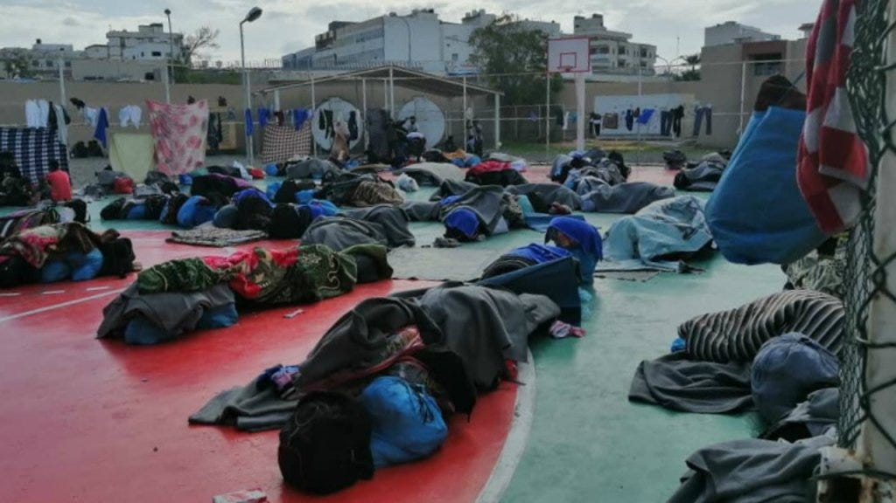

### AYS Digest 30/8/23: Horrific video footage of a deceased woman on the floor inside a detention centre in Libya — when will the EU stop financing this abuse and mistreatment?

Suspension of accommodation for single male asylum seekers in Belgium // Violence between anti-migrant activists and Syrian asylum seekers in Cyprus // Moldova and Georgia classified as ‘safe countries of origin’ in Germany…

](assets/30bb27e8bb27/0*oCtzSb38kLO2oEIB)

Source: [(3) refugee — Search / X (twitter.com)](https://twitter.com/AJEnglish/status/1696175959597056229/photo/1)
#### FEATURE:
### Video of dead woman in Abu Salim detention centre, Libya

MSF and UN have confirmed the authenticity of a video that shows a woman lying on the floor, with another claiming she passed away that morning. It was filmed by survivors detained in the detention centre who had to pay ransoms for their release and left for Tunisia. It is believed by some that she died from tuberculosis, which is a common disease in Abu Salim. ‘Refugees in Libya’ group claim she died of malnutrition and torture.

](assets/30bb27e8bb27/1*ld7CsY55ZF2IFqAPxzOr_A.png)

Source: [Shocking footage of woman’s body lying in Libyan migrant centre — Middle East Monitor](https://www.middleeastmonitor.com/20230829-shocking-footage-of-womans-body-lying-in-libyan-migrant-centre/)

All forms of abuse are extremely common in detention centres such as Abu Salim. [This situation is neither new nor shocking for individuals who have been detained in Libya](https://www.aljazeera.com/news/2023/8/29/death-typical-of-libyan-camps-say-former-detainees-after-video-emerges) . Earlier this year, the UN Human Rights Council found evidence that the DCIM (who run the detention centres) was [complicit in crimes against humanity](https://www.infomigrants.net/en/post/47994/un-crimes-against-humanity-committed-in-libya) which had been committed against detainees since 2016 .

> “This is hard to watch but unfortunately, it is not an isolated incident. Grave human rights violations and crimes amounting to [crimes against humanity](https://www.libyanjustice.org/news/migrants-and-refugees-in-libya-face-crimes-against-humanity-icc-must-investigate-eu-must-stop-support-lfjl) are committed every day against women, men and children inside and outside of migration detention centres in Libya, with complete impunity,” — Jürgen Schurr, Head of Law at LFJL 

Source: InfoMigrants — Migrant detainees in Abu Salim detention center in Tripoli | Photo: private

[Video shows woman lying dead on floor of migration detention centre in Libya | Libya | The Guardian](https://www.theguardian.com/world/2023/aug/29/video-woman-dead-floor-migrant-detention-centre-libya)

[Woman’s lifeless body filmed in Libyan detention camp — InfoMigrants](https://www.infomigrants.net/en/post/51480/womans-lifeless-body-filmed-in-libyan-detention-camp?fbclid=IwAR2iScyjqcnTlP2gTD5Q1pjN6MmKfJe9Ac_F-p1FUuP-wMKlW9nnnR1uEBg)

[News: Horrifying footage of a deceased woman inside Abu Salim migration detention centre — Lawyers for Justice in Libya (libyanjustice.org)](https://www.libyanjustice.org/news/news-horrifying-footage-of-a-deceased-woman-inside-abu-salim-migration-detention-centre)

■■■■■■■■■■■■■■ 
> **[Solidarity with Refugees in Libya](https://twitter.com/Alliance_SRL) @ Twitter Says:** 

> > Do Europeans need more images of dead African refugees/migrants to understand that they need to stop their gov'ments from financing torture, rape &amp; death in Libyan prisons?

#SafePassage 
#ProtectRefugees
#EvacuateRefugeesFromLibya 

> **Tweeted at [2023-08-29 09:35:40](https://twitter.com/SoliwRiLibya/status/1696456575852937601?s=20).** 

■■■■■■■■■■■■■■ 

#### SEA/SAR
### Conditions on Aurora after the ship was detained by the Italian authorities

■■■■■■■■■■■■■■ 
> **[Sea-Watch](https://twitter.com/seawatchcrew) @ Twitter Says:** 

> > Rebecca, Einsatzleiterin der Aurora, berichtet über die Situation an Bord #Aurora kurz nach der Festsetzung des Schiffes unter 🇮🇹 fingierten Vorwänden. Die 🇪🇺Migrationspolitik ist ein direkter Angriff auf das Fundament, für das sie zu stehen vorgibt - grundlegende Menschenrechte! https://t.co/asPjAJ9N3W 

> **Tweeted at [2023-08-29 11:44:53](https://twitter.com/seawatchcrew/status/1696489090563101140?s=20).** 

■■■■■■■■■■■■■■ 

#### Another tragedy caused by the lack of safe routes:

■■■■■■■■■■■■■■ 
> **[@alarmphone](https://twitter.com/alarm_phone) @ Twitter Says:** 

> > Another tragedy in the #Atlantic!
~We learnt that a boat carrying 60 people who left from #Akhfenir a week ago was rescued by moroccan authorities yesterday. 6 people died trying to cross. This tragedy could have been avoided if freedom of movement was effective for all ! 

> **Tweeted at [2023-08-29 11:25:03](https://twitter.com/alarm_phone/status/1696484099471372552?s=20).** 

■■■■■■■■■■■■■■ 

#### GREECE
### 21 people arrived on Chios and fled to the woods to avoid being pushed back

■■■■■■■■■■■■■■ 
> **[Aegean Boat Report](https://twitter.com/ABoatReport) @ Twitter Says:** 

> > In the early hours of today we were contacted by a group of 21 people, who during the night had arrived southwest of Keramia, Chios southeast.

After arriving the group fled to the Woods in the surrounding area to hide from Greek authorities, fearing that if they were found they https://t.co/fX7Gugq0vW 

> **Tweeted at [2023-08-30 15:26:22](https://twitter.com/ABoatReport/status/1696907216773591368?s=20).** 

■■■■■■■■■■■■■■ 

### Meloni and Mitsotakis meeting — alliance between two discriminatory and anti-migrant counterparts

Italian Prime Minister Giorgia Meloni is set to meet Kyriakos Mitsotakis in Athens this week to discuss bilateral and regional issues. This will inevitably include migration flows from North Africa and Turkey.

[Meloni meets Mitsotakis to discuss migration, ‘consolidate’ an ally — EURACTIV.com](https://www.euractiv.com/section/politics/news/meloni-meets-mitsotakis-to-discuss-migration-consolidate-an-ally/?fbclid=IwAR3Obx7YXQyHuvGwLlBjfFjxlBQQyJhmflyDIbWyqEtC_u3MR6cMUZQFtUk)
### Positive news: nine refugees charged with arson have been released

■■■■■■■■■■■■■■ 
> **[ECRE](https://twitter.com/ecre) @ Twitter Says:** 

> > 👏👏Great news indeed!

9 refugees charged with arson in #Evros 🇬🇷 released without conditions - all 13 now released! 

> **Tweeted at [2023-08-29 08:06:43](https://twitter.com/ecre/status/1696434189191553278?s=20).** 

■■■■■■■■■■■■■■ 

#### CYPRUS
### Violence between anti-migrant activists and Syrian asylum seekers in Chloraka, Cyprus

Tensions have been building between local residents and refugees in Cyprus over the last few years. Some of the locals involved in the violence are linked to the far-right populist party Elam.

On Sunday, local Greek Cypriots attacked asylum seekers, beating up individuals and smashing windows and cars. In addition, police evicted dozens of refugees from an apartment complex in Chloraka. As a response, 500 Syrians held a peaceful sit-down protest. Following this protest, locals started marching through the streets and clashed with asylum seekers. The police have arrested 21 individuals.

[Cyprus police arrest 21 people as tensions between locals and refugees rise | Migration News | Al Jazeera](https://www.aljazeera.com/news/2023/8/29/cyprus-police-arrest-21-people-as-tensions-between-locals-and-migrants-rise)

[Violent anti-migrant riots in Cyprus town — InfoMigrants](https://www.infomigrants.net/en/post/51443/violent-antimigrant-riots-in-cyprus-town?fbclid=IwAR23aSCbSS97z17K82W_xcvcOnYYfu_ORf79WboFGHl0Kx9L341nkSTf45A)
#### GERMANY
### Chancellor classified Moldova and Georgia as ‘safe countries of origin’

The current success rates of asylum claims from Georgians and Moldovans stand at 0.15%. With this policy change, individuals can still seek asylum in the country, but the approval rates will be even lower.

PRO ASYL have argued against this decision, as both countries have areas that are Russian-controlled. The geopolitical instability and threat of Russian control spans both countries. In addition, in Georgia, the state does not protect the LGBTQ+ community from violence and attacks, and in Moldova, the Roma community are marginalised and discriminated against. There are very complex issues at play that are not being addressed in this new decision.

[New “safe” countries of origin: what is not safe is made safe | PRO ASYL](https://www.proasyl.de/pressemitteilung/neue-sichere-herkunftslaender-was-nicht-sicher-ist-wird-sicher-gemacht/?fbclid=IwAR1ijnoKkMhoGXxDjmj19dx6a3zjfZriKUBahtcPUQeaCWmV-6XvBum9OqM)

[Germany will classify Georgia, Moldova as ‘safe countries,’ making rejecting asylum-seekers easier | The Independent](https://www.independent.co.uk/news/germany-ap-olaf-scholz-georgia-moldova-b2401843.html)
#### AUSTRIA
### 53 individuals found crammed in a truck, after being smuggled into the country

ECRE reminds readers that European countries need to create more safe routes that will actually tackle the business of smuggling and trafficking, and allow individuals to seek asylum in a much safer and humane way.

■■■■■■■■■■■■■■ 
> **[ECRE](https://twitter.com/ecre) @ Twitter Says:** 

> > Reminder: The problem is not smugglers but the lack of safe routes that facilitate the bussiness of smugglers and exploitation of migrants' needs of protection. 

> **Tweeted at [2023-08-29 14:17:51](https://twitter.com/ecre/status/1696527588049793303?s=20).** 

■■■■■■■■■■■■■■ 

#### BELGIUM
### Temporary suspension of accommodation for single male asylum seekers

A rise in asylum claims, especially from families with children, combined with a shortage of accommodation has led to this decision. [It is still unclear how long this suspension will last](https://www.rte.ie/news/europe/2023/0829/1402353-belgium-asylum-seekers/?fbclid=IwAR2VvlKlrvsz6moHc5P-oE8Jsj2HPExcETnpSkf6oV8oOgbeutL72atr474) . For the time being, however, any single male who claims asylum in Belgium will not be provided with any form of accommodation support.

Critics argue this could have been prevented, as it was predicted that asylum claims would increase, so the government had the opportunity to prepare. Tim Claus, director of Refugee Council, used Austria as an example of a country with similar numbers of arrivals that had managed to organise emergency accommodation.

[Belgium suspends shelter for single male asylum seekers — InfoMigrants](https://www.infomigrants.net/en/post/51471/belgium-suspends-shelter-for-single-male-asylum-seekers?fbclid=IwAR1uSO9VmA3VNKsIslweSJIyRYPEx-z04Kwt6DWYN-d10WuERX2_-QAnUCs)
#### WORTH READING:
- [231 asylum seekers reached Malta by boat in 2023 — Newsbook](https://newsbook.com.mt/en/231-asylum-seekers-reached-malta-by-boat-in-2023/)
- [Statewatch | Urgent warning: more deaths at sea, NGO ships blocked](https://www.statewatch.org/news/2023/august/urgent-warning-more-deaths-at-sea-ngo-ships-blocked/?fbclid=IwAR1_JOE5UGq629KahfOJTGFB_WiIAPfTHhQf3vGpxnloAUQJTvakGoGv99w)
- [Coup d’état in Gabon: General Brice Oligui Nguema appointed “president of the transition” (lemonde.fr)](https://www.lemonde.fr/afrique/article/2023/08/30/coup-d-etat-au-gabon-le-general-brice-oligui-nguema-nomme-president-de-la-transition_6187021_3213.html)

■■■■■■■■■■■■■■ 
> **[Al Jazeera English](https://twitter.com/AJEnglish) @ Twitter Says:** 

> > "It is our Rohingya language and we have to learn it."

This refugee teacher in India is fighting to keep the Rohingya written language alive 👇 https://t.co/2Cg1IuPQPA 

> **Tweeted at [2023-08-30 02:00:00](https://twitter.com/AJEnglish/status/1696704288393712032?s=20).** 

■■■■■■■■■■■■■■ 

> **_Find daily updates and special reports on our [Medium page](https://medium.com/are-you-syrious) ._** 

> **_If you wish to contribute, either by writing a report or a story, or by joining the AYS Info team, please let us know!_** 

**We strive to echo correct news from the ground through collaboration and fairness. Every effort has been made to credit organisations and individuals with regard to the supply of information, video, and photo material (in cases where the source wanted to be accredited). Please notify us regarding corrections.**

**If there’s anything you want to share or comment, contact us through Facebook, Twitter or write to: areyousyrious@gmail.com**

_[Post](https://medium.com/are-you-syrious/ays-digest-30-8-23-horrific-video-footage-of-a-deceased-woman-on-the-floor-inside-detention-centre-30bb27e8bb27) converted from Medium by [ZMediumToMarkdown](https://github.com/ZhgChgLi/ZMediumToMarkdown)._
