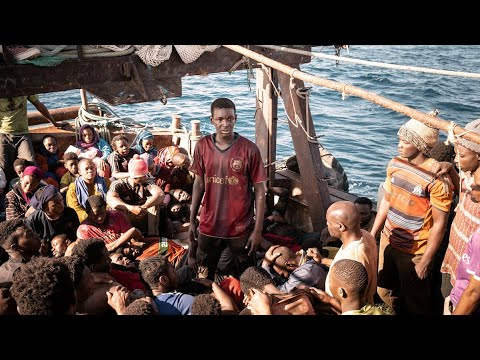

### AYS News Digest 8/9/23: Footage of Tunisian National Guard helicopter terrorising refugees

Increase in number of arrivals on the Aegean Islands//Shocking analysis by the IHR on the lack of protection for survivors of human trafficking in Samos CCAC//No Name Kitchen has posted horrific testimony from an individual whose brother experienced a violent pushback//“Lo Capitano” — Story of two Senegalese nationals who make their way to Europe and much more…

](assets/ca2502388239/1*UzSOv0v1MTN5kKUjV_fpEg.png)

Source [https://twitter.com/brirmijihed/status/1699507942767173693?s=20](https://twitter.com/brirmijihed/status/1699507942767173693?s=20)
#### GREECE
### Increase in number of arrivals on the Aegean Islands & supposed fall in pushbacks explained

Statistics for August 2023 point to a potential decrease in pushbacks by the Greek Coast Guard. However, [Koraki, corrects this misinterpretation](https://www.koraki.org/post/pushback-proportions-not-numbers-fall-in-august?fbclid=IwAR07BSRb9XQBFv0zy2fbV3Ec_BLUbh0I7it9alFcsJdBGfvmqwsILqQdjVU) by showing that the numbers of arrivals has significantly increased in August, which means a smaller proportion of individuals attempting to reach Greece are intercepted and pushed back.

In August 2023, 5,352 individuals were registered as new arrivals on the Eastern Aegean Islands. In the same month, the Greek Coast Guard pushed back 2,455 individuals. This means that 31.4% people were pushed back this last month. This is the lowest proportion since March 2020.

[Pushback proportions, not numbers, fall in August (koraki.org)](https://www.koraki.org/post/pushback-proportions-not-numbers-fall-in-august?fbclid=IwAR07BSRb9XQBFv0zy2fbV3Ec_BLUbh0I7it9alFcsJdBGfvmqwsILqQdjVU)

**Below are reports from new arrivals between 7/9/23–8/9/23:**

■■■■■■■■■■■■■■ 
> **[MSF Sea](https://twitter.com/MSF_Sea) @ Twitter Says:** 

> > ✅RESCUE COMPLETED
This afternoon all 31 survivors rescued earlier on Monday have safely disembarked the #GeoBarents in #Bari.

Survivors had to endure harsh weather that hit the Central Mediterranean, over a journey that took 4 days to safety. https://t.co/3wYCcamaLG 

> **Tweeted at [2023-09-08 16:58:31](https://twitter.com/MSF_Sea/status/1700191901129781358?s=20).** 

■■■■■■■■■■■■■■ 

■■■■■■■■■■■■■■ 
> **[Aegean Boat Report](https://twitter.com/ABoatReport) @ Twitter Says:** 

> > This morning we were contacted by a second group arriving on Lesvos today, 28 people, 10 men, 10 women and 8 children. They had arrived on Korakas, east of Skala Sikamineas, Lesvos north.

After arriving the group fled to the Woods to hide from Greek authorities, fearing that if https://t.co/5pGjL0vhlA 

> **Tweeted at [2023-09-07 21:23:05](https://twitter.com/ABoatReport/status/1699896093884981318?s=20).** 

■■■■■■■■■■■■■■ 

■■■■■■■■■■■■■■ 
> **[Aegean Boat Report](https://twitter.com/ABoatReport) @ Twitter Says:** 

> > The second group of new arrivals to contact Aegean Boat Report from Samos this morning, was a group of approximately 30 people who had arrived on Cape Prason, Samos north east, during the night.

After arriving the group started walking in the dark, in difficult terrain, toward https://t.co/3Anyjlmira 

> **Tweeted at [2023-09-07 22:23:28](https://twitter.com/ABoatReport/status/1699911285796642830?s=20).** 

■■■■■■■■■■■■■■ 

■■■■■■■■■■■■■■ 
> **[Aegean Boat Report](https://twitter.com/ABoatReport) @ Twitter Says:** 

> > The third group of new arrivals to contact Aegean Boat Report from Samos, was a group of 50 people who had arrived on Cape Prason, Samos north east, during the night.

The group informed us that there were 20 men, 24 women and 6 children in the group, and that 6 of the women were https://t.co/WqJut2kjpC 

> **Tweeted at [2023-09-07 23:17:34](https://twitter.com/ABoatReport/status/1699924902311010667?s=20).** 

■■■■■■■■■■■■■■ 

■■■■■■■■■■■■■■ 
> **[Aegean Boat Report](https://twitter.com/ABoatReport) @ Twitter Says:** 

> > In the early hours of today, a group of 18 people contacted Aegean Boat Report, after being stranded on Farmakonisi.

We immediately informed Greek authorities, provided them with all necessary information, so that the people stranded on this uninhabited island could be found and https://t.co/uIcLMWuxHY 

> **Tweeted at [2023-09-07 23:46:44](https://twitter.com/ABoatReport/status/1699932242728960095?s=20).** 

■■■■■■■■■■■■■■ 

■■■■■■■■■■■■■■ 
> **[Twitter User](https://twitter.com/ABoatReport/status/1700133829485240429?s=20) @ Twitter Says:** 

> >  

> **Tweeted at .** 

■■■■■■■■■■■■■■ 

■■■■■■■■■■■■■■ 
> **[Aegean Boat Report](https://twitter.com/ABoatReport) @ Twitter Says:** 

> > This morning we were contacted by a group of approximately 40 people who had arrived on Cape Prason, Samos north east the previous night.

After arriving the group started walking slowly towards what they believed was populated areas, it was dark and difficult terrain, especially https://t.co/AxIFFKgHF3 

> **Tweeted at [2023-09-08 14:29:05](https://twitter.com/ABoatReport/status/1700154295058894892?s=20).** 

■■■■■■■■■■■■■■ 

■■■■■■■■■■■■■■ 
> **[Aegean Boat Report](https://twitter.com/ABoatReport) @ Twitter Says:** 

> > A group, reported to be approximately 60 people, 20 of them children, contacted Aegean Boat Report this morning, after they had arrived east of Galazio, Samos north east.

The group provided documentation on their presence on the island, pictures, videos and location data left no https://t.co/SAS6J1B7AX 

> **Tweeted at [2023-09-08 15:00:33](https://twitter.com/ABoatReport/status/1700162210306142511?s=20).** 

■■■■■■■■■■■■■■ 

■■■■■■■■■■■■■■ 
> **[Aegean Boat Report](https://twitter.com/ABoatReport) @ Twitter Says:** 

> > A group, reported to be 38 people, contacted Aegean Boat Report this morning, after they had arrived on the coast of Dotia, Chios south east.

The group provided documentation on their presence on the island, pictures, videos and location data left no doubt that the groups were https://t.co/LWHaADm67H 

> **Tweeted at [2023-09-08 16:07:49](https://twitter.com/ABoatReport/status/1700179139225862278?s=20).** 

■■■■■■■■■■■■■■ 

### I Have Rights (IHR) reports on the lack of rights for survivors of human trafficking in Samos CCAC

The organisation IHR analysed cases for 53 survivors of human trafficking. Their findings:

> 100% of the 53 survivors displayed clear indicators of their experiences of human trafficking, meaning that the authorities had “reasonable grounds” to act, as is required in law. 

> Additionally, 64% of the survivors had one or more medical conditions that, if investigated, could have indicated their exploitation. For example, 28% had gynaecological conditions and/or sexually transmitted infections. IHR argues that these striking similarities meant that the Greek and EU authorities present in the CCAC should have been acutely aware of the high presence of survivors on Samos. 

**At the identification stage of the asylum process:**

> **0%** of survivors were identified or informed of their rights during Frontex conducted police screenings. 

> **0%** of survivors were identified or informed of their rights in full registration interviews conducted by the by the Greek Asylum Service (GAS) and the European Agency for Asylum (EUAA). 

> **Only 13%** were identified in vulnerability assessments conducted by the National Public Health Organisation (EODY). 

**At the protection stage of the process:**

> **0%** of the survivors were provided with appropriate first level protection and integration support. 

> IHR demonstrates that the CCAC is a highly unsuitable structure for the accommodation of anyone, especially survivors of human trafficking. The CCAC’s prison-like structure, securitised environment, severe shortage of medical support, psychological assistance and lack of material assistance violates survivors rights. 

**At the recognition stage:**

> **0%** of the survivors were officially recognised as victims of human trafficking. 

> **0%** of the survivors will be recognised due to Greece’s non-recognition survivors who were exploited outside of Greece. 

You can read more here: [Unidentified, unrecognised and denied support: survivors of human trafficking in the Samos Closed Controlled Access Centre | I Have Rights.](https://ihaverights.eu/survivors-of-human-trafficking-in-the-samos-closed-controlled-access-centre/?fbclid=IwAR0hgej7B2hl4ekcAOGeqmnFy9IV8XMd77d_eXdGjbYhLyqlyLVQ1JOWz0A)
### Limited food and water for refugees and asylum seekers in the CCAC on Lesvos:

■■■■■■■■■■■■■■ 
> **[Eleni Konstantopoulo](https://twitter.com/EleniKonstanto) @ Twitter Says:** 

> > #Greece has implemented a policy to stop providing food &amp; water to #Refugees outside of the #asylum procedure living in the CCAC's.
NGOs are trying to fill in the gaps. Population in #Lesvos has increased to approx 3,395, even those who receive food, quantity is insufficient.
👇 

> **Tweeted at [2023-09-07 20:22:33](https://twitter.com/EleniKonstanto/status/1699880860013437105?s=20).** 

■■■■■■■■■■■■■■ 

#### TURKIYE
### No Name Kitchen has posted horrific testimony from an individual whose brother experienced a violent pushback

This individual has shared regular stories and updates regarding pushbacks. This time, however, [it was personal testimony from his brother:](https://www.nonamekitchen.org/violent-pushbacks-from-turkiye-to-iran-a-consequence-of-the-externalization-of-european-borders/)

> _“I was one of the people who served in the Ministry of Internal Affairs in the Afghan presidential system. Our administration was directly under the influence [of ISAF](https://www.nato.int/cps/en/natolive/topics_69366.htm) . I was an employee of the Department of General Management of Computer Disaster Management or the Apps system. When the Taliban entered Kabul, we fought against the Taliban. We were fighting in Panjshir, and after the fall of Panjshir, I escaped and came to Iran because I was wanted by the Taliban and they wanted to kill me. Now I am in Iran. Here, too, the government has taken away people’s freedoms, and I wanted to come to Europe through the Turkish border._ 

> _“From 8/7/2023 to 12/7/2023 we went to this border three times, there were 6 people with me, the oldest was 46 years old, and the youngest one, who broke his leg, was 20 years old. The first time there, the border police of Iran fired at us. The next time we went further, we were fired at \[with live rounds\] by the Turkish border police”, Said explains.”_ 

> “and later for the third time, there was a canal, we crossed and then we were confronted by the Turkish border police. They hit people who want to go to Turkey with sticks and irons like electric gears. Because my friends and I were not in good health, they hit us in the face with a stick or with their hands, and they treat people very brutally. When we were in police custody, they beat each of us and that too in their own way. After an hour or an hour and a half later, they brought us back and sent us across the border to Iran.” 

Violent pushbacks are a systematic issue along many borders, including that of Turkiye and Iran. This is an ongoing horrendous practice that is reported on daily.

](assets/ca2502388239/0*_wpPhJqBvUSwkZ-L.jpg)

Source: [VIOLENT PUSHBACKS FROM TURKIYE TO IRAN: A CONSEQUENCE OF THE EXTERNALIZATION OF EUROPEAN BORDERS — No Name Kitchen](https://www.nonamekitchen.org/violent-pushbacks-from-turkiye-to-iran-a-consequence-of-the-externalization-of-european-borders/)
#### CYPRUS
### Amnesty International calls for authorities to protect refugees, in particular refugee women who have been the recent targets of attacks

Limassol and Chloraka in recent weeks have seen violence and racist attacks against refugees.

> The recent attacks against racialised migrant women are a direct consequence of government policies encouraging racism, hate speech, xenophobia and intolerance in Cypriot society. We call on the authorities to take decisive action to root out violence against migrant women and hold those responsible for encouraging it to account. We strongly denounce the total silence of EU member states in the wake of another wave of violence against migrant women — **Emmanuel Achiri, Policy and Advocacy Officer at ENAR.** 

[Cyprus: Authorities must protect migrant women and migrants from racist attacks | Amnesty International — Greek Section](https://www.amnesty.gr/news/articles/article/27598/kypros-oi-arhes-ofeiloyn-na-prostateysoyn-tis-metanastries-kai-toys?fbclid=IwAR2KuUOvFwCAxMO7XloLX-mTnW7-yj6blTcdVVsLI4lfalSU_T9Y_M2ejGE)
#### BULGARIA
### Alarm Phone report on two individuals near Sredez who are starving and do not have any access to water

Update: Police have now found the individuals. Alarm Phone have not yet had confirmation from the individuals directly, but hope they are receiving the necessary medical attention.

■■■■■■■■■■■■■■ 
> **[@alarmphone](https://twitter.com/alarm_phone) @ Twitter Says:** 

> > 🆘️  2 people in distress near #Sredez, #Bulgaria! The 2 people report they are starving and don't have any water left &amp; can't continue walking because they are sick. They called 112 &amp; we informed authorities about their distress. 
They need medical assistance &amp; a prompt rescue! 

> **Tweeted at [2023-09-07 19:58:35](https://twitter.com/alarm_phone/status/1699874827367002139?s=20).** 

■■■■■■■■■■■■■■ 

#### TUNISIA
### A Tunisian National Guard helicopter is filmed flying very low, terrorising refugees who are stranded in an isolated area with no food or water

The National Guard spokesman, Houssemeddine Jebabli, [stated that the presence of refugees in this video is considered an “attempted attack on the authorities”](https://mediterraneocentrale.altervista.org/tunisia-crescono-gli-attacchi-contro-i-migranti-sub-sahariani-elicotteri-a-bassa-quota-nel-deserto-tra-sfax-e-mahdia/) . The individuals are seen to be shouting “freedom” as they run away from the helicopter. How are they attacking the authorities?!

In general, and particularly following President Saied’s statement in February, there is growing anti-migrant sentiment in Tunisia, as it is believed that the growing numbers of refugees constitute an attack on the demographic structure of the country.

Tunisia has now overtaken Libya as the main departure spot for refugees trying to cross the Mediterranean.

■■■■■■■■■■■■■■ 
> **[jihed](https://twitter.com/brirmijihed) @ Twitter Says:** 

> > 🔴The video from #Tunisia is infuriating!
Helicopters brutally terrorizing #refugees is inhumane.
it is chilling evidence of the escalating border violence we've been warning about.#Europe's sponsorship of this terror is an absolute disgrace.
#StopBorderViolence https://t.co/zR2BANRzfB 

> **Tweeted at [2023-09-06 19:40:43](https://twitter.com/brirmijihed/status/1699507942767173693?s=20).** 

■■■■■■■■■■■■■■ 

#### ITALY
### “Lo Capitano” — Story of two Senegalese nationals who make their way to Europe

[The film received standing ovations and a 12-minute round of applause at the Venice Film Festival](https://www.infomigrants.net/en/post/51681/a-harrowing-journey-from-senegal-to-europe---io-capitano-film-in-venice) . It tells the story of two cousins, Seydou and Moussa, who, in attempting to reach Europe, face the barbaric realities of border violence, Libyan detention centres, homelessness, and crossing the Mediterranean.

You can view the trailer here:

#### FRANCE
### Call for solidarity with undocumented workers on strike

A total of 23 individuals from the EMMAUS community of Grande-Synthe are on strike due to the conditions imposed on them. They have already received attention from EMMAUS France, who are backing the strikers, and have stated that if EMMAUS Grande-Synthe did not meet the demands of the strikers, they would be publicly denounced by the movement.

**They are demanding the following:**

> The departure of the current board of directors and the **site president, and the nomination of a new board.** We have lost confidence in the current board which blocks and/or slows down our regularisation processes, adopts an increasingly condescending attitude, aggressive behaviour and makes racist remarks. 

> I **mmediate regularisation (with residence permit) of all undocumented strikers.** Since the installation of a new Board of Directors, there is no longer any regularisation process undertaken, even though some of our companions have been there for 4, 5 or even 7 years. 

> The payment of **our late payment allowances and a pay increase to 392 euros** (the amount recommended by Emmaus France since the beginning of June 2023). The Board of Directors meeting recently would have validated this increase. Some facts are still waiting to be verified. 

> **An improvement in our living and working conditions** : an end to bullying, cleaning of homes where a recent cockroach infection is not treated, etc… 

#### UK
### Mini documentary on the impact of the asylum system on refugees’ mental health

Statistically, asylum seekrs are fiive times more likely to suffer from mental ill health than the general population, but are much less likely to be provided any support.

[Far-reaching effects on refugees’ mental health due to complicated asylum system — Channel 4 News](https://www.channel4.com/news/far-reaching-effects-on-refugees-mental-health-due-to-complicated-asylum-system)
### MORE RESOURCES/FURTHER READING:
- [Man acquitted of Glasgow immigration raid protest charges — BBC News](https://www.bbc.co.uk/news/uk-scotland-glasgow-west-66755835?fbclid=IwAR0xpQoaUrsXKbK5Kn8qBGp_nUhjvpZSOgvhSGIFdQLtQFA3WK4qRuxbGXw)
- [Il Consiglio dell’Unione europea firmerà un accordo con l’Albania su Frontex — Europa — ANSA.it](https://www.ansa.it/europa/notizie/rubriche/altrenews/2023/09/08/il-consiglio-dellunione-europea-firmera-un-accordo-con-lalbania-su-frontex_28098c0b-0ba1-4f2f-9c0e-1b935e8cc885.html?fbclid=IwAR1iUpoYbCkGTySPU8z7V17U-2ojHxLcLcccMh6WKeuC9z-4BG_ma3F3Qzk)
- [(3) iuventa-crew on X: “THREAD! 🧵🧵 Busy days in Sicily accompanied by many colleagues who support &amp; inspire us! During today’s hearing in Trapani, where this absurd trial is going, we got a drawing of our lawyer Francesca Cancellaro made by a Annina Mullis (ELDH &amp; SwissDemocraticLawyers) 👇🏽👇🏽 1/4 https://t.co/MP5pqADB1t" / X (twitter.com)](https://twitter.com/IuventaCrew/status/1700156405787898069?fbclid=IwAR2uSfjCLJ5r17tHELCikNfFkttPa5W-ZxjIWi4n65uAgtsDAnWfo4Q9Sco)
- [The Last Crossing — Point of No Return](https://youtu.be/gJ2KyvUY-_8)
- [The New Humanitarian | Reporter’s diary: Bearing witness to the EU’s migration policies at sea as deaths soar](https://www.thenewhumanitarian.org/feature/2023/09/05/reporters-diary-bearing-witness-eus-migration-policies-sea-deaths-soar?fbclid=IwAR0JkpYQx_QdAEU7zDcheEnThP7wIAha4uXqSSwXYPeeXQvEZvjl0I7Qgsw)
- [Refugee “Responsibility Sharing” — Challenging the Status Quo: A Special Issue of the PKI Global Justice Journal | Global Justice Journal (queenslaw.ca)](https://globaljustice.queenslaw.ca/news/special-issue-on-refugee-responsibility-sharing-agreements-aug-2023?fbclid=IwAR29B011I4Y9T8xmtuI7Y7hJK_QdNY8ZzWSzh9WQ4ZLiLBagSApaoag2Y6Q#Litigating)
- [The grey area in Frontex’s accountability — EURACTIV.com](https://www.euractiv.com/section/migration/news/the-grey-area-in-frontexs-accountability/?fbclid=IwAR1wm8g_SsWdyv0z3FKT7r3KrXr36bYhtzfneN2ygOozpjQwvzi0M9XeT-k)
- [A new EU law, and the battle to protect Europe’s journalists (euobserver.com)](https://euobserver.com/eu-political/157347?fbclid=IwAR1rA0HouhZnpoTj27FveCIO-yV7qSuYPJT9FHDf1h9lPGHfdSNwIuj5H0k)
- [Telling Their Stories — behind the lens with Muhammed Muheisen](https://www.youtube.com/watch?v=nVg3zA7USs8)
- [(2) Sienos Grupė — Sienos Grupė savanoriškai lopė ir lopo skyles… | Facebook](https://www.facebook.com/sienosgrupe/posts/pfbid02uxK86WYaH9uD2mxF1Eep7gtBBAjLdLzsoFv2oDc58GnGWPnn23qxmTRz3r7MJEvRl)

_[Post](https://medium.com/are-you-syrious/ays-news-digest-8-9-23-footage-of-tunisian-national-guard-helicopter-terrorising-refugees-ca2502388239) converted from Medium by [ZMediumToMarkdown](https://github.com/ZhgChgLi/ZMediumToMarkdown)._
