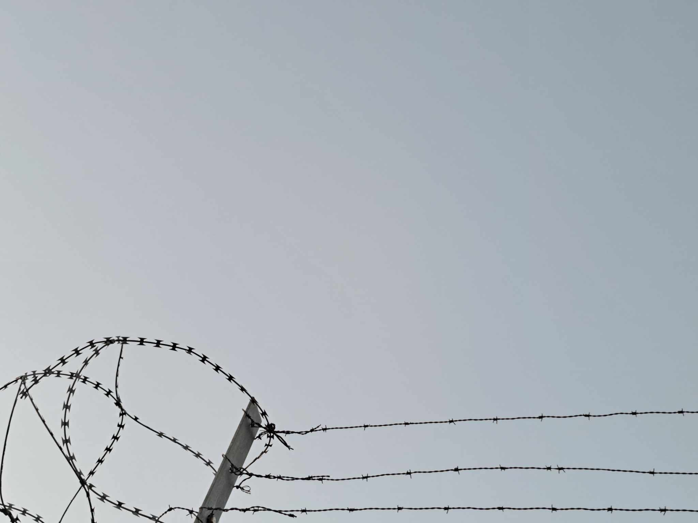

### AYS News Digest 11/9/23: Misinformation and lack of transparency empower right-wing politicians’ ignorance in Croatia

#### FEATURE

Croatia has seen some changes in the past days, but some things remain the same. One of them is the ignorance by the right-wing parties running the media stories leaning towards hate, securitisation and in some cases call for (military) defence.

[Policija upala na konferenciju za medije zagrebačkog političara](https://www.zagreb.info/aktualno/zg-politika/foto-tema-migranti-policija-upala-na-konferenciju-za-medije-zagrebackog-politicara/546457/?fbclid=IwAR2pWc9F4dBOHsYDUZQwOT6ZAnLKyRrY07LDUepBNoa26k8DXrAUNGia238)

A member of the political group MOST of Croatia organised his press conference in front of the reception centre for asylum seekers in Zagreb. This followed the news recently published about the number of people on the move passing through Croatia and being apprehended in the region of Kordun and Gorski Kotar, as well as the misinformation circling on social media about supposed attacks by the people on the move. Police intervened in his press conference due to the fact they were filming and gathering in front of the centre run by the Ministry of Interior, but they could have (and should have) done more due to the amount of misinformation and hate expressed by the Zagreb MP Mr Troskot.

Another politician with no prior serious and responsible engagement in the topic of refugees, migration and issues people on the move are facing, comes from the same political group and has in recent days been collecting interest and support with [videos](https://www.youtube.com/watch?v=rsgkJs5Ir8Y&ab_channel=Mileti%C4%87Marin) and other public statements on the issue, based on third party claims and no thorough investigation or reporting. As experienced before, the public in Croatia sadly relies on what is reported in the media and advocated by the political representatives from the spectrum they support. This is not a benign situation and calls for agile and responsible reporting that would counter the defamation and misinformation put out in the public.

At the same time, the conditions within the Reception centre Porin have been documented as seriously deteriorated, crammed, dirty and unfit for the reception of people.

[10 09 2023 disaster in asylum center in Zagreb, Croatia](https://www.youtube.com/watch?v=eq_d2UtXtuw)

Some more severe descriptions arrived to us from people who have been stopped and detained in the area around Slunj, a town close to which the new transit / detention centre is to be running for the coming period. This is in spite of the lack of approval of the locals and experience with previous transit centres in Croatia. In a few cases people seem to be describing the same spaces that have no beds or other proper furniture and amenities needed for the stay of people inside.

The issue of Dublin returns remains, particularly from some countries and the lack of transparent reporting and documentation and returns to third countries following (often chain) pushbacks.
#### MOROCCO
### Horrifying numbers of deaths and injuries following the earthquake

[Almost 3000 individuals have died.](https://www.aljazeera.com/news/2023/9/11/rural-residents-in-morocco-grapple-with-the-earthquakes-deadly-aftermath) Rubble is blocking roads, preventing essential aid being delivered to isolated areas. The areas most affected are rural areas, as well as the mountainous areas around Marrakesh. Aid has been very slow — some of the most isolated areas are yet to be reached.

■■■■■■■■■■■■■■ 
> **[Al Jazeera English](https://twitter.com/AJEnglish) @ Twitter Says:** 

> > Al Jazeera’s @[hashemahel](https://twitter.com/hashemahel) says queues several kilometres long have built up as aid and emergency vehicles try to access villages near the epicentre of Morocco’s earthquake in the Atlas Mountains. 

Here’s why ⤵️ https://t.co/4jsILQ1Cnr 

> **Tweeted at [2023-09-11 19:02:57](https://twitter.com/AJEnglish/status/1701310377319923784?s=20).** 

■■■■■■■■■■■■■■ 

A trusted contact of AYS is collecting funds for an association from Morocco active in the relief aid. If you can and wish to find out more and possibly direct your financial help towards them, let us know.
#### LIBYA
### Heavy flooding in Eastern Libya killing around 5000 people

Thousands of individuals are considered missing in addition to the exceptionally high death toll. The city of Derna has been severely affected, with collapsed buildings, no electricity, and whole neighbourhoods inundated.
### Libya to install surveillance cameras along border with Tunisia

Surveillance cameras along with border forces will be present 24/7 along the border. This is as a response to the increase in numbers of individuals travelling to Tunisia in order to reach Europe, where many end up at the border with Libya in their attempt.

> “Libya is a country of transit, not of destination of migrants, and we are not satisfied with the impact this issue is having on our country, as well as on countries of destination,” — Libyan Interior Minister-designate, Imad Trabelsi 

[Libya to install surveillance system along border with Tunisia — InfoMigrants](https://www.infomigrants.net/en/post/51716/libya-to-install-surveillance-system-along-border-with-tunisia?fbclid=IwAR0IpNZ2uOZTgvHGbB0z6ZK6QD8WYhcgN5W8T3qQFP6BWecZI3lxrsM1YQ4)
### Update on a previous report

Previously, AYS reported on video footage that showed a dead woman lying on the floor of a detention centre in Libya. It has now been reported that all the women shown in this video have now been released.

■■■■■■■■■■■■■■ 
> **[Refugees In Libya](https://twitter.com/RefugeesinLibya) @ Twitter Says:** 

> > We are relieved to share with you good news that the women who were detained at this prison are now released. 
Thanks to all those who got involved in the call for their freedom. 

We ask the same to be done with #Ainzara, #TarikSekka and so on https://t.co/su19cQWTX6 

> **Tweeted at [2023-09-10 10:25:27](https://twitter.com/RefugeesinLibya/status/1700817755782402134?s=20).** 

■■■■■■■■■■■■■■ 

#### SEARCH AND RESCUE AT SEA
### 40 people considered missing after a shipwreck on their route from Sfax, Tunisia

■■■■■■■■■■■■■■ 
> **[RESQSHIP](https://twitter.com/resqship_int) @ Twitter Says:** 

> > ⚫️ (1/2) 40 people missing! When our crew found the boat in distress yesterday, the people instantly reported a #shipwreck, they had witnessed hours ago. On their way from #Sfax, the survivors on the Nadir had passed a capsized boat. People were in the water, screaming for help. https://t.co/MM39Ji9ENl 

> **Tweeted at [2023-09-11 12:56:00](https://twitter.com/resqship_int/status/1701218030062084418?s=20).** 

■■■■■■■■■■■■■■ 

#### GREECE
### Koutsochero refugee camp evacuated to house flood victims

Around [900 refugees are being transferred to other camps](https://alterthess.gr/ekkenonoyn-kamp-poy-diamenoyn-prosfyges-gia-na-meinoyn-oi-plimmyropatheis/) in order to create space and housing for Greek citizens affected by the recent flooding.

The Antiracist Initiative of Larissa argues there are alternative forms of support for these citizens, such as, hotels, rent subsidy, and empty houses instead of moving refugees into even more overcrowded, substandard accommodation.

■■■■■■■■■■■■■■ 
> **[Eleni Konstantopoulo](https://twitter.com/EleniKonstanto) @ Twitter Says:** 

> > #Greece is evacuating the Koutsochero Refugee camp were approx 900 #refugeesgr are living &amp; transferring them to other camps, so that they could house people from the flood stricken area.
Displacing one population to house another displaced population!
 [alterthess.gr/ekkenonoyn-kam…](https://alterthess.gr/ekkenonoyn-kamp-poy-diamenoyn-prosfyges-gia-na-meinoyn-oi-plimmyropatheis/) 

> **Tweeted at [2023-09-11 12:56:34](https://twitter.com/EleniKonstanto/status/1701218172886499592?s=20).** 

■■■■■■■■■■■■■■ 

#### MALTA

[Amara’s brother just graduated university, saying “Unfortunately, \[poverty\] pushed my siblings to drop out of school and face the harsh… | Instagram](https://www.instagram.com/reel/CxA6F_fMSUZ/?fbclid=IwAR2eIvz-3i1L_X3h3kYAvYvenSlQ6NQcKfh3SV4lR5qXm62rGqE9LuBYAhY)
#### FRANCE
### Drone surveillance cameras to prevent Channel crossings

In Northern France, up to 76 cameras will be used to monitor the coast and people attempting to travel to the UK. Drones, helicopters, and a plane will be used to capture footage.

[Channel crossings: surveillance of the northern coast of the France will be reinforced by drones (francetvinfo.fr)](https://www.francetvinfo.fr/monde/europe/migrants/traversees-de-la-manche-la-surveillance-du-littoral-nord-de-la-france-va-etre-renforcee-par-des-drones_6052703.html)
#### POLAND
### Hunger strike at detention centre

The Przemysl detention centre has the worst reputation out of all closed camps in Poland. There have been a multitude of reports of violence, including beatings.

The protesters are calling for basic human rights and needs, such as; stopping physical violence in the centre; providing adequate medical care, hygiene products, and food; treating detainees with respect; stopping deportations to countries experiencing war and civil unrest.

You can find more information here: [Hunger strike at detention centre in Przemyśl — No Borders Team (noblogs.org)](https://nobordersteam.noblogs.org/2023/09/hunger-strike-at-detention-center-in-przemysl/?fbclid=IwAR0IpNZ2uOZTgvHGbB0z6ZK6QD8WYhcgN5W8T3qQFP6BWecZI3lxrsM1YQ4)

■■■■■■■■■■■■■■ 
> **[Twitter User](https://twitter.com/Seebruecke_intl/status/1701217450765811774?s=20) @ Twitter Says:** 

> >  

> **Tweeted at .** 

■■■■■■■■■■■■■■ 

#### UK
### Letter from people who have been moved to the Bibby Stockholm barge

The group of 39 individuals relocated to the Bibby Stockholm have written a letter providing their perspective and experiences of moving to and staying on the barge. You can read the full letter here: [People on the Bibby Stockholm Speak Out — Refugee Council](https://www.refugeecouncil.org.uk/latest/news/people-on-the-bibby-stockholm-speak-out/?utm_campaign=2324OMQ2&utm_source=rctwitter&utm_medium=social)

> The appointed day arrived, and under the heavy media pressure, we were transferred to our place of exile by Home Office buses. A confined and floating space on the water with strict security regulations. None of us were criminals or had committed any wrongdoings, and we had no access to the city and normal life. Small rooms and a terrifying residence. 

> When we entered the ship, it felt as if we were entering a world full of new anxieties and fears. Fear of facing the questions of journalists prevented us from leaving the ship, and no one knew what awaited us in terms of our physical and mental health. 

> During the few days of staying on the ship, we experienced very difficult conditions. 

#### WORTH READING:
- [Afghan women’s resistance increases in face of Taliban restrictions and suppression — Rukhshana Media](https://rukhshana.com/en/afghan-womens-resistance-increases-in-face-of-taliban-restrictions-and-suppression?fbclid=IwAR0S7vFIgUi0pDiKHP2W5vaqt3ZZgLQyHZ-VfHWZuxFUZwzE076LkpsJ7nE)

> **_Find daily updates and special reports on our [Medium page](https://medium.com/are-you-syrious) ._** 

> **_If you wish to contribute, either by writing a report or a story, or by joining the AYS Info team, please let us know!_** 

**We strive to echo correct news from the ground through collaboration and fairness. Every effort has been made to credit organisations and individuals with regard to the supply of information, video, and photo material (in cases where the source wanted to be accredited). Please notify us regarding corrections.**

**If there’s anything you want to share or comment, contact us through Facebook, Twitter or write to: areyousyrious@gmail.com**

_[Post](https://medium.com/are-you-syrious/ays-news-digest-11-9-23-misinformation-and-lack-of-transparency-spark-empower-righ-wing-942638d775dd) converted from Medium by [ZMediumToMarkdown](https://github.com/ZhgChgLi/ZMediumToMarkdown)._
