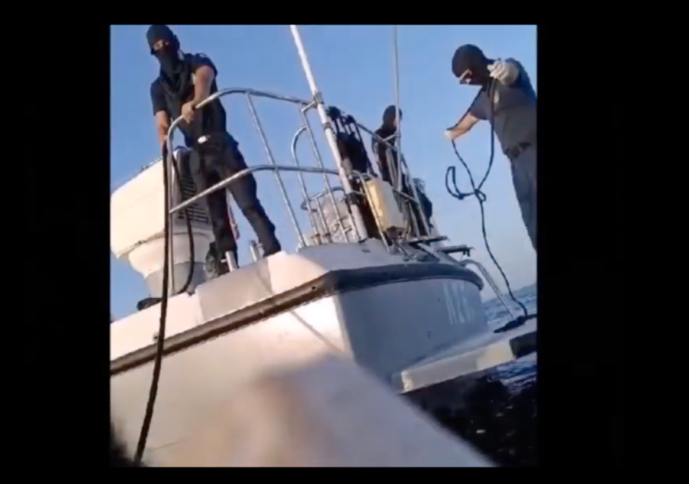

### AYS News Digest 17/10/23: Endless news of pushbacks and death in the Aegean
#### New fence to stop migrants climbing aboard lorries in Belgium // Violent eviction of large migrant site near Calais // Iuventa crew on trial in Trapani // Canary Isles registers record number of new arrivals

A freeze-frame of an illegal pushback conducted by the Greek coastguard, recorded in the Aegean in September. Still from a video shared by Aegean Boat Report
#### FEATURE — Illegal pushbacks continue and more lives are lost in the Aegean

The bodies of three people have been recovered following [the sinking of a migrant boat](https://x.com/InfoMigrants/status/1713868386881634348?s=20) off the coast of the Greek island of Symi. So far it seems that one woman and seven men were saved. The search continues.

[Aegean Boat Report](https://aegeanboatreport.com) has published a [disturbing video](https://x.com/ABoatReport/status/1713849561830015393?s=20) showing a pushback carried out by masked Greek coastguards on 24th September. Having approached the rubber dinghy, they removed the petrol tanks, leaving the boat with no fuel. They then left the boat to drift back to Turkey. No one on the boat had life jackets. We hear one woman on the video cry out as the coastguard vessels abandons them: “We have children, pregnant women. They just took the fuel, took everything and left.”

[Another video](https://x.com/ABoatReport/status/1712475648747508223?s=20) shows a pushback taking place on 6th October to a group of 47 people from Afghanistan. This time the group were taken on board, taken back into Turkish waters and forced into two life rafts. In the distressing video you can hear children screaming and crying with fear. The Greek coastguard are committing crimes on a daily basis and have never been held to account. As Aegean Boat Report says:

> “It’s actually an incredible achievement, 2.600 registered pushback cases since March 2020 in the Aegean Sea, involving over 70.000 people, and Frontex, with all it’s technology and resources, have never seen or reported any illegal activities by Greek authorities, it’s just unbelievable.” 

These two groups of people survived the ordeal which completely violates the human rights of those on board. Many will try to make another journey, once again risking their lives to reach safety. Some might not make it. This does not seem to concern the masked crew of the coastguard vessel, nor Frontex, nor the Greek government nor any of the EU member states.
### BELGIUM

The Flemish Roads and Traffic Agency has started [constructing a 1.5km fence](https://www.vrt.be/vrtnws/en/2023/10/16/high-fence-to-prevent-migrants-reaching-trucks-to-hitch-a-ride-t/?fbclid=IwAR0GApnGxSr1Z2lBruez9M3ysck-JHZsewnQdbZPS4jZCEai0vn99wI2n7M) to prevent migrants from crossing the E40 motorway. Of course the erecting of another physical barrier is simply going to force people to take more risks. A fence is not going to stop them, would not a legal and safe means to migrate help a little more?
### FRANCE

[Violent evictions](https://twitter.com/Care4Calais/status/1712530185227006174?fbclid=IwAR2WMi6VPZNcTE_8pYdva4f2nH_6qthKPTIW6UG6sgQruAuvv7rw4mE7Hjc) continue in the Calais jungle. Last week vanloads of officers entered a large site at 5.45am with no warning. About 800 people on the move were forcibly moved from the camp in Calais to a reception and examination centre more than 150km away. Most were obliged to board buses under threat of arrest. Those who tried to escape were chased down and struck by batons before being handcuffed.

Those who were taken were not given a chance to retrieve their belongings as “cleaning agents” were deployed to seize or destroy everything that remained including phones, tents and clothing. The day afterwards, people started to make their way back to the site and that evening the police returned with tear gas in an attempt to force people away again.

In better news [Collective Aid](https://www.collectiveaidngo.org) ’s shower truck is back up and running to support people on the move in northern France with warm showers as the cold sets in.
### SEARCH and RESCUE (SAR)

There are still a few places available on [Mayday Academy’s](https://x.com/May_Day_Academy/status/1712878337729708203?s=20) Basic SAR operations training which will take place in January in Rügen. Those interested should apply to: marie@mayday-academy.org

[Borderline Europe](https://x.com/BorderlineEurop/status/1712857251197636649?s=20) have released statistics for September recording 19,251 people crossing the Central Med, with 1,237 people pulled back to Libya and Tunisia, 1089 people rescued by NGO vessels and 66 people dead or missing. The complete report (in German only) is available [here](https://www.borderline-europe.de/sites/default/files/projekte_files/CMI%20September.pdf) .

Iuventa crew testified in court in Trapani on 13th October. Later they released this video, describing the experience:

[https://x.com/IuventaCrew/status/1713216791885869506?s=20](https://x.com/IuventaCrew/status/1713216791885869506?s=20)

On the same day the civil rescue ship Sea-eye 4 set sail from Burriana and on 14th October Mare Jonio has set sail from Trapani for its 14th mission.

[Three rescues](https://x.com/soshumanity_en/status/1713945723547341280?s=20) within 18 hours were carried out in the Central Med area. Two boats, carrying 31 people, were rescued by Humanity1 after those on board the vessels contacted AlarmPhone. Following this another boat of 28 people, described as unseaworthy, overcrowded and at risk of capsizing by SOS Humanity, was attended to. Authorities assigned Bari as the disembarkation place. Survivors reported that they left Libya three days previously with no life-saving equipment on board.
### CANARY ISLANDS

A huge increase of arrivals into the Canary Islands has been linked partially to political unrest in Senegal. [Infomigrants](https://x.com/InfoMigrants/status/1713210300621803664?s=20) says that, “Economic hardship and an ongoing political crisis make life difficult in the coutnry, pushing people to try to cross the Atlantic in small boats.” In September there were 6000 new arrivals and in the first two weeks of October there have already been 8561 arrivals. One particular island, El Hierro, appears to be used because its more western location means that the journey avoids the coasts of Mauritania and Morocco and their respective maritime security apparatus.
### SPAIN

[Alicante Maritime Rescue](https://x.com/Heroesdelmar/status/1713876034326499393?s=20) has rescued a boat containing seven men from Algeria. They had been adrift for 12 days.
### WORTH READING

[How the EU Criminalizes Solidarity with Migrants w/ Border Violence Monitoring Network](https://thefirethesetimes.com/2023/10/06/how-the-eu-criminalizes-solidarity-with-migrants-w-border-violence-monitoring-network/) on the latest ‘The Fire These Times’ podcast.

Despite a record turn-out and encouraging initial results it must be said that the recent Polish elections have been marked by increasing anti-migrant rhetoric, particularly from the largest party Prawo i Sprawiedliwość. Read about it [here](https://www.infomigrants.net/en/post/52536/poland-as-elections-near-antimigrant-rhetoric-increases?fbclid=IwAR2rGRYhNoMvKJt8QwrzKAyyKyW36UgVFXv-d2MX0Yc4MZit2H-kThieJvo) .

> **_Find regular updates and special reports on our [Medium page](https://medium.com/are-you-syrious) ._** 

> **_If you wish to contribute, either by writing a report or a story, or by joining the AYS Info team, please let us know!_** 

**We strive to echo correct news from the ground through collaboration and fairness. Every effort has been made to credit organisations and individuals with regard to the supply of information, video, and photo material (in cases where the source wanted to be accredited). Please notify us regarding corrections.**

**If there’s anything you want to share or comment, contact us through Facebook, Twitter or write to: areyousyrious@gmail.com**

_[Post](https://medium.com/are-you-syrious/ays-news-digest-17-10-2023-endless-news-of-pushbacks-and-death-in-the-aegean-dc7d0b2461f9) converted from Medium by [ZMediumToMarkdown](https://github.com/ZhgChgLi/ZMediumToMarkdown)._
