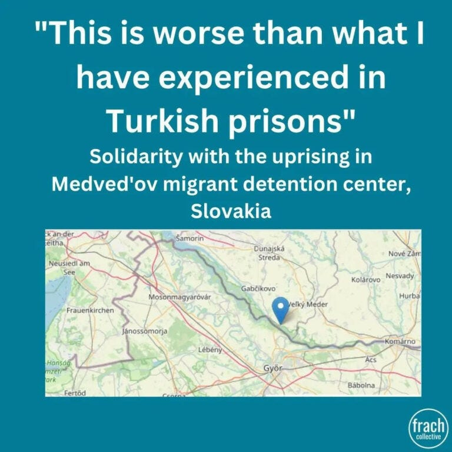
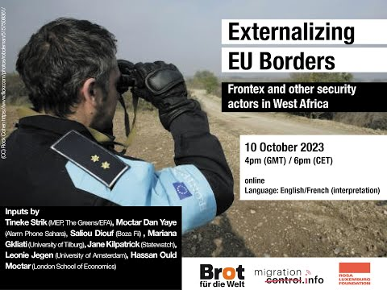

### AYS News Digest 23/10/23: Hunger strike at Medved’ov detention center in Slovakia

Fifth day of hunger strike in a detention center in Slovakia but there is no response from the authorities yet // A new plan to cut social benefits for non-EU citizens in Sweden // Undocumented workers obtained their regularisation following a strike in France // And more

](assets/cd603c73b067/1*SfBw8XCOd9qoiGF7wX4COQ.jpeg)

People on the move are imprisoned in detention centers in Slovakia without any information. Credit to [Frach Collective](https://www.instagram.com/frachcollective/?img_index=3)
#### SLOVAKIA
### Hunger strike at Medved’ov detention center

[On 19th of October 45 people detained in Medved’ov closed center started a hunger strike](https://abolishfrontex.org/blog/2023/10/20/solidarity-with-uprising-in-medvedov-migrant-detention-center-slovakia/?fbclid=IwAR3iZ_Pv4Bu7-RAWHqVoBJvOEXYBEqFjfynnJXQAYVJG6rypduX54VQthJg) protesting against their detention and the lack of information about the reasons and their will. It was explained by a person from Kurdistan:

> “We are not informed on the legal basis of our detention, nor our future. We cannot contact anyone. The only way get attention for this situation is through hunger strike. We demand release to open camps.” 

Credit to Franch Collective

According to [Frach Collective](https://www.instagram.com/p/CyuqKpZsl86/?img_index=1) there has been no information shared by the camp director and Slovak goverment, [as they wrote in a post](https://www.instagram.com/frachcollective/?img_index=3) :

> NO reaction from the camp director. 

> NO information provided by the Slovak government, or international bodies regarding the situation of people detained at Medved’ov. 

> NO freedom for the people held in Medved’ov 

People detained inside the camp demand to be released in order to speak to the Public Defender of Rights in Slovakia. Moreover they called for an investigation of conditions in closed detention centers for migrant people in Slovakia.

Find more updates about the topic following Frach collective.
#### FRANCE
### “No papers, no Olympic Games”

[Undocumented workers obtained their regularisation thanks to the strike they started on Tuesday 17th October](https://www.infomigrants.net/en/post/52720/no-papers-no-olympic-games-hundreds-of-unregistered-migrant-workers-protest-for-regularization?fbclid=IwAR371aQAUtpHesxrfv_mKvwzCh8De5bnPCTNT-q3hp-hr725a9DtQhb5zeE) in the area known as Ile-de-France in Paris. Most of them are working on the construction for the Olympic Games.

■■■■■■■■■■■■■■ 
> **[Platform for Undocumented Migrants (PICUM)](https://twitter.com/picum_ngo) @ Twitter Says:** 

> > 🎉 Victory! After hours of negotiations between trade unions and employers, the undocumented workers who went on strike all over Paris finally obtained their regularisation!

Via @[TV5MONDE](https://twitter.com/TV5MONDE) [information.tv5monde.com/societe/france…](https://information.tv5monde.com/societe/france-des-centaines-de-travailleurs-sans-papiers-obtiennent-leur-regularisation-apres-un) 

> **Tweeted at [2023-10-23 07:45:50](https://twitter.com/picum_ngo/status/1716360266735092066?s=20).** 

■■■■■■■■■■■■■■ 

#### SPAIN
### New arrivals on Canary Islands

[About 1,500 people reached Spain’s Canary Islands over the weekend](https://www.rfi.fr/en/international/20231023-hundreds-of-migrants-land-on-spain-s-canary-islands-in-one-weekend?fbclid=IwAR2PEM9mPwtElN0qEf9GueHxqupa2C0UykFAVTiN_1lRliK3idcZR-_i1RI) , leaving from sub-Saharan Africa. The Canaries have become an alternative destination in order to arrive to Europe from Morocco and Western Sahara: since the EU keeps tightening controls around the Mediterranean Sea other routes are considered as possibilities.

However none of these alternative routes are safe either. [Infact at least 1,000 people have died this year along their jouney toward Canary Islands](https://www.infomigrants.net/en/post/52726/spain-over-1300-african-migrants-reach-canary-islands?fbclid=IwAR0txj5YlvyrJlpQTnYlGQWLCGEQS4lDLpi-7FozMv1mg69X_DPMo8O-AM4) , according to the NGO Walking Borders.
#### UK
### Just Stop Oil attempted to block the lorry transporting asylum seekers back to the Bibby Stockholm barge

■■■■■■■■■■■■■■ 
> **[Just Stop Oil](https://twitter.com/JustStop_Oil) @ Twitter Says:** 

> > 🚍 INTENT TO KILL

🦺 We are saddened to report that we were unable to halt transportation of refugees to the prison — the driver rammed through the block, risking killing those in front.

🙋‍♀️ We needed more people. We can't do this alone. Join the call: [tinyurl.com/noprisonships](http://tinyurl.com/noprisonships) https://t.co/ZRL4gknaqR 

> **Tweeted at [2023-10-19 13:15:37](https://twitter.com/JustStop_Oil/status/1714993705256353944?fbclid=IwAR3m3Rz2__n-3v6NJkqTX7_BbSGXRkv5-HX1KDdEpt_3QWjXg4aufWOt1Bg).** 

■■■■■■■■■■■■■■ 

#### SWEDEN
### The Swedish government plans to cut social benefits for non-EU citizens

Sweden’s coalition government is set to introduce reforms requiring non EU citizens to learn Swedish to compete for jobs. These proposed changes are part of a broader plan consistent with the coalition’s policy: they have brought the idea of discouraging people who come to Sweden ‘illegally’ by making life in the country increasingly difficult. Indeed the government proposed reform plans to cut benefits for people coming from outside the EU including support for children, housing, unemployment, sickness and parental.

Swedish center-right Prime Minister Ulf Kristersson came to power a year ago with the support of the anti-immigration and populist Sweden Democrats, led by Jimmie Akesson. [Read more here](https://www.infomigrants.net/en/post/52750/sweden-to-make-it-harder-for-noneuropean-migrants-to-claim-benefits?fbclid=IwAR2STKuAiXt8ewJc1rwKWLGpsptRGHCHbJdMErhHNNMZW24eUXB2w_exPQQ)
#### WORTH READING
- EU interior ministers have established a new timeline for the plan to make all justice and home affairs databases “interoperable” by 2027. Read it here:

- A panel on the expansion of EU border control to West Africa.

- Interview with the activist of WatchTheMed Alarm Phone (AP):

[Alarm Phone](https://twitter.com/alarm_phone/status/1715387584585617717?fbclid=IwAR18-vOAsywfgMY4j1Uf76NLHreBnp3qFmda2Son3douX0jTfmMTT7W7qbc) also called for support to mantain its activities

■■■■■■■■■■■■■■ 
> **[@alarmphone](https://twitter.com/alarm_phone) @ Twitter Says:** 

> > Donation call!
To stay in touch with people in distress at sea, satellite phones are essential. Life-saving calls cost up to 8€/min. On busy days our phone bill reaches 500€. Please donate so that we can continue to support people at risk of drowning: [betterplace.org/en/projects/12…](https://www.betterplace.org/en/projects/127506-alarm-phone-sea-rescue-organisation-needs-donations-for-rising-phone-costs) https://t.co/qO2QompXok 

> **Tweeted at [2023-10-11 09:02:56](https://twitter.com/alarm_phone/status/1712031012685799918?fbclid=IwAR3iZ_Pv4Bu7-RAWHqVoBJvOEXYBEqFjfynnJXQAYVJG6rypduX54VQthJg).** 

■■■■■■■■■■■■■■ 

> **_Find regular updates and special reports on our [Medium page](https://medium.com/are-you-syrious) ._** 

> **_If you wish to contribute, either by writing a report or a story, or by joining the AYS Info team, please let us know!_** 

**We strive to echo correct news from the ground through collaboration and fairness. Every effort has been made to credit organisations and individuals with regard to the supply of information, video, and photo material (in cases where the source wanted to be accredited). Please notify us regarding corrections.**

**If there’s anything you want to share or comment, contact us through Facebook, Twitter or write to: areyousyrious@gmail.com**

_[Post](https://medium.com/are-you-syrious/ays-news-digest-23-10-23-hunger-strike-at-medvedov-detention-center-in-slovakia-cd603c73b067) converted from Medium by [ZMediumToMarkdown](https://github.com/ZhgChgLi/ZMediumToMarkdown)._
