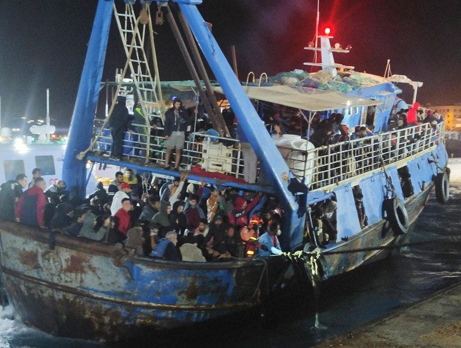

### AYS News Digest 22/11/23: The Central Mediterranean — deadliest year since 2017

Eviction in Sombor camp, Serbia / Croatia implements temporary border checks / Another recorded pushback of 23 Afghans by the Greek Coast Guard / Over 1000 individuals arrive in Lampedusa in one day / The effects of being given seven days to leave Home Office accommodation in the UK / and much more…

](assets/3ed98ecfd4fa/0*di7lD2VUM4GW3urx)

Source: [https://x.com/BorderlineEurop/status/1727250957690634680?s=20](https://x.com/BorderlineEurop/status/1727250957690634680?s=20)
### The Central Mediterranean — 2023 reported as the deadliest year in the past few years

Almost 2,200 individuals have gone missing or have been reported dead in in the Central Mediterranean so far this year.

The recent MSF report highlights the fact the numbers of people arriving in Italy, across the Mediterranean, have doubled compared to last year. Tunisia has also overtaken Libya as the main departure point for asylum seekers.

In addition, MSF criticises the continued development of discriminatory migration policies that prioritise security over the lives of asylum seekers. The report includes; the new agreement with Tunisia, Italy’s criminalisation of NGO rescue vessels, the failure of EU states in responding and assisting boats in distress

■■■■■■■■■■■■■■ 
> **[Sally Hayden](https://twitter.com/sallyhayd) @ Twitter Says:** 

> > New MSF press release: "With almost 2,200 children, women, &amp; men reported missing or dead in the Central Mediterranean this year, 2023 has already earned the unenviable record of being the deadliest year on this migration route since 2017." https://t.co/PhPEf6bjWO 

> **Tweeted at [2023-11-22 08:34:54](https://twitter.com/sallyhayd/status/1727244247995388216?s=20).** 

■■■■■■■■■■■■■■ 

■■■■■■■■■■■■■■ 
> **[MSF Sea](https://twitter.com/MSF_Sea) @ Twitter Says:** 

> > 2023 has earned the record of the deadliest year in the Central Med. since 2017.

In its new report, #MSF denounces the violent border practices &amp; deliberate inaction of #EU states that have led to more death.

This needs to stop now!

Read the full report [bit.ly/3Rd63Co](https://bit.ly/3Rd63Co) https://t.co/29tbINSRQW 

> **Tweeted at [2023-11-22 08:00:01](https://twitter.com/MSF_Sea/status/1727235470260629893?s=20).** 

■■■■■■■■■■■■■■ 

#### THE BALKAN ROUTE
### BVMN is hiring!

■■■■■■■■■■■■■■ 
> **[Border Violence Monitoring Network](https://twitter.com/Border_Violence) @ Twitter Says:** 

> > ‼️ WE ARE HIRING ‼️

BVMN is looking for a new Field Coordinator for the Western Balkans
📎[borderviolence.eu/get-involved/w…](https://borderviolence.eu/get-involved/work-with-us/)

This is an exciting opportunity to work in a horizontal network of 13 members. We especially encourage people from the region to apply. https://t.co/muMvGtrbwO 

> **Tweeted at [2023-11-21 08:47:52](https://twitter.com/Border_Violence/status/1726885124254699876?s=20).** 

■■■■■■■■■■■■■■ 

### Eviction in Sombor camp, Serbia

Individuals who were previously residing in Sombor camp have been moved to the Croatian border after an eviction.

■■■■■■■■■■■■■■ 
> **[Collective Aid](https://twitter.com/collective_aid) @ Twitter Says:** 

> > This is a video from Sombor transit camp last week. Over the weekend, in Horgoš, in Subotica and now in Sombor, during a large police operation, they were all taken with at least 20 buses to camps in the South and on the Croatian border, in Adasevac and Šid. 

> **Tweeted at [2023-11-21 07:13:00](https://twitter.com/collective_aid/status/1726861250087293325?s=20).** 

■■■■■■■■■■■■■■ 

#### CROATIA
### Croatia implements temporary border checks

Due to the increase in migrants crossing the border, Croatia has increased its border control and is planning to open up a camp for registration and processing of incoming migrants.

[Croatia tightens border checks as Balkan migration route gets busier — InfoMigrants](https://www.infomigrants.net/en/post/53335/croatia-tightens-border-checks-as-balkan-migration-route-gets-busier?fbclid=IwAR3FW7cHXvIQvovTa2_13vo3qWxjwEXjj6tRlnM0loiYc8lBvCjXcju9vxI)
#### GREECE
### Another recorded pushback of 23 Afghans by the Greek Coast Guard

■■■■■■■■■■■■■■ 
> **[Eleni Konstantopoulo](https://twitter.com/EleniKonstanto) @ Twitter Says:** 

> > "Forced repatriation of 23 Afghans by the 🇬🇷 Coast Guard." 
This is another of many violent 🎥recorded refoulement incidents in the Aegean sea, where #Refugees are denied the right to an #Asylum claim.

✍️ Dimitris Angelidis 👇 [efsyn.gr/ellada/koinoni…](https://www.efsyn.gr/ellada/koinonia/412172_biaii-epanaproothisi-23-afganon-apo-limeniko) 

> **Tweeted at [2023-11-21 04:08:20](https://twitter.com/EleniKonstanto/status/1726814776817545340?s=20).** 

■■■■■■■■■■■■■■ 

### And another pushback by the Greek Coast Guard near Lesvos…

■■■■■■■■■■■■■■ 
> **[@alarmphone](https://twitter.com/alarm_phone) @ Twitter Says:** 

> > 🆘 from a group who has been pushed back by @[[HCoastGuard](https://twitter.com/HCoastGuard)](https://twitter.com/[HCoastGuard](https://twitter.com/HCoastGuard)). We are in contact with a group of 50 people near #Lesvos. They reported to have been pushed back by @[[HCoastGuard](https://twitter.com/HCoastGuard)](https://twitter.com/[HCoastGuard](https://twitter.com/HCoastGuard)) who threw the boat's motor into the water. The people are left adrift at sea &amp; need immediate assistance! https://t.co/vTfgkvYHuh 

> **Tweeted at [2023-11-22 08:01:15](https://twitter.com/alarm_phone/status/1727235781545128154?s=20).** 

■■■■■■■■■■■■■■ 

#### ITALY
### Over 1000 individuals arrive in Lampedusa in one day

On Monday, there were a total of 12 landings. Hundreds of individuals have been reported missing and a two-year-old girl died following a shipwreck.

[Italy: Two-year-old girl dies as Coast Guard rescues hundreds of migrants — InfoMigrants](https://www.infomigrants.net/en/post/53370/italy-twoyearold-girl-dies-as-coastguard-rescues-hundreds-of-migrants?fbclid=IwAR0GhQNoVfSt4BrcmwkJ6aRIiHOvdPHN4eUfHAF47YZLgTxapC-cn7gJr6I)

[Over 1,000 reached Lampedusa in just one day — InfoMigrants](https://www.infomigrants.net/en/post/53382/over-1000-reached-lampedusa-in-just-one-day?fbclid=IwAR2wSkSEYgC5yCOKj5MMHYQ_STgHSumZRDfQ2p7urCGog4YMAGQR8NVPKKk)

#### GERMANY
### Demonstration in Berlin!
