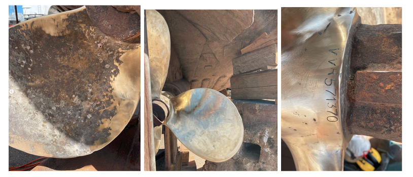
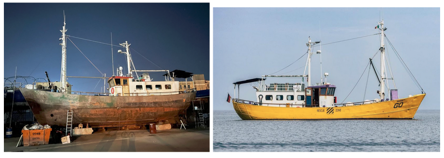

### AYS Special: A new Search and Rescue NGO’s First Season in the Central Mediterranean
#### Annual Report 2023 by MARE\*GO, LEAVE NO ONE BEHIND and GREEN Licata, Italy 10.12.2023

Ships Mare\*Go, with RIBs LNOB and GREEN

_At Are You Syrious, the team regularly report on the activities of the Civil Fleet in the Central Mediterranean, but rarely get a chance to shine a light on the totality of starting up and running a complex operation. The German NGO Zusammenland took this step at the start of 2023, and what follows is their first annual report with additional context collated by Are You Syrious volunteer Jan Ziolo._

> Note: It is traditional to refer to boats as ‘she’, which stems from nautical history and this tradition has been upheld in this article. 

The MARE-GO in a previous life as the SEA WATCH 1.

[‘MARE\*GO’](https://en.wikipedia.org/wiki/Mare_Liberum_(ship)) is the primary rescue ship of organisation [Zusammenland](http://zusammenland.de) . She was the original SEA WATCH 1, operating off the Greek island of Lesvos on the Aegean route, before becoming the MARE LIBERUM. With the clampdown on civil actors on Lesvos under the cover of the COVID-19 pandemic, the MARE LIBERUM had to be left alongside in harbour for several years. When approached by [Zusammenland](https://zusammenland.de) to buy her, Mare Liberum (the NGO) sold her for precisely 1 Euro. The first task to get her rotation-ready was a two week maintenance period to make good some of the harm done by several years of being stuck in harbour, and to prepare her for a repositioning voyage to a shipyard in Malta where she could get a comprehensive refit.
#### **Preparation and Crossing to Malta**

The newly named MARE\*GO came out of the water and into dry dock in February 2023 for a three month refit. Being a steel-hulled vessel, a lot of this work was the noisy and dirty process of rust removal followed by priming and painting. This was done by a dedicated team of 30 civil society activist volunteers, and this kind of project, although not as visible as seagoing assistance to people in distress, is absolutely critical to the Civil Fleet.

As the MARE LIBERUM

Search And Rescue (SAR) vessels need to be visible, and Zusammenland retained the original white for the superstructure, which is always sensible for operating in hot conditions to keep the crew cool. They also went for bright yellow for the hull, and what can only described as ‘Lilac’ for the deck fixtures, fittings and markings! For the record, the ‘RESCUE ZONE’ and hatched marks are in full compliance with maritime regulations for size and visibility.

To be permitted to go to sea, the MARE-GO needed to be inspected by a surveyor to ensure her seaworthiness. This was an initial ‘out of water’ survey in the dry dock, and it was successful — good going indeed for a vessel that is over 100 years old and a volunteer refit crew. Inevitably, there were further actions to be completed, but the list was both manageable and achievable. Immediately after the MARE\*GO was refloated, a successful stability test was done. The civil engineer surveyor estimated the stability of the MARE\*GO at 117 people plus crew.

Pitting on the propellor of the MARE-GO before and after being ground and polished out
#### **Rigid Inflatable Boats (RIBs) - LEAVE NO ONE BEHIND and GREEN**

Before and after the 2023 yard time

At the same time, Zusammenland bought what is at present their largest RIB which measures 9.4 metres. This was possible with funding from [Civilfleet Support e.V.](https://civilfleet.org) and the RIB was named LEAVE NO ONE BEHIND (LNOB). This RIB is a stable, powerful and fast vessel driven by a powerful 300 horsepower diesel engine, with a large deck space for survivors and equipment. The RIB can be deployed to speed ahead of MARE\*GO as required.

Another practical step in setting up a new organisation is to fulfil official requirements. As a company registered in Germany, Mare Go gUG was set up in April 2023 as an official organisation to own the vessels and equipment. After setting up the organisation, the transport of the smaller RIB known as GREEN from Brandenburg to Malta was arranged and carried out, again with the help of dedicated supporters. Another contract of use for GREEN (which is 5.2 metres, and a valuable addition to the inventory) was drawn up and signed, and she was taken on board the MARE\*GO. This completed Zusammenland’s operational inventory. During transit to and from the SAR Zone, MARE\*GO would tow LNOB astern, bringing her alongside to transfer RIB crew and launch her. GREEN would be stowed on MARE\*GO’s foredeck, with additional rescue kit such as liferafts, all of which could be launched using MARE\*GO’s deck crane. GREEN was still in private hands at this time, and was generously made available to Zusammenland on permanent loan.
#### **Operations of the MARE\*GO**

During the course of 2023, the situation in the Central Mediterranean changed dramatically. The Italian government passed a new decree with a variety of restrictions on how civil rescue vessels are permitted to operate. More details can be found in [this News Digest](ays-news-digest-15-3-2023-italy-sar-decree-becomes-law-18e6a0e3928) . Additionally, Tunisia was the location of a variety of problems, causing a rush on people trying to leave the country. People from southern [African nations became stranded](https://www.thenewhumanitarian.org/news-feature/2023/07/13/fears-stranded-black-african-migrants-tensions-boil-over-tunisia) and faced hostility, with [people dying as a result.](ays-news-digest-24-07-23-another-deaths-at-the-tunisian-as-meloni-courts-saied-e4467f91dd25) You can read more on the [EU response to this here](ays-news-digest-24-07-23-another-deaths-at-the-tunisian-as-meloni-courts-saied-e4467f91dd25) . The opening of the Tunisian corridor led to high numbers of landings on the Italian island of Lampedusa. As a result, the decision was taken to postpone the final work on Mare\*Go, move to Licata in Sicily, and to make the necessary preparations for the maiden rotation with the first operational crew. At the end of May 2023, Zusammenland began developing Standard Operational Procedures based on possible operational scenarios and worst-case situations, and rehearsing them in harbour during crew trainings.
#### **1st Rotation: End of May to mid-June**

At the end of the first 2023 rotation, MARE\*GO was detained alongside in Lampedusa by the Italian authorities for 20 days with a fine of €3,333. The reason: MARE\*GO had assisted people in distress, and had then sailed to Lampedusa and not to Trapani, the assigned port from Rome Coast Guard, 30 hours away. The crew’s assessment of the condition of the people embarked was that they were already seasick, distressed and dehydrated on their boat, and therefore in a very critical state of health. As this would only get worse during a prolonged passage on what is still a fairly small vessel, the MARE\*GO crew could no longer ensure their physical and psychological integrity and human dignity, seeing it as their humanitarian duty to guarantee them safety on land without any further detours or delays at sea.
#### **Detention in June 2023**

The detention of ships from the Civil Fleet would later prove to be a situation that affected many Civil Fleet organisations. The fine of the MARE\*GO was, again, financed by Civilfleet Support e.V. After very fruitful discussions with the Sea Watch Legal Aid Team and other supporters, Zusammenland decided not to take legal action against the imposed fine. This decision was not made lightly, but the NGO aimed to stay focused on sustaining the rest of the 2023 programme.
#### **Further Rotations in 2023**

The second rotation followed directly after the end of the detention. Sea Watch e.V’s AURORA SAR was also detained alongside at this time. It was agreed by both NGOs that this team, stuck alongside in Lampedusa, would be invited to crew MARE\*GO’s second rotation instead. Between this, and also thanks to a private appeal for donations by the band Feine Sahne Fischfilet, which received a lot of media attention, Zusammenland had the budget to finance this and further rotations. UK NGO [SAR Relief](https://sarrelief.org/) was able to put Zusammenland in contact with the Choose Love Foundation, and a resulting donation ensured that RIB GREEN could be purchased from private ownership. Zusammenland and Choose Love are likely to work together on future projects. (A Special about Choose Love from two years ago [can be found here)](ays-special-choose-love-but-not-in-france-499d304df742) .

The third, fourth and fifth rotations, associated repairs and operational costs were largely financed by the [United4Rescue alliance](https://united4rescue.org/en/) . The original funding was purely for Rotation 3, but the MARE\*GO team were able to get Rotations 4 and 5 out of this money as well by keeping operational costs down, staying well ahead of preventative maintenance and operating carefully to avoid damage to equipment. Unfortunately, Rotation 6 had to be cancelled, but in turn this led to a joint rotation in the SAR zone on board the Sailing Yacht (SY) DAKINI, another vessel within the Civil Fleet, and her Skipper, Sampo Widmann.

The last rotation of the year went according to plan, but the worsening weather conditions meant that the crew had to sail back to Licata at the end without assisting people in distress. This is the reality of SAR operations, where sometimes just being on scene and ready to assist if needed is as busy as it gets.

Looking back on the maiden season of this new addition to the Civil Fleet, it may seem difficult to quantify the impact of these vessels and the activist volunteers crewing and supporting them. Once people on the move have been assisted and safely landed onshore, Zusammenland deliberately does not keep a track of the numbers of people assisted, because reducing a person to a number or statistic is one of the behaviours that the Civil Fleet exists to challenge. MARE\*GO is, at the time of writing, back alongside in Licata after a post-season dry docking to address all outstanding survey items needed to obtain the CE certificate. Zusammenland has also had to plan to replace MARE\*GO’s forward deck crane for the 2024 season. The RIB LEAVE NO ONE BEHIND proved herself as a powerful asset during the 2023 season, but, like all Civil Fleet RIBs, she is vulnerable to ‘iron boats’. These are a relatively new development, using welded mild steel plates and angle iron to build cheap, dangerous crafts that can sink easily, cause lacerating injuries to occupants and also cause puncture damage to inflatable RIB tubes and their more delicate fibreglass hulls and Zusammenland is therefore getting new tubes to be rescue-ready for 2024.

**_JOIN OUR TEAM — Reach out via Facebook, Instagram or by email at: areyousyrious@gmail.com_**

**Find daily updates and special reports on our [Medium page](https://medium.com/are-you-syrious) .**

**If you wish to contribute, either by writing a report or a story, or by joining the Info team, please let us know!**

**We strive to echo correct news from the ground through collaboration and fairness. Every effort has been made to credit organisations and individuals with regard to the supply of information, video, and photo material (in cases where the source wanted to be accredited). Please notify us regarding corrections.**

**If there’s anything you want to share or comment, contact us through Facebook, Twitter or write to: areyousyrious@gmail.com**

_[Post](https://medium.com/are-you-syrious/ays-special-a-new-search-and-rescue-ngos-first-season-in-the-central-mediterranean-926fd9e0cbf6) converted from Medium by [ZMediumToMarkdown](https://github.com/ZhgChgLi/ZMediumToMarkdown)._
