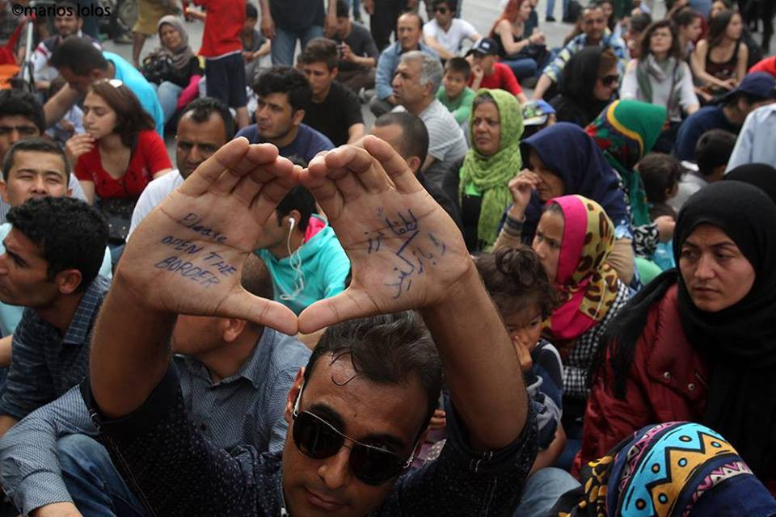

### AYS DAILY NEWS DIGEST 9\.4\.2016
#### Greeks and refugees unite in protest against EU\-Turkey deal, at least four women and one child dead in the Aegean\.

Photographer: Marios Lolos\. Photo taken at today’s protest in Athens\.
#### Turkey

**325 deported from Greek islands this week\.**

> 325 people mostly from Pakistan have been deported from Greek islands of Lesvos and Chios under an EU deal this week\. Today, they were calling for freedom from behind the barred windows inside a fenced reception and removal centre in the town of [‪\#‎Pehlivankoy‬](https://www.facebook.com/hashtag/pehlivankoy?source=feed_text&story_id=608730315942522) \. UNHCR says it has yet to gain access to the facility\. 

**6750 refugees in the islands are applying for asylum\.**

> Deportations from Greece to Turkey have been temporarily halted as most of the 6,750 refugees in the Greek islands are applying for asylum and there is a lack of qualified officials such as translators to process the applications\. Most of the experts promised by the EU have not yet arrived\. According to AP, Greece says it will take at least two weeks to fix the process of deporting migrants from the eastern Aegean islands to Turkey\. The country’s deputy foreign minister for European affairs, Nikos Xydakis, admitted as much at Today’s press conference\. 

> AEGEAN WEATHER FORECAST: Few warnings were issued for Lesvos, Chios, Samos and Kos\. Please see all about Aegean weather conditions here: [http://bit\.ly/23l4BQx](http://l.facebook.com/l.php?u=http%3A%2F%2Fbit.ly%2F23l4BQx&h=2AQHdDkXoAQHw3tLttBAs0t038Ftvm4Eb72-AkXjsUc4b1Q&enc=AZNSA-HsN2DHk-3qVS0BSGofokQ1sSP2jyD93oIhe3a_FaE9Q5g8xly8uYgw-87F9ddznYlu85d3uKnUxPTWEpM1Xd4sE-bwB9UPKekovWYAxjQTVPwXvETJWmFXZt6hUz0CqIRKvmJnypaLIU02N7ky-cZNXW2opSdOP4sW8VBZIBuDIdU4G8Efjm7ZVtkuSzbx670JmX0cbudHYp7S6vsN&s=1) 

#### Greece
### 52953 refugees currently stranded in Greece\.

> According to the Government sources, at 8AM today there were 52,953 refugees stranded in Greece\. There were 6,750 people stranded on the islands — 3,873 on Lesvos, 712 on Samos, 1,703 on Chios, 323 on Leros, 15 on Kos, 79 on Rodos, 15 on Kalymnos and 30 on Kastellorizo\. The Government reports 14,398 in Attica region of whom 4,569 in Piraeus port\. Further, there is 2,528 people in Central Greece and 340 in Southern Greece \(in Kyllini Andravidas\) \. Finally, the Government reports 28,937 in Northern Greece of whom 11,269 in Idomeni\. Number of new arrivals on the islands in 24h period until 07:30am was 120, of which 116 on Lesvos and 4 on Samos\. 

**5 people drowned off the coast of Samos\.**

> Greek Coast Guard has confirmed at least five refugees have drowned around dawn today, after their small plastic boat capsized\. The five victims, four women and a child, were found northeast of [‪\#‎Samos‬](https://www.facebook.com/hashtag/samos?source=feed_text&story_id=608730315942522) , close to the Turkish coast\. A Coast Guard spokeswoman says there were also five survivors: two women, two men and a child\. The survivors, who are in a state of shock, told authorities a total of 11 people were aboard the 3\.5\-meter boat, meaning one person is still missing\. 

### **Refugees in Leros pressured to go to Chios\.**

> On [‪\#‎Chios‬](https://www.facebook.com/hashtag/chios?source=feed_text&story_id=608730315942522) , the authorities are again asking for refugees to go to [‪\#‎Leros‬](https://www.facebook.com/hashtag/leros?source=feed_text&story_id=608730315942522) and pressuring the NGOs and volunteers to encourage the refugees to take up that offer in order to ease the congestion on Chios\. Both volunteers and refugees say Greek authorities are promising them quick asylum procedure and an open camp on Leros if they decide to go\. As far as we know, there are no guarantees of faster procedure on Leros, as UNHCR won’t even open its office on that island until 11 April\. Also, Leros hotspot Lepida is a closed camp, not the open type facility\. Volunteers are granted access to Leros hotspot, but refugees are not granted their freedom of movement\. 

**3000 pressured to move from Piraeus**

> Yesterday, the Greek news said that approximately 3,000 people would be moved from the port [‪\#‎Piraeus‬](https://www.facebook.com/hashtag/piraeus?source=feed_text&story_id=608730315942522) today, but as many of the volunteers in the ground predicted — nothing really happened\. The Coast Guard began distributing a brochure in four languages \(Arabic, Farsi, Greek and English\) in an effort to persuade the refugees to move to other accommodation facilities, but most of them declined the offer after hearing bad experiences of those who have moved to other camps\. Situation in Piraeus thus remains fairly similar to previous days with only small numbers of refugees moving to new camps\. E3 is now officially empty and there are now only three sites for refugees — E1, E2 and E1\.5, with approximately 4700–4800 on site\. A group of activists was demonstrating peacefully on site today, in solidarity with the refugees\. 

### **Protest in Athens\.**

> Massive protest occurred in front of the EU ‘s offices in [‪\#‎Athens‬](https://www.facebook.com/hashtag/athens?source=feed_text&story_id=608730315942522) \. Greeks and refugees have united in their struggle against the EU\-Turkey deal in Athens, flooding the streets of Greek capital with tons of positive energy and determination\. Riot police with gas masks on didn’t have to intervene as many kids in the rally passed by them\. 

**320 children in Malakasa receiving English lessons**

> Some 320 children in [‪\#‎Malakasa‬](https://www.facebook.com/hashtag/malakasa?source=feed_text&story_id=608730315942522) camp near Athens have been offered English lessons by grown\-up refugees, with support of local solidarity group\. First lessons have already started and soon they will be provided with more books and other learning materials from volunteers\. 

### **Refugees block road to protest bad conditions\.**

> Large group of Syrian refugees decided to block the National Road Larissa — Trikala yesterday, demanding to be transferred to another camp from [‪\#‎Koutsochero‬](https://www.facebook.com/hashtag/koutsochero?source=feed_text&story_id=608730315942522) , due to bad living conditions and certain intolerances with Afghan refugees\. They spent a night in tents on the road and continued the protest until late afternoon today when their request was heard by the authorities, so 484 Syrians were moved by 10 buses to [‪\#‎Petra‬](https://www.facebook.com/hashtag/petra?source=feed_text&story_id=608730315942522) Olympus camp\. Petra is completely new camp in an ex psychiatric hospital complex, with a capacity of 1,000–1\.500 people\. 

### **Volunteers allowed to distribute clothing\.**

> Meeting between volunteer groups in Northern Greece, the municipality, UNHCR, police, military, fire department and chief officer for camps Giannitsa, Nea Kavala, Cherso and Diavata was held on Tuesday and volunteers were allowed controlled clothes distribution and were provided 1 tent for it in [‪\#‎Giannitsa‬](https://www.facebook.com/hashtag/giannitsa?source=feed_text&story_id=608730315942522) , but other decisions about assistance were postponed for 15 days saying army stays in full control at least until then\. 

### **Moldy food found in Idomeni\.**

> Some moldy food was again given to refugees, this time in [‪\#‎EKO‬](https://www.facebook.com/hashtag/eko?source=feed_text&story_id=608730315942522) gas station near Idomeni\. 

### **Rumor spread about the opening of the Macedonian border\.**

> The word is spreading among the refugees that some people in [‪\#‎Idomeni‬](https://www.facebook.com/hashtag/idomeni?source=feed_text&story_id=608730315942522) call for a demonstration at Macedonian\-Greek borders tomorrow at 9AM, saying that “a Macedonian officer promised to let them enter if they are more than 3\.000 people\.” Please inform the refugees NOT to believe this kind of rumours which are probably shared by smugglers and some right\-wing parties to push refugees in problems by encouraging illegal movements\. 

#### Macedonia

**25 refugees pushed back into Idomeni by Macedonian police\.**

> Ironically, Macedonian police has been more than happy to abuse green borders by pushing back refugees caught on their territory\. According to Greek media, at least 25 refugees were silently returned to Idomeni area by Macedonian police today\. It seems they were caught in Serbian territory, being said that they’ll be accommodated in one camp but instead pushed\-back to Macedonia, and then forwarded to Greece\. 

**44 refugees found crammed in the back of a pick\-up truck\.**

> Macedonian police found 44 Afghan, Syrian and Pakistani people cramped in the back of a pick\-up truck that was parked by Kumanovo\-Tabanovce highway near [‪\#‎Tabanovce‬](https://www.facebook.com/hashtag/tabanovce?source=feed_text&story_id=608730315942522) \. When approached by police officers, driver ran away, leaving the refugees behind\. Macedonian police assumes they were about to be smuggled to Serbian territory, but a flat tire stopped the vehicle before reaching the border\. 

#### Croatia
### Slavonski Brod Camp is being dismantled\.

> Dismantling of [‪\#‎SlavonskiBrod‬](https://www.facebook.com/hashtag/slavonskibrod?source=feed_text&story_id=608730315942522) refugee camp has officially started yesterday\. Refugees who have been stuck there after the border closure were asked if they wanted to seek asylum or go to [‪\#‎Jezevo‬](https://www.facebook.com/hashtag/jezevo?source=feed_text&story_id=608730315942522) detention center\. Despite promise of much better accommodation facilities for asylum seekers, some have opted for Jezevo, saying they don’t want to stay in Croatia any longer\. Those who have decided to seek asylum were forwarded to [‪\#‎Porin‬](https://www.facebook.com/hashtag/porin?source=feed_text&story_id=608730315942522) hotel in Zagreb\. There’s also an asylum seekers’ facility in [‪\#‎Kutina‬](https://www.facebook.com/hashtag/kutina?source=feed_text&story_id=608730315942522) \(town 80km from Zagreb\), but it seems to be overcrowded and we don’t have any confirmations about people being forwarded there\. 

### **Volunteers needed in Zagreb\!**

> In [‪\#‎Zagreb‬](https://www.facebook.com/hashtag/zagreb?source=feed_text&story_id=608730315942522) , AYS team is wrapping up our container shipment of donations for refugees in Greece\. Final sorting and loading of container is scheduled for tomorrow \(10\.4\.2016\. \) and everyone is more than welcome to join us — we definitely need helping hands\. We’ll start at 11AM in our warehouse \(Ilica 384\) and will be there until the evening\. Any help will be appreciated\! 

#### France / UK

**150 children may be reunited with relatives in the UK\.**

> British children’s commissioner has asked the French government to help lone children in [‪\#‎Calais‬](https://www.facebook.com/hashtag/calais?source=feed_text&story_id=608730315942522) refugee camp, some as young as 10, reach relatives in the UK\. Anne Longfield has written to French authorities to ask them to speed up the asylum claims of 150 children who may be eligible to travel to the UK\. She also claimed the French were not protecting lone children at the camp\. A French Embassy official said his country had done “a great deal” to ensure the children’s welfare\. AYS would like to use this opportunity to remind our readers about 129 unaccompanied children who went missing since the recent demolition of parts of Calais camp\. 

**Be sure to like and follow us on [Facebook](https://www.facebook.com/areyousyrious/) and [Twitter](https://twitter.com/areyousyrious) \!**

_Converted [Medium Post](https://areyousyrious.medium.com/ays-daily-news-digest-9-4-2016-99a43023a02d) by [ZMediumToMarkdown](https://github.com/ZhgChgLi/ZMediumToMarkdown)._
