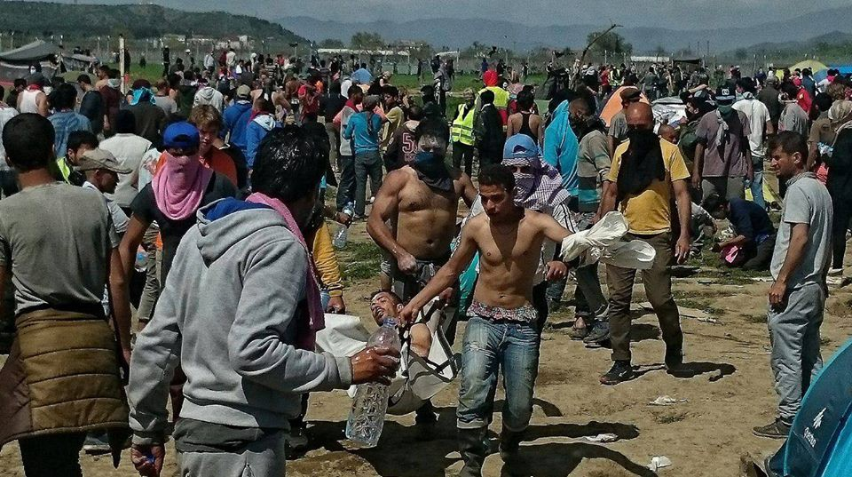
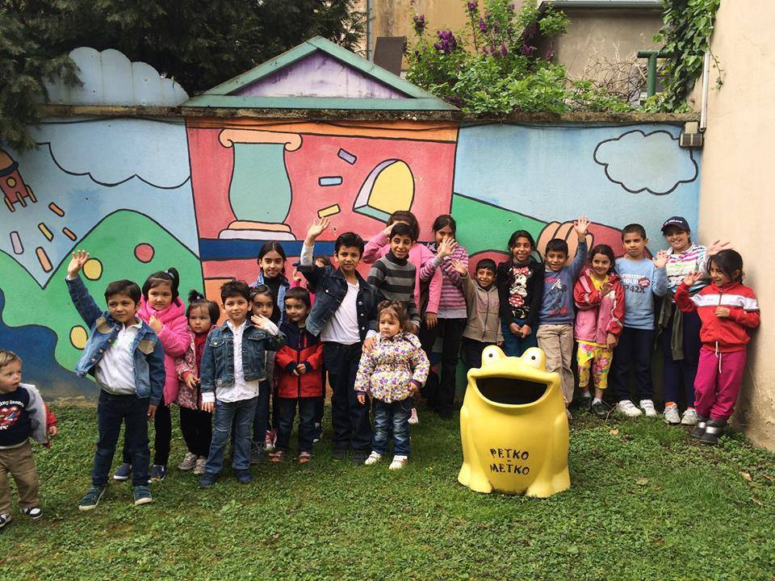
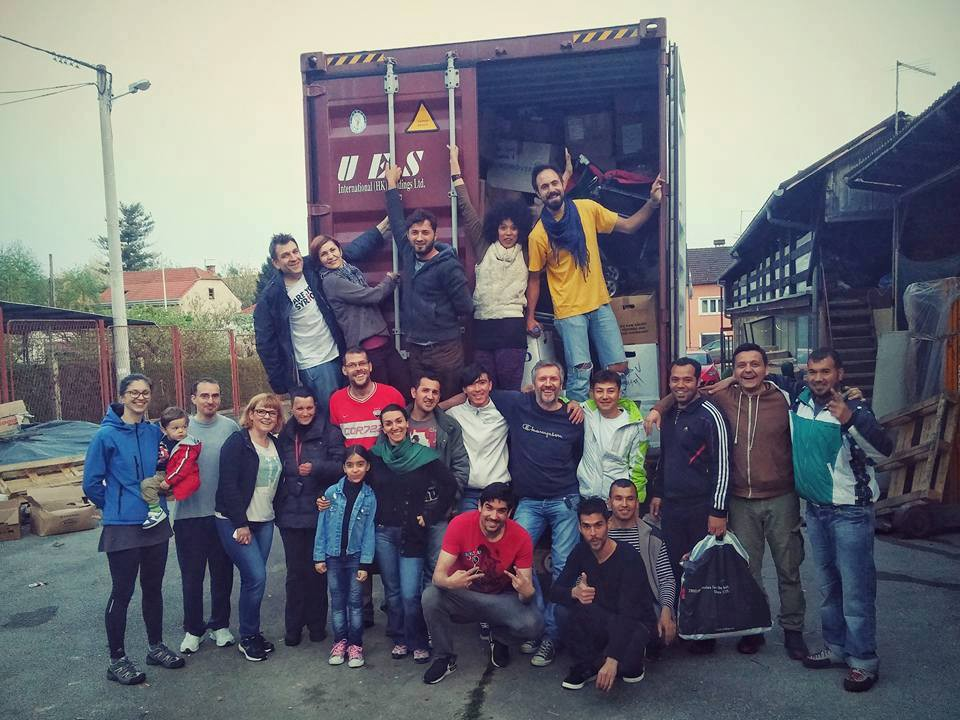

### AYS DAILY NEWS DIGEST 10\.4\.2016
#### 250 injured in Idomeni as a result of a clash that came in the aftermath of a rumor about the borders opening\. Balkan Route to remain closed in the forseeable future\.

Photo from today’s protest in Idomeni\. Photographer: Nadina Malicebegovic\.
#### Greece

**250 refugees injured by tear gas, stun grenades, and rubber bullets amidst rumors of the Macedonian border opening\.**

> Around 250 people, including some minors and pregnant women, were injured today at [‪\#‎Idomeni‬](https://www.facebook.com/hashtag/idomeni?source=feed_text&story_id=609114315904122) during the clash with Macedonian border police\. Medicines Sans Frontiers was forced to form two extra mobile medical teams in order to be able to treat all injured people in the camp\. Over 40 people were injured by rubber bullets\. “Today, frustration and a growing feeling of anger are spread among the refugees who have been stranded in Idomeni for over one month\. What we see is the inevitable result of thousands being trapped in Greece, a country unable to respond to the humanitarian and protection needs of those in search of safety in Europe,” stated Jose Hulsenbek, MSF’s Head of Mission in Greece\. “What people need is to be treated with dignity, not violence or unpredictable border closures and more uncertainty\. This absurd humanitarian crisis created by European states’ policies is becoming more unbearable by the day\.” 

> They also offered help to around thirty kids between five and fifteen years of age\. Twelve people, two of them children, were reportedly taken into Macedonian territory, where they were, allegedly, beaten by the police for an hour\. 

> As we reported yesterday, some small groups of refugees called people to start walking towards the border today\. Flyers, written in Arabic, were posted all over the camp saying: “The march will be held on Sunday, tomorrow, at 9 in the morning\. Note: gathering point will be the place for protest”\. Around 9 AM, one small group approached the Macedonian police and tried to persuade them to let them pass\. They negotiated for some time with the police, who told them that they cannot let anyone through, as they have to comply with the EU’s decision\. More people arrived by 11 am, and soon they confronted the police, who then responded with tear gas, rubber bullets, stun grenades and, apparently, a water cannon\. Tear gas cans were thrown close to the tents\. The confrontation lasted for hours, with tear gas spreading over half of the camp\. At one point Macedonian police entered Greek territory and threw tear gas from there\. After the situation calmed a bit, one volunteer found four men laying in long grass in the area\. All were bruised on the arms and legs after having been beaten to the ground by policemen \(on Greek territory\) with their batons\. Greek police avoided participating in these events, obviously wanting to avoid receiving any blame for the disturbance\. The Macedonian police denied having taken any extralegal action\.“We are using all allowed chemical means,” police spokeswoman Liza Bendevska told AFP\. “We are not using any kind of bullets as they are in Macedonia forbidden by law\. We are not using batons as we are on the other side of the fence,” she said\. According to some sources, Macedonian police arrested 40 Moroccans after they pushed the fence, and sent them back to Greece\. Details remain scant\. 

### Spokesman condemns the violent means used to push back refugees\.

> The spokesman for the Greek Refugee Coordination Crisis Management Body Giorgos Kyritsis, told the media after the incident at Idomeni that the use of tear gas, rubber bullets, and stun grenades “is a dangerous and reprehensible practice… We also call on the refugees not to believe rumors and false information from strangers, and to cooperate with the Greek authorities who will guarantee their safe transfer at an organized temporary accommodation centre,” Kyritsis added\. 

### Today, there are 53,034 refugees stranded in Greece\.

> According to the government sources, as of 8am today there were 53,034 refugees in Greece, including 7,064 stranded on the islands — 4,096 on [‪\#‎Lesvos‬](https://www.facebook.com/hashtag/lesvos?source=feed_text&story_id=609114315904122) , 708 on [‪\#‎Samos‬](https://www.facebook.com/hashtag/samos?source=feed_text&story_id=609114315904122) , 1,789 on [‪\#‎Chios‬](https://www.facebook.com/hashtag/chios?source=feed_text&story_id=609114315904122) , 323 on [‪\#‎Leros‬](https://www.facebook.com/hashtag/leros?source=feed_text&story_id=609114315904122) , 26 on [‪\#‎Kos‬](https://www.facebook.com/hashtag/kos?source=feed_text&story_id=609114315904122) , 77 on [‪\#‎Rodos‬](https://www.facebook.com/hashtag/rodos?source=feed_text&story_id=609114315904122) , 15 on [‪\#‎Kalymnos‬](https://www.facebook.com/hashtag/kalymnos?source=feed_text&story_id=609114315904122) and 30 on [‪\#‎Kastellorizo‬](https://www.facebook.com/hashtag/kastellorizo?source=feed_text&story_id=609114315904122) \. The Government reports 14,220 in [‪\#‎Attica‬](https://www.facebook.com/hashtag/attica?source=feed_text&story_id=609114315904122) , 4,500 of whom are in Piraeus\. Furthermore, there are 2,171 people in Central Greece, with 991 in [‪\#‎Koutsochero‬](https://www.facebook.com/hashtag/koutsochero?source=feed_text&story_id=609114315904122) , and 340 in Southern Greece \(in [‪\#‎KylliniAndravidas‬](https://www.facebook.com/hashtag/kylliniandravidas?source=feed_text&story_id=609114315904122) \) \. Finally, the Government reported 29,239 in Northern Greece, 11,219 of whom are in \#Idomeni\. The number in [‪\#‎Alexandria‬](https://www.facebook.com/hashtag/alexandria?source=feed_text&story_id=609114315904122) has risen 632\. People continue to arrive\. Over the last 24 hours, 162 people arrived at islands, of which 59 on Lesvos, 1 on Samos, 91 on Chios and 11 on Kos\. 

### Refugees stranded in Greece continue to live in deplorable conditions\.

> People stranded in Greece are often living in extremely bad conditions, in closed centers with not enough food\. The situation is worst of all in Idomeni, where over 11,000 people have been stranded since February\. Children make up around a third of the camp’s population\. The camp’s residents are desperate\. Living under improvised tents, in mud, cold, and with deficits of food, water, and medicine\. Many people have gotten sick\. All of them want to continue their journeys toward countries considered safe\. In March, the group of refugees from Idomeni tried to cross the border through a river, and this time they tried to cross the border by walking\. They are desperate, and as such it is likely that more attempts will be made\. We would like to reiterate that there are no indications that the borders will open anytime soon\. 

### AYS strongly discourages attempting a crossing under present conditions\.

> For all those who are thinking about crossing the border again, it is important to know that the entire border is patrolled by Macedonian police who is authorized to use physical force and tear gas\. Today we learned again, they will do that, easily\. And we have to stress again, border or Balkan route, will not be open anytime soon\. Also, we call all the volunteers and activists to help refugees in any possible way, being careful not to put anybody’s life in danger\. 

### Protests also happened in Lesvos and Koutsochero\.

> Beside Idomeni, the protest occurred today at Lesvos in Moria camp and in Koutsochero\. All over, the refugees are asking for the same thing — freedom of movements and choice\. They are holding slogans in English like “Open the borders”\. 

### Refugees in Moria protest immobility and insufficient food\.

> A protest was held in Moria camp, where people are held behind the fence with limited freedom of movement\. They also complain about the food, saying there is not enough for all of them\. They remain uninformed as to what their rights are\. Many people have been held for as many as 20 days\. Another protest Moria is planned for tomorrow at 5pm\. 

### Koutsochero residents plagued by snakes, irregular electricity, and water, lack of doctors\.

> The situation in Koutsochero is very bad, according to the reports we are receiving from different sources\. There are snakes and scorpions in [‪\#‎Efthimiopoulou‬](https://www.facebook.com/hashtag/efthimiopoulou?source=feed_text&story_id=609114315904122) camp and the children are breaking out with rashes\. There are problems with the power and water supply\. The lack of doctors and medical aid are their biggest problem\. There is a severe lack of information as to how long they will be forced to remain\. 

### Warehouse in Alexandria stocked with donated goods\.

> Some good news from \#Alexandria camp where a local solidarity group, together with two British and more municipality volunteers, have cleaned and arranged a warehouse in the camp and brought in additional aid\. Volunteers went tent to tent and distributed basins, buckets and lamps donated by the local church\. They’ll continue tomorrow at 10AM and have called for more volunteer help\. 

### There is to be a new camp to open for Yazidi refugees\.

> It has been announced today that a new camp for Iraq’s persecuted Yazidi minority is to open in the near future\. This should hopefully yield an improvement in their quality of life\. 

### Idomeni residents given more secure access to internet\.

> More good news from Idomeni where the activists of [‪\#‎overthefortress‬](https://www.facebook.com/hashtag/overthefortress?source=feed_text&story_id=609114315904122) have finished building up the No Border Wi\-Fi\. 

### No Border Kitchen continues its valuable work\. Refugees on Lesvos being pressured to register at Moria\.

> No Border Kitchen at Lesvos were forced by the mayor to move the kitchen facilities away from [‪\#‎Tsamakia‬](https://www.facebook.com/hashtag/tsamakia?source=feed_text&story_id=609114315904122) beach\. Refugees are still staying at the beach and the NBK team is providing them with three daily meals\. The mayor has visited them again, twice last week, telling the refugees that they have to go and register in [‪\#‎Moria‬](https://www.facebook.com/hashtag/moria?source=feed_text&story_id=609114315904122) , offering buses to move them there\. He mentioned that people who go to the camp will be given the right to apply for asylum, but most of the people did not trust him\. 

> “Most of the migrants don’t trust the promises of the mayor and fear to be detained and pushed back to Turkey if they are moving from the beach\. Some say they’d rather be taken by force than being detained voluntarily\. This week they have also staged a protest chanting “we want asylum” and “no back to Turkey\.” NBK will do its best to provide for the refugees’ needs for as long as they are stay at the beach and to forward all new information about changes in regulations and laws as well as the situation with the authorities in Lesvos\. Also, since last week \(civil\) police has started arresting refugees from NBK that wanted to use the toilets in the port\. This is causing a huge problem for them as we are still not allowed to put up portable toilets next to the camp and therefore everyone is forced to use the toilets in the port 500m further\. As you can imagine this is causing a lot of stress under the people staying at Tsamakia, which many consider as the last option of at least keeping their right to freedom of movement,” NBK team reports\. 

> Finally, NBK is asking for financial donations as they have to cook more and more food every day and are slowly running out of funding\. “Also, we desperately need a transporter or big van in order to transport food and helpers from the kitchen to the beach\. They are also looking for lawyers and translators\. Whoever wants to help or has a van at their disposal should contact them via email \(noborderkitchen@riseup\.net\) or on our info phone at 0030 694 946 9116\. 

### Ai Weiwei exhibition of art inspired by the plight of the refugees is coming to Athens\.

> Ai Weiwei, who built the studio at Lesvos, and later on made an amazing art piece in Berlin dedicated to refugees, will hold his first solo exhibition in Athens\. The exhibition will include works created in his studio in Lesvos, at the Museum of Cycladic Art, from May 20 to October 30 this year\. The artist’s show, titled “Ai Weiwei at Cycladic”, will feature previous work exhibited abroad, as well as new works, inspired by the refugee crisis and a new marble sculpture inspired by the archeological collection in the museum\. The museum also announced that 10% of the proceeds from tickets, sales and sponsorships will go directly to carefully selected NGOs which are active in tackling the refugee crisis in Greece\. 

#### Bulgaria
### Border patrol volunteers honored by police\.

> Border police awarded a voluntary border patrol for detaining 23 refugees near the country’s border with Turkey over the last week\. The border police chief told the volunteers, the nationalist Organization for the Protection of Bulgarian Citizens, to inform the police next time they go on patrol in the forests near the border so that the authorities can react quickly if they spot a group of refugees again\. 

#### Serbia
### Refugees continue to make their way into Serbia\.

> Despite closed borders, refugees continue to make their way into Belgrade\. Refugee aid Miksaliste received 473 people yesterday: 417 men, 28 women, and 28 children\. 

**586 have applied for asylum in Serbia\.**

> 586 people applied for asylum in Serbia as of now, 262 of the requests being filed this year\. Most of the people who applied for asylum changed their mind or were rejected in the early phase\. Only 32 persons got protection from the state, local police reports\. Currently, there are 1,800 people stranded in this country\. The authorities are claiming that the procedure is very time\-consuming, and it sometimes takes more than five months for an application to be processed\. 

#### Croatia
### Authorities pressured to provide better living conditions\.

> After the announcement about closing down [‪\#‎SlavonskiBrod‬](https://www.facebook.com/hashtag/slavonskibrod?source=feed_text&story_id=609114315904122) camp, the initiative Welcome issued a request asking the authorities to “urgently initiate mechanisms to protect refugees and provide them the conditions for a dignified life”\. They welcome the decision to move refugees from the camp that is not suitable for them to stay, but are working that long\-term solution is necessary\. They protest the decision of the authorities to move refugees into [‪\#‎Jezevo‬](https://www.facebook.com/hashtag/jezevo?source=feed_text&story_id=609114315904122) camp, where they will be restricted in their movement\. 

#### France

**13 Iranian refugees found in the back of a truck\.**

> A group of 13 Iranian refugees, including three minors, were found in a refrigerated truck on a highway in the north of France, announced today the local authorities and added that the refugees are alive and taken care of\. Minors are being taken by the police while the rest will have to leave the country, as media are reporting\. 

#### UK
### The British Home Office sanctioned hacking into asylum seekers’ phones and computers\.

> _The Observer,_ a British daily newspaper published today that immigration officials were given permission to hack into the phones of refugees and asylum seekers, including rape and torture victims, for the past three years\. The Home Office confirmed that since 2013 immigration officials have been granted the power to “property interference, including interference with equipment”, which can include planting a listening device in a home, car or detention centre, as well as hacking into phones or computers\. This is being condemned by activists and human rights groups as discriminatory practice\. Cristal Amiss, of the Black Women’s Rape Action Project, said: “These powers are an outrage\. People in detention have the right to confidentiality, to speak privately to their lawyer and disclose often very sensitive information such as details of rape, torture, domestic violence and alleged abuse by officials\. They have to be able to share private information without their phones being hacked\.” A Home Office official confirmed to _The Observer_ that “equipment interference” had been used to prevent serious crime, including disrupting the supply of counterfeit travel documents, which could have been used to facilitate the smuggling of illegal migrants\. “They did not address whether the powers had been used to ascertain the veracity of asylum claims,” the newspaper reports\. 

#### Spain
### Osama Abdul Mohsen, whose story captivated the world after a video surfaced of him and his son being tripped and kicked by a Hungarian journalist, reports that Spain refuses to grant visas to his wife and daughter\.

> The German magazine _Stern_ interviewed Osama Abdul Mohsen, the refugee who was kicked by a Hungarian journalist in October\. Today he lives with his two sons in Getafe, close to Madrid, and is coaching a youth football team and building exchange programs with Arabic football leagues\. In Syria, he was the coach of 1st the league team Futuwa\. After arriving in Munich, Miguel Ángel Galán from the Spanish football\-trainer\-union called him and offered him a free flat, documents, and the job as coach\. His wife and daughter are still in Turkey and are unable to join them since the Spanish authorities is asking for certificates of the conduct of them, which Syrian government doesn’t give them\. “Now Europe is closing its borders to humans, who are fleeing from bombs, murder, and hunger\. I had a good life in Syria\. I didn’t want to leave my home\. I was forced to do so,” Osama said\. 

#### AYS News

Today was a very big day for us at AYS\. In the morning, we visited theater with our little friends\. Their parents applied for asylum in Croatia and we are trying our best to show them our hospitality\. Dear Zagrebačko Kazalište Lutaka, thank you for being such a great hosts\! We had the fantastic time\!

We finished loading our third container of donations for refugees in Greece\. Volunteers and asylum seekers were working together for days, and our magnificent donors made this possible\. We would like to thank all of you from the deepest place in our hearts\! We hope this container will bring some of our love to our friends in Greece\. This was a great day indeed\. Thank you all for supporting us\! With your help, we will continue making this world a better place\.

**Be sure to like and follow us on [Facebook](https://www.facebook.com/areyousyrious/) and [Twitter](https://twitter.com/areyousyrious) \!**

_Converted [Medium Post](https://areyousyrious.medium.com/ays-daily-news-digest-10-4-2016-fab36d1b4dd4) by [ZMediumToMarkdown](https://github.com/ZhgChgLi/ZMediumToMarkdown)._
