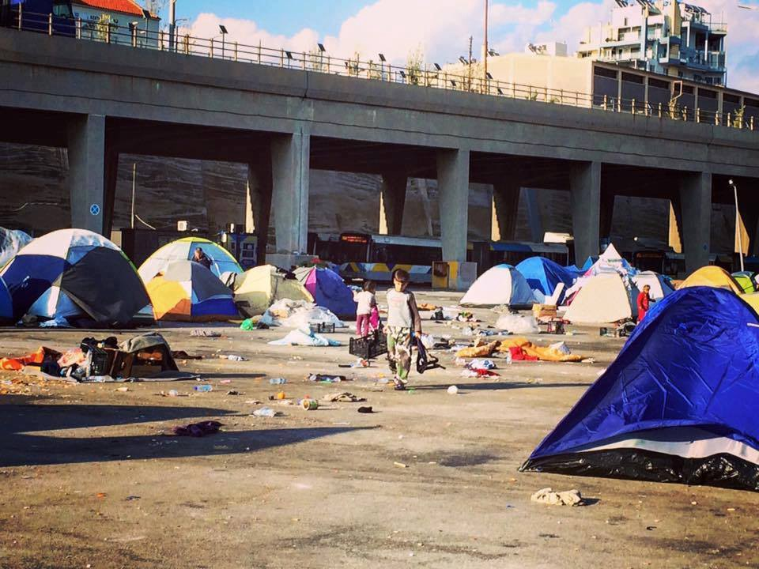
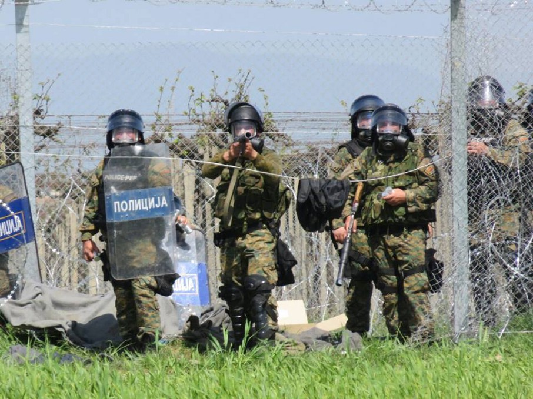

### AYS DAILY NEWS DIGEST 11\.4\.2016
#### More holes emerge in the reasoning being the EU\-Turkey deal\. With only 0\.1% of Syrian refugees in Turkey receiving work permits and most children being unable to pursue an education, can Turkey be a viable option?

Port of Piraeus E1 terminal
#### Turkey
### Fewer than 0\.1% of Syrians in Turkey are able to apply for work permits, putting EU\-Turkey deal further into question\.

> [“Fewer than 0\.1% of Syrians in Turkey currently stand to gain the right to work under much\-vaunted Turkish labour laws, undermining EU claims that the legislation excuses a recent decision to deport Syrian asylum\-seekers back to Turkey,”](http://www.theguardian.com/world/2016/apr/11/fewer-than-01-of-syrians-in-turkey-in-line-for-work-permits?CMP=share_btn_fb) _The Guardian_ reports\. This statistic puts under question the EU\-Turkey deal justified by the EU as an agreement upholding international obligations to refugees, including access to legal work\. 

#### Greece

**72 “irregular migrants” deported to Turkey\.**

> [72 refugees, 71 of whom were Pakistanis and one Bangladeshi were deported from Greece today through the border crossing of Kipi in Evros in accordance with the provisions of the Bilateral Readmission Protocol between Greece and Turkey\.](http://www.naftemporiki.gr/story/1092517/epistrofi-72-metanaston-stin-tourkia-meso-kipon-ebrou) Greek officials have made it clear that the deportations are only just beginning, and we can expect to see significantly higher numbers in the near future\. In addition to the terms imposed by the EU\-Turkey treaty giving new arrivals slim chances of remaining in Europe, refugees of several nationalities, Pakistanis among them, are being barred in particular from continuing their journey, because they are not believed to be facing life\-threatening conditions\. 

### Greek government, UNHCR and MSF condemn yesterday’s violence towards refugees\.

> Tensions are still high in Idomeni after yesterday’s events, which left around 300 refugees hurt\. It has been reported that refugees tried to block the railway track near the camp\. [A lot of criticism of yesterday’s events is coming from Greek authorities\.](http://www.ekathimerini.com/207804/article/ekathimerini/news/greece-blasts-fyrom-over-migrant-border-violence) Criticism is aimed at the behaviour of Macedonian border police, who were shooting rubber bullets and tear gas at unarmed refugees amongst whom there were many children\. According to some reporting, the blame is being cast onto the NGOs and volunteers present in an effort to vilify them as instigators of such horrible events\. But, MSF’s Head of Mission in Greece, Jose Hulsenbek said “Frustration and a growing feeling of anger are spread among the refugees who have been stranded in Idomeni for over one month\. What we see is the inevitable result of thousands being trapped in Greece\.” adding that “What people need is to be treated with dignity, not violence or unpredictable border closures and more uncertainty\. This absurd humanitarian crisis created by European states’ policies is becoming more unbearable by the day”\. [In a statement issued by UNHCR,](http://media.gov.gr/index.php/%CF%85%CF%80%CE%B7%CF%81%CE%B5%CF%83%CE%B9%CE%B5%CF%83/%CF%80%CF%81%CE%BF%CF%83%CF%86%CF%85%CE%B3%CE%B9%CE%BA%CF%8C-%CE%B6%CE%AE%CF%84%CE%B7%CE%BC%CE%B1/%CF%83%CF%85%CE%BD%CE%BF%CF%80%CF%84%CE%B9%CE%BA%CE%AE-%CE%BA%CE%B1%CF%84%CE%AC%CF%83%CF%84%CE%B1%CF%83%CE%B7-%CF%80%CF%81%CE%BF%CF%83%CF%86%CF%85%CE%B3%CE%B9%CE%BA%CF%8E%CE%BD-%CF%81%CE%BF%CF%8E%CE%BD-11-04-2016) there is clear focus of criticism on the slow process of relocation that leaves many without viable prospects\. UNHCR urges for an action plan to properly re\-allocate refugees according to the deal struck months before\. 

### 53,117 refugees stranded in Greece

> [According to the government sources](http://media.gov.gr/index.php/%CF%85%CF%80%CE%B7%CF%81%CE%B5%CF%83%CE%B9%CE%B5%CF%83/%CF%80%CF%81%CE%BF%CF%83%CF%86%CF%85%CE%B3%CE%B9%CE%BA%CF%8C-%CE%B6%CE%AE%CF%84%CE%B7%CE%BC%CE%B1/%CF%83%CF%85%CE%BD%CE%BF%CF%80%CF%84%CE%B9%CE%BA%CE%AE-%CE%BA%CE%B1%CF%84%CE%AC%CF%83%CF%84%CE%B1%CF%83%CE%B7-%CF%80%CF%81%CE%BF%CF%83%CF%86%CF%85%CE%B3%CE%B9%CE%BA%CF%8E%CE%BD-%CF%81%CE%BF%CF%8E%CE%BD-11-04-2016) , there are 53,117 refugees stranded in Greece with 6,976 people stranded on the islands — 3,966 on \#Lesvos, 702 on \#Samos, 1,824 on \#Chios, 321 on \#Leros, 44 on \#Kos, 77 on \#Rodos, 12 on \#Kalymnos and 30 on \#Kastellorizo\. The Government reports 14,387 in \#Attica of whom 4,510 in \#Piraeus\. Further, there is 1,985 people in Central Greece, with \#Koutsochero falling down to 890 and \#Ritsona to 805, and 340 in Southern Greece in \#Kyllini\. Finally, the Government reports 29,429 in Northern Greece of whom 11,194 in \#Idomeni and \#Nea Kavala’s number rising to 3,953\. Number of new arrivals on the islands in 24h period until 07:30am was 18, all on \#Kos\. 

**913 “irregular migrants” have been deported to Turkey this year\.**

> Among the clear criticism of the legality of the EU/Turkey deal, these are the numbers for deportations to Turkey from Greece both through provisions of the deal and by bilateral agreement: From January 1, 2016 until today, they have been delivered to Turkey within the scope of the Bilateral Readmission Protocol, a total of 913 irregular migrants, the following nationalities: 431 in Pakistan, 269 from Morocco, 147 from Algeria, 60 from Bangladesh, 4 of Tunisia and two from Iran\. As defined in the Joint EU\-Turkey Agreement of March 18, they have been returned \(from Lesvos\) to Turkey through the port of Dikili total of 325 refugees and irregular migrants, the following nationalities: 240 from Pakistan, 42 from Afghanistan, 10 from Iran, 7 from India, five from Iraq, five from Congo, 5 from Bangladesh, four from Sri Lanka, 2 from Syria \(seeking their voluntary departure\), one from Egypt, one from the Ivory coast, one from Morocco, one from Somalia and one of Palestinian origin\. 

### Greek Council for Refugees issues critique of the changes to the law that allowed for EU\-Turkey deal\. Lawyers with background in EU law are encouraged to volunteer\.

> [The Greek Council for Refugees voiced a strong critique of the changes in Greek laws which made possible for the provisions of the EU/Turkey deal to be carried out\.](http://www.naftemporiki.gr/story/1092562/kritiki-tou-ellinikou-sumbouliou-gia-tous-prosfuges-ston-prosfato-nomo) The changes go against national and international law, with GCR stating that “The enforcement of the measure involving deprivation of freedom without individual assessment continues “ On that note, if you happen to be a lawyer with a strong background in the EU law and are willing to volunteer and help with legal issues and needs of the refugees, please contact Ariel Ricker on Facebook\. They will be active on \#Chios next week, so volunteers at that location are especially wanted\. Today Chios had 1824 refugees remaining on the island : 1301 were in hotspot [‪\#‎Vial‬](https://www.facebook.com/hashtag/vial?source=feed_text&story_id=609556202526600) and 523 in the Souda and Dipethe camps\. Out of that number 1495 have applied for asylum\. None of those applications have been processed\. 

### Greek government has started to move refugees from the port of Piraeus\.

> [According to the Greek Coast Guard, 570 people had left from the passenger terminal of the gate E\-2](http://www.naftemporiki.gr/story/1092654/se-570-oi-prosfuges-kai-metanastes-pou-anaxorisan-apo-peiraia-gia-skaramagka) , while another 75 people were expected to slowly be boarded on the night bus from the passenger terminal of R\-1 gate to the centers in the region of [\#Skaramagka](https://www.facebook.com/hashtag/skaramagkas?hc_location=ufi) s\. Greek government is distributing leaflets to refugees asking them to move peacefully to the new established camps, stating that they are not detention centers and are better equipped than the port\. They are also stating that they will not use force to remove the refugees\. According to the volunteer in port E2’s terminal, there was some confusion at the ports as buses arrived to take people away with some buses apparently being assigned to specific groups \(i\.e\. Yazidis, Syrian families and then Afghani families\) \. However, many buses were filled on a ‘first come, first serve’ basis\. 

> Please donate to our friends volunteering in the port\. Details can be found here [http://bit\.ly/1VjF3Pp](http://l.facebook.com/l.php?u=http%3A%2F%2Fbit.ly%2F1VjF3Pp&h=JAQFj_ABX) \. 

### The Nea Karvala camp was emptied\.

> [More to the north, \#NeaKarvali exhibition center has been evacuated to \#Aspri Ammos near Kavala and Koutsochero\.](http://www.kavala-portal.gr/2014-07-01-07-48-55/item/6423-ekkenothike-to-ekthesiako-kentro-neas-karvalis-200-prosfyges-stin-aspri-ammo) There are some reports of bad conditions in Koutsochero and unwillingness on the part of the refugees to move there\. The exact numbers of how many were moved where remain unclear\. Meanwhile, the 484 Syrians who left Koutsochero yesterday are being accommodated in the camps in \#Alexandria and \#NeaKavala\. 

Macedonian police on the border with Greece\. Photo taken by refugees stranded in Idomeni
### Peaceful protest in Idomeni

> [Even in face of the grave uncertainty, those stranded in \#Idomeni had a peaceful protest today demanding the borders to be open\.](http://balkans.aljazeera.net/vijesti/miran-protest-izbjeglica-na-makedonskoj-granici) As they pushed the old wagon from the train station which is a couple hundred meters south from border, next to the border where police buses are parked over the tracks\. The refugees stopped it in front of the buses while singing and chanting, holding Greek flags\. Meanwhile there are reports that at least two of the volunteers in Idomeni were arrested today for not having their passports with them \(even though they had other IDs\) \. IMPORTANT: volunteers should have their passports handy\! The police was checking almost every car approaching Idomeni, on the bridge that is the main entrance from highway\. They checked passports, ID and car insurance papers\. 

> Even though there are reports of some people leaving Idomeni to other camps, 11,194 are still stranded there in terrible conditions\. There is a call for more volunteers from the dear people of the Czech team\. For more information follow the link [http://bit\.ly/1TNoxFF](http://bit.ly/1TNoxFF) \. As we have already reported, unfortunately, the borders will not be open any time soon\. 

> Finally, there is a new website for the No Border camp that is to take place in Thessaloniki this summer\. For more information, follow the link [http://bit\.ly/1RPLIxQ](http://bit.ly/1RPLIxQ) 

#### Italy
### **1850 people saved from drowning off the coast of Italy\.**

> [Today 1,850 refugees aboard boats heading towards Sicily have been rescued from drowning\.](http://www.naftemporiki.gr/story/1092669/diasosi-1850-metanaston-notia-tis-sikelias-to-teleutaio-24oro) 117 people were rescued by a merchant ship, 738 by EUNAFOR ship from Frankfurt, 740 were saved by an Italian coastguard ship, and the rest were saved by Italian Navy ship\. 

#### Bulgaria

**300 additional troops to be sent to border with Serbia\.**

> [Prime Minister Boyko Borisov announced that Bulgaria will send 300 additional troops to the border in the event of migrant pressure\.](http://www.novinite.com/articles/173969/Bulgaria+to+Deploy+300+Additional+Troops+to+Border) He said that only on the border with Serbia every night between 90 and 100 people are detained\. Finally, he assured that Bulgaria is doing everything possible to prevent migrants from crossing the borders\. 

#### Macedonia
### Donations needed\. Schooling for refugee children provided by international organizations\.

> Winter Clothes to Refugees / Team Studinicani groups are currently able to provide only fruit to refugees in \#Tabanovce as long as certain police rules are followed\. Refugees are very hungry and need food, if anyone would like to donate, whether directly within Macedonia or with an online \(US tax\-deductible\) donation, plase contact the group at [http://bit\.ly/23yBm9u](http://bit.ly/23yBm9u) or info@charityunited\.us” 

> There are approximately 120 refugee minors stranded in Macedonia after the closure of the Balkan route, reports News that Moves\. Since national legislation allows attending schools only to children whose parents or themselves have asked for asylum and received international protection, international agencies are trying to provide other children with schooling\. Several NGOs have organized interactive kindergartens in refugee camps with lessons in basic English words\. UNHCR and UNICEF are developing informal program which the children currently waiting in Tabanovce and Gevgelija camps will be able to attend\. The Ministry of Labour said the authorities will not participate in funding of this or any similar projects, claiming that it remains unknown when the refugees will be leave the country\. 

#### Austria
### Useful information for refugees on train from Austria to Germany

> Useful information for refugees: when traveling by train from Austria to Germany, exit the train at the border crossing and pass on foot\. You will have your passport checked, at which point you can reboard the train\. Refugees trying to get to Germany from Austria can not do so by train\. 

#### France
### Volunteers needed in Calais\.

> Volunteers needed in Calais\. At the moment, warehouse is struggling to sort and distribute supplies due to the shortage of volunteers\. If you are available, please send an e\-mail volunteerincalais@gmail\.com with your dates\. There are groups to arrange lift shares and info on accommodation or volunteers can just stay for the day\. For more information follow the links [http://bit\.ly/1T04rpu](http://bit.ly/1T04rpu) and [http://bit\.ly/1Nli1zg](http://bit.ly/1Nli1zg) \. 

**Be sure to like and follow us on [Facebook](https://www.facebook.com/areyousyrious/) and [Twitter](https://twitter.com/areyousyrious) \!**

_Converted [Medium Post](https://areyousyrious.medium.com/ays-daily-digest-11-4-2016-8e8297bf418b) by [ZMediumToMarkdown](https://github.com/ZhgChgLi/ZMediumToMarkdown)._
