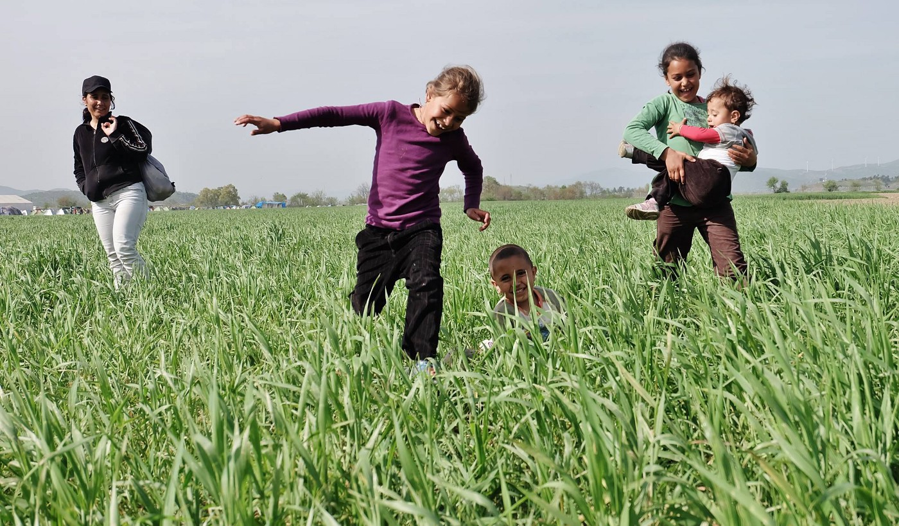

### AYS DAILY NEWS DIGEST 13\.4\.2016
#### EU has failed to fulfill even its own meager target for refugee resettlement in the month of March\. Meanwhile, with the closing off of the Balkans route, traffic in the Mediterranean has once again picked up, with 12,000 saved since March\. Greece’s standing in the Schengen zone is threatened, with the EU believing that Greece has not been stringent enough in its border regime\.

Kids playing in a field in Idomeni \(Photo by Nima Maei\)
#### TURKEY
### More information surfaces detailing the sub\-par conditions that Syrian refugees are left in\.

> Reporting about the refugees who have attempted the dangerous trip across Aegean, we sometimes forget to reflect on living conditions of those who couldn’t afford a place on a smuggler’s boat\. One of our volunteer contacts, who wishes to remain anonymous, has sent us a disturbing personal testimony about refugees who are stuck in Turkey: 

> _“The Syrians who have chosen to settle in the villages around where I live in Turkey are living in hovels… their conditions are often worse than the camps in some respects\. In my visits to their, “ homes” I have yet to see a functional toilet, yet alone a shower\. Last week, a Syrian woman living near to the village where I live in Turkey, went into labour 3 weeks prematurely, she was taken, ‘illegally’ to a hospital, as it is forbidden for us to transport her\. She was refused assistance\. A hemophiliac child needed urgent hospital care on Saturday, an ambulance was called, but they would not attend when told the boy was Syrian without registration\. A one\-month\-old child died on Saturday\. None of us will ever know for sure, but I’m guessing his death could have been prevented or at least he could have had a better chance if free medical care had been given\.”_ 

> Our contact is currently investigating what help is available for refugees who have not attempted the crossing to Europe\. If you have any information about this, please let us know\. 

#### GREECE

**120 refugees rescued by the Greek Coast Guard today in three separate operations\.**

> People continue to arrive in Greece, in fewer numbers than previously, but they are nevertheless in need of help\. Today, the government reported that the Greek coast guard rescued 120 people in three separate incidents off \#Lesvos and \#Samos\. Officials also said that between Tuesday and Wednesday morning there had been 101 arrivals on the Aegean islands\. Currently, there are 3,644 people at the Lesvos hotspot, 1,827 in \#Chios and 516 on \#Samos\. 

**100 people arriving in Greece per day on average this week, in comparison to the daily average in March of 1150\.**

> According to UNHCR data, over the last week \(from April 4 to 11\), on average there have been fewer 100 new arrivals in Greece per day, which is down 20 percent from the previous week\. The number might be higher if people who are not yet registered are counted, but these numbers are a testament to the fact that fewer people are now coming to Greece\. In March, the daily average was 1,150, according to UNHCR\. The difference is also that while before most of the people were from Syria, now people are mostly from Pakistan and Northern African countries\. 

### The Macedonian border police continues its aggressive retaliation against refugees in Idomeni\.

> Even today, the Macedonian border police continued using tear gas and stun grenades against desperate refugees who have been stranded in \#Idomeni since February\. Some of the refugees responded with rocks and new attempts to break the fence\. Allegedly, approximately 50 refugees tried to break the fence today\. People told us that the fence is partially damaged\. 

> **It bears repeating that the border will not open anytime soon\.** 

### Greek Foreign Ministry criticizes neighboring countries for partaking in the aggressive repression against refugees in Idomeni\.

> The Greek Foreign Ministry filed complaints against the governments of Austria, Croatia, Serbia and the Czech Republic following claims by Macedonian authorities according to which members of those countries’ security services participated in violence against refugees at Idomeni\. 

**14 activists were arrested in Idomeni today according to the New York Times\. Other sources say that it may be as many as 26\.**

> Distressing information from Idomeni today: Greek authorities arrested a group of activists\. According to [New York Times](http://www.nytimes.com/2016/04/14/world/europe/migrant-crisis-idomeni-protests.html?hpw&rref=world&action=click&pgtype=Homepage&module=well-region&region=bottom-well&WT.nav=bottom-well&_r=0) , 14 people were arrested\. Some other sources are saying that as many as 26 may have been arrested\. Volunteer sources are saying these people were arrested under the suspicion of inciting refugees to protest\. Allegedly, the German woman was arrested near the Idomeni refugee camp after officers found a can of pepper spray in her possession\. The other four activists were said to be carrying transistor radios that were allegedly tuned into the frequency used by the Greek Police\. NYT writes that the police accused the activists, from Britain, Germany and other European countries, “of encouraging the migrants to protest by telling them that doing so would arouse sympathy among European governments and in that way help reopen borders and let them proceed on what was once the main migrant path to Germany, where most say they want to go\.” 

### Aid Delivery Mission make an appeal in reaction to suspicions promoted against volunteers by the media\.

> Independent Volunteers of Idomeni, Aid Delivery Mission, The Shorba Crew reacted to the latest events related to volunteers\. In their public appeal, they wrote: _“As many groups have experienced in Greece there is an increased atmosphere of suspicion towards volunteers being promoted by the media and political motivation being created to criminalize refugee support\. We have already experienced this repression over the last months, and yesterday, as a result of media allegations it has increased\. We condemn the EU policies creating the inhuman situation at their borders\. We condemn the violence against those who are seeking safety\. We condemn the media organizations responsible for these biased and poorly researched articles and their shallow and sensationalist representation of the situation\. We condemn the use of state \(police\) violence to repress volunteers who are attempting to show the people in the camps that they have not been forgotten\. And we thank the people who continue to support the work of all volunteers, both inside and outside the camps and the walls of Europe\.”_ 

**1000 refugees moved from Piraeus to a new camp\. 3805 still remain there as of Wednesday\.**

> Around 1,000 refugees and migrants have been moved from \#Piraeus to a newly constructed camp in \#Skaramagas, west of Athens, over the past few days\. According to government data on Wednesday, there were 3,805 people still camped at the Piraeus passenger terminal\. Until recently, there had been more than 5,000 people at the unofficial migrant camp\. Meanwhile, volunteers who tried to enter this new camp were not allowed\. They were told that Ministry permission is needed\. Looks like this will be another closed center for refugees\. 

**150 occupy a highway in Katsikas to protest camp living conditions\.**

> Late this evening, we received information about the protest in \#Katsikas\. A group of around 150 people who are living in this camp, occupied the nearby highway E90 on both lanes\. They remained there into the late night\. This was to show solidarity with people who are waiting for over 24 hours in buses that arrived from \#Kavala\. Passengers from these six buses did not want to enter the camp due to its current state\. The protest’s goal also included drawing attention to the current situation in this camp\. Reports are saying that the buses left to another camp right after the protest started — obviously to get rid of 400 motivated protesters\. No NGO or volunteers were involved in the protest\. Nevertheless, the group of volunteers Soup and Socks sent us a message saying: _“we also want to state that we stand in full solidarity with the people\. The current conditions \(tents without the floor, lack of sanitary facilities, lack of a complete nutrition, non\-presence of any officials who could help with asylum or family reunification, mismanagement of information, police with orders not to engage at all, etc\. \) are reasons enough to raise your voice and show visible action\. People, Greeks and Europeans need to speak up to their governments and bring real change to the ongoing crisis of values\.”_ 

### Refugee boy in Katsikas camp in desperate need of a liver transplant\.

> We also got a message from a nurse Deborah Rays in this camp, saying that among the refugees is a little boy named Ahmed who needs an urgent liver transplant\. He is now in a hospital because his lungs were so full of fluid, and he was coughing “like he was drowning\.They say its heart failure\.” Ahmed has cirrhosis of the liver\. He is eight years old\. You can find more information on Deborah’s [Facebook page](https://www.facebook.com/deborah.kandic/posts/10153766173894006?fref=nf) \. 

**700 asylum seekers detained at Samos\. MSF reports on the atmosphere of uncertainty expressed by detainees\.**

> [MSF issued a report](http://www.msf.org/article/greece-“will-they-kill-us-here-Europe”) concerning the state of the migrants and refugees at the closed facility on Samos\. There are more than 700 asylum seekers, mostly from Pakistan, Bangladesh, Afganistan, Syria, Iraq, Sudan, Lebanon, Algeria, Morocco and Egypt, currently on Samos\. Many are women and children\. According to MSF, most of them arrived by boat after March 20\. “Migrants were told they will be sent to a camp in Athens in accordance with the relocation mechanism set out in the Dublin Regulation\. This allows refugees to choose eight countries from the list of EU states, and efforts will be made to send them to one of them\. However, there appears to be no guarantee that the choice of eight countries will be respected\. In general, people don’t know what even the near future holds for them\. Many told us they were held for days in Turkey before being released on March 20\. Some of the detainees talked to MSF teams through the metal fence\. They are angry and sad\. They feel as if they’ve hit a brick wall\. No legal procedures or interviews are being conducted in the camp at the moment\. Refugees are now becoming afraid, especially since realizing that applying for asylum in Greece is their only option… Khadija, a 42\-year\-old woman from \#Idlib, Syria, is being held in Samos detention center with her four children\. She spoke to MSF teams from behind the barbed wire fence\. _“What is going to happen next? Will they kill us here in Europe? My husband was killed and our house was destroyed by a barrel bomb in 2013\. Since then we have been moving from village to village looking for safety until I lost hope and I brought my children to Turkey\. I worked many jobs but it was so hard for me to manage with four children so I decided to come here to be safe\. Yet here we are behind barbed wire like criminals, this is extremely unjust\.””_ 

### Volunteers needed in Samos\!

> In the meantime, we received an urgent call for volunteers on Samos\. Everybody is more than welcome\. 

> Important warning: “Working inside a closed camp is challenging in many ways so volunteers will be thoroughly assessed before deciding if they can or cannot work in this kind of environment\. For any further information please contact the Facebook group [Samos Volunteers](https://www.facebook.com/permalink.php?story_fbid=581361925375305&id=565209816990516) \. 

### Residents of Chalkero camp report dreadful conditions\.

> A group of volunteers informed us about the situation at \#Chalkero camp\. Apparently, access to the camp, guarded by the military, is restricted\. There are 280 to 300 people inside, mostly those who were transferred from \#NeaKavali camp\. People are complaining about conditions in the camp, including lack of hot water, snakes, overcrowded tents where several families live together, and no WiFi\. 

**500 people living in Drama camp\. Relocation has proven difficult\.**

> The situation is different at the volunteer\-run \#Drama camp where full access is allowed, and interpreters are available\. Some 500 people are in the camp, mostly Syrians and Iraqis\. However, conditions could use improvement\. Some of the issues include the lack of a possibility for refugees to cook for themselves, a lack of fruits and vegetables, and a limited milk supply\. The biggest issue is the difficulty in applying for relocation from this camp since the request has to be made at \#Alexandropolis, 180km away\. 

**3000 face difficult conditions in Polykastro camp\.**

> The situation at \#EkoGasStation at \#Polykastro, an unofficial camp with approximately 3,000 residents, is difficult\. There is at least 80 pregnant women in the camp, and a large number of single women with kids\. Some reports are also saying that this camp is not safe and some volunteers left because of that\. 

**10 people in Camp Orestida provided with facilities and legal aid\.**

> Camp \#Orestida is another place where no access is granted to volunteers\. It is guarded by the police\. Apparently, there are only 10 people in this center, all Kurds who have applied for asylum\. The locale of the camp is quite remote, in the rural area near the Greek\-Turkey\-Bulgaria border\. The center is built with EU funds and has several useful facilities, including WiFi, phones, daily cleaning, seperate sleeping facilities for women and men, food catering, and even a basketball court\. Capacity is 400\. There are also lawyers who visit often\. 

### European Commission demands tighter Greek borders, threatening suspension of Greece from the Schengen Zone\.

> Meanwhile, the European Commission give Greece two weeks to determine plans to tighten border control\. They also stated that “despite some progress the process of registering thousands of asylum seekers remains inadequate”\. In far away Brussels, they are also very critical of the existing Greek plan, insisting that it lacks “detailed time frames” while also demanding guarantees EU funding be used properly\. The EC sent the message that if Greece fails to take action, Brussels could authorize other EU member\-states to extend border controls in the Schengen passport\-free area for up to two years instead of the normal six months\. The move would suspend Greece’s participation in the Schengen zone\. The Commission requests that Greece provide the additional elements and clarifications by April 26\. 

#### MACEDONIA
### New amendments to the Law on Asylum could have a negative impact on the rights of asylum seekers and refugees

> Parliament amended the Law on Asylum and Temporary Protection on April 4\. The amendments were aimed at defining new criteria and conditions based on which a person can get international protection\. Potentially, these new amendments could have a negative impact on the rights of asylum seekers and refugees\. According to UNHCR, some restrictions introduced about family reunification and the ‘safe third country’ clause are of concern of the organization\. 

> More info at [News That Moves](https://newsthatmoves.org/en/?p=2211) \. 

#### CROATIA
### The camp at Slavonski Brod will be officially closed on this Friday\. It is already empty\.

> The camp in \#SlavonskiBrod has been emptied\. The last 62 refugees \(families\) were transferred to \#Porin, \#Zagreb\. The camp will be officially closed on this Friday\. The people were are transferred are asylum seekers\. They are free to move, but they complain that very little is allocated to them\. They are asking for clothing and additional milk for children claiming that the current amount supplied does not suffice\. 

> We hope the state will find the alternative solution for those refugees, mostly single men, who were previously transferred to the detention center in \#Jezevo, where living conditions are difficult\. 

#### ITALY
### Italy decries Austrian border controls, claims that there is no evidence of a drastic increase of the numbers of migrants from Italy\.

> The government in Rome asked the European Commission if Austrian plans to establish border control along Brenner are legal\. Austria is worried that refugees could find a new route into Europe that will lead them through Italy, over this border crossing\. Italy claims that there is no proof of a dramatic increase in numbers of refugees coming through Italy\. 

#### CANADA

**10thousand additional Syrian refugees to be relocated to Canada this year\.**

> Canada announced a plan to resettle 10,000 more Syrian refugees this year\. In order to do that, they will send more staff to the Middle East to accelerate the processing of privately sponsored Syrian refugees\. Syrians currently in Greece and the rest of Europe are not eligible to resettle in Canada under the new plan\. 

> More info at [New That Moves](https://newsthatmoves.org/en/?p=2213) \. 

#### EU

**1145 refugees relocated from Greece and Italy in March, falling far short of its target of at least 6000\.**

> The European Commission warned that the EU was missing its target on the relocation of 160,000 refugees under two controversial schemes\. In March, the EU set the target to relocate at least 6,000 persons in a month\. As of now, 1,145 people have been relocated from Greece and Italy\. “We cannot be satisfied with the results achieved so far,” said Dimitris Avramopoulos, the European commissioner for migration\. _“Relocation efforts have to be increased dramatically to reply to the urgent humanitarian situation in Greece and to prevent any deterioration of the situation in Italy\.”_ 

> [Official figures](http://www.balkaneu.com/disappointing-data-relocation-refugees-eu/) are showing that not many countries received refugees from Italy or Greece\. 24 persons from Italy were relocated to Belgium, 135 to Finland, 137 to France, 20 to Germany, 15 to Malta, 50 to Netherlands, 92 to Portugal, 18 to Spain and 39 to Sweden; From Greece 2 were relocated to Bulgaria, 6 to Cyprus, 7 to Estonia, 111 to Finland, 242 to France, 37 to Germany, 10 to Ireland, 6 to Latvia, 6 to Lithuania, 30 to Luxembourg, 6 to Malta, 48 to Netherlands, 89 to Portugal, and 15 to Romania\. All of these countries, as well as some others, agreed to receive much higher numbers\. 

**12 thousand refugees have crossed the Mediterranean into Italy since March\.**

> The President of the European Council Donal Tusk informed the European Parliament about “alarming number” of people who could try to reach Europe from Libya\. Tusk said the EU “must stand ready to help Italy and Malta, adding that it acted “much too late” on the Western Balkan route via Turkey and Greece,” [EUobserver reports](https://euobserver.com/migration/133037) \. 

> According to UN figures, around 12,000 people have crossed the Mediterranean Sea to Italy since the beginning of March\. 

**Be sure to like and follow us on [Facebook](https://www.facebook.com/areyousyrious/) and [Twitter](https://twitter.com/areyousyrious) \!**

_Converted [Medium Post](https://areyousyrious.medium.com/ays-news-digest-13-4-2016-fe03312b0d34) by [ZMediumToMarkdown](https://github.com/ZhgChgLi/ZMediumToMarkdown)._
