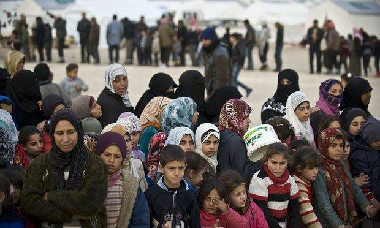
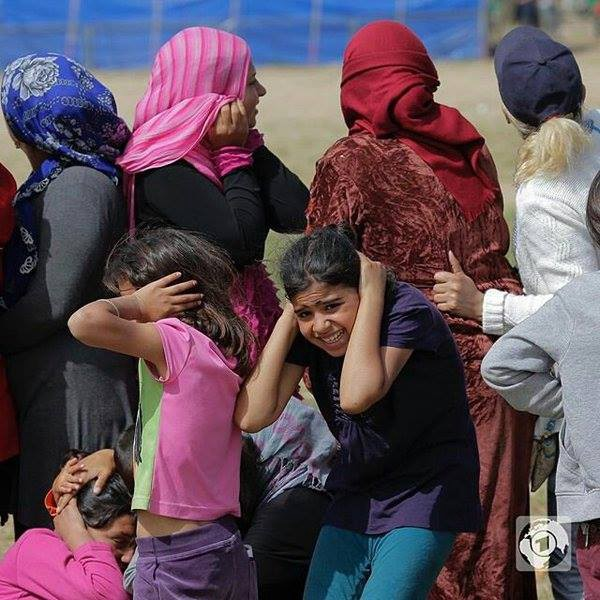
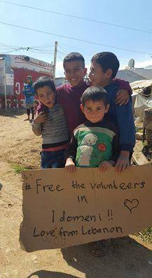
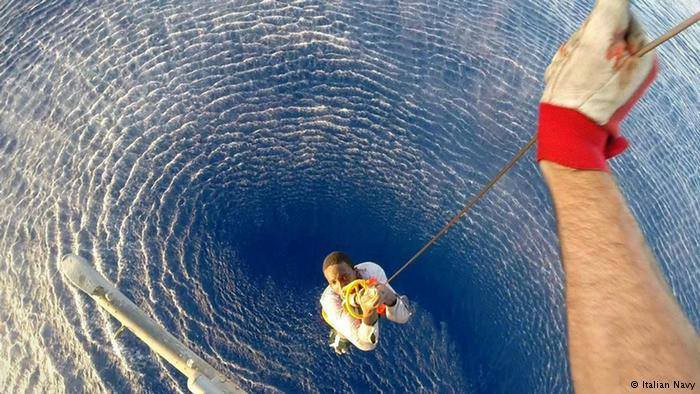

### AYS DAILY NEWS DIGEST 14\.4\.2016
#### Germany plans to punish refugees for not assimilating into society thoroughly enough\. Additional deportations of refugees from Greece to Turkey are being undertaken in the next few days\. Meanwhile, 6000 refugees have made their way into Sicily since Monday by crossing the Mediterranean\. Traffic on the Mediterranean is expected to increase in the near future\.

The newest wave of people uprooted by ISIS amasses at the Turkish border\. Photographer: Andalou Agency
#### SYRIA
### Thousands uprooted after Islamic State attack, forced to flee northern Syria\.

> A new wave of refugees has fled northern Syria for the Turkish border after Islamic State opened fire on communities that had sheltered them, killing at least three people and uprooting thousands more\. The killings came as the terror group pushed back Syrian opposition forces who had edged to within five miles of \#Dabiq, a highly symbolic village that the group’s leaders believe is the pre\-ordained epicenter of a clash that will herald an apocalyptic showdown\. 

> [http://www\.theguardian\.com/world/2016/apr/14/thousands\-of\-refugees\-flee\-for\-turkish\-border\-after\-surprise\-isis\-attack](http://www.theguardian.com/world/2016/apr/14/thousands-of-refugees-flee-for-turkish-border-after-surprise-isis-attack?CMP=Share_AndroidApp_Copy_to_clipboard) 

#### Lebanon
### Lebanese NGO requests more volunteers in Bekaa Valley\.

> An NGO in Lebanon, Hope, needs our help after a tough week: “We’ve had a big week here in the Syrian refugee camps in the \#Bekaa Valley, Lebanon\. We need more help, so please consider volunteering in Lebanon\. This is our week in one minute: [https://www\.facebook\.com/hopebekaavalley/videos/1066168593442041/](https://www.facebook.com/hopebekaavalley/videos/1066168593442041/) ” You can reach them through this link\. 

#### Turkey

**250 expected to be returned to Turkey from Greece according to Turkish EU Affairs Minister\.**

> \#Ankara expects the next wave of migrants returning from Greece to Turkey to start within a “few days” and to consist of around 250 people, Turkish EU Affairs Minister Volkan Bozkir said on Thursday\. “We will take back everybody, every irregular migrant who has reached the five Greeks island after March 20 and some of them will be non\-Syrians,” he stated at a news conference\. “In the second wave there will be more Syrians\.” 

#### Libya

**1 million people in Libya may make the Mediterranean crossing\. Plans to shut down Aegean route could exacerbate situation\.**

> Up to 1 million people could cross from Libya to Italy in the latest wave of migrants into Europe\. “In Libya there are a million potential refugees,” General Paolo Serra, a military adviser for the UN Libya envoy Martin Kobler, told a committee at the Italian parliament, as reported by the ANSA news agency\. In March EU leaders agreed upon a 6 billion euro \($6\.7 billion\) deal with Turkey aimed at shutting down the route across the Aegean from the Turkish coast to the Greek islands\. However, concerns are growing that the plan — which includes an agreement to send back all arrivals — will drive people to make the more treacherous crossing from North Africa instead\. 

#### Greece

Greek military exercises are inducing fear in refugees fleeing war zones\. Photographer: www\.twitter\.com/HasanniFM
### Greek military exercises to commence in Idomeni and Oinouses, promoting fear and concern among refugees\.

> This morning, the Chief of Staff of the Greek military has announced that a military exercise will be launched in Idomeni and the island of \#Oinouses near the island of \#Chios, near the border of Turkey, TV Telma learned from security sources\. Chief of General Staff of the Greek military Evangelos Apostolakis stated that the military exercise is a response to frequent provocations by the Turkish military and part of the regular activities of the Greek military\. The Drill is named “Storm” and it includes aviation units, infantry and navy\. The military exercise will be monitored by the Greek Minister of Defence of Panos Kammenos, expected to arrive at noon in \#Idomeni\. Military helicopters fly above the border line in Idomeni, circling the surrounding areas as part of the supposed drill\. Soldiers deployed on ground just hundreds of meters from the main camp, 5 fighter jets and 4 military choppers all active\. Children and mothers are screaming and scared in the camp due to the military presence, which obviously brings back memories of the war they are fleeing from, and many remain unaware about what is happening or why the military is there\. Volunteers are also being arrested regularly for frivolous offenses\. 26 were arrested yesterday alone\. The Greek clampdown has begun, crazy scenes to witness in 21st century Europe\. 

**15 arrested by riot police at Katsikas, with the highway blockade dispersed\.**

> \#Katsikas: The blockade was cleared by police forces at 13:30, and about 15 people were arrested by riot police \(refugees, two Spanish women and one Greek\) \. NGOs, locals and lawyers are working together to release them\. The situation is ongoing — stay tuned\. 

**1100 refugees to leave Piraeus for Skaramagas, 3800 still remain\.**

> As of April 13, around 3,800 people are still waiting at the \#Piraeus port, in \#Athens, according to UNHCR data\. Until recently, more than 5,000 people were camped there\. Greek authorities announced that they are planning to fully evacuate the port by the end of April\. Authorities are running buses from the port to organized camps in the area surrounding Athens\. Gate E3 of the Piraeus port was completely cleared on April 13, according to humanitarians on site\. Gate E2 is still in the process of being cleared\. The majority of people remain in gate E1\. Over the last several days, authorities managed to convince up to 1,100 refugees to move to the \#Skaramagas camp, which currently has a capacity of 1,000\. The camp is currently under construction to expand capacity, and over the next few days is expected to be able to accommodate another 1,000 spots\. 

### Application for Asylum and EU relocation explained amidst incorrect rumors\.

> Recently there have been rumors that the refugees who are stationed in the military camps further away from the border are more likely to be resettled in Greece\. There is no relation between the site one is in and eligibility for relocation to another EU country\. If one registers to apply for asylum in Greece, one can then apply for the EU Relocation Program in order to be relocated to another EU country\. Application for the EU Relocation Program is possible only if one is from Syria, \#Iraq, \#Eritrea, \#Central African Republic, \#Burundi, \#Maldives, \#SaintVincent and the \#Grenadines or a stateless person of one of those countries\. If you are granted asylum in Greece you cannot apply for asylum in any other country\. 

> For more information visit [https://easo\.europa\.eu/\. \. \./questions\-and\-answers\-on\. \. \./](https://easo.europa.eu/.../questions-and-answers-on.../) 

**4000 detained on Lesbos and Chios, lacking medical care, sanitation, and legal aid\.**

> On April 14, Human Rights Watch \(HRW\) published a report on the blanket detention of asylum seekers in Greece being carried out under the EU\-Turkey deal\. HRW recalled that, since the plan’s implementation, “Greek authorities, in coordination with the European Union, are automatically detaining all asylum seekers and migrants who arrive on the islands of \#Lesbos and Chios in deplorable conditions\.” According to HRW, approximately 4,000 people are currently detained in the hotspot of Moria, on Lesbos, and at the \#VIAL facility, on Chios\. HRW visited the facilities on Lesvos and Chios from April 3 to 9\. What Are The Common Issues in the hotspots? People with special needs are held in the camps; this includes women with young children, pregnant women, unaccompanied children, elderly men and women, and people with physical and psycho\-social disabilities\. None of the people detained have proper access to health care, sanitation facilities, or legal aid\. To further read: [https://newsthatmoves\.org/en/?p=2161](https://newsthatmoves.org/en/?p=2161) 

“Free the volunteers in Idomeni\! \! Love from Lebanon”\. Photographer Martin Kvernbekk\.
### Two arrested at Idomeni border for alleged clash with FYROM police\.

> Greek police have arrested two Spanish men on suspicion of taking part in clashes between refugees and other migrants and police of Former Yugoslav Republic of Macedonia \(FYROM\) at the Idomeni border crossing\. Police say the suspects, aged 27 and 28, allegedly threw stones and sticks at FYROM police during Wednesday’s violence on Greece’s northern border with FYROM\. 

### Appalling lack of resources distributed for infants at Vial, resulting in shortages of baby formula and diapers\. Lack of official planning necessitates NGO alleviation of the situation\.

> As many are aware, conditions in Vial are atrocious\. There is a dire shortage of drinking water and of food, and a complete dearth of most everything else\. But the most vexing, appalling, devastating situation by far, the one that is calling out for immediate change, is that of young babies at Vial\. There is no system whatsoever in place for distribution of milk \(baby formula\) for infants\. Patchwork semi\-solutions have been brought on by selfless, exhausting efforts on the part of individual volunteers \(in particular Kostas Tanainis\) who have occasionally been allowed in depending on the irrational whim of guards; there is no official policy in place\. When donated baby milk has been delivered to the camp but volunteers were not allowed to distribute it, it has languished undistributed\. Several NGOs have withdrawn in protest of the conditions\. Nurture Project International — an NGO whose sole mission is infant nutrition — has been tirelessly trying to gain access to Vial for weeks\. All entries have repeatedly been denied\. 

> Yesterday we were sent this picture by a resident of Vial\. This cup is the ONE daily ration of powdered baby milk that each baby was issued yesterday: the few grams of powder that you see in this one cup, are supposed to last for AN ENTIRE DAY\. 

> This amount of powder is sufficient for roughly one bottle\. Babies require several such bottles per day for adequate nutrition and hydration\. The babies in Vial are growing malnourished\. They are hungry and forever distressed; desperate parents are apparently resorting to having their very young children chew on oranges to distract them\. Along with this miserable ration of food, each baby was also issued a completely inadequate 3 diapers to last them 24 hours\. 

> This situation has been ongoing since March 20th\. Following a highly anticipated meeting with the new camp leadership two days ago, it has become amply evident that there is absolutely no plan in place to change it\. Please share this post, contact anyone that you think might publicize it further, and please help us raise a stink for the babies of Vial\. 

### Continued relief efforts by FILIPIAADA\.

> Our friends at FILIPIAADA have some material needs to continue their relief efforts for refugees\. You can reach them through this link: [https://docs\.google\.com/document/d/1SXC9wxTQit1C1Q96XsMjwoj\-O31nkFoli5rcLuK0wW4/mobilebasic?pli=1\#heading=h\.gjdgxs](https://docs.google.com/document/d/1SXC9wxTQit1C1Q96XsMjwoj-O31nkFoli5rcLuK0wW4/mobilebasic?pli=1#heading=h.gjdgxs) 

### Volunteers needed for various tasks in School Box Project\.

> Call for volunteers to support “the school box project” currently in E1, ongoing needs in/around Athens\. Long term needed, short term welcomed\. — Ongoing volunteers for school/art and play program daily, shifts 11–6 — Ongoing volunteers for mother\+baby program, includes doing outreach with translator — Daily OR weekly teachers to give lessons by age group — Long term site coordinators — Long term volunteers with solar experience \(or able to be trained\) to do solar set up on each new shipping container school upon delivery\. Contact Belle Sweeney\. 

**400 adults, 354 children in need of various supplies at Trikala\.**

> In \#Trikala, which is a city near \#Koutsochero, there are currently 354 children and 400 adults in less than 160 tents\. It has been told that the camp will be full by the end of the month\. The list of needs is: Paper for writing and drawing, crayons, footballs and volleyballs, bottled water \(large amounts\), toilet paper \(large amounts\), shampoo, soap, wipes and tissues, napkins, pampers, baby food \(biskotokremes\) , milk powder \(numbers 2–5\), hats, washing powder, thermoses, summer and sports shoes \(men, women, children\), creams for sunburn and sun protection, shirts \(men, women, children\) \. Let us know if you can help\. 

#### Macedonia
### Press conference took place in Skopje to promote publication for students concerning the refugee crisis\.

> We are pleased to inform you that a press conference and promotion of the publication “We are all children of this world — how to discuss with students about the refugee crisis” took place this Wednesday \(04\.13\.2016\) in the EU Info Center, in Skopje\.The publication was printed in the Macedonian and Albanian languages and is the first of its kind in the country\. You can download the full version of the publication online\. 

#### Serbia

**1000 of 1300 or more refugees hosted in Serbian reception centers while undergoing asylum procedures\. Legal aid medical air are provided\.**

> According to the UNHCR liaison office in Serbia, more than 1,300 refugees, mostly from Iraq, Syria, and Afghanistan, are still waiting in Serbia\. More than 1,000 people are hosted in reception centers throughout Serbia\. Of those, 460 are currently accommodated in the reception center in \#Preševo, where language courses, children’s workshops and sport events are organized daily\. About 200 migrants are currently in \#Belgrade, staying in parks\. According to UNHCR, the number of refugees waiting in the Serbian capital is increasing\. None of the people stranded in Serbia have been deported to their country of origin or to the neighbouring country from which they cross into Serbia\. According to the UNHCR spokesperson in Serbia, Mirjana Milenkovski, the number of migrants who have requested asylum in Serbia is increasing\. A total of 197 people asked for asylum in the first days of April\. Since the beginning of 2016, more than 2,000 people have decided to commence an asylum procedure in Serbia\. After people express the intention to claim asylum in Serbia, the asylum procedure starts and people will be hosted in five asylum centers\. They can stay in the centers as long as the asylum procedure lasts\. In all of the centers migrants are provided with food, medical and legal aid\. “None of the Serbian asylum centers is a detention centre, people are free to move in and out\. In Preševo they should get the pass from the policemen who were in charge for registration and use it to get out and return,” Milenkovski says\. Information on asylum in Serbia: 

> Belgrade Centre For Human Rights provides free legal advice to asylum seekers in Serbia: 00381 11 3085 328\. Asylum Protection Center \(APC\) offers legal, psychological and other assistance to asylum seekers in Serbia: \+381 11 2457 376\. 

#### Bulgaria

**39 refugees from Iraq and Afghanistan were detained in in two operations in Bulgaria\.**

> Bulgarian authorities detained a total of 39 refugees in two operations taking place in different parts of the country\. In the first instance, authorities detained 19 people as they attempted to illegally cross the Bulgarian\-Greek border near the village of \#Teplen in the municipality of \#Blagoevgrad over the weekend\. The group consisted of 6 men, 4 women and 9 children, all of them from Iraq, Darik radio informs\. The 10 adults appeared before the district court in Gotse Delchev on Tuesday\. They are facing a minimum fine of BGN 100 or three\-months suspended sentence and being returned to Greece\. They said to border officials that they had come from Thessaloniki and did not want to stay in Bulgaria, their final destination being Germany or the UK\. They identified themselves as Kurds living in Iraq who had been persecuted by Islamic State \(IS\) and claimed to have lost relatives who had been killed or kidnapped\. They spent nearly a month and a half at the Idomeni refugee camp\. The refugees had reached Turkey by airplane and from there they boarded a ship to Greece\. In order to reach Bulgaria, they paid to be driven by a car for two hours and walked for another eight hours\. The migrants are not willing to stay in Greece and they are ready to attempt crossing the border again\. Some of them are even considering returning to their homeland despite the risk\. In the second instance, authorities detained twenty foreigners at the crossroad between the villages of \#Tvarditsa and \#Dimchevo near the city of \#Burgas\. There were six women and three minors among the migrants, who identified themselves as coming from Afghanistan\. The group was detained next to a vehicle bearing a foreign license plate\. The migrants have crossed the border illegally and were not in possession of identification documents\. They have been handed to the migration department of the police in \#Burgas\. 

#### Poland
### Polish deputy foreign minister comments on failure of plan to relocate migrants across EU\.

> The plan to distribute 160,000 migrants across the EU is “dead”, Poland’s deputy foreign minister Konrad Szymanski told Dziennik Gazeta Prawna newspaper on Thursday\. He said he did not see EU countries implementing the decision on relocation\. Euobserver 

A man being rescued in a helicopter operation in the Mediterranean\. Image source: Deutsche Welle
#### Italy

**6000 migrants have arrived in Sicily in the last three days\. Italian navy and Norwegian rescue ships have picked up migrants for identification and provision of medical aid\.**

> The Italian Navy’s ship “Cicala Fulgosi P490” docked in \#ReggioCalabria this afternoon, carrying 560 migrants: 382 men, 155 women \(10 of them pregnant\) and 21 children, from several nationalities\. The authorities are following these procedures: after identification, the migrants will be assisted through first aid by medical personnel and volunteer organizations\. The same organizations are collecting clothes, shoes and NFI\. Regional authorities are also providing a tent for hygienic treatment of migrants with skin\-diseases\. Eventually, the migrants will be transferred to other provinces, as foreseen by the Ministry of Interior\. Official figures show nearly 20,000 migrants have arrived in Italy by sea since January, compared to just 10,000 during the same period in 2015\. Almost 90 percent landed in \#Sicily\. In the last three days alone, more than 6,000 migrants have arrived on its shores\. Last night, a Norwegian rescue ship picked up 900 migrants 30 miles off the coast of Libya by state\-of\-the\-art European military vessels, having sailed 750 miles to pick them up\. They underwent health and identity checks while being ferried to Sicily\. 

#### Germany
### Germany agrees on carrot\-and\-stick methods to integrate migrants through subsidized courses, penalizing those who do not comply with integration\.

> German Chancellor Angela Merkel’s ruling coalition agreed Thursday on tough measures to spur the integration of migrants and refugees, including sanctions for failing to take part in programs such as language classes\. “Now that hundreds of thousands of refugees have arrived in our country, we have a double task: to manage and control refugee flows, and not only to register but to integrate the large numbers,” Merkel said at a Berlin press conference on Thursday\. The new law would both “require things \[of new arrivals\] and support them,” Merkel continued\. “We will differentiate between those with good and bad prospects for being allowed to stay, but there will be an offer for everyone who comes to us,” she added\. “Integration in a society with people from very different cultural backgrounds doesn’t happen by itself,” said Vice\-Chancellor Sigmar Gabriel, who claimed the new law was a “truly historic step”\. The integration bill would take a carrot\-and\-stick approach, providing subsidized courses to help newcomers find their way in German life but, in some cases, denying residence permits to those who fail to take up the offer\. 

### 22369 deported from Germany in 2015, a steep increase from 2014\. Voluntary repatriation also rising significantly\.

> Germany deported 60 percent more migrants last year than in 2014, the government said on Wednesday, with figures from January and February showing that the pace of repatriations are further accelerating\. Some 22,369 people were forcibly returned to their countries of origin in 2015, up from 13,851 the previous year\. In the first two months of this year close to 4,500 people were repatriated — twice as many as in January and February 2015\. Meanwhile, the number of asylum seekers who have voluntarily left Germany also rose sharply, from 13,573 in 2014 to 37,200 in 2015\. From January to March this year, voluntary repatriations reached 14,095\. 

#### UK

**3000 unaccompanied children on the line concerning UK Immigration Bill to accept them into the country\. Great urgency is needed in pushing MPs to vote in favour of the bill\.**

> Yesterday Calais Action were back in Parliament for a meeting with Liberal Democrat leader Tim Farron, discussing the next step in the campaign to help 3,000 unaccompanied children in Europe that we have been working on since the end of last year\. This campaign is to bring these children from living rough out in the cold across Europe and safely into the UK\. As you may know, the “Dubs Amendment” to the Immigration Bill \(which would make the acceptance of 3,000 children UK law\) was recently passed by the House of Lords but we now have to ensure it is passed in the Commons\. Labour and the Lib Dems are in favour, however the Conservatives, as you may have seen in the press are against it\. David Cameron believes that if the children are taken from Europe it will encourage more to come\. However, there is absolutely zero evidence of this “pull factor”\. They also say that once children are in Europe they are safe\. This is absolutely, dangerously not true\. Save the Children found that of the unaccompanied minors being registered across the route, 50% of them tested positive for STI’s\. Interpol say that 10,000 registered children have gone missing since last year alone, whilst making the journey\. Ten thousand\. We must do ALL we can to protect them from trafficking and sexual exploitation in Europe\. There have been around 90,000 unaccompanied children throughout the crisis, and 3000 should only be the start\. But we NEED to get this vote pushed through\. Not only will it save thousands of children from unspeakable danger, but it can set a precedent for other countries to do the same\. Winning the vote will involve persuading as many Conservative MPs as possible to vote with their conscience and for the amendment\. If you live in a Conservative constituency we urge you as a matter of urgency to email your MP to ask them to vote in favour\. But even if you don’t, please email them TOO\! \! We have around 2 weeks before it goes to the commons\. Below is a link for easily emailing your MP from the Refugee Task Force, a cross party website that also comprises ourselves, Save the Children and a number of other NGOs\. We must do what Britain has always done, as with the Kinder transport in 1939 and get these children to safety\. 

> [http://www\.refugeetaskforce\.org/write\-to\-mp](http://www.refugeetaskforce.org/write-to-mp) 

**2 men in shock rescued from English channel, found crossing with few safety precautions\.**

> Two Iranian men in an inflatable 3\-metre dinghy were rescued from the English Channel \(a mile off the Port of Dover\) after the light on their mobile phone alerted a passing ship\. The men have been found cold and in a state of shock, after 8 hours on the vessel: they were attempting to cross Dover Strait, without safety equipment nor lifejackets\. They have been first treated on the RNLI lifeboat, then received by Kent Police for further treatment\. 

### UK government condemned by multiple organisations for failing to provide more assistance in refugee crisis\.

> Oxfam, British Refugee Council, International Rescue Committee and 10 other organisations have condemned UK government as turning a blind eye to suffering on its doorstep and needs to “accept its moral responsibility”\. Although the UK pledged 7\.7 billion British pounds to countries in the Middle East \(Turkey, Jordan and Lebanon\) in February, the organisations called for the UK to step up their efforts to create a “safe haven” within British borders along with contributing more to humanitarian aid and assistance in improving conditions for refugees trapped at borders and in transit \(particularly Greece\) \. Maurice Wren from the British Refugee Council explained that “While European leaders demonstrate a collective failure of political leadership and moral courage, people who have escaped war and tyranny are met with barbed wire and tear gas, mums are forced to bathe their infants in dirty puddles, and yet more refugee children drown on Europe’s shores\.” 

#### EU

**9 states alongside Austria request endorsement of repatriation of migrants via military aircraft if migrants have been rejected for asylum\.**

> Austria and nine East European and Balkan states are calling for an EU declaration endorsing the use of military aircraft for the deportation of migrants who have no chance for asylum, or whose request for that status have been rejected\. The Austria Press Agency on Thursday quoted the letter as saying the use of military aircraft should be “seen as an integral and decisive element of a full repatriation program\.” The agency said the letter asked for the issue to be on the agenda of the next EU foreign ministers’ meeting in Luxembourg on April 19\. 

**Be sure to like and follow us on [Facebook](https://www.facebook.com/areyousyrious/) and [Twitter](https://twitter.com/areyousyrious) \!**

_Converted [Medium Post](https://areyousyrious.medium.com/ays-daily-news-digest-14-4-2016-869e6657a637) by [ZMediumToMarkdown](https://github.com/ZhgChgLi/ZMediumToMarkdown)._
