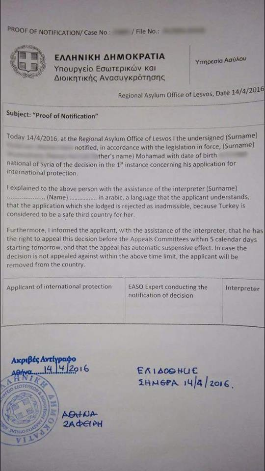
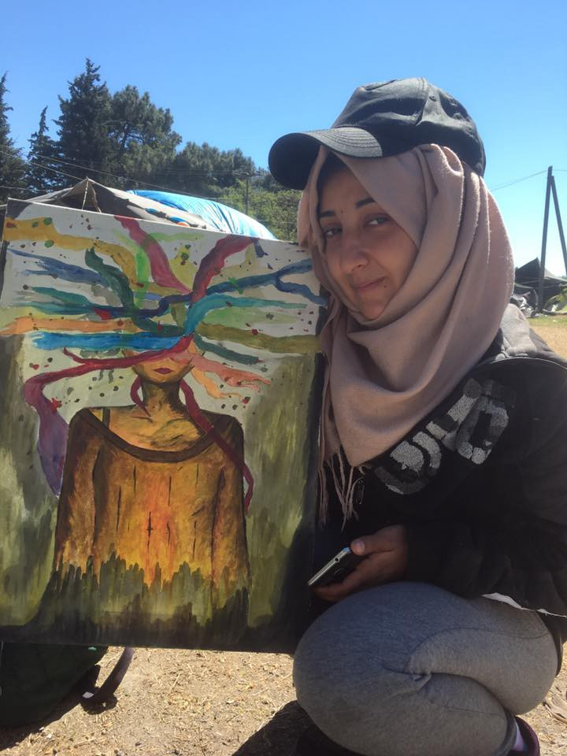

### AYS DAILY NEWS DIGEST 15\.4\.2016
#### Greece refuses to provide asylum for a refugee based on the claim that “Turkey is a safe third country”\. Greek authorities perform clean ups of overcrowded camps ahead of Pope Francis’s scheduled visit\. Statistics show that there are currently 70,000 unaccompanied refugee minors in Germany, 6,000 of whom continue to remain missing\. There have been an additional 3,000 arrivals in Sicily over the last three days\.
#### Greece
### Greek authorities are refusing to provide international protection based on the presumption that Turkey is a safe country\.

> Today we came into possession of a document issued by the Greek authorities \(Regional Asylum Office of Lesvos\) stating the inadmissibility for international protection to an individual’s claim based on presuming Turkey is a Safe Third Country\. If this continues as a practice, the principle of non\-refoulement mentioned in the EU\-Turkey agreement will be most certainly breached\. The document states: 

> _“\(…\) the application that she lodged is rejected as inadmissible, because Turkey is considered to be a safe third country for her\._ 

> _Furthermore, I informed the applicant with the assistance of the interpreter that he has the right to appeal this decision before the Appeals Committees within 5 calendar days starting tomorrow and that the appeal has automatic suspensive effect\. In case the decision is not appealed against within the above time limit, the applicant will be removed from the country\.”_ 

Photo: Vounteer to AYS — Document issued by the Greek authorities \(Regional Asylum Office of Lesvos\) stating the inadmissibility for international protection to an individual’s claim based on presuming Turkey is a Safe Third Country\.

**106 arrived in Greece yesterday as the number of refugees in Greece totals 53,666\.**

> According to the UNHCR, there were 106 reported arrivals yesterday to the Greek islands, and 36 departures to the mainland\. According to their numbers, which are based on the Government data, today there were 46,450 people on sites in the Mainland and 7,216 people in the islands\. According to these numbers, today there were 4142 people at \#Lesvos, 1823 at \#Chios, 772 at \#Samos, 316 at \#Leros, 12 at \#Kalymnos, 44 at \#Kos, 77 at \#Rhodes, and 30 at \#Megisti\. 

> There were 3770 refugees in \#Athens \#Piraeus, 4358 in 3 sites of \#Elliniko, 1502 in \#Eleonas, and 1939 in \#Schisto\. 

> Besides Northern Greece, large numbers of refugees are accomodated in the following camps accross the rest of the country — 1021 in \#Katsika, 578 in \#Filipiada, 809 in \#Larisa \(Koutsochero\), 2009 in \#Pieria \(5 locations\), 1060 in \#Skaramagas, 717 in \#Ritsona, 1100 in \#Malakasa, and 882 in \#Lavrio \(2 locations\) \. 

> In the Northern Greece UNHCR reports the presence of 10392 refugees in \#Idomeni, 1237 at the Polykastro Station, 3963 at \#Nea Kavala, 3983 in \#Cherso, 780 in \#Giannitsa, 816 in \#Alexandreia, 2281 in \#Diavata, 382 in \#Thessaloniki Port\. 

### Seemingly no arrivals in Lesvos today\.

> Volunteers in \#Lesvos report no boat arrivals today to the Northern coast, while no information is available for the South\. 

### Authorities rush to clean up overcrowded Moria camp in preparation for Pope Francis’s visit\.

> Preparations to clean up a refugee camp turned detention center in Moria in advance of the Pope’s visit tomorrow do nothing to address the deteriorating conditions in the center, where 2,900 people are locked up in a facility meant to hold 2,000, reports The Independent\. Save the Children reports conditions for children in the center are appalling\. Volunteers report that the more than half of the refugees have been moved to \#KaraTepe where at least volunteers are able to access them and assist with better food and clothing, as a part of the preparations for Pope’s visit\. Those who are still in \#Moria have been given much better shelter, tables and chairs to sit at to eat meals and a much cleaned, repaired and painted environment\. All graffiti outside suggesting that borders should be opened has been covered with whitewash\. 

### Lesvos mayor wants to turn the site of a volunteer\-run into a holiday resort\.

> On his visit to Lesvos this Saturday, Pope Francis should visit the Lesvos Solidarity Camp \#Pikpa, a volunteer\-run camp that since 2012 has given shelter, care, and comfort to thousands of the most vulnerable asylum seekers who have reached the Greek island of Lesbos by boat, says HRW\. Now the island’s mayor wants to convert this haven into a holiday resort\. Since the beginning of the refugee crisis, Pikpa has become a sanctuary of refuge\. The situation is worse now, since the EU and Turkey agreed to a deeply flawed migration deal last month, by which everyone arriving by boat from Turkey is automatically detained\. Moria is now a detention center where people will not have adequate access to health or psychosocial care or services for young children and persons with disabilities\. Efforts to stop Pikpa’s closure are underway\. The advocacy group Avaaz has started a petition; open for signatures, calling on the government of Greece and the mayor of Lesbos to keep Pikpa’s doors open\. A visit by Pope Francis could also help save PIKPA and its vital efforts to alleviate suffering, HRW reports\. The petition is available through the following link [http://bit\.ly/1TVEZ6F](http://bit.ly/1TVEZ6F) 

**30 refugees in Kastellorizo to be transported to Lero on Monday\.**

> Volunteers in \#Kastellorizo were told that the 30 refugees who remained at the island will be taken to the hot spot in \#Leros on Monday\. Volunteers there report that there have been no new arrivals in nearly 2 weeks\. The ferry companies which run to Kastellerizo are building up to their summer schedule so it is now much easier to get volunteers there at short notice\. 

**28 refugees are being detained at Kos\.**

> 28 refugees are detained at \#Kos right now\. 51 imprisoned refugees were brought to Lesvos and back to Turkey last week\. Flying Help and Kos Solidarity are still providing additional food and clothes for the detained people, whenever the police allow them to\. The planned hot spot is still not ready, even if it was planned to open today\. A new date for its opening is not set yet\. Volunteers report no new arrivals to the island for already a week\. 

### Family of sick child forced to sleep on the street after the hospital was unable to accommodate them\.

> Volunteers in Pireaus report on the case of a family whose child needed a surgery and who were taken to the public hospital where there was no room\. Since there was no room in any of the hospitals or camps, the family was left to sleep in the street overnight, since they could not afford an accommodation\. 

### Donations are needed in a Yazidi\-majority camp\!

> Donations are needed in Camp Petra Olympou in Northern Greece\. There are about 1000 Yazidi refugees from Syria and Iraq accommodated, mostly from Idomeni\. 480 of them are children\. It is a military camp with decent tents but meals are military rations \(bread, small box of something like egg/potato pie\) and a bottle of water, as reported by volunteers\. There is running water at the camp, but camp managers have told people it is not safe to drink\. People complain that there is not enough drinking water\. Also there is no camp staff other than military, so the sanitary conditions are unsatisfactory\. There is no light around the camp as it is dark at night\. There is no electricity in the tent areas\. People are asking for charging stations for mobile phones\. Help is needed\. 

> They need — food, medical supplies, milk for children, blankets, clothes\. The contact number is \+30 698 641 5751 \(Tariq who speaks English, Kurdish and Arabic\) \. 

### Volunteers are needed in the newly\-opened Alexandria Camp\.

> Volunteers report on the \#Alexandria Camp, which is a camp open for only 11 days, it is military run but there is a strong cooperation with the established volunteer group\. On that site, the army prepares the food, but the volunteers have to buy baby food\. There is a measles outbreak and the camp is in need of nurses and doctors\. Refugees in general report that the present medics are very busy\. Volunteer group has secured funding to renovate the abandoned buildings on site, and there is a plan for refugees\-run shops and a communal kitchen\. Everyone is registered and has a ration card, so there are lists to ensure that everyone gets the right amount of food\. The army prints lists with the size of shoe and clothes for volunteers so they can get exactly what is required\. The nearest hospital is 45km away\. It is not allowed to make fires in camp so no one can cook\. Inside the tents people seem to mostly sleep in camp beds\. UNHCR is present on site apparently 3 times per week; however the refugees do not know anything about their asylum rights\. There are snakes, as everywhere\. 

### Nea Chrani makes a call for medical volunteers\.

> However, at the \#NeaChrani location, at 40 minutes distance from Alexandria camp, no medical coverage now\. Allegedly, they had volunteer doctors who started demanding money\. So, there is a need for doctors and nurses in Nea Chrani that can stay 2 weeks or more — please help if you can\. 

### Volunteer groups in Idomeni release a statement after a spate of arrests\.

> 14 groups of independent volunteers in \#Idomeni have shared their General Statement today\. They respond to the accusations by the media and the politicians for inciting violence or spreading false information among the refugees\. They say: 

> “We believe that spreading false information amongst a vulnerable population is immoral, gives false hope and only causes more harm\. These false accusations have only resulted in the increase of police activity and the unjustified arrest and detention of at least 25 volunteers in recent days\. These actions only reduce the already limited access the refugees in Greece have to basic needs such as; food, hygiene, medical care, shelter and education\.” 

### Volunteers in Idomeni have set up a school for refugee children\.

> News that Moves reports that a group of volunteers have set up an informal school for refugee children at the Idomeni camp\. According to the Greek news agency ANA\-MPA, at the makeshift ‘Idomeni cultural centre’ daily classes includes math, Kurdish and Arabic language\. Courses for adults are also held\. Refugees who have studied math, science or languages are teaching in the school\. Volunteers are giving children English and German language classes\. 

Photo credit: Marielle Schilder — Syrian art in Idomeni, Greece, created by Wisam Mdw
#### TURKEY

**30 thousand refugees are beginning the journey to Turkey\.**

> Up to 30,000 refugees started heading to Turkey during the last 48 hours, Spiegel Online reports based on information provided by the volunteers\. This follows several attacks by IS at refugee camps in Northern Syria\. But Turkey refuses to let them to cross the border\. As already known Turkey is building a 911km long cement wall along the border which is said to resist missile attacks\. According to Human Rights Watch one third of it has been finished\. 

#### SERBIA
### Refugees remain stranded on the Serbian\-Hungarian border\.

> Migszol volunteers asked the Serbian and Hungarian Authorities and UNHCR on both sides to facilitate access for NGO’s and Volunteer groups to the stranded people in \#Kelebija and \#Horgos\. Between 60 to 200 people have been waiting in front of the two official Transit Zones on the Hungarian\-Serbian border for days, some of them for weeks\. The Hungarian authorities reduced the number of accepted daily entrances from 30 to 20 recently and often they accept only 12 or 15 people\. Usually they chose one or two families, take them in and close the doors for another day, volunteers report\. During the last few days, the practice was that they let only Syrian or Iraqi families in\. The Afghan, Pakistani, Iranian, Somali families are left waiting, and eventually return exhausted to Belgrade\. One Afghan family has been stranded there for 4 days with several small children\. The mother is pregnant\. They have been talking to UNHCR on both the Serbian and the Hungarian side with no success\. So far only MSF and UNHCR get access to the people stranded on the Serbian side of the Hungarian transit zone\. No other support structures are in place\. Nobody is allowed to hand out tents, which means that people are exposed to all weather conditions\. There are no sanitary facilities at all\. The situation is deteriorating daily\. 

### Hundreds of refugees are making their way into Belgrade daily\.

> In \#Belgrade, Migszol witnessed 200–300 new arrivals daily during the last week \-numbers are increasing, not decreasing, volunteers say\. Most of the newly arriving people come through Bulgaria, where they have been jailed and tortured, chased through forests, walked for many hours and lacked food and water\. Nevertheless, NGO’s are planning to withdraw in many places, closing their missions, while numbers show that the need for support is increasing\. 

### Police performed a raid on a house where several undocumented refugees have lived for months\.

> Serbian media B92 reports that on Friday morning police officers forced their way into a house in Sinjska Street in Belgrade where a group of refugees had previously barricaded themselves\. They were searching the house and talking with the people in the yard, before taking 16 of them to a police station where they were interviewed\. No incidents occurred during the intervention\. B92 learned that the 16 refugees lived there for months, with the number sometimes reaching 50 people, and that they have no documents\. Women and children are among the group\. According to unofficial information, the owner of the house lives in Germany, while “his son occasionally visits the house\.” 

#### CROATIA
### Slavonski Brod camp was closed today\.

> On April 15th, the Croatian transit camp \#SlavonskiBrod was closed\. This camp, which was officially able to host around 5000 people, was intended to be a transit camp, but since the push\-backs at the Route and since the Route’s closing, it became a detention center for over the 300 refugees stranded there, among whom there were minors\. During the last couple of weeks, many of them applied for asylum in Croatia\. Croatian authorities have closed the refugee camp due to its inadequacy in serving the needs of refugees who aim to remain in Croatia in the long\-term\. The last 62 refugees accommodated at the camp did not seek asylum in Croatia — they were transferred during the last couple of days to the asylum seeker center in Zagreb \(Porin Hotel\), asylum center in the town of Kutina and asylum center Ježevo \(single men\) \. Are You Syrious? and Welcome Initiative volunteers are in touch with the people in these centers\. 

### A family from Afghanistan has been deported from Austria\.

> _Volunteers report that a family from Afghanistan was deported from Austria to Croatia today\. They were in Austria for 6 months\._ 

#### AUSTRIA

**27 refugees found in the back of a truck as the Austrian media raises the concern that smuggling has steadily been increasing\.**

> The Austrian media reported that the police rescued 27 refugees from Iraq and Afghanistan, including 16 children and a teenager, out of a truck cargo bay in \#Rohrbach in Upper Austria about 20 kilometers from German border on Monday\. The smuggler was arrested\. 

> Austrian media also report that trafficking has strongly increased in the Eastern Austria during last weeks, according to Federal police\. In April this year 44 cases of smuggling have been reported only in the Upper Austria\. Police suspects that the small groups of people \(usually 8 to 10 persons\) are brought to Austria in small trucks or transporters from Hungary\. The desired destination was Germany\. On Thursday night, 43 refugees have been brought to Burgenland\. The authorities expect a massive increase of smugglers\. 

**160 million Euros to be transferred by the Austrian government to World Bank in a bid to provide refugee relief in the Middle East\.**

> The Austrian government wants to transfer 160 million Euro to the World Bank’s International Development Agency \(IDA\) over the next nine years, starting from 2017, which makes about 15 million Euros per year\. Several media outlets report that this money is meant for refugee relief in the Middle East\. The Austrian council of Ministers is supposed to accept this proposal next week\. \(source: Tiroler Tageszeitung\) 

### **Austrian president rebukes “misleading” rumors of a border closure with Italy\.**

> According to The Huffington Post, Austrian President Fischer declared: “Rumors about a border’s closure between Italy and Austria are false and misleading\. ” Fischer claims that without the adequate protection of the European external borders, Austria is forced to adopt further measures to stop the flow of peoplepeople, whose identity and motivations are unknown, coming in unlimited numbers from non\-EU countries\. EU Commissary for Internal Affairs Dimitris Avramopoulos disagrees on Austria’s intentions\. He argues that these initiatives put the Schengen agreements at risk\. He formally demands that Austrian ministry Mikl\-Leitner an adequate report stating what is going on at the border and why\. According to Avramopoulos, verifications of identity are “total”, and no hints suggest that massive migrants’ flows are shifting from Greece to Italy\. 

#### ITALY

**34 associations write an open letter protesting the government’s closure of an underground passage\.**

> _Messaggero Veneto_ , a regional Italian magazine, reports that thirty\-four associations for the rights and assistance to migrants wrote an open letter against the responsible people for the decision of closing an underground passage, currently used as shelter by refugees\. The signatures of citizens are currently being collected\. President of the border region Friuli Venezia\-Giulia and the associations accuse Austria for the decision of a wall, and they blame Italy for not supporting refugees, as they had previously requested\. 

### Italian Prime Minister seeks EU coordination to prevent large scale departures from Libya\.

> According to the Italian RAI, the Italian Prime Minister Renzi submitted a letter to the EU Parliament where he argues that the management of the migrants’ flow is unsustainable without a thorough and participated cooperation with the departure countries\. Substantially, Italy urges the EU Parliament to speed up the process of liaising with countries such as Libya, in order to avoid massive migration\. He proposes to deliver financial resources to the transit countries, to block illegal migration, to manage an extraordinary plan of repatriation, and to support legally, logistically, financially and structurally the partner countries in screening migrants \(distinguishing refugees and economic migrants\) \. 

**2000 refugees have arrived in Sicily over the last three days\.**

> Volunteers report that there were lot of arrivals in the last three days — more than 2,000 people arrived to Sicily\. Southern Italian hotspots are already full, it seems that the people are stuck there\. Volunteers have the information about the people who were able to escape\. They also report very difficult conditions for volunteering in the island of \#Lampedusa at the very south of Italy, due to the large number of soldiers in the harbor\. According to the volunteers, a lot of people use Bozen/Bolzano as a transit zone to travel to Munich from Sicily and the rest of the Southern Italy\. Volunteers report that currently there are no people in transit, but that they are all stopped in southern Italy\. 

#### GERMANY
### 70 thousand unaccompanied minor refugees are living in Germany\. 6000 remain missing\.

> Nearly 70,000 unaccompanied minor refugees are currently in Germany — more than twice as many in comparison to the last year\. Since they are considered to be particularly vulnerable, intensive supervision is supposed to be provided by the social workers for minors\. The reality is rather different\. Because of the sharp rise in numbers, the staff is inadequate in many areas\. “In certain cases, a guardian looks after 100 minors” Around 6,000 children and young people are still missing, reports Huffington Post\. 

#### FRANCE
### Donations are severely needed to help feed refugees in Paris\.

> Volunteers in \#Paris report that the refugees there urgently need food\. They say that the situation is critical and that many of these people have not eaten in days\. Food delivery is dependent on local volunteers and it is scarce, which is causing conflicts among the people — volunteers report that last night the police tear gassed the refugees after one such conflict occurred\. If you can help, please contact @Ruhi Loren Akhtar\. 

> Refugee Aid Network based in the north of England will send a team to Calais next week with vital supplies and they also have a team at the Turkish\-Syrian border distributing food and other items\. 

> if you are able, please donate — [https://crowdfunding\.justgiving\.com/thasab\-maqsood\-5](https://crowdfunding.justgiving.com/thasab-maqsood-5) 

#### NORWAY

**1500 refugees from Italy and Greece to be brought over to Norway over the course of two years\.**

> According to Norwegian newspapers Aftenposten, Norway has signed an agreement with Italy and Greece to bring out 1,500 asylum seekers over two years\. It is part of the EU program to remedy the situation in the two countries\. EU’s own member states have failed their efforts and has only accepted a small number of refugees: 160,000 were to be moved from Greece and Italy over two years\. To date, only 1,145 people has been able to travel to another EU country\. Also Norway has promised the EU to take refugees\. Undersecretary Berger Røsland confirms that the agreement for the relocation of asylum seekers to Norway is signed — 1500 refugees who have come to Greece and Italy are to be moved to Norway\. 

**Be sure to like and follow us on [Facebook](https://www.facebook.com/areyousyrious/) and [Twitter](https://twitter.com/areyousyrious) \!**

_Converted [Medium Post](https://areyousyrious.medium.com/ays-daily-news-digest-15-4-2016-84c328f712b2) by [ZMediumToMarkdown](https://github.com/ZhgChgLi/ZMediumToMarkdown)._
