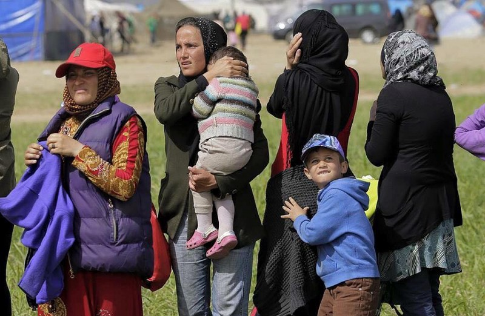
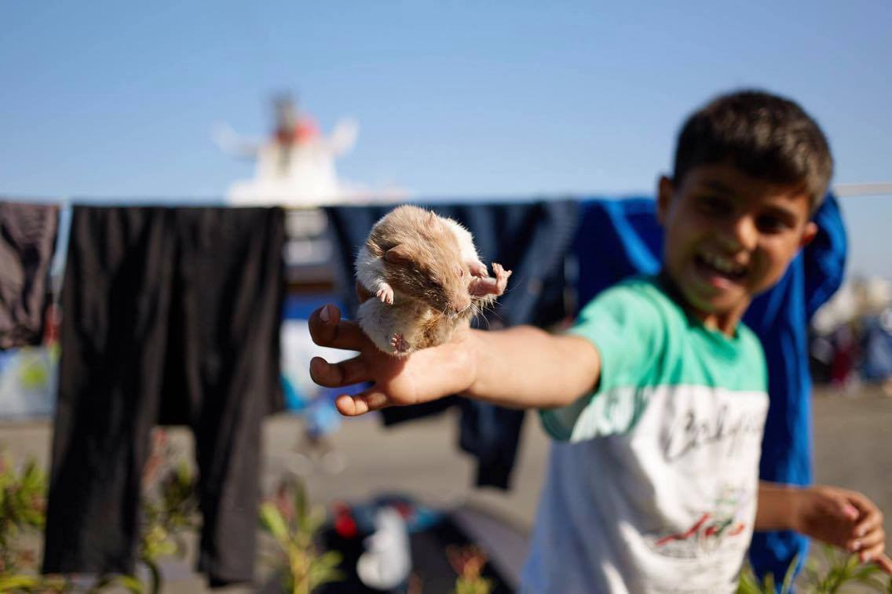

### AYS DAILY NEWS DIGEST 16\.4\.2016
#### Today, the body of a girl believed to be a 3\-year\-old Syrian refugee was found in a fisherman’s net in Turkey\. Pope Francis visited Lesvos — volunteers asked for a condemnation of the EU\-Turkey Deal\. War refugees frightened by the military exercise in Idomeni attempted returning to the Port of Piraeus , but entrance denied\. Switzerland is preparing to station tank battalions on its border with Italy\. The European Court of Human Rights opened the case against Macedonia and Greece\.
#### TURKEY
### Body of a three year old Syrian girl found in fishermen’s net\.

> The body of a girl believed to be a three\-year\-old Syrian refugee has been found in a fisherman’s net off the coast of Turkey, reports Orient\-News\. The fishermen, from the \#Foca district of \#Izmir, were sailing offshore in the \#Aegean Sea when they pulled in their nets to find the little girl’s body, along with a pile of clothing\. The body was handed over to local police\. 

### **_Syrian refugees are being exploited as seasonal agricultural workers by the Turkish landowners\._**

> Volunteers from Turkey reported on the cases of exploitation of Syrian refugees who have become seasonal agricultural workers by the Turkish landowners\. They are paid in a lump sum at the end of the season, and are given a small piece of land to set up camps to live in\. In the meantime, all food and goods that they need are purchased at a nearby market on a credit system\. The market, which is owned by the landowner, charges them twice the normal price for goods\. The workers believe that at the end of the season they won’t be paid anything because of how much they owe the market\. There is no school for the children\. They do not have running water\. Each building or tent is allowed one light bulb and one power outlet\. Each day they work, each worker must pay 5 Turkish lira \(about 2 US dollars — the cost of a meal\) to a “commissioner” as a fee for finding them work\. Raising awareness on these issues and cases by the organizations and the journalists taking pictures of the conditions in which the refugees live and work has angered the landowners who claim these stories are painting a negative picture of Turkey, and have again, threatened to kick the workers off the land if more photos are taken\. 

### Help needed in Torbalı Camp in the face of possible expulsion by Turkish police\.

> Volunteers of Team ResCO have sent the appeal for help in \#Torbalı camp\. The Turkish police is trying to remove refugees from this area\. According to Evrensel, the gendarmerie went to the informal Torbalı camp and warned that refugees must evacuate the area within 5 days and return to the camps where they are registered\. They explain that if they must, the police will be called to forcefully remove the refugees after this date\. Those who do not have an ID will be handed to the immigration office\. The needs refugees are in need of food, medical supplies, milk for kids, blankets, clothes\. There are more than 631 Syrians, many pregnant women and many children\. 

#### GREECE
### There were today 53,670 refugees stranded in Greece\.

> According to the Government sources, there are 7242 refugees at the islands and 46428 refugees at the Mainland\. There are 4142 refugees at \#Lesvos, 315 at \#Leros, 772 at \#Samos, 1850 at \#Chios, 44 at \#Kos, 96 at \#Rhodes, 11 at \#Megisti and 12 at \#Kalymnos\. There are 14761 refugees in \#Attica\. 

> In the Northern Greece the Goverment reports the presence of 10392 refugees in [‪\#‎Idomeni](https://www.facebook.com/hashtag/idomeni?source=feed_text&story_id=611189052363315) , 3965 at [‪\#‎NeaKavala](https://www.facebook.com/hashtag/neakavala?source=feed_text&story_id=611189052363315) , 3983 in [‪\#‎Cherso](https://www.facebook.com/hashtag/cherso?source=feed_text&story_id=611189052363315) , 2298 in [‪\#‎Diavata](https://www.facebook.com/hashtag/diavata?source=feed_text&story_id=611189052363315) , and 1021 in \#Katsikas\. 

### Seemingly no arrivals in Lesvos\.

> Volunteers at \#Lesvos report no boat arrivals to the Northern coast, while there are no information available for the South\. 

**12 Syrian refugees return to Rome with Pope Francis after he visited Lesvos today\. He made a call for for people of all religions to help the refugees\.**

> Pope Francis made a visit to Lesvos on Saturday and took 12 refugees from Syria, including six children, with him back to Rome aboard the papal plane\. The refugees taken to Rome were three families whose homes had been bombed in the Syrian war, the Vatican said in a statement as the Pope departed the Greek island of Lesbos\. The Vatican will care for them\. 

> “We ask religious communities to increase their efforts to receive, assist and protect refugees of all faiths, and that religious and civil relief services work to coordinate their initiatives\. For as long as the need exists, we urge all countries to extend temporary asylum, to offer refugee status to those who are eligible, to expand their relief efforts and to work with all men and women of good will for a prompt end to the conflicts in course,” says the Lesvos Joint Declaration by Pope Francis, Ecumenical Patriarch Bartholomew and Archbishop Ieronymos of Athens and All Greece\. 

> “We respectfully remind you that this is primarily your duty, as the pastor of the Universal Church, as well as ours, and that, however the world may judge you, still it is our duty, to call evil what it is, and we ask you on behalf of our brothers and sisters detained in the Hotspots and Removal Centres in Greece and Turkey now, subjected to systematic violations of their Human Rights and denial in practice of their intrinsic human dignity, to condemn the EU\-Turkey Deal and to call Europe back to its senses\.” wrote volunteers in an open Letter to Pope Francis\. 

> During Pope’s visit, a group of activists was handing out leaflets condemning the EU\-Turkey Deal, informing on the obstruction by the authorities to ensure fair asylum procedure and warning about the conditions in the detention centers\. 

### Volunteers needed in Skala Sykamineas for cleaning effort\!

> Lighthouse Relief in Skala Sykamineas is seeking Environmental volunteers for cleaning the beaches and the shorelines on foot, with ropes and by boat\. Volunteers meet every morning, Tuesday to Sunday, at 9:45 am at Lighthouse Relief Camp\. For more info contact: [environment@lighthouserelief\.org](mailto:environment@lighthouserelief.org) 

### Greek Defense Minister reports that Piraeus will be cleared of refugees by Easter\.

> According to Greekreporter\.com, deputy Defence Minister Dimitris Vitsas announces that “Piraeus Port will see the transfer of refugees and migrants to other areas by Easter, while at the same time the situation in Idomeni as well as in Elliniko, will begin to normalize”\. Of the 3,600 refugees that will remain at Piraeus until Monday, 2,000 will be sent to \#Skaramangas and other accommodation spaces — 1,600 will be transferred by the end of next week\. It is said that the camp and accommodations at Skaramangas can currently hold up to 4,000 people\. Transport of refugees to this location is likely to occur on Thursday\. 

Photo: Let’s Help Refugees in Europe — Syrian refugees reaction when they have heard a jet flying over Idomeni as part of a Greek military exercise\.
### Idomeni military exercises shock refugees into returning to Piraeus Port\. Security at the port has increased, and pharmacy translators are needed\.

> Volunteers inform us that as a result of the military exercises yesterday and two days ago at the Greek\-Macedonian border, many of the war refugees who were frightened consequently returned to the port of Piraeus but were not permitted to enter if none of the residents of Piraeus could identify them\. Today the metal gates allowing pedestrians and traffic into Piraeus were mostly closed, with entry points only being at E7, E2 and E1\. This morning police guards stood at each gate and controlled who enters and leaves\. Those refugees with stamps had no problems entering or exiting\. Stamps are a certificate that they live there — that they are registered\. Yesterday even those not registered could come in when someone had “identified” that they live there\. This is valid for the whole port of Piraeus\. There is a fence around certain gates that were previously unattended\. The police have begun stamping the papers of refugees staying in the port in an effort to quantify the current population, and also prevent those returning from camps such as Idomeni setting up in the area, as officials still want Piraeus cleared by the end of April\. Translators \(Arabic and Farsi\) are in desperate need by the pharmacy department at E1\. Anyone who is able to help is asked to contact Team Brit\. 

**1000 refugees at Skaramangas camp\. Volunteers needed to help distribute supplies and provide activities for children\.**

> Volunteers report on the conditions in Skaramangas, the new camp near Athens\. There are about 1,000 refugees there at the moment but room exists for 6,500\. This camp is staffed by the military \(Navy\) but is very open and accessible provided one has ID\. The camp itself is quite clean albeit barren\. Each family has a trailer with beds, toilet and shower\. The military and a social kitchen provide food\. The need there is for volunteers \(at least one or two should be long term\) to help distribute supplies\. It would also be good to set up activities for the children who are pretty bored\. There are at least 3 large tents for activities or socializing\. 

Meet Rahaf, the refugee hamster living in the flower beds in on of the gates at Piraeus\. Photographer: Erica Schroeder
### Volunteers needed to distribute aid from Elliniko warehouse\.

> Volunteers are needed urgently to assist with the task of sorting donations in \#Elliniko warehouse\. Plans are to start distributing aid to other camps as soon as possible\. Please contact Team Athens, who can direct you accordingly\. 

### Random police arrests occurring at Idomeni, arbitrarily based on various belongings\.

> In \#Idomeni, volunteers report on police repression at many points of the camp, including the repression by the secret police\. Detentions and arrests are quite random but for the moment they have used as excuses pocket knives, farsi papers, walky\-talkies, and pepper sprays, volunteers report\. 

### Idomeni volunteers needed to establish a dental clinic\.

> Volunteers want to set up the first dental clinic at the Idomeni \(Greece\) camp in response to an urgent call for an emergency dental unit\. If there is anyone who has the time and is able to come and help set this up, dental or non\-dental please do get in touch via e\-mail if you have questions: [dental@healthpointfoundation\.org](mailto:dental@healthpointfoundation.org) 

**250 Syrian, 60 Iraqi refugees at Nea Chrani in urgent need of medical staff\. Scabies are widely reported\.**

> The very useful resource, Greek Mainland Camps Report, informs us on the urgent needs for medical staff at \#Alexandria and \#Nea Chrani — so please, help if you can\. Nea Chrani location is a public stadium with the capacity for hosting 310 people, controlled by military and with police present on site\. The previous plan to transfer all residents to Petra was scheduled to be complete on April 15th but has now been given a four day extension\. There are 250 Syrian and 60 Iraqi refugees there, 110 of whom are children and pregnant women\. There is a feeling of lack a of support from the municipality, which does not help with sewage issues\. Scabies is widely reported and medical personnel are no longer on site\. 

**2040 residing at Diavata camp, most undergoing asylum process\.**

> A report brings updated information on Diavata camp, which is an open facility, but with a 10pm curfew\. Police control the entrance, and there is some military presence\. The report states 2,040 residents \(which is less in comparison to the Government data that indicates 2,298 people present as of 16/04/2016\) \. The residents of the camp are mainly Iraqi and Syrian, but also Palestinian, Afghan, Kurdish and Iranian refugees\. Most of them are in the process of asylum\. The report states that the camp is very clean and well organized\. However, there is no wi\-fi and there are snakes, and many charging points are outdoors and unsheltered, thus unsafe in the rain\. 

> The entire report is available at [http://bit\.ly/1SKbzDo](http://bit.ly/1SKbzDo) 

#### MACEDONIA
### **_Volunteers report on trafficking in Macedonia\._**

> Volunteers report that although the camps and the borders in Macedonia are closed, the refugees find ways to continue their trip — with smugglers\. The price is 1500 euros per person, according the refugees\. Around 300 people have left the camp in Tabanovce\. 

#### SERBIA
### Reported increase in refugees from Sri Lanka and Somalia\.

> Info Park reports an increase in the number of refugees from Sri Lanka in \#Belgrade during the last couple of days\. Unconfirmed information claims an increase of Somali refugees as well\. The estimates are 10 people daily\. 

### Furniture needed for Belgrade squat\.

> No Border Serbia needs pillows, blankets, chairs, tables, mattresses, armchairs for establishing a new squat in Belgrade\. Contact number is \+386616450529 

**2000 refugees stuck in Serbia, with few asylum applications being accepted\.**

> According to the Centre for Protection and Assistance to Asylum Seekers, around 2,000 people from Middle Eastern countries remain “stuck in Serbia after closing the “Balkan route””, as reported by Novi Magazine\. The problem is that around 540 people remain in detention centers, while a large number of people remain unprotected because they are trying other methods of reaching Western Europe\. “A large number of them in parks, they are those who continue to illegally enter Serbia or they just stuck here\. About 75% of people now use the route Turkey\-Bulgaria\-Serbia and want to get to Hungary” said Radoš Đurović, Director of the Center\. According to him, in the first three months of 2016, 1886 people expressed the hope to get asylum, there were 262 applications, and asylum has been granted in 13 cases and 90 refugee identity cards have been issued\. 

#### ITALY
### Donations needed for publishing info guide for migrants\. Tigrinya translators also sought\.

> Welcome to Europe has prepared the print versions of our brand\-new info guide for migrants traveling to, through and from Italy \(in English, Italian and French\) — [http://bit\.ly/1SdLmhj](http://bit.ly/1SdLmhj) Versions in both Arabic and Farsi will be published coming soon, and W2E is still looking for translators for a Tigrinya version\. Please contact them if you can help or you know someone who can\. W2E are printing the guides and will distribute them to their contacts and to the refugees\. They urgently need some donations for this purpose: 

> In Europe: Associazione SOS Diritti — IBAN: IT08S0307502200CC8500358574, NOTE: W2ITALY 

> In Switzerland: Watch The Med Alarmphone Schweiz, PC: 61–172503–0, IBAN CH21 0900 0000 6117 2503 0, NOTE: W2EU 

**5664 arrived in Italy recently, 357 rescued from voyage departed from Egypt\.**

> This week’s arrivals to Europe are mostly headed to Italy according to IOM, as reported by Sputnik\. Some 5,664 have arrived in the past three days since IOM last reported arrival figures on Tuesday, with another 357 arriving in Messina, Italy\. These 357 migrants were reportedly rescued at sea from voyages leaving Egypt\. Over 24,000 migrants have been rescued in the Channel of Sicily in 2016, while an estimated 352 are missing, according to IOM\. 

#### GERMANY
### Stricter laws on asylum in effect in Germany, granting only subsidiary protection for refugees not “personally persecuted” by war\.

> The stricter law package on asylum \(asylum package 2\) has been passed in February this year in Germany and it has changed the situation for all refugees, including Syrians\. The law sets stricter rules for granting asylum, where escaping war is apparently not a sufficient reason to grant asylum\. The law stipulates that if refugees are facing danger only because of war in general and are not being personally persecuted, they may receive subsidiary protection\. Today it was confirmed that at least 7 Syrian refugees in one of the camps in Germany were granted subsidiary protection \(not asylum\) \. This practice will have a strong impact on the family reunification procedure that could take as many as 4 years\. 

#### SWITZERLAND
### 2000 Swiss soldiers on standby at Italian border\. Austria planning to close its own border with Italy\.

> Switzerland is preparing to station tank battalions on its border with Italy, in order to prepare for what one security director calls a “migrant onslaught”, Swiss media reports\. Approximately 2000 soldiers are on standby\. The news comes on the heels of information that Austria is planning to close its border with Italy\. 

#### THE NETHERLANDS
### Hunger strike begun at Havenstraat last Tuesday\. COA has reacted with increased repression and security measures\.

> Calais Migrant Solidarity \(No Borders\) reports on major problems with the emergency in Havenstraat in Amsterdam\. Since last Tuesday, April 12th, several dozen residents begun a hunger strike\. They no longer sleep in the former detention center, but on the forecourt in the outdoors\. The unrest among residents was caused because no progress is made in their asylum cases\. The residents have been living at Havenstraat since October, sometimes even September 2015\. The only contact with the IND consisted of taking fingerprints\. After that, nothing happened\. Most of the residents would like to bring over their families, but family reunification may be requested only after a status has been obtained\. Since many families are living in uncertain and dangerous situations in Syria, the concerns grow\. There is also dissatisfaction with the living conditions at the Havenstraat\. The location Havenstraat was commissioned by the municipality of Amsterdam, run by the Salvation Army\. As of April 1st, the management was acquired by COA\. Since then, the possibilities for neighbors to provide voluntary support has been greatly reduced\. The residents may no longer cook for themselves\. The centrally controlled food is qualitatively and quantitatively insufficient\. Early last week, residents have written a petition calling for acceleration of the procedures, and for an interview with COA and IND\. There was no reaction\. Then the residents decided to start the hunger strike and camp outside the building\. COA reacted with enhanced safety measures: more access controls, no items \(like blankets\) from inside to outside, and a ban on photographing\. The plastic roof mounted by residents over the sleeping places in the open air, is damaged; security tears it down every morning\. 

#### GENERAL
### Case opened against Greece, Macedonia in response to brutality at Idomeni\.

> The European Court of Human Rights opened up the case against Macedonia and Greece for last Sunday’s teargas bombing, plastic bullet shooting and torturous unannounced military exercise yesterday — all of it at Idomeni Camp\. They still did not find room for indicating an urgent measure at this point\. The applicants, women fleeing war alone with their children, in their majority, are invited to complete their submissions by May 9th\. 

_Converted [Medium Post](https://areyousyrious.medium.com/ays-daily-news-digest-16-4-2016-a9eae92fdfae) by [ZMediumToMarkdown](https://github.com/ZhgChgLi/ZMediumToMarkdown)._
