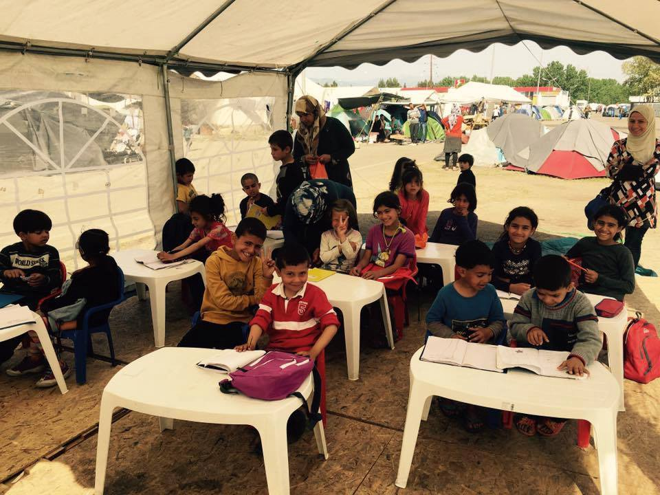
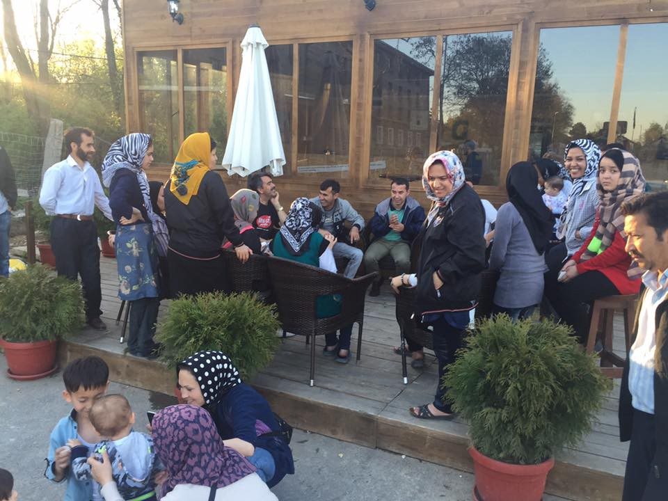

### AYS DAILY NEWS DIGEST 17\.4\.2016
#### While Greece is still coping with 53,805 refugees stuck in the country, including those in severely overcrowded camps, a German politician has proposed IQ tests for the refugees in order to “speed up integration”\. 54% of Syrian refugees in Lebanon remain undocumented because of prohibitively high costs\.

Refugee child peeking through the wire fence in Idomeni\. Photo: Nima Yaghmaei Photography
#### LEBANON

**56percent of 1\.1 million Syrian refugees remain undocumented, can’t afford registration\.**

> Many Syrian refugees in Lebanon say their lives have grounded to a halt since new measures have made it almost impossible for them to obtain or renew their residence permits\. According to AFP, by the end of March 2016, 56 percent of them had no valid residency permit\. Because Lebanon has not signed the 1951 UN Refugee Convention, it treats Syrians as foreigners, not as refugees\. Rules adopted in January 2015 require Syrians to either register for residency through the UN \(on condition that they pledge not to work\), or through a Lebanese sponsor\. Unlike other nationalities, Syrians also have to provide proof of their address\. To renew the permit every year, Syrians over the age of 15 must each pay $200, which is unimaginable for those unemployed\. The United Nations is warning this situation is leading to a rising number of newborns going unregistered\. 

> With more than 1\.1 million Syrians and 450,000 Palestinians registered as refugees in Lebanon, the tiny Mediterranean country is home to the world’s highest refugee\-to\-resident ratio\. 

> French President Francois Hollande met with Syrian refugee children in eastern Lebanon today, announcing 100 million euros \($113 million\) in assistance to the country over the next three years\. 

#### GREECE
### Chios, Lesvos, Northern camps are over capacity\.

> There were only 55 new arrivals registered yesterday, while we haven’t received any reports of refugee boats arriving to Greek islands today\. This morning, there were 7,330 refugees on Greek islands, with Lesvos \(4,124 refugees\) and Chios \(1,928 refugees\) breaching their hotspot capacities\. According to UNHCR, there are 46,475 refugees in the mainland Greece, including 10,365 in Idomeni and additional 1,237 on nearby EKO gas station in Polykastro\. Northern camps Cherso \(3,983 refugees\) and Nea Kavala \(3,968 refugees\) are both beaching their capacities\. 

### Help clean up Lesvos beaches\!

> Amazing Lighthouse Relief team from Skála Sikaminéas, [‪\#‎Lesvos‬](https://www.facebook.com/hashtag/lesvos?source=feed_text&story_id=611938412288379) , [needs volunteers for cleaning the shoreline](http://bit.ly/1qRdKin) , in an attempt to restore the natural paradise of Lesvos to its former glory\. They meet every morning, Tuesday to Sunday, 9:45 am at the Lighthouse Relief Camp\. You’ll need to bring food and water, sun protection and confortable clothes /shoes\. If you have a 4x4 car or a boat, that’s a big plus\! 

### NGOs welcome to Petra Olympou camp\.

> Accodring to a doc compiled by a mixed team of independent volunteers, Petra Olympou camp needs long\-term volunteer support\. The camp is open\-type facility run by the military, but NGO’s with valid registration papers should be able to get their own space inside the camp\. At the moment, refugees are complaining about only one \(male\) army doctor, but independent assessment of medical provision is still needed\. Some refugees have also reported lack of quality food\. 

### Polykastro, Idomeni need long term volunteers\.

> The wonderful Eko Team is seeking long term volunteers at EKO gas station in [‪\#‎Polykastro‬](https://www.facebook.com/hashtag/polykastro?source=feed_text&story_id=611938412288379) \. They run the school, the child friendly space, the women’s tent and also outdoor activities\. It may sound like a lot, but it’s a small camp of around 2,000 people and is very manageable with the right people\. They are also looking for a group of people who would like to continue with this project\. If you are interested, please write to: phoebegilpin@hotmail\.co\.uk 

> Long term volunteers are also needed to keep the Tea Tent in [‪\#‎Idomeni‬](https://www.facebook.com/hashtag/idomeni?source=feed_text&story_id=611938412288379) Camp and the one at the EKO gas station upand running\. The tasks during a shift vary a lot, you either cook the tea, give it out, controll the lines or can get creative and build a ‘square\-ish area’ outside the tent for people to sit and calm down while drinking their chai\. If you feel like this is something you want to be part of please write a few lines about your motivation to come and how long you’ll be willing to stay as a [message to their FB page](http://bit.ly/1Vx0Frx) \. 

Makeshift school at EKO gas station in Polykastro\. Photo: Phoebe Gilpin
### Container or a shed needed in Idomeni

> The Idomeni Cultural Center is in urgent need of a lockable storage container or shed \(ideally at least 2 or 3m on each side\) to securely store classroom supplies and donated materials during the night, so they don’t have to staff it 24 hours a day\. Idomeni Cultural Center is an independent volunteer\-initiated project\. You can learn about them and [send your offers for donations to their FB page](http://bit.ly/23QsXyf) \. 

#### MACEDONIA
### Refugees stuck in Macedonia, which didn’t participate in EU\-Turkey Agreement

> Macedonia is not a part of the agreement between the EU and Turkey, and therefore refugees who are stuck on their territory can not be returned to Turkey under the terms arranged in Agreement\. They also can’t continue their trip to Serbia, as the border is closed, and can’t be returned go Greece, as their officials won’t accept them\. Macedonian Interior Ministry complained to the local press that, “they have tried to negotiate a solution for the refugees stuck in their country but so far they had no positive response\.” 

> At the moment, refugees have the opportunity to seek asylum in Macedonia, but many don’t want to use this option, so they remain in the limbo of refugee camps\. The other option is to register in a voluntary return program\. This is supported by the International Organization for Migration \(IOM\) and refers to voluntary return to countries of their origin\. Again, not something many would wish for\. 

#### SERBIA
### Refugees still finding illegals ways to cross: travelling with smugglers is NOT advised\!

> Volunteers have reported new refugee tents in [‪\#‎Belgrade‬](https://www.facebook.com/hashtag/belgrade?source=feed_text&story_id=611938412288379) park\. At the same time, up to 350 people are living in [‪\#‎Presevo‬](https://www.facebook.com/hashtag/presevo?source=feed_text&story_id=611938412288379) camp under good conditions\. They are able to go the city during the day\. Every day there are new arrivals who manage to cross the border irregularly and continue through Serbia to reach their goals in Hungary\. According to independent reports, up to 100 people manage to enter Hungary on daily basis\. That being said, we strongly discourage any attempt to travel with smugglers, as it can lead to severe legal problems and even endangering the well\-being of the refugees\. 

Refugees in Preševo camp\. Photo: Youth Office Presevo
#### GERMANY
### Saarland to introduce IQ tests for refugees\.

> The interior minister of the south\-western German state of ‪\#‎Saarland‬ plans to use intelligence tests to find talented refugees and speed up integration\. “We want to start a pilot project that uses intelligence tests to find out where there’s talent and what occupational groups we can directly put the refugees in or what we need to teach them,” Klaus Bouillon told newspaper Rheinische Post on Saturday\. “We’re planning to cooperate with the Federal Employment Agency and other renowned labor experts,” he said\. When asked who would participate in the program, the interior minister said anywhere between 600 and 700 refugees would voluntarily take part in the beginning\. 

> German politicians have for some time been mulling over ways to integrate refugees into the workplace\. But not everyone was impressed by Buillon’s idea\. “The suggestion is the completely wrong approach and isn’t exactly a sign of intelligent thinking,” said Petra Berg, general secretary for the center\-left Social Democrats in Saarland\. 

### Citizens of Wesselig are protesting integration\.

> Meanwhile, citizens in town of ‪\#‎Wesseling‬ are protesting the construction of 28 townhouses to house 300 refugees because of costs they allege will be incurred by taxpayers\. The construction plan was approved by the city council, but a local action group disagrees with the types of shelters that will be constructed as well as with the calculations describing the cost of construction\. Local action groups in other towns in Germany, such as in Hamburg and Essen, oppose large scale housing developments to house refugees\. 

#### FRANCE
### Volunteers needed in Calais and Dunkirk

> Warehouses in [‪\#‎Calais‬](https://www.facebook.com/hashtag/calais?source=feed_text&story_id=611938412288379) need volunteers\. There are still 4,000 people living rough in tents and shelters of Calais\. To volunteer in the warehouse run by French charity L’Auberge des Migrantes / Help Refugees \(15 minutes outside of camp in a suburb of Calais town\) please register [here](http://bit.ly/1NoqwLo) \.
 

> 
 

> To volunteer in Dunkirk please click [here](http://bit.ly/20OhJIX) \. 

_Converted [Medium Post](https://areyousyrious.medium.com/ays-daily-news-digest-17-4-2016-89e1d21e6ba4) by [ZMediumToMarkdown](https://github.com/ZhgChgLi/ZMediumToMarkdown)._
