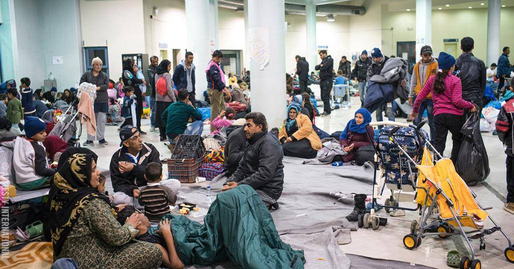
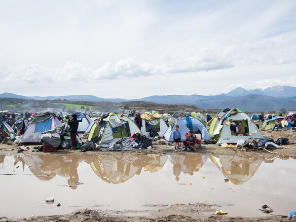

### AYS DAILY NEWS DIGEST 18\.4\.2016
#### 100,000 people are trapped in the Azaz district in Syria\. Greek authorities fear the spread of diseases in Idomeni\. More than 1,500 unaccompanied child refugees in Greece have no safe shelter\. Croatia seeks to criminalize helping foreigners who have no legal right to remain in the country\.

Refugees in a reception center on the Greek mainland\. Photographer: Olga Stefatou
#### General
### Afghans not yet eligible for EU’s relocation plan due to EASO’s calculation of average asylum recognition rate\.

> Amid new reports of mass deaths in the Mediterranean Sea, we once again mourn all those that have lost their lives on the route to Europe\. We unfortunately cannot confirm the number of a suspected hundreds of deaths off the coast of Italy, but even one would be too many\. 

> Meanwhile, the EU’s border agency said there had been “no signs of a significant shift” to the central Mediterranean and Frontex has reported that 26,460 migrants have reached Greek islands from Turkey during March, half as many as in February\. Since April 1st, arrivals are less than 100 a day on average\. Even though we see smaller number of arrivals on Greek islands, the EU’s naval operation in the Mediterranean Sea, Sophia, could be expected to expand as migrations divert from the closed Balkan route, the EU’s foreign relations chief, Federica Mogherini, said Monday\. 

> If you were wondering why Afghans are not yet eligible for the EU’s relocation program, News That Moves reported today on the calculations of EASO that state that the program applies to nationalities who have an average EU\-wide asylum recognition rate equal to or higher than 75%, on the basis of EUROSTAT data for the previous quarter\. Eligible nationalities are updated quarterly\. Afghans have an asylum recognition rate lower than 75% EU\-wide, therefore barring them from eligibility\. Currently, nationals or stateless persons who are residents of Syria, Iraq, Eritrea, Burundi, Central African Republic, Costa Rica, Saint Vincent and the Grenadines, Bahrain, Maldives, and British overseas countries and territories are eligible to participate in the relocation program\. 

#### Syria

**100thousand people trapped in the Azaz district of Syria\.**

> While Europe is calculating, MSF today warns that 100,000 people are trapped in a critical situation in the Azaz district of Aleppo Governorate in northern Syria, caught between an active Islamic State front line, Kurdish\-controlled territories, and the Turkish border\. “Yet again we see tens of thousands of people forced to flee but with almost nowhere safe to go — trapped in this bloody, brutal conflict,” said Muskilda Zancada, head of the MSF mission in Syria\. For more, follow the link [: http://bit\.ly/1MCSiHV](http://While Europe is calculating, MSF today warns that 100,000 people are trapped in a critical situation in the Azaz district of Aleppo governorate in northern Syria, caught between an active Islamic State group frontline, Kurdish-controlled territories and the Turkish border. “Yet again we see tens of thousands of people forced to flee but with almost nowhere safe to go – trapped in this bloody, brutal conflict,” said Muskilda Zancada, MSF head of mission, Syria. For more follow the link http://bit.ly/1MCSiHV) 

Photographer: Fotis Filippou
#### Greece

**66 new arrivals on Greek islands today, 7353 total\.**

> There were 66 new arrivals on Greek islands today until 07:30; 18 on Leros, 14 on Kos and 32 on Samothraki\. This morning there were 7353 refugees on the Greek islands, with 4096 on Lesvos and 1920 on Chios breaching their hotspot capacities\. 

**615 of 66400 asylum seekers in Greece relocated so far, according to Amnesty International Report\.**

> Today Amnesty International published a report reflecting on the situation of refugees in Greece after the border closures\. According to the report, conditions are inadequate in many of the temporary accommodation sites, which are experiencing severe overcrowding, a lack of privacy, no heating, insufficient sanitary facilities, a lack of information on refugee rights etc\. Amnesty International also made a set of recommendations to Greece that include improving the effectiveness of the national asylum system, and improving the mechanisms of systematic provision of information, while also recommending to the EU that they accept asylum seekers from Greece under the EU emergency relocation program\. According to Amnesty, as of April 12th, of the total 66,400 asylum seekers that EU members States agreed to relocated from Greece, only 615 had been transferred\. The complete report is available at: [http://bit\.ly/1TeERgC](http://bit.ly/1TeERgC) 

**2000 refugee children estimated to be unaccompanied and without shelter in Greece\.**

> News That Moves reports that according to Save The Children, more than 1,500 refugee children in Greece have currently no safe shelter and many of them are being held in detention centers and police cells\. Under the law, children can stay in detention centers for up to 25 days, after which they must be moved to a permanent shelter, which is currently not possible due to overcrowding\. There are only 477 sheltered places available for unaccompanied refugee children in Greece\. Save The Children estimates at least 2000 unaccompanied children in Greece with perhaps hundreds and thousands more\. If you are an unaccompanied minor in Greece, please read about your rights at the end of the following page: [http://bit\.ly/23U6mRo](https://newsthatmoves.org/en/?p=2283) 

### No new arrivals in Lesvos\.

> No boats landed in the north in \#Lesvos \(last report being 20:25\), no information is available from the south\. 

### Volunteers call for attention on malnutrition of babies in Vial\.

> Volunteers call for attention concerning the malnutrition of infants in \#Vial, Chios\. This is an ongoing problem and volunteers see no change in official policies in spite of their efforts\. They got in touch with the father of a 4\-month\-old inside the camp who stated that his child receives a ration of only a single bottle of baby formula per day, after which they are forced to feed the baby with mashed up bread which results in indigestion\. The man also informed volunteers that there are 89 children, including 24 infants under six months, who drink liquid milk and are becoming increasingly malnourished\. Volunteers ask everyone to share their post and publicize it further\. Original post available at: [http://bit\.ly/1rbQ34P](http://bit.ly/1rbQ34P) 

**14 arrived in Kos since April 7th\. Families at Oscar Hotel moved out\.**

> Last night came the first arrivals in \#Kos since the 7th of April: 5 women from the Dominican Republic, 8 men from Bangladesh and 1 man of unknown nationality\. They were immediately arrested after their arrival\. Volunteers did not gain access today, yesterday nor the day before to the local prison where most of the arrivals are staying\. They prepared clothes packages for them\.The families \(60 persons all in all\) who have stayed at Oscar Hotel thus far \(paid for by UNHCR for families during the last few months\) had to move out and were brought to another, cheaper hotel\.The hot spot is still not ready\. 

**66 arrivals at Samos, but no indoor space left\.**

> Volunteers at \#Samos report that 66 people arrived today as of 21:45\. After registration most of them came to the distribution cabin where they received clothes, shoes, hygiene items, but also sleeping bags and tents as there is no free space indoors\. 

**82 patients attended to during Orient Bulgaria Foundation’s first day in Polykastro\.**

> The Orient Bulgaria Foundation’s medical team had its first day yesterday on location at the \#Polykastro Eko gas station\. 82 patients were cared for, with free medicine assigned to each to take care of further ailments\. One doctor, a paramedic, two translators, and lots of medicine were available for the refugees at the make\-shift camp\. The team will stay there until April 25th, with a possibility of working in the nearby military camps once medical attention has been provided to the population at Polykastro’s gas station\. 

**355 refugees at Nireas camp\. Mosquitos beginning to pose a concern\.**

> Team Brit visited the camp at \#Nireas yesterday, near Thessaloniki\. Currently 355 refugees are based there, with 40 children under the age of 2 years\. They report that the camp seems very calm, with a small police presence on site \(sign\-in is required to access this camp\) \. There are already swarms of mosquitoes, as we now head into summer and there will likely be a need to raise funds for mosquito prevention in these sorts of camps\. 

### Greek authorities worried about the spread of disease in Idomeni, refugees once again pitch up tents on the railway line\. Team Brit requests information on camps so as to better distribute aid\.

> In \#Idomeni, refugees [once again erected tents on the railway line connecting Greece and Macedonia](http://www.ekathimerini.com/208032/article/ekathimerini/news/migrants-return-to-railway-line-at-idomeni-hours-after-being-removed) which has been blocked for a month after police previously removed them from the tracks\. Furthermore, Greek police fired tear gas at a group of refugees that stoned a police van believing that it had run over one of their own\. After riot police intervention everything was soon over\. The protest allegedly broke out as a Syrian Kurd was taken to a hospital with cranial injuries, with Greek government source confirming there has been a serious accident involving a Syrian Kurd, but refusing to comment further, reports [Kathimerini](http://www.ekathimerini.com/208043/article/ekathimerini/news/greek-police-tear-gas-migrants-after-police-van-attacked) \. 

> As for the situation in the Idomeni makeshift camp, Kathimerini News reports that “Greek authorities, worried about the spread of diseases in makeshift refugee camps, are urging migrants to relocate to organized camps with better living conditions”\. Androula Pavli, a doctor working with the Greek health ministry, reported that parotitis and scabies were already observed at the camp while there are fears of other diseases such as polio and tuberculosis\. Emanuel Massart from MSF said they are asking for permission to start a vaccination campaign in the camp\. 

> Three members of Team Brit are heading to \#Idomeni and camps in the area over the next 48 hours\. If any long\-term volunteers at these camps require aid, please pass your name via their facebook page,\( [facebook\.com/teambritathens](https://facebook.com/teambritathens?hc_location=ufi) \), including location \(via google maps\) and current number of people in the camp and any information/photos that can be provided\. Team Brit wants to connect with as many camps as possible as so to distribute the large quantity of aid from \#Elliniko warehouse to camps in need\. 

#### Italy
### Horrible news of hundreds of deaths unconfirmed\. Juncker and Tusk agree upon proposed new deal with North African countries modeled by EU/Turkey deal\.

> Horrible news of hundreds of deaths in a single day have fortunately not been confirmed as of yet, although Italy’s president, Sergio Mattarella, stated that there had been a “migrant tragedy”\. Unconfirmed reports suggest the vast majority of those on board the vessels were Somalis, trying to cross the sea from Egypt to Europe\. Mr Mattarella did not give many details but said Europe needed to reflect in the face of “yet another tragedy in the Mediterranean in which, it seems, several hundred people have died\.” The Italian coastguard stated that they knew nothing about the reported disaster\. However, as Sky news reports, the Italian coastguard was involved in the rescue of 108 migrants from a semi\-submerged rubber dinghy\. Six people died in the incident\. A further 33, including 10 children, were brought to safety overnight off the eastern coast of Sicily\. It should be noted that Mare Nostrum, the Italy\-led rescue mission, was scrapped in October 2014 and replaced by Triton, which deployed fewer ships and prioritized deterring migrants over rescue operations\. 

> In other news concerning Italy — Italian Prime Minister Matteo Renzi’s proposal to use a EU/Turkey deal as a model for “dealing” with the crisis was welcomed in today’s meeting of European foreign and defense ministers with Jean\-Claude Juncker and Donald Tusk\. As reported by Guengl\.eu, the proposal uses the EU\-Turkey deal as a model to create similar deals with African countries of origin and transit for refugees\. The proposal states that “the recent EU\-Turkey agreement represents the first attempt to initiate a large\-scale cooperation with a third country and has shown that it is possible to use all existing tools and budget in an innovative way”\. Other controversial aspects of the proposal include EU support to return refugees from countries of transit to countries of origin, constant European law enforcement presence in the Saharan belt, reorientation of financial instruments for external action \(including the European Development Fund\) towards migration control, EU support for the supply border surveillance equipment and technologies in third countries, and EU support for screening centers in third countries of “refugees and economic migrants”\. Italian MEP, Barbara Spinelli, criticized the document presented by the Italian Government: “From the outset, the proposal of the Italian Prime Minister to the European Commission and the European Council completely neglects the fact that the agreement signed by the EU and Turkey may be illegitimate under EU and international law”\. 

#### Hungary
### Small number of people with valid passports allowed to cross Kelebija and Horgos, volunteers report\.

> As reported by volunteers on site, some 30 to 60 people \(depending on the crossing, which numbers apply to which crossing is uncertain\) can cross Horgos and Kelebija border crossings between Hungary and Serbia only if they have valid passports\. We have not been able to confirm whether this is applicable only to Syrians or to Iraqis and Afghans as well\. As we have reported on Thursday, there is only UNHCR present at these sites\. All the other aid\-providing organizations and volunteers in the vicinity of Horgos and Kelebija are still trying to gain access as the situation is expected to worsen since more and more people are arriving \(now it is about100 daily\) \. Others return to Subotica, waiting at either the bus or train station where there are many taxis and where smuggling activity is highly visible\. 

#### Croatia
### Changes to laws to criminalize solidarity to be introduced in Croatia\.

> Today, a public discussion panel was held in Zagreb, organized by the Center for Peace Studies and the Welcome Initiative\. The panel was held with the aim of discussing changes of the law on foreigners\. Special focus was placed on trying to make a joint effort through conversation with Ministry of Interior representatives on curbing the newly introduced provision of the law that institutes the criminalization of solidarity \(referring to any category of helping foreigners that have no valid permission to stay in Croatia\) \. The changes would criminalize helping the foreigners that are in so called ‘illegal’ status unless they are in mortal danger\. Many of the organizations, including the ombudsman office see this provision as something that should be changed in order to better work together on integration and prevention of trafficking and/or exploitation of migrant workers\. The changes to the law should be applied in July of this year, but hopefully with many amended clauses\. 

> From the total number of people transferred from the camp in Slavonski Brod, there are still 21 males that are being held in a detention center in Ježevo near Zagreb, yet space could be available for them in an open center Porin in Zagreb\. 

> In better news from Croatia — solidarity\.org platform is starting new auctions next week\. This is our only way to fund the operations on the ground such as food for a mobile kitchen in Syria\. Please share and donate [http://bit\.ly/1YDx6Cn](http://bit.ly/1YDx6Cn) 

_Converted [Medium Post](https://areyousyrious.medium.com/ays-daily-news-digest-18-4-2016-583760a370f4) by [ZMediumToMarkdown](https://github.com/ZhgChgLi/ZMediumToMarkdown)._
