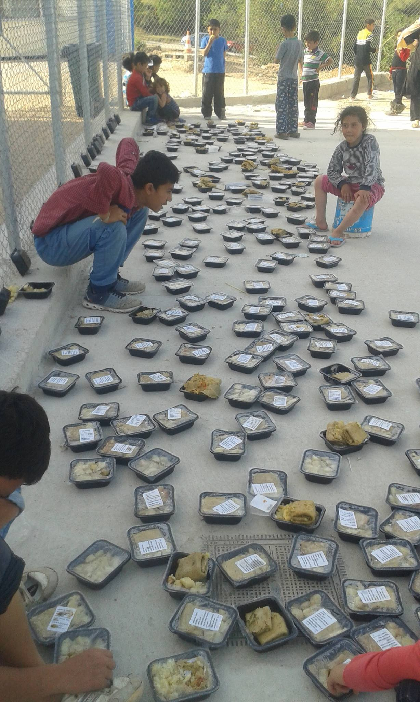

### AYS DAILY NEWS DIGEST 20\.4\.2016
#### As many as 500 people might be dead after a ship sank in the Mediterranean\. About one million people in Syria living under the siege\. To make matters worse, the Turkish border guards have killed eight Syrian refugees\. 400 people were forcefully evicted at Lesvos while volunteers from No Borders Kitchen were detained\. New refugee arrivals in Serbia, Hungary, and Italy\. Council of Europe voices criticism of EU\-Turkey deal implementation\.

PHOTO BY NO BORDERS KITCHEN

> **WEATHER CONDITIONS** : Thursday 21 April & Friday 22 April: \#Idomeni — sunny, colder 5C — 20C; \#Lesvos and islands — 14C — 22C\. SEA SAFETY: Waves over 0\.5 meters are considered dangerous\. On Thursday, waves up to 0,8 m\. Waves: moving generally Southward both days\. Leaving from Turkish coast of Canakkale to Lesvos, waves at your back both days\. Leaving from the west coast of Turkey to the Greek Islands, waves at your right both days\. BALKANS WARNING: Overnight cool and damp\. low 4C, high 20C\. More on [_News That Moves_](https://newsthatmoves.org/en/?p=2307) \. 

#### Mediterranean Route
### Up to 500 people may could be dead after a ship sank in the Mediterranean\.

> UNHCR interviewed survivors from the ship that sank in the Mediterranean yesterday, finally confirming the incident\. The precise number of victims is still unknown, but it is possible that as many as 500 people could be dead\. This is one of the worst tragedies involving refugees and migrants in the last 12 months\. The ship sank at an unknown location between Libya and Italy\. People who were rescued — 41 person, including a three\-year\-old child — were taken to \#Kalamata, in the \#Peloponnese peninsula of Greece, on April 16, and they are temporarily hosted at the local stadium\. Those rescued include 23 Somalis, 11 Ethiopians, 6 Egyptians and a Sudanese\. 

> The survivors talked about a group of between 100 and 200 people who departed last week from a locality near \#Tobruk in Libya on a 30\-metre long boat\. “After several hours at sea, the smugglers in charge of the boat attempted to transfer the passengers to a larger ship carrying hundreds of people in terribly overcrowded conditions,” UNHCR said in a statement\. “At one point during the transfer, the larger boat capsized and sank\.” 

> The survivors drifted at sea possibly for three days before being spotted and rescued on April 16\. The bodies, it is estimated, may start washing ashore in Libya soon\. 

#### SYRIA

**1 million people are currently living under the siege, primarily as a result of regime forces and ISIS\.**

> According to the [Siege Watch](http://siegewatch.org/#7/35.111/38.540) [,](http://siegewatch.org/#7/35.111/38.540,) an estimated 1 million Syrians are currently living under siege\. The opinion piece published by the [Warscapes](http://warscapes.com/opinion/besieged-twice-over-activists-push-food-drops-deir-ezzor) states how an area may be besieged by one actor, controlled by another actor, and the combination of both decides what degrees of freedom the population has\. By far the most restrictive sieges are those enforced by ISIS or the Assad regime like the eastern city of \#DeirEzzor where the siege is held by both sides\. With siege came a rise in prices\. Since January, the exchange rate in Deir Ezzor is 1USD to 390 SP\. Sugar and rice, both normally costing around 200 SP each, now cost 4,500 and 3,000 respectively, according to Nashwan Alsaleh, former math teacher, and activist from Deir Ezzor\. 

> “To buy chicken would cost half a month’s salary,” Karam describes\. “People are selling everything just to leave — their cars, their house\. It’s more expensive to get to \#Raqqa from Deir Ezzor than to go to Germany from Syria\.” 

#### TURKEY

**8 refugees killed by Turkish border police\.**

> According to the news media, Turkish border guards killed eight Syrians, most of them women and children, while the group was trying to cross via a mountain smuggling route at the western end of the frontier\. [The Times](http://www.thetimes.co.uk/article/78e17e98-0664-11e6-88d9-e8ff08e2a4bf) published a mobile phone footage showing a man carrying his young son, who had been shot in both legs\. 

### EU begins process of visa liberalization vis\-a\-vis Turkey\.

> The European Commission announced a report on Turkey visa liberalization to be issued on 4 May\. Turkey wants visa waivers lifted in June in the passport\-free Schengen zone as part of its migrant swap deal with the EU\. In order to grant this, Turkey has to meet 72 criteria\. Turkey’s prime minister, Ahmet Davutoğlu, warned he might tear up the deal if the EU failed to deliver on visa\-free travel\. “I maintain my belief that, God willing, we will have the visa exemption in June\. In the absence of that, then, of course, no one can expect Turkey to adhere to its commitments,” he said\. 

#### GREECE

**176 arrivals in Greece yesterday, indicating a slight spike in previous numbers\.**

> Refugees are keep coming to Greece, and there is a slight increase in numbers, despite what the prime minister told the Parliament today\. Different sources are claiming over 100 arrivals daily, approximately\. while the prime minister mentioned 50 to 60\. According to the UNHCR, 176 people arrived yesterday\. Official data are showing that as of 7:30 this morning, 174 arrivals were registered at Islands, including 84 at \#Lesvos, 13 at \#Samos, 79 at \#Chios\. Volunteers are reporting about 18 news arrivals, including 4 children, today at \#Samos\. Currently, there are 53, 978 refugees stranded in Greece, with the biggest number at Idomeni, 10,257\. 

> The UNHCR estimates that, in average, during the month of April, 134 people arrived at the islands\. There are currently 46,333 people located on the mainland and 7,645 on the islands\. Of those on the islands, 5,844 have expressed intention to apply for asylum as of the 18 April\. Of the 2,671 relocation requests, 860 transfers took place so far\. A total of 3,288 pledges has been made available by the EU Member States as of 19 April\. 

### Pregnant women taken to hospital after fire at camp Diavata\.

> The situation in Greece is not getting better at all\. Shocking news today are coming from camp \#Diavata, northern Greece near Thessaloniki, where a huge fire broke out, burning down many tents where refugees are living\. Volunteers with Doctor of the World organization treated three patients with smoke inhalation injuries, and they had to refer an eight\-month pregnant woman to hospital because her contractions started soon after the fire\. More than 2,300 people are living in this camp\. The blaze started in one of the tents, and 25 tents were burned in total\. Refugees, but also volunteers and humanitarian organizations, are working for a while about dire conditions for life in this camp\. After the incident today, about 100 people protested, with half of them spilling out onto the road and attempting to block traffic\. 

Photo by a volunteer in the camp
### We received news of a missing Afghan migrant near Pines River, who was found dead late in the evening\. We are still searching for more information\.

…

**400 people evicted from camp on on Lesvos**

> No Borders Camp on \#Lesvos, where between 300 and 400 people are living, was forcefully evicted today\. According to volunteers, around 6 o’clock in the morning the people in the camp were brought to the detention center\#Moria in overcrowded buses\. This camp is known for deporting people, seeking asylum, back to Turkey without a fair examination of their application\. Volunteers from the No\-Border Kitchen were also detained on the grounds of collaborating with illegal refugees\. Apparently, five members of the No Borders Kitchen are still being held in custody\. 

> This is not the first case of solidarity project being targeted in Greece by the police\. Yesterday the Soli\-cafe in \#Chios that was evicted\. 

…
### Food shortages and inadequate storage conditions lead to protest in Vial camp\.

> The situation is further deteriorating at \#Vial, too where people are complaining about food shortages, infant malnutrition, insects and maggots in the food\. Volunteers are informing us that people held inside of the closed center, are very scared and they are asking for lawyers that could help them\. 

Photo by Leslie Merale\. At Vial Camp, refugees, around 1000 of them, protested by placing their rations in front of the guards because they have been served the same completely inedible cold food, mostly potatoes with no salt or oil, for the last month\.
### Conditions on Idomeni remain tense\.

> At \#Idomeni, tensions are still high after last week clashed with Macedonian border police and refugees\. According to volunteers at the field, today police was stopping vehicles on the bridge approaching the camp and requesting identification\. 

> Please be sure that all volunteers traveling to camp keep an up to date ID wiith them at all times\. 

### Greek authorities continue to apply pressure for relocation\.

> Greek authorities are still trying to persuade people to voluntarily move to other camps\. The main issues for people stranded there are, like before, access to asylum service, food shortages, medical care, health issues like the appearance of gastroenteritis, lice, and scabies, security and lack of information\. 

…
### Skype number for refugees claiming asylum is unavailable\.

> One of the problems people at Idomeni, but also at some other places, are difficulties with reaching the Skype number for asylum claimants\. A group of refugees from \#Idomeni initiated [a petition](http://greecetour.oplatz.net/idomeni-petition-stop-killing-us-slowly-with-skype-asylum-applications/) warning about this system and saying that the given Skype number is never available\. They write: 

> “In Idomeni camp, living in tents in the mud, rain and sun for over forty days, life is becoming a normal hell, frustrations are rising as we lose hope\. Our emotions cycle between apathy, frustration and decreasing hope as our lives are reduced to a routine of sleeping and waiting\. Waiting in line for food, for tea, and to charge our phones, and waiting on hold for a Skype call that is never picked up\. Our lives are stuck in limbo\. “ 

### Volunteers and/or donations needed in Eko Station at Polykastro\!

> Volunteers from Team Brit are informing us that situation at \#EkoStation at \#Polykastro is calm, but more volunteers are needed to assist those already there due to the large number of refugees based on site\. Volunteers are asking for urgent donations of summer clothing, which can either be given directly to the Lighthouse team on site or taken to Polykastro’s warehouse, with boxes clearly labelled ‘for use at EKO’\. “Please bear in mind that clothing, particularly for females should be culturally acceptable and must not include items such as hotpants, see\-through blouses, crop tops and anything with slogans that may be deemed offensive by some, as seen in previous days\.” 

### Army, in charge of Nea Chrani Camp, remain incapable of meeting refugees’ needs\.

> Team Brit also spoke with coordinator for five camps in \#NeaChrani camp \(Nea Chrani, \#PetraOlympou, \#PieriaSkotinis, \#KtimaIraklis, \#Nireas\) \. Three of these camps are managed by the navy and army, however they only provide food and security\. There is a need for the following urgently: mosquito repellent and mosquito nets, snake repellent and anti\-venom, black tea, shampoo, lice treatment\. Also there is a central base for volunteers where a social medical clinic and pharmacy is based\. They need to move the pharmacy in the coming weeks as they are running out of space to a new building, but require wood to construct shelving and an upper level to store the medication\. Anybody who can donate or is able to help construct the new structure, please contact ELIAS TSOLAKIDIS via email at tsolakidis@sportools\.de 

### Refugees can no longer be indefinitely detained in Lesvos and Chios registration centers for over 25 days\.

> As of Monday, the “administrative restriction” process for asylum applicants on Lesvos and Chios is in effect, meaning that they cannot be detained in registration centers after 25 days\.The migrants are gradually free to leave the hotspots since their asylum applications take longer than 25 days to process\. The migrants released from the registration centers are given a specific document that says their asylum application is in the process and they cannot leave the island until there is a decision on their case\. The “administrative restriction” document enables refugees and migrants to move freely outside the hospitality structures\. They are free to stay in open refugee camps, which, however, are already overcrowded\. 

**83 million Euros allotted by the European Commission to improve living conditions of refugees in Greece\.**

> The European Commission announced that they would allocate €83 million, under the new Emergency Assistance Instrument, to improve living conditions for refugees in Greece; with funding dispersed immediately to UNHCR \(€25 million\), the International Federation of the Red Cross and six international NGOs\. EU Commissioner for Humanitarian Aid and Crisis Management, Christos Stylianides, signed the first contracts in Athens under the new instrument for emergency support within the EU, set up to help the Member States cope with crises, such as large numbers of refugees\. 

#### BULGARIA
### Bulgarian foreign minister speaks out against armed vigilante groups patrolling the border with Turkey\.

> The Bulgarian foreign minister publicly condemned the criminals who are hunting down refugees at the border\. 

> “This phenomenon, vigilantes at the border, safeguards, they have never been accepted and will never be accepted by the government\. They are under surveillance now and not only that: they will face consequences\.” 

#### SERBIA

**950 refugees are registered in Serbia after 34 new arrivals yesterday\.**

> According to the UNHCR data, 34 arrivals were registered yesterday in Serbia\. Currently, 950 refugees are registered in this country\. 

#### HUNGARY and AUSTRIA
### Slight uptick in refugee arrivals in Hungary and Austria\.

> As well as in Greece, there is the slight increase in arrivals\. In Hungary there were 174 people were registered yesterday while 183 were registered in Austria\. 

#### ITALY
### Numbers of new arrivals in Italy grows as well\.

> The increase is obvious even in Italy\. Interior Minister, Angelino Alfano, claims that, compared to last year, the number of people arriving irregularly to Italy by sea has increased by 4\.7%\. As such, he described the situation as “not an emergency nor is the reception system under collapse”\. 

### Government to resettle refugees in Bari\.

> Local government in \#Bari, South Italy, started with moving out refugees from the former monastery, where they had been housed since 2014\. People who were placed in this center, as well as humanitarian organizations, complained regularly about dangerous hygienic conditions\. People are being moved to a new location, [local media reports](http://bari.repubblica.it/cronaca/2016/04/20/news/migranti-138012992/#gallery-slider=138068484) \. 

#### SWITZERLAND
### Government ready for possible refugee influx

> The Swiss government is starting to become worried about the possible influx of refugees from Italy\. According to the [local media](http://www.wallstreetitalia.com/svizzera-alza-difese-anti-migranti-carrarmati-al-confine-con-litalia/) , Switzerland foresees three different scenarios; 10 thousand asylum requests in 30 days: 10 thousand requests each month for three months: 30 thousand illegal border crossers in a few days\. The government announced that in the case of the huge wave, the state could deploy military forces on the line\. 

#### GERMANY
### Right wing terrorist group arrested after attack on asylum seekers\.

> Five people were arrested in Saxony suspected of setting refugee shelters on fire\. All of them, it is believed, belong to a right\-wing terrorist group\. The arrested are four men and one woman, aged 18–39\. They were detained on suspicion of forming a far\-right terrorist group, causing grievous bodily harm and attempted murder\. Among other things, the group is suspected of attacking asylum seekers in Freital with stones and fireworks\. 

### Unknown extremists attacked refugee housing in Chemnitz\-Einsiedel\.

> [The local newspaper](http://www.zeit.de/gesellschaft/zeitgeschehen/2016-04/sachsen-chemnitz-einsiedel-brandanschlag) in \#Chemnitz\-Einsiedel is reporting about unknown people who attacked a refugee accommodation during the night from Tuesday to Wednesday\. According to Operational Defense Centre \(OAZ — responsible for extremism\), three incendiary compositions have been thrown around 22\.15 at the two houses\. They landed in front of the accommodation in the grass, where a security guard extinguished the fire\. 95 refugees liven the accommodations lives — all families — including 27 children\. Nobody was injured\. 

#### FRANCE
### More problem at Calais

> Protest are still going on in \#Calais Camp\. In recent blockades, refugees and migrants blocked the ring road in Calais\. [Port Director Jean\-Marc Puissesseau](http://www.lavoixdunord.fr/region/migrants-de-calais-les-forces-de-l-ordre-depassees-ia33b48581n3455661) reacted by calling upon the French State to further secure the area and prevent migrant access\. He said the only way to stop demonstrations is to “completely dismantle this jungle”\. He warns that migrants apprehended will need to face the French justice system, local media are reporting\. 

\. \. \.
#### UK
### UK prepares for a new plan to bring in unaccompanied child refugees in Middle East camps\.

> Home Office ministers prepare to announce a new scheme to take Syrian child refugees directly from camps in the Middle East starting in July, the [Guardian](http://www.theguardian.com/world/2016/apr/20/unaccompanied-child-refugees-to-be-dispersed-through-uk) reports\. Currently, there are 4,029 unaccompanied child refugees in Britain\. Many are concentrated in Kent and Croydon\. Kent county council is currently responsible for 900 unaccompanied child asylum seekers, mostly through foster care\. The children’s commissioner for England, Anne Longfield, giving evidence to the Lords’ committee on unaccompanied minors in the EU, said too many unaccompanied asylum seekers went missing from local authority care after they had been allocated a home\. 

#### EU

**12 countries contributed nothing in the EU\-Turkey deal**

> According to the European Commission, twelve countries have contributed nothing so far to the €3 billion EU\-Turkey deal\. These countries are Belgium, Austria, Poland, Lithuania, Slovenia, Croatia, Romania, Bulgaria, Greece, Cyprus, Malta and Spain\. Commission is also very critical about progress made in the implementation of the EU\-Turkey deal\. “There is no scope for complacency particularly as one of the most challenging elements — the daily operation of the actual return and resettlement processes in full compliance with EU and international rules — is still ahead,” the [report](http://europa.eu/rapid/press-release_MEMO-16-1494_en.htm) said\. 

### Council of Europe enumerates numerous grievances with the EU\-Turkey deal\.

> The Council of Europe is not very happy with the EU\-Turkey deal implementation\. [The report](http://semantic-pace.net/tools/pdf.aspx?doc=aHR0cDovL2Fzc2VtYmx5LmNvZS5pbnQvbncveG1sL1hSZWYvWDJILURXLWV4dHIuYXNwP2ZpbGVpZD0yMjYxMiZsYW5nPUVO&xsl=aHR0cDovL3NlbWFudGljcGFjZS5uZXQvWHNsdC9QZGYvWFJlZi1XRC1BVC1YTUwyUERGLnhzbA%3D%3D&xsltparams=ZmlsZWlkPTIyNjEy) from the Assembly listed numerous concerns on human rights, from keeping migrants in overcrowded and unsanitary detention centers on the Greek islands to inadequate legal protection for people seeking to appeal against the rejection of an asylum claim\. 

> The report also condemned Europe’s “shamefully slow” progress on relocating refugees from Greece to other countries\. Only 937 out of a promised 160,000 had been found homes as of March\. The EU\-Turkey agreement “at best strains and at worst exceeds the limits of what is permissible under European and international law”, states the report by the Dutch parliamentarian Tineke Strik\. 

> “Even on paper, it raises many serious questions of compatibility with basic norms on refugees’ and migrants’ rights\. It has so far given every indication of being even more problematic in practice\.” 

#### US
### Head of Syrian “White Helmets” denied entry into the US to receive award for humanitarian efforts\.

> Hard to believe news from he US — the award\-winning humanitarian Raed Saleh, head of Syria Civil Defence \(also known as “The White Helmets”\), was denied entry to the country on his way to [InterAction’s Forum](https://www.interaction.org/newsroom/news-releases/award-winning-humanitarian-denied-entry-united-states) , the largest annual gathering of humanitarian, development and sustainability professionals\. It was planned that he will receive its 2016 Humanitarian Award at this event\. “I am shocked and saddened to learn that Raed would be turned away by U\.S\. officials on the eve of being recognized by his peers in the international humanitarian community for his heroic work in Syria to help bring life\-saving assistance to communities under fire in Syria,” said InterAction CEO Sam Worthington\. 

### Pulitzer Prize\-winning writer Viet Thanh Nguyen speaks out against the scapegoating of refugees\.

> Viet Thanh Nguyen, a former Vietnamese refugee to America, who won the Pulitzer Prize for fiction for his debut novel, The Sympathizer, is a refugee, too\. In his interview with [BBC](http://www.bbc.com/news/world-asia-36088984) Nguyen, who is living in the US, said: 

> “I’m not an immigrant, I’m a refugee\. I think it’s very important to make that distinction, especially in this day and age when countries are so afraid of refugees… I think a lot of the fear people have about refugees is that they think they are utterly foreign, that they bring various kinds of contamination with them, whether that’s physical, spiritual or religious or linguistic\. But I think what’s also very frightening about refugees for a lot of people is that they remind citizens of stable countries that the privileges that they take for granted might actually be really fragile, that one day a natural disaster or a war might eventually come and make them into refugees too… Refugees and other kinds of immigrants — undocumented immigrants and so on — have become the scapegoats for some people’s rage and fear\. But that rage and fear shouldn’t be directed at immigrants, it really should be directed at the structures of inequality that have led people in the United States to feel dispossessed\.” 

_Converted [Medium Post](https://areyousyrious.medium.com/ays-daily-digest-20-4-2016-2164896566e3) by [ZMediumToMarkdown](https://github.com/ZhgChgLi/ZMediumToMarkdown)._
