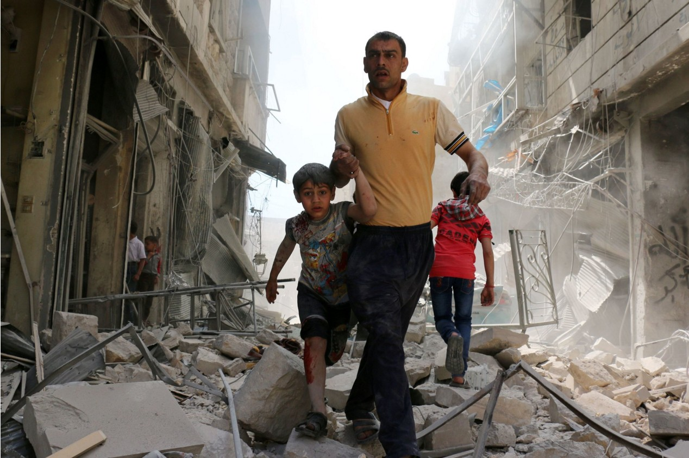
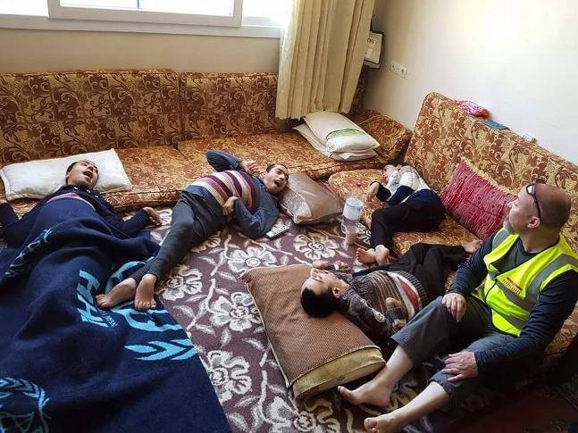
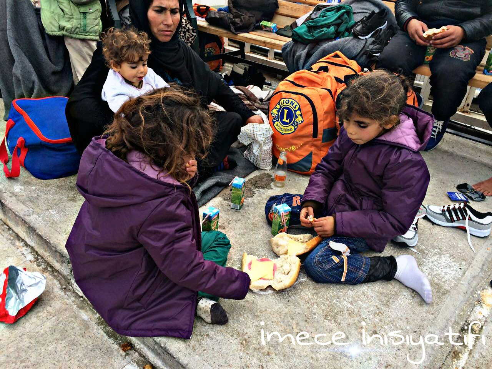
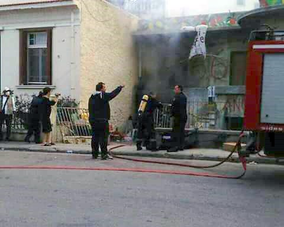

### AYS DAILY NEWS DIGEST 23\.4\.2016\.
#### The UN special envoy for Syria has estimated that 400,000 people have been killed throughout the last five years of civil war, but openly admits that they stopped keeping track of the death toll two years ago\. Volunteers have encountered the horrifying situation of a family in Turkey\.

**A Syrian man evacuates an area following an airstrike on April 22, 2016 in the rebel\-held neighbourhood of Hayy Aqyul in Aleppo ©Ameer Alhalbi \(AFP\)**
#### SYRIA

> _The UN special envoy for Syria has estimated that 400,000 people have been killed throughout the last five years of civil war, urging major and regional powers to help salvage a crumbling ceasefire\. Explaining that the death toll was based on his own estimate, Staffan de Mistura said on Friday that it was not an official UN statistic\. “We had 250,000 as a figure two years ago,” he said\. “Well, two years ago was two years ago\.”_ 

> _The UN no longer keeps track of the death toll due to the inaccessibility of many areas and the complications of navigating conflicting statistics put forward by the Syrian government and armed opposition groups\. In the latest violence, at least 30 civilians were killed on Saturday in bombardment of areas across Syria\. Twelve people were killed in air strike on the northern city of Aleppo, a local civil defence official said\. State news agency SANA said that three civilians were killed and 17 wounded in rebel shelling of government\-held areas of Aleppo\. The Syrian Human Rights Observatory said 13 others died in shelling of the rebel\-held town of Douma, east of Damascus, while two men were killed in regime air strikes on Talbisseh in central Homs province\._ 

#### TURKEY
### Reyhanli family needs your support

> _Volunteers from UK Refugee Aid Network have encountered a very difficult case in the town of Reyhanli in Turkey, near the Syrian border\. There’s a refugee family of six that has four adult children, all of whom have cerebral palsy\. They don’t have basic medical aid, nor do they have enough for living expenses in general, let alone for the hoists and other equipment to allow the children to live in dignity\. Their mother is in hospital\. Their father, who is also unwell, is doing all he can to look after them, but they’re in a desperate state\. When the mother leaves hospital, he’ll have to look after her too\. He is 70 years old\._ 

Refugee family with four children all of whom have cerebral palsy; photo: UK Refugee Aid Network

> _British volunteers have alerted Turkish charities and are mobilising a response from every organisation they can think of, including UNHCR, who apparently don’t have much of a presence in that part of Turkey\. There is much that they can do, but they lack the necessary funds\. A [crowdfunding campaign](https://mydonate.bt.com/fundraisers/reyhanli) has been set up to support the family\. Your donations could pay for the creams to treat their bed sores, or contribute towards getting the hoist so they can have a proper wash and see the outdoors for the first time in a long time\. In short, it would be absolutely transformational for this family\._ 

### Refugees still attempting to cross the Aegean

> _Contrary to the agreement between the European Union and Turkey, refugees’ journey for hope still continues\. They are not giving up for a little hope on their journey that may cost them their lives\. Volunteers from Çeşme were with the refugees who were taken to the Coast Guard today\. They provided them with basics, but their future remains uncertain\._ 

Refugees caught in Aegean; photo: İmece İnisiyatifi Çeşme
#### GREECE

> _53,705 refugees are still stuck in Greece: 45,817 in the mainland and 7,888 on the islands\. Several weather warnings are issued for Aegean sea, so we strongly discourage any planned crossings from Turkey towards Greek islands\._ 

### **Solidarity center on Chios was burned down by an unknown party**

> _Soli Cafe, a solidarity center on \#Chios that treated refugees as equals, and has been under constant police and fascist pressure and attacks recently, was set on fire last night\. Culprits are still unknown\. Fortunately, gas canisters had been removed from the building in time to prevent greater damage\._ 

Firefighters in front of Soli Cafe on Chios; photo: Benjamin Julian

> _Meanwhile, Vial camp on Chios is still closed for independent volunteers as well as some NGO’s trying to get in\. Refugees are still being detained under Greek law for up to 25 days\. Volunteers have collected [multiple testimonials](https://insidevial.wordpress.com/) confirming that the food provided is of poor quality, and nutritionally insufficient\. There’s lack of medical support as well\._ 

### **International lawyers and translators needed\!**

> _An international network of lawyers is trying to get a grip on how asylum claims in Greece are being handled\. At the moment they need support of both Greek and international colleagues to review all the refugee cases in time\. Translators fluent in Greek, Arabic and Farsi are needed as well\. They are also looking for friendly contacts within EASO to meet with during their legal coordination meetings\. If you can help with legal expertise or you know someone who could be useful, please contact ariel\.ricker@gmail\.com_ 

### **New safety rules for HSA volunteers on Lesvos put in place**

> _Humanitarian Support Agency from Lesvos has informed us about new safety requirements for their international volunteers: As of today, April 23, every prospective volunteer will have to complete the HSA application form and submit a copy of their passport along with a criminal background check from their country of residence\. These documents will also have to be submitted to Kara Tepe authorities before being allowed access to camp\. Future volunteers must be between 26 and 65 years of age and commit to a minimum of two\-weeks\. No exception will be made to these requirements\. HSA hopes you will understand that they can no longer accept walk\-in volunteers\. Their [application form](http://www.humanitarian-support-agency.org/) was modified accordingly\._ 

### Expired food in Skaramagas camp

> _Refugees from Skaramagas reception camp near Athens have complained about expired food that was given out today\. Most of them threw away their food packages\. Many of those who have tried eating it felt sick soon\. Luckily, the number of volunteers who are allowed to get into Skaramagas is slowly rising\. The application from Movement On The Ground has passed today, and they should be allowed in as soon as they get last stamps on their papers\. According to those who have been granted access, the government will only accept long\-term NGO engagement, lasting for at least 4 months\. Volunteers say the group of representatives from the Ministry of Culture and Education visited the camp today\. They want to support educational projects and start cultural activities, like performances and workshops inside the camp\._ 

### The Idomeni Cultural center is growing\.

> _The Idomeni Cultural Center has finally received the container that they were waiting for\! Now, all the boxes with all the material that they had inside the tent will be safe and they won’t have to guard it 24/7\. They have also installed a solar panel today, which will provide them with much needed electricity\. They are thankful for the donations that have made this possible\._ 

New container arrives to Idomeni Cultural Center; photo: volunteers on the ground
### SolidariTea close to being bankrupt\!

> _SolidariTea group from Idomeni have been serving around 3,000 litres of tea every day for the last two months\. Today they have calculated their operating costs run up to 440 Euros per day\. They have managed to cover their expenses so far, but now they are close to being bankrupt\. They have listed their needs and the amount of money they need [at their crowdfunding campaign](https://www.betterplace.org/de/) \. Please consider donating to them, as they are one of best and kindest groups in the area\._ 

#### FRANCE
### Donations and volunteers needed

> _A [list of items needed in Calais camp](http://www.helprefugees.org.uk/2016/04/18/calais-needs-items-needed-as-of-monday-18th-april/) , where volunteers are still running low on food supplies, has been updated recently\. They are also experiencing a shortfall of teenage boys clothes and shoes, while they are currently oversupplied with children’s clothes and toys\._ 

> _Also, Utopia 56 group is working around the clock to support the needs of people in the refugee camp at la Linière in Grande Synthe\. At the moment [they need new volunteers](http://www.utopia56.com/en/) more than material donations\._ 

**Be sure to like and follow us on [Facebook](https://www.facebook.com/areyousyrious/) and [Twitter](https://twitter.com/areyousyrious) \!**

_Converted [Medium Post](https://areyousyrious.medium.com/ays-news-digest-23-4-2016-53a104a8eabd) by [ZMediumToMarkdown](https://github.com/ZhgChgLi/ZMediumToMarkdown)._
