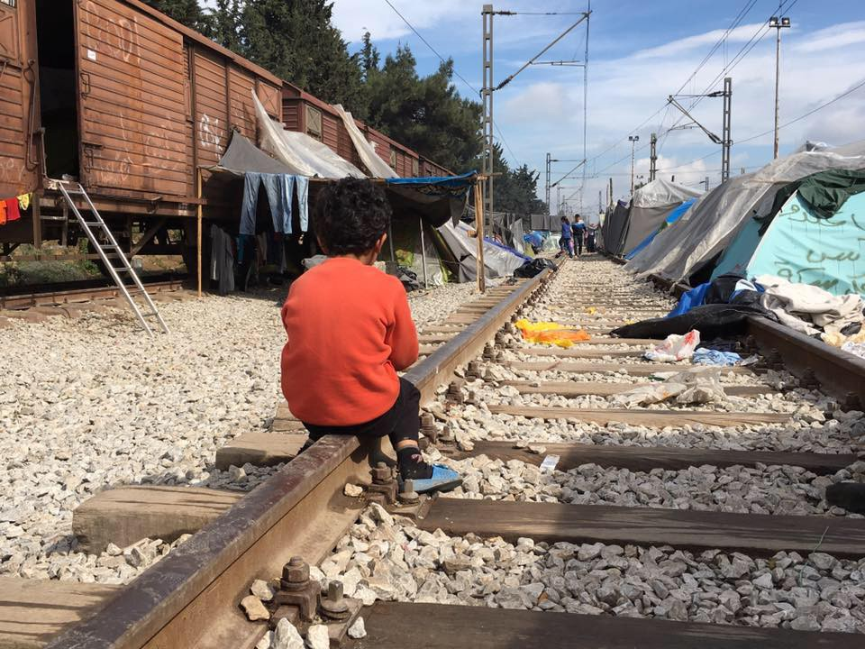
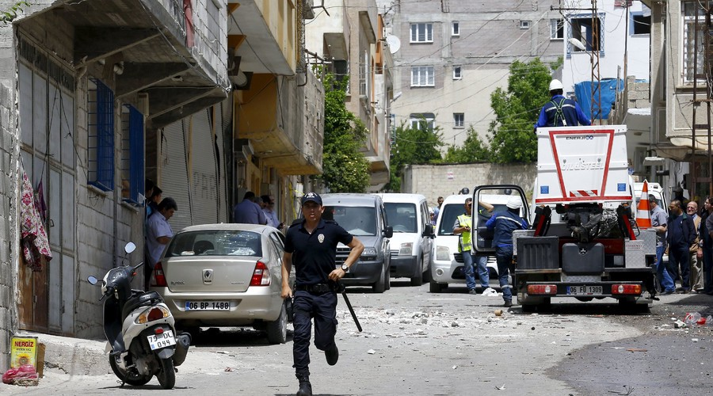
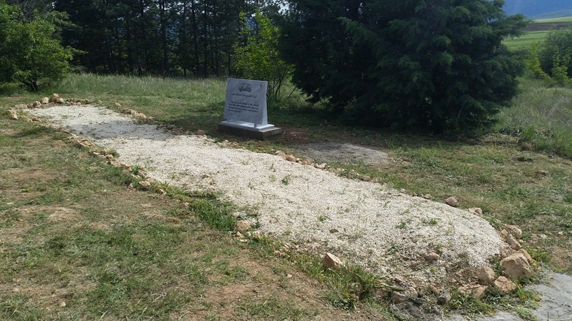
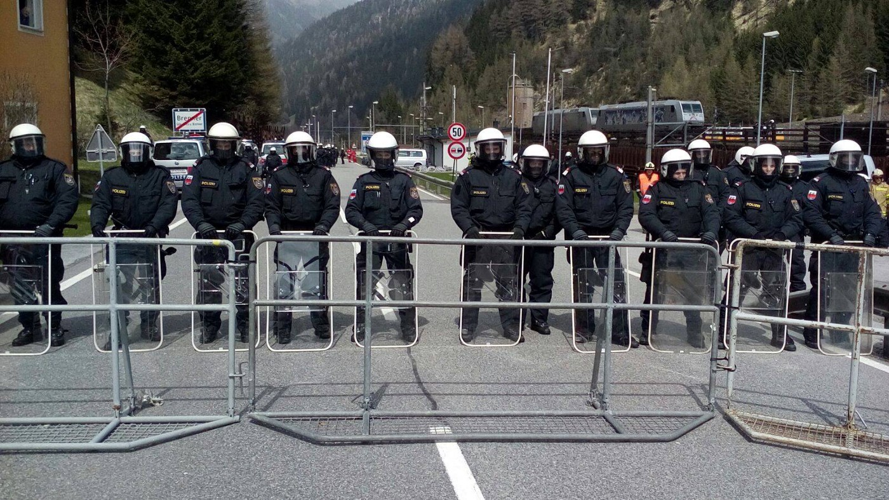

### AYS DAILY NEWS DIGEST 24\.4\.2016\.
#### At least 26 were killed in Syrian Aleppo\. One person was killed and 26 were injured in a rocket attack in Turkey\. Refugees were teargassed in Moria\. Refugees protest in Polykastro over poor living conditions\. Protesters were pepper\-sprayed on the Italian\-Austrian border\.

Photo credit: Refugee Solidarity Movement Thessaloniki\-Eidomeni
#### SYRIA
### [ABC News](http://abcnews.go.com/International/wireStory/14-killed-fighting-rages-syrias-aleppo-38631666) reports that air strikes and shelling pounded Aleppo for a third straight day on Sunday\.

> _The strikes killed two young siblings and at least 24 others in Syria’s largest city and former commercial capital\. At least 10 people were killed by rebel shelling on government\-held areas in the city\. Air strikes opposition\-held territory of the city killed 16\. The ceasefire is still technically in place, but is non\-existent on the ground\._ 

### Germany and Angela Merkel are seeking the creation of “safe zones” to shelter refugees in Syria\.

> _This would keep the refugees on the Syrian side and further stem their flow into Turkey and Europe\. According to [Reuters](http://www.reuters.com/article/us-europe-migrants-turkey-germany-idUSKCN0XK0BS) , the UN has warned against the plan unless there was a way to guarantee the refugees’ safety in the war\-torn state\. Aid workers have opposed it\. According to Merkel, in these safe zones, the now non\-existent ceasefire would be especially enforced and the safety of the refugees would be guaranteed\. US President Barack Obama ruled out establishing those safe zones because, in his opinion, it would require large military presence to protect the refugees places in those zones\._ 

#### TURKEY
### One person was killed and 26 were injured in a rocket attack on the Turkish town of Kilis near the Syrian border on Sunday\.

> _The first attack carried with two rockets hit a neighborhood near the city center, while the other two rockets, fired later in the day, hit a mosque in the city\. Turkish soldiers near the border returned fire into Syria\. According to [Reuters](http://www.reuters.com/article/us-mideast-crisis-turkey-syria-idUSKCN0XL09C) , the attack happened a day after the Government promised to protect the area from repeated attacks by Islamic State militants\. Police later used water cannons on protesters who protested the Government’s alleged lack of response to the attacks\._ 

Aftermath of the attack in Kilis\. Photo credit: Umit Bektas / Reuters
#### GREECE

> _Strong gusts of wind and waves over 1 m high, as well as rain and thunderstorms, are expected during Sunday night and Monday\. Given that waves of 0\.5 m are considered dangerous, sea crossings are strongly discouraged\._ 

> _According to UNHCR, as of 8 AM on 24 April, there is a total of 45,704 refugees on Greek mainland, plus 7,984 refugees on Greek islands\. 10,232 are recorded in Idomeni\. Lesvos hosts 4,366; Chios hosts 2,093; while approximately 1,500 are located on other Greek islands combined\. Volunteers report that in the last two days three boats made it through the sea blockades to Chios\. All in all 183 people including a lot of children, women and men\._ 

### The Secretary General of NATO said their patrols in the Aegean Sea have had a significant impact on reducing refugee flows from Turkey to Greece\.

> _He said NATO patrols exchange information about smugglers “in real time” with coastguards of both countries, as well as Frontex\. Currently, the patrols have focused on areas around Greek islands Lesvos and Chios, but they are in talks with both governments to patrol further south in the Aegean\._ 

> _In other maritime news, MSF has relaunched search and rescue operations in the Central Mediterranean Sea with the ship Dignity1\._ 

### Police teargassed refugees inside the detention centre Moria on Lesvos on Saturday\.

> _Platanos Refugee Solidarity reports that the teargassing seriously affected children and caused lots of respiratory problems\. They also state that anger and desperation is growing among the 3,900 refugees who are living inside Moria in terrible conditions\. There are protests almost daily and the only reaction on the part of the state seems to be teargas and riot police\._ 

### Another abandoned site in Athens occupied in turned into shelter for refugees\.

> _Since April 22, the abandoned hotel City Plaza in Athens was occupied and is being turned by the Solidarity Initiative for economic and political refugees, one of the many solidarity initiatives that emerged from Greek society, into a self\-organized accommodation center\. Over the next few days, works will be in progress to clean, repair and organize the space\. After that, it will be used to accommodate more refugees\._ 

### Improvements in camps throughout mainland Greece continue, but conditions remain unsatisfactory\.

> _In Cherso, a camp close to the Greek\-Macedonian border, the situation seems to have improved in the last few weeks\. The dirt road there now has gravel and drainage trenches have been dug throughout the camp\. There is sometimes WiFi access in some areas\. However, some still have no mattresses or crucial information, despite staying there for weeks\. According to UNHCR, there are currently over 3,900 people housed in the 440 tents in the camp\. Volunteers report that this estimate might be high as some refugees leave the camp in search for better conditions\. They also state that there is no proper housing for the most vulnerable people\._ 

### A big rain storm and strong winds in Idomeni on Sunday; tension in the region\.

> _As always in rainy weather, many tents and shelters in Idomeni were flooded\. There are currently over 10,200 refugees still located in the camp near the Macedonian border who are, once again, trekking through mud\. There are continued reports from Idomeni and all other camps in Greece regarding the difficulty of reaching the asylum service and scheduling an appointment via Skype\. Meanwhile, the situation in the region is growing tense\. In Nea Kavala, camp which houses 3,900 refugees in 611 tents \(according to UNHCR\), around 100 from the camp took to the streets and walked to a nearby town of Polykastro shouting “Open the borders”\._ 

### Volunteers are needed throughout Greece\!

> _Dentists are needed in Idomeni\. For more information or to apply, visit [http://www\.healthpointfoundation\.org/](http://www.healthpointfoundation.org/) They need them as soon as possible\. Paperwork submitted will be accepted soonest May 2nd, so time is of the essence\. Two doctors and preferably three translators \(Arabic and Farsi\) are needed to do a needs assessment at two camps on mainland Greece\. If you can help, please PM Sarah Torrance on Facebook\. There is also a call for doctors \(especially Family Medicine/ General Practitioners\) for Katsika Ioannina refugee camp for April 29th onward\. Please send a message to Liz Bates on Facebook if you can help\._ 

#### MACEDONIA
### Several groups of refugees tried crossing the Greek border into Macedonia\.

> _The incident happened during the night from Saturday 23 April to Sunday 24 April\. Macedonian police launched a search operation, found the refugees, detained them and finally returned them to Greece\._ 

> _On Saturday evening, a [Reuters](http://www.reuters.com/article/us-europe-migrants-greece-border-idUSKCN0XL0GT) witness saw a group of up to 70 people crossing into Macedonia at a point where there is no razor wire between the two countries\. It is unclear whether this group is the aforementioned group that was detained and returned to Greece\._ 

### At the town cemetery in Veles, a memorial was held for 14 refugee victims of a train accident that occurred a year ago\.

> _The commemoration was attended by representatives of local authorities, NGOs, the media and citizens\. A memorial to the victims was unveiled and 14 cypresses were planted\. A year ago, a train traveling from Veles to Skopje ran over 14 refugees who traveled on the railroad towards the north of the country\._ 

Memorial to the victims of train accident\. Photo credit: Legis
#### ITALY
### Protest on the Brenner pass at the Italian\-Austrian border resulted in pepper spraying of protesters\.

> _Hundreds of Italian protesters faced hundreds of Austrian police on Sunday as they protested against possible restoration of border controls at the pass by the Austrian Government because of fears of a surge of refugee arrivals in Italy as the summer approaches\. Carrying signs, the protesters marched across the border and pushed up against a police line on the Austrian side placed there to prevent their crossing\. After some shoving, riot police fired pepper spray at the protesters\. No serious violence occurred\._ 

Riot police on the Brenner pass\. Photo credit: Ilaria Sperandio / Open Borders
#### UK
### Parliament to vote on taking 3,000 unaccompanied child refugees on Monday\.

> _MPs will vote for the “Dubs Amendment” for the UK to take 3,000 unaccompanied child refugees from camps in Europe\. The Tory Party is refusing to do this, focusing on taking 3,000 child refugees from camps outside of Europe over a four year period\. 26,000 unaccompanied children entered Europe last year alone and 10,000 children have gone missing, according to Europol\. Those children are at risk of trafficking, abuse and prostitution\. If you are a UK resident and are in favor of the Dubs Amendment, you can write to your MP and ask them to vote for it: [https://www\.writetothem\.com/](https://www.writetothem.com/)_ 

_Converted [Medium Post](https://areyousyrious.medium.com/ays-daily-news-digest-24-4-2016-9801bdc2be6) by [ZMediumToMarkdown](https://github.com/ZhgChgLi/ZMediumToMarkdown)._
