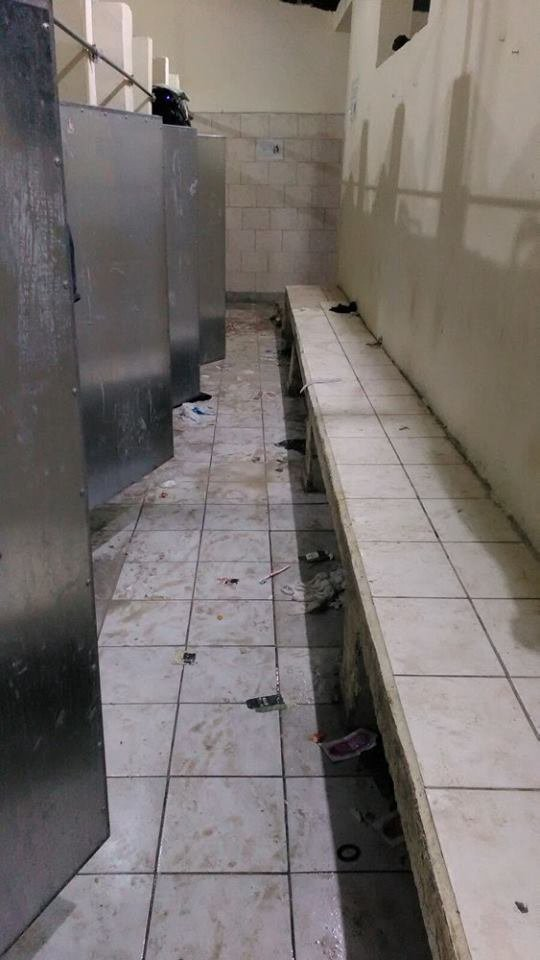

### AYS DAILY NEWS DIGEST 25\.4\.2016\.
#### Strong winds and high waves around Greek islands\. Refugees in Chios protesting and chanting against border closures and deportations\. Volunteers urgently needed in Port of Piraeus\. Assembly from the Stone Building dissolves due to great pressures on solidarity\. Medical team needed in Alexandria camp and in the mainland\. Austria announced temporary border control on the border with Hungary to limit the inflow of undocumented migrants\. The Dubs Amendment loses in the House of Commons\.

Protest against border closure and deportations in Chios\. Photo credit: Benjamin Julian
#### GENERAL
### Alde Group urges EU member states to clarify the situation of all refugee and migrant minors\.

> _The ALDE Group \(Alliance for Democrats and Liberals for Euorope\) has called on the European agency and EU member states to clarify the situation of all the refugee and migrant minors once they enter European territory\. They are appalled by the fact that 10,000 refugee children have disappeared during the last months according to EUROPOL\. MEP Hilde Vautmans said “This bureaucratic indifference cannot rule our moral standards,” adding that “When a dog is missing, people post emergency messages on their Facebook pages\. But when we are faced with the biggest number of displaced children since World War Two, we all get lost in the myriad of institutions\. It’s a disgrace”\. Additionally, ALDE Group has requested information with regards to the registration of those minors\. They also urged member states to take measures to prevent these missing children from ending up in criminal environments\._ 

#### GREECE
#### _Warning: strong winds and high waves around Greek islands\. Also strong winds and thunderstorms expected in the north of Greece\. For more please follow the link [http://bit\.ly/1qNwwHc](http://bit.ly/1qNwwHc)_

**69 new arrivals on Greek islands\.**

> _There were 69 new arrivals on Greek islands today \(Monday\) and the total number of refugees in Greece today numbers 45, 360 with 7,450 in the islands, 14,020 in the Attica region, 3,400 in central Greece, 300 in southern Greece and 20,190 in northern Greece\._ 

Inside Moria\. Photo credit: No border kitchen
### Updated Skype schedule for Asylum applications\.

> _For an updated Skype schedule for asylum applications with instructions in both Arabic and Farsi follow the link [http://bit\.ly/1Nuf1Gc](http://bit.ly/1Nuf1Gc)_ 

### Parents searching for a boy lost months ago in Lesvos and seen in pictures from a Turkish camp\.

> _There were 4 new arrivals on Lesvos today\. Volunteers are trying to find a boy who was on \#Lesvos months ago, but got lost\. His father recognized him in one of the pictures from a Turkish camp\. You can find the pictures here [http://bit\.ly/1YQF375](http://bit.ly/1YQF375) and here [http://bit\.ly/1MTNwFU](http://bit.ly/1MTNwFU)_ 

> _If you have any information regarding the lost boy, please contact Hamid Bochi or Lisanna Gennuardi on Facebook\._ 

### Refugees in Chios are protesting and chanting against deportations\.

> _There were 65 new arrivals on \#Chios today\. Meanwhile refugees in \#Souda, Chios, are protesting and chanting against closed borders and deportations: “No Tourkia, no Tourkia\!” and “Open borders\!”, “We want papers\!”_ 

### Volunteers urgently needed in port of Piraeus \(28–3 May\) \.

> _Team Brit as well as other volunteer organizations have placed an URGENT CALL for independent volunteers, teams and NGOs in the port of \#Piraeus from the 28th of April until the 3rd of May due to a lack of available volunteers during upcoming national holidays\._ 

### Assembly from the Stone Building dissolves their collective due to great pressures on solidarity\.

> _Assembly from the Stone Building at the port of \#Piraeus, a place where 1500 lived for the last two months, issued a statement saying that they have decided to dissolve their collective due to the great pressures on solidarity that span from accusations aimed at volunteers, to making volunteers and NGOs comply with humiliating processes of dividing refugees into groups considered deserving of better accommodation and those who do not apply for asylum\. For more information, please read the full statement [http://bit\.ly/1VUdlZa](http://bit.ly/1VUdlZa)_ 

### Volunteers report chaotic situation in Skaramagas camp\.

> _Many refugees from the port of \#Piraeus are being sent to \#Skaramagas camp, where volunteers report that they were told that an additional 2000 Afghan refugees were brought in from Piraeus yesterday\._ 

> _“Needless to say that created tensions all around in trying to manage so many more people along with the dislike Afghans and Syrians have for each other\. There were a number of new navy personnel on hand to help\. Our warehouse continues to be quite unmanageable without light, lots of dust and boxes everywhere\. We barely managed to give out some clothing to the new arrivals but the window the navy gave us was a little over an hour\. The navy, since they are human too, are struggling to handle their work especially since they have no experience with refugees\. It’s shared chaos\! Nothing has changed as far as access to the camp by volunteers\. No independents allowed and only NGOs who have registered with the Ministry of the Interior are permitted,” volunteers reported\._ 

### Alexandria Camp still looking for a medical team\. Medical staff and translators are also needed in two camps in the mainland\.

> [_\#Alexandria_](https://www.facebook.com/hashtag/alexandria?hc_location=ufi) _Camp is still looking for a medical team\. Any medical professionals willing to volunteer, please contact either [Rando Wagner](https://www.facebook.com/rando.wagner?hc_location=ufi) or or [Sarah Griffith](https://www.facebook.com/sarah.griffith.54738?hc_location=ufi) on FB\._ 

> _Also, more medical staff are needed in two camps in the \#mainland, two volunteer doctors and some volunteer translators \(Arabic and Farsi\) are needed as soon as possible to do a needs assessment at these two camps\. Please private message Charity Fearn on Facebook more information\._ 

**800 in Idomeni left without water because of landlord\.**

> _No good news from \#Idomeni as usual\. 10,232 people still reside there\. The owner of Hotel Hara has turned off all water supplies, leaving a population of over 800 including many families without water\._ 

### Some advice for volunteers at EKO Gas Station\.

> _Warning for volunteers: be careful when distributing hand warmers \(the ones that look like tea bags\) \. Hand warmers were distributed today without an explanation and refugees mistook them for tea, so please try and explain before handing them out\. Also, volunteers who played with kids and colors washed the kids’ hands with petrol to get the color off, please don’t do that\. Both incidents happened at \#EKOgasstation\. Please be aware that sometimes it is not enough to explain those things in English only, search for a translator if you see that English explanation is not enough\. Keep up the good work\!_ 

#### MACEDONIA

**650 refugees in Tabanovce Camp\. Volunteers report that bad conditions contribute to refugees’ decision to leave with smugglers\.**

> _As volunteers report, there are now only 650 refugees in \#Tabanovce camp\. “Every day they are leaving \(with smugglers\) \. The government refuses to enlarge the capacity of the camp, a lot of people are sleeping on wooden benches and floors and those bad conditions contribute to people’s decision to embark on this dangerous and costly trip\. Yesterday 50 people left the camp\.”_ 

#### CROATIA
### Support new auctions on solidarity\.org

> _Please support a new series of auctions we have launched on solidarity\.org platform\. For more information follow this link: [http://bit\.ly/1T07iM4](http://bit.ly/1T07iM4)_ 

#### AUSTRIA
### Austria announced temporary border control on the border with Hungary to limit the inflow of undocumented migrants\.

> _After announcing border controls on their border with Italy, Austria introduced today temporary border control on its border with Hungary to limit the inflow of undocumented migrants, local media reported\. According to the Austrian newspaper Osterreich, the border controls were scheduled to apply from 8 a\.m\. local time\. The newspaper added that the authorities plan to pay special attention to vans entering Austria from Hungary\._ 

### Austrian bishop against construction of security fence\.

> _In surprising news, it is nice to see that, unlike in Poland and Croatia, a Roman Catholic bishop has challenged Austria’s plans to construct a fence to keep out refugees by refusing to allow the authorities to build on church land and arguing that it runs contrary to the pope’s wishes\. A fence “would contradict the spirit of the Gospel, Pope Francis’s clear message to Europe, and in particular for a diocese that was in the shadow of the Iron Curtain for decades,” Aegidius Zsifkokvics, the bishop of Eisenstadt, told the AFP news agency\. The proposed fence on the Hungarian border near Moschendorf would cross two properties owned by the church\._ 

#### GERMANY
### Refugees For Refugees petitions against new integration law that doesn’t allow refugees to choose their place of residences freely after asylum approval\. Economist maps most suitable places for refugees to live\.

> _A new “integration” law is in the works in Germany\. The law stipulates that refugees, after asylum approval can not choose their place of residence freely\. The organization Refugees For Refugees made a petition against the proposed law\. The petition is called “social participation and self determination instead of spatial exclusion and sanctions”\. For German readers follow the link [http://bit\.ly/1Nub305](http://bit.ly/1Nub305)_ 

> _On the other side, The Economist came up with the new maps of, by their calculations, the best places for refugees to live\. “By merging figures on job and housing availability provided by Empirica, together with data on violent attacks on migrants from German newspaper Die Zeit, we were able to map districts on a scale of the most\-to\-least suitable for settlement\. We’ve mapped Die Zeit’s figures showing where migrants actually settled in the first half of 2015\. By cross\-comparing the districts identified as “good” or “excellent” in our index, a mismatch is exposed which suggests that refugees might indeed be congregating in the wrong places\.” For more, follow the link\. [http://econ\.st/1SFFU9b](http://econ.st/1SFFU9b)_ 

#### NORWAY
### Norway offering money to asylum seekers to leave voluntarily\.

> _While Germany’s policies might be questionable and cynical, Norway has gone even further\. The Norwegian Directorate of Immigration \(Utlendingsdirektoratet — UDI\) is offering a 10,000 kroner bonus to asylum seekers to leave voluntarily\. UDI will offer an additional 10,000 kroner to the first 500 asylum seekers who apply for a voluntary return to their home countries\. Beginning on Monday, the offer will run for six weeks on a first\-come, first\-served basis\. “We need to entice more to voluntarily travel back by giving them a bit more money on their way out\. This will save us a lot of money because it is expensive to have people in the asylum centres,” Integration Minister Sylvi Listhaug told broadcaster NRK\._ 

> _The offer entails giving asylum seekers an additional 10,000 kroner in travel expenses on top of the 20,000 kroner already offered\._ 

#### SWEDEN
### Building that was to be re\-purposed into a home for refugee children set on fire in a case of arson\.

> _In other integration\-gone\-wrong\-in\-Europe story, a building that was to be repurposed into a home for refugee children has been set ablaze in a second apparent arson attack in the east of Sweden in the city of Haernoesand\. Firefighters managed to contain the fire, but not before it devoured the former school building\. No one was injured in the incident, though the building was totally destroyed\. An investigation has been launched, while the incident was classified as an arson, according to local media\._ 

#### UK
### The Dubs Amendment loses in the House of Commons\.

> _The Dubs Amendment to welcome 3,000 lone children into Britain lost by 294–276 votes in the Britain’s House of Commons today, Calais Action report, adding that “We’re sitting in the Commons devastated\. We’ve been campaigning to help children in the camps of Calais, Dunkirk and elsewhere in Europe for so long\. Many of those voting against didn’t even show their faces in the chamber\.” They also state that “It’s not the end though: tomorrow the Lords are working on a new amendment and the game of ping pong begins again\.” They also rightfully stated that, “It’s not the “pull\-factor” that the Conservatives should fear\. It’s the history books\.”_ 

#### AUSTRALIA
### Peaceful protests of refugee families in detention center on Nauru ongoing for 37 days, still no coverage of protests in Australian mainstream media\.

> _Things are not looking good for people in migration even if they are down under\. As Insurrection News reports, it is day 37 of ongoing peaceful protests by refugee families who are detained in the RPC3 compound at the Australian government’s offshore refugee detention center on Nauru\. The refugees are still calling for people in Australia to protest in solidarity with them\. There is still coverage of the protests in any Australian mainstream media\._ 

_Converted [Medium Post](https://areyousyrious.medium.com/ays-daily-news-digest-25-4-2016-cd6e02901c48) by [ZMediumToMarkdown](https://github.com/ZhgChgLi/ZMediumToMarkdown)._
