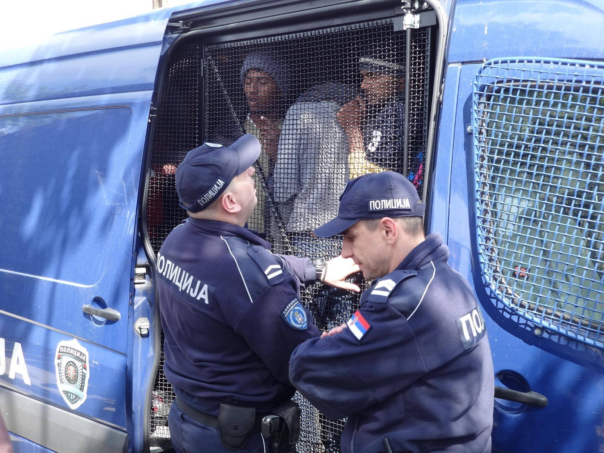
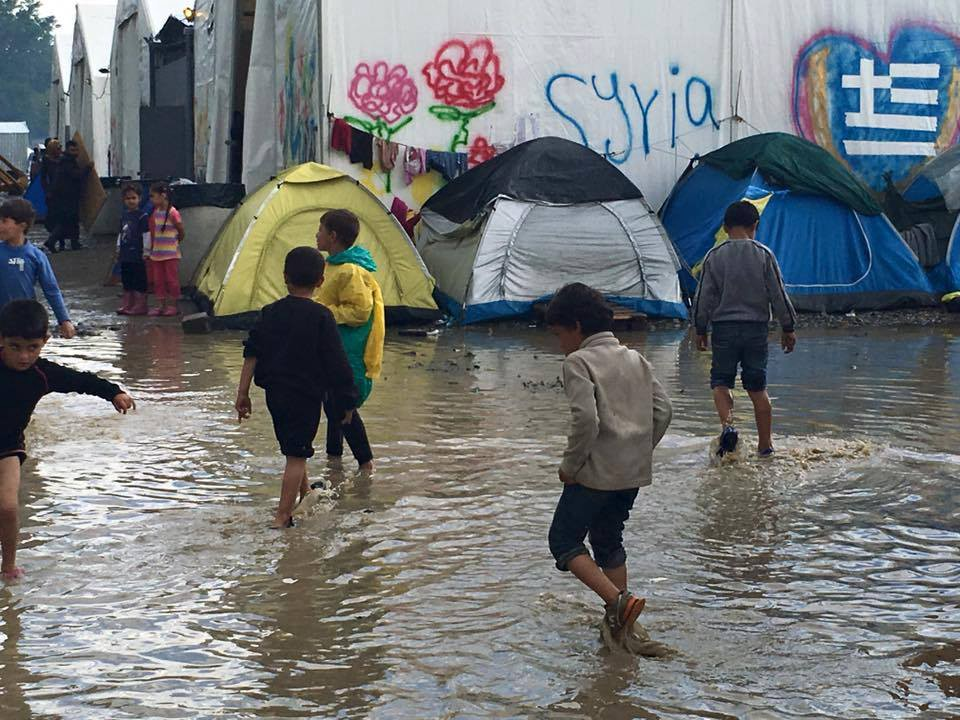
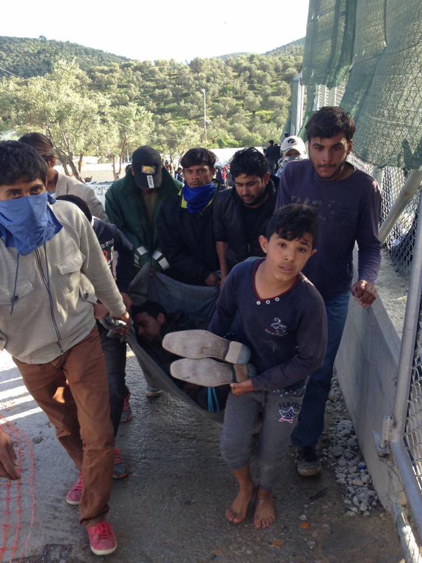

### _AYS DAILY NEWS DIGEST 26\.4\.2016\._
#### Serbian authorities evicted camps in Belgrade in preparation for a luxury real estate project\. Large aid convoys were sent to Rastan\. 116 refugees were deported to Turkey today and more are to come, as Greece makes asylum claims even more difficult by designating Turkey a “Safe Third Country”\. Clashes broke out between refugees and police on Lesvos\. Greece arrested 130,000 in the first two months of 2016 for illegally entering and staying in, in comparison to 9,000 in the entirety of 2015\. MSF resumes its search\-and\-rescue operations in the Mediterranean\. Germany seeks to make it easier to deport LGBT refugees from Morocco, Algeria, and Tunisia to their home countries, disregarding the laws criminalizing homosexuality\.

Photo from today’s eviction of Mikaliste Camp in Belgrade\. The photographer asked to remain anonymous\.
#### _Featured News‪_
### Belgrade camps are being cleared in preparation for UAE\-backed real estate development\.

> [_\#‎Miksaliste‬_](https://www.facebook.com/hashtag/miksaliste?source=feed_text&story_id=615747508574136) _and No Border Squat are in process of being evicted\. You can follow what is happening in [‪\#‎belgraderefugeefront‬](https://www.facebook.com/hashtag/belgraderefugeefront?source=feed_text&story_id=615747508574136) on Twitter\. Miksaliste and No Border squat are the most crucial points of refugee support in Belgrade\. The area is probably being evicted as part of the preparation for a big real estate project called Belgrade Waterfront \(popularly dubbed Belgrade Waterfraud\) \. As friends from Belgrade report, the government and the city are employing fast and quick solutions of any kind to evict everybody from that zone\. Last night hooligans wearing ski masks got into two tents in that area\. The investors of the project are from the United Arab Emirates and Serbia\. It is being reported that refugees are being forcibly registered, but not given any papers\._ 

#### _Syria [‪](https://www.facebook.com/hashtag/syria?source=feed_text&story_id=615747508574136)_
### Massive aid convoy of 35 trucks delivered to Rastan, Homs Province\.

> _Relief groups on Monday began a major humanitarian aid delivery to tens of thousands of besieged people in an opposition\-held central Syrian town\. The aid convoy to the town of [‪\#‎Rastan‬](https://www.facebook.com/hashtag/rastan?source=feed_text&story_id=615747508574136) , in [‪\#‎Homs‬](https://www.facebook.com/hashtag/homs?source=feed_text&story_id=615747508574136) province, included 35 trucks carrying food, medicine, diapers, delivery kits for pregnant women and anti\-lice shampoo, ICRC spokesman Pawel Krzysiek said\. The town has been under siege since January\. It received its first batch of humanitarian aid in over a year on Thursday\. The population of Rastan had doubled to 120,000 because of the influx of people fleeing nearby fighting in the [‪\#‎Hama‬](https://www.facebook.com/hashtag/hama?source=feed_text&story_id=615747508574136) province\. Last Thursday, aid groups sent 65 trucks into the town in the largest aid delivery yet in Syria\. More than four million people live in besieged or hard\-to\-reach areas with little or no access to food or medicines\. Rebel groups took control of Rastan and the vast agricultural land around it in 2012\. Residents had since received so little aid that they found it hard to believe there would be a second delivery so soon\._ 

#### _Turkey_
### 116 refugees were sent back to Turkey today\.

> _Today, 35 refugees arrived to [‪\#‎Dikili‬](https://www.facebook.com/hashtag/dikili?source=feed_text&story_id=615747508574136) from \#Lesvos\. An estimated 50 refugees have arrived in to [‪\#‎Çeşme‬](https://www.facebook.com/hashtag/%C3%A7e%C5%9Fme?source=feed_text&story_id=615747508574136) today from the Greek island of [‪\#‎Chios‬](https://www.facebook.com/hashtag/chios?source=feed_text&story_id=615747508574136) \. Mostly Iranian and Afghans, they were registered and sent to the camp in Dikili\. Later in the day, another 31 arrived in [‪\#‎Milas‬](https://www.facebook.com/hashtag/milas?source=feed_text&story_id=615747508574136) , arriving from the Greek island of [‪\#‎Kos‬](https://www.facebook.com/hashtag/kos?source=feed_text&story_id=615747508574136) \. Turkey has promised to protect all asylum\-seekers sent back from Europe, not just Syrians, the European Union said on Tuesday, hoping to ease concerns about the main EU strategy to stem the migrant flow into Greece\._ 

Idomeni Camp has been flooded once again\. Photograph by the Refugee Solidarity Movement Thessaloniki\-Eidomeni
#### _Greece_

> _You can reach weather report for Eastern Aegean Sea through this link: [https://www\.facebook\.com/save\.assist\.outreach/photos/a\.1760536737501052\.1073741830\.1753997264821666/1784012318486827/?type=3&hc\_location=ufi](https://www.facebook.com/save.assist.outreach/photos/a.1760536737501052.1073741830.1753997264821666/1784012318486827/?type=3)_ 

> _There have been twelve new arrivals today on Lesvos since this morning until 7:30, in addition to a total of 7959 on all the Greek islands, exceeding the capacity of 7450 at the camps\. At 10185, Idomeni is the largest of all individual locations where refugees are residing\. Overall, there are currently 53885 refugees in Greece, 45896 of whom reside in the mainland\._ 

> _For a more detailed breakdown of the numbers, go here: [http://media\.gov\.gr/index\.php/%CF%85%CF%80%CE%B7%CF%81%CE%B5%CF%83%CE%B9%CE%B5%CF%83/%CF%80%CF%81%CE%BF%CF%83%CF%86%CF%85%CE%B3%CE%B9%CE%BA%CF%8C\-%CE%B6%CE%AE%CF%84%CE%B7%CE%BC%CE%B1/summary\-statement\-of\-refugee\-flows\-26\-4\-2016](http://media.gov.gr/index.php/%CF%85%CF%80%CE%B7%CF%81%CE%B5%CF%83%CE%B9%CE%B5%CF%83/%CF%80%CF%81%CE%BF%CF%83%CF%86%CF%85%CE%B3%CE%B9%CE%BA%CF%8C-%CE%B6%CE%AE%CF%84%CE%B7%CE%BC%CE%B1/summary-statement-of-refugee-flows-26-4-2016)_ 

### Important information about new guidelines for refugees claiming asylum in Greece\!

> _The new asylum procedure is to have an interview about the admissibility of their claim for asylum in Greece first, before the substantive interview\. Most people having their asylum claims rejected now are being rejected on grounds of inadmissibility by the government, which claims that Turkey is a Safe Third Country for them\._ 

> _Three of the absolutely key legal criteria for a Safe Third Country are\-_ 

> _1\) that there is no risk of refoulement \(forcible repatriation to their country of origin or any country or area where they have a well\-founded fear of return to\) and_ 

> _2\) that they have fully legal access to have their substantive claims for asylum examined in that third country, and_ 

> _3\) that they can get recognition of Refugee Status and effective protection in accordance with the Geneva Refugee Convention 1951 in that third country\._ 
 

> _[The Turkish governor of Izmir has explicitly said that non\-Syrians will be detained for immediate deportation if returned from Greece](http://multeci.org.tr/haberdetay.aspx?Id=140) , i\.e\. no access to asylum procedures and no chance to have their substantive claim examined or to receive effective protection\. and this is in fact what has happened to all non\-Syrian returnees so far\._ 

> _For the Syrians returned to Turkey, [there is also a significant risk of refoulement](https://www.amnesty.org/en/press-releases/2016/04/turkey-illegal-mass-returns-of-syrian-refugees-expose-fatal-flaws-in-eu-turkey-deal/) \- which the Turkish government pretends are ‘voluntary’, by deceiving people into signing voluntary repatriation papers in Turkish which they don’t understand\._ 

> _For further reading go to: [https://www\.facebook\.com/groups/informationpointforlesvosvolunteers/permalink/519573711583414/?hc\_location=ufi](https://www.facebook.com/groups/informationpointforlesvosvolunteers/permalink/519573711583414/)_ 

> **_Refugees: it is very important to prepare carefully for your interviews; you will have an interview on the admissibility of your claim in Greece before you may have an interview on your substantive claim for international protection — it is important you understand what this means before your interview so that you know what the questions are really about and how to argue the best version of your case that you have a well\-founded fear of return to Turkey or that you do not believe you will get a fair examination of your substantive claim for international protection in if returned to Turkey; if you get a rejection on inadmissibility of your claim in Greece, you can appeal and the appeal will have automatic suspensive effect on the deportation decision, but you only have 5 \*calendar\* days \*including holidays\* to lodge your appeal — it is highly recommended to get a Greek lawyer experienced in asylum cases to help you with this, but if you cannot find or fund one fast enough, you can lodge your appeal yourself within the 5 days and then find lawyer to help you with it later, lodging the appeal will get you more time to find legal aid\._** 

Photograph from today’s protest\. Photographer: Nikos Mpitisimeas
### Clashes broke out on Lesvos between police and refugees

> [_Clashes broke out between police and the refugees held at a detention center on the Greek island of ‪\#‎Lesvos‬ on Tuesday, a police spokesman said\._](http://www.ekathimerini.com/208197/article/ekathimerini/news/clashes-break-out-at-migrant-camp-on-lesvos) _The spokesman said that the incidents started in a wing holding minors at the [‪\#‎Moria‬](https://www.facebook.com/hashtag/moria?source=feed_text&story_id=615747508574136) camp and spread\. Bins were set on fire, the spokesman said\. “Riot police are conducting an operation in and out of the camp at the moment,” the spokesman said\._ 

### Refugee arrested in San Andreas, likely for receiving aid from elsewhere\.

> _Today in San Andreas Camp, a refugee was arrested by the military because he received aid from outside the camp\. Currently volunteer groups cannot verify if receiving outside aid was the only reason why the refugee was arrested\. Same groups reported that these outside supplies can be fake goods or harmful drugs and they called the authorities to allow registered volunteers to be granted access to supply aid and provide services to the camps\. This is essential for the safety and security of military and the refugees alike\._ 

**130 thousand migrants arrested in the first two months of 2016 for illegally entering and staying in Greece, compared to 8,921 in the entirety of 2015\.**

> _In Greece in the first two months of 2016, illegal arrested immigrants reached more than 130,000\. According to the 22 April 2016 of the Greek Police \(ELAS\) given to the public data more than 130,000 immigrants were arrested for illegal entry or illegal stay in Greece in the first two months of 2016 by the police and port authorities\. In the corresponding period of 2015 just 8,921 people were arrested\. The daily average number of arrests in the first two months of 2016 was 2,171 immigrants\._ 

> _Detailed results: At the Greek\-Turkish sea border 124,520 illegal immigrants were arrested\. Last year, there were just 4,657\. At the Greek\-Turkish land border 1,013 people were arrested\. Last year \(2015\) there were 116\. In Greek\-Albanian border area 851 people were in 2016 in the first two months of this year arrested\. In the corresponding period last year there were 1,204\. In the border area Greece — Skopje 213 people were in 2016 in the first two months of the year arrested\. 2015, the number 104th\. At the Greek\-Bulgarian border in 2016 a total of 210 people were arrested\. in 2015 arrested 107th Elsewhere in the country 3,295 illegal immigrants were in 2016 in the first two months of the year arrested\. 2015 had been arrested in the first two months of 2508\. \(Source: dikaiologitika\.gr\)_ 

### Pamphlets distributed in Idomeni inciting refugees to leave\.

> _Today a leaflet has been distributed in Idomeni\. Unlike the previous rhetoric, today’s leaflet was far more imperative in its language\. It ordered refugees to leave Idomeni because the borders will not be open and move to other camps prepared for them where they will wait for their relocation\. Its language has been telling of the declining status of refugees in the eyes of the Greek authorities\._ 

### Refugees start petition to end the error\-laden process currently dependent on Skype\.

> _Refugees in Greece have started a petition demanding face\-to\-face service for their asylum application process\. You can sign the petition at the following link:_ [https://www\.change\.org/p/skype\-is\-no\-solution\-we\-need\-face\-to\-face\-services\-for\-refugees\-in\-greece\-livesonhold](https://www.change.org/p/skype-is-no-solution-we-need-face-to-face-services-for-refugees-in-greece-livesonhold) 

#### _Hungary_
### Refugee reports on the hardships of crossing the Hungarian\-Serbian border, neglect faced in Budapest camp\.

> _As reported by refugees, Hungary opens the border with Serbia every night around midnight, and they let about 30 refugees through\. People wait in line for days and nights, and they are afraid to go to sleep because they might lose their place in the line\. Single men stay there up to 20 days and families up to 10\. The refugee that reported the story to us stayed there 7 days with his family\. When he left 7 days ago, there were approximately 250 refugees waiting\. The people staying there are exposed to the weather; even though UNHCR brings food twice a day, there’s not enough; there’s no place for charging phones so people lose touch with their families for a long time\. They must all request asylum, and if they don’t, Hungary will send them back\. Some of refugees have passports, some papers, and some of them have nothing\. They are then taken to [‪\#‎Bicske‬](https://www.facebook.com/hashtag/bicske?source=feed_text&story_id=615747508574136) camp in [‪\#‎Budapest‬](https://www.facebook.com/hashtag/budapest?source=feed_text&story_id=615747508574136) \. The refugee also talks about Bicske camp in Budapest, saying that the police are mistreating the refugees, using pepper spray inside the camp, yelling, and swearing at people\. There is no support structure in the camp\._ 

### _Upon further inquiry on this curious border opening, one activist gave us the following information\._

> _“In [‪\#‎Horgos‬](https://www.facebook.com/hashtag/horgos?source=feed_text&story_id=615747508574136) and [‪\#‎Kelebija‬](https://www.facebook.com/hashtag/kelebija?source=feed_text&story_id=615747508574136) there are so called Transit Zones\. Hungary introduced these zones already on 15th September 2015\. Within the transit zone at both sites there are offices of the Hungarian Immigration Ministry\. These zones are the only legal entrances to Hungary, where people without papers can ask for asylum\. Since last September, the Hungarian government reduced the numbers of entries from 100 to 50 to 30 to 20 persons per day and per zone\. And during the last few days, we hear that the number was increased to 30 again\. Right now 120 people wait in Kelebija, and 140 in Horgos to get inside\. Only families with children up to 15years old and vulnerable people get the chance to get inside\. Single men are being pushed back\. The Hungarian UNHCR has access to the Transit Zone\. The conditiones within the zone are bad\. Only a few containers provide shelter and people are kept inside for a while\. It has been reported that people do not get adequate amounts of food\. The Serbian UNHCR is present outside the Transit Zone on the Serbian side\. Additionally, HCIT, which is a partner of UNHCR is present and distributes food and NFI’s\. Additionally, MSF is present daily since about two weeks and provides medical care and more, also to surrounding areas, where people seek shelter\. This has nothing to do with passports and has even less to do with open borders\. This practice existed since many month and has not changed\. What changed is that more people are going to these tranzit zones to seek for asylum and cross into Hungary legally\._ 

> _It is correct that not many NGO’s have access so far\. The situation is getting worse due to the lack of any sanitation facilities and shelter\. And because more people are going to these places, the waiting time increases\.”_ 

#### _Croatia_
### Refugees staying in Hotel Porin in Zagreb protest over subpar conditions\.

> _Refugees accommodated in hotel [‪\#‎Porin‬](https://www.facebook.com/hashtag/porin?source=feed_text&story_id=615747508574136) in [‪\#‎Zagreb‬](https://www.facebook.com/hashtag/zagreb?source=feed_text&story_id=615747508574136) were protesting this morning due to unsatisfying living conditions — primarily bad quality of food, lack of legal and health support\. The refugees believe that the Croatian Government does not want to provide a secure future for them and their kids and are asking why they do not let them go if this is the case\._ 

#### _The Mediterranean_
### MSF resumes its search and rescue operations in the Mediterranean\.

> _The medical relief charity Medecins sans Frontieres has relaunched rescue operations in the Mediterranean Sea, accusing European governments of failing to act to save migrants in peril at sea, it said on Monday\. MSF halted its maritime rescue program in January, saying it hoped European Union member states would take up the task of search and rescue of refugees attempting the crossing from North Africa to Europe\. But with the rising numbers of people trying to navigate the deadly stretch of water between Libya and Italy as the weather warms, more refugees were in danger of drowning, MSF said\. “The absence of a global solution to the current refugee crisis, and the European states’ policies of deterrence, as well their refusal to provide alternatives to the deadly sea crossing, continue to kill thousands,” said Joanne Liu, the president of MSF International in a statement\._ 

#### _Germany_
### The German government defends its designation of Algeria, Morocco, and Tunisia as safe countries despite laws criminalizing homosexuality, seeking to make deportations of LGBT refugees easier\.

> _By declaring Algeria, Morocco and Tunisia as safe countries of origin, the German government wants to make it easier to deny asylum to gay and lesbian refugees from these countries\. After the Bundesrat doubted this method, the government responded: [“Homosexuality becomes penally relevant for authorities \[in Algeria\], when it’s lived openly\.”](https://www.taz.de/Schnellere-Abschiebungen/!5299105/) Going one step further this means that gays and lesbians don’t get trouble if they keep their orientation a secret —therefore they should, and so there is no problem to deport them\. In Algeria for example, gays can be imprisoned for up to two years or be sentenced to a fine\. Homosexuality is forbidden by law in all of the three countries\. Human aid organizations reported cases of torture in the prisons such as anal examinations\. The court case against the EU found this European practice criminal\. European Court of Justice \(ECJ\) ruled in Dec\. 2013: Article 10\(1\) \(d\) of Directive 2004/83, read together with Article 2\(c\) thereof, must be interpreted as meaning that only homosexual acts which are criminal in accordance with the national law of the Member States are excluded from its scope\. When assessing an application for refugee status, the competent authorities cannot reasonably expect, in order to avoid the risk of persecution, the applicant for asylum to conceal his homosexuality in his country of origin or to exercise reserve in the expression of his sexual orientation\._ 

#### _UK_
### After the failure of the Dubs Amendment in Parliament, Labour seeks reintroduce a similar bill without giving a specified number of children to be relocated\.

> _After the UK government voted against accepting 3,000 children into UK, Labour peer’s proposal sidesteps financial issues by not giving a specific number\. The amendment captures the spirit of the initial proposal but removes the obligation to provide sanctuary to 3,000 children\. Instead, it will ask the government to resettle “a specified number” of children in consultation with local councils\. Martha Mackenzie, the senior government adviser for Save the Children, said: “We feel very optimistic that the new amendment, when it goes back to the Commons, has a chance of being accepted\. A number of Conservative MPs put their heads above the parapet to do something about children in Europe\. They were uncomfortable at the prescriptive nature of it, at having a number on it\. But for a number of MPs, the new amendment could be the thing that encourages them to break ranks and vote for it\.” MPs voted against the amendment by 294 to 276 on Monday night, after the Home Office argued it was doing enough to help refugee children in Syria and neighbouring countries\._ 

#### _Spain_
### Amnesty International put up a fence in Madrid to bring awareness to refugees’ plight\.

> _Today, Amnesty International Spain put up a fence in the plaza \#AgustinLara, \#Lavapiés, \#Madrid, to report that hundreds of thousands of refugees are trapped while Europe is still deporting them back\. Amnesty says, “We don’t want that European leaders continue to embarrass us\. Signing our manifesto \#yoacojo at [http://amn\.st/6004Bl7K4](http://l.facebook.com/l.php?u=http%3A%2F%2Famn.st%2F6004Bl7K4&h=dAQHOElrWAQHLoD0XIY0kd6n5NH2l3_f2INr3ckEeSr0u4g&enc=AZPs4e1ICpHpvHYWkStEMW23THt382sw0q8TWJa4aWFvyu6DrRV7FD5x5LXSxhyBp6JyIqyx_naOKbj3ZiyMSBLqyVjjo5zE5Z2Y2gH4c2CDElIzgE7olds84uruUQdX6jIyZb_V3wZ0ZksbVVJdGOZr2z0IjsmSpWU-lkn3_xR2qCAuyxbzBEf0w7G6e1nt9SlTuNph7zNyFc_EUQhKNTMm&s=1) ”_ 

_Converted [Medium Post](https://areyousyrious.medium.com/ays-daily-news-digest-26-4-2016-d315978c1558) by [ZMediumToMarkdown](https://github.com/ZhgChgLi/ZMediumToMarkdown)._
