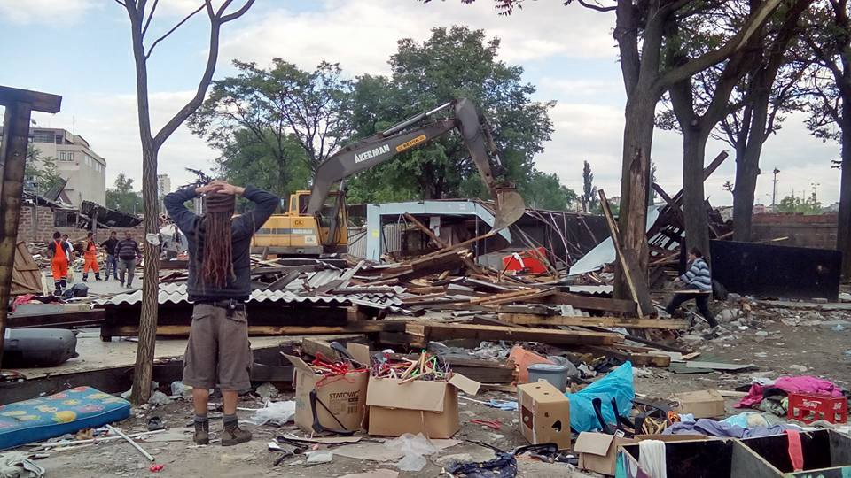
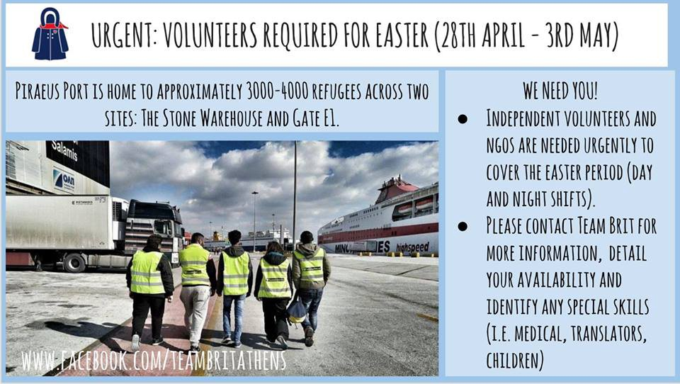
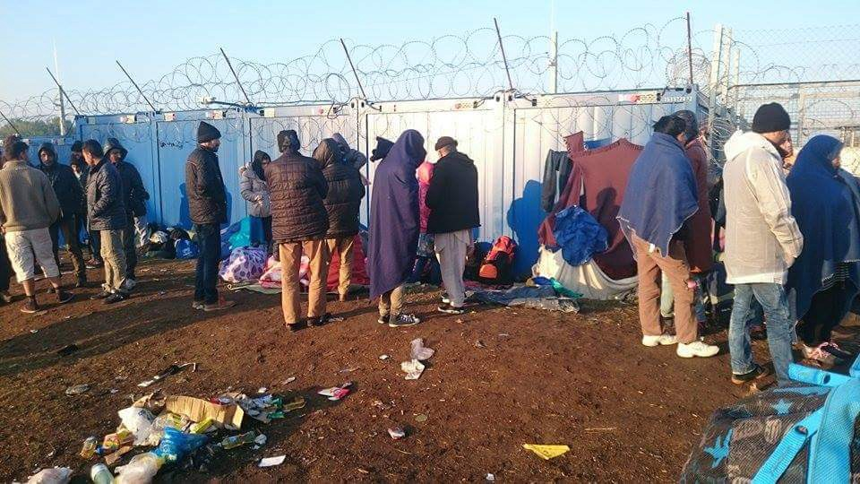
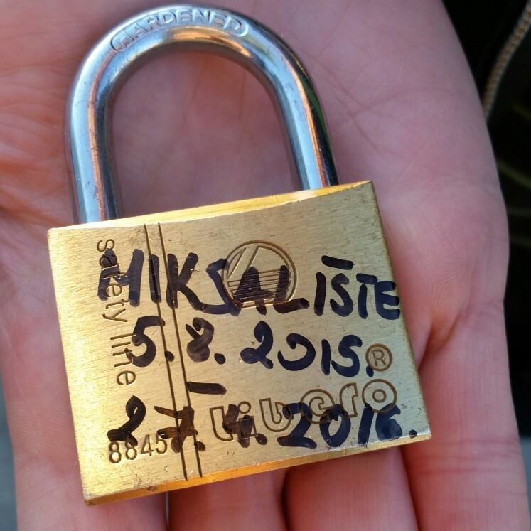
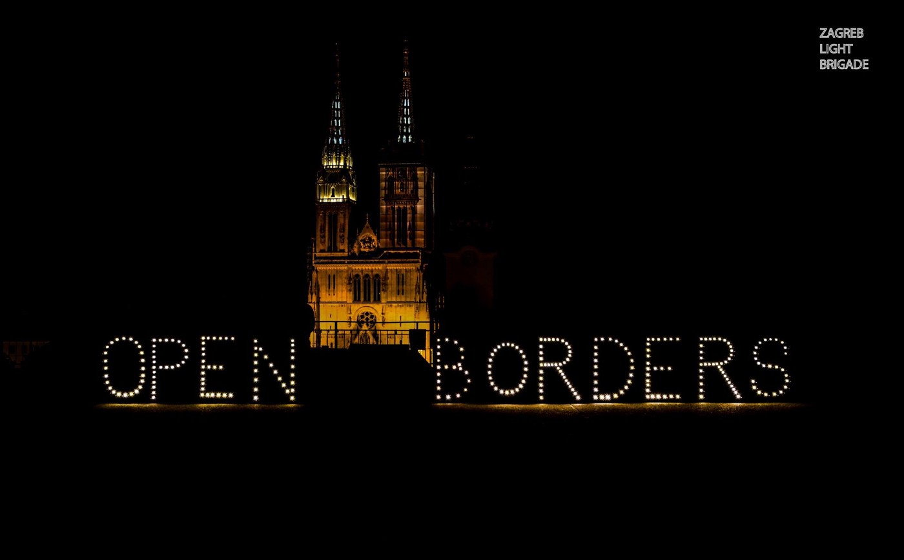
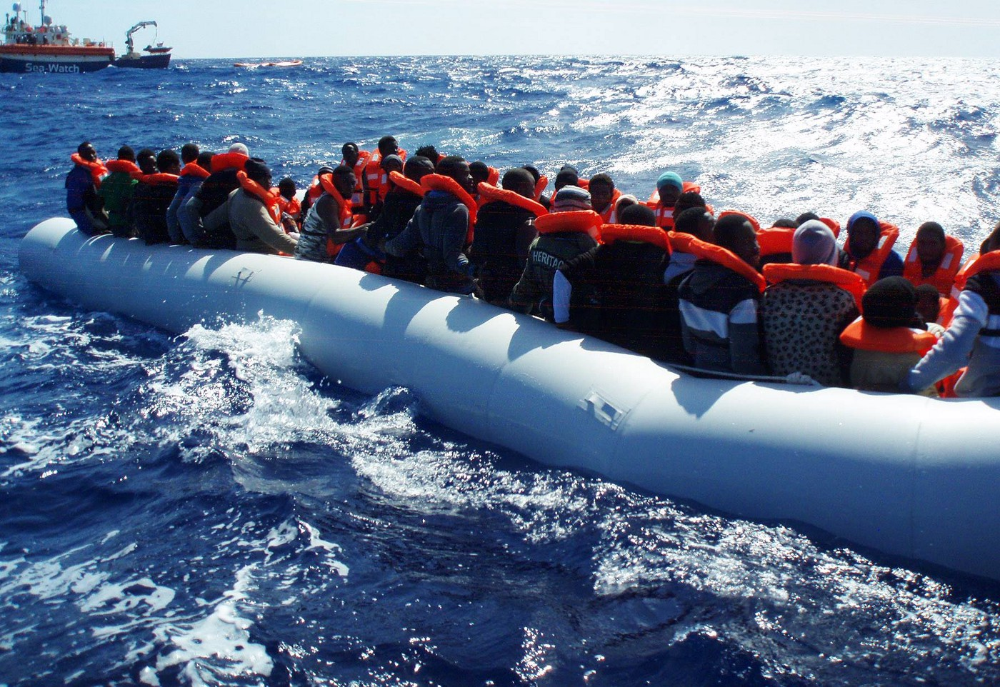
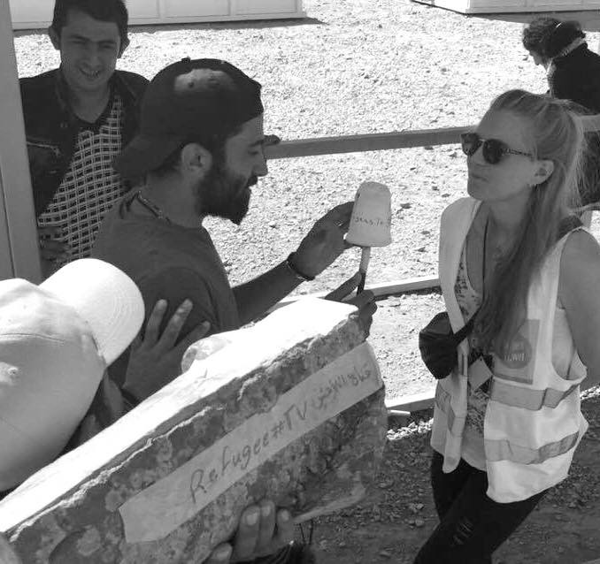

### **AYS DAILY NEWS DIGEST 27\.4\.2016\.**
#### _People are still moving through the Balkan route and towards Europe, often with smugglers\. Meanwhile, Turkey and the EU have reached an agreement which promises to allow non\-Syrians to register and apply for asylum as well\. The Greek government promised that it will soon speed up rulings on asylum applications\. Austrian parliament passed legislation that makes it significantly harder for refugees to seek asylum in Austria, and would allow for the government to declare a state of emergency if the influx of refugees into the country threatens “national security,” and allows asylum seekers to be rejected directly at the border\. Amnesty International harshly criticized this decision\._

Miksaliste, day after eviction\. Photo by Zarka Radoja
#### WEATHER REPORT FOR WEDNESDAY \(Night\) APRIL 27:
#### WARNINGS FOR KASTELORIZO: Temperature: 16–22°C\. Wind 2–3Bf \(low\-medium\) \. Wind direction: NorthWest\-West\. Waves: up to 2m \(SEVERE WARNING\) \. At Idomeni, temperature from 20:00 wil be from 10 to 13°C\. Light Breeze, humid, few clouds\. //Tomorrow: Temperature 10–23°C\. Moderate Breeze, humid, partly cloudy throughout the day\. For more [weather](https://www.facebook.com/save.assist.outreach/photos/a.1760536737501052.1073741830.1753997264821666/1784502425104483/?type=3)
#### Featured News

**79 new arrivals to Greece today\.**

> _Refugees are continuing to arrive to Greece, and more are making their way into other countries on the Balkan route, as well as some EU countries\. According to the [UNHCR data](http://data.unhcr.org/mediterranean/country.php?id=83) , yesterday 62 people were registered on the Greek islands, 17 on mainland Greece\. At the same time, 73 people were registered in Serbia, 127 in Hungary, and 230 in Austria\._ 

…\.
#### Turkey
### Non\-Syrians to be allowed to register for asylum

> _According to [FAZ Woche](http://www.faz.net/aktuell/politik/fluechtlingskrise/f-a-z-woche-exklusiv-tuerkei-weitet-schutzzusage-fuer-fluechtlinge-erheblich-aus-14202700.html#GEPC;s6) , Turkey now allows non\-Syrians to register and apply for asylum as well\. This is critical to the EU, as it allows it to accelerate deportations — Greek judges only agreed to dismiss refugees’ appeals if Turkey extended legal guarantees to migrants\. Out of 6,500 refugees stranded on the Greek islands, 2,500 come from Syria, while the rest comes from Afghanistan, Iraq, Iran, Pakistan, Bangladesh and other countries\._ 

#### Syria

**20 were killed in regime airstrikes today in Aleppo, among them the last pediatrician in rebel\-occupied Aleppo\.**

> [_The White Helmets have reported_](https://www.yahoo.com/news/14-killed-syria-regime-strike-aleppo-civil-defence-211739175.html) _that at least 20 people were killed tonight in regime\-led airstrikes which targeted a hospital and a residential building\. Among the dead is the last remaining pediatrician in rebel\-occupied East Aleppo\. Earlier in the day, 5 were killed in regime strikes on eastern Aleppo\. Also reported was the killing of 11 people in western Aleppo by rockets reportedly launched by Al\-Nusra\. Over 100 people have been killed in Aleppo since Friday\._ 

#### Greece

> _No boats landed in the North of \#Lesvos\. None information available on South\. Today morning new boat landed in \#Chios, 55 refugees arrived\._ 

**2707 \(according to government sources\) continue to reside in the vicinity of Port Piraeus amidst government efforts to clear the area\.**

> _The [UNHCR has compiled the available data](http://data.unhcr.org/mediterranean/regional.php) on the situation in some of the camps around Greece\. At \#PiraeusPort, efforts to depopulate the port are ongoing\. All those previously located at the E2 Gate were transferred\. Refugees and migrants who did not move to official sites, established by the Greek authorities, were transferred to the stone warehouse at the port\. According to the Greek Government, the number of people remaining at E1 Gate and the stone warehouse is estimated at 2,707\. Those remaining at E1 Gate will be transferred by the end of next week\. Sources on the ground tell us that this number may be significantly higher, however\._ 

**100 refugees moved to Lagkadikia\.**

> _The UNHCR supported the transfer of 53 people from the [\#EKO](https://www.facebook.com/hashtag/eko?hc_location=ufi) gas station and 47 from the \#Idomeni informal site, to \#Lagkadikia accommodation site\. Those at the site are mainly Syrian and Iraqi families with children\._ 

### Greek authorities are struggling to find accommodations for unaccompanied minors\.

> [_Ekathimerini\.com reports_](http://www.ekathimerini.com/208249/article/ekathimerini/news/authorities-scramble-to-find-housing-for-child-refugees) _that 380 unaccompanied minors remain without housing due to staff shortages\. According to the law, it is illegal for a minor to be housed in hotspots, but this continues to happen\. The National Center of Social Solidarity is working to accommodate 200 minors by the end of May\._ 

**54 thousand refugees are currently stranded in Greece, and authorities only examine 50 applications for relocation on the islands\.**

> _As of 25 April, authorities will examine 50 applications per day on the islands\. So far \(as of 20 April\), the Asylum Service registered 3,870 applications for relocation\. Overall there are still approximately 54,000 refugees stranded in Greece\._ 

### Greek government seeks to speed up asylum application process\.

> _The Greek government has said that authorities will soon speed up rulings on asylum applications, as the requests have been piling up\. Many criticisms have been made of the process for being far too slow\. The government’s spokesman for the migration crisis, Giorgos Kyritsis, said that Athens was “not cutting corners and not delaying\.” About 8,000 refugees and migrants are currently on the Greek islands, having arrived after the deal was implemented\. So far under the EU\-Turkey deal, the [International Organisation for Migration](https://www.iom.int/news/syrian-resettlement-europe-picks-following-eu-turkey-agreement) \(IOM\) has helped to resettle 350 Syrians from Turkey to Austria, Denmark, and Germany\. It expects to resettle another 300 this week, mostly in France\._ 

**17 people injured during the clashes at Moria camp as people remain detained and in fear of deportation to Turkey\.**

> _According to the Greece media, 17 people have been injured during the clashes yesterday at \#Moria camp\. The atmosphere is still tense\. One of the volunteers reported:_ 

> _“I arrived after almost all people were in tents, but I witness one unnecessary shot of teargas\. Police closed the area around for hours, many ambulances comes from \#Mytilene collect injured refugees\. \#MSF doctors waiting outside if needed\. Bad situation for few refugees from Cameron, Kongo seeking asylum, they stays over 1 month without access to any official information, asylum process not starting\.”_ 

> _Around 4000 refugees are being kept in a closed center in Moria, waiting for their decision for asylum\. Many of them are afraid of being sent back to Turkey\._ 

### Refugees currently in Vial are being relocated to camps on Leros\.

> _Volunteers at \#Vial are reporting that some refugees are being taken to the camps at \#Leros\. Today one boat left with three families who agreed to be transferred\. The rest are currently at the port awaiting transportation, not being sure where they are going\._ 

> _There are three structures on Leros — \#Lepida, the hotspot which has some local volunteers and also volunteers from \#Echo100\+ and the Refugee Boat Foundation; there is also \#Pikpa, run by Matina Katsiveli with the help of Jo Finn and Anne Tee and Catherina De Geer, which has been independently organized by the volunteer community and now has been recognized by first reception, with conditions superior to surrounding camps, and there is \#VillaArtemis — which is a structure for women and their children traveling without men — this is not ‘recognized’ in the same way but has been used extensively over the last year\._ 

### Volunteers urgently needed in port of Piraeus \(28–3 May\) \.

> _Team Brit as well as other volunteer organizations have placed an URGENT CALL for independent volunteers, teams and NGOs in the port of \#Piraeus from the 28th of April until the 3rd of May due to a lack of available volunteers during upcoming national holidays\._ 

### Refugees have launched a petition to replace the inefficient Skype system used by the Asylum Office\.

> _People at \#Idomeni are petitioning for the replacement of the “failed system of only being able to make asylum appointments to the Greek Asylum Office with a Skype call that is never picked up with a face\-to\-face service in the refugee camps here in Greece”\. Refugees in Greece have only three options to continue their lives beyond camps: to apply for asylum in Greece, to apply for family reunification or for relocation to another country in the EU if they want us\. You can sign the petition [here](https://www.change.org/.../skype-is-no-solution-we-need...) \._ 

### Donations of the following items are needed in many camps\.

> _Needed items in Greek camps \(remember, buy locally as much as possible\): sunscreen, caps/sun hats, new underwear for all, socks for all plastic bowls for washing, kettles, SHOES/ Flip flops for all, long sleeve tunics, light cotton clothing\-think conservative, flip flops and sandals, rocket stoves for military camps, leggings for women, shorts for men , mosquito repellent, lice medicine, cough drops, Oxylent Vitamins, cough syrup, head scarves, T\-shirts, hygiene articles, pajamas, towels, baby clothes, summer clothes for all, shampoo, soap, washing detergent, rice\. See [here](https://docs.google.com/document/d/1N0QrpM7qrIMjDglhrlu7dQVRC2agR4S1FjgsMOF3AdA/edit) for more on what is needed and who to contact\._ 

### Trains in Greece are halting service from April 30 to May 2\.

> _For all traveling around Greece — trains and the suburban railway will halt services from Orthodox Holy Saturday afternoon until Easter Monday morning following a strike called for by employees in the Railway Organization of Greece \(OSE\) \. According to a press release, employees are demanding that the government drops its plan to privatize railway network operator TRAINOSE and hires more train drivers\. The strike will take effect at 18\.00 on Saturday \(April 30\) and will end at 10\.00 on Monday \(May 2\) \. Metro services to and from the airport will not be affected by the strike\._ 

#### Serbia
### Forgotten people at the border with Hungary

> _Many people are still living in inhumane conditions at the Serbian\-Hungarian border and are in need of doctors, food, water, tents, medical supplies, toiletries and other basic needs\._ 

Photo by Wieke Lowenhardt
### Serbian official calls on the mayor’s office to explain the eviction of Miksaliste\.

> _After \#NoBorder squat and \#Miksaliste were evicted, the most crucial points of refugee support in \#Belgrade, Serbia’s Public Information Commissioner Rodoljub Sabic has called on the Mayor’s office to clarify the circumstances under which this happened\. According to the available information, the sites were destroyed by some 30 masked people\. Police, according to the available information, refused to intervene, even though they were called by the citizens\._ 

> _Both places were probably evicted as part of preparation for the big real estate project called Belgrade Waterfront \(popularly dubbed Belgrade Waterfraud\) \. Miksaliste became a center for the collection and distribution of humanitarian assistance for refugees in August 2015\. Around 300 to 350 refugees came every day to get free clothing, footwear, food and medical services\. Since August last year, Miksaliste has hosted around 110,000 refugees\._ 

#### Croatia
### Conditions in Porin significantly improved

> _During yesterdays protest in hotel \#Porin, where asylum seekers are located, without their knowledge, one remarkable lady took over responsibility of the hotel\. Immediately, everything changed\. We are receiving lots of messages saying that they all got food, all babies got milk etc\. They are also provided with legal help, and promised that soon language and culture courses will be organized\. People in Porin report that they are happy\._ 

### Group protests EU\-Turkey deal during Erdogan’s visit to Croatia\.

> _On the occasion of the arrival of Turkish President Erdogan in Croatia, the initiative [Zagreb Light Brigade](https://www.facebook.com/zagreblightbrigade/) demanded the withdrawal of the unjust agreement between the European Union and Turkey under which refugees are being deported and held in Turkey, and the opening of borders\. UNHCR and human rights organisations believe that this agreement does not provide refugees with legal protection, and Amnesty International called it a historic step back for human rights\._ 

> _“Turkey is not a safe country for its own citizens, let alone for refugees\. The media have recently published information about the behavior of the Turkish government towards Syrians, and warned of the killings of Syrians on the Turkish border and the return of refugees in war\-torn Syria\. Hosting the leader of a country who ruthlessly violates human rights in Turkey is unacceptable\!”_ 

#### Italy

**232people saved off the coast of Italy\.**

> _Sea\-Watch Boat reports about two rescued boats with over 200 people on board\. One boat carried 112 people, including 60 women, pregnant women and one toddler, and the other 120 people including several women\. Most refugees were from Mali, Senegal, Ghana, Nigeria and Burkina Faso\. They are now brought to Italy\._ 

> _“Crew is happy but exhausted and got now back to patrolling for more refugee boats” Sea\-Watch Boat reports\._ 

Photo by Sea\-Watch Boat
#### Austria
### New legislation makes it more difficult to seek asylum in Austria, gives the government the right to declare a state of emergency in response to refugee influx\.

> _The German website [dw\.com](http://www.dw.com/en/austria-votes-on-strict-new-refugee-legislation/a-19218118) reported that the Austrian parliament passed legislation which makes it significantly harder for refugees to seek asylum in Austria\. It allows the government to declare a state of emergency if the influx of migrants to the country “threatens national security,” and allows asylum seekers to be rejected directly at the border\. This would include refugees from war\-torn countries such as Syria\._ 

> [_Amnesty International condemns_](https://www.amnesty.org/.../04/austria-asylum-law-refugees/) _the new legislation, calling it a violation of international law, while [Human Rights Watch calls](https://www.hrw.org/.../austria-drastic-unjustified) it a “blow to the rights of asylum seekers”\. Judith Sunderland, acting deputy Europe and Central Asia director at Human Rights Watch, says “these measures constitute a legal wall to asylum just as despicable as a razor\-wire fence”, adding Austria should not take “unilateral decisions to pass asylum seekers around like hot potatoes\.”_ 

### Austria is building a fence on the Italian border, begins to control traffic on roads and railroads\.

> _Austria plans to close the \#Brenner pass by building a 370 meter long fence and by starting to control toll\-free roads and railroads in addition to the highway, as it believes refugees will soon arrive in large numbers from North Africa to Europe\. Italian Prime Minister Matteo Renzi says the number of migrants arriving to Italy do not justify Austria’s decision and calls it a ‘ [bold violation of EU rules](http://www.handelsblatt.com/politik/international/fluechtlinge-sollen-draussen-bleiben-oesterreich-schottet-sich-ab/13511176.html) ’\. Austria’s government will also spend €1\.825bn more on security forces\._ 

#### Belgium
### Belgian group asks the government to institute a program that would allow for families to host refugees\.

> _The Humanist Democratic Centre \(CDH\) ask the Parliament of Wallonia to establish a series of family welcoming initiatives \(IFA\) that allows local families to host refugees “ [quickly and in complete safety](http://www.lalibre.be/actu/belgique/le-cdh-veut-que-l-etat-defraie-les-familles-qui-logent-des-refugies-571faec835708ea2d4ea4635) ” while receiving a daily allowance\. The CHD underlines the important role that this can play in cultivating positive relations between Belgians and new residents\._ 

#### Germany
### 4 members of right\-wing group on trial for attack on asylum seekers

> [_Die Welt_](http://www.welt.de/politik/deutschland/article154823726/Abschiebefrist-abgelaufen-Asylbewerber-darf-bleiben.html) _says the German Federal Administrative Court has weakened the Dublin rules by allowing asylum seekers to remain in Germany if the EU country of arrival refuses to accept them, and if the six month time limit for deportation has passed\. The decision is meant to prevent “refugees in orbit” who are unable to find a state willing to examine their asylum request\._ 

### Far\-right wing group members on trial after plotting a terrorist attack against refugees\.

> [_Four members of a right\-wing group_](http://www.euronews.com/2016/04/27/neo-nazis-on-trial-in-munich-for-asylum-seeker-nail-bomb-plot/) _named “Old School Society” are on trial in Munich, facing charges relating to a terror plot aimed at a center for asylum seekers\._ 

### New information for Iraqi and Syrian refugees applying for family reunification posted\.

> _The [website of the German Embassy in Iraq](http://www.irak.diplo.de/Vertretung/irak/de/08/RK/__erbil-visa-info.html) provides updated information on applications for family reunification, the information is available in Arabic and Kurdish as well\._ 

> _Applications for family reunification will be accepted from mid\-May in the consulate general\. The appointment for this is done through [iData](http://www.iraq.idata.com.tr) \._ 

> _Important information for Syrian applicants to family reunification is available [here](https://familyreunion-syria.diplo.de/) \._ 

#### UK
### 100,000 signatures needed for Parliament to bring back the debate over the Dubs Amendment\.

> _After the proposal to bring 3,000 unaccompanied children from refugee camps to the UK was rejected, a [petition](https://petition.parliament.uk/petitions/128833) was initiated with the goal of reaching 100,000 signatures in order to be considered for a debate in Parliament\. The petition is available on the Website of the British parliament and has been signed by 32,000 people \(as of 23h00 GMT\) \. The petition is only for British citizens or UK residents\._ 

> [_Calais Action has asked members_](https://docs.google.com/document/d/1WmYBliH8Bram1GckbAB5vLVjryXVWMWuqjDbaulmgxY/pub) _of refugee\-support groups to message them on Facebook, in order to add them to their open letter in support of Lord Dub’s revised amendment, that would force ministers to relocate an unspecified number of children from the EU’s refugee camps to the UK\._ 

#### General
### Refugee TV in Idomeni
### UN Security Council urged to suspend aid to all forces guilty of human rights violations in Syria\.

> [_Human Rights Watch_](https://www.hrw.org/news/2016/04/27/syria-civilian-deaths-rising-attacks-resume) _urges the United Nations Security Council to suspend all military sales and assistance, including technical training and services, to all forces credibly implicated in serious violations in Syria, and to adopt targeted sanctions on commanders whose fighters are shown to be implicated in the most serious abuses or who are themselves responsible for serious abuses\. They call for a commitment to a credible process to ensure criminal accountability for crimes by all sides\._ 

Photo by Refugee TV in Idomeni

> [_DW reported_](http://www.dw.com/en/refugees-make-real-news-with-a-fake-camera-in-idomeni/a-19218582) _on the fake Refugee TV created by group of people living in Idomeni camp\. TV crew consists of several refugees conducting mock interviews through a wooden camera\. Refugee TV now has its own camera but still uses the wooden one during interviews\. Their first report includes a fake UN office and is available on their [Facebook page](https://www.facebook.com/refugeestv-727710394037996/) \. But they also tried to fill a very real news void those journalists left behind\. “The refugees liked it,” said Refugees\.TV’s translator in [an interview](https://www.youtube.com/watch?v=qX_lOR_rfnw) with the Basque\-language news outlet Hala Bedi Irratiaren\. “It’s fake, everybody knows that, but they speak very seriously about certain topics\.”_ 

### Help support AYS by buying art\!

> [_Solidarty\.org_](https://www.facebook.com/solidarty.org/) _started a new round of auctions of contemporary art masterpieces\. Famous international artists donated their art to support [Are You Syrious?](https://www.facebook.com/areyousyrious/) in helping the refugees\. Please spread the word about this great project and auction if you can\._ 

…

> _AYS reported previously about the project [refyougee\.com](http://refyougee.com) that is now live online\. Discover what they have to offer\._ 

_Converted [Medium Post](https://areyousyrious.medium.com/ays-daily-news-digest-27-4-2016-7f43c9cf6692) by [ZMediumToMarkdown](https://github.com/ZhgChgLi/ZMediumToMarkdown)._
