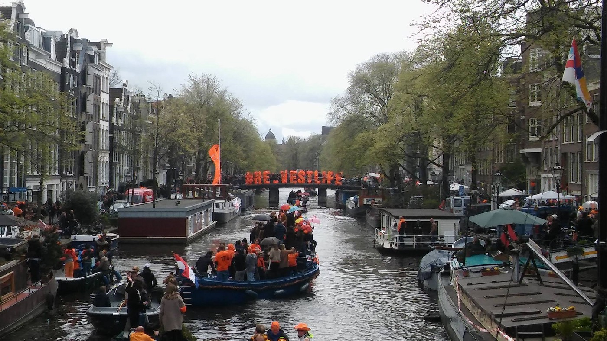
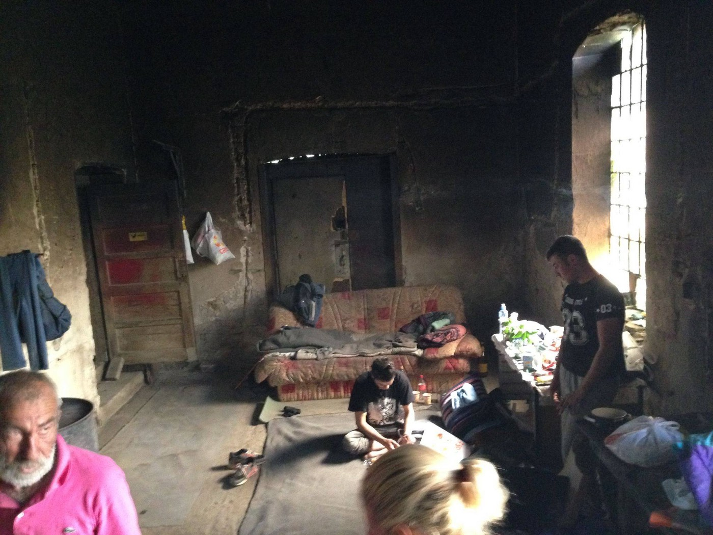
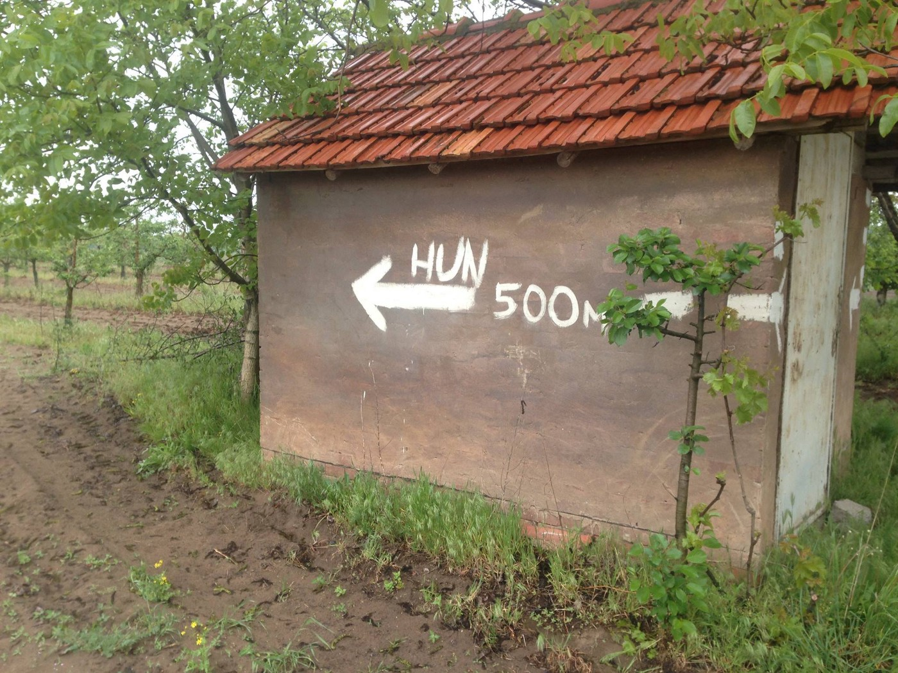
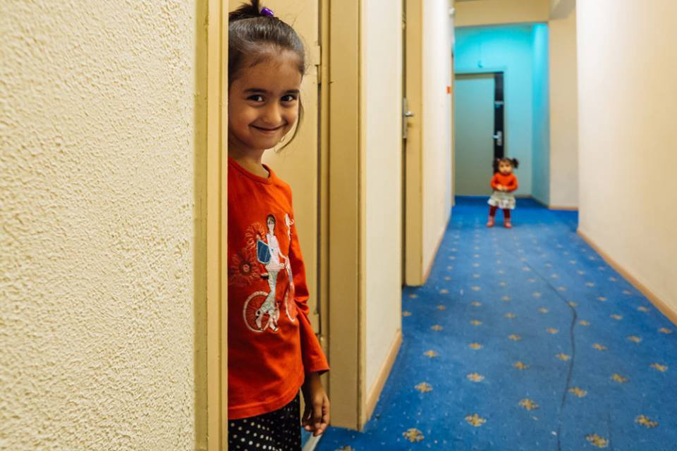
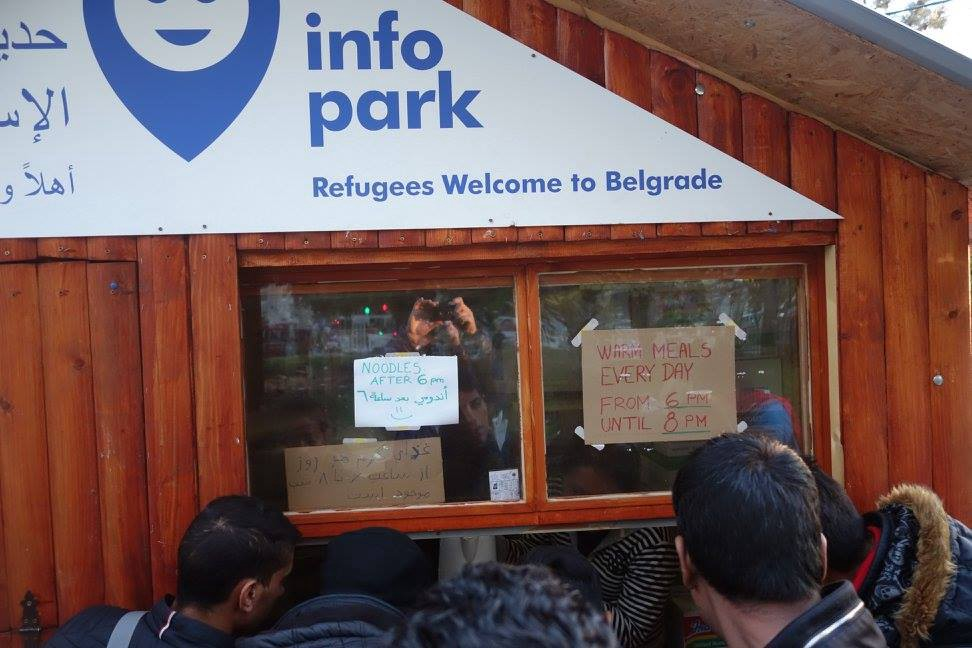
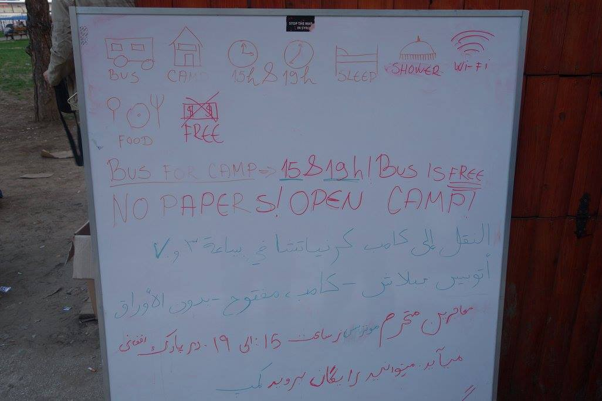
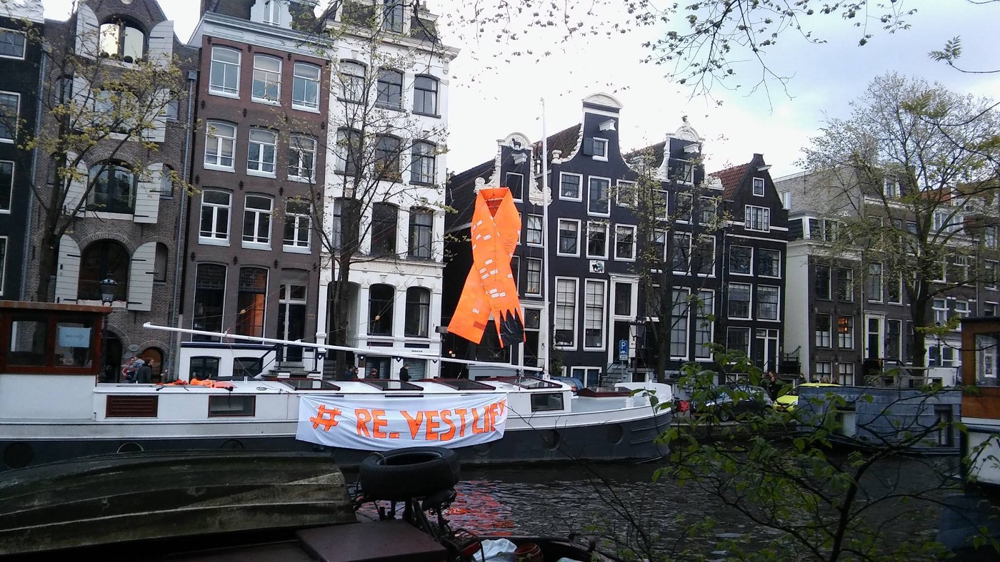

### AYS DAILY NEWS DIGEST 28\.4\.2016\.
#### _The situation in Aleppo worse than ever, the UN warns\. Help is desperately needed on the border between Serbia and Hungary\. Help is needed in Greece, too\. AYS registered around 20 people who have been returned from different EU countries to Croatia over the last couple of days\. UN General Secretary very critical about Austrian new law which restricts refugees further more\. Neo\-Nazis on rise in Germany\._

King Day 2016 — Amsterdam

> WEATHER REPORT for Friday 29 April & Saturday 30 April: 

> Temperature on the Balkan route from 5 at Idomeni to 25C in Athens\. Showers and thunderstorms in some areas are possible /// WAVES VARIABLE FROM 0\.1\+ METERS TO 0\.3\+ METERS /// SEA SAFETY: Waves over 0\.5 meters are considered dangerous\. Waves: moving generally Southward on both days\. Leaving from Turkish coast of Canakkale to Lesvos, waves at your back both days\. Leaving from the west coast of Turkey to the Greek Islands, waves at your right both days\. Winds: variable Friday through Saturday, between 6 and 18 kph, with gusts up to 29 kph, blowing mostly Southward both days /// BALKANS WARNING: OVERNIGHT COOL & DAMP\. For more weather see [here](https://newsthatmoves.org/en/?p=2368) \. 

#### Featured News

**3200 illegal crossings happened between Serbia and Hungary in April\.**

> _Over the last couple of weeks, AYS have tried to learn more about situation on the border between Serbia and Hungary\. Volunteers and refugees are telling us that the route is active again\. Our friends from [Sirious\.Help](https://www.facebook.com/sirius.help/?fref=ts) visited part of the border and reported on the miserable situation and and problems with the Hungarian Office of Immigration and Nationality, whichadjudicates approximately 20 cases a day, making it possible for about 40 asylum seekers per day to enter the country “legally”\._ 

> “According to official police statistics authorities captured 3,200 illegal border crossers in April while only 800 were allowed to enter the country legally in the same month\. We wanted to find out how the 3,200 so called “illegal migrants” entered the country, who handles their cases, what sort of support system is available to them,” their report reads\. A group of volunteers from [Sirious\.Help](https://www.facebook.com/sirius.help/) scouted the Szabadka\-Röszke\-Kelebia triangle over the last couple of days in order to get more accurate information on what is happening along the border\. “I have witnessed a great deal in the past months, but for the first time I was almost reduced to tears as we have visited abandoned buildings, forests, swamps to search for the hideouts of refugees\. Why are they in hiding? The current European asylum policies shut most doors in the face of those who are seeking refuge from war, or are otherwise en\-route towards the perceived “Canaan” of the West for a better life\. Turkey has been declared a safe third country, a country with only a restricted application of the Geneva Conventions, and on whose territory civilians die regularly at the hand of the Turkish military in the course of its military operations against Kurds\. \(i\.e\.: shelling of towns\) \. Nowadays, most asylum seekers who make it to the Hungarian border arrive via the Turkey\-Bulgaria\-Serbia route\. They are exploited by smugglers, many having walked days cross rough terrain\. 

Photo: Sirius\.Help

> In the shadow of illegality they are often afraid of registering in official refugee holding centers\. Most travel through Belgrade in the direction of Szabadka, but since they are not claiming asylum in Serbia, they are considered illegals\. This gives the Serbian police an incentive to constantly harass and fine them for all sorts of reasons — mostly pocketing their money\. Even more dangerous is the Albanian mafia hunting them down and taking their money, often using violence, knowing that no asylum seeker will report abuses to authorities\. Therefore many of them end up in front of the Hungarian razor wire fence exhausted and penniless\. 

> To illustrate the reception they receive upon arrival let me share my own case of approaching the Hungarian border fence from the Serbian side\. It was raining and I probably looked soaked and in disarray\. I saw 5–6 police officers and soldiers gather at the spot where I approached\. I heard one of them say “lets spray him with a bit of gas” and took out the teargas canister\. I figured it was best to quickly identify myself and let them know that I did not intend to cross the fence\. 

> The surroundings clearly show however that the border fence is useless in lieu of police presence\. The fence shows numerous signs of damage\-repair\. The Serbian side is full of hiding spots along the shrubs and reed\-beds where refugees await an opportune moment to cross\. There are fresh tracks in the grass about every 50 meters, blankets, rain coats, water bottles, sleeping bags discarded, signaling that people have been hiding here recently\. All this is a mere 10–20 meters away from the fence and the soldiers and police guarding it\. Ever since the start of spring the vegetation grew denser, making it harder for police to spot people crouching nearby in the bushes\. In fact authorities from the Hungarian side of the fence often attempted to ask me if I can see anyone … 

Photo: Sirius\.Help

> A few kilometers away, in hidden forest areas we find the refugees’ hideouts, where they wait hungry and cold, without any support, for a moment when they might approach the fence without detection\. There are no aid agencies here, no UNHCR … etc\. I brought the largest backpack I could find and stocked it with granola bars and water in order to help them out a bit\. 

> Providing aid to these people is perhaps the greatest challenge for us today\. They are in hard to reach areas, they are desperate and distrustful\. Aid is further hindered by the fact that volunteers must approach these areas carefully almost invisibly in order to avoid calling the attention of the police or the mafia and possibly risking getting detected by them\. I often felt like I was in some Hollywood movie, crouching in the tall grass with binoculars on the lookout for any suspicious movement\. 

> The Serbian Red Cross, MSF and the local Caritas have all logged requests with the Serbian authorities a few weeks ago in order to get authorization to provide aid to asylum seekers stuck on the Serbian side\. If they get authorization it may alleviate the situation of those waiting\. Meanwhile it is possible to provide limited aid from the Hungarian side through collaboration with UNHCR, we were able to send some tents and sleeping bags to the transit zone at Röszke recently\. But there are scores of invisible refugees, in the forests near the transit zones\. We would like to attempt to provide them aid as well\.” 

> _Anybody who is able to help, please go to the border and do that\. The people severely need you\._ 

#### Syria
### Stop the war in Syria\!

> _According to the \#UN, the situation in Aleppo is catastrophic\. It became even worse after yesterday’s attack on al\-Quds Hospital, where at least 27 people were killed\. UN envoy Jan Egeland said that the next days will be vital for the humanitarian aid lifeline for much of Syria\. “I could not in any way express how high the stakes are for the next hours and days… So many humanitarian health workers and relief workers are being bombed, killed, maimed at the moment that the whole lifeline to millions of people is now also at stake\.”_ 

#### Greece
### 53,717 refugees and migrants in Greece today

> _After a few quiet days, late this afternoon, 23 new arrivals from Syria, Iraq and Afghanistan \(11 adults and 12 kids\) were registered by volunteers at \#Samos\. At the same time, 41 persons arrived in \#Lesvos\._ 

> _Currently, there are 2,680 people in \#PiraeusPort\. According to Greek media, 300 people are expected to be transferred to the \#Skaramangas accommodation center\. On Thursday morning, three ships with 52 refugees and migrants, arrived\. The ferry \#Prevelis carried six people from \#Rhodes, the ferry \#BlueStart 1 brought 38 people from \#Lesvos and five from \#Chios, whereas the ferry \#NisosRhodos brought three more people from Lesvos\._ 

> _In the meantime, 164 refugees and migrants are being transferred today from Lesvos and Chios to accommodation spaces in \#Leros\._ 

> _Officials are claiming that currently there are 53,717 refugees and migrants in Greece\. According to the Refugee Crisis Management Coordination Body’s figures, 29,293 of the refugees are in northern Greece, 10,172 of them are at the Idomeni camp, 14,393 are hosted in the \#Attica region, 7,773 on the Greek islands and 2,258 are in different areas in central and southern Greece\._ 

> _During the month of March, according to NATO data, a total of 571 boats carrying estimated 25,871 refugees arrived on the Greek islands, while only 20 arrived in the first three weeks of April\._ 

> _More government sources numbers could be found [here](http://media.gov.gr/index.php/υπηρεσιεσ/προσφυγικό-ζήτημα/summary-statement-of-refugee-flows-28-04-2016) \._ 

### 4,500 people to be moved from Idomeni

> _We heard rumors before, but today we received confirmation from different sources, including the government, about the possible relocation of people from Idomeni\. The process could start as soon as this weekend and up to 4,500 people could be moved to other camps around the country\. Government sources announced on Wednesday that four new camps are planned around \#Thessaloniki for people from Idomeni\. Giorgos Kyritsis, spokesman for refugee and migration affairs, said the government hoped to be able to move people into newly constructed and existing camps in the next 10 days, or more than a third of those currently camped out near the village of Idomeni on the Greek\-Macedonian border\._ 

> _New camps will be placed in two former factories, and a former logistics company and a former warehouse\._ 

### Protest by local residents at Chios

> [_Local media_](http://www.ekathimerini.com/.../welcome-for-refugees-is...) _are reporting about the group of residents of Chios who have blocked the road leading to a refugee hot spot in order to protest its further expansion as tensions in and around camps across the country have intensified in recent weeks\. The roadblock set up by the group near the \#Halkeios hot spot prevented the delivery of containers transporting 10 small kiosks to house the services of the European Asylum Support Office \(EASO\), which is responsible for processing asylum applications on the island\. People visiting the camp were forced to do so on foot\. Despite reassurances by local authorities that the kiosks were not intended to house more migrants, protesters refused to open up the road, which they intend to block on a 24\-hour basis with rotating shifts\._ 

### A small fire broke out in Moria Camp\.

> [_The media also reported_](http://a1.am/en/2016/04/28/2680-refugees-in-piraeus-port) _about fire at a Lesvos hot spot, in a mattress storage area in the \#Moria Camp\. Initial reports suggested the blaze was caused by a short circuit\. Luckily, nobody was hurt\._ 

**380 unaccompanied minors to be sent to a separate camp at Lesvos\.**

> _At Moria, according to Deputy Migration Minister Yannis Mouzalas, [there are 380 unaccompanied minors who will be transferred to a separate camp](http://greece.greekreporter.com/.../underage-refugees.../...) \. The Greek government decided to move all unaccompanied underage kids to a separate camp on the island under the supervision of NGOs Doctors Without Borders, Save the Children and METAdrasi\._ 

### Volunteers needed for soup kitchen at Athens

> _Kitchen in the squat at \#Dervenion 56, \#Athens, needs volunteers\. We received a message from the International Refugee Solidarity saying that people are needed to keep the place up and running\. Also, it would be great to have more activists capable of handling finances and organization, so that the 300 refugees living in squats at the moment can keep on receiving their breakfast, lunch and dinner\. Please contact [Athens: International Refugee Solidarity](https://www.facebook.com/Athens-International-Refugee-Solidarity-1016809435027168/?hc_location=ufi) \._ 

### Cultural center that makes change

> _As always, there are some good stories from camps and different places where refugees are living\.One of them is coming from the recently open cultural center at Idomeni that is, volunteers are reporting, visited by hundreds of people daily\. Most of the visitors are children\. Forgotten in Idomeni group, which runs the Center, reports that new faces are showing up daily\._ 

> _“The children’s behavior has amazingly changed in a positive way: little by little, doing activities with them has become easier as well as things like forming circles or remaining seated during the lessons and raise their hands when they want to ask or to say something\. These things that day by day are becoming normal were a big issue before\. We are happy to see that they are feeling comfortable in this space where they can learn, share and have fun, and where they can forget for a while the terrible conditions in which they are living\. Thanks to all the volunteers, the teachers and the people that is helping at Idomeni Cultural Center”_ 

### Solidarity is our weapon\!

> _Around 200 refugees found a new home at the largest self\-organized hospitality center in Greece, \#CityPlaza, a old hotel in downtown Athens\. [The Facebook page](https://www.facebook.com/EuropeSaysOXI/photos/a.1681903648696778.1073741828.1681857028701440/1789313314622477/?type=3&theater) they established details how the City Plaza was a hotel in downtown Athens which was abandoned by its management more than 6 years ago\._ 

> _“The solidarity movement occupied the building last week — dozens of activists worked day and night to clean and repair the facilities, and welcome its new residents\. When fully operative, the occupation will be able to host more than 500 people\.” The place is run by refugees and activists\. Together, they are cooking, cleaning, setting up the children’s play and the medical facilities, preparing rooms to accommodate even more people\. “Practical solidarity is the best remedy for the rising xenophobia and racism across Europe\. Europe Says OXI shall support with all its strength initiatives such as the City Plaza\. Stay tuned for more news and coverage of the solidarity movement activities, in Greece and beyond\!”_ 

Photo: Europe Says Oxi
#### Macedonia

**385 refugees requested to leave Macedonia today\.**

> _There were 105 registered refugees in \#Gevgelija today\. Out of this number, 35 refugees left voluntarily after requested to go back to Greece\. The procedure of going back to Greece is unknown\._ 

> _In \#Tabanovce the number of refugees is around 650, and some 350 people left today, probably to the Serbian border\._ 

> _Two girls, age 11 and 14, from Afghanistan, who arrived in Macedonia in February, are currently in the safe house in Skopje\. The right to asylum was denied to them, so now they made an appeal to the court\._ 

#### Serbia
### Help needed in Belgrade

> _As a result of the eviction of \#Miksaliste and \#NoBorderHostel, Red Cross terminated its operations in the park where most of the refugees are coming upon arrival to \#Belgrade\. A contact from [InfoPark](https://www.facebook.com/media/set/?set=a.995427610511503.1073741861.885932764794322&type=3) wrote to us about how an overall feeling of pressure on the refugees to move out from Belgrade “is giving us a growing unpleasant gut feeling…”_ 

> “Right now with the new situation we are the only place where refugees can get meals so we are stormed during the hours when we are doing so\. Only yesterday afternoon, after the closing of Red Cross container, RAS and InfoPark volunteers handed out more than 400 warm meals — after the RC team reported 380\. You can only imagine the numbers of the people, they are just growing bigger and bigger but not only that — we can again feel a growing desperation, even despite the current steady flow over the Hungarian border\. 

Photo: InfoPark

> We are handing out info about \#Krnjaca camp being now open to everyone with or without papers\. We don’t know how far went the plans to establish a registration point there, but we can see that this operation needs time, confidence, trust and other elements currently missing to make it work\. There are buses at 3PM and 7PM at the moment, however most of the refugees opt to stay in the park and leave it overnight for fully improvised, inhuman places around rail tracks, under the bridges etc\. We try to explain that Krnjaca camp puts no obligation on them except that provides dry and safe bed and place to rest, but…\. \. The moment the sun is out, the park is full again\. We are desperate to know how days in the park will look like now that Red Cross and Miksaliste are gone, and if the organizations that announced increasing their presence, activities and support in the park will be able to fill the gap\. 

> Whatever happens, this is already again on the edge of being unbearable, with all the uncertainty surrounding hundreds of people, now again mostly families with small children, whose innocent smiles and looks are just tearing us apart as always\. Our hopes are getting smaller and smaller, at the moment we would be happy if those willed to carry on working with and helping people would be let to do it\. We are there to stay as long as there are people who are looking for help\.” 

Photo: InfoPark
#### Croatia
### People deported to Croatia from other EU countries\.

> _Today we received information from different sources about deportations of refugees from different EU countries \(as of now we know of Slovenia, Austria, Sweden, Switzerland\) to Croatia\. Apparently, they are sent back on the grounds of so called Dublin transfers — deportations in the first safe EU country of entry\. Currently there are at least 20–30 persons in Croatia who were sent back in this way\._ 

#### Austria
### “We have a moral and political obligation to help those who are fleeing wars”\.

> [_UN General Secretary Ban Ki\-moon_](http://www.dw.com/.../ban-reminds-austria-eu.../a-19222043) _was very harsh in his critique when addressing Austria’s parliament a day after lawmakers restricted asylum seekers’ rights\. The new law allows the country to reject asylum applications from people fleeing conflicts\. “Such policies negatively affect the obligation of member states under international humanitarian law and European law,” the UN secretary\-general said\. “We have a moral and political obligation to help those who are fleeing wars, human rights violations and persecution,” Ki\-moon told Austria’s legislature\. He added that he had grown “alarmed about growing xenophobia” in Austria, neighboring Germany and across the European Union\._ 

> [_The controversial bill comes just days_](http://www.aljazeera.com/news/2016/04/austria-adopts-strict-laws-refugees-160427214213686.html) _after Norbert Hofer, a candidate of the far\-right Freedom Party \(FPOe\), won the first round of presidential elections\. According to analysts, the FPOe is set to do well in the next scheduled general election in 2018\._ 

#### Italy
### Fingerprinting of refugees to begin on rescue boats\.

> [_The Italian government announced_](http://www.rappler.com/world/regions/europe/131132-italy-fingerprinting-migrants-sea-europe-crisis) _that refugees and migrants will be fingerprinted as soon as they are picked up by rescue boats\. It was announced that this approach could help to reduce mounting tensions between Italy and its EU partners over the large numbers of migrants who arrive in Italy but are not registered here and then travel on to northern Europe\. If they are not registered in Italy, neighboring countries like Austria and France and popular destination states like Germany and Sweden do not have the option of sending them back to Italy, which they should be able to do under the EU’s Dublin convention rules governing asylum claims\._ 

#### Germany
### Neo\-Nazi groups on rise in Germany, violent crimes triple in Saxony\.

> _A trial against a group of neo\-Nazis calling itself the “Old School Society” started on Wednesday\. [Four people are charged](http://www.dw.com/.../attacks-on-refugee-homes.../a-19221702) with forming a terror group that planned attacks against an asylum seeker home in the eastern state of Saxony\. Their choice of weapon was modified “pyrotechnic explosives, particularly in the form of fire and nail bombs”, which they were planning to hurl into a refugee home, said the prosecutor\. The group had “accepted that people could be killed,” chief prosecutor Joern Hauschild told the court\._ 

> _The prosecutor added that the neo\-Nazi group had between 10 and 15 members, with investigations still ongoing against other suspects\._ 

> _Local media outlets are reporting about general rise of the far right all over Germany\. Official data shows that in Saxony alone, the number of crimes by right\-wing extremists, including assaults against asylum seekers and arson at refugee homes, tripled to 784 cases last year compared to 235 in 2014\. According to report from the BKA, the first quarter of 2016 saw 347 crimes linked to refugee accommodation\. Among the offenses were three attempted homicides, 37 arson attacks and 23 injuries\. The whole of 2015 saw a total of 1,031 such crimes\._ 

#### Netherlands
### Ribbons made for Kings Day as show of solidarity with refugees\.

> _A group of volunteers and refugees in the Netherlands for weeks have been making ribbons from life\-vests to sell them on \#KingsDay 2016\. The result was great: over 1,000 people wore the ribbon\. Designer Reza, an Iranian refugee himself, broke a world record by creating the biggest ribbon made only from life vests\. The ribbons can still be ordered [here](http://re-vestlife.org/) \._ 

> _It is a joint product in cooperation with Refugee Company, Movement on the Ground, Second Life Jacket, The Beach and Makers Unit and volunteers from many places\. The Kings Day Ribbon is made from the jackets and boats collected from the shores of Lesvos\._ 

#### Denmark

230 **people charged with a crime for helping refugees\.**

> _According to a media report, the public prosecutor’s office charged 230 people for helping other people transit through the country “illegally” during the biggest wave of refugees last fall\. Danish trafficking laws don’t distinguish between smuggling people for financial gain and doing it for humanitarian reasons\. Some of them, as we reported earlier, are distinguished human rights activists, but many are just ordinary people who were helping other people in need\._ 

#### UK
### Government must ensure refugees have access to means necessary to rebuild lives\.

> _A court has ruled that disabled child refugees should be entitled to access Disability Living Allowance following a legal challenge brought by the Child Poverty Action Group on behalf of [Refugee Counci](http://www.refugeecouncil.org.uk/latest/news/4617_court_rules_disabled_child_refugees_entitled_to_support) l and Red Cross clients, the Refugee Council report\._ 

> _Refugee Council Policy Manager Judith Dennis said: “Refugees arriving in Britain have often escaped war zones and many have been brutally tortured which can leave them living with lifelong disabilities\. Some refugees are even specifically brought to the UK because they are particularly vulnerable and need to be resettled because they have severe medical needs\. It thus seems counter intuitive that the British Government then denies these refugees access to vital support; leaving them without enough money to meet their needs and preventing them from living in dignity\. The Government must urgently ensure that its policies are joined up in order to ensure that refugees offered safe haven here actually have access to the means necessary to begin rebuilding their lives\.”_ 

#### Ireland

57 **Syrians arrived to Ireland\.**

> _Among those who arrived today are refugees burned by explosions and disabled people\. They arrived, [local media reports](http://www.belfasttelegraph.co.uk/news/northern-ireland/vulnerable-syrian-refugees-set-to-arrive-in-northern-ireland-34662199.html) , from camps in Turkey\. 20 of the new arrivals are children\. This is the second group accepted in Northern Ireland as part of the UK\-wide Syrian Vulnerable Persons Relocation Plan to resettle around 20,000 by 2020\. New arrivals are a mixture of Arabs, Kurds and Circassians\. The youngest is two years old and the oldest is aged in the mid\-50s\. The Home Office has provided at least £11,120 per refugee to cover the first year’s expenses\._ 

#### General
### Universal health coverage discussed by WHO\.

> _The Greens/European Free Alliance \(EFA\), political group in the European Parliament, invited the WHO to discuss the concept of universal health coverage and access to care\. The WHO stressed that there is no public health argument against the influx of refugees and migrants to Europe\. Infectious diseases are not systematically correlated to migration\. These are, however, primarily associated with poverty\. In this regard, ensuring access to health care, as well as adequate living conditions for these mobile populations is the best way of protecting the health of all\._ 

> _The financial aspect of the concept of universal health coverage was also discussed at the Parliament, with particular emphasis to its links to equity \(fairness and justice\), and the need for more public funding in order to ensure quality of health care services, adequate financial protection mechanisms and thus achieve universal health coverage\._ 

_Converted [Medium Post](https://areyousyrious.medium.com/ays-daily-news-digest-28-4-2016-7dec5fc22b9a) by [ZMediumToMarkdown](https://github.com/ZhgChgLi/ZMediumToMarkdown)._
