### AYS DAILY NEWS DIGEST 29\.4\.2016\.

](assets/34053319b26a/1*H6x51-SfpZGG-mPfliBBIg.jpeg)

[Sorin Furcoi](https://www.facebook.com/sorin.furcoi)
#### Syria
### Bomb in Aleppo targets an MSF children’s hospital, kills doctors and kids\.

> _The United Nations has described the situation in the Syrian city of Aleppo as ‘catastrophic’\. A human rights group estimates that six days of air strikes and rebel shelling in the city have killed around 200 people, around two\-thirds of them on the opposition side\._ 

> _On Wednesday air strikes destroyed a hospital and killed dozens of people in rebel\-held areas of Aleppo\. The clinic was run by Medicins Sans Frontieres and the victims, who numbered at least 27, included doctors and children\. US officials said the damage appeared to be the result of Syrian government attacks\. The Syrian government has denied targeting the hospital\._ 

> _The [Syrian Observatory for Human Rights](http://ara.reuters.com/article/topNews/idARAKCN0XQ0MB) stated that the shelling of government\-controlled areas of Aleppo resumed on Friday after a brief period of peace at dawn\. Strikes came on the same day that the Russian media official announced the agreement to “calm down”, sponsored by Moscow and Washington, which was to be in Damascus and surrounding areas for a period of 72 hours\. Many of the air strikes took place near the mosque, and one of them hit a medical clinic in Marjah district\._ 

> _The city is at the center of a military escalation that is undermining the peace talks in Geneva aimed at ending the five\-year old war\._ 

#### Libya
### Rumors of Libya\-EU plan, similar to the atrocious Turkey\-EU plan\.

> _German magazine [Spiegel](http://www.spiegel.de/politik/ausland/fluechtlinge-europaeische-union-peilt-schmutzigen-deal-mit-libyen-an-a-1089670.html) claims that they are confident about the existence of EU plans to establish a Libya\-EU deal, similar to the one with Turkey, where Libya would be used as a dumping ground for refugees\. Spiegel claims they saw the secret documents about that plan\. They say that it is even worse and, if it is even possible, more dirty than the EU\-Turkey\-Deal\._ 

#### Turkey
### Sharing a meal with a Syrian family as a way of welcoming refugees into our lives\.

> _Each week on Sunday, [Refugee Volunteers of Izmir \(ReVi\)](https://www.facebook.com/groups/893837690724053/) invites 2 or 3 Syrian families to cook a big dinner for volunteers\. The volunteers fund the dinners and extra cooking stoves are provided for each of the families\._ 

> _This falls right in line with ReVi’s philosophy of creating a community environment within which fleeing families can look to rebuild their lives and gain some semblance of normality\. The following is an inspiring story from one of the volunteers who participated at one of these dinners:_ 

> “I joined one of the families earlier in the day before the latest Sunday dinner, as they invited a few of us to help cook the last few dishes of the meal\. This didn’t constitute much — we prepared the side salads while playing with the kids, keeping the baby boy smiling and using the best of our sign language to communicate with the family members\. 

> Once the other volunteers arrived, settling down cross\-legged on cushions lining the walls in their small, humble home, they filled the middle of the room with an astonishing array of traditional Syrian dishes\. We shared everything, dipping and reaching across each other as the conversation flowed amongst, above all, human beings\. 

> By the time we all ate to heart’s content, there still seemed to be enough to feed the rest of the neighbourhood\. Once again, we were blown away by the genuinely open and welcoming nature of people who have had their entire lives turned upside down\. They hold nothing but give everything\. 

> This was about more than a dinner party: it was about creating connections, building relationships, crossing divides and displaying a love and unity that is so often missing in our daily interactions, wherever we may be\. 

> As we walked away from the house at the end of the evening, while the kids chased us down for one last hug, the resilience and hospitable nature of these families shone through once again\. It is humbling to work with such people on a daily basis\. We can learn a lot from those that are said to be different\.” 

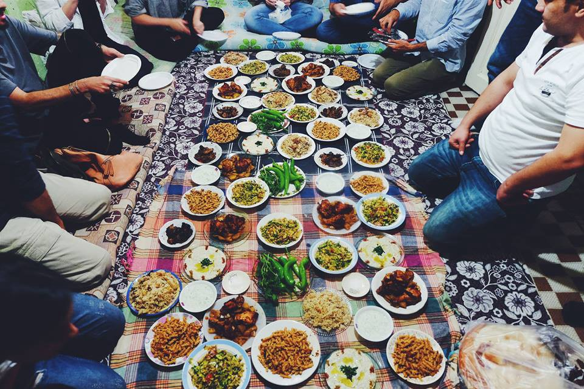

The Worldwide Tribe: Syrian food

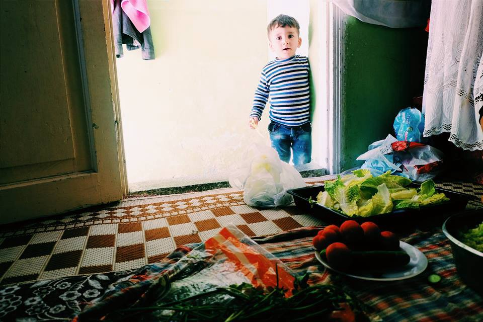

The Worldwide Tribe: The Syrian family’s baby boy

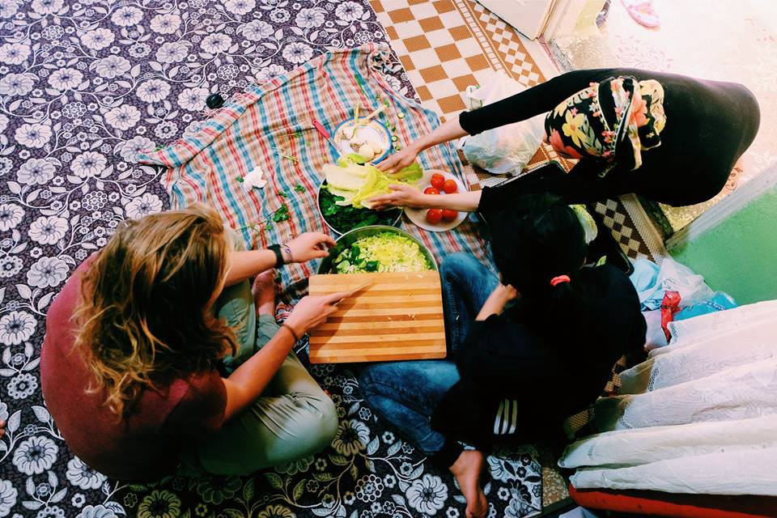

The Worldwide Tribe: Preparing food together

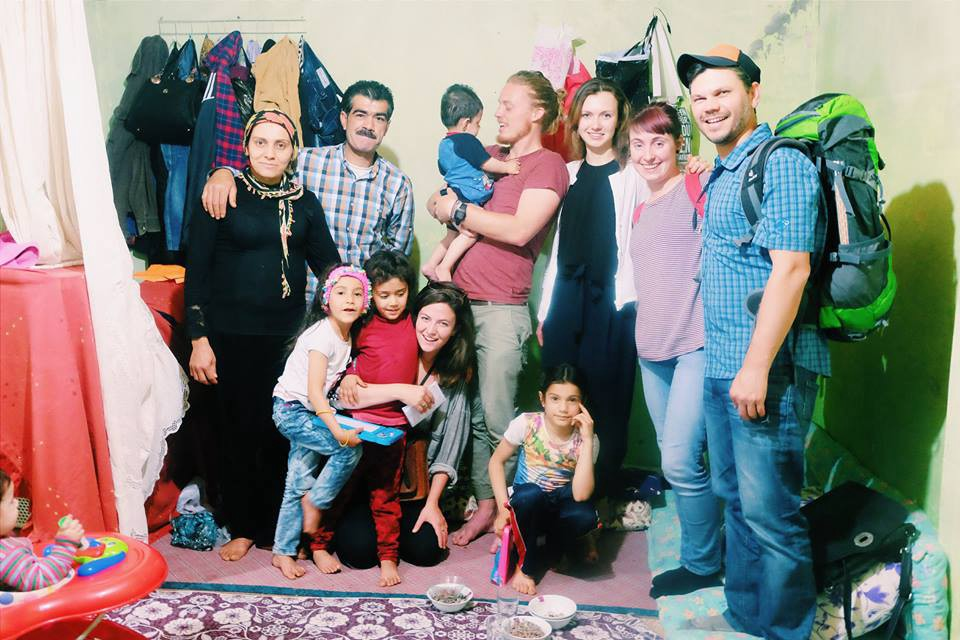

The Worldwide Tribe: Happiness of being together
### Disabled children struggling in refugee camps

> _Volunteers working in Izmir are discovering high rates of disability in children of Syrian families\. Although they do not have professionals working with them, they think it is mainly the cerebral palsy\. Indeed, [Refugee Aid Network](http://www.refugeeaidnetwork.org.uk/) and [One Ummah](http://www.refugeeaidnetwork.org.uk/) just helped one Syrian refugee family in Reyhanli, where the father was looking after 4 of his children alone\. All of the children are suffering from cerebral palsy and hey had no basic medical aid nor living necessities\._ 

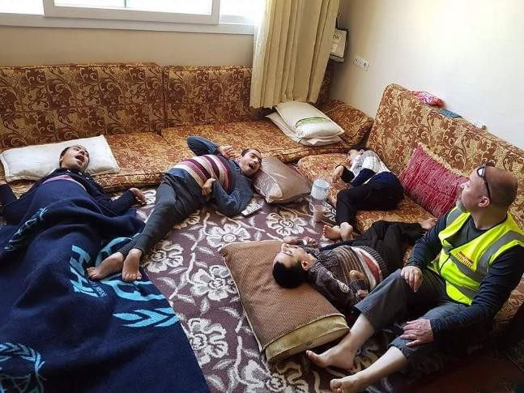

Refugee Aid Network: Syrian family living in Reyhanly, with four children ill with cerebral palsy
#### Mediterranean Sea
### **Europe is saving refugees at sea in record numbers\. Will Europe be as helpful upon their resettlement?**

> _599 refugees, including 96 women and seven children, have been rescued on the Mediterranean Sea under operation Sophia on Thursday alone, German military [Bundeswehr](http://www.bundeswehr.de/portal/a/bwde/!ut/p/c4/NYtNC8IwEET_UbYBJeqtpQhevdh6KdtmKcF8lGRjQfzxJgdn4F3eDDyh1OPbrMgmeLQwwLiYy7yLedck8MWZrKUkMKdJk5vI-IT8gUd9lsUSPHElk2dTuEbkEMUWIttqcozFCKNhbGTfSdX8I7_t-Xgd1Omg-lt3h8259gchW7IG/) announced\._ 

> _A frigate type of a warship “Karlsruhe,” supported by the similar Italian frigate “Aviere,” picked up 245 refugees from vessels, including 34 women and one child, around 85 kilometers north west of Tripoli\. At the same time, Combat support “Frankfurt am Main” rescued 117 people, 68 kilometers north west of Tripoli\. Spanish frigate “Numancia” rescued 138 people\. Later, “Frankfurt am Main” took the people of “Aviere” and “Numancia” and has carried overall 354 people on board, including 62 women and six children\._ 

> _“Karlsruhe” is expected to arrive on Friday morning at Trapani harbor in Italy\. “Frankfurt am Main” is expected to arrive on Friday afernoon at Catania harbor in Italy\. The refugees will be handed over to Italian authorities\._ 

> _Since the 7th of May 2015, German soldiers of the marines have rescued 13,949 refugees from drowning in the Mediterranean Sea\._ 

#### Greece
### New baby boy born in Idomeni refugee camp\.

> _Welcome to the medical tent of Team Humanity in Idomeni and their 5 days old newborn little boy\!_ 

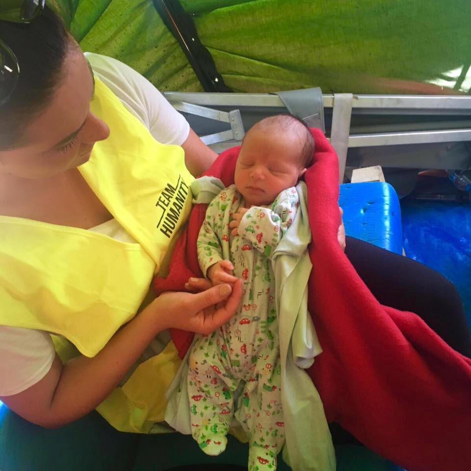

Team Humanity: Baby boy born at the Idomeni camp

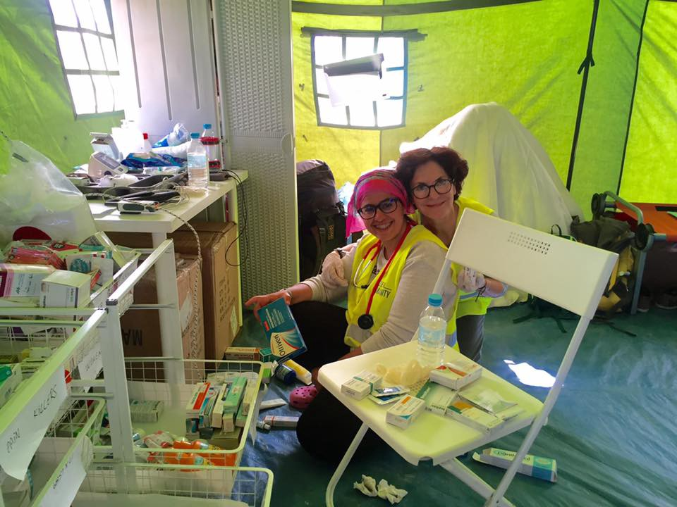

Team Humanity

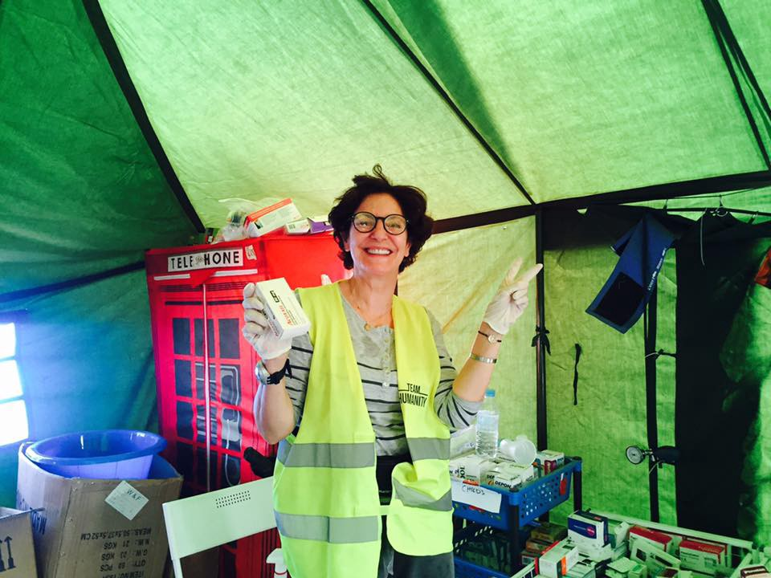

Team Humanity
### Places where volunteers are needed and whom to contact if you can help\.

> _“I Am You” is seeking volunteers for Ritsona camp\. This is a valuable organization, coordinating volunteers to undertake the work that is most needed to protect refugees\. To do this, they need skilled volunteers who can work on their own initiative and have the good people skills\. They are currently seeking:_ 
 

> _\- Arabic, Farsi and Kurdish translators_ 
 

> _\- People to work with children, in sectors of entertainment and informal education_ 
 

> _\- General volunteers_ 
 

> _Please apply on their [website](http://www.iamyou.se/volunteer) , or contact info@iamyou\.se for more info_ 

> _“Better Days for Moria” is currently looking for Greek speakers who also speak English or Arabic/Farsi/Urdu/Kurdish/French, to assist lawyers with translation, information gathering and case preparation for asylum seekers\. Please email: ayesha@betterdaysformoria\.com for more details\._ 

> _“Lighthouse Relief” is looking for volunteers to help with cleaning up Lesvos’ beaches from the leftovers of the refugee landings\. It’s another side of the humanitarian crisis and a very important work to be done, as to restore beautiful Lesvos beaches\. Please contact: environment@lighthouserelief\.org for more info\._ 

> _“Doctors Without Borders” in Athens is looking for Farsi/English or Farsi/Greek cultural mediator and translators\. Please send your CV and/or a letter of motivation to msfch\-athens\-iec@geneva\.msf\.org_ 

### Can you donate to City Plaza accommodation for refugees? If yes, please read\.

> _Items urgently needed are: washing powder, shaving foam, wettex pads, kitchen paper, summer trousers for babies and children, men’s and women’s shoes and slippers, fruit juices, croissants\._ 

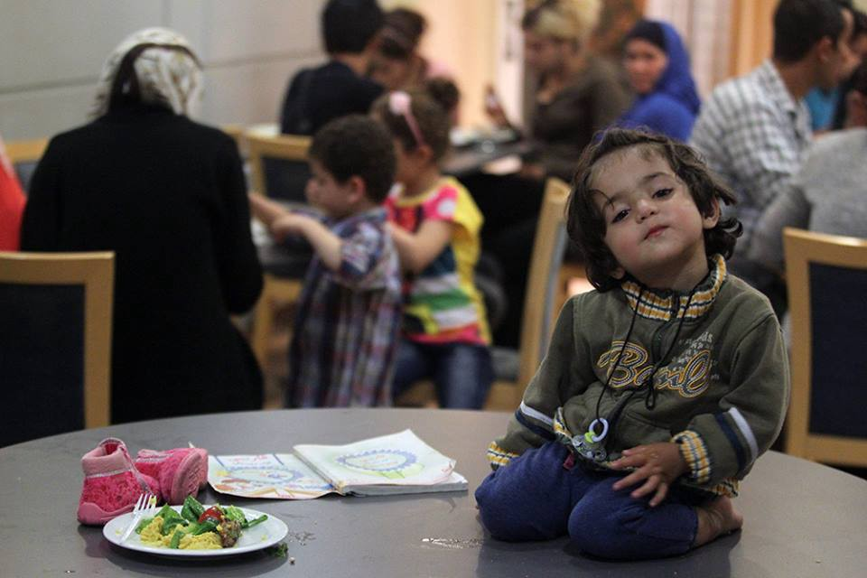

Marios Lolos: Children of City Plaza

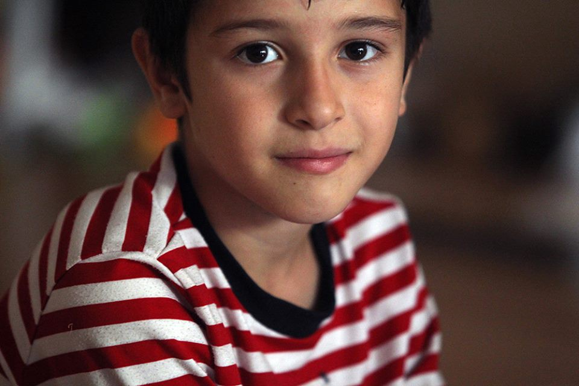

Marios Lolos: Children of City Plaza

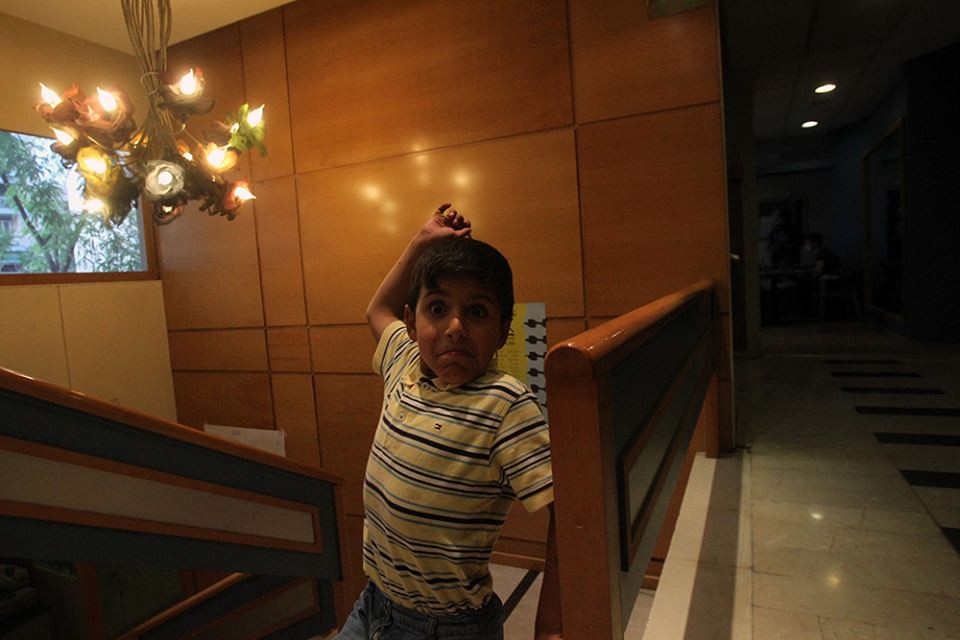

Marios Lolos: Children of City Plaza

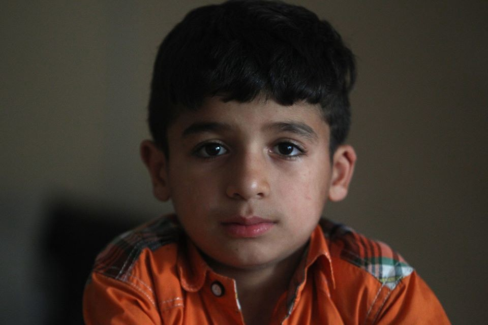

Marios Lolos: Children of City Plaza

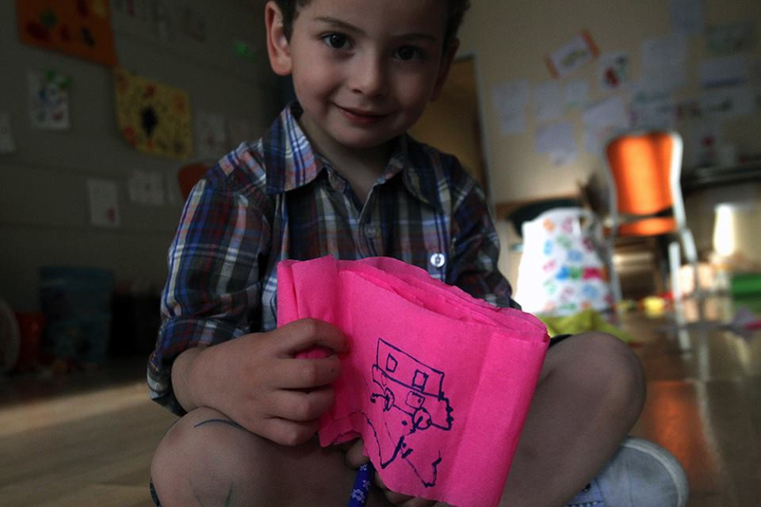

Marios Lolos: Children of City Plaza

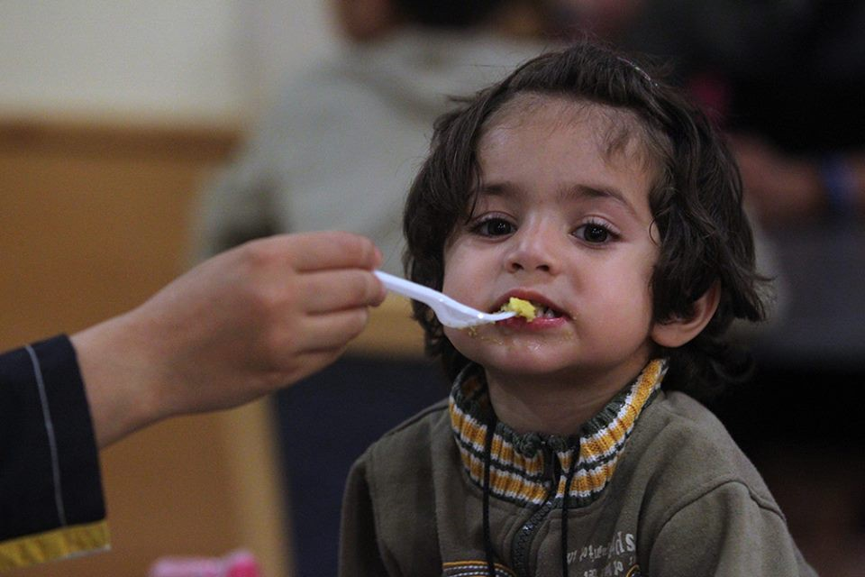

Marios Lolos: Children of City Plaza

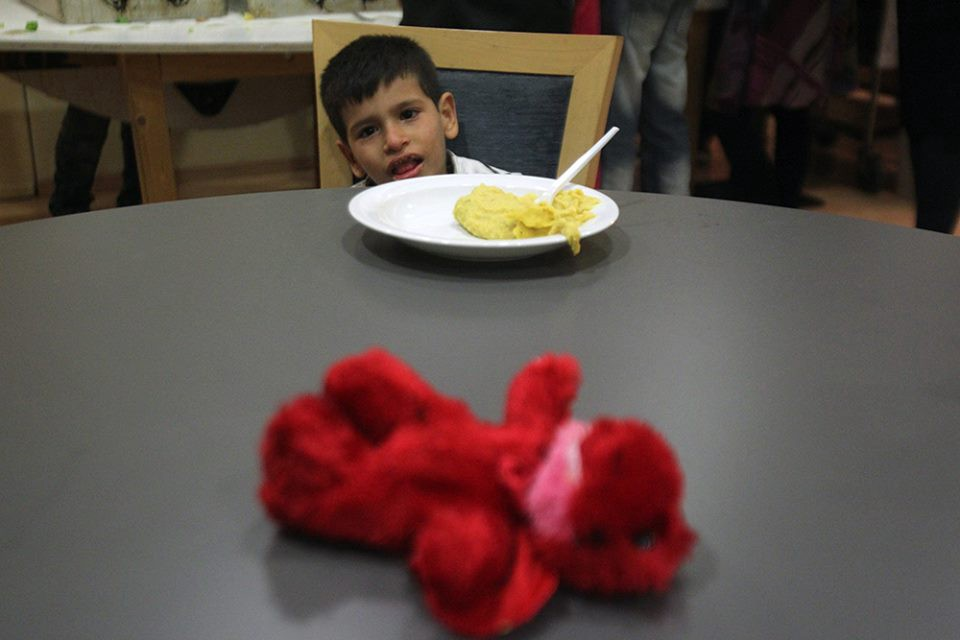

Marios Lolos: Children of City Plaza

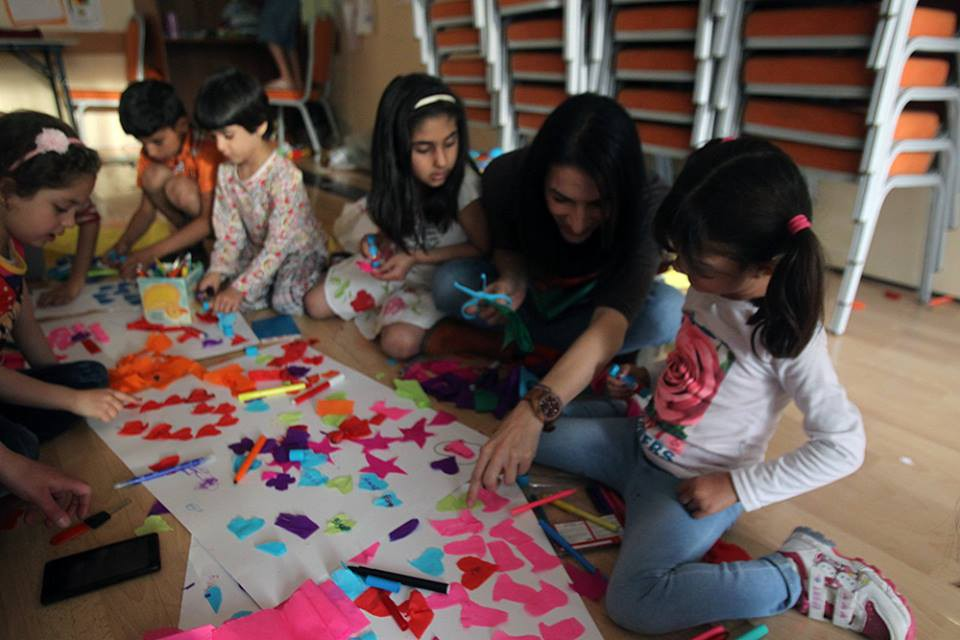

Marios Lolos: Children of City Plaza
### More arrivals to the Greek islands\.

> _There were 68 new arrivals to Samos today, mainly from Syria and Afganistan but also from Iraq, Palestine, and a considerable group from Algeria\._ 

> _The camp is so busy that they can barely find a place to put up their tents\. Many set them up on a steep slope which is very unconformable for sleeping, but even this “option” is not available anymore\._ 

#### Italy
### Refugees’ rights for seeking asylum severely violated by Italian police\.

> _According to the organizations Naga, Asgi and Avvocati per Niente, in Milan’s police Headquarters \(Questura\), refugees have to fill in a preset form from April 2016, with a list of questions about departure country, states crossed on the way, and reason for migration\. Then, an officer evaluates the form and decides on a refugee’s acceptance or expulsion from Italy\. There is no chance for a trial to re\-evaluate the case\._ 

> _The organizations claim that the practice is illegitimate, since only the Territorial Commission for Asylum is the only authority in charge of assessing requests for asylum and protection\. In this situation, a policeman substitutes an expert in understanding such a critical issue\._ 

> _The practice seems widespread in Bologna but also in other Italian cities\. The president of Naga supposes that no specific indications came from above, but the single offices are acting on their own\._ 

> _In the last 20 days, the lawyers of the candidates are forbidden to enter the police headquarters, another practice against the law\. Meanwhile, Naga offers assistance with shelters and courses of Italian language, but also information sharing\. These days, they strongly discourage the migrants to apply at the police headquarters\._ 

> _The associations wrote to Milan’s Questura, asking formally to interrupt the illegitimate practice and to allow the migrants to apply for asylum, even accompanied by their lawyers\. The organizations threatened to refer the case to the European Commission and to the national authorities\._ 

### Refugees arriving to Italy by plane

> _Press agency Nev states that, on 3rd May 2016, 103 refugees will be arriving to Fiumicino airport \(Rome\) from Beirut, thanks to the “Humanitarian Aisles\.” The pilot project finds roots within the frame of an agreement among the Italian government, the Federation of the Evangelic Churches in Italy \(FCEI\), the Community of St\. Egidio and Tavola Valdese\._ 

> _So far, the agreement allowed 97 Syrian refugees to enter Italy\. The agreement is supposed to guarantee the access of about one thousand people, from Syria, Lebanon, Morocco and Ethiopia\._ 

> _Press agency Sir reports that the aforementioned 103 refugees will be between 0 and 83 years old; 33 families, with 41 individuals under age\. Their provenience is Syrian and Iraqi\. They will all take an airplane, they will be provided of a humanitarian visa as foreseen by Schengen code 810/2009\. They will eventually be moved to Turin, Milan, Florence, Terni, Rome, Frosinone and Potenze, and hosted in refugee centres provided by the organizations\._ 

### A company is paid 33 euros a day per refugee to deliver them meals\. What are refugees actually getting?

> _In Reggio Emilia, around 30 refugees and asylum seekers complained to the police headquarters \(Questura\) about the food served at the canteen\. The refugees argued that the meals are repetitive, low quality and overcooked\. The event has been renamed “pastasciutta protest”, against the cooperative company Dimora d’Abramo, which receives 33 euro per day for each migrant, to provide food and accommodation\._ 

> _The politicians have replied harshly on the social networks\. A member of the provincial Democratic Party rudely and immaturely declared on Facebook that “The only response she would give is a strong asskick\.” The post has been then modified into a “strong no” to the refugees’ requests\._ 

> _In August 2015, the company was mentioned on the newspaper for a debate about the redistribution of the budget earnings\._ 

#### France
### Another fire at Calais leaves refugees homeless

> _There was another small fire last by Jules Ferry\. One refugee was hurt and is now in hospital\. Around 30 Eritreans were left homeless\. There is still need for fire extinguishers, building materials and basic living supplies\. Please help\!_ 

 : Fire at Calais](assets/34053319b26a/1*x9eaVb03qrsycxe0alAz_w.jpeg)

[Clare Moseley](http://www.care4calais.org) : Fire at Calais
### Leaving refugees hungry is despicable\! We are trying to help\.

> _There are around 4,000 refugees in Calais and 1,500 in Dunkirk\. They all need to eat\. The food is entirely organised through volunteers\. There are kitchens on both sites that daily provide hot meals for refugees\. This is usually a single meal a day, which is rarely enough\. Thus, there is also an initiative to provide refugees with raw ingredients so they could cook for themselves\. This is organised by the Calais Kitchen\. This amazing group feeds around 4,000 people a week\. To give you an idea of the massive amounts of food they send into the Calais camp every week, here is their weekly grocery list:_ 
 

> _2,416 kg rice_ 
 

> _4,832 tins of canned tomatoes_ 
 

> _5,845 tins of canned fish_ 
 

> _2,806 liters of milk_ 
 

> _2,416 tins of chickpeas and kidney beans_ 

> _The Calais Kitchen would not mind your help\. They need more donated food, more money to top up supplies, and volunteers to help them prepare all the food packs\. Please contact them to volunteer at: Calaiskitchens@gmail\.com;_ 
 

> _to drop off supplies at: Calaisdonations@gmail\.com, or [donate](https://mydonate.bt.com/fundraisers/calaiskitchens) \._ 

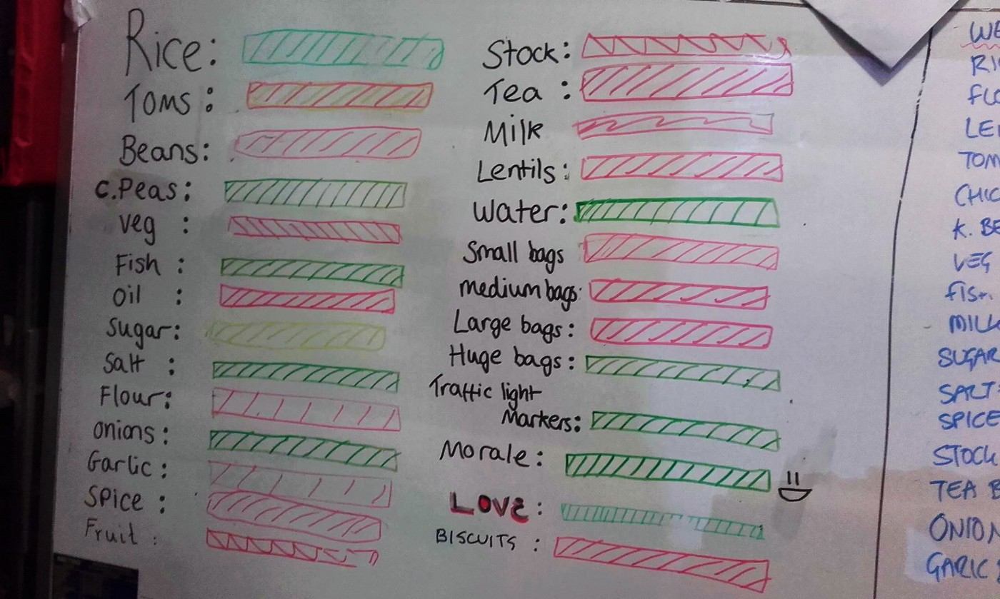

Calais Kitchen: List of Supplies

> _Likewise, Dulwich2Dunkirk is currently holding a [fundraiser](https://www.gofundme.com/r3hh2t2c) , as they are heading to Paris, where they will cook for 400 men, women and children who are living rough under a bridge by a metro station\._ 

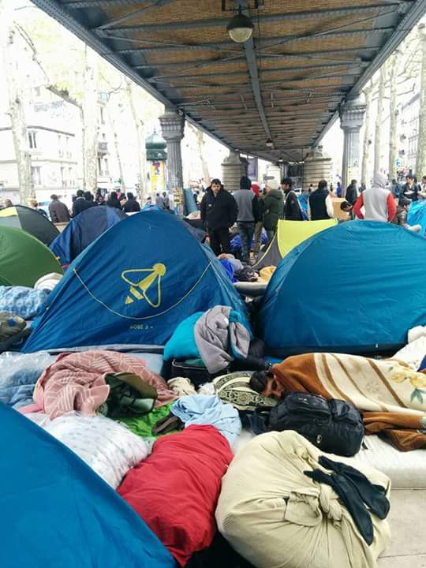

Nisha London: Refugees sleeping rough under the Paris bridge

_Converted [Medium Post](https://areyousyrious.medium.com/ays-daily-news-digest-29-4-2016-34053319b26a) by [ZMediumToMarkdown](https://github.com/ZhgChgLi/ZMediumToMarkdown)._
