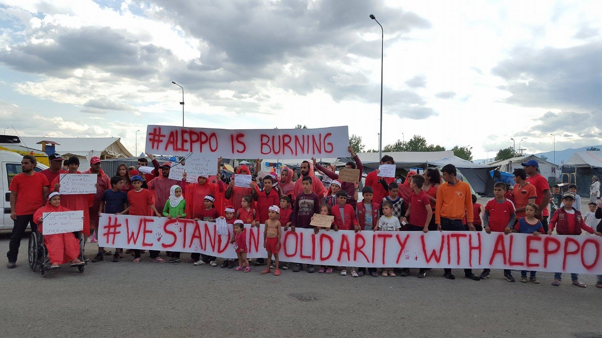
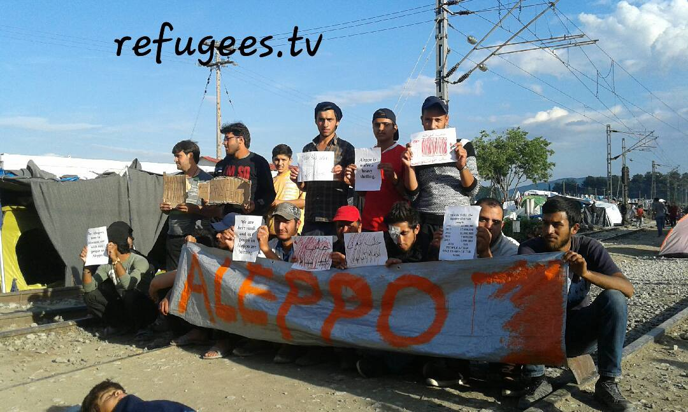
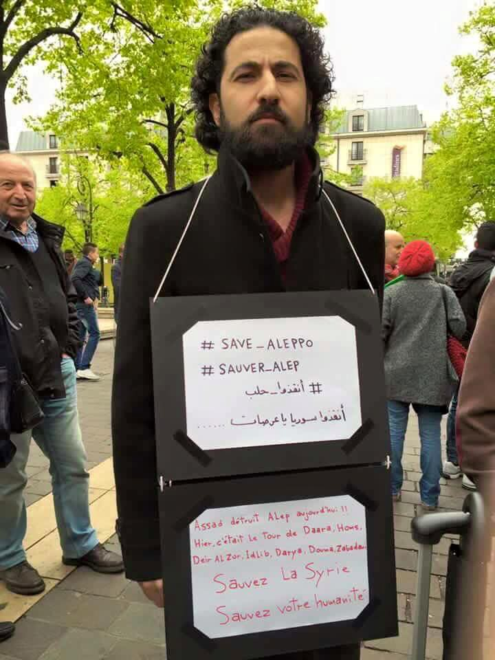
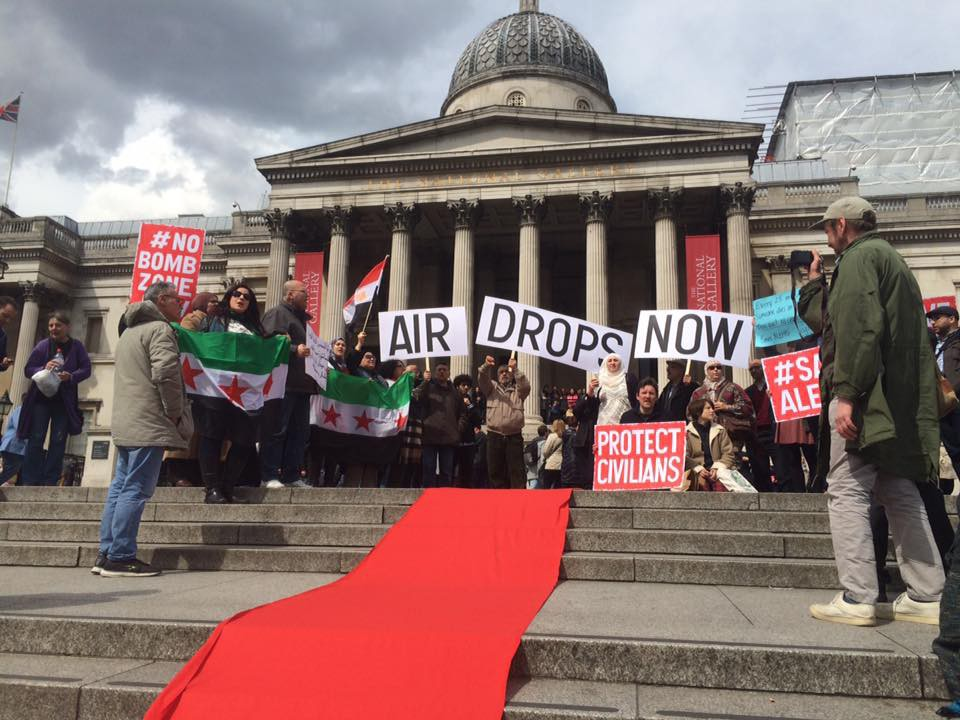

### AYS DAILY NEWS DIGEST 30\.4\.2016
#### _Syria Advocacy Group calls for Aleppo Is Burning protests to be held worldwide\. 260 airstrikes, 110 artillery strikes, 18 missiles and 68 bombs were launched on Aleppo in the past 8 days, according to Syria Civil Defense\. 53,687 refugees were present in Greece today — there were 162 registered new arrivals\. Deportations of refugees from other EU countries to Croatia continue\. Dinghy full of migrants heading to Italy sunk in the international Libyan waters — 84 people are lost at the moment, says IOM\. Volunteers are needed in Dunkirk\. European Commission will propose to the member states the amendment to Dublin regulation related to the responsibility to receive refugees and migrants\. Germany and other Member States are preparing a proposal to the European council that will allow member states to keep or to introduce temporary border checks within Schengen area\._

Refugees and camp volunteers in the EKO refugee camp on the Greek\-Macedonian border stand in solidarity with their fellow countrymen in Aleppo, by Rami Jarrah
### \#AleppoIsBurning Worldwide Red Protest

> _The Syrian community called on all people across the world to come out and join global protests as part of the Aleppo is Burning: Worldwide Red Protest campaign\._ 

> _This weekend, concerned citizens of all backgrounds and nationalities from across the globe are standing up to march in solidarity with Aleppo — read the entire press release by the Syrian Pressure Advocacy group: [http://bit\.ly/1NbRMAM](http://bit.ly/1NbRMAM)_ 

> _Twitter @AleppoIsBurning_ 

#### SYRIA
### 260 airstrikes, 110 artillery strikes, 18 missiles and 68 bombs launched on Aleppo alone\.

> _\#Aleppo is burning — 2 hospitals were destroyed and over 230 civilians — men, women and children — have been killed in ‪Aleppo during this week\. According to Syria Civil Defense, in the past 8 days there were 260 airstrikes, 110 artillery strikes, 18 missiles and 68 bombs launched on Aleppo alone\._ 

> _Volunteers are also setting up the Aleppo Support Group for people living in Aleppo or who have family there\. Please contact Ryuk Başhir Basmage or James Smith \(Arabic speaking coordinators\) if you are either living in Aleppo or have family there, and let either of them know what needs you may have at this time\._ 

#### JORDAN
### Poor conditions in camps due to poor medical facilities and the lack of experienced medical personnel\.

> _Volunteers in Jordan report on the poor conditions that some of the refugee families live in, especially related to poor medical facilities and the lack of experienced medical personnel\._ 

#### GREECE
### _162 new arrivals to the islands_

> _Government sources report on the presence of 53,687 refugees and migrants in the country on April 30th as of 8:00 AM\. The majority of them are still on the Greek mainland, while there are 8,042 people at the islands\. Government sources report on 162 new arrivals to the islands — 67 to \#Samos and 95 to \#Chios\. Volunteers report that there were no arrivals to the Northern coast of \#Lesvos by 6:00 PM today \(Sat, Apr 30th\), while no information is available for the South of the island\._ 

> _Government reports on 14,106 people present in \#Attika — 2189 of them are still in the Port of \#Piraeus and 2880 in \#Skaramagas\. There were 1926 refugees in the Central Greece and 338 in the Southern part of the country\._ 

> _The largest number of refugees is still in the Northern Greece — and there are still 10,172 in \#Idomeni\._ 

### _Midwife volunteers are needed in in \#Thessaloniki\._

> _There are a few hotels in Thessaloniki where the refugees are being put in and there are pregnant women among them\. Volunteers report on the current protocol, which is calling reception to call an ambulance in case that there is an emergency situation\. If you are a midwife volunteer who could check the situation at these sites, please get in touch with the volunteer groups in Thessaloniki\._ 

### _Volunteers are needed in the Idomeni EKO Kitchen\._

> _The \#EKO kitchen has a critical and immediate need — this kitchen, which feeds up to 2,000 people a day, is the only consistent food distribution point at EKO station right now, apart from the food provided by MSF\. If there is anyone on the ground currently who can help out at the EKO kitchen, please go there right now and lend a hand\. Team Banana, which distributes 5,000 bananas every morning in Idomeni, has been short staffed in recent days, as has Hot Food Idomeni — please get in touch with them if you can help\. The EKO project is also running an incredible school initiative at EKO station and is in desperate need of long term volunteers, especially those with experience in work with children\. Finally, the warehouse needs help sorting and organizing\._ 

### Irish group works to provide Wi\-Fi for refugees trapped on the islands, volunteers are needed\.

> _The Irish group Disaster Tech Lab is sending a team to the islands between Greece and Turkey to build public internet facilities which will serve as public information points as well as allowing the refugees to establish contact relatives and friends\. Additionally, they will provide secure WiFi networks for other humanitarian aid workers to use\. They are looking for volunteers with specific technical skills \(WiFi networking, Vsat, VoIP\) \._ 

> _More information on the application process is available at: [http://bit\.ly/1QHQvfu](http://bit.ly/1QHQvfu) \._ 

Solidarity with Aleppo, by Refugees TV
#### SERBIA
### Refugee Aid _Miksalište continues to feed refugees despite evictions\._

> _After the negative developments and evictions of aid providing sites such as \#Miksalište and \#NoBordersSquat, our friends from Refugee Aid Miksalište Belgrade continue their work in a nerby park\. While they wait for the new space, they continue to provide warm meals to the refugees\. Refugee Foundation is also providing food to the refugees in the park, as well as Praxis and Asylum Info Center\._ 

#### CROATIA
### EU countries continue to deport refugees to Croatia\.

> _Deportations from the EU countries continue and new people arrive every day to the center for asylum seekers — Hotel Porin in \#Zagreb\. A Syrian couple was deported today to Croatia\._ 

> _AYS volunteers spent the morning with children in Porin and made their day with a big donation of toys and strawberries\._ 

#### SLOVENIA
### Volunteers are needed in Slovenia\!

> _NGO Slovenska filantropija is seeking volunteers for the activities with asylum seekers — men, women, and children\. If you are interested, please contact [primoz\.jamsek@filantropija\.org](mailto:primoz.jamsek@filantropija.org) \._ 

#### ITALY
### A dinghy full of migrants heading to Italy sank today\. According to IOM, 84 people seem to be lost at the moment\.

> _Today, a dinghy full of migrants heading to Italy has sunk\. According to IOM, 84 people seem lost at the moment\. The vessel sank 4 miles from \#Sabrata, in international Libyan waters\._ 

> _The Italian coast guard had received a mute satellite call from the location of the sinking, so it warned \#Tripoli’s authorities\. Then, it directed the trading boat “Valle Bianca” to the spot, where the sailors managed to save 26 people\._ 

**1232 refugees have died this year while trying to cross the Mediterranean\.**

> _From \#Geneva, IOM reports that from the beginning of the year, 181,476 people migrated to Europe through the Mediterranean Sea, while have 1,232 died while attempting to make the crossing\. \(source: SKY\.IT\)_ 

### Right wing politician rails against help allotted to refugees which supposedly comes at the expense of needy local residents\.

> _The Italian local media reported on the regional chief of the Italian right wing party Lega Nord endorsing the citizens’ protests against the arrival of refugees in the small town of \#San Bartolomeo \( \#Ferrara province\) \. He is accusing the mayor Tagliani of having taken top\-down decisions without adequately informing the community of San Bartolomeo\. The regional branch of Lega Nord is exploiting the situation by organizing a demonstration against the local government to take place on Monday \(May 2nd\), in front of the private building, demanding ‘fair treatment’ for 680 Ferrara citizens possibly in need of accommodations, as a priority against the current 680 refugees hosted in Ferrara\._ 

#### GERMANY
### A court has ruled that an AFD conference will take place in Stuttgart, prompting protests\.

> _The federal convention of the ultra right party AFD in \#Stuttgart could not be stopped by the court decision\. Protesters are trying to block the Stuttgart Exhibition Center, where the convention is going to take place\. ‪\#‎NoAFDStgt \(source: stuttgarter\-zeitung\.de\)_ 

Protests in Paris, by Let’s Save Refugees in Europe
#### FRANCE
### Volunteers will soon open kitchens and community spaces for refugees\. Volunteers needed for final touch\-ups\.

> _Volunteers report that four out of seven of the kitchens and community spaces are due to open in the new \#Dunkirk camp on Tuesday or Wednesday, with wood burning cooking stoves, kitchen consuls, hot and cold running water, lighting, floored, free shop/distribution area, tables and benches, booth platforms etc\. The residents of the camp are excited by the prospect\. If there are volunteers skilled with wood, general making, set building, building, tent manufacturing, or plumbing who can help to get the final three spaces finished over the next week please contact Finn Kay on Facebook by private message\._ 

Protests in UK, by Syria Solidarity UK
#### GENERAL

> _Der Spiegel reported that the EU will agree to visa\-free travel for Turkish citizens, even if the country does not respect all its commitments, in particular in regard to human rights\._ 

### Dublin Agreement might be renegotiated with each country taking more additional refugees\.

> _On Wednesday May 4th, The European Commission will propose to the member states an amendment to the Dublin Regulation related to the responsibility of receiving refugees and migrants from the entry countries\. If the agreement is reached, the first countries receiving migrants will have the responsibility to record and identify up to 150% of the originally agreed upon number — beyond this percentage, other states will have to share this responsibility by receiving the exceeding number of people\. The Member States which refuse to receive these people will have to pay a fee for each person refused\. On 5th April, Juncker’s team had proposed two options: the aforementioned “Dublin\+” and a different redistribution of asylum seekers based on preset quotas, but the proposals failed due to lack of agreement\. The remaining option refers to responsible quotas based on GDP, inhabitants and other factors\. \(Source: La Stampa\)_ 

### Several EU countries introduce a proposal to temporarily suspend free movement within Schengen Zone\.

> _According to the Italian newspaper La Repubblica, Germany, France, Austria, Belgium, Denmark and Sweden asked o present to the European Council a proposal that will allow Member States to keep or to introduce temporary border checks within Schengen area from May 13 for the period of six months\. The border checks were introduced last September, after the massive arrival of asylum seekers, but after the closure of the Balkan route, both Austria and Germany observed a drastic decrease in the arrivals \(for Germany, from 90,000 in January to 20,000 in March\) \._ 

### Lawyer volunteers are needed\!

> _Lawyers and asylum experts are sought by a new NGO “Advocates Abroad” to help refugees in terms of legal assistance and asylum information\. Contact: [ariel\.ricker@gmail\.com](mailto:ariel.ricker@gmail.com)_ 

_Converted [Medium Post](https://areyousyrious.medium.com/ays-daily-news-digest-30-4-2016-e302a48c381d) by [ZMediumToMarkdown](https://github.com/ZhgChgLi/ZMediumToMarkdown)._
