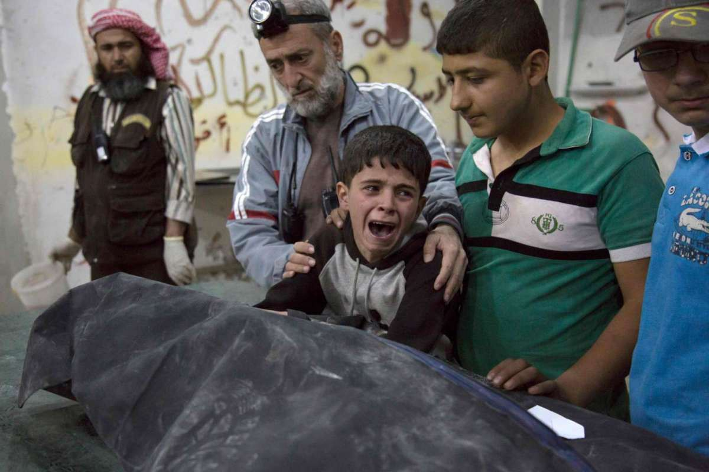
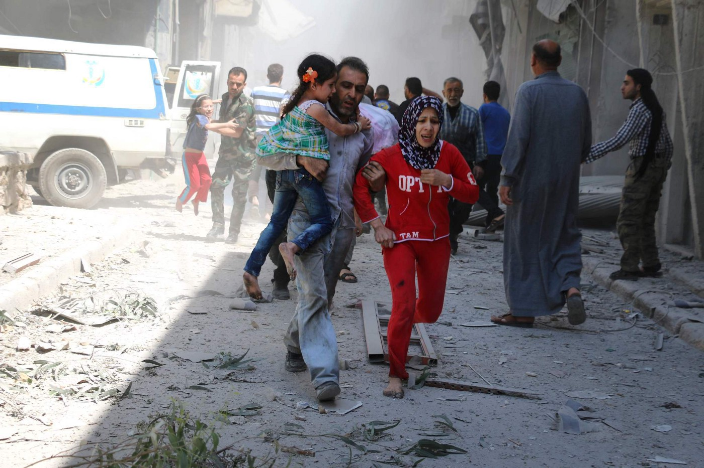
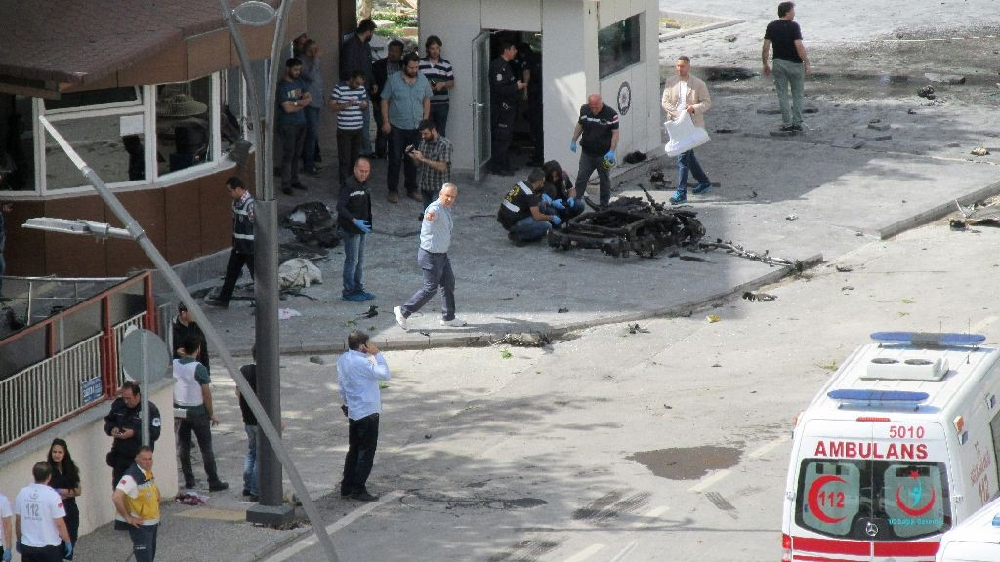
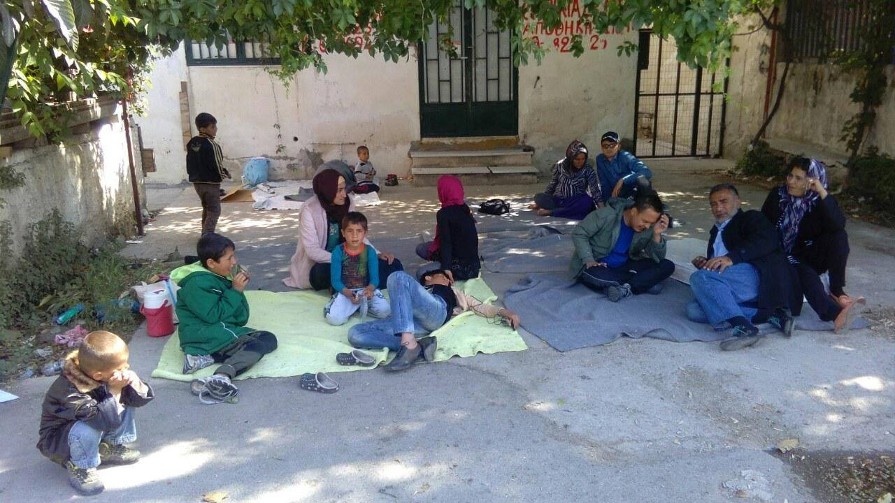
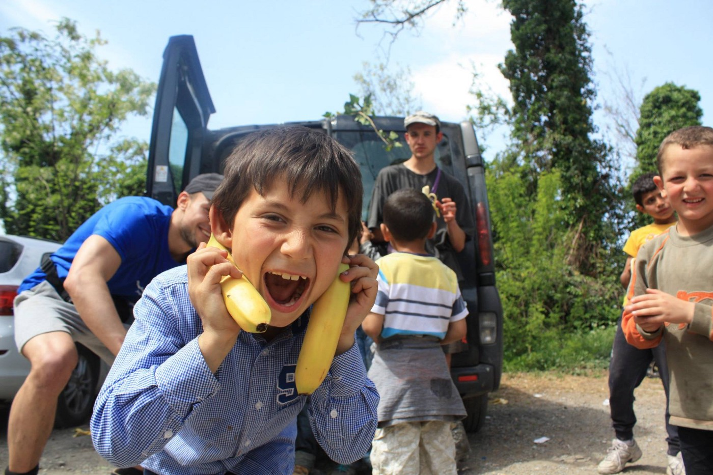
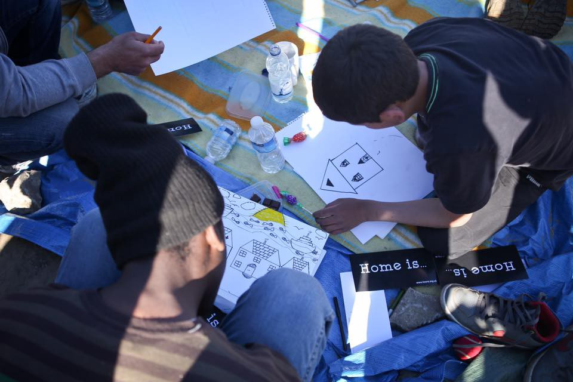

### AYS DAILY NEWS DIGEST 1\.5\.2016\.
#### While the world is protesting in support of Aleppo, carnage continues in Syria’s second largest city\. At least 3116 people, including 859 civillians, have been killed during the month of April 2016\. in Syria\. Greek volunteers are in dire need of personnel and donations\. Bulgarian Orthodox Church says government shouldn’t let more refugees in the country\.

A Syrian boy cries next to the body of a relative who died in an air strike on April 27, 2016, in the rebel\-held neighbourhood of al\-Soukour in Aleppo\. PHOTO: AFP
#### SYRIA
### The world is united under \#AleppoIsBurning hashtag, but there seems to be no end to carnage in Syria’s second largest city\.

Despite more than two months of the alleged truce, [The Syrian Observatory for Human Rights](http://www.syriahr.com/en/) documented death of 3116 people, including 859 civilians, during the month of April 2016\. Today, they stated:

> We call Mr\. Staffan de Mistura International — the United Nations’ special envoy for Syria crisis– to work in earnest, with the active parties in Syria, the United States of America and Russia to really activate the truce and stop the daily blood shedding in Syria, otherwise he should resign from his position, due to his failure to achieve peace in Syria\. 

A family runs for cover following a airstrike on a rebel\-held neighbourhood of Aleppo on April 29\. PHOTO: Ameer Alhalbia

At the same time, people all over the world are united under the [\#AleppoIsBurning](https://twitter.com/search?q=%23aleppoisburning&src=typd) hashtag, in an attempt to raise awareness about the massive bombing unleashed on Syria’s second largest city, leading to deaths of at least 253 civilians, including 49 children, during the last week\. Protesters are condemning the Syrian regime’s air strikes on the city, killing civilians, medical personnel and rescue workers\. They are also calling attention to the failure of the United Nations and the international community to act to protect civilians in Aleppo and throughout Syria\.
#### TURKEY
### Car bomb kills two, injures 22 in Gaziantep

Forensic and medics around the remains of a car outside a police station in Gaziantep, May 1\. PHOTO: AP

A car bomb struck the entrance of a Turkish police station Sunday in the southern city of Gaziantep, killing two police officers and wounding 22 other people, according to AP\. Four civilians were among those wounded in the explosion, according to Gov\. Ali Yerlikaya of Gaziantep province\. The police station is close to offices for the governor and mayor\. Gaziantep is also home to the offices of international aid organizations focused on helping the refugees and supporting people in neighbouring Syria\.
### EU to grant visa\-free entry to people from Turkey, which might be used as asylum opportunity\.

The European Commission is ready to give its approval this week to plans allowing visa\-free travel to Europe for 127m people from Turkey, Ukraine, Georgia and Kosovo, according to [The Sunday Times](http://www.thetimes.co.uk/edition/world/eu-to-grant-visa-free-entry-to-127m-87fq8csns) \. Under the arrangement, tourists from the four countries will be able to move freely within the 26\-member Schengen zone for up to three months\. They will still require a visa to enter Britain\. Critics fear the tourists’ ranks could be swelled by many of the estimated 400,000 Kurds from southeast Turkey displaced by a government clampdown\. Diplomats say many could successfully seek asylum\.
#### GREECE
### With 53,687 refugees stuck in the country, most vulnerable groups sleep in the streets

Pregnent women, children and a special needs person sleeping in the streets of Athens, May 1\. PHOTO: Damian Uladh

Last night 18 Afghan refugees from five families, amongst them 3 pregnant women, children and a person with Down syndrome had to sleep overnight just outside Eleonas camp in the street\. They had earlier left Elliniko camp as conditions were too crowded and they were being asked to share small tents with other families in the baseball stadium\. They went to the occupied City Plaza hotel, but were told that there was no room and that perhaps one family could be taken in on Monday\. They then went to Viktoria Square, where police shouted at them to leave, telling a taxi driver to take them to Eleonas\. When they made it to Eleonas, police didn’t let them in even to go to the toilet\. Pregnant women are in 9th, 8th and 7th month\. They slept in the street with whatever blankets they had\. Tonight, some of the families have gone to Oinofyta camp, while others still didn’t find any accommodation\.
### Stop the rumors: The border is closed\!

> _We heard rumors again today, that the borders will open on the 5th of May\. This is not true\. The border will not open any time soon\. These rumors are often started by people who want to cause trouble for refugees\. Volunteers, please check your information before believing and sharing stories\. Refugees, take care of yourselves and your families\._ 

### Volunteers needed on multiple locations

Volunteers are still needed to cover [Team Brit](https://www.facebook.com/teambritathens/?fref=ts) day shifts at Pireus port, where 2189 refugees were staying yesterday\.

Volunteers are also needed in Cherso/Kilkis, where [Love in Action](https://www.facebook.com/Love-in-Action-Solidarity-in-Kilkis-662790313823326/?fref=ts) is looking for hard working people for distribution in the camp and work in the warehouse\. Accommodation and food are covered, driving license is welcome\.

Again, Idomeni is in great need of volunteers — many of the teams in the field are really struggling right now\. EKO kitchen, The EKO project, Team Banana, Hot Food Idomeni, Warehouse, Nurture Project International, RefuAid and Health / Dental Point Project are in dire need of volunteers\. You can find more about their specific needs in a [massive post](https://www.facebook.com/groups/infopointforidomenivolunteers/permalink/262934434052857/) in Information Point for Idomeni Volunteers FB group, which is one of the best info groups available\.

Team Bananas is handing out 4500 bananas daily to refugees in Idomeni\. PHOTO: Team Bananas
### Piraeus and Idomeni running out of food, medical teams need donations

[Volunteers in Piraeus](https://www.facebook.com/teambritathens/?fref=ts) are running really low on breakfast food such as croissants, juice, biscuits and sandwiches\. Refugees with stamped papers are barely getting enough food at the moment, while those without stamps have to wait until the end of distribution and are often left with nothing\.

Donations of specific items are needed in two major warehouses in Idomeni and Thessaloniki area: [one is managed by Dimitra Triantafyllou](https://docs.google.com/document/d/1N0QrpM7qrIMjDglhrlu7dQVRC2agR4S1FjgsMOF3AdA/edit) , [the other by Aslam Obaid](https://docs.google.com/spreadsheets/d/1zIz_syIjlR_RW6Uyod-CEOFJBtwF6KsfD3RyzFUkLLc/edit?ts=562e95fe#gid=390280809) \. They are both very reliable people who have proven to be great coordinators\. Please check what they really need \(lists are attached\) and contact them to arrange the shipment before sending anything\.

Independent mobile clinic [Alivio Dolores](https://www.facebook.com/aliviodolores/?fref=ts&hc_location=ufi) needs following items: cough syrup for children and adults, ear drops, eye drops, pantozol, small spoons, small plastic vessels for cremes, Fenistil\-Creme, hemorrhoid\-medicine, acyclovir creme, celecoxib, urine testing sticks, cyprofloxazine\. They also need qualified doctors, nurses and translators\.
### Kastellorizo ready to share their stock items

For those in need of donations, we also have some good news\. There are now no refugees on the island of Kastellorizo, and so Kaş Kastellorizo International Platform has a number of stock items available to send to other islands\. Please contact on the KKIP Admin at kaskastellorizoplatform@gmail\.com if you would like any of the following: toiletries, sleeping bags, towels, fold out camp beds, nappies, children’s toys and stuffed animals, men’s jeans, and ponchos\.
#### BULGARIA
### Patriarch Neophyte and Bulgarian Orthodox Church against taking in more refugees

“We live in difficult times, the very foundations of the world around us are shaken\. Moral values ​​that were observed for centuries are being questioned and rejected\. In this atmosphere of value ​​disorientation, waves of migrants with different beliefs, world view and traditions are coming and bringing more and more challenges to us”, said Patriarch Neophyte in his address to the Bulgarian people for Easter, according to local [Standart News](http://www.standartnews.com/english/read/patriarch_on_easter_the_world_is_shaking-11264.html) \.

Patriarch thinks refugees are adding to the atmosphere of moral depravity PHOTO: The Sofia Globe

The Bulgarian Orthodox Church had previously announced that it will help refugees who have arrived in Bulgaria, but has urged authorities not to let any more in\. “We consider that our government should in no way allow more refugees into our country\. For those who are already here, it is right for us, as Orthodox Christians and as a society, to look after as much as we can and as much as our scant resources allow us, but not any further,” the Holy Synod explained in a statement published by [Sofia News Agency](http://www.novinite.com/articles/170996/Bulgaria+Should+Not+Let+More+Migrants+In,+Orthodox+Church+Says) \.
#### ITALY
### Irish Naval ship deployed to a search and rescue mission in Mediterranean

The Irish Naval ship, LÉ Róisín, has left for the Mediterranean for a three\-month humanitarian mission to aid refugees fleeing Syria and other Middle Eastern and African countries\. The ship’s search and rescue operations will be conducted in conjunction with the Italian authorities\. Commanded by Lieutenant Commander Ultan Finegan, it is the fourth Irish Navy ship to assist in the rescue effort in the Mediterranean\. The ship departed from Haulbowline in Cork at midday\.
#### FRANCE
### Young residents of Calais are asking for games

Young refugees engaged in art activities in Calais, PHOTO: Clare Moseley‎

Care4Calais group is doing a great job of keeping young refugees engaged in sports and arts, keeping their morale high despite the circumstances\. Today they have expanded their sports day to include cricket, high jumping, kite flying and art breakouts as well as the normal football and volleyball\. Now they need your help to expand their art activities\. Anyone who can send games, join in or sponsor an art day please email clare@care4calais\.org

_Converted [Medium Post](https://areyousyrious.medium.com/ays-news-digest-1-5-2016-72604bb84219) by [ZMediumToMarkdown](https://github.com/ZhgChgLi/ZMediumToMarkdown)._
