### AYS DAILY NEWS DIGEST 3\.5\.2016\.
#### Syrian opposition group launched missiles at a hospital in government\-held West Aleppo, killing 19 and injuring 17\. The Syrian Network of Human Rights has released its report for April 2016, reporting 1041 civilian casualties, 718 of which were caused by the Assad regime\. Europe is expected to loosen visa requirements for traveling Turkish citizens\. Italy has charged two smugglers with deaths and the endangerment of lives\. The bodies of approximately 700 refugees on the floor of the Mediterranean are to be surfaced and given a proper burial\. A PEGIDA leader was forced to pay a fine for denigrating insults against refugees\.

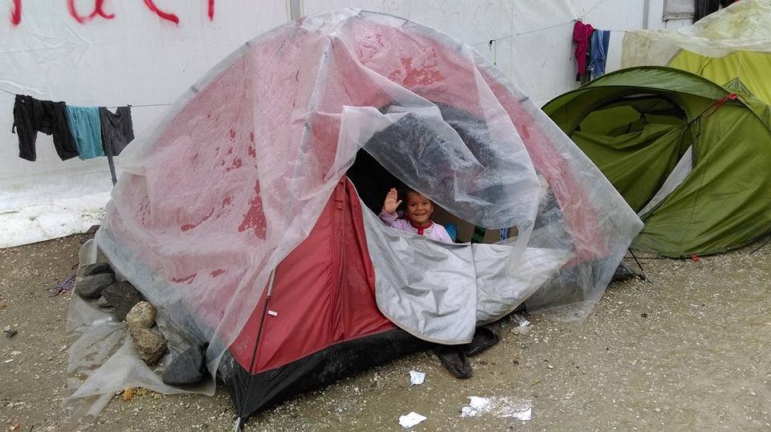

Credits: Refugee Support Group
#### Syria
### Another hospital in Syria has become a target of bombing\.

> _Rebel rockets have struck a hospital in government\-held west Aleppo, killing 19 people\. The Syrian Observatory for Human Rights reports that from April 22 until now, 279 civilians have been killed in the city, 155 of them in opposition\-held neighborhoods, and 124 killed in government\-held neighborhoods\._ 

### Political prisoners of the Syrian regime riot against the horrendous prison conditions

> _The Hama Central Prison has held a large number of political detainees since the Syrian uprising began in 2011\. Around 60 percent of the facility’s 1,400 inmates are political prisoners, a Hama activist told [Syria Direct](http://syriadirect.org/news/prisoners-hold-hama-central-prison-amidst-ongoing-revolt/) \._ 

> _“The treatment of the prisoners there is horrible, and most of them are there because of arbitrary arrests,” al\-Hamawi told Syria Direct on Tuesday\. “Some, like my son, haven’t had a trial\.”_ 

> _Prisoners seized control of the prison on Monday following, “a decision to move five political prisoners to the Sednaya military prison \[outside Damascus\] to be executed,” Zaher al\-Hamawi, a former prisoner currently in contact with those inside told Syria Direct on Tuesday\. “They refused and decided to collectively resist the order and were able to take control of the prison\.”_ 

> _The prisoners are demanding that the Red Crescent “move the condemned prisoners to opposition\-held areas and prevent their execution,” Hassan al\-Omri, a member of the Hama Press Center in contact with a prisoner inside told Syria Direct on Tuesday\._ 

> _During Monday night’s raid, regime security forces fired “tear gas, which led to some cases of suffocation, and there were live bullets,” al\-Omri said\._ 

](assets/e92a1573def5/1*9OeG5f4BitMNer7Qzp5o6g.jpeg)

Credits to [Hama News Agency](https://www.facebook.com/Hama.News.A/?fref=photo)

**1041 civilians have been killed in Syria in April, according to SNHR, the government is responsible for most of them\.**

> _The Syrian Network of Human Rights released its report on civilian deaths in April\. The vast majority of reported deaths were at the hands of the regime with 718, 120 by various opposition groups, 69 by ISIS, and 68 by the Russians\. Details and methodology can be found in the report: [http://sn4hr\.org/wp\-content/pdf/english/1041\_killing\_of\_civilians\_in\_April\_2016\_en\.pdf](http://l.facebook.com/l.php?u=http%3A%2F%2Fsn4hr.org%2Fwp-content%2Fpdf%2Fenglish%2F1041_killing_of_civilians_in_April_2016_en.pdf&h=IAQGURf7Z&enc=AZMrUS6xwJ_cOuGyp5SAsjWLNib-FbeaLwcVJcdYjdpmHFD2Y-rKa0mQAI4PK_dNihptKVNZEiQYI4hVXdV0Yg2-CdrWIEVdDGlpOch_FeWorN0ky1hkdjBMqiJDyFvfMS8DR3TNE5gbNnpVxkoxMYgE&s=1)_ 

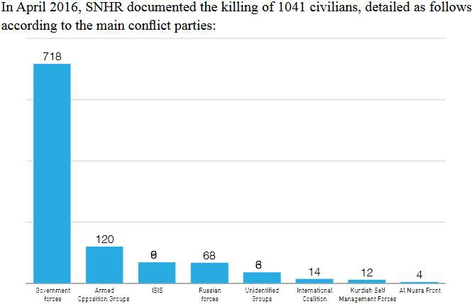

#### Turkey
### How Turkey is benefiting from the EU\-Turkey deal on refugees

> _Greek Cypriots will no longer require visas to visit Turkey under a new deal agreed between the EU and Ankara\. The move is be part of a wider agreement on visa liberalization\._ 

> _Europe is also expected to relax its own travel requirements for Turks later this week\. The EU is expected to give conditional approval for Turks to travel to the EU without visas on Wednesday, as it seeks to ensure Ankara’s continued cooperation to control migration to Europe\._ 

> _Under a plan agreed upon in March, Turkey will take back migrants and refugees that have reached Greece\._ 

#### Greece
### Baby\-Kits for Refugee Babies in Ritsona\.

> _There are about 38 to 40 babies in Ritsona\. They live in tents and environment is not healthy\. Volunteers in the field are trying to find the resources to distribute baby kits that will include the basic needs for babies such as milk, rash creams, mosquito repellents etc\. Reach them [here](https://www.generosity.com/community-fundraising/baby-kit-for-40-refugee-babies-in-ritsona) \._ 

### Pants and dignity for refugees at Samos\.

> _As 57 new refugees were brought to the refugee detention camp in Samos today, volunteers at the camp need are now trying to help even more people than before\. If you are willing, you can help them through a [donation](https://www.gofundme.com/samos4refugees/) \._ 

### Progress is being made in Skaramangas\.

> _Volunteers at Skaramangas refugee camp has managed to plan a distribution and warehouse center to better coordinate the donations for refugees and they will soon start to put this plan in action\. Same volunteers have also reported that their communication with the navy, which is the authority in the camp, has been improving and therefore increasing the efficiency with the task of helping the people in need\._ 

### Rainy Idomeni

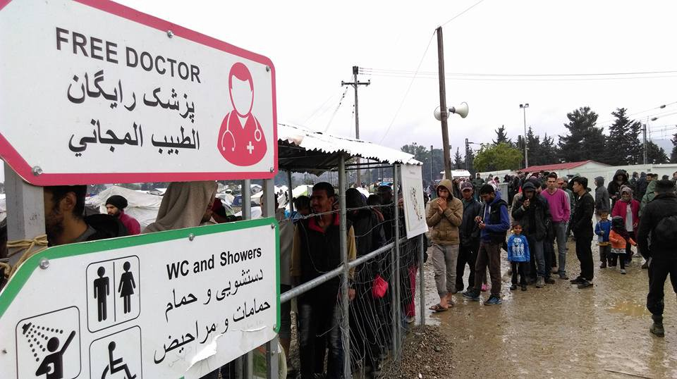

Credits: Refugee Support Group

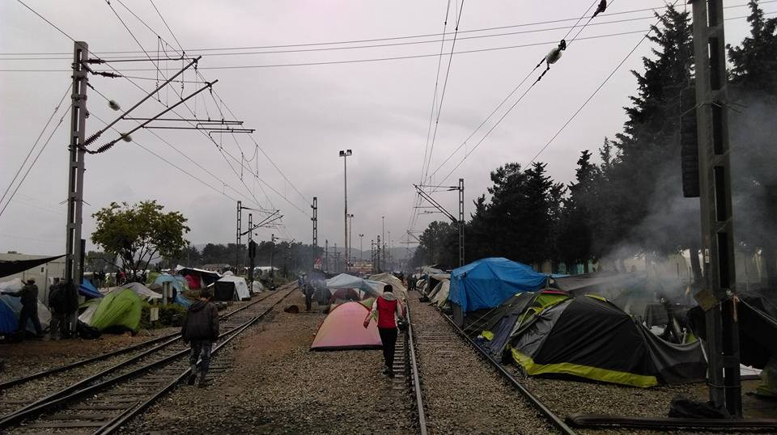

Credits: Refugee Support Group

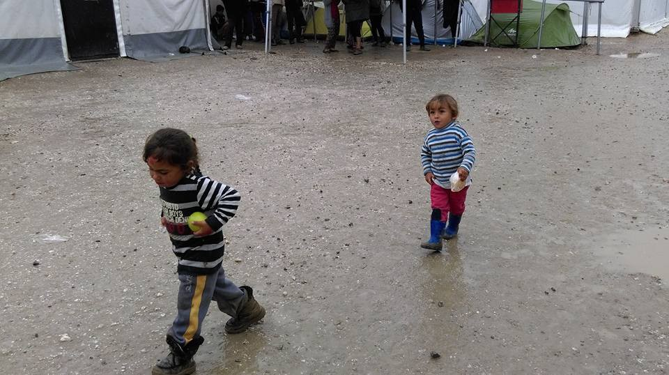

Credits: Refugee Support Group

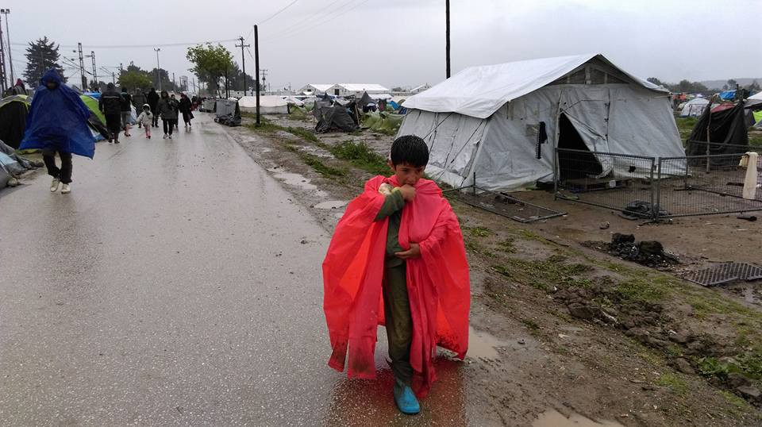

Credits: Refugee Support Group

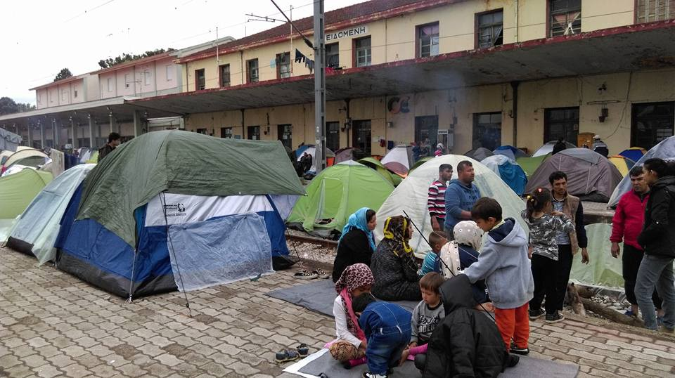

Credits: Refugee Support Group
#### Serbia
### Volunteer with refugees in Serbia\.

> _Belgrade is still an important transit point\. Many refugees arrive here from Macedonia and Bulgaria and try to organize their further travels through Hungary or Croatia, but the effects of the border politics are directly visible here — several hundred people are stuck here and new groups arrive every day\. Most of them are left even without the possibility to get shelter, proper food or information\._ 

> _A group of transnational activists, established a support structure in Belgrade, a mobile kitchen to provide people with warm food every day and preparing abandoned homes as improvised shelters\. Their focus is rather not on humanitarian aid but to cook together with the refugees, protest together, and learn from each other\._ 

> _In the next few days many of our group have to leave and only some will stay in Belgrade\. In order to continue this work we need more people to come to Serbia as soon as possible plus in the long term\. There is a flat where you can sleep or take a rest and create new ideas\. If you come, consider donations \(money is most important since we can buy all ingredients in local shops, but used \(smart\) phones would be great\! \) \. For working together with the local structures it would be best to stay for a longer time, at least one week\. You can contact us either per e\-mail: refugeesupportserbia@riseup\.net or to phone: \+381 61 202 46 74\._ 

> _The central Belgrade park is again filled with refugees\. They currently have enough food and clothes, but shoes are urgently needed\. It has been raining all day in Belgrade and they barely have anything to cover their feet with\. If you can, bring or send shoes to Belgrade\._ 

#### Italy

**700 refugees whose bodies are lying on the bottom of the sea, will finally be buried\.**

> _Tomorrow, the Italian military navy will re\-start the rescue operation, to recover human and material remains of the shipwreck that occurred on the 18th of April, 2016, in the Sicily Channel, with 700 people on board\._ 

> _The operations were cut short after the event due to dangerous weather conditions\._ 

> _The wreck, lying 370m deep in the sea and 85 miles from Libyan coast, will be lifted and transferred by the 9th of May to the NATO platform in Siracusa\. Once there, the platform will be able to extract the corpses of the victims\._ 

> _They victims will then be examined by the experts of the Laboratory of Anthropology and Forensic Odontology, to find out further information about the identity of the refugees\. The bodies will be then buried in Sicilian cemeteries\._ 

> _So far, according to IOM, 1,357 migrants have died in the Mediterranean Sea and towards the European states, from the beginning of the year\. In 2015, there were 1,733\._ 

### Smugglers accused of causing the deaths of refugees and exposing others to great danger\.

> _A police team from Agrigento’s police Headquarters arrested two possible migrant smugglers of a dinghy that reached Lampedusa on the 18th of April\._ 

> _That day, 108 migrants reached the island, while 6 had died along the way\. The arrested people, Seri Sar and Diaw Abdou from Senegal, would be accused not only for the 6 people who were on the dinghy, but also for the shipwreck and the previous death of 28 migrants during the transportation, which has ensured zero safe conditions\._ 

> _The scenario of the event is as follows\. The vessel had 136 people on board\. In order to recall the attention of a ship, some people moved to the front of the dinghy, thus overloading it\. The wooden planks broke and damaged the tire and the ensuing panic caused the fall of some people into the sea, some had suffocated under the stampede, and others threw themselves in the sea, after the flame that came with the contact of sea water mixed with gasoline\._ 

### Talk held on solutions to the refugee crisis in Europe\.

> _Laurent Muschel \(Director for Migration and Protection, within the General Direction of Migration and Internal Affairs of European Commission\) states today, “There is no unique solution to the crisis, but rather a variety of solutions: from borders’ control to improvement in asylum procedures, repatriation and relocation\.” He underlined that the migrants’ flow is unpredictable, since in Italy they increased in winter and decreased in spring 2016\._ 

> _Muschel urges Italy to improve the capacity of detention in the identification centres \(CIE\), now limited to 250–270 placements, against the 1,300 foreseen; in 2015, Italy received 156 thousand arrivals, and only 6 thousand repatriations, meaning that CIE’s capacity is definitely inadequate\. In the end, he hopes for an amendment of Dublin’s agreement, for more equal rules\._ 

**101 refugees arrive to Italy from Lebanon, making the third group of refugees to come to Italy as part of a pilot program active since February\.**

> _Another 101 Syrian refugees from Lebanon arrived Tuesday morning in Rome thanks to the humanitarian corridor\. It’s the third group that has reached Italy since February through an agreement between the Italian government, the Federation of Evangelical Churches in Italy, the Community of Sant’Egidio and the Waldensian Round Table \(Tavola Valdese\) \._ 

> _Immediately after their arrival at Fiumicino airport at 7 a\.m\. on an Alitalia flight from Beirut, the refugees were accompanied by border police to a dedicated area in the arrivals terminal where each of them would begin the long process of entry procedures, including identification with digital fingerprinting\. The refugees will be taken to a special area in the airport where they will then be transferred to various locations throughout Italy, where they will be hosted in reception centres\._ 

> _After the little Syrian girl Falak, who had cancer, arrived in Rome last February 4 with her mother, father, and younger brother — which opened the first legal gate into Europe — another group of 93 Syrians came to Rome on February 29\. In all, about a thousand refugees are expected to arrive over the next two years, not only from Lebanon but soon also from Morocco and Ethiopia\._ 

> _The arrivals are part of a pilot project that allows people escaping from war or who are in a “vulnerable condition” \(victims of persecution, torture, and violence; families with children; single women; elderly; sick; disabled\) to legally and safely reach Italy without risking their lives on the Mediterranean\._ 

### A communal charity event for refugees to be held in Italy\. Let it be an example\!

> _An anti\-fascist people’s organization is organizing a charity event on Sunday 8th May, from 18,00 at Villanova \(province of Pordenone\), at the abandoned elementary school\. At the event, asylum seekers will cook pasta for locals; the payments will support the refugees needs\._ 

#### Germany
### Pegida member fined for insulting refugees\.

> _Lutz Bachmann, head of Pegida, has been sentenced by local court Leipzig to a fine of 9,600 Euro because of sedition\. Prosecutor asked for an imprisonment of seven months, while the lawyer of Bachmann asked for an acquittal\. The trial too place because Bachmann referred to asylum seekers on Facebook as “animals”, “rags” and “mud pack”\. The sentence is not legally yet\._ 

#### France
### Refugee children are back to school\!

> _Over the past few weeks, Care4Calais has been running mobile English workshops\. These have been invaluable as it means we have been able to reach people in remote areas of the camp who are not able to access some of the other classes\. They have had some amazing feedback from the refugees and the incredible volunteers who have been teaching and have loved every minute of it\._ 

> _In order for them to be able to continue with these workshops, they really need more teachers\! If you would like to come and volunteer with them and make a difference then please email them at Clare@care4calais\.org_ 

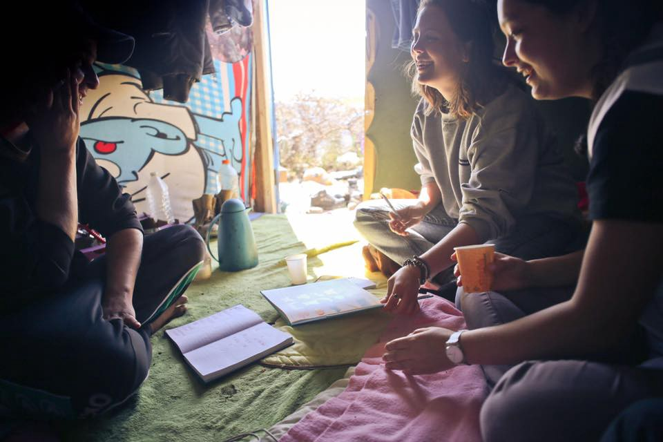

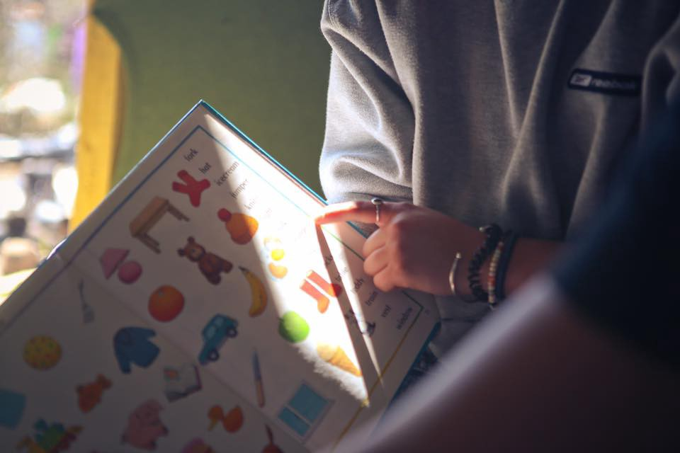

Credits: Care4Calais

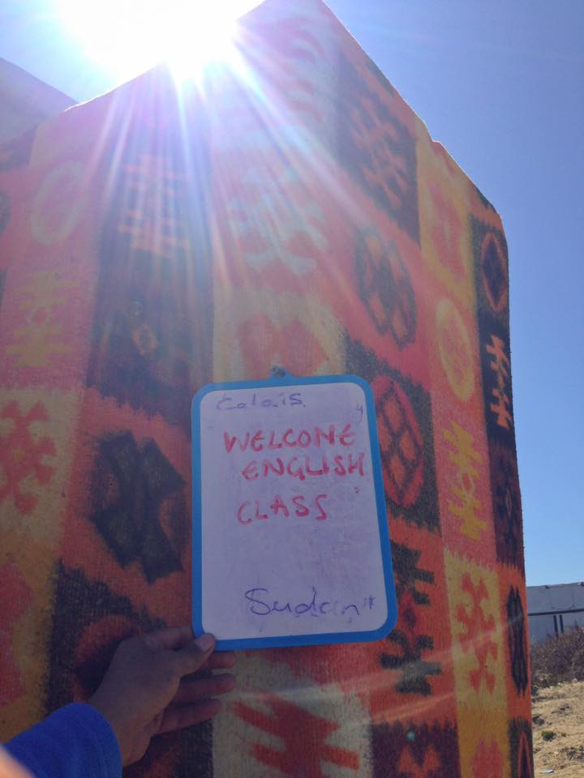

Credits: Care4Calais
#### Switzerland
### Cartooning for Peace Exhibition\.

> _On the occasion of the World Press Freedom Day and the presentation of the 2016 International Editorial Cartoons Prize \(more info [**here**](http://www.cartooningforpeace.org/?p=12722) \), awarded to the cartoonists Gado \(Kenya\) and Zunar \(Malaysia\), an open\-air exhibition is displayed along the banks of the Lake Geneva until June 4th, 2016\._ 

> _The exhibition is divided into five categories: the 2016 prize winners, Exodus, Liberty and Security, Cyber world and Planet Earth\. Cartoonists from all around the world sketch these great issues of the contemporary world\!_ 

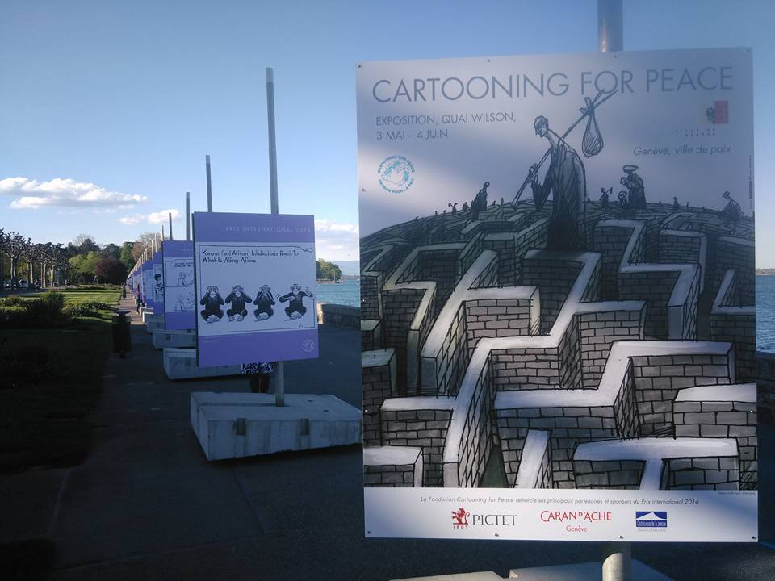

Credits: Rowan Farrell
#### EU
### European countries are tightening their borders

> _According to ANSA, Brussels has used an article from the Schengen Code to allow Austria, Germany, Denmark, Sweden and Norway to extend controls to their internal borders up to six months from this decision, in order to fill the gaps left by Greek management of external borders\. Next Friday, Brussels will motivate this decision\. The document will then have to be adopted by EU Counsil with qualified majority until the 13th of May\._ 

#### Australia
### A refugee woman sets herself on fire

> _A young refugee woman from Somalia has set herself alight at an Australian detention centre on Nauru, just days after a 23\-year\-old man, Omid, died of injuries sustained in a similar act\._ 

> _The events came amid decision by the Australian immigration department to shift detainees out to other mainland facilities, a worsening mental health crisis in the offshore processing centres, and the sudden partial collapse of Australia’s offshore processing policy\._ 

> _Immigration minister Peter Dutton on Tuesday accused activists and detractors of being responsible for that happening, telling the refugees Australia would change its policy\. He stressed that refugee suicides won’t change anything\. The following are his words\._ 

> “I have previously expressed my frustration and anger at advocates and others who are in contact with those in regional processing centres and who are encouraging some of these people to behave in a certain way, believing that that pressure exerted on the Australian government will see a change in our policy in relation to our border protection measures,” Dutton said\. The government would not be swayed by public pressure, protests, or acts of self\-harm\. “We are not going to change those policies, and the advocates, by providing false hope to these people, really \[are\] to be condemned,” he said\. “They can provide offers of support, that is reasonable\. But to provide advice otherwise is very dangerous\.” 

_Converted [Medium Post](https://areyousyrious.medium.com/ays-daily-news-digest-3-5-2016-e92a1573def5) by [ZMediumToMarkdown](https://github.com/ZhgChgLi/ZMediumToMarkdown)._
