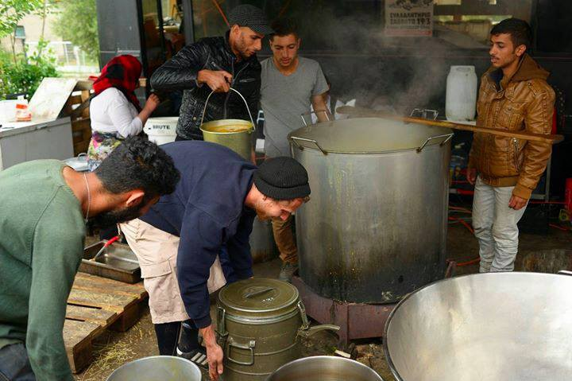

### AYS DAILY NEWS DIGEST 4\.5\.2016\.
#### The UN has predicted a new wave of up to 400,000 refugees from Aleppo if violence continues\. Concerns about refugee health and protection in Turkey\. A team of lawyers coming to Greece to assist refugees\. Volunteers and help needed in Greece\. Rumors about opening border are coming again from Idomeni\. The border will not be open\! Up to 200 attempts to cross the border between Greece and Macedonia daily\. 30 to 40 refugees arrive daily to Calais\. UK under pressure to accept more lone children\.

Aid Delivery Mission, Idomeni
#### Syria
### Up to 400,000 new refugees may come from Aleppo if violence isn’t curbed\.

[Al Jazeera](http://www.aljazeera.com/news/2016/05/russia-reach-deal-ceasefire-syria-aleppo-160504170234773.html) reports that the US and Russia agreed on ceasefire in Aleppo, with the US State Department noting an “overall decrease in violence”\. The UN Humanitarian Affairs chief Stephen O’Brien told the UN Security Council that the killing of civilians in Aleppo “cannot and will not be forgotten\.” UN humanitarian adviser Jan Egeland says “We seem to be having new possible besieged areas on our watch as “hundreds of relief workers \[are\] unable to move in Aleppo”\.

The UN envoy for Syria says an estimated 400,000 could flee to Turkey if violence continues in Aleppo, with at least 253 civilians reportedly killed since the latest wave of violence erupted in Aleppo on 22nd of April\.
#### Turkey

**18 Pakistanis were arrested in Turkey\.**

18 Pakistani nationals were arrested in Bodrum by Turkish police forces\. They were reportedly planning to cross to the Greek island of Kos in the coming days\.
### Serious concerns about health and protection of refugees\.

Lawyers and human rights activists in Izmir express their concern over the protection and health of refugees in Turkey\. The president of the NGO Halklarin Korprusu says concerns with human rights are not within the scope of the EU\-Turkey deal, while the lawyers in charge of specific asylum cases express their difficulty in meeting with refugees in detention centres\.
### Germany afraid of new asylum seekers

[Die Welt](http://www.welt.de/politik/ausland/article155042876/Bis-zu-500-000-Tuerken-koennten-Asyl-in-der-EU-beantragen.html) says up to 500,000 Kurdish refugees could request asylum in the EU if the European Commission accepts visa\-free travel to the EU for Turkish citizens\. It nevertheless says that only 10% of the population currently owns a “travel passport” necessary to travel to Europe\.
#### Greece

**10 people arrived to Greece today\.**

New arrivals at Samos today\. 10 persons landed off the coast of Samos, a little rock called Kasonisi, today and were reportedly rescued by United Rescue Aid\.

No boats landed in Lesvos\.
### Strike in Chios\.

In Chios, refugees in the Viale detention center sewed their mouths shut and started a hunger strike on Tuesday, to protest living conditions and the indifference of authorities\. They protest the lack of attention to people with disabilities in particular\.
### Improvements at Skaramangas

Skaramangas volunteers reported on an improved clothes distribution system that will be inaugurated today\. The food received by refugees was tested by volunteers and is reportedly “plain tasting but not bad\.” Access to the camp for independent volunteers has not yet improved\.
### Help needed at Samos

Samos needs long\-term volunteers for:
- Sorting donations in the warehouse
- Preparing specific items for restocking the distribution cabin in the camp
- Transportation
- Distribution at the camp
- Activities with other groups and NGO’s

Samos also needs short\-term volunteers \(less than 3 weeks\) for all of the above except distribution\.

You can contact the Facebook group “Samos Volunteers” for more information\.
### Volunteers needed in Alexandria camp

Refugee Support Greece needs volunteers in the official camp of Alexandria — interpersonal skills are vital as the organization cooperates with the military and local groups\.

You can contact them on the Facebook group “RefugeeSupportGreece”\.
### Police clamping down on volunteers in Athens

The Iokasti’s Kitchen in Athens will suspend cooking activities until further notice as recent legislation has made it impossible to distribute food in public places — police is clamping down on volunteers at Victoria Square and at Piraeus\. The Kitchen will continue to provide ingredients to 3 self managed locations, currently cooking 1200 meals a day\.

Photographs of Support to Aid Delivery mission at Idomeni who are, “cooking and serving together\. That’s the way how we try to change the world, because it shouldn’t be “We” or “They”\.”

### Help needed in Athens\.

The shelter at 5TH LYKIO in Athens urgently needs
- Biscuits
- Milk
- Tissues
- Sugar
- Juice
- Yogurt
- And anything for children

You can contact Marina Liaki on Facebook if you can provide donations
### The border will not be open\!

Refugees in Idomeni say that people in the camp are celebrating and believe the border will open today\. We heard about these rumors before\. But, we also have to remind you that borders will not be open any time soon, unfortunately\.
### Lawyers are coming to Greece\.

Sea of Solidarity has partnered with Advocates Abroad to bring a team of Greek and foreign lawyers to Greece\. The lawyers will work together to provide legal information and non\-legal advocacy\. Donations for these teams can be made [here](http://www.seaofsolidarity.org/legal) \.
### Love has no boundaries\.

Something beautiful happened today at Idomeni — a solar puff wedding\. Group of volunteers helped celebrate a wedding of two Syrian refugees, in the rain and mud of Idomeni refugee camp\. Everything was there — a dress, cake and flowers\. Congratulations to the newly\-wed from AYS team\.

الف مبروك

انشاء الله ان حياتكم الزوجيه تكون في الحب،

السلام والامن

#### Macedonia
### 100 to 200 people are trying to enter Macedonia daily\.

We received information that every day around 100 to 200 mostly non\-Syrian refugees try and fail to cross the border to Macedonia\.
#### Hungary

We are still trying to collect more information from the border between Serbia and Hungary where situation is getting worse\. More and more refugees are going through Serbia, trying to enter the EU in Hungary\. Here some of the pics from the border at Röszke\.

Bence Jardani

Photo by Bence Jardani

Photo by Bence Jardani

Photo by Bence Jardani

Photo by Bence Jardani
#### Italy
### Volunteers are helping in the sea\.

[Le Monde](http://lemonde.fr/europe/article/2016/05/03/l-aquarius-premier-bateau-citoyen-a-sauve-916-migrants_4913141_3214.html) reports on the volunteer boat ‘Aquarius’ that has saved 917 migrants in the Mediterranean within two months\. It’s funded mostly through crowdfunding and plans to operate between Sicily and Libya over the summer\.
#### France
### Refugees expelled from Stalingrad camp\.

Police evacuates the Jean\-Jaurès school in Paris which has been occupied by migrants since the 21th of April and where people expelled from the Stalingrad camp on Monday sought refuge as well\. According to the “La Chapelle Debout” collective, the expelled group includes many women with children, two pregnant women and one person with cerebral palsy\.
### Up to 40 new arrivals in Calais daily\.

Around 30 to 40 refugees arrive in Calais per day and both camps desperately need small and medium clothes as well as shoes up to size 39\. Stocks are low and distributions may have to be cancelled, despite a desperate need for clothes\. Any groups with donations waiting to go but no van are asked to comment on this [Facebook post](https://www.facebook.com/groups/CalaisMigrantSolidarityActionFromUK/permalink/1053996864675060/?hc_location=ufi) in order to link up with others and get things out to Calais faster\.

Food items are also desperately needed in Calais, especially the items with the red bar:

Cash donations can also be sent directly to the Calais Kitchen\.
#### UK
### The prime minister is under pressure to accept more lone kids\.

The [BBC](http://www.bbc.com/news/uk-36200366) reports David Cameron is under pressure to accept more lone children from refugee camps in Europe\. Children registered in Greece, France or Italy before the 20th of March will be eligible for resettlement and Cameron says he accepts Lord Dub’s revised amendment to the Immigration Bill\. Government says the number will depend on what councils can cope with, while Immigration Minister James Brokenshire says he will write to all local councils and ask them to gauge capacity\. [Writetothem\.com](https://www.writetothem.com/) allows UK residents to write to their local Councillor on any issue, including this one\.
### Volunteers interpreters needed\.

Right to Remain needs volunteer translators to help translate the “Right to Remain Toolkit, a user\-friendly guide to the UK asylum and immigration system”\. The languages currently needed are Arabic, Tigrinya, Kurdish Sorani, Farsi, French and Pashto\. You can reach
#### Sweden

**1243 Iraqis filed for asylum\.**

The refugee flow from Iraq to Sweden has turned around this year, with 1,243 Iraqis filing for asylum while 1,366 withdrew their application, reports Sydsvenskan\. 500 Afghans have withdrawn their asylum applications this year\. “Asylum seekers get tired of the long processing times,” migration expert Kristina Raennar said\.
#### General
### Computer to decide on asylum\.

The European Commission wants a computer to instruct member states how many asylum seekers they must host based on their population size and wealth, [EUobserver](https://euobserver.com/migration/133341) reports\.

The plan is aimed at depoliticising a toxic decision\-making process on asylum, following failed EU\-level efforts to relocate asylum seekers across member states\.

“Whenever a member state has to face a disproportionate number of asylum applications, responsibility for new applicants of all nationalities will be transferred to other member states,” EU commission vice\-president Frans Timmermans told reporters on Wednesday \(5 May\) \.
### “Corrective fairness mechanism”

The European Commission’s new plan to tackle the refugee crisis allows refugees to be distributed around the EU via a “corrective fairness mechanism” that is triggered when the country of arrival receives 50% more asylum seekers than it should accept, given its population and economic power\. States can be fined €250,000 for each asylum seeker they reject under the new quota system\.

According to [Le Monde](http://lemonde.fr/europe/article/2016/05/04/les-quatre-volets-du-plan-de-la-commission-europeenne-contre-la-crise-migratoire_4913176_3214.html) , the plan continues to include visa\-liberalisation for Turkish citizens\. It also strengthens the Eurodac database that collects fingerprints of all asylum seekers and ‘illegal migrants’\. The goal is to facilitate deportations and according to its promoters, better protect children and minors\.
### Turkey and EU agreed on resettlement the program\.

According to the [Frankfurter Allgemeine Zeitung](http://www.faz.net/aktuell/politik/ausland/europa/fluechtlingskrise-eu-und-tuerkei-offenbar-einig-ueber-umsiedlungen-14214975.html) , Turkey and the EU agreed over who will be able to take part in the resettlement programme\. The program will accept Syrians who sought protection in Turkey before November 29, 2015 and prioritize women and girls, survivors of violence and torture, as well as sick and handicapped refugees\. Refugees chosen for resettlement will not be able to choose their destination country\.

_Converted [Medium Post](https://areyousyrious.medium.com/ays-daily-news-digest-4-5-2016-c64a87ea1055) by [ZMediumToMarkdown](https://github.com/ZhgChgLi/ZMediumToMarkdown)._
