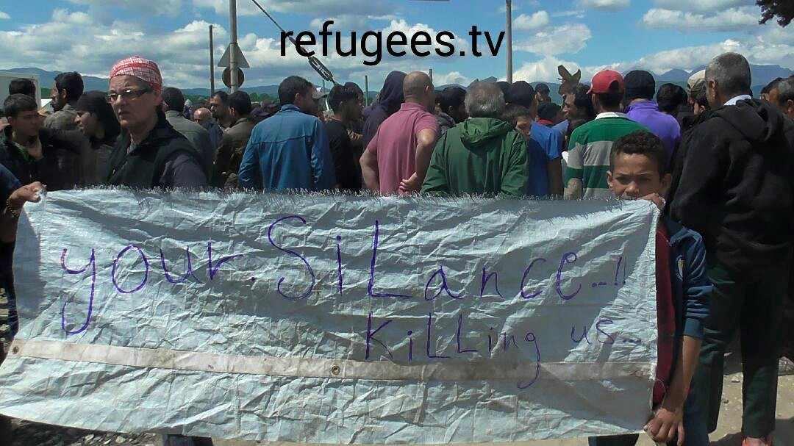
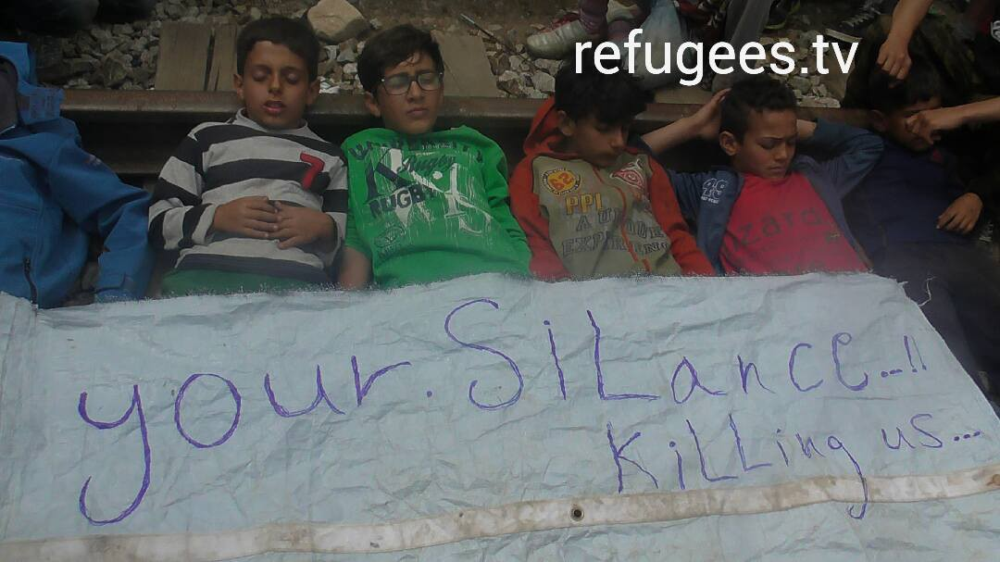
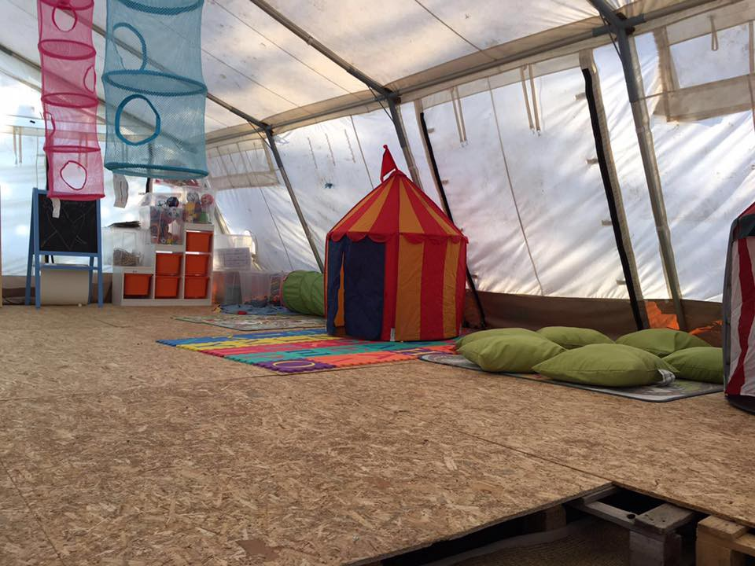
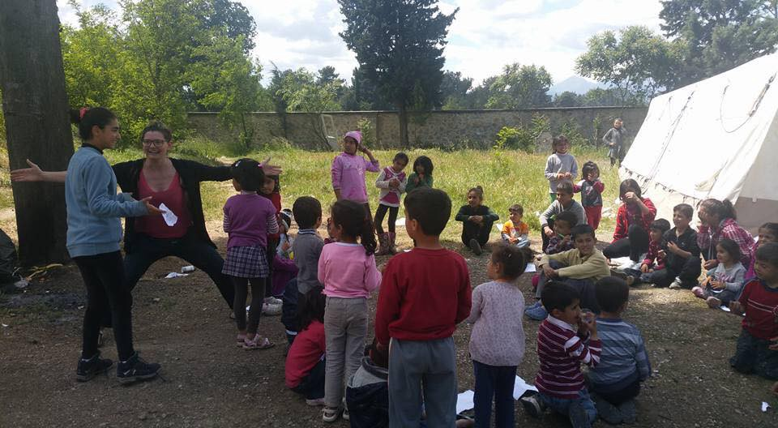

### AYS DAILY NEWS DIGEST 5\.5\.2016\.
#### The Greek government plans to end the relocation of people from Idomeni camp by the end of May\. Refugees stranded in this camp are beginning a new wave of hunger strikes, four of them have sewn up their mouthes\. In Syria, attacks on civilians continue with as many as being 30 killed in one camp near the border with Turkey\. The situation is critical at Vial camp\. Volunteers are needed in Belgrade, where more and more refugees are coming every day\.

Photo by Refugee TV at Idomeni
#### FEATURE STORY
### The relocation of refugees from Idomeni to begin soon\.

For several weeks now, the AYS team has been following news about the relocation of people from Idomeni\. Various sources are confirming that relocation will begin soon, possibly as of tomorrow\. Not enough information is available about the procedure, or the places to which refugees will be relocated\. Apparently, UNHCR is taking applications for voluntary transport\.

Previously, in April and March, we reported about the four new camps in Thessaloniki area to which people from Idomeni will be relocated\. According to the statement from April 27 by Giorgos Kyritsis, a spokesman for refugee and migration affairs, new camps are built inside of two former factories, a former logistics company and a former warehouse\. AYS learned that some other camps will also be used\. Some of the camps to which people will be relocated are Nireas, Lagkadikia, Sindos, Oraiocastro, not all of them in Thessaloniki\. Over the last couple of weeks, groups of people have already been taken to these camps\. Over the next days we will try to find out as much as it is possible about conditions in the new camps\.

Alternate Migration Policy Minister Yiannis Mouzalas told the news agency [ANA\-MPA](http://www.amna.gr/english/article/13709/Mouzalas-to-ANA-MPA:-Idomeni-must-and-will-be-dismantled) that the camp at Idomeni, “must and will be dismantled\.” However, he did not give details \. He mentioned a meeting held in Thessaloniki on May 4th with local governments, NGOs and organizations describing it as a “working meeting that aims to end the horror of Idomeni\.” If refugees choose to remain in Idomeni when there are alternative accommodations places available, he added, “then they must put up with the consequences of this choice\.”

The minister also promised that people whose papers have expired \(and around 70 percent of those staying at Idomeni are, he said\) will get new ones after relocation\. “We say that if they come to the camps, their papers will be automatically renewed\. The difference is that we are not threatening; we are offering a prospect of legality,” he clarified\. At the meeting, Mouzalas repeatedly stressed his commitment to ensure that no force is used during the evacuation\.

Currently, 10,124 refugees are living in Idomeni in desperate conditions\. There is no possibility that the border will be open any time soon\. Today, one group of the refugees held a protest again trying to draw attention to the horrible situation in the camp\.

Photo Refugee TV Idomeni
#### Syria
### Up to 30 people killed in refugee camp

Another deadly attack is reported in Syria\. This time victims are refugees in the al\-Camouna camp near Sarmada in Idlib province, in the northern part of the country\. The Syrian Observatory for Human Rights, a UK\-based monitoring group, reported that 28 people had been killed\. The number of killed could be even higher\.

](assets/e7f59ad845bc/1*OQ2A40w8hsfZ81umgui0zg.jpeg)

Activists in the city of Aleppo dye the Martyrs River formerly known \(Queiq\) RED, photo by [Laurent Dan Moeri](https://www.facebook.com/SayitLoud?fref=photo)
### Jesuit Refugee Service to leave Aleppo due to danger\.

Earlier in the day, the countryside near Aleppo was attacked as well\. There are no reports of casualties\. The day before the attack, [Jesuit Refugee Service \(JRS\) declared that they cannot operate in Aleppo any longer because of danger\.](http://centroastalli.it/gesuiti-sospendono-il-servizio-per-rifugiati-ad-aleppo-siamo-allo-stremo/)
#### Turkey
### Help needed in Izmir\.

Refugee Volunteers of Izmir are looking for more Arabic translators\. Find them on FB\. [https://www\.facebook\.com/groups/893837690724053/](https://www.facebook.com/groups/893837690724053/)
#### Greece
### New arrivals to Greek islands\.

According to government sources, 87 people arrived to Lesvos by 7\.30 am today\. Volunteers from Samos are informing us that, despite bad weather, last night 10 people arrived on Kasonisi Beach\. Altogether 3 families are from Iraq: 5 adults and 5 children\.

**2135 are at Piraeus Port in Athens\.**

Currently there are 53,900 refugees and migrants in Greece\. Out of this number, more that 2,135 are at Piraeus Port in Athens\. News That Moves reports that a ‘food stamp’ system, introduced by volunteers from Refugees Welcome to Piraeus, is in place: people receive food upon presenting an official paper with their name on it\. Unfortunately, people complain about the quality of food that is provided\.

Red Cross provides help to the people from 9 am to 11 pm, and Praksis is also present at the field plus volunteer doctors from the organization “Exeri” who operate from 08\.00\-Midnight\. The organization “Smile of Child”, operating 10\.00\- 18\.00, can treat infants and children\.

The accommodations in the Port are very rudimentary, and people still have limited access to toilets and bathrooms\.
### Horrific situation at Vial camp

Situation is getting more urgent at Vial camp where some of the people who are placed are with special needs, including women with young children, pregnant women, unaccompanied children, elderly men and women, and people with physical and psychosocial disabilities\. Volunteers are telling us that four people are on hunger strike as of today, and they sewn their lips\. Also, News That Moves reports that as of today, the First Reception Service, the independent agency under the Deputy Minister of Interior and Administrative Reform — Migration Policy Section responsible for Vial, is on strike — which means zero site management at Vial at the moment\.
### Community garden in Ritsona camp\.

Welcome Foundation and Americans for Refugees in Crisis \(ARC\) are jointly developing several projects at Ritsona camp, about 1\.5 hours north of Athens\. The camp hosts around 900 residents currently\. Their first project is an organic \(bio\) community garden\. They have been allotted about 1\.6 acres by the Greek Air Force to build a community garden which will provide plots for families, individuals, and groups\.

“While the refugees all hope to leave Greece quickly, the reality is that many will remain in Greece for several years\. A community garden will have the practical benefits of providing them with healthy food and, perhaps more importantly, give people agency in producing their own food\. Camp residents have a broad range of professional skills and accomplishments for which their current circumstances provide little outlet\. We anticipate that residents will quickly assume leadership roles and develop the garden enterprise in new ways\. Once the garden has been established, the next phase of the project includes the creation of a community kitchen at Ritsona to provide room for micro enterprises,” their say\.

Volunteers are needed, but organizations are also raising funds to pay for the expenses of this project, including rental cost of farm tractor to clear land, soil amendment, shared garden tools, a shared lockable shed to store the tools, materials for building raised beds, drip irrigation, plant supports, a farm stand, water catch basins, and many other garden related requirements\. If you can help, visit the websites of both Welcome Foundation and Americans for Refugees in Crisis, as well as the “Donate” button on Facebook\. [Volunteers can get more information here](https://www.facebook.com/groups/ritsonagardenvolunteers/) \.
### Free border school at Idomeni\.

A free border school under one of the tents near the main camp at Idomeni, opened its “doors” today\. Many of the children who are stranded at this camp stopped their schooling months ago, and this is the first chance for them to go back\. In addition to the school, the tent serves as a room for playing, and also as a space where psychosocial care and trauma management can take place\. The school is run by [Borderfree Association](https://www.facebook.com/borderfreeassociation/?fref=photo) \.

Photo by Borderfree Association

**1694 people have been deported or returned to their native country from Greece in April\.**

The Hellenic Police \(ELAS\) reported that about 1,694 third\-country nationals who were deported or returned to their native country from all areas of Greece in April\. The greatest number of returns were to Albania \(852\), followed by Pakistan \(157\), Morocco \(107\), Iran \(61\), Georgia \(51\), Afghanistan \(45\) and Bangladesh \(29\) \. A total of 6,427 third\-country nationals have been returned to their country of origin since the start of the year, ELAS said\.
### Buses will be on strike in Thessaloniki from tomorrow until Sunday\.

For all of you tin the area of Thessaloniki, buses are on strike from tomorrow, Friday, until Sunday due to the strike\. This applies to city busses\. Other busses are running as per normal, up to Polykastro and to various other places in Greece\.
#### Macedonia
### A measles case has been confirmed in Gevgelija\.

[According to the media reports](http://famagusta-gazette.com/measles-case-confirmed-at-migrant-reception-center-in-macedonia-p33767-154.htm) , a case of measles has been confirmed at the reception center Gevgelija\. The patient was a 3 year\-old girl from Afghanistan\. After this case, a general inspection was undertaken by an official body, and it was concluded that the center is maintained properly and that it stands at a satisfactory level\. An area measuring 1,250 square meters was also disinfected\.

Currently, the Gevgelija reception center is accommodating around 100 migrants, whereas another 153 migrants wait outside the facility in a specially prepared tent\. These are people who have managed to cross the border illegally and who are to be returned at the Idomeni makeshift camp in Greece after the Macedonian Interior Ministry verifies their identities\.
#### Serbia
### Food distribution in park in Belgrade

Miksaliste refugee aid center is open again, but they now work in the park near the bus stop\. Volunteers from Belgrade are reporting that the city is once again full of refugees\. Food is distributed at the park near the bus stop every day from 2 to 4pm, in cooperation with the Refugees foundation\. Hopefully, clothing and shoes distribution will begin next week\. Workshops for children, drawing with kana etc\. are temporarily being held in Mikser house\. Volunteers are still in negotiations about temporary new location for Miksaliste\.

More people are needed to help\.
### No information about the masked assailants who destroyed Belgrade reception centers last week\.

According to the local media, Serbian Prime Minister Aleksandar Vucic and his office do not have any information about who were the masked people with baseball bats who tore up refugees receptions centers in Belgrade last week\. Savamala, the area where the centers were and that are destroyed, is a neighborhood at the river bank in Belgrade, where the government signed a project for the construction of the Belgrade Waterfront — a massive residential and office space complex, including the largest shopping mall in the Balkans\.
#### Hungary
### Thousands of crossings into Hungary in April

The situation in Hungary is not improving\. [Migrant Solidarity Group of Hungary](http://www.migszol.com/blog/week-april-28th-may-5th-2016-hungarian-situation-update) reports that many people are still passing through Hungary every day\. According to their data, during the week in between April 22nd to 28th, local police recorded 1,051 “illegal border crossings”, and 1,401 crossed into Austria\. This number does not include the people entering Hungary at the transit zones and the people crossing without being caught\.

The same source reports that the Office of Immigration and Nationality \(OIN\) held a press meeting in Körmend about the new camp and said that more than 10,000 refugees have disappeared from Hungary since they registered here\. Dukai Miklós, Deputy of Ministry of the Interior, said that of the 12,000 registered asylum seekers, there are now 1,777 people in in the open camps\. They also report that Nagyfa camp, next to the Serbian border, but the new camp in Körmend, next to the Austrian border, opened on 2nd of May\.

The Hungarian extreme right party Jobbik, is planning a demonstration against the camp on Friday, 6th of May\.

There are two transit zones on the Hungarian and Serbian border: Rôszke/Horgos and Tompa/Kelebija\. These zones are the two legal entry points to enter and ask for asylum in Hungary\. Besides the transit zones there are several hundreds of people crossing the border illegally through the fence every day\.

“The transit zones cannot be accessed by any volunteers or NGO’s, only by the border police, ION, and the Hungarian UNHCR\. The area in front of the transit zones on the Serbian side, the ‘no\-man’s land’ where people are waiting to get inside, is regulated both by Hungarian and Serbian authorities, because the first 5 meters from the fence towards Serbia are still Hungarian territory\. Since it is a contested border area, access is restricted\. For more information, [see the information leaflet](http://www.helsinki.hu/en/information-leaflets-for-asylum-seekers/) here prepared by the Hungarian Helsinki committee\. It is available in ten languages\. You can follow the Hungarian Helsinki Committee at [@hhc\_helsinki](https://twitter.com/hhc_helsinki) and Migszol Csoport [@migszolcsop](https://twitter.com/MigSzolCsop) on Twitter\.
#### Italy
### New place for refugees in Milan

On Friday, a new hub for refugees will be open in via Sammartini 120, in Milan\. Foundation Progetto Arca, supported by Avsi Foundation, Comune di Milano, private sector and volunteering organization, is starting with this new centre for refugees’ reception, recording and hosting\.
### Food and medicines for Idomeni

Tomorrow, the humanitarian mission [Agire a Idomeni](https://www.facebook.com/Agire-a-Idomeni-265138560487051/?hc_location=ufi) , lead by Marco Taucci and Marco Manzo, will bring medicines for the children in Idomeni, next to a potato crop\. Their first mission was in March 2016, when they delivered food\. Tomorows delivery will also including food and sanitary support\.
#### France
### No protests in Calais areas this weekend

Fabienne Buccio, prefect of the Pas\-de\-Calais, [issued an decision banning all public gatherings related to the migratory situation in Calais on the municipalities of Coquelles, Fréthun and Calais](http://www.20minutes.fr/lille/1840339-20160505-prefecture-interdit-toutes-manifestations-week-end-calais) , from this Saturday, 7 May 2016 at midnight until Sunday, may 8, 2016 at midnight\. The decision came after two groups, one ultra left and the other ultra right, announced their protests at the same time\. “The proximity of these two antagonistic groups is likely to lead to tensions or even the risk of serious disruption to public order,” the decision reads\.
#### General
### Bracelets for refugees

Two young Americans, volunteers, are turning the abandoned life vests into bracelets that will be sold in order to raise funds for those fleeing countries like war\-torn Syria\. Xander Schultz and Zoe Pappis, both volunteers at Lesbos, came up with the idea of “Zoe Bands”\. All profits from sales go towards providing refugees with basic necessities like clothing and food\. The bands are not named after the founder Zoe, but rather the Greek word “Zoe” which means “life”\. The bands are manufactured on Lesbos by locals, and all aid is purchased locally in order to help the island’s economy which has suffered since the crisis\. The fundraisers hope Zoe Bands will raise tens of thousands of dollars through the help of fundraising website Indiegogo\.

The orange Zoe Band sells from $20\.
### MSF out of the World Humanitarian Summit

[Médecins Sans Frontières \(MSF\) decided to pull out of the World Humanitarian Summit \(WHS\)](http://www.msf.org/en/article/msf-pull-out-world-humanitarian-summit) \. In their statement they say: “MSF has been significantly engaged in the WHS process over the past 18 months, including preparing briefing notes on various themes — a sign of our willingness to be involved\. The WHS has done an admirable job in opening up the humanitarian sector to a much wider group of actors, and leading an inclusive process\. However, with regret, we have come to the decision to pull out of the summit\. We no longer have any hope that the WHS will address the weaknesses in humanitarian action and emergency response, particularly in conflict areas or epidemic situations\. Instead, the WHS’s focus would seem to be an incorporation of humanitarian assistance into a broader development and resilience agenda\. Further, the summit neglects to reinforce the obligations of states to uphold and implement the humanitarian and refugee laws which they have signed up to\.

As shocking violations of international humanitarian law and refugee rights continue on a daily basis, WHS participants will be pressed to a consensus on non\-specific, good intentions to ‘uphold norms’ and ‘end needs’\. The summit has become a fig\-leaf of good intentions, allowing these systematic violations, by states above all, to be ignored\.

Summit participants, whether states or UN agencies or non\-governmental organisations, will be asked to declare new and ambitious “commitments”\. But putting states on the same level as non\-governmental organisations and UN agencies, which have no such powers or obligations, the Summit will minimise the responsibility of states\. In addition, the non\-binding nature of the commitments means that very few actors will sign up to any commitments they haven’t previously committed to\.

We hoped that the WHS would advance these vital access and protection issues, reinforcing the role for independent and impartial humanitarian aid, and putting particular attention on the need to improve emergency response\. Unfortunately it has failed to do so, instead focusing on its ambitions to “do aid differently” and “end need”, fine\-sounding words which threaten to dissolve humanitarian assistance into wider development, peace\-building and political agendas\.”

_Converted [Medium Post](https://areyousyrious.medium.com/ays-daily-news-digest-5-5-2016-e7f59ad845bc) by [ZMediumToMarkdown](https://github.com/ZhgChgLi/ZMediumToMarkdown)._
