### AYS DAILY NEWS DIGEST 6\.5\.2016\.

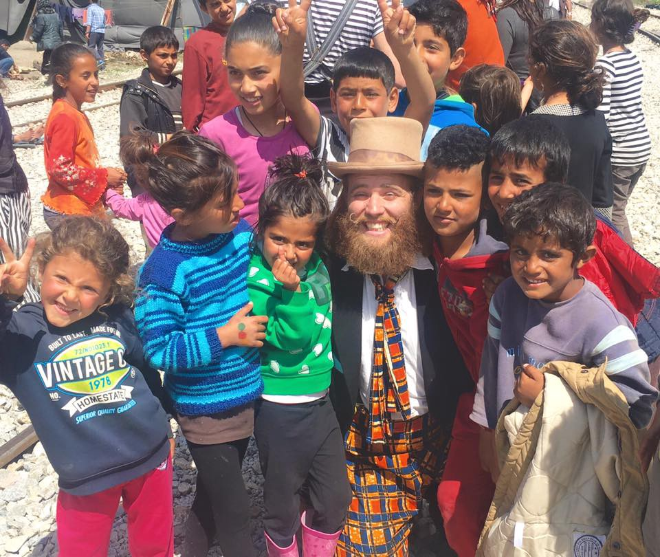

Credits: The Flying Seagull Project
#### SYRIA
### Syrian Government/Russia accused of bombing civilians

> _The government of Bashar al\-Assad has been accused of bombing a Syrian refugee camp near the Turkish border, in an attack that activists and officials said left dozens of civilians dead and wounded\._ 

> _“We don’t know yet if it’s Syrian or Russian aircraft, but they struck in the middle of the camp and many of the tents have been burned,” said Alaa Fatraoui, a [journalist](http://www.theguardian.com/world/2016/may/05/airstrike-hits-refugee-camp-in-northern-syria-say-activists) based in the area who visited the scene after the attack\._ 

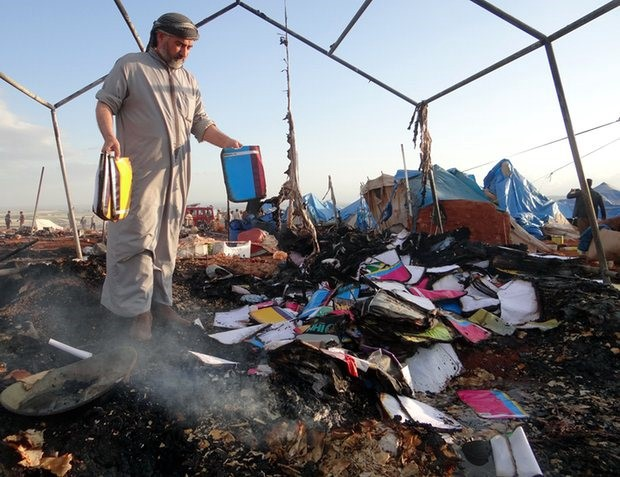

Credits: Anadolu Agency
### Prison Siege in Hama

> _Inmates in Syria’s besieged Hama prison have shared pictures which appear to show armed soldiers surrounding the jail\._ 

> _On Monday, a monitoring group reported that government troops had fired tear gas into the prison in the west of the country after inmates revolted and seized several guards\._ 

> _The Syrian Observatory for Human Rights said inmates were protesting against a transfer of prisoners to a military facility in Sednaya\. Those held in the Hama jail include political and Islamist prisoners, it said\._ 

> _Speaking via a translator, an anonymous source within the prison, who provided the images, told The [Independent](http://www.independent.co.uk/news/world/middle-east/syria-hama-prison-siege-assad-inmates-share-pictures-ofrces-surrounding-jail-a7014866.html) : “Prisoners fear for their lives\. Unless the negotiations are made highly public, our concern is that after the negotiation period has ended, the regime will separate out the prisoners and retaliate, probably with torture and executions\.”_ 

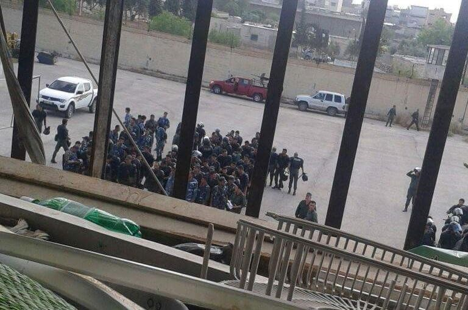

Credits: The Independent
#### JORDAN

> _Thousands of Syrian refugees are stranded at the Syrian\-Jordan border\. Many are families and injured\. Many have walked to get there, through night and day and harsh conditions\._ 
 

> _Jordan does let them in very slowly due to Daesh security concerns and gives priority to families, women and children\. But also, deports many back across the border if their paper aren’t correct\._ 

### Refugees riot for their lives

> [_Rioting_](http://l.facebook.com/l.php?u=http%3A%2F%2Fwww.middleeasteye.net%2Fnews%2Fsyrian-refugees-riot-no-mans-land-camp-near-jordan-border-147990866%23sthash.W5czTj0R.dpuf&h=cAQHPPsXO) _has broken out on an isolated stretch of the Jordan\-Syria border where more than 55,000 Syrians have been blocked from seeking asylum in Jordan\._ 

> _The unrest engulfed an informal crossing point called Ruqban during a humanitarian operation to register the Syrians with the UN’s refugee agency on Wednesday\._ 

> _According to aid officials, the crowd became uncontrollable as people queued to register their claims with UNHCR\. Jordanian border guards were unable to restore calm, sources said, and UN staff were evacuated from the area\._ 

#### TURKEY
### EU\-Turkey deal at risk

> _The [Financial Times](http://www.ft.com/cms/s/0/284333fa-12c1-11e6-91da-096d89bd2173.html#axzz47qWqsXAe) \(published yesterday\) says the resignation of Turkish PM Davutoglu throws into doubt the EU\-Turkey deal as “President Erdogan has responded coolly towards the agreement struck by his premier and has shown increasing hostility towards the EU”\._ 

> _EU officials say Turkey could now backtrack on reform commitments and on revisions to antiterrorism legislation in particular_ 

> _According to the [FAZ](http://www.faz.net/aktuell/politik/fluechtlingskrise/erdogan-zu-eu-forderungen-wir-gehen-unseren-weg-geh-du-deinen-weg-14218637.html) , the Turkish Minister for EU Affairs Volkan Bozkir says Turkey “cannot afford the luxury” of changing its anti\-terrorism laws given its current struggle against terrorist organization\._ 

#### GREECE
### Trying to be a child in Idomeni camp

> _The Flying Seagull Project is trying to make a childhood for refugee children possible, even in the worst of the environments, such as Idomeni\. This is what they say about their work in Idomeni:_ 

> “Another extremely challenging week has come to and end and we have shared laughter with over 1500 children seeking refuge on the Macedonia border\. 

> It is so difficult to describe the situation her as it is one of complete contradiction\. The hardship and lack of structure has made the children at times very aggressive and impossible to communicate with and at other times so affectionate and heartbreakingly beautiful\. 

> We have been visiting four camps every day and feel like we are finally making progress\. With structured games and masses of positive encouragement they are responding well and starting to play well together\. 

> The environment is tough, the atmosphere can be toxic and oppressive but with just a little hope the day can turn around for these kids\.” 

Credits: The Flying Seagull Project

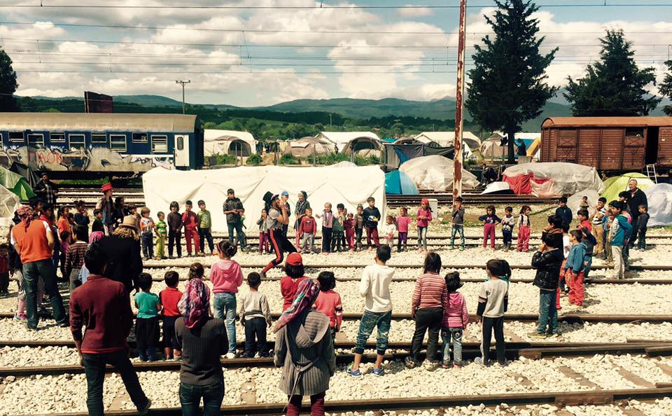

Credits: The Flying Seagull Project

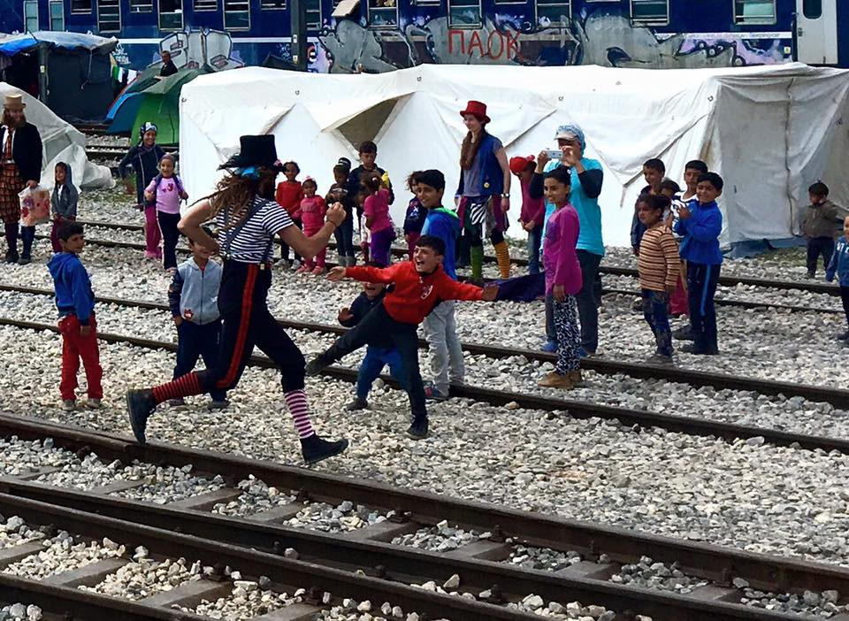

Credits: The Flying Seagull Project
### Greek Entrepreneur Couple Starts First Free Refugee School in Athens

> _Run by serial entrepreneurs at the Cube, SOLE Athens is the first school in the Greek capital offering classes to refugee children that are stranded in Greece\._ 

> _Staying inside their rooms and with nothing to do as their parents are awaiting asylum approval, most refugee kids are “extremely bored at different Athens hotels\.” With their future still unknown, for many children this was the first day in school after four years\._ 

[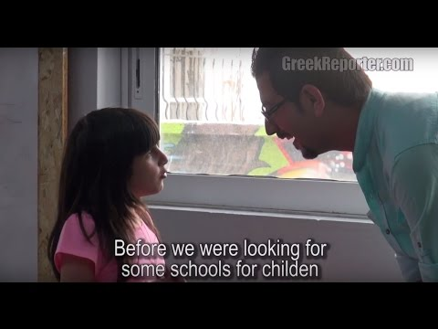](https://www.youtube.com/watch?v=mTHrgiiQaPU)

### Interview with S\. who is living in the camp in Chalkero

> **Moving Europe: Can you tell us about you the situation in Chalkero?** 
 

> We are loosing our hopes day by day\. And people get more and more angry\. The situation is very difficult\. Only very few people reach the asylum service via Skype, the option of relocation seems to be a trap and the conditions of living are bad\. We all are running out of money\. 

> **Moving Europe: Do people have to spend a lot of money?** 
 

> The food is so bad, that most families buy groceries to cook their own food on small fires\. We cannot eat the military food anymore\. Macaroni pasta for weeks and weeks just makes you sick\. That means that a family has to spend around 20 Euro a week for food\. Al lot of people have to ask friends and families for money in Syria and ask if they can send money by Western Union to Kavala\. But 20 Euro is a small fortune nowadays\. Because of the war the inflation skyrocketed\. Now you need around 600 Syrian Pounds for 1 Euro\. But the average monthly salary is just about 16’000 Syrian pounds\. This is now just around 25 Euro\. 

> _Read [more](http://moving-europe.org/05-05-2016-interview-about-chalkero/)_ 

### SpiderMan caps for the kids to protect them from the sun

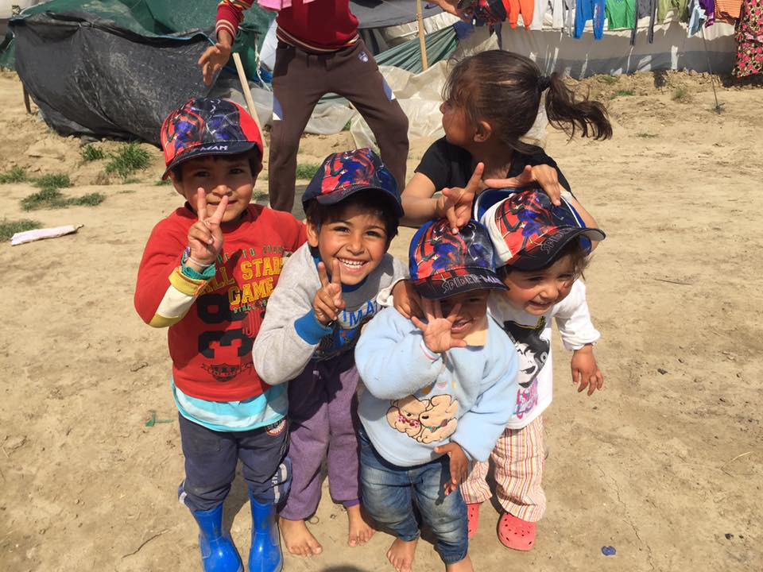

Credits: Team Humanity

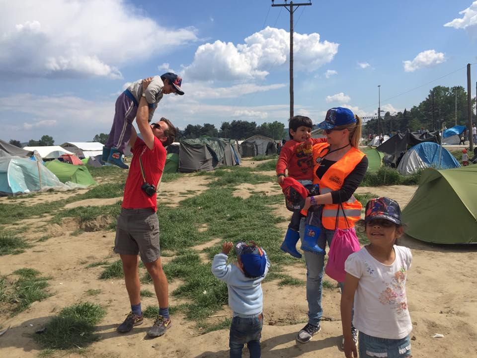

Credits: Team Humanity

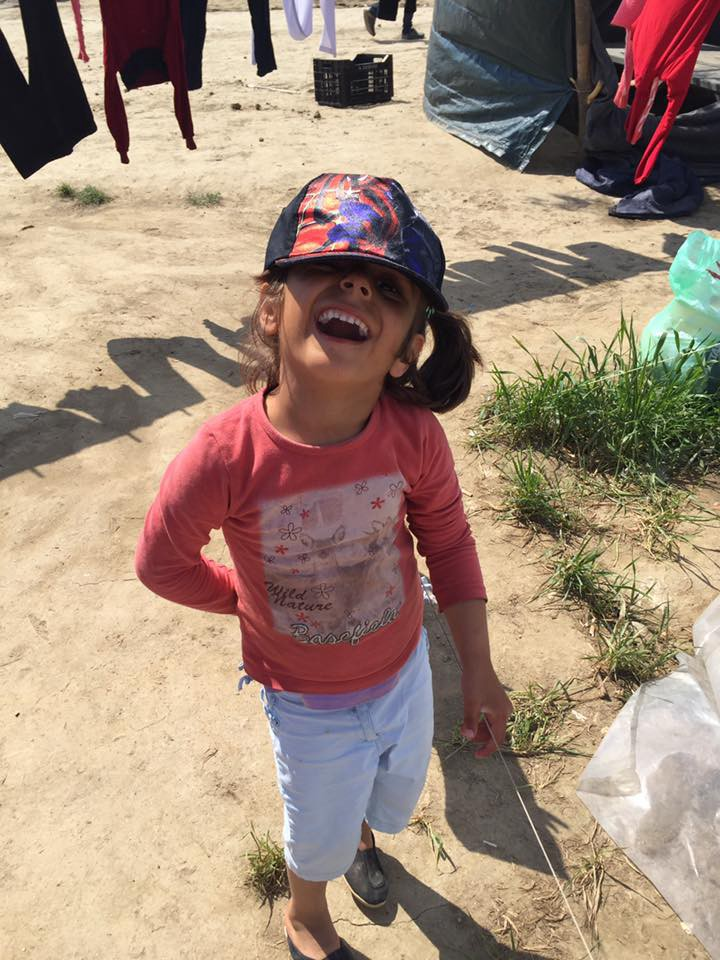

Credits: Team Humanity
#### BULGARIA
### Bulgaria to start sending back refugees soon

> _Bulgaria will be able to send back migrants who have crossed its border with Turkey illegally from June 1, according to the protocol signed between Sofia and Ankara on Thursday\._ 

> _The country is the first among EU member states to sign the protocol, which sets procedures for sending refugees back to Turkey\._ 

> _“The most important thing is that we are sending a very strong signal to the traffickers and the refugees who plan to cross the Bulgarian\-Turkish border,” Bulgarian interior minister Rumyana Rachvarova [said](http://www.balkaninsight.com/en/article/bulgaria-%D1%82%D0%BE-start-sending-migrants-back-to-turkey-from-june-1-05-06-2016) in Ankara\._ 

#### MACEDONIA
### Volunteers in Macedonia need more hands

> _As the number of refugees passing to Macedonia has recently started to increase again, volunteers in the field have become in need of any help they can receive\. If you are able to join them especially at the week starting from 12th of May, you can contact through this mail: [refugeesupportmacedonia@riseup\.net](mailto:refugeesupportmacedonia@riseup.net)_ 

#### SERBIA

> _Yesterday volunteers in Belgrade have distributed aid, burek and shoes to refugees\. Here is a picture from their relief efforts_ 

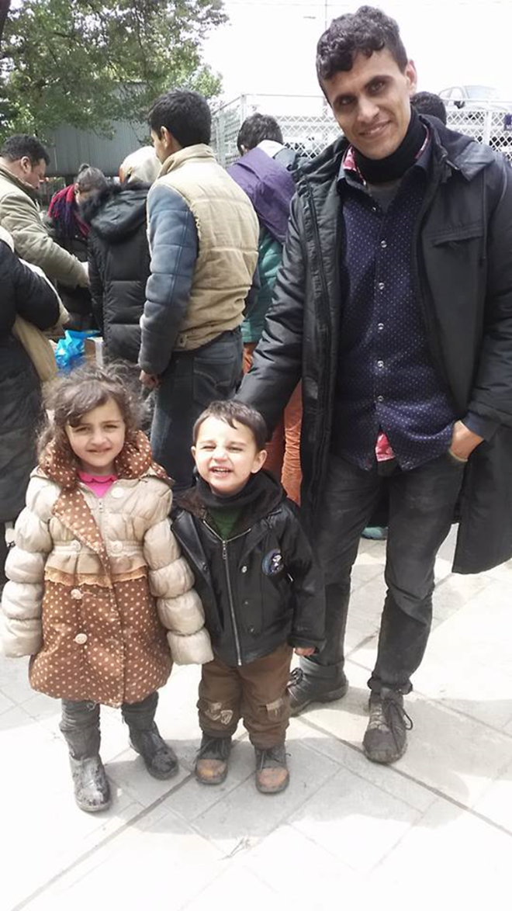

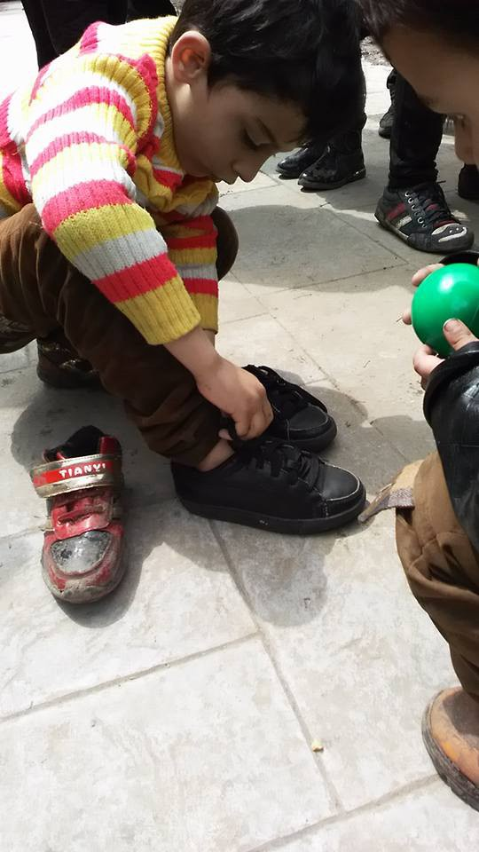

Credits: Refugee Aid Serbia
#### SLOVENIA

> _Spring and summer [clothes](https://www.facebook.com/Slovenskafilantropija/photos/a.583302148418298.1073741827.583293701752476/1044154255666416/?type=3&theater) and shoes wanted in Ljubljana_ 

#### FRANCE
### Volunteers Needed For Teaching and Outreach

> _Dunkirk Adult Learning Centre is known in the camp as a lively and safe place to learn\. It’s a great place to volunteer\. The Centre provides a program of learning relevant to refugees in the camp aimed at creating understanding and unity\. There are currently daily French and English classes, a library, and literacy classes are in development\._ 

> _If you have a work ethic that is professional and compassionate and you can commit a month or more then please get in touch for further information and a chat\._ 

> _For Contact: [dunkirkadultlearning@gmail\.com](mailto:dunkirkadultlearning@gmail.com)_ 

> _You can find them on Facebook as: Dunkirk Adult Learning Centre_ 

> _Scabies treatment in Calais was a success\! The medical team are running short on: Cold and Flu medicine \(capsules\), Vicks \(pots and inhaler tubes\), Permethrin \(Scabies cream\), Anti histamines \(anti allergy, used for itching from scabies\), Ibuprofen gel, Deep heat/freeze cream and spray Tubi grips, Self adhesive bandages, over the counter sleeping medicines\._ 

> _If you can donate financially or with items, please let us know or you can drop at Care4Calais\._ 

#### GENERAL

> _Pope Francis has urged Europe to tear down the walls being built to keep out refugees and said that “being a migrant is not a crime,” in a speech at the Vatican to an audience including German Chancellor Angela Merkel and the heads of the EU’s main institutions, according to [Al Jazeera\.](http://www.aljazeera.com/news/2016/05/pope-francis-migrant-crime-160506130005073.html)_ 

### End detention now\!

> _The May 7th is a Transnational day of solidarity with detained people and protest against detention centres\. May 7th is part of a wider transnational campaign to shut down detention centres and end the inherently abusive and violent system of immigration detention that criminalises, detains, and imprisons people simply because they have chosen or been forced to migrate\. Actions also take place in solidarity with wider struggles against borders and migration controls and with people who are living in detention without walls, from Calais to Idomeni\. So far actions have been planned across the UK and in The Netherlands, Germany, Belgium and Iceland\._ [Find out where protests are happening](https://shutdowndetentioncentres.wordpress.com/find-out-where-protests-are-happening/) \! 

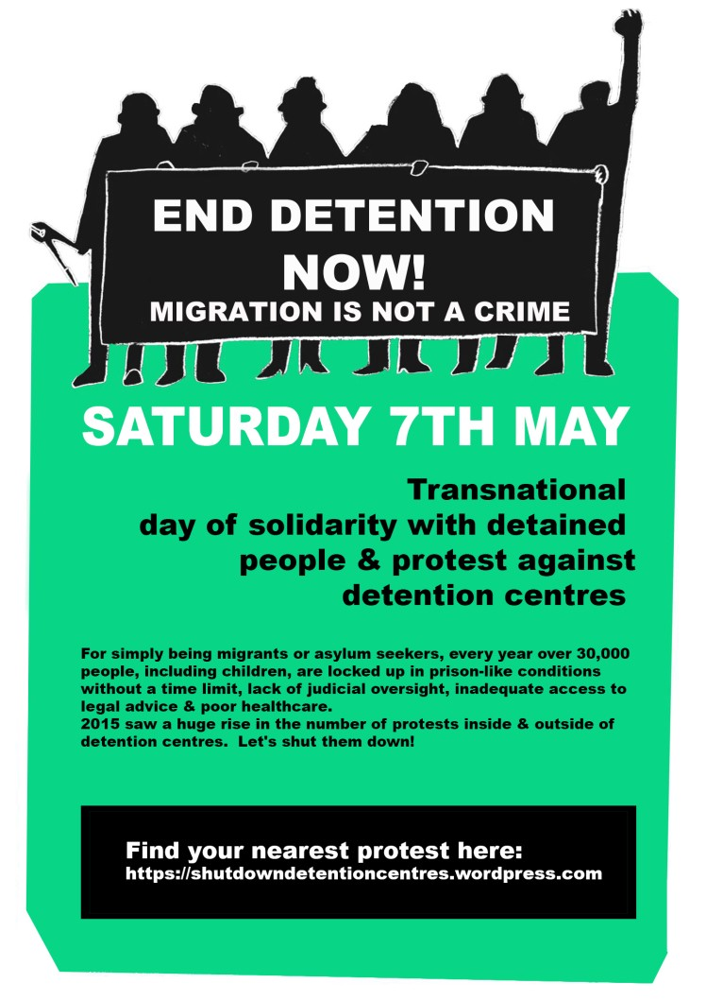

Credits: End Detention Now movement

_Converted [Medium Post](https://areyousyrious.medium.com/ays-daily-news-digest-6-5-2016-377dfdeb755c) by [ZMediumToMarkdown](https://github.com/ZhgChgLi/ZMediumToMarkdown)._
