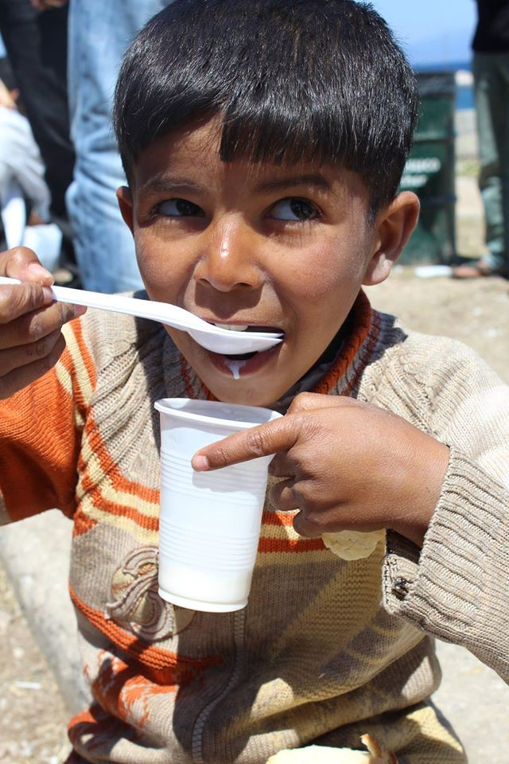
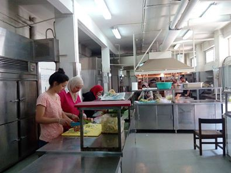
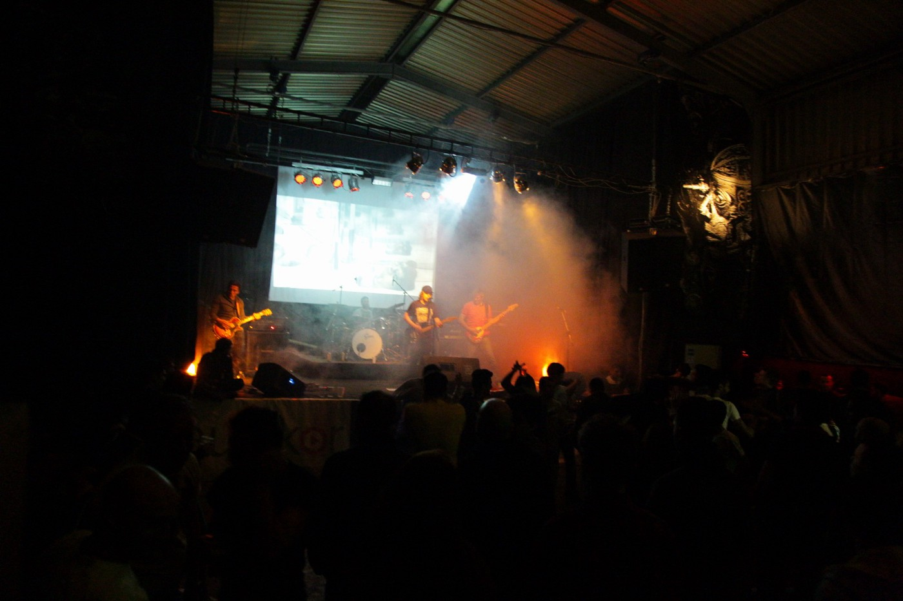
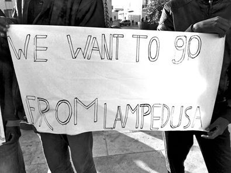

### AYS DAILY NEWS DIGEST 7\.5\.2016
#### Most of the refugees in Lebanon want to go back to Syria, says the UNHCR Spokesperson\. New arrivals to Greek islands have been reported — 29 to Lesvos, 14 to Samos and 1 to Chios\. Refugees are on a hunger strike in Chios Viale center\. Greek mainland camp Thermopylae needs help — medical supplies, condensed milk and baby formula\. Bulgarian PM calls for ‘more solidarity’ by the Central EU countries regarding their readiness to accept the system of quotas\. “Take us away from this prison” — Refugees were protesting in the streets of Lampedusa island\. The number of migrants is growing in Italian city of Pordenone — blankets were stolen from the people who were sleeping in the streets due to slow asylum registration procedure\. First refugees according to the quota system will arrive to Croatia in July\.

Photo by Sol Carrillo — after a month without milk distribution in Souda camp at Chios, volunteers managed to deliver it for all the children who are there\.
#### LEBANON
### The Lebanese UNHCR spokeswoman reiterated that most of the refugees in the country desperately want to return to Syria\.

THe spokeswoman for UNHCR in Lebanon, D\. Sleiman, says that most of the refugees in this country want to go back to Syria\. “They wish to stay here not because they like it, but because they are close to home\.” She added that resettlement to Europe could be the only chance for the most impoverished Syrian refugees to secure a better future for their children\. The percentage of Syrian refugees in Lebanon living under the poverty line — approximately $3\.84 a day — drastically increased from 49 percent in 2014 to more than 70 percent in 2015\. Single mothers and people with specific healthcare needs are prioritized for resettlement\. Sleiman explained that UNHCR officers will analyze the database of registered refugees and contact those whom they believe meet these criteria\. Yet it is probably only a small percentage of Syrian refugees will be resettled\. \(Sources: Al Jazeera, W2 Europe\)
#### GREECE
### **_53,652 refugees are in Greece today, with 30 new arrivals to the islands\._**

Government statistics report a total of 53,652 refugees across the country today as of 8AM, lower than yesterday’s total of 53,901\. The government reports 7,703 people at the islands, with 15 new arrivals — 14 at Samos and 1 at Chios\. By 5PM today, volunteers at Lesvos reported the arrival of one boat with 29 people, which landed in the North of the island while no information is available for the South\.

The greatest number of people is at the mainland — 14,389 in Attiki \(out of this, 2135 in the Port of Piraeus and 2880 in Skaramagas Dock\), 1,954 in the Central, 338 in the Southern and 29,268 in the Northern Greece\. 10,028 refugees are still in Idomeni camp\.
### The mobility of refugees on Lesvos remains limited\.

Volunteers in Lesvos report that transportation for refugees at Lesvos is problematic — families and other vulnerable groups have been moved to KaraTepe, but they often have to return to Moria for paperwork\. General needs from now on, as it is the case for the mainland, as well as for the most of the ex\-Balkan Route in the places where the refugees are stranded is to create ways to keep people occupied, especially women\.
### Refugees of Viale Camp are on a hunger strike after being detained for over a month\.

Refugees started a hunger strike four days ago in Viale, at Chios — after 47 days in Viale \(from March 20\) there is a little attention given to them and they have no information about what will happen to them\. In order to remain visible, they started a hunger strike, and some of the people have sewn their mouths shut\. \(Source: Aplotaria\.gr\)
### Volunteers in Athens paying for refugees’ needs out of their own pocket\. Help is needed\!

Volunteers in Athens are financing the stay of a number of refugee families with babies in a hotel in Omonia — due to the lack of personal funds, these families might soon to be on the street\. In the meantime, they need food, powdered milk, and diapers in sizes 4 and 5\. If you can help, please contact Maggie Mullin\.

Photo by Nasim Lomani, City Plaza, Athens
### Volunteers report on the yesterday’s distribution incident at the E1 School Box in Piraeus\.

A volunteer \(not belonging to the School box project\) was mistakenly given the key to the box\. That volunteer \(who was with another group\) then initiated an unplanned distribution in front of the box and began taking photos of the children, refusing to stop after repeated requests by the School Box volunteer\. This created almost immediate chaos\. Volunteers repeatedly advise against unplanned distributions\. This is even more important with children\. It puts children at risk because they are afraid of not getting what they need and they respond accordingly\. Volunteers have also repeatedly asked volunteers not to take photos of children, especially where there is no consent from parents or guardians\. Please put the safety and security of the children first\. They need the stable environment of projects like the School Box and volunteers who think before they act\.
### Donations needed in Thermopylae Camp\!

Thermopylae camp needs help — it has doubled in size since last month and they will be taking in a new group of families on Monday which will increase the number of its residents by another third\. These are mostly families with small children\. They have run out of essential supplies\. Anyone in the Athens area that can help with providing medical supplies, condensed milk and baby formula would be greatly appreciated, as well as the funding — please get in touch with Love Without Border Facebook group\.
#### MACEDONIA
### Group publishes guidelines for discussing the refugee crisis with children\.

Children’s Embassy Megjashi, in collaboration with SOS Children’s Village, which provides psycho\-social support to the refugee children at the transit center Tabanovce, has printed a manual titled, “We are all children of this world — how to discuss with students about the refugee crisis\.”
#### BULGARIA
### Bulgaria has confirmed that it would accept its quota of 1,200 refugees, but only two Iraqi refugees have agreed to be relocated to the country\.

Bulgarian PM Borisov has broken ranks with other Central European states that oppose to the quotas system\. He called for greater solidarity by these countries to take in more asylum seekers as part of EU quota system\. He told AFP that the countries are happy when they receive the development money from the richer EU states, so they should also show solidarity and shoulder their part of the burden\. Several countries in Central and Eastern Europe like Hungary, Poland and Slovakia have rejected the relocation quotas assigned to them\. Hungary also lashed out at a proposal by the European Commission to impose fines of EUR 250,000 per refugee to EU member states who refuse to take in their quotas of asylum seekers\. Bulgaria has confirmed that it would accept its quota of 1,200 refugees but only two Iraqi refugees have agreed to be relocated to the country from other EU Member States\. One of them has already slipped out of the country, AFP noted\.
#### CROATIA
### New proposal by Croatian group for the relocation refugees across the country\.

This week there was a meeting of the Working Group for the Integration of Foreigners, related to the urgent adoption of the action plan for the removal of obstacles to the realization of certain rights in the area of ​​integration of foreigners in the period from 2016 and 2018\. It was said at the meeting that the Government should soon adopt a proposal of a new model for relocation of persons who meet the requirements for the approval of international protection\. The national model of relocation of persons will be decentralized, meaning that they will be accommodated across the country\. The first refugees will arrive to Croatia in July — 30 of them from Turkey, 10 from Italy and 10 from Greece\. These persons should be located in the cities of Zagreb, Rijeka and Split\. By the end of 2017 Croatia should receive 1,617 people \(84 people a month starting from July 2016 until the end of 2017\) \. The representative of the Ministry of Health’s Task Force said that the Law on Compulsory Health Insurance and Medical Care in Croatia is to be changed very soon \(in July\), due to the difficulties that refugees encounter in practice\.

Photo by Matija Kralj, AYS and other lovely people having fun at the concert, Zagreb, Croatia
### AYS organizes rock concert visit for refugees\.

AYS took another step forward in integration of refugees in Croatia — almost 70 asylum seekers situated in Zagreb visited a rock concert tonight, women and girls included\. They had a great time at the concert of Mahatma Band in the town of Zabok\.
#### ITALY
### Refugees protest at Lampedusa being held for months\.

“Take us away from this prison” — Migrants were protesting in the streets of Lampedusa island yesterday asking to leave the island, where they have been held for months and where more than 70 migrants have been on a hunger and thirst strike against the identification and hotspot system\. Another 400 people have landed on the island in the last 24 hours\. \(Source: La Repubblica\)

Photo by Giacomo Zandonini, Lampedusa protest
### Refugees forced to sleep on the street in Pordenone as a result of slow accommodation\.

According to Messaggero Veneto, the situation could be soon become critical for refugees and migrants in Pordenone, the city in Friuli\-Venezia\-Giulia, the Italian region at the border with Austria and Slovenia\. The funds available for the Pordenone province to host refugees in 2016 are sufficient for 800 people, while according to the data by the local Nuovi Vicini organization, the number of people has already reached 770 and it is constantly growing\. Since the asylum registration procedure is being slower that during the previous period, refugees might wait on the streets even for a couple of days\. The local media reported that a few nights ago, 14 people slept on the streets\. Also, a couple of nights ago, a group of refugees sought to find shelter near the church of Beato Odorico, but they were expelled by the police, who were allegedly called by the vicar himself\. A part of the group was accompanied by the volunteer group Rete Solidale to the ex\-Fair, but in the meantime they realized that the blankets were stolen from the refugees\. This is why they ask for blankets, but also male jeans trousers, male snickers \(no\. 41–45\) and warm shirts\.
#### United Kingdom

New Mayor of London, Mr\. Sadiq Khan expressed his support to the refugees by publishing his photo with a “Refugees Welcome“ sign\.
### UK volunteers are collecting clothing for refugees\.

Volunteers in UK are collecting help for refugees, including light summer hijabs/head scarfs, abayas, modest women’s tops/dresses, sunscreen, trainers and walking shoes \(for all ages and genders\), plastic sandals and crocs \(all ages and genders\), Sudocream, baseball caps\. The aid is being collected until May 27 in Newcastle, Northumberland, Luton, London, Manchester, Leicester, and Bedford\. For more information please contact Ruhi Loren Akhtar \(07984181736\) \.
#### GENERAL

The Guardian reports that the vice\-president of the European parliament Ulrike Lunacek, has called on EU member states to do more to support female and child refugees arriving in Europe to prevent gender\-based violence\.

BBC reports on the terrible conditions of the Calais camp and the risks that children and minors take in order to reach Britain\. They report that some British officials the BBC crew met on their way out of Calais say they also urge young Afghans to apply to settle in France\. However, for many young Afghans, all they know of France is the harsh conditions of Calais\.

_Converted [Medium Post](https://areyousyrious.medium.com/ays-daily-news-digest-7-5-2016-b9ed6c3c4fb5) by [ZMediumToMarkdown](https://github.com/ZhgChgLi/ZMediumToMarkdown)._
