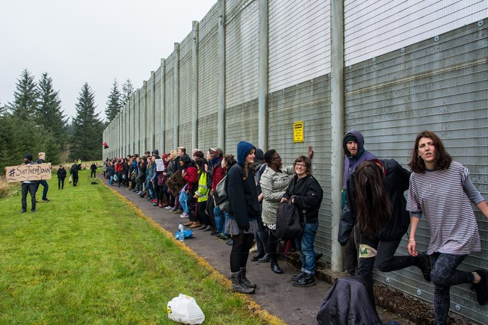
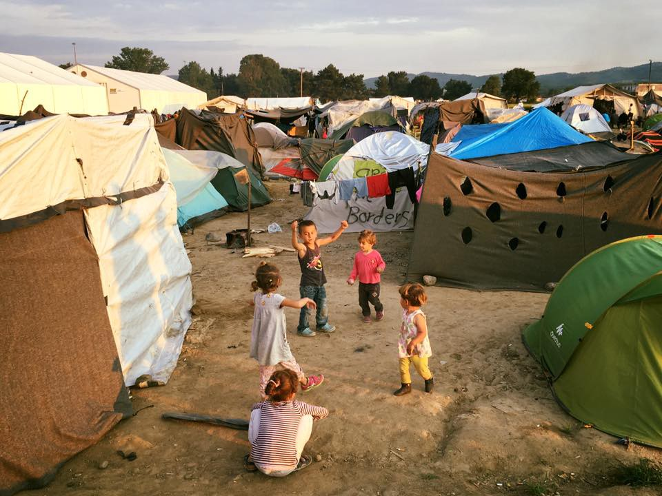

### AYS DAILY NEWS DIGEST 9\.5\.2016\.
#### EU officials are preparing a “Plan B” that does not include Turkey\. Hunger strike in Elliniko camp, protests continue on Leros\. More lives lost: 26\-year old woman from Syria shot by Slovakian authorities while trying to enter the country from Hungary, Pakistani man dies in France\. Hundreds of new asylum seekers are reported to have arrived in Hungary during the last week, with 572 people apprehended for illegal border crossing\. Please check out call for donations/volunteers in Greece and France\.

A day trip to the Detention Centre in Dungavel, \(Scotland\) organised by We Will Rise\. A showing of solidarity with the refugees, asylum seekers, and others within the immigration process locked inside\. Photo credit: JJDF Photography\.
#### GENERAL
### **EU officials are preparing a “Plan B” that does not include Turkey\.**

As many have predicted, Turkey’s president is not likely to back down and downplay his so\-called anti\-terrorist law\. The EU\-Turkey deal just might be on the rocks before it was even properly implemented\. As reported, EU officials are working on another “solution” without Turkey in order to stem the flow of refugees in Europe, Germany’s Bild reported on Monday\.
#### GREECE

> Even though days are getting warmer, there are warnings of waves up to 0\.5 meters high of the coast of Greek islands as well as high humidity\. 

### New arrivals on Greek islands\.

The number of refugees in Greece today is 54,341 with 8,352 in the islands, 14,438 in the Atika region, 1,915 in central Greece, 338 in southern Greece and 29,298 in the northern region\. There were 74 new arrivals today with 37 in Lesvos and 37 in Leros\.

**1700 foreign citizens were returned from Greece to their countries of origin in April, with only 386 returns to Turkey\.**

[News that moves](https://newsthatmoves.org/en/almost-1700-persons-returned-from-greece-in-april/) reports on new data on deportations from Greece to countries of origin:

> _“Almost 1,700 foreign citizens were returned from Greece to their countries of origin in April\. According to the police, the returns were based on deportation orders for irregular entry into Greece, forced returns and voluntary departures overseen by EL\.AS, as well as the voluntary return programme operated by the International Organisation for Migration \(IOM\) \. In April, the largest numbers of people returned from Greece were citizens of Albania \(852\), Pakistan \(157\), Morocco \(107\), Iran \(61\), Georgia \(51\), Afghanistan \(45\), Bangladesh \(29\), and Bulgaria \(16\) \. Since January, 6,427 people have been returned from Greece to their countries of origin\. According to the latest EU data, 386 of those people had not submitted asylum applications in Greece and were subsequently returned from the Greek islands to Turkey under the EU\-Turkey deal\.”_ 

### **New austerity measures for Greek people with unrest and general strike\.**

Not only have refugees been played by Europe and stuck in Greece, but as we know, Greece is continuously taking hard blows that are going to affect many people including refugees\. [As News that Moves](http://www.euronews.com/2016/05/09/greek-parliament-passes-controversial-pension-reform/) reports “The Greek parliament voted on Sunday evening to pass a controversial new austerity package that includes cutting pensions and raising taxes\. Large demonstrations and confrontations with riot police continued into the night as a three\-day general strike has seen the country grind to a halt\. Trade unions say that Greece cannot take another round of austerity measures, and they will continue to challenge the government\.”
### **Call for donations and volunteers in Samos\.**

With the future still being very much uncertain and many being stuck in Greek islands for long periods of time, there are calls for help for donations\. There is a call for more volunteers as well as donations from the crews working in \#Samos from where volunteers report that “situation has changed a lot, but volunteers are still working hard to support refugees and new arrivals\. People are on islands for longer now so need more support\.” If you are able and willing to volunteer or donate, please contact them on their FB pages friendlyhumansamos and samosvolunteers\.
### **Syrian solidarity house in Lesvos needs a new minibus to transport kids to school**

There is another call for help from Syrian solidarity in \#Lesvos\. As the crew reports “a few weeks ago, the squat’s mini\-bus was stolen — this mini\-bus was used to transport the children to school and back as well as used for other necessary journeys\. The school has found another mini\-bus that it wishes to buy, but is short on funds\. If anyone is looking for a funding project, please speak to Kastros or message him on [http://bit\.ly/1SZBgV7](http://bit.ly/1SZBgV7) or Janni or Tessa when you are next at the Squat and discuss with him/them about how you might help with the mini\-bus project\.”
### **School materials and a projector for movie nights needed in Chios\.**

Together with calls for help, there are efforts to make life in the islands more bearable with different program and activities\. The Soli Cafe team from \#Chios want to start organizing movie nights and English and Greek lessons\. For this they need a projector because for now they use a small TV screen and it is hard for people to watch movies from there\. Also they need school materials such as pens, pencils, note books, any book that can help for English language learning \(the basic vocabulary and grammar\) and chalk\. If you are able to help, please contact their [FB page](https://www.facebook.com/solicafechios/) \.
### **Protests continue on Leros\.**

As UNHCR reports, on the island of Leros, tension and protests occurred during the last days at the hotspot / registration and identification center\. Demonstration began on Wednesday, 3 May, and continued in the following days, when detained refugees and migrants protested against general living conditions\. In addition, members of the local community gathered outside the center to express their anger to the Mayor\. Authorities guaranteed improvement regarding food provision, and announced that those detained for 25 days will then be able to move freely on the island\.
### **Hunger strike in Elliniko camp\.**

Unfortunately, the news from the mainland is not looking good, either\. As reported from the \#Elliniko camp in Athens, refugees started a hunger strike today: Volunteers report that people “are desperate, and this is the only way they can speak out\. They say that they will leave the camp, if things won’t change\.” They are asking for their voice to be heard and to be treated like human beings by closed off Europe\.
### **There was a break into the warehouse in Scaramangas camp\.**

As volunteers report, there was a break into the warehouse in Scaramangas camp near Athens\. Donations that were carefully sorted out are now scattered around\. Crews working there said that they “ cannot work inside until the building is secured\. Fortunately a meeting had been scheduled today for all the NGOs working in the camp\. The captain covered the warehouse in his agenda and the Danish Refugee Council will repair and secure the building for us\. Despite the many challenges of working in a refugee camp, it’s amazing to see a group of aid workers come together and find solutions to pressing issues to improve conditions for the refugees\!”
### **Idomeni is being emptied out\.**

Idomeni\. Photo credit: Amir Karimi

As we have already reported, \#Idomeni is being emptied out slowly with the aim of completely depopulating it by the end of May\. As stated on Idomeni volunteers page “You may see groups of police officers with the Metadrasi translators going around Idomeni informing people, they are focusing on the train tracks to start\. If you are on the ground and have more questions about this process, ask your team leader/project coordinator\. If you are a prospective volunteer, please be aware that the situation at present is highly fluid\. We are working on strategies to facilitate the long term involvement of volunteers in the region going into the future\-when we know more, and have a concrete plan, we’ll let you know\.”
### **Help needed in the warehouse in Idomeni**

Also there is a call for help in the “Human in Need” warehouse\. If you can’t find it here are the coordinates — 40\.66729, 22\.92792\. Working time of the warehouse is Wednesday 11:00–16:00 and the help is needed for sorting out 450 kilos/100 boxes of aid from Poland\. If you are able to help, please contact azteka@otenet\.gr or Dimitra Triantafyllou on Facebook\.
### **People stuck in Idomeni are still pleading for open borders\.**

While the camp is being emptied out, UNHCR reports that remaining hopeful and determined to continue their journey, 100 people located at Idomeni approached the barbed wire fence at the border between Greece and Macedonia\. However, they were denied further access to the territory by police\. According to media, in Macedonia, approximately 800 people have attempted to cross the border in the past two days alone\.
#### HUNGARY
### **Hundreds of new asylum seekers reported to have arrived in Hungary during last week with 572 people apprehended for illegal border crossing**

As UNHCR reports around 800 asylum\-seekers and migrants were reported to have arrived in Hungary last week\. Police reported 572 individuals were apprehended after irregular entry while UNHCR observed 265 people who approached the transit zones in Roszke and Tompa\. With the limited daily admission capacity \(30 per zone per day\) at these locations, around 200 people are waiting outside the fence without shelter, sanitation and hygiene facilities, and are exposed to protection and health risks\. UNHCR is present daily in the transit zones to monitor the admission process, coordinate with UNHCR Serbia to identify people with specific needs\. On the Hungarian side of the border, access to the transit zones remains limited for other organizations\.
#### SLOVAKIA
### **26\-year\-old Syrian woman shot by Slovakian authorities while trying to enter from Hungary\.**

Devastating news from Slovakia as refugees fleeing war are being shot in the heart of Europe\. According to Hungarian news sources, a 26\-year old Syrian woman was shot this morning on the border by the Slovakian authorities\. She was being smuggled in a car through the Vamosszabadi\-Medve crossing\. Vamosszabadi is also the location of one of the three open refugee camps in Hungary\. There were four cars, and close to Nagymegyer the Slovak customs authorities decided to stop the cars\. Three of them stopped, and it turned out that they are carrying “illegal immigrants” \(wording by the Slovak authorities\) \. The driver of the fourth car decided not to stop and speeded instead\. The customs authorities reacted with warning shots in the air, but when the driver did not care they shot at the car\. The woman in the car was hit as well, and an ambulance had to be called\. She was shot in the back and brought to the Dunajská Streda\-hospital and operated, and now her situation is stable\. All the people who were being transported have been handed over to the Ministry of the Interior\.
#### GERMANY
### **Useful app for asylum seekers in Germany**

There is a useful tool for asylum seekers in Germany — it is called Ankommen and it can help with basic information on language, previously established migrant communities, as well aswhere to get some basic necessities near you\. The app for iPhones can be downloaded [here](https://itunes.apple.com/de/app/ankommen/id1066804488) and for Android [here](https://play.google.com/store/apps/details?id=de.br.ankommen) \.
#### FRANCE
### One more life lost in France\.

Volunteers report that one more life has gone last night in France when a man from Pakistan was hit by lorry while attempting to go to UK\. May he rest in peace\.
### Don’t forget about Calais: People to People Solidarity running out of supplies\!

People to People Solidarity — Action from UK needs your help\. With the warmer weather, more refugees are making their way to Calais and Dunkirk while the volunteers are running out of supplies\. Some volunteers report that every day they have new people coming with absolutely nothing and they have not been able to help them for the last couple of days since they ran out of everything\.

They’ve put a list of items to help you all find what is being asked at the moment and where to go for up\-to\-date information so please see the following link and help if you can: http://bit\.ly/1s8uDWK\.

Be careful to quality control the items you send to France\. Clothing needs to be packed in boxes of one item type only and clothes need to be good quality \(i\.e\., you’d wear it\) \. Underwear needs to be new\. Shoes need to be very good quality \(refugees walk a lot\! \) and paired together with rubber bands and not brown packing tape, which can damage them\. Make sure they have their laces too\.

And finally, People to People Solidarity would like to thank all those who are helping in any way they can\.
#### UK
### Citizens UK action: write to your MP and ask them to ensure all children with family reunion claims are relocated in Britain in time for school

Citizens UK is asking you to write to your MP to thank them for the success of the Dubs amendment and ask them to go further\. They want the government to ensure that all the children in Calais with valid family reunion claims, and the first 300 of those identified as most at risk, are relocated to Britain in time to start school this September\. Many of these children have been out of education for 2, 3, 4 years with their lives and with futures on hold because of a war they had no part in starting\. Please write to raise this issue by following the link: [http://bit\.ly/219PXdP](http://bit.ly/219PXdP) \.

Also, for those active in local groups, Citizens UK have created a new campaign pack full of information about how local areas can play a part in protecting these children\. Please follow the link to see how your community can help protect refugee children: [http://bit\.ly/1Qhwmzs](http://bit.ly/1Qhwmzs) \.

_Converted [Medium Post](https://areyousyrious.medium.com/ays-daily-news-digest-9-5-2016-2cea79ea10d1) by [ZMediumToMarkdown](https://github.com/ZhgChgLi/ZMediumToMarkdown)._
