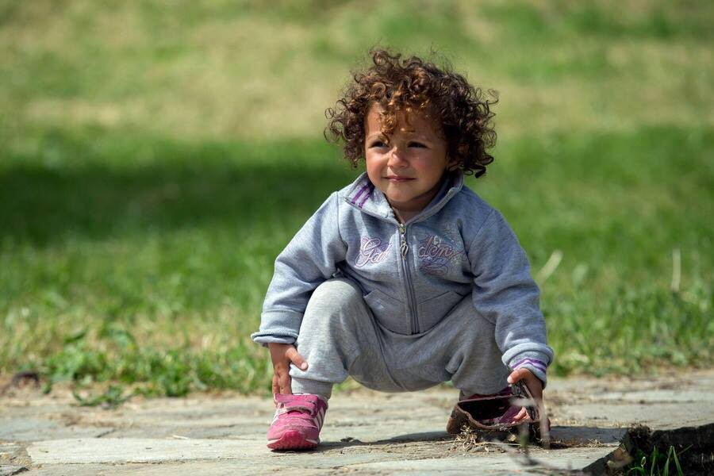
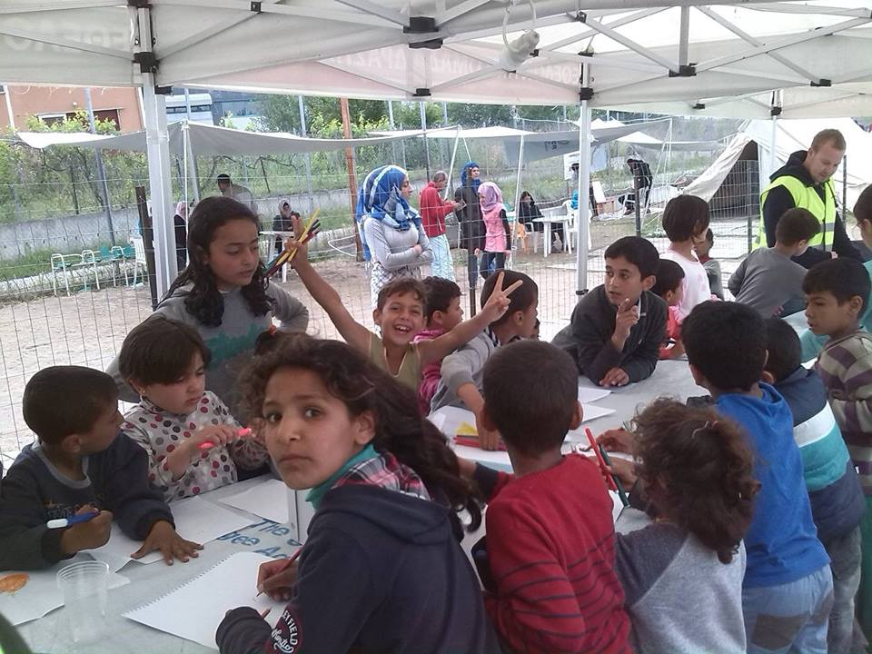
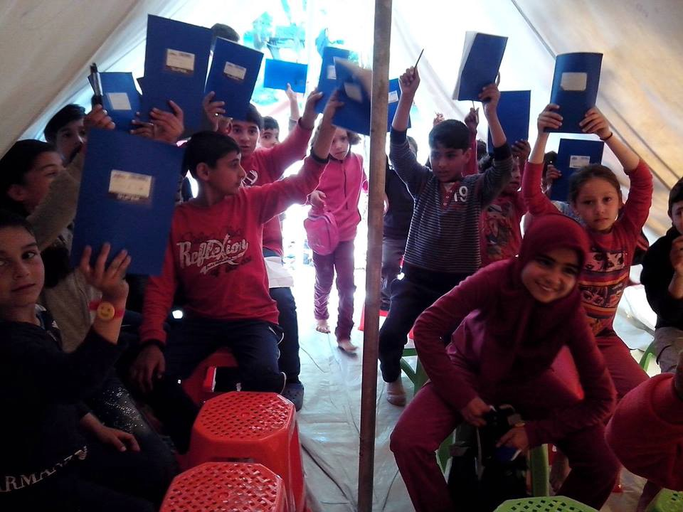
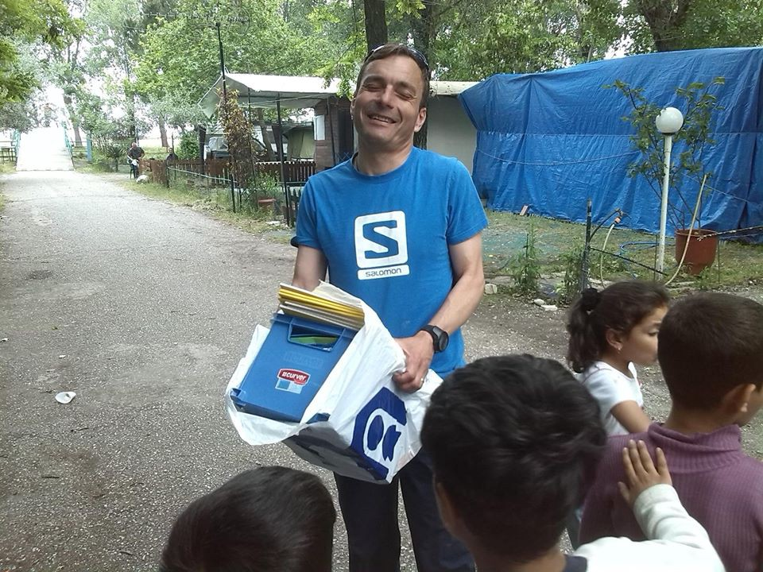
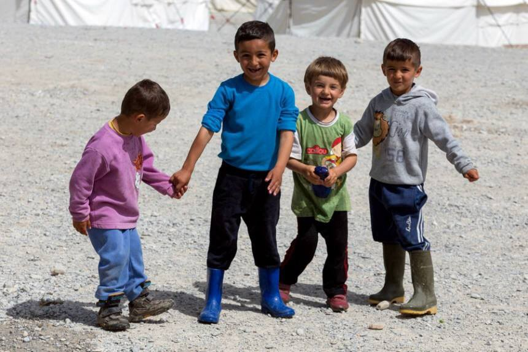
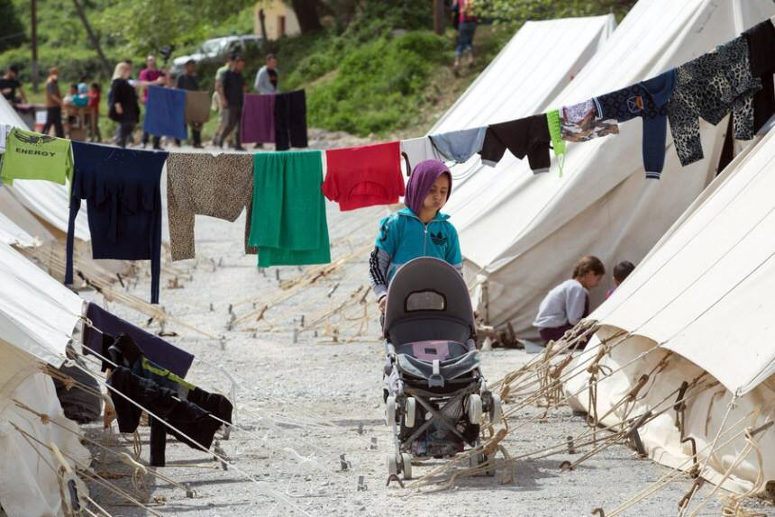

### AYS DAILY NEWS DIGEST 10\.5\.2016\.

Credits: Art Agianst
#### Syria
### Ceasefire has not stopped the violence\.

> _“_ OUT of control _” is how John Kerry, America’s secretary of state, described Syria’s war this week\. “_ A miracle that is now fragile _,” said Staffan de Mistura, the UN envoy to Syria, on the partial ceasefire that had brought a degree of calm since it came into force on February 27th\._ 

> _Violence in Syria is rapidly escalating\. Since April 21st President Bashar al\-Assad’s regime has been blasting Aleppo, the country’s biggest city\. On April 27th the regime bombed al\-Quds hospital, killing more than 55 people\. In February Médecins sans Frontières, a medical charity, stopped giving the co\-ordinates of hospitals it supports to the Syrian and Russian governments\. It worries that pro\-Assad jets are deliberately targeting them\. The rebels are not blameless\. They have intensified their shelling of the government\-held part of the city, making life more dangerous for civilians there\. On May 3rd a mortar shell fired by rebels killed three people in a hospital\. The rebels said they were aiming at a tank nearby\._ 

> _The rate at which people are dying from the fighting is climbing back to where it was before the ceasefire\. In the past fortnight alone, strikes on Aleppo by Mr\. Assad’s regime have resulted in at least 200 deaths\. If the truce is ineffective, it is unlikely that peace talks in Geneva will reconvene \(they ended in acrimony last month\. \)_ 

#### Turkey
### Istanbul clinic at Bezmialem University Hospital’s Fatih branch employs Syrian staff for night shifts through Doctors World Wide\.

> _A [hospital](http://www.hurriyetdailynews.com/istanbul-clinic-employs-syrian-staff-for-night-shifts-.aspx?pageID=238&nID=98973&NewsCatID=373) in Istanbul has been employing Syrian doctors to work evening shifts in order to meet the health needs of mostly Arabic\-speaking Syrian patients, who have limited alternatives for medical treatment in Turkey due to language barriers\._ 

> _A total of seven Syrian doctors and three Syrian nurses, who are members of the non\-governmental organization Doctors Worldwide, have been working evening shifts starting at 5:30 p\.m\. at Bezmialem University Hospital’s Fatih branch to offer health services to mostly Arabic\-speaking Syrian patients, who face difficulties in regular hospitals as they cannot speak Turkish\._ 

> _The staff, which receives 300 patients per day, consists of Syrian doctors and nurses who fled their country in the face of the five\-year\-long civil war which caused a major worldwide refugee crisis\._ 

### Turkey using “anti\-terror” laws as an excuse to limit people’s freedoms\. EU is fine with that\.

> _The European Union says it is moving ahead with plans to allow Turkish citizens to travel to Europe without visas despite President Recep Tayyip Erdogan’s stated refusal to change Turkey’s anti\-terror laws\._ 

> _The EU says Turkey must narrow its definition of “terrorist” and “terrorist act” to secure a visa waiver\. The EU is concerned that journalists and political dissenters are targeted\. Namely, Turkey’s broad definition of terrorism means that any journalist reporting on PKK activities or Kurdish rights can be [charged with the offence of making “terrorist propaganda”](https://www.opendemocracy.net/anna-bragga/turkey-media-crisis-how-anti-terrorism-laws-equip-war-on-dissent) and jailed\. This also applies to anyone critiquing the State, as it has already become famous with the president Erdogan arresting creators of memes and jokes against him\._ 

> _European Commission spokesman Alexander Winterstein said Tuesday that “_ we have the word of the Turkish government and we will continue working with the Turkish government _\.”_ 

> _The Commission has not received official word from Ankara that visa talks have ended\._ 

> _The waiver is an incentive — along with up to 6 billion euros \($6\.8 billion\) and fast\-track EU membership talks — for Turkey to stop migrants leaving for Europe\._ 

](assets/2e90953da1cc/1*HrYd3r1K-lRbp55c_kDkqg.jpeg)

Credits: [Giacomo](http://www.toonpool.com/artists/Giacomo_11567)
### Turkish border guards are shooting and beating Syrian asylum seekers trying to reach Turkey\.

> _Human Rights Watch says Turkish border guards are continuing to shoot and beat Syrian refugees trying to cross into Turkey and is calling on the country to investigate abuses\._ 

> _The advocacy group said in a statement Tuesday that Turkish border guards in March and April used excessive force against Syrians and a smuggler trying to reach Turkey, killing five people, including a child and injuring 14 others\._ 

> _The group also urged Turkey to reopen its border to Syrians\._ 

> _Turkey, home to 2\.7 million Syrian refugees, rejects claims that its border guards shoot at refugees and says it has an open\-door policy toward migrants, although new arrivals are rare\._ 

> _Human Rights Watch researcher Gerry Simpson said: “_ Firing at traumatized men, women, and children fleeing fighting and indiscriminate warfare is truly appalling _\.”_ 

### Deported without a chance to ask international protection\.

> _Hundreds of non\-Syrian asylum seekers deported under the EU\-Turkey migration deal were not allowed to claim asylum in either Greece or Turkey, a group of European politicians has claimed\._ 

> _After interviewing 40 of the deportees, the three MEPs have concluded that, despite EU promises, the deal with Turkey is not being enacted according to international law\._ 

#### Greece
### Teachers needed\!

> _Combine a Greek holiday with a couple of hours a day teaching refugees with [CK Team Lesvos Refugees](https://www.facebook.com/theckteamrefugeeslesvos/) supported schools at Lesvos or Thessaloniki\._ 

Credits: Matt Llewellin

Credits: Matt Llewellin

Credits: Matt Llewellin
### Imprisonment or deportation\.

> _Solidarity Group for refugees in Malakasa reports that refugees whose papers have expired are randomly being arrested and made to choose between imprisonment or deportation\._ 

### Police at Idomeni now requesting receipts for distributed food\.

> _Following yesterday’s report that food wasn’t allowed into the camp, we have heard that controls are becoming tighter\. Food distribution crews now have to present receipts for their food purchases before being allowed to distribute it\. As a result of controls distribution has become less regular, though it still continues\._ 

> _The authorities say they are trying to control black market sale of foods and other products in the camp, but there is speculation that this is being done to make conditions poorer so that people will leave Idomeni\._ 

> _Volunteers please be aware that if you are distributing you may be asked by police to produce receipts\._ 

### Police respond to fighting between Syrians and Kurds at Idomeni\.

> _Greek riot police have fired tear gas to stop a fight involving up to 300 refugees and other migrants at a sprawling tent city on the country’s northern border with Macedonia\._ 

> _Police say it was unclear why fighting broke out Tuesday between Syrian Arabs and ethnic Kurds armed with stones, sticks and metal bars at Idomeni\. At least one man was injured, and no arrests were reported\._ 

> _The camp is home to about 10,000 people thwarted from reaching Europe’s prosperous heartland by a series of Balkan border closures this year\._ 

> _Greek authorities have been trying for months, with little success, to persuade migrants at Idomeni to move to other organized camps, but refugees are, unsurprisingly, anxiously waiting for Macedonian border to open\._ 

### Yazidis stranded due to closed borders\.

> _About 1000 Yazidi people from northern Iraq and Syria are living in refugee camp at Mount Olympus as they are trapped in between the closed borders after the closure of EU borders on February\._ 

Credits: Art Against

Credits: Art Against

Credits: Art Against
### Another hunger strike in Greece

> _Tomorrow, at least a dozen refugees at Souda camp, all Syrian, plan to start a hunger strike in protest of the conditions in the camp\. They plan to sew their mouths shut in the morning and have made a list of four things they demand of the authorities\._ 

> _Meanwhile, the big hunger strike in Ellinikohas been broken\. Volunteers are trying to meet up with a few more refugees who are still not eating\._ 

### Frustrated, trapped and with no movement on their asylum process in sight, 4 refugees try to swim from Greece to Turkey\.

> _Four refugees staying in Souda, one of three camps on the island of Chios, attempted to swim to Turkey on Monday after giving up on the near\-static asylum process\._ 

> _The refugees who tried swimming to Turkey were spotted by volunteers from Drops in the Ocean, a Norwegian charity, who called the Hellenic Coast Guard\. Two speedboats picked up the four swimmers, who were equipped with life\-vests, and brought them to shore\. They had barely gotten out of the harbor in the half\-hour they were in the ocean, but that did not seem to deter some of the people watching\. “_ Tomorrow we will also try _,” they said as the boats disappeared from sight\._ 

#### Hungary
### Hungary approves of more restricted conditions for asylum seekers\.

> _Hungary’s parliament has approved tougher conditions for asylum seekers, including cutting allowed stays at reception centers from 60 days to 30 days and gradually reducing their social benefits and subsidies\._ 

> _Human rights groups say the changes authorized Tuesday by lawmakers are meant to discourage refugees from seeking asylum in Hungary\._ 

> _Julia Ivan, a lawyer with the Hungarian Helsinki Committee, says Hungary is “_ forcing refugees into increasingly worse and unpleasant situations\. _”_ 

### Hungary approves of quota on refugees resettled in its borders\.

> _Hungary’s parliament has endorsed a government\-proposed referendum on the European Union’s plan to resettle refugees within the bloc according to a quota system\._ 

> _The resolution, which can be appealed at the Constitutional Court, was approved 136–5 with support from lawmakers of the governing Fidesz party, its Christian Democratic coalition partners and the far\-right Jobbik party\._ 

> _The referendum — valid if turnout is above 50 percent — is expected to held by October and cost up to 5 billion forints \($18 million\) \._ 

> _The referendum question is: “Do you want the European Union to prescribe the mandatory settlement of non\-Hungarian citizens in Hungary even without the consent of parliament?”_ 

#### Croatia
### Students visit asylum center with helpful phrasebooks and donations\.

> _As a part of their community project, the students of Matija Gubec international school in Zagreb visited the Porin asylum seeker centre today\. The students created a phrasebook containing important phrases in English, Farsi, Arabic and Croatian and handed it out to the people in Porin\. They also donated picture books and books for teens in Farsi and Arabic\. As the inhabitants of Porin also have English and Croatian classes they also donated lots of pencils, erasers, sharpeners, markers, glue and a new clock for their classroom\._ 

#### Slovakia
### Investigation requested after border guard shooting incident wounds refugee woman\.

> _The United Nations refugee agency is urging authorities in Slovakia to investigate an incident in which a refugee woman was shot when border guards fired at a car carrying migrants\. Budapest\-based UNHCR regional spokesman Babar Baloch said that an inquiry is needed to “ensure accountability,” adding that the 26\-year\-old Syrian woman is out of danger but still in intensive care\._ 

> _In Monday’s incident, Slovak police wanted to stop four suspicious cars and opened fire when one driver tried to flee\._ 

> _Slovak state television reported that 11 migrants and six smugglers had been detained and all would be expelled\._ 

> _Baloch said Tuesday that countries’ border management had to be consistent with obligations to protect asylum\-seekers and that more “legal pathways” were needed in Europe so refugees can avoid smugglers\._ 

#### Poland
### Polish Law and Justice Party continues to refuse acceptance of asylum seekers or alternative\.s

> _Poland has accepted less asylum\-seekers per capita than almost any other European nation\. Jaroslaw Kaczynski is the leader of Poland’s ruling Law and Justice \(PiS\) party\. PiS takes a nationalist, right\-wing stance on most issues, vocally opposing [EU](http://www.independent.co.uk/news/world/europe) plans to house and feed refugees fleeing the Syrian civil war and other humanitarian crises\._ 

> _In a [political broadcast](https://www.youtube.com/watch?v=RlwmaTLlLj4) published on YouTube, he said: “After recent events connected with acts of terror, \[Poland\] will not accept refugees because there is no mechanism that would ensure security\.”_ 

> _The European Union has [recently suggested](http://www.independent.co.uk/news/world/europe/countries-refusing-to-accept-refugees-could-be-fined-hundreds-of-millions-of-pounds-a7012761.html) that countries should be asked to accept a quota of refugees, or pay €250,000 \(£200,000\) for each asylum\-seeker they turn away\._ 

> _The money raised would be given to countries such as Greece, Germany and Italy who are currently housing a disproportionately high number of refugees\._ 

> _But Mr Kaczynski also spoke out in opposition to these plans, which would see Poland asked to meet a quota of 6500 refugees or provide over €1\.6bn \(£1\.25bn\) in support for the humanitarian effort\._ 

> _“Such a decision would abolish the sovereignty of EU member states — of course, the weaker ones,” he said\. “We don’t agree to that, we have to oppose that, because we are and we will be in charge in our own country\.”_ 

> _Since taking control of the Polish government in 2015, the autocratic PiS has seized control of state media and the civil service, as well as passing a law to cripple the Polish supreme court by landing it with an unworkable caseload\._ 

#### Italy
### **Rete Solidale Pordenone reports on inefficiency of Italian refugee policies\.**

> “This evening there are 18 people who are sleeping on the street\. We’re still here, looking for blankets or sleeping bags for boys, skinny jeans, sneakers from 41 to 45 and so on and so forth\. We’re still here to show solidarity, to bring some fruit, something to drink or eat, or to even just give a greeting\. 

> These people on the street, continue to be the result of exclusionary policies, governmental short\-sightedness and inefficiency that is still not able to structure a reception that is worthy of that name, not here in Pordenone, nor anywhere else\. 

> When a person asks for the international protection, it must be placed in safe conditions, not left on the road for days and, in some cases, for months\. It is unacceptable and shameful\.” 

](assets/2e90953da1cc/1*DlypupndoLDOp43xi1P9IA.jpeg)

Credits: [**Rete Solidale Pordenone**](https://www.facebook.com/retesolidalepn/?fref=photo)
#### Germany
### The number of newly arriving refugees to Germany is decreasing\.

](assets/2e90953da1cc/1*ismLODzXx8MQsk4_DNnXgQ.png)

Credits: [**Bundesregierung**](https://www.facebook.com/Bundesregierung/photos/a.769938079764597.1073741828.768905426534529/1037294383028964/?type=3&fref=nf)
### Yazidis leave Europe and return to warring Iraq: When death is better than European hatred\.

> _According to [Yazda](http://www.yazda.org/) , a Yazidi advocacy group, ISIL’s assault and occupation of the region led to the [displacement of more than 90 percent](http://www.yazda.org/sample-page-2/) of Iraq’s Yazidi population\. The organisation estimates that around one\-fifth of Iraq’s Yazidis, or 120,000 people, have relocated to Europe\. A small number of Iraqi Yazidi families have returned home after life in Germany failed to meet expectations\._ 

> _One refugee who decided to return says: “_ We were living in a former chicken factory in the city of Oldenberg with hundreds of other refugees and migrants from around the world, and struggled to find anything to fill our days\. I knew nobody _,” he said\. “_ I had no friends\. We thought that anything would be better than Iraq _,” the refugee told [Al Jazeera](http://www.aljazeera.com/news/2016/04/yazidis-leave-europe-return-warring-iraq-160404074817769.html) \. “_ But had we known what the situation would be like, and that we would suffer so much, we would not have gone\. _”_ 

#### Denmark
### Four men rescued after attempting to reach Sweden via sea\.

> _Danish officials have rescued four men who tried to reach Sweden from Denmark after their boat sank in the sea between the two countries\._ 

> _Police spokesman Henrik Moeller Jakobsen said Tuesday a helicopter picked up one man off the Danish island of Saltholm, and flew him to an intensive care unit\. His condition was not immediately known\._ 

> _The others were rescued from the shallow waters off another Danish island and were in a good condition\._ 

> _Moeller Jakobsen said the men had set off Monday “somewhere along the coast\.”_ 

> _He said two of them were Moroccans, but didn’t further identify the men\._ 

> _It was the first known incident where migrants try to reach Sweden by sailing on their own\. Police say more than two dozen migrants have attempted to walk on the bridge and tunnel connecting the two countries\._ 

#### France
### Donations needed for a new camp in Paris\.

> _A new camp is being built in Paris, namely, at Canal St Martin and EOL\. Volunteers building it urgently need resources\. Most needed are: 170 raincoats, 150 sleeping bags, 200 pairs of men’s underwear, 50 shoes, 80 tents, 100 blankets, and lotions\. If you can help, even if with a piece or [, here is where to contact](https://www.facebook.com/ohhh.yeahh?fref=nf) \._ 

#### UK
### Lord Alf Dub’s Amendment passes\.

> _Today, Lord Alf Dubs’ amendment, to give unaccompanied children safe passage to the UK, passed in the House of Commons\! Contact your local councilor and ask them to welcome at least 5 unaccompanied child refugees to your constituency\. That way 3,000 children can be helped\.Find out who your local councilor is [here](https://www.gov.uk/find-your-local-councillors) \._ 

> _This is especially necessary seeing that Britain will not accept any refugee children from camps on the European mainland for up to another seven months, Number 10 has admitted\. The Prime Minister’s spokesman said: “It is a new scheme so we need to work with councils to get it up and running and that is why we expect we will have the first children arriving by the end of this year\.”_ 

> _The delay was criticised by Conservative MPs who said the public “expects an urgent response”\. “We were able to relocate 1000 vulnerable refugees from Syria in three months so it should not take seven months before we relocate vulnerable children from Europe\.”_ 

#### Sweden
### Boat capsizes, four people on board\.

> _A boat carrying four people capsized in the strait of Öresund on Monday afternoon\. One person is currently in a coma\._ 

> _The people were refugees attempting to travel by boat from Denmark to Sweden, Copenhagen police told Danish TV\. Three of the people managed to reach a nearby island, while one was rescued from the water\. At present, two are being treated in hospital, one of whom is receiving life support\. The other two have been brought back to their Danish refugee reception centre\._ 

#### General
### Voluntary Return: How Does It Work?

> _Through the assisted voluntary return and reintegration \(AVRR\) program, the International Organization for Migration \(IOM\) helps migrants going back to their country of origin, if it is safe to do so\. The program is available in Greece, but also in other countries, like for instance Germany and Italy\._ 

> _The option of going back to a country different from the country of origin is not part of the AVRR program that is run by IOM\._ 

> _IOM provides potential returnees with:_ 
 

> _Information and counselling about returns is provided to all migrants potential beneficiaries_ 
 

> _Pre\-departure assistance, including assistance to obtain appropriate documents \(i\.e\. travel documents\) and air tickets, escort to the airport_ 
 

> _Transit and reception assistance_ 
 

> _Small reinstallation grants prior to departure_ 

_Converted [Medium Post](https://areyousyrious.medium.com/ays-daily-news-digest-10-5-2016-2e90953da1cc) by [ZMediumToMarkdown](https://github.com/ZhgChgLi/ZMediumToMarkdown)._
