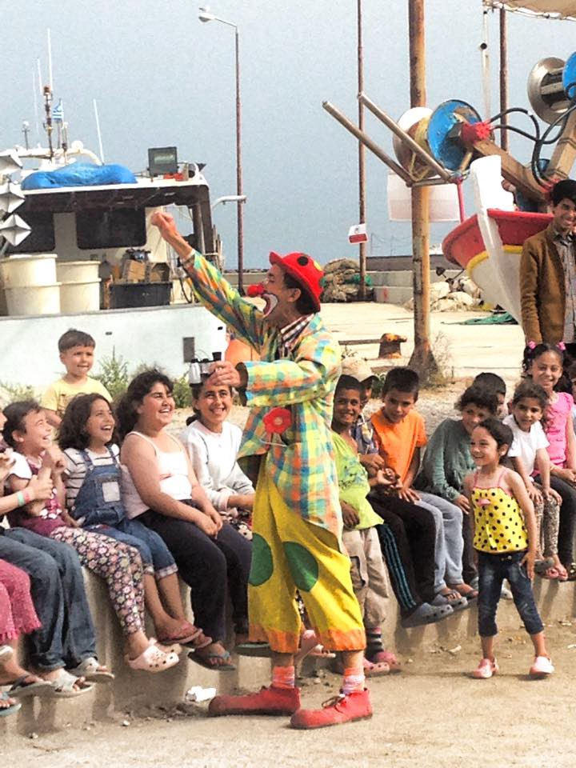
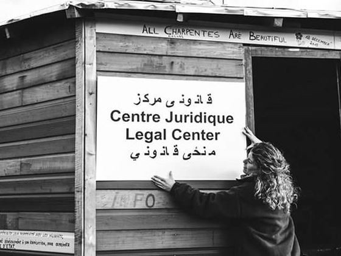
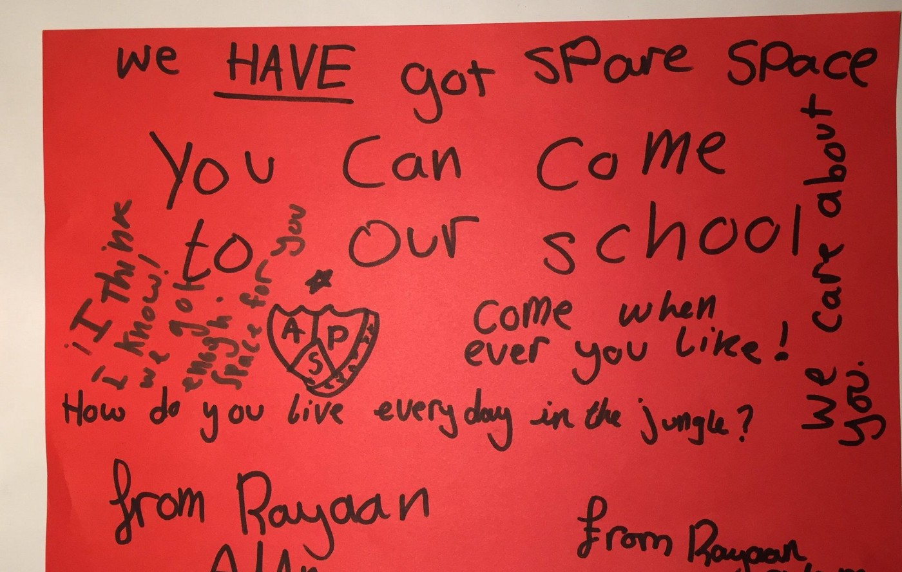

### AYS DAILY DIGEST 12\.5\.2016
#### Around 500 people rescued at Italian shore\. The UNHCR data are showing that more refugees arrived to Italy than to Greece during the month of April\. According to government estimates, there are over 54,000 refugees in Greece now\. However, these number are not reliable and the government has decided to start a process of registration that will last up to six months\. In addition to all the stress they are currently under, refugees in Greece must now also contend with undercover agents who are rooting out extremists\. Arrivals to Germany rapidly decline after EU\-Turkey deal\. Extension of border control checks in Austria, Germany, Denmark, Sweden and Norway for another six months\. The Council of Europe expressed its concern about refugee children in Greece\. The Charter of Idomeni proposed by the Greek journalists

Photo by Richard Klaassen, Chios Estern Shore Response Team
#### Featured story
### Registration of refugees in Greece soon to start\. More refugees now arriving in Italy than Greece\.

> There is no reliable data on how many refugees are in Greece\. All the numbers are just estimations, including the total of 54,542 refugees in this country now\. Yesterday, 130 new arrivals were registered at the islands, mostly Samos and Chios, and two at Kos\. 

> AYS learned about the plans by the Greek government, in close collaboration with the UNHCR, to register all the refugees in the country\. They will probably start a central registration on May 30th\. The plan is to process 1,400 people per day, and register all refugees within the next 6 months\. After registration, refugees will receive a card valid for one year with all the rights of asylum seekers\. Those who are registered will have a date for their asylum application, too\. Greece’s government and UNHCR are hoping that Idomeni and Pireas will be emptied before registration begins\. The process will be promoted in a huge information campaign\. It is very likely that the process will start from Nea Kavala\. It is estimated that each person will need 12 minutes, and 5–7 minutes per family member\. Other hubs for registration will probably be placed at Drama, Larissa, Oreo Kastro, Katsika, Elliniko, Mala Saka, but all the places where there are refugees will be serviced in time\. 

> Government sources are reporting that a total of 150 asylum applications from migrants that entered Greece after March 20th, were rejected\. According to news agency AMNA and their “well informed sources”, the readmission procedure will be launched for those migrants whose applications were rejected\. The same source claims that 50 migrants and refugees that are currently on the island of Chios expressed the wish to be sent back to Turkey within the framework of the European Union \-Turkey agreement\. Their request has been recorded and has been officially submitted to the Turkish authorities\. A new guide on how to prepare for asylum interviews in Greece is available [here](https://docs.google.com/document/d/1aGE4VkuCx2vv3-UGSxg0EA7nw2Q-AxfxPQOHBETxE_E/mobilebasic?pli=1) \. It also includes a directory of free legal aid NGOs in Greece\. 

> Meanwhile, according to the UNHCR, more people escaping from war and poverty, are trying to enter Europe through Italy rather than Greece\. While 9,149 migrants arrived to the shores of Italy in April, Greece received 3,462 people\. In March, 26,971 people arrived to Greece, while 9,676 arrived to Italy\. Arrivals through the Aegean Sea have dropped after the EU\-Turkey deal was launched\. Nevertheless, unlike most of the refugees that are stranded in Greece, those in Italy are primarily from Nigeria, Gambia, Somalia and other Sub\-Saharan African nations\. 

#### Syria
### Assad’s regime stopped humanitarian convoy to Daraya\.

> [Amnesty International expressed concern](https://www.amnesty.org/en/latest/news/2016/05/syria-aid-delivery-to-besieged-daraya/) after the Syrian government refused today to allow humanitarian aid convoy into the town of Daraya\. 

> “The cancellation of the delivery was followed by mortar shelling of Daraya by government forces, killing a father and his son and injuring at least five other civilians\. The delivery would have been the first since the siege began more than three years ago but was eventually cancelled after Syrian government forces held it up for some seven hours outside Daraya\. It included medical and educational items and baby milk but, critically, did not include food\. Not only was the limited aid long overdue, and it excluded food, the number one need for thousands of civilians, but it was blocked and then followed by what appears to have been indiscriminate shelling, killing and injuring civilians,” said Neil Sammonds, Amnesty International’s Researcher on Syria\.” 

#### Greece
### Undercover agents working within refugee camps\.

> At several hotspots in Greece, Europol has deployed a team of undercover agents to locate jihadists and human smugglers, Kathimerini newspaper reports\. Robert Crepinko, the Slovenian director of Europol’s newly\-established European Migrant Smuggling Center \(EMSC\), told [Katimerini](http://greece.greekreporter.com/2016/04/11/europol-undercover-agents-at-greek-hotspots-to-locate-jihadists-traffickers/#sthash.tQtw0QGP.dpuf) that 10 undercover officers are currently stationed on the islands of Chios, Samos, Lesvos and Leros where refugee registration centers are in operation, as well as in Piraeus Port\. The agents are checking suspicious individuals against Europe’s databases in the Netherlands, the report says\. In addition, the undercover agents aid Greek authorities in their effort to locate and stop migrant smugglers operating in Greece\. “We are looking into possible new routes that the migrant smuggling networks would use and we already have some developments in the new routes that have been used by organized crime,” Crepinko said, citing information that migrant traffickers are exploring options through Albania and Bulgaria\. 

### Stamping of refugee papers at Piraeus to restrict newcomers\.

> We heard rumors about stamping of paper of refugees at Port Piraeus\. On the 14th, 15th, 16th and then again on the 18th of April, the Port Authority stamped the back of all refugees’ papers whom currently reside at the Port in order to be able to identify “new comers”\. Since then, many refugees from the border or other camps have made their way to the Port and their papers have not been stamped\. In the last week and a half, the Port authority has decided to enact much stricter identification\. 

> Refugees that have their papers stamped have no issues entering or leaving\. But for those that do not have the stamp, these measures have become a problem\. The checks are becoming more strict and refugees that have no proof of residence at the Port \(the stamp\) are having a hard time\. As we have learned, the Port authority will not stamp any more papers at this point\. 

### Help needed in Lesvos and Samos camps\.

> Help is needed in many places around Greece\. [Octopus Volunteer Team Lesvos](https://www.facebook.com/Octopus-Volunteer-Team-Lesvos-593864180791265/?fref=nf) calls for volunteers in the north of Lesvos to help with children in Mantamados, to help sort clothes in the storage area, prepare food for the refugees , help the local Hope Centre ELPIS, and watching \(coast patrolling\) for arriving boats\. If you can help, find them on their FB page\. 

> Samos Volunteers are asking for help with their new school\. A group of volunteers initiated courses in Farsi, Arabic, English, Greek, but also music, and even zumba\. Today was the first day of the Farsi course\. Samos volunteer are asking for help that will enable them to continue this valuable work\. The teachers will need books, pens and other materials to keep these classes going\. Please see [Ana Adlerstein](https://www.facebook.com/ana.adlerstein) ’s profile for more info or [https://www\.gofundme\.com/samos4refugees](https://www.facebook.com/l.php?u=https%3A%2F%2Fwww.gofundme.com%2Fsamos4refugees&h=sAQEA0FNTAQFMc4g2K3s37HuBraQ8rIzofUs3psJb3dQyUQ&enc=AZPD31VtGKu23wEGOySeBadih0UMPAlua59b74X7qrguJiVZMgy02ZggQJSQkHsnDfTrnjJWVMP_1CTP1Fnli1kaMpALSXypjshTLUJEkPUFwxq2X6DA_AbcKFRJJtw-vfTnlID_aee4JYr3IUXOCwYuitaFWTO3_TNhik9tV6RPHiQUUI269hT_CZqGH2jv8lo&s=1) 

### Mass vaccinations begin in Idomeni\. Weather warning for Islands\.

> The mass vaccination campaign in Idomeni continues\. Doctors Without Borders \(MSF\), working in conjunction with volunteers, are aiming to vaccine all the children in the camp between the ages of 6 months and 15 years for MMR, DPT, Hep B and polio\. They’ve already done EKO station and BP/Hara, now they’re doing 3 days at Idomeni\. 

> Severe weather warnings for Greek islands\. For all those who are planning to travel, they should be aware of waves that could be up to 3m high\. For more on weather visit [SAO FB page](https://www.facebook.com/save.assist.outreach/?fref=nf) \. 

#### Italy

**500 people rescued near Italy\.**

> The Italian Coast Guard rescued two boats with around 500 people, mostly Syrian refugees\. They drifted several days after leaving Egypt\. No more information is available for now\. UNHCR confirmed the information\. 

#### France
### Help needed for the legal team in Calais\.

> Help is needed in Calais, too\. The amazing Legal Shelter Cabane Juridique is leading the charge on French asylum process advice, documenting and bringing to justice cases of police violence and right\-wing attacks\. They’re doing an amazing job, but they are struggling\. 

> [Please consider donating to them, to ensure they can continue their incredible work\!](https://www.youcaring.com/marianne-humbersot-cabane-juridique-de-l-appel-de-calais-557526) 

### Showing support for the children of Calais Camp\.

> Care4Calais is calling on all of us to join them in their efforts to show support for refugee children living in Calais camp\. Currently, there are 157 kids who have been identified as having family links in the UK\. “We’ve teamed up with members of the National Union of Teachers to help raise awareness and urge the government to act quickly\. So far we have collected over 100 messages of support for the children in Calais from children in the UK to show that these children are welcome\! Please get involved and show your support by: 

> \-Writing a message 

> \-Taking a photo 

> \-Posting it to Facebook, Instagram & Twitter 

> Tagging @Care4Calais and hashtag [\#Care4Calais](https://www.facebook.com/hashtag/care4calais?source=feed_text&story_id=1190991934267095) \. 

Care4Calais
#### Germany
### Fewer arrivals to Germany since April\.

> Since the EU\-Turkey deal was put in place, arrivals in Germany have rapidly declined\. In April, 16,000 arrived, compared with 120,000 arrivals last December\. However, Angela Merkel and her Christian Democrat \(CDU\) party are subjected more and more to criticism over their refugee policy, and as result, they are losing voter support\. The party making gains is the anti\-immigrant Alternative for Germany \(AfD\) that moved from a marginal party to having 15 percent support nationally\. 

### Police investigating claims about extremists in Germany\.

> German authorities are investigating claims that 40 Islamist militants are among the asylum seekers who have traveled to the country\. Police stated they had received 369 reports of possible extremism, and found that roughly one\-tenth of the cases needed to be investigated\. Hans\-Georg Maassen, the head of Germany’s domestic intelligence agency, had warned that the Islamic State militant group was attempting to “send a political signal” by using the refugee route to stoke fears in Europe\. 

#### General
### Extention of border control checks in EU\.

> The European Council agreed to extend existing border control checks in Austria, Germany, Denmark, Sweden and Norway for another six months because of “deficiencies” in the protection of EU external borders in Greece\. The recommendation authorized Austria to continue checks at its borders with Hungary and Slovenia\. 

### Treatment of children in Greek camps reason for concern\.

> [Council of Europe expressed its concerns](https://search.coe.int/cm/Pages/result_details.aspx?ObjectId=0900001680648495) about the treatment of refugee children in Greece, in particular in relation to detention\. According to the COE, one of the most compelling questions “to be urgently addressed” in Greece “is that of children’s deprivation of liberty\.” The report claims that after the EU\-Turkey agreement entered into force, “children being de\-facto deprived of their liberty next to the hot spots, while waiting for their asylum applications to be processed and possible appeals to be heard”\. 

> According to COE, the lack of alternatives to detention for children refugees appears to be a structural problem in Greece and the number of shelters for children should be quickly improved\. 

> COE asked Greek authorities to address the issue of education\. “Children of asylum seekers and children seeking international protection have access to the Greek education system under the same conditions as Greek children” but in practice they have limited access to the education system, as many schools ask for documents not required by law\. 

> The Council of Europe urged Greek authorities to follow up on reports that say refugee children could be involved in criminal activities such as drug trafficking and prostitution\. 

### The Charter of Idomeni receives support among journalist groups\.

> [The European Federation of Journalists \(EFJ\) “strongly supports”](http://europeanjournalists.org/.../greek-journalists.../) the initiative of its affiliate in Greece the Journalists’ Union of Macedonia and Thrace Daily Newspapers \(ESIEMTH\) — who drafted a proposal for the adoption of the Anti\-racism Ethics Code of the Greek journalists called The Charter of Idomeni, named after the location at northern border\. The Charter explains that it aims at preserving “the social role of journalists in the conditions created by the presence of refugees, migrants, minorities and socially vulnerable groups in Greece, discourage and denounce climates of intolerance, guarantee the right to freedom of expression and press freedom and the rights of refugees and provide journalists with conditions of voluntary commitment in performing their duties”\. The draft has 11 articles and is described as a practical guide for local and foreign journalists covering the migrant issues\. The draft has also received the support of the Italian NGO Carta di Roma\. 

### MSF in Bekaa Valley

> MSF are working, among other places, in Lebanon’s Bekaa Valley where Syrian refugees are living in makeshift tent settlements under harsh conditions, without legal rights and right to work\. To find out more, visit MSF you tube channel\. 

_Converted [Medium Post](https://areyousyrious.medium.com/ays-daily-digest-12-5-2016-551b4cff5a69) by [ZMediumToMarkdown](https://github.com/ZhgChgLi/ZMediumToMarkdown)._
