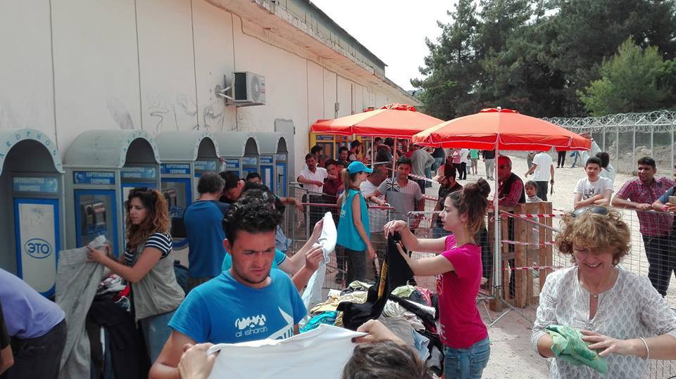
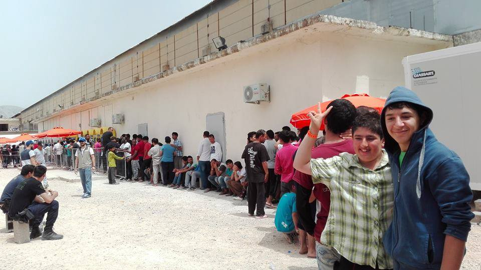
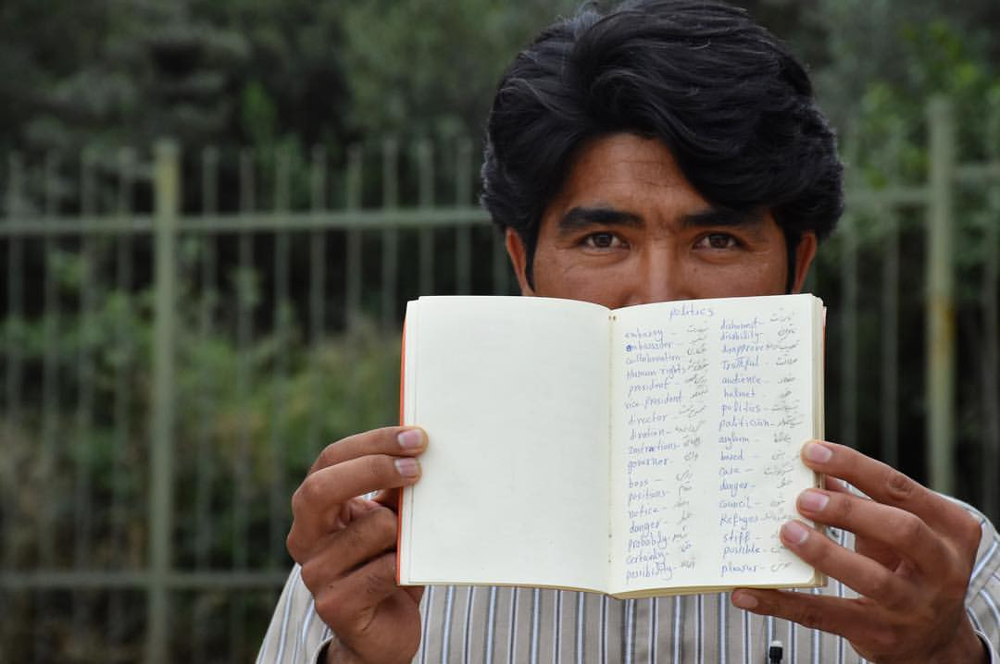
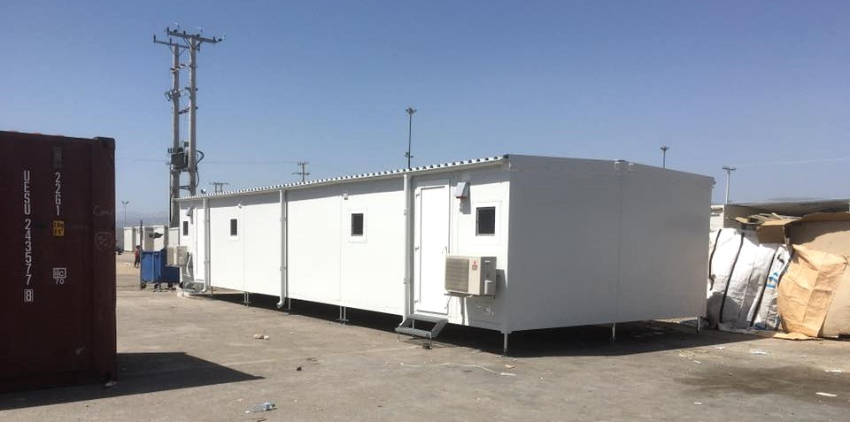
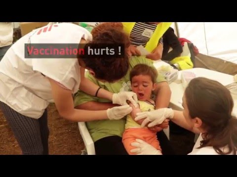
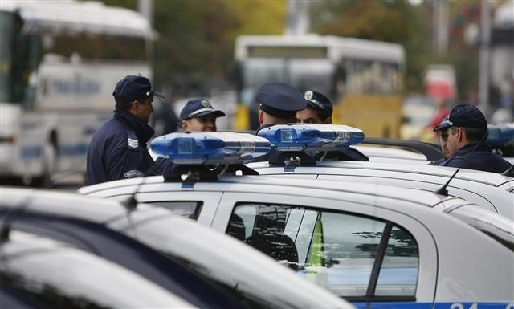
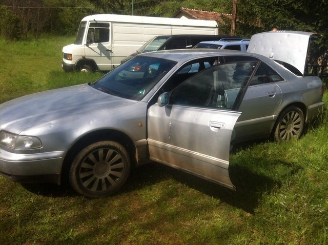
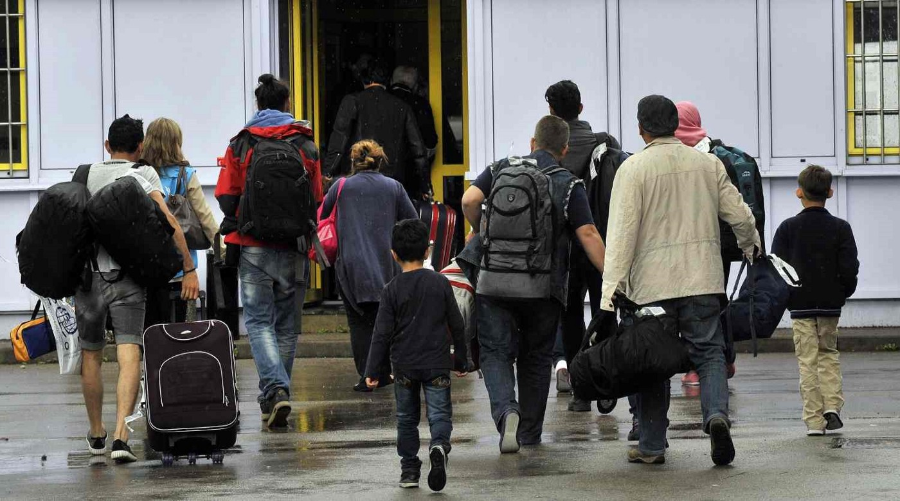
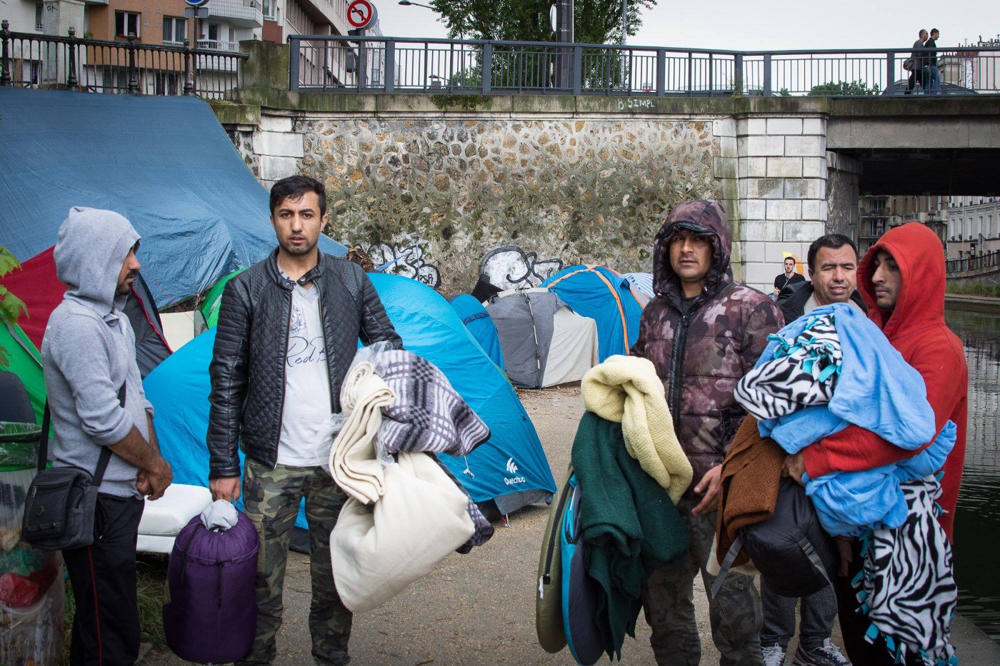
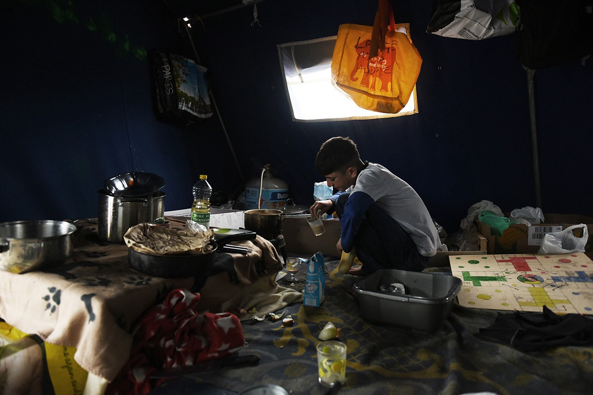

### AYS DAILY NEWS DIGEST 13\.5\.2016\.
#### UNESCO World Heritage site Church of Saint Symeon Stylites damaged in a Russian air strike near Aleppo\. Afghan teachers fighting for the right to education inside Elliniko camp\. Massive response to MSF’s free vaccination campaign in Idomeni\. Bulgarian police detain 75 refugees, smugglers in countrywide sweep\. Surges in illegal crossings on Balkan and Mediterranean land routes, army reinforcements on the borders of Italy and Bulgaria\. First group of 28 refugees arrive to Slovenia under the relocation scheme from Greece\. Calais needs volunteers for the upcoming census\.

](assets/93ce553e7ce9/1*NLaVknmyzXCU2RpdyeqTZA.jpeg)

Food distribution in Salihli, Turkey\. If you want to donate money or food for the refugees, please contact [**İmece İnisiyatifi Çeşme**](http://imececesme.com/)
#### SYRIA
### UNESCO site Church of Saint Symeon Stylites damaged by at least three Russian missiles\.

> Around or just after midnight on Friday, 13th of May 2016, [an NGO](http://tda-sy.org/) reported that a Russian airstrike hit the UNESCO World Heritage site of Qal’at Se’man, otherwise known as the Church of Saint Symeon Stylites\. The church is located approximately 30 km northwest of Aleppo in the region known as limestone massif\. In [a report written for AYS](https://medium.com/@AreYouSyrious/ays-report-unesco-world-heritage-site-of-qalat-se-man-destroyed-in-a-russian-airstrike-c2ea4d36b8f3#.awnggb2hq) , Byzantine art historian Shannon Steiner says the Church building itself is entirely unique in the history of medieval Christian architecture\. 

 \.](assets/93ce553e7ce9/1*tGAzGtdg9k-gyvTM9wTC_Q.jpeg)

Significant damage to the eastern\-most pediment of the south basilica narthex facade and damage to the wall adjoining the cloister/monastery, where one of at least three rockets hit the monument\. Full preliminary analysis of the damage is available in a [piece written by Byzantine art historian Shannon Steiner for AYS](https://medium.com/@AreYouSyrious/ays-report-unesco-world-heritage-site-of-qalat-se-man-destroyed-in-a-russian-airstrike-c2ea4d36b8f3#.c9a1ca1ii) \.

> When the revolution began in Syria, Qal’at Se’man became an important stronghold for opposition groups\. It has been difficult to track who has had control of it, but it has belonged alternately to the Islamic Front and to Kurdish groups\. These groups have mostly used the church to store food and medical supplies\. An unknown Islamist group filmed a video of women firing rifles in front of the church’s iconic façade in 2015, but neither ISIS nor Al\-Nusra etc\. ever claimed responsibility for it\. This is important, because Russia has justified these airstrikes as targeting ISIS\. This airstrike cannot have been motivated by any fight against ISIS, because ISIS has literally never been anywhere near this monument\. The airstrike can only have been motivated by the goal of cutting off food and medical supplies to opposition forces\. In the meantime, they have also caused serious damage to one of Syria’s most important cultural heritage monuments, a building that Syrians have lived around and loved and honored for over 1500 years\. 

#### GREECE
### Frontex boasts huge drop of new arrivals\.

> The number of refugees arriving on the Greek islands in April plunged by 90% compared to the previous month, reaching fewer than 2,700\. According to Greek authorities, there are 54,703 refugees stranded in the country, including 8,615 on the islands, 14,437 in Attica region, 2,036 in Central Greece, 321 in Southern Greece, and as many as 29,294 refugees in Northern Greece, including 9,305 still remaining in Idomeni camp\. 

> “The drop in the number of arrivals on the Greek islands was dramatic\. The total for all of April is well below the number of people we often saw reaching just the island of Lesvos on a daily basis during last year’s peak months,” said Frontex Executive Director Fabrice Leggeri in today’s statement\.” 

### Clothes distribution in Vial finally working

> Hot spot Vial on Chios, a home for 2,419 often mistreated refugees, remains one of the saddest places in the country\. This week Chios Eastern Shore Response Team \(CESRT\) joined forces with UNHCR, Samaritan’s Purse and NRC to do the first large scale clothing distributions in Vial since March 20th\. The vast majority of clothing distributed came from the donations CESRT has received over the last few months, while refugees were still arriving in large numbers\. CESRT volunteers say the cooperation with big NGOs is important not only for getting the access to the camp, but also for managing large\-scale distribution in a place like Vial\. 

Men’s clothes distribution has started inside Vial camp on Chios: PHOTO: Chris Trafford

> “Vial is hot and dusty and we all worked long hours to make these distributions work\. Crowd control was hard work, people in Vial have been neglected for so long whilst the NGO’s were denied effective access\. On the whole I think people were very happy\. It was a pleasure to return two days after the children’s clothing distribution to distribute to the women and see so many children in the really lovely clothes I have been looking at in the warehouse for weeks\. Beautiful dresses and striking t\-shirts being proudly worn by kids, some of whom were still in the worn out clothes they had arrived in from Turkey just days before\. After the women’s distribution on Tuesday a group of husbands gathered to give us a round of applause as we left\. After scouring the island for men’s trousers, calling in supplies from Athens and a last minute dash to Nenita; yesterday around 1030 we finally began distributing men’s clothes in Vial”, wrote Chris Trafford from CESRT in his testimony\. 

Young refugees waiting to get the new clothes in Vial camp on Chios; PHOTO: Chris Trafford
### Refugee teacher can’t get permission to teach English in Elliniko camp, asks for help\.

> An Afghan refugee staying at Elliniko camp says the camp became more like a prison, with no volunteers or journalists allowed to approach them\. The food is scarce, there’s no psychological help for those who need it, and recently 15 people who tried to protest the situation were thrown out of the camp\. Mohammad feels educational programs might help people in the camp, but they are not allowed to congregate and exchange knowledge in a classroom\-like manner\. Here’s a part of his letter to volunteers, asking for help: 

> “I was teacher in Afghanistan and me and another teacher who lives here in the camp want to start English classes for children and adults in the camp\. It is very needed, as there are a lot of people that don’t understand or speak the language and they can’t communicate or understand the people here\. However, the manager of the camp doesn’t want us to teach English\. We have asked several times, and she said that refugees don’t need to learn English\. We don’t need anything from her, just the permission to gather and teach, because we have the materials\. Can anyone help to ask the camp manager \(a Greek woman\) why we can’t teach here? Thank you very much for your support\.” 

Mohammad Niaz, a 28 year old Afghan teacher, posing with his makeshift dictionary; PHOTO: Mina Mohit

> If you manage to negotiate anything with the camp manager, or have some really useful advice for Mohammad, [please let him know](https://www.facebook.com/mohammad.niaz.9) \. 

### Volunteers needed in Piraeus\.

> According to official numbers, there are 1,446 refugees staying in the port of Pireaus\. Drop in the Ocean team remains busy cooking food, maintaining the showers, distributing non\-food items and tea as well as organizing sports activities and taking care of kids on a daily basis\. Besides maintaining their presence in Pireaus, they’re now preparing to set up a couple of new projects in Skaramagas, an official camp near Athens\. In order to hit the ground running they will need a solid group of enthusiastic volunteers eager to get busy, so [contact them](http://drapenihavet.no/en/we-need-volunteers/) if you feel like helping\! 

### Warehouse repairs and school opening announced in Skaramagnas camp\.

> Things are finally moving forward in Skaramagnas camp, where weekly meetings of all the NGOs, UNHCR and Red Cross with the camp manager were introduced to organize, structure, and communicate\. On today’s meeting, volunteers learned that warehouse repairs will begin next Wednesday at the latest and will take about two days to finish\. This means they can begin to organize and restock the warehouse in approximately a week, following last weekend’s break\-in, when angry refugees stormed the warehouse and took everything, including the donated shelves\. 

New Skaramagnas school facilities; PHOTO: Norman Hering

> According to volunteer Norman Hering, a mobile unit with two classrooms was recently donated to Skaramagnas camp\. The school will be open soon\! 

### Massive response to free vaccination campaign introduced by MSF in Idomeni\.

> The vaccination campaign run by Doctors Without Borders \(MSF\) and their partners such as Syrian American Medical Society \(SAMS\) continues in Idomeni camp\. Families began arriving in the early morning, queuing all day to keep their children safe from diseases\. 

> MSF is using 3 vaccines, covering 10 different antigens\. Among them and for the first time in Europe, they’re vaccinating against pneumonia, the leading cause of child mortality globally\. MSF says they plan on vaccinating 5,000 children in Idomeni\. 

#### MACEDONIA
### Increasing number of people caught while trying to cross the Greek\-FYROM border\.

> Macedonian authorities report that an increasing number of people have been caught while trying to irregularly cross the Greek\-FYROM border\. Most of them are from Pakistan, Afghanistan, India and Iraq\. 

> According to [News That Moves](https://newsthatmoves.org/en/) , people crossing irregularly into FYROM will first be transferred to the camp in Gevgelija, and then returned to Greece\. According to the FYROM Asylum Law, amended on April 4th, claims submitted by persons who crossed irregularly from a “safe third country” like Greece will be considered unfounded\. Only ill and injured refugees can be transferred to the Asylum center in Gazi Baba in Skopje\. 

> “Refugees entering irregularly in FYROM have no chance to claim asylum and are pushed back to Greece by FYROM authorities”, said the police spokesman Toni Angelovski\. 

> According to official police reports, in April around 300 refugees were caught in cars and trucks by the Macedonian police authorities after they crossed the Greek\-FYROM border irregularly\. Between May 1 and May 10, 188 refugees were caught\. The number is up from 100 people in March\. Macedonian police also report that people are usually transported by smugglers by car and by truck, often in appalling conditions, from Idomeni to Macedonia and then to the Serbian border\. The number of refugees in Gevgelija and Tabanovce camp dropped for almost 30% in the past four weeks, as many are trying to reach Serbian\-Hungarian border and continue their trip to EU countries\. 

> Meanwhile, Macedonian army [decided to retreat half of it’s border keeping personnel](http://alfa.mk/News.aspx?id=109329#.VzZPQPl96Um) due to amortizations and high costs\. 

#### BULGARIA
### Large\-scale police operation against illegal migration: 75 refugees and smugglers caught\.

> A large\-scale police operation against illegal migration is taking place in downtown Sofia and several other places across Bulgaria on Friday morning\. There is a heightened police presence in the area of the Maria Luisa boulevard and Lavov most \(Lions’ bridge\) in the centre of the Bulgarian capital, which is a popular gathering place for refugees\. At present, the interior ministry refuses to disclose any further information, noting that the results of the operation will be announced later on Friday, private bTV station informs\. 

Police officers searching for illegal migrants in downtown Sofia; PHOTO: Novinite

> Speaking to the Bulgarian National Television \(BNT\), Interior Minister Rumyana Bachvarova explained that this is a routine specialized operation which is conducted periodically whenever it is deemed necessary\. Authorities are checking for illegal migrants in the interior of the country, which is part of Bulgaria’s approach to tackling the migrant pressure\. Bachvarova noted that the approach to tackling the refugee influx involves control at the entry and exit points as well as in the interior of the country\. The operation was carried out on the order of the interior ministry’s chief secretary, Georgi Kostov\. Participating officers were from the border police, migration directorate, Sofia directorate of the interior ministry and eleven other regional directorates of the ministry\. Police is conducting checks of hotels, hostels and other places of accommodation as well as vehicles and various retail establishments\. 

Veichles left by the smugglers after a raid in Bulgaria; PHOTO: Bulgarian Ministry of Interior

> Bulgarian police detained 75 people in raids targeting irregular migrants and human traffickers across Bulgaria, the Ministry of the Interior announced later on Friday\. Sixty\-two foreign citizens illegally residing in Bulgaria as well as 34 people involved in human trafficking have been found by late Friday afternoon during the large\-scale operation that started in the morning\. 

> Fifteen irregular migrants — nine men, two women and two boys traveling in two vehicles — were detained after a police chase on a road linking the Sofia neighborhood of Filipovtsi with the town of Tran, on the border with Serbia, the ministry said in a statement\. All of the detained migrants claimed they were of Afghan origin\. [According to Novinite](http://www.novinite.com/articles/174468/Bulgarian+Police+Detain+75+Migrants%2C+Human+Smugglers+in+Countrywide+Sweep) , the driver of one of the vehicles, a van, was detained in 24\-hour police custody\. The driver of the other vehicle, a car, escaped and police launched a search for him\. 

#### SLOVENIA
### First group of 28 refugees arrive to Ljubljana under the relocation scheme from Greece\.

> Twenty eight people from Syria and Iraq arrived yesterday to Slovenia under the provisions of relocation program from Greece\. They will be temporarily stationed in an asylum center in Ljubljana, but families will be relocated to a separate center\. Upon receiving asylum, they will be housed in both Ljubljana and Maribor, [according to local press](http://www.rtvslo.si/begunska-kriza/foto-v-slovenijo-so-prisli-prvi-begunci-iz-solidarnostne-sheme/392804) \. 

Refugees arriving to their temporary accomodation in Ljubljana; PHOTO: BoBo
#### ITALY
### Italy deploys 110 more guards to patrol Alpine pass after warning from Austrian officials\.

> Italy said on Friday it had deployed 110 more guards to patrol the Alpine crossing point between the two countries, in order to keep refugees from traveling into Austria, after Vienna threatened to introduce tighter border controls that could have hurt trade routes by slowing down traffic\. 

> “Migrants who arrive here thinking to go to Austria will be taken to Italian shelters”, said Italian Interior Minister Angelino Alfano at the Brenner Pass\. 

> As of May 10th, 31,250 refugees had reached Italy by boat this year, a 14 percent decline from the same period last year, according to the Interior Ministry, but authorities expect the numbers to surge this summer\. The fence between Italy and Austria has not been built, but preparations for future controls are still being made as a precaution, an Austrian Interior Ministry spokesman said, according to [Reuters](https://www.yahoo.com/news/italy-ups-migrant-controls-alpine-pass-stop-austrian-160035277.html?ref=gs) \. 

### New refugee welcome service in Pordenone\.

> Rete Solidale Pordenone group has set up a very useful [webpage providing useful information](http://www.sconfini.net/) for refugees who arrive to Pordenone region\. 

#### FRANCE
### Calais volunteers concerned about conditions of Paris refugees\.

> This week [Care4Calais](http://www.care4calais.org) volunteers took essential supplies to refugees in Paris\. The situation is very different to Calais with refugees settling in public spaces within the town itself\. Although some housing is supplied, families and children are prioritized and there are a lot of men sleeping rough on the streets\. There are French charity organizations giving assistance but their resources are stretched\. Even for those applying for asylum in France the process can take many months and no support is provided in the meantime\. Challenges include skin conditions, diseases, parasites as a consequences of very poor hygiene and lack of toilet facilities\. 

Refugees sleeping in the streets of Paris; PHOTO: Care4Calais

> One of the camps is situated by a canal in St\. Martin, not far from metro station Jaures, and the other is around a park called Eole — among many shops, bars, restaurants, and is hosting around 100 people\. According to a Care4Calais [report](https://www.facebook.com/care4calais/posts/1191906200842335) , some asylum centres are in the middle of nowhere, where not even food is provided\. Refugees can become lonely, anxious and isolated, which then draws them back to the centre of Paris even if it means sleeping on the streets\. Feeling disempowered, marginalised and stigmatised, it is not only aid and basic necessities that they need, but friendships, emotional support and a feeling that they are a part of the world, not cut from it\. 

### There are 294 unaccompanied children living in Calais: can you help to carry on the census?

> There are currently 294 unaccompanied children living in the Calais refugee camp known as ‘The Jungle’, with another 129 having gone missing, after French authorities demolished the southern section of the camp back in March, according to a report from [Help Refugees\.](http://www.helprefugees.org.uk/) Getty Images photographer Mary Turner [visited the Calais camp](http://www.ibtimes.co.uk/refugee-crisis-daily-lives-unaccompanied-children-calais-jungle-hoping-reach-britain-1559737) , documenting the daily life of some of the unaccompanied children who are waiting to be allowed access to Britain\. 

Young Calais resident still hoping to reach United Kingdom; PHOTO: Mary Turner

> For the first time in the history of the Calais Jungle, we have been able to formulate accurate statistics on its population and its movement thanks to Help Refugees, who are working on Calais statistics on a monthly basis\. The most recent Census has found a pattern of steady increase in the population, and a disproportionate increase in unaccompanied child refugees\! Based on this they can start predicting the scale of the influx of new arrivals over the summer\. But they need your help to carry on this vital statistical work\. If you have previous experience volunteering in Calais and knowledge of the camp, which is absolutely vital, are available May 27th\-30th and can help with data processing, please write to annie@helprefugees\.org\.uk with a cover letter including your short resume, full name, date of birth and contact number\! 

### State taking over Grande Synthe camp?

> [The Association Utopia56](http://www.utopia56.com/en/) has coordinated the opening of the humanitarian camp Grande Synthe since its opening on 7 March\. Now the State has announced that it’s gonna take over the management and volunteers are currently awaiting information\. Refugees can count on them: between 50 and 100 volunteers from all over Europe, enrolling every day to different items necessary for daily life of the camp, to ensure the distribution of food, clothing, Eve fire, the reception of new refugees, the laundromat, the construction of collective kitchens, etc\. They call the volunteers to stay engaged and to [register on their websit](http://Utopia56.com) e to come help in the camps of the Nord Pas de Calais where volunteer action is necessary\. 

_Converted [Medium Post](https://areyousyrious.medium.com/ays-daily-news-digest-13-5-2016-93ce553e7ce9) by [ZMediumToMarkdown](https://github.com/ZhgChgLi/ZMediumToMarkdown)._
